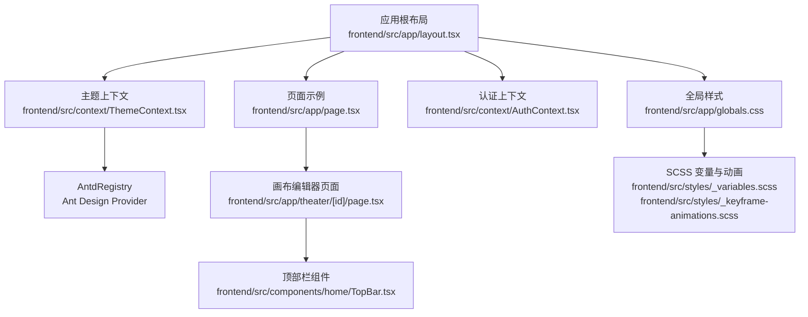
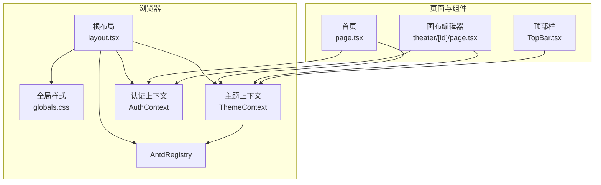
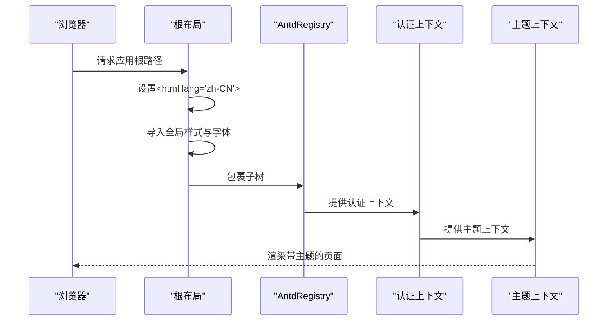
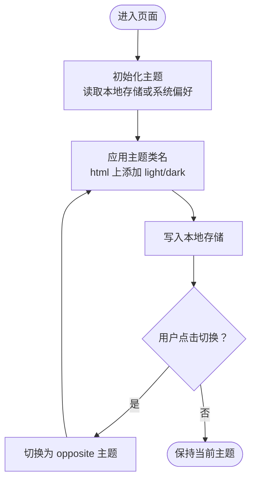
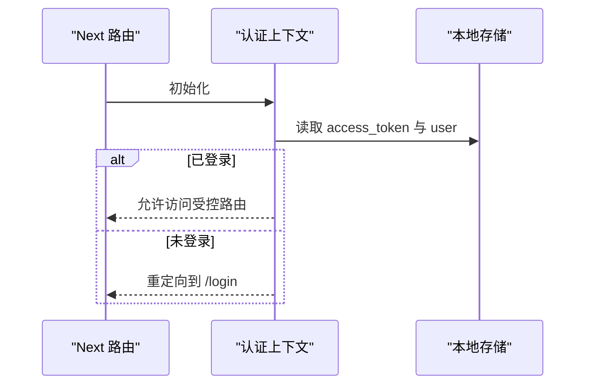
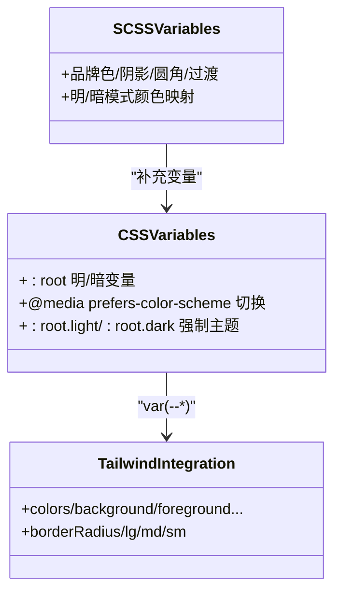
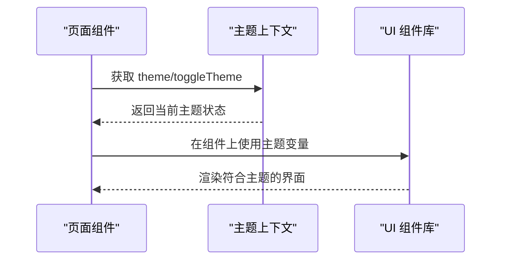
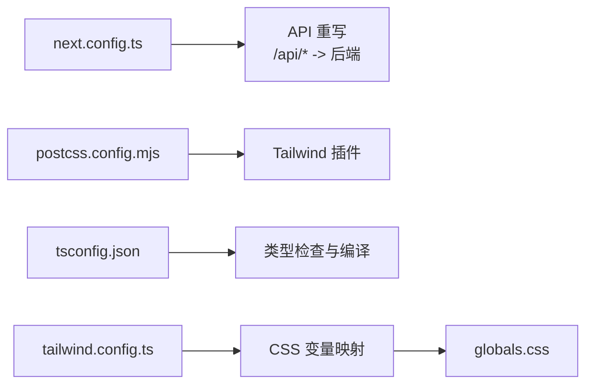

# 应用布局和导航

<cite>
**本文引用的文件**
- [frontend/src/app/layout.tsx](file://frontend/src/app/layout.tsx)
- [frontend/src/app/globals.css](file://frontend/src/app/globals.css)
- [frontend/src/context/ThemeContext.tsx](file://frontend/src/context/ThemeContext.tsx)
- [frontend/src/context/AuthContext.tsx](file://frontend/src/context/AuthContext.tsx)
- [frontend/src/styles/_variables.scss](file://frontend/src/styles/_variables.scss)
- [frontend/src/styles/_keyframe-animations.scss](file://frontend/src/styles/_keyframe-animations.scss)
- [frontend/src/app/page.tsx](file://frontend/src/app/page.tsx)
- [frontend/src/app/theater/[id]/page.tsx](file://frontend/src/app/theater/[id]/page.tsx)
- [frontend/src/components/home/TopBar.tsx](file://frontend/src/components/home/TopBar.tsx)
- [frontend/src/components/tiptap-templates/simple/theme-toggle.tsx](file://frontend/src/components/tiptap-templates/simple/theme-toggle.tsx)
- [frontend/next.config.ts](file://frontend/next.config.ts)
- [frontend/tailwind.config.ts](file://frontend/tailwind.config.ts)
- [frontend/postcss.config.mjs](file://frontend/postcss.config.mjs)
- [frontend/tsconfig.json](file://frontend/tsconfig.json)
</cite>

## 目录
1. [简介](#简介)
2. [项目结构](#项目结构)
3. [核心组件](#核心组件)
4. [架构总览](#架构总览)
5. [详细组件分析](#详细组件分析)
6. [依赖关系分析](#依赖关系分析)
7. [性能考量](#性能考量)
8. [故障排查指南](#故障排查指南)
9. [结论](#结论)
10. [附录](#附录)

## 简介
本文件面向 Infinite Game 前端应用的布局与导航体系，围绕 Next.js App Router 的根布局配置、全局样式与字体、Ant Design 注册中心（AntdRegistry）集成、主题上下文与明暗主题切换、HTML 根元素与语言设置、元数据管理、响应式设计与动画、以及国际化与 SEO 相关配置进行系统化说明。文档同时提供布局组件使用示例与最佳实践，帮助开发者快速理解并扩展应用布局。

## 项目结构
前端采用 Next.js App Router 结构，关键入口为应用根布局文件，负责注入全局样式、字体、国际化与主题上下文，并通过 AntdRegistry 为 Ant Design 组件提供服务端渲染兼容能力。页面级布局与业务页面分别位于 app 目录下，组件按功能模块组织在 src/components 中。

**图表来源**
- [frontend/src/app/layout.tsx:1-42](file://frontend/src/app/layout.tsx#L1-L42)
- [frontend/src/app/globals.css:1-407](file://frontend/src/app/globals.css#L1-L407)
- [frontend/src/context/ThemeContext.tsx:1-74](file://frontend/src/context/ThemeContext.tsx#L1-L74)
- [frontend/src/context/AuthContext.tsx:1-110](file://frontend/src/context/AuthContext.tsx#L1-L110)
- [frontend/src/app/page.tsx:1-19](file://frontend/src/app/page.tsx#L1-L19)
- [frontend/src/app/theater/[id]/page.tsx](file://frontend/src/app/theater/[id]/page.tsx#L1-L484)
- [frontend/src/components/home/TopBar.tsx:1-118](file://frontend/src/components/home/TopBar.tsx#L1-L118)
- [frontend/src/styles/_variables.scss:1-297](file://frontend/src/styles/_variables.scss#L1-L297)
- [frontend/src/styles/_keyframe-animations.scss:1-176](file://frontend/src/styles/_keyframe-animations.scss#L1-L176)

**章节来源**
- [frontend/src/app/layout.tsx:1-42](file://frontend/src/app/layout.tsx#L1-L42)
- [frontend/src/app/globals.css:1-407](file://frontend/src/app/globals.css#L1-L407)
- [frontend/src/context/ThemeContext.tsx:1-74](file://frontend/src/context/ThemeContext.tsx#L1-L74)
- [frontend/src/context/AuthContext.tsx:1-110](file://frontend/src/context/AuthContext.tsx#L1-L110)
- [frontend/src/app/page.tsx:1-19](file://frontend/src/app/page.tsx#L1-L19)
- [frontend/src/app/theater/[id]/page.tsx](file://frontend/src/app/theater/[id]/page.tsx#L1-L484)
- [frontend/src/components/home/TopBar.tsx:1-118](file://frontend/src/components/home/TopBar.tsx#L1-L118)
- [frontend/src/styles/_variables.scss:1-297](file://frontend/src/styles/_variables.scss#L1-L297)
- [frontend/src/styles/_keyframe-animations.scss:1-176](file://frontend/src/styles/_keyframe-animations.scss#L1-L176)

## 核心组件
- 根布局与全局注入：根布局负责设置 HTML 语言、注入全局样式与字体、挂载 AntdRegistry、认证与主题上下文，确保所有子路由共享一致的主题与 UI 体验。
- 主题上下文：提供明暗主题状态与切换逻辑，结合 Ant Design ConfigProvider 实现组件库主题同步，支持本地存储持久化与系统偏好检测。
- 认证上下文：处理用户登录态、路由守卫与会话信息持久化，保护受控路由。
- 全局样式与变量：通过 CSS 变量与 Tailwind 集成，定义明暗主题色板、圆角半径、字体变量与动画，统一视觉语言。
- 页面与组件：首页与画布编辑器页面展示如何在业务层使用主题与上下文；顶部栏组件演示主题切换与用户交互。

**章节来源**
- [frontend/src/app/layout.tsx:18-41](file://frontend/src/app/layout.tsx#L18-L41)
- [frontend/src/context/ThemeContext.tsx:16-64](file://frontend/src/context/ThemeContext.tsx#L16-L64)
- [frontend/src/context/AuthContext.tsx:52-109](file://frontend/src/context/AuthContext.tsx#L52-L109)
- [frontend/src/app/globals.css:5-151](file://frontend/src/app/globals.css#L5-L151)
- [frontend/src/app/page.tsx:7-18](file://frontend/src/app/page.tsx#L7-L18)
- [frontend/src/app/theater/[id]/page.tsx](file://frontend/src/app/theater/[id]/page.tsx#L54-L475)
- [frontend/src/components/home/TopBar.tsx:10-117](file://frontend/src/components/home/TopBar.tsx#L10-L117)

## 架构总览
应用布局采用“根布局为中心”的分层架构：根布局作为全局容器，承载字体、样式、主题与认证上下文；页面与组件在各自作用域内消费上下文，实现一致的主题与交互体验。

**图表来源**
- [frontend/src/app/layout.tsx:23-41](file://frontend/src/app/layout.tsx#L23-L41)
- [frontend/src/context/ThemeContext.tsx:16-64](file://frontend/src/context/ThemeContext.tsx#L16-L64)
- [frontend/src/context/AuthContext.tsx:52-109](file://frontend/src/context/AuthContext.tsx#L52-L109)
- [frontend/src/app/page.tsx:7-18](file://frontend/src/app/page.tsx#L7-L18)
- [frontend/src/app/theater/[id]/page.tsx](file://frontend/src/app/theater/[id]/page.tsx#L54-L475)
- [frontend/src/components/home/TopBar.tsx:10-117](file://frontend/src/components/home/TopBar.tsx#L10-L117)

## 详细组件分析

### 根布局与全局配置
- HTML 根元素与语言：根布局设置 html 语言为 zh-CN，确保无障碍与可访问性。
- 字体配置：引入 Geist 与 Geist Mono 字体，通过变量注入到 CSS 变量，供 Tailwind 使用。
- 全局样式：导入 Tailwind、自定义 SCSS 变量与动画，统一基础样式与主题变量。
- AntdRegistry：包裹认证与主题上下文，保证 Ant Design 组件在服务端渲染时可用。
- 元数据：在根布局导出 metadata，包含标题与描述，便于 SEO 与社交分享。

**图表来源**
- [frontend/src/app/layout.tsx:23-41](file://frontend/src/app/layout.tsx#L23-L41)
- [frontend/src/context/AuthContext.tsx:52-109](file://frontend/src/context/AuthContext.tsx#L52-L109)
- [frontend/src/context/ThemeContext.tsx:16-64](file://frontend/src/context/ThemeContext.tsx#L16-L64)

**章节来源**
- [frontend/src/app/layout.tsx:18-41](file://frontend/src/app/layout.tsx#L18-L41)

### 主题系统与明暗切换
- 主题状态：默认深色，支持从本地存储或系统偏好初始化，切换后写回本地存储。
- DOM 类名：通过为 html 添加 light/dark 类名驱动 CSS 变量切换。
- Ant Design 主题：根据当前主题选择算法与 token，确保组件库与应用主题一致。
- 组件使用：顶部栏按钮触发切换，Tiptap 模板中的独立主题切换组件提供另一种实现思路（基于媒体查询与 meta 标签）。

**图表来源**
- [frontend/src/context/ThemeContext.tsx:16-64](file://frontend/src/context/ThemeContext.tsx#L16-L64)
- [frontend/src/components/home/TopBar.tsx:68-80](file://frontend/src/components/home/TopBar.tsx#L68-L80)
- [frontend/src/components/tiptap-templates/simple/theme-toggle.tsx:11-47](file://frontend/src/components/tiptap-templates/simple/theme-toggle.tsx#L11-L47)

**章节来源**
- [frontend/src/context/ThemeContext.tsx:16-74](file://frontend/src/context/ThemeContext.tsx#L16-L74)
- [frontend/src/components/home/TopBar.tsx:10-117](file://frontend/src/components/home/TopBar.tsx#L10-L117)
- [frontend/src/components/tiptap-templates/simple/theme-toggle.tsx:1-48](file://frontend/src/components/tiptap-templates/simple/theme-toggle.tsx#L1-L48)

### 认证上下文与路由守卫
- 登录态：从本地存储读取用户信息，初始化认证状态。
- 路由守卫：非公开路由且未登录时跳转至登录页。
- 用户操作：登录写入令牌与用户信息，登出清理并跳转登录页。
- 余额更新：支持动态更新用户余额并持久化。

**图表来源**
- [frontend/src/context/AuthContext.tsx:52-109](file://frontend/src/context/AuthContext.tsx#L52-L109)

**章节来源**
- [frontend/src/context/AuthContext.tsx:1-110](file://frontend/src/context/AuthContext.tsx#L1-L110)

### 全局样式与响应式设计
- CSS 变量：在 :root 与 @media 中定义明暗主题变量，Tailwind 通过 var 引用这些变量，实现主题切换。
- 动画与滚动条：定义通用动画与跨浏览器滚动条样式，提升交互体验。
- Markdown 内容预览：针对 script-content-preview 定义完整的 Markdown 渲染样式，含移动端优化与减少动画偏好适配。
- SCSS 变量：补充品牌色、阴影、圆角与过渡等变量，增强主题一致性。

**图表来源**
- [frontend/src/app/globals.css:5-151](file://frontend/src/app/globals.css#L5-L151)
- [frontend/tailwind.config.ts:10-61](file://frontend/tailwind.config.ts#L10-L61)
- [frontend/src/styles/_variables.scss:1-297](file://frontend/src/styles/_variables.scss#L1-L297)

**章节来源**
- [frontend/src/app/globals.css:1-407](file://frontend/src/app/globals.css#L1-L407)
- [frontend/tailwind.config.ts:1-64](file://frontend/tailwind.config.ts#L1-L64)
- [frontend/src/styles/_variables.scss:1-297](file://frontend/src/styles/_variables.scss#L1-L297)
- [frontend/src/styles/_keyframe-animations.scss:1-176](file://frontend/src/styles/_keyframe-animations.scss#L1-L176)

### 页面与组件使用示例
- 首页：使用背景与前景色变量，配合过渡动画，展示顶部栏与内容区域。
- 画布编辑器：在 ReactFlow 容器中使用主题变量与卡片、边框等组件样式，展示主题对第三方组件的影响。
- 顶部栏：在组件内部调用 useTheme 与 useAuth，实现主题切换与用户信息展示。

**图表来源**
- [frontend/src/app/page.tsx:7-18](file://frontend/src/app/page.tsx#L7-L18)
- [frontend/src/app/theater/[id]/page.tsx](file://frontend/src/app/theater/[id]/page.tsx#L330-L475)
- [frontend/src/components/home/TopBar.tsx:10-117](file://frontend/src/components/home/TopBar.tsx#L10-L117)
- [frontend/src/context/ThemeContext.tsx:67-73](file://frontend/src/context/ThemeContext.tsx#L67-L73)

**章节来源**
- [frontend/src/app/page.tsx:1-19](file://frontend/src/app/page.tsx#L1-L19)
- [frontend/src/app/theater/[id]/page.tsx](file://frontend/src/app/theater/[id]/page.tsx#L1-L484)
- [frontend/src/components/home/TopBar.tsx:1-118](file://frontend/src/components/home/TopBar.tsx#L1-L118)

## 依赖关系分析
- Next.js 配置：next.config.ts 提供实验性配置与 API 重写规则，将 /api 请求转发至后端服务。
- PostCSS：postcss.config.mjs 集成 Tailwind 插件，确保样式构建链路正确。
- TypeScript：tsconfig.json 启用严格模式与 Bundler 解析，支持路径别名与 JSX 编译。
- Tailwind：tailwind.config.ts 将 CSS 变量映射到 Tailwind，darkMode 使用 class 模式，与主题上下文一致。

**图表来源**
- [frontend/next.config.ts:3-17](file://frontend/next.config.ts#L3-L17)
- [frontend/postcss.config.mjs:1-8](file://frontend/postcss.config.mjs#L1-L8)
- [frontend/tsconfig.json:1-35](file://frontend/tsconfig.json#L1-L35)
- [frontend/tailwind.config.ts:3-61](file://frontend/tailwind.config.ts#L3-L61)
- [frontend/src/app/globals.css:120-151](file://frontend/src/app/globals.css#L120-L151)

**章节来源**
- [frontend/next.config.ts:1-20](file://frontend/next.config.ts#L1-L20)
- [frontend/postcss.config.mjs:1-8](file://frontend/postcss.config.mjs#L1-L8)
- [frontend/tsconfig.json:1-35](file://frontend/tsconfig.json#L1-L35)
- [frontend/tailwind.config.ts:1-64](file://frontend/tailwind.config.ts#L1-L64)

## 性能考量
- 样式体积控制：通过 Tailwind 仅打包实际使用的类，避免全局样式冗余。
- 动画与滚动条：在高密度场景下谨慎使用复杂动画，减少不必要的重绘与回流。
- 本地存储：主题切换与用户信息读写应避免频繁写入，建议节流或去抖。
- 服务端渲染：AntdRegistry 与上下文提供者需在客户端挂载后生效，避免首屏闪烁。

## 故障排查指南
- 主题不生效：确认 html 上是否正确添加 light/dark 类名，检查 CSS 变量是否被覆盖。
- Ant Design 样式异常：确保 AntdRegistry 包裹了需要使用的组件，避免在服务端直接渲染受控组件。
- 路由跳转问题：检查认证上下文的公共路由列表与守卫逻辑，确认本地存储中是否存在有效令牌。
- 字体加载：若字体未生效，检查根布局中字体变量是否正确注入到 body 类名。

**章节来源**
- [frontend/src/context/ThemeContext.tsx:31-36](file://frontend/src/context/ThemeContext.tsx#L31-L36)
- [frontend/src/context/AuthContext.tsx:68-73](file://frontend/src/context/AuthContext.tsx#L68-L73)
- [frontend/src/app/layout.tsx:29-37](file://frontend/src/app/layout.tsx#L29-L37)

## 结论
Infinite Game 的布局系统以根布局为核心，结合 AntdRegistry、主题上下文与认证上下文，实现了统一的明暗主题、国际化与安全的路由守卫。通过 CSS 变量与 Tailwind 的深度集成，系统在保证一致性的同时具备良好的可扩展性。页面与组件在各自作用域内消费上下文，形成清晰的职责边界。建议在后续迭代中持续优化样式体积与动画性能，并完善国际化与 SEO 相关配置。

## 附录
- 国际化支持：根布局已设置语言为 zh-CN；Ant Design 通过 ConfigProvider 设置 locale 为 zh_CN，满足组件库本地化需求。
- SEO 优化：根布局导出 metadata，包含标题与描述，有助于搜索引擎抓取与社交分享卡片生成。
- 最佳实践：
  - 在根布局集中注入全局样式与字体，避免重复导入。
  - 使用 CSS 变量与 Tailwind 配置保持主题一致性。
  - 将主题切换逻辑集中在 ThemeContext，组件通过 hooks 使用。
  - 对于第三方组件，优先使用 AntdRegistry 包裹，确保 SSR 兼容。
  - 路由守卫与认证状态分离，避免在组件内直接处理路由逻辑。