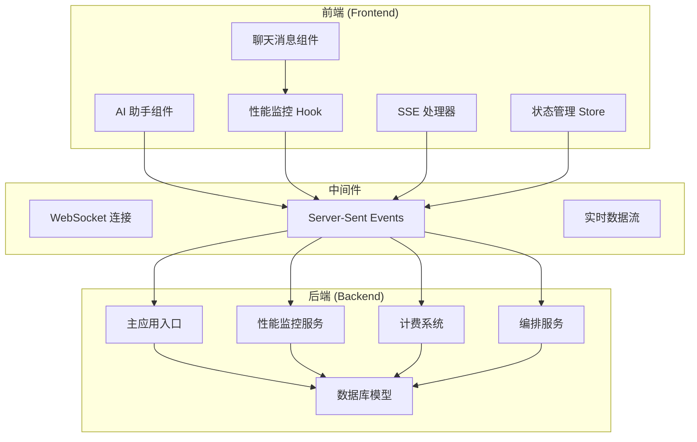
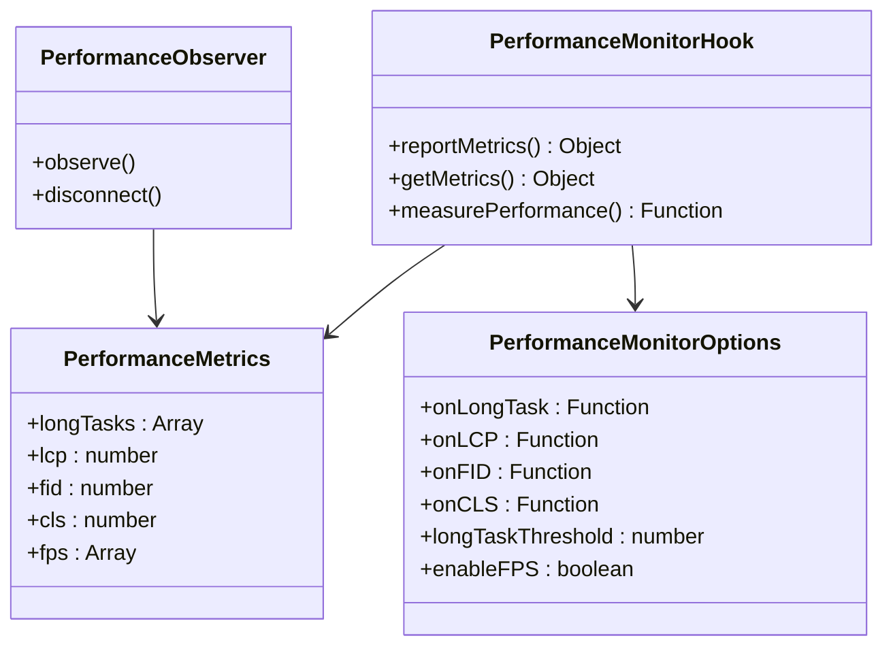
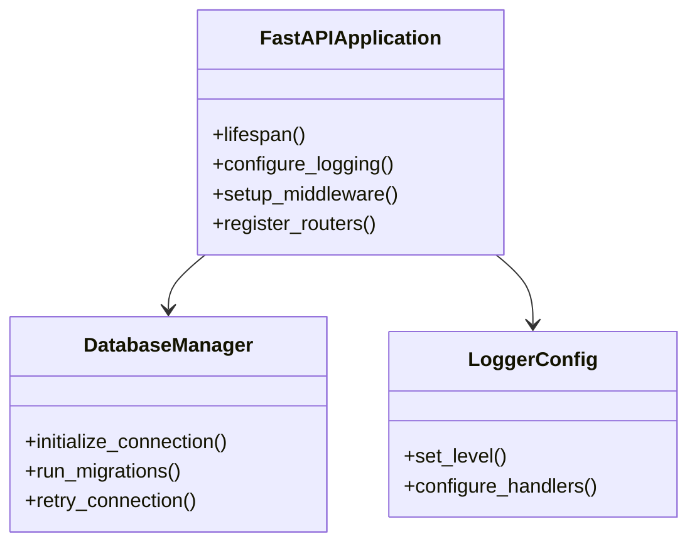
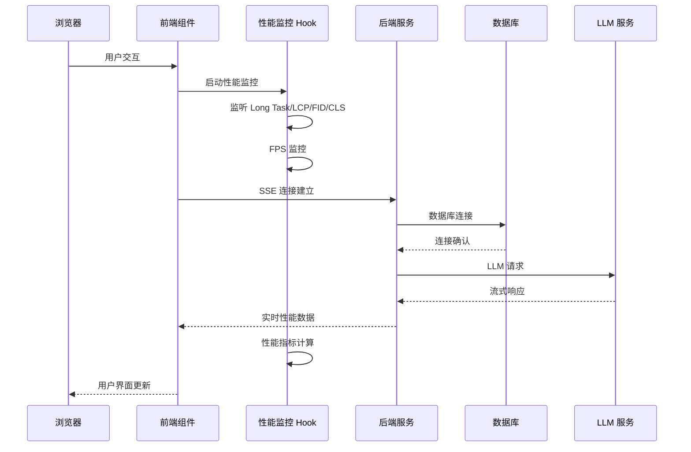
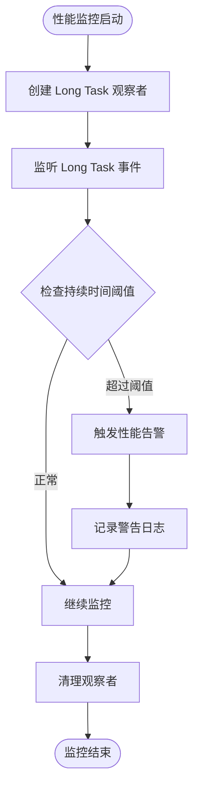
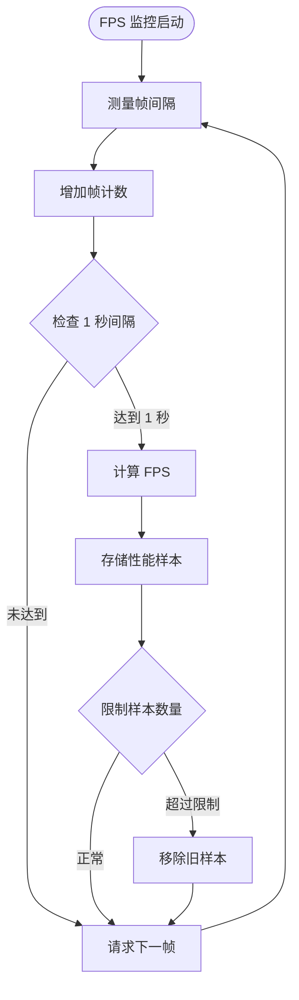
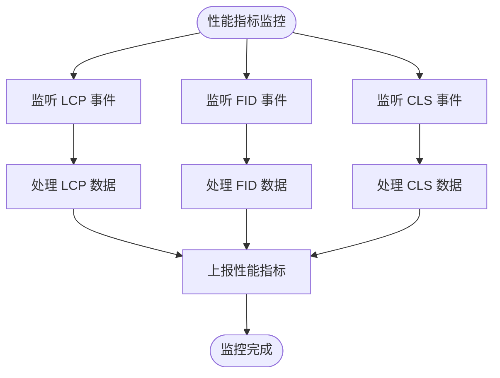
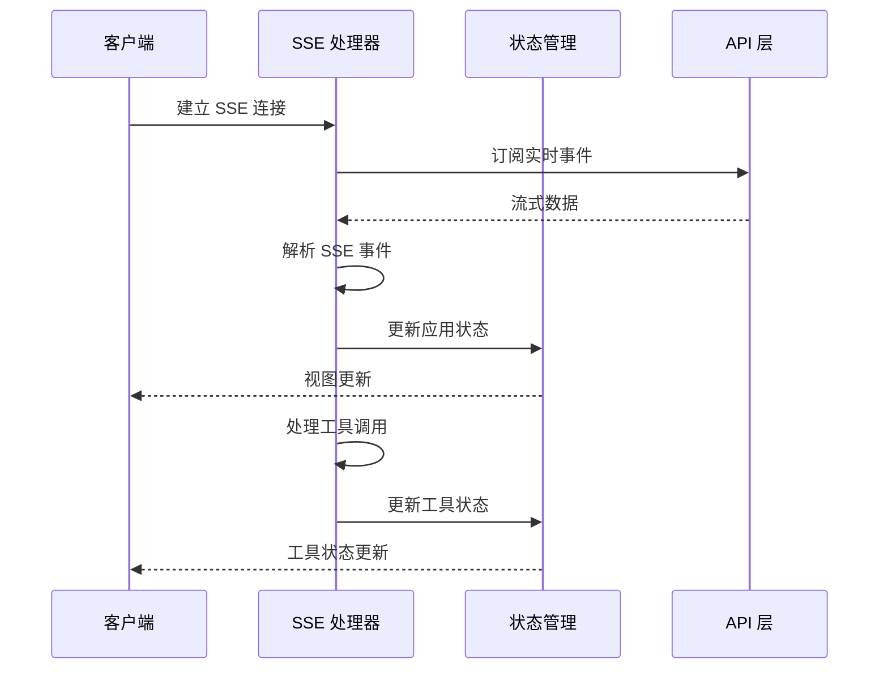
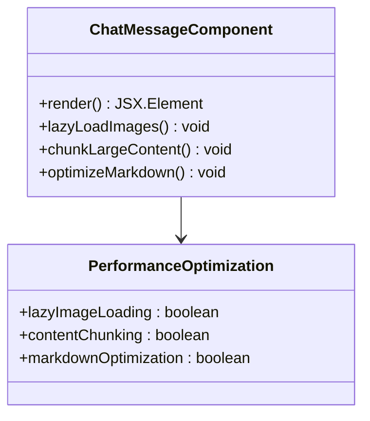
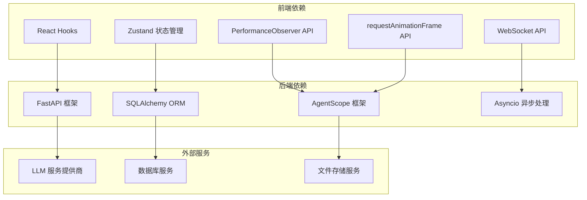

# 性能监控系统

<cite>
**本文档引用的文件**
- [main.py](file://backend/main.py)
- [usePerformanceMonitor.ts](file://frontend/src/components/ai-assistant/hooks/usePerformanceMonitor.ts)
- [useSSEHandler.ts](file://frontend/src/components/ai-assistant/hooks/useSSEHandler.ts)
- [useAIAssistantStore.ts](file://frontend/src/store/useAIAssistantStore.ts)
- [ChatMessage.tsx](file://frontend/src/components/ai-assistant/ChatMessage.tsx)
- [billing.py](file://backend/services/billing.py)
- [admin.py](file://backend/routers/admin.py)
- [models.py](file://backend/models.py)
- [orchestrator.py](file://backend/services/orchestrator.py)
- [schemas.py](file://backend/schemas.py)
- [orchestrate.py](file://backend/routers/orchestrate.py)
- [index.ts](file://frontend/src/components/ai-assistant/index.ts)
</cite>

## 更新摘要
**所做更改**
- 增强了前端性能监控系统，新增 usePerformanceMonitor hook 提供完整的性能指标监控
- 更新了性能监控架构图，反映新的 FPS、长任务检测和 LCP 测量功能
- 扩展了性能监控组件分析，包含详细的性能指标计算逻辑
- 更新了实时通信性能监控部分，反映性能数据的实时传输机制

## 目录
1. [简介](#简介)
2. [项目结构](#项目结构)
3. [核心组件](#核心组件)
4. [架构概览](#架构概览)
5. [详细组件分析](#详细组件分析)
6. [依赖关系分析](#依赖关系分析)
7. [性能考虑](#性能考虑)
8. [故障排除指南](#故障排除指南)
9. [结论](#结论)

## 简介

性能监控系统是基于 AgentScope 多智能体框架构建的通用 AI 内容创作和交互平台的核心组成部分。该系统集成了前后端性能监控机制，提供了全面的性能指标收集、分析和告警功能。

系统主要特点包括：
- **多维度性能监控**：涵盖前端 FPS、Long Task、LCP、FID、CLS 等指标
- **实时性能数据流**：基于 Server-Sent Events 的实时性能数据推送
- **智能计费系统**：基于积分的精细化消费模式
- **多模态内容生成**：支持文本、图像、视频等多种内容类型的性能监控
- **实时交互引擎**：低延迟的双向通信系统

**更新** 新增了增强的 usePerformanceMonitor hook，提供更精确的性能指标跟踪和实时渲染性能反馈。

## 项目结构

**图表来源**
- [main.py:110-174](file://backend/main.py#L110-L174)
- [usePerformanceMonitor.ts:1-236](file://frontend/src/components/ai-assistant/hooks/usePerformanceMonitor.ts#L1-L236)
- [index.ts:35-37](file://frontend/src/components/ai-assistant/index.ts#L35-L37)

**章节来源**
- [main.py:1-174](file://backend/main.py#L1-L174)
- [index.ts:1-37](file://frontend/src/components/ai-assistant/index.ts#L1-L37)

## 核心组件

### 前端性能监控组件

前端性能监控系统通过 `usePerformanceMonitor` Hook 提供了全面的浏览器性能指标收集能力：

**图表来源**
- [usePerformanceMonitor.ts:5-29](file://frontend/src/components/ai-assistant/hooks/usePerformanceMonitor.ts#L5-L29)
- [usePerformanceMonitor.ts:31-206](file://frontend/src/components/ai-assistant/hooks/usePerformanceMonitor.ts#L31-L206)

**更新** 新增了 useMeasurePerformance 辅助函数，提供精确的操作性能测量能力。

### 后端性能监控组件

后端性能监控系统通过 FastAPI 应用程序提供数据库连接、日志管理和性能优化功能：

**图表来源**
- [main.py:49-108](file://backend/main.py#L49-L108)

**章节来源**
- [usePerformanceMonitor.ts:1-236](file://frontend/src/components/ai-assistant/hooks/usePerformanceMonitor.ts#L1-L236)
- [main.py:15-31](file://backend/main.py#L15-L31)

## 架构概览

**图表来源**
- [useSSEHandler.ts:24-356](file://frontend/src/components/ai-assistant/hooks/useSSEHandler.ts#L24-L356)
- [orchestrate.py:46-70](file://backend/routers/orchestrate.py#L46-L70)

## 详细组件分析

### 性能监控 Hook 分析

前端性能监控系统提供了五种核心性能指标的实时监控：

#### Long Task 监控
Long Task 指标用于检测阻塞主线程的长时间任务：

**图表来源**
- [usePerformanceMonitor.ts:79-106](file://frontend/src/components/ai-assistant/hooks/usePerformanceMonitor.ts#L79-L106)

#### FPS 监控
FPS（Frames Per Second）监控用于检测渲染性能：

**图表来源**
- [usePerformanceMonitor.ts:166-190](file://frontend/src/components/ai-assistant/hooks/usePerformanceMonitor.ts#L166-L190)

**更新** 新增了精确的 FPS 计算逻辑，使用 requestAnimationFrame API 进行高效的帧率监控，并限制最多保留 60 个 FPS 样本以防止内存泄漏。

#### LCP、FID、CLS 监控
现代 Web 性能指标监控：

**图表来源**
- [usePerformanceMonitor.ts:108-164](file://frontend/src/components/ai-assistant/hooks/usePerformanceMonitor.ts#L108-L164)

### 实时通信性能监控

实时通信系统通过 Server-Sent Events 提供低延迟的数据传输：

**图表来源**
- [useSSEHandler.ts:64-356](file://frontend/src/components/ai-assistant/hooks/useSSEHandler.ts#L64-L356)

**更新** 性能监控数据现在通过 SSE 实时传输到前端，提供即时的性能反馈和告警通知。

### 聊天消息组件性能优化

聊天消息组件集成了性能监控功能，优化了渲染性能：

**图表来源**
- [ChatMessage.tsx:18-72](file://frontend/src/components/ai-assistant/ChatMessage.tsx#L18-L72)

**章节来源**
- [usePerformanceMonitor.ts:1-236](file://frontend/src/components/ai-assistant/hooks/usePerformanceMonitor.ts#L1-L236)
- [useSSEHandler.ts:1-357](file://frontend/src/components/ai-assistant/hooks/useSSEHandler.ts#L1-L357)
- [ChatMessage.tsx:1-200](file://frontend/src/components/ai-assistant/ChatMessage.tsx#L1-L200)

## 依赖关系分析

**图表来源**
- [main.py:32-45](file://backend/main.py#L32-L45)
- [usePerformanceMonitor.ts:3-4](file://frontend/src/components/ai-assistant/hooks/usePerformanceMonitor.ts#L3-L4)

**章节来源**
- [models.py:1-450](file://backend/models.py#L1-L450)
- [schemas.py:1-860](file://backend/schemas.py#L1-L860)

## 性能考虑

### 前端性能优化

1. **性能监控开销最小化**
   - 使用 `requestAnimationFrame` 进行高效的 FPS 监控
   - 限制性能样本数量，避免内存泄漏
   - 条件性启用不同类型的性能监控

2. **实时数据流优化**
   - 使用 SSE 减少轮询开销
   - 实现事件去重和批处理
   - 优化状态更新频率

3. **组件渲染优化**
   - 聊天消息组件使用懒加载优化图片和代码块
   - 大消息内容分块渲染，提高响应速度
   - 使用 memoization 优化组件重新渲染

**更新** 新增了精确的性能测量工具，支持同步和异步操作的性能基准测试。

### 后端性能优化

1. **数据库连接优化**
   - 实现连接重试机制
   - 使用异步数据库操作
   - 优化查询性能和索引

2. **内存管理**
   - 实现缓存机制减少重复计算
   - 及时清理临时数据和观察者
   - 优化大对象的生命周期管理

3. **并发处理**
   - 使用异步编程模型
   - 实现任务队列和限流
   - 优化多智能体协作的并发控制

## 故障排除指南

### 性能监控问题

1. **性能指标缺失**
   - 检查浏览器是否支持 PerformanceObserver API
   - 验证性能监控 Hook 的正确初始化
   - 确认网络连接稳定

2. **FPS 监控异常**
   - 检查浏览器的刷新率设置
   - 验证 requestAnimationFrame 的回调执行
   - 确认没有过度的 DOM 操作

3. **性能数据传输问题**
   - 检查 SSE 连接状态
   - 验证后端性能监控服务运行状态
   - 确认前端性能监控 Hook 正确配置

**更新** 新增了性能测量工具的故障排除指南，帮助开发者诊断性能测量结果的准确性。

### 计费系统问题

1. **积分扣费失败**
   - 检查用户余额是否充足
   - 验证计费规则配置
   - 确认数据库事务完整性

2. **计费计算错误**
   - 验证费率映射表配置
   - 检查 token 统计准确性
   - 确认计费维度映射正确

**章节来源**
- [billing.py:45-84](file://backend/services/billing.py#L45-L84)
- [usePerformanceMonitor.ts:94-97](file://frontend/src/components/ai-assistant/hooks/usePerformanceMonitor.ts#L94-L97)

## 结论

性能监控系统通过前后端协同的方式，为 AI 内容创作平台提供了全面的性能保障。系统的主要优势包括：

1. **全面的性能覆盖**：从浏览器到服务器的多层次性能监控
2. **实时性能反馈**：基于 SSE 的实时性能数据推送
3. **智能计费集成**：将性能监控与计费系统深度集成
4. **可扩展架构**：模块化的组件设计支持功能扩展
5. **高效性能**：优化的算法和数据结构确保系统性能

**更新** 新增强化的性能监控系统现在提供更精确的性能指标跟踪，包括 FPS、长任务检测、LCP、FID 和 CLS 等关键指标，为开发者提供了强大的实时渲染性能反馈能力。通过 usePerformanceMonitor hook 和 useMeasurePerformance 工具，开发者可以深入分析应用性能并及时发现潜在的性能问题。

该系统为 AI 创作平台的稳定运行和用户体验优化提供了坚实的技术基础，能够有效识别和解决性能瓶颈，提升整体系统效率。