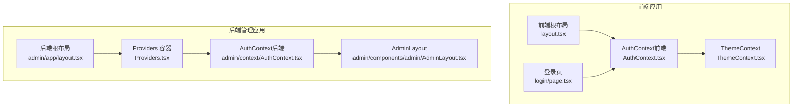
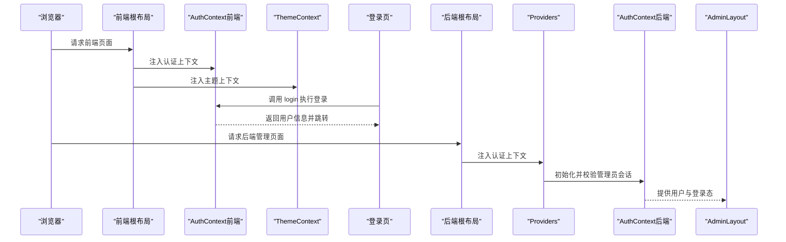
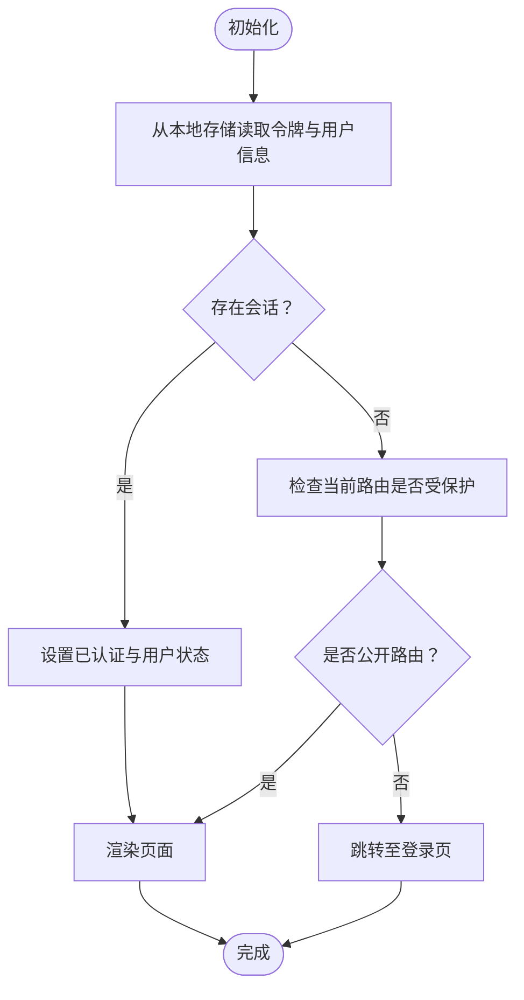
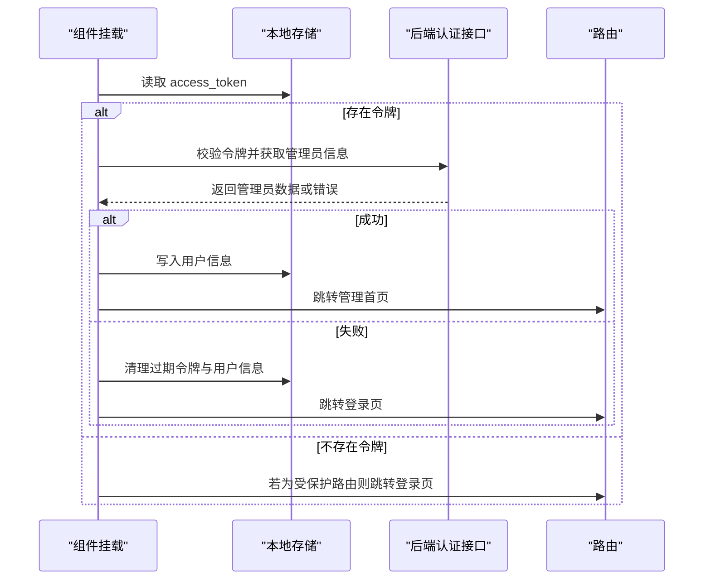
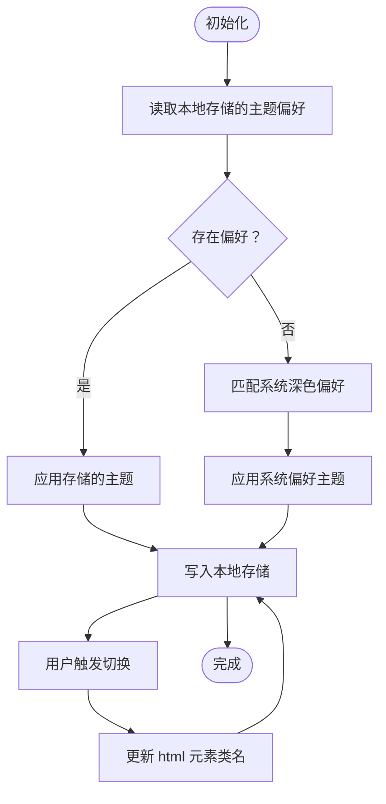
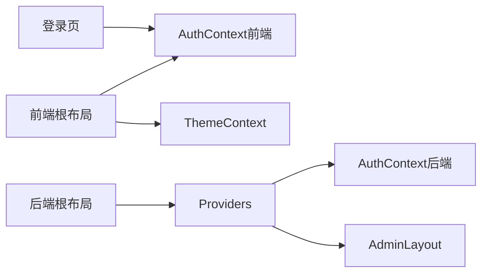

# 上下文提供者（Context Provider）

<cite>
**本文引用的文件**
- [AuthContext.tsx（前端）](file://frontend/src/context/AuthContext.tsx)
- [AuthContext.tsx（后端管理）](file://backend/admin/src/context/AuthContext.tsx)
- [ThemeContext.tsx](file://frontend/src/context/ThemeContext.tsx)
- [layout.tsx（前端根布局）](file://frontend/src/app/layout.tsx)
- [layout.tsx（后端根布局）](file://backend/admin/src/app/layout.tsx)
- [Providers.tsx（后端提供者容器）](file://backend/admin/src/components/Providers.tsx)
- [page.tsx（登录页-前端）](file://frontend/src/app/login/page.tsx)
- [AdminLayout.tsx（后端管理布局）](file://backend/admin/src/components/admin/AdminLayout.tsx)
- [theme-toggle.tsx（前端简易主题切换）](file://frontend/src/components/tiptap-templates/simple/theme-toggle.tsx)
</cite>

## 目录
1. [引言](#引言)
2. [项目结构](#项目结构)
3. [核心组件](#核心组件)
4. [架构总览](#架构总览)
5. [详细组件分析](#详细组件分析)
6. [依赖关系分析](#依赖关系分析)
7. [性能考量](#性能考量)
8. [故障排查指南](#故障排查指南)
9. [结论](#结论)
10. [附录](#附录)

## 引言
本文件围绕 Infinite Game 的 Context Provider 系统进行系统化说明，重点覆盖以下方面：
- 用户认证上下文（AuthContext）：用户状态管理、登录流程与权限控制
- 主题切换上下文（ThemeContext）：主题配置、样式切换与持久化存储
- Provider 设计模式：Provider 层级、状态提升与性能优化
- 上下文数据访问模式：useContext Hook 使用、状态订阅与更新机制
- 最佳实践：状态拆分、避免不必要重渲染与内存泄漏防护
- 具体实现示例与使用场景

## 项目结构
本项目采用“前后端分离”的 Next.js 应用结构，分别在前端与后端管理模块中实现了各自的 Context Provider：
- 前端应用（用户侧）：提供用户认证与主题切换上下文，根布局统一注入 Provider
- 后端管理应用（管理员侧）：提供管理员认证上下文，配合专用布局与路由守卫

**图表来源**
- [layout.tsx（前端根布局）:23-41](file://frontend/src/app/layout.tsx#L23-L41)
- [AuthContext.tsx（前端）:52-110](file://frontend/src/context/AuthContext.tsx#L52-L110)
- [ThemeContext.tsx:16-65](file://frontend/src/context/ThemeContext.tsx#L16-L65)
- [layout.tsx（后端根布局）:10-24](file://backend/admin/src/app/layout.tsx#L10-L24)
- [Providers.tsx（后端提供者容器）:7-15](file://backend/admin/src/components/Providers.tsx#L7-L15)
- [AuthContext.tsx（后端管理）:39-117](file://backend/admin/src/context/AuthContext.tsx#L39-L117)
- [AdminLayout.tsx（后端管理布局）:37-198](file://backend/admin/src/components/admin/AdminLayout.tsx#L37-L198)

**章节来源**
- [layout.tsx（前端根布局）:23-41](file://frontend/src/app/layout.tsx#L23-L41)
- [layout.tsx（后端根布局）:10-24](file://backend/admin/src/app/layout.tsx#L10-L24)
- [Providers.tsx（后端提供者容器）:7-15](file://backend/admin/src/components/Providers.tsx#L7-L15)

## 核心组件
本节概述两个核心上下文及其职责：
- AuthContext（前端）：管理用户登录态、令牌与用户信息，提供登录/登出与额度更新能力；支持本地存储持久化与路由守卫
- ThemeContext：管理明暗主题切换、与 Ant Design 主题算法联动，并持久化到本地存储

关键要点：
- 前端与后端分别维护独立的 AuthContext，职责边界清晰
- ThemeContext 通过 Ant Design 的 ConfigProvider 与 App 组件提供主题能力
- Provider 在根布局中按需嵌套，确保上下文可用性

**章节来源**
- [AuthContext.tsx（前端）:12-47](file://frontend/src/context/AuthContext.tsx#L12-L47)
- [AuthContext.tsx（后端管理）:7-35](file://backend/admin/src/context/AuthContext.tsx#L7-L35)
- [ThemeContext.tsx:9-73](file://frontend/src/context/ThemeContext.tsx#L9-L73)

## 架构总览
下图展示前端与后端应用中 Context Provider 的组织方式与交互路径。

**图表来源**
- [layout.tsx（前端根布局）:33-37](file://frontend/src/app/layout.tsx#L33-L37)
- [AuthContext.tsx（前端）:52-110](file://frontend/src/context/AuthContext.tsx#L52-L110)
- [ThemeContext.tsx:16-65](file://frontend/src/context/ThemeContext.tsx#L16-L65)
- [page.tsx（登录页-前端）:12-50](file://frontend/src/app/login/page.tsx#L12-L50)
- [layout.tsx（后端根布局）:18-20](file://backend/admin/src/app/layout.tsx#L18-L20)
- [Providers.tsx（后端提供者容器）:7-15](file://backend/admin/src/components/Providers.tsx#L7-L15)
- [AuthContext.tsx（后端管理）:39-117](file://backend/admin/src/context/AuthContext.tsx#L39-L117)
- [AdminLayout.tsx（后端管理布局）:37-45](file://backend/admin/src/components/admin/AdminLayout.tsx#L37-L45)

## 详细组件分析

### AuthContext（前端）设计与实现
- 数据模型
  - 用户类型：包含标识、邮箱、昵称、角色、活跃状态、额度与用量等字段
  - 认证响应：包含访问令牌、刷新令牌、令牌类型、有效期与用户对象
- 上下文类型
  - 暴露用户对象、是否已认证、登录、登出、更新额度等方法
- 生命周期与持久化
  - 首次挂载从本地存储恢复登录态；登录成功写入本地存储；登出清理存储
- 路由守卫
  - 对非公开路由进行守卫，未登录自动跳转至登录页
- 登录流程
  - 登录页调用后端认证接口获取令牌与用户信息，随后通过上下文方法写入状态并跳转首页

**图表来源**
- [AuthContext.tsx（前端）:60-73](file://frontend/src/context/AuthContext.tsx#L60-L73)

**章节来源**
- [AuthContext.tsx（前端）:12-47](file://frontend/src/context/AuthContext.tsx#L12-L47)
- [AuthContext.tsx（前端）:52-110](file://frontend/src/context/AuthContext.tsx#L52-L110)
- [page.tsx（登录页-前端）:18-29](file://frontend/src/app/login/page.tsx#L18-L29)

### AuthContext（后端管理）设计与实现
- 数据模型
  - 管理员类型：包含标识、邮箱、昵称、权限等级、活跃状态与时间戳等字段
- 上下文类型
  - 暴露用户对象、是否已认证、加载状态、登录、登出等方法
- 生命周期与安全
  - 首次挂载校验本地令牌；若存在则调用后端接口验证并写入用户信息；若无效则清理本地存储并重定向
  - 受保护路由在导航时再次守卫，防止直接访问
- 加载策略
  - 受保护路由在验证期间不渲染内容，避免短暂暴露受保护区域

**图表来源**
- [AuthContext.tsx（后端管理）:47-83](file://backend/admin/src/context/AuthContext.tsx#L47-L83)

**章节来源**
- [AuthContext.tsx（后端管理）:7-35](file://backend/admin/src/context/AuthContext.tsx#L7-L35)
- [AuthContext.tsx（后端管理）:39-117](file://backend/admin/src/context/AuthContext.tsx#L39-L117)
- [AdminLayout.tsx（后端管理布局）:42-45](file://backend/admin/src/components/admin/AdminLayout.tsx#L42-L45)

### ThemeContext 主题切换功能
- 主题类型与上下文
  - 支持明/暗两种主题，提供切换函数与当前主题状态
- 初始化与持久化
  - 首次挂载读取本地存储或系统偏好；变更主题时同步更新 DOM 类名与本地存储
- 与 Ant Design 集成
  - 通过 ConfigProvider 注入算法与主题色值，App 包裹子树以应用全局主题
- 使用建议
  - 在根布局中统一注入，避免重复包裹；注意 SSR 场景下的默认主题处理

**图表来源**
- [ThemeContext.tsx:20-36](file://frontend/src/context/ThemeContext.tsx#L20-L36)

**章节来源**
- [ThemeContext.tsx:9-73](file://frontend/src/context/ThemeContext.tsx#L9-L73)
- [layout.tsx（前端根布局）:33-37](file://frontend/src/app/layout.tsx#L33-L37)

### Provider 层级、状态提升与性能优化
- 层级组织
  - 前端：根布局中先注入 AuthProvider，再注入 ThemeProvider，确保子树可同时访问两者
  - 后端：根布局中注入 Providers，内部再注入 AuthProvider 与 AdminLayout
- 状态提升
  - 将共享状态提升至最近公共祖先，减少跨层传递成本
- 性能优化
  - 使用 useCallback 包装上下文方法，避免子组件因引用变化而重渲染
  - 合理拆分上下文，避免单一 Provider 承担过多状态导致不必要的广播
  - 在受保护路由中对加载阶段进行占位，避免闪烁

**章节来源**
- [layout.tsx（前端根布局）:33-37](file://frontend/src/app/layout.tsx#L33-L37)
- [Providers.tsx（后端提供者容器）:7-15](file://backend/admin/src/components/Providers.tsx#L7-L15)
- [AuthContext.tsx（前端）:75-102](file://frontend/src/context/AuthContext.tsx#L75-L102)
- [AuthContext.tsx（后端管理）:85-104](file://backend/admin/src/context/AuthContext.tsx#L85-L104)

### 上下文数据访问模式：useContext、订阅与更新
- 订阅与使用
  - 在组件中通过 useAuth/useTheme 获取上下文值，读取用户信息、登录态或主题状态
- 更新机制
  - 登录/登出/额度更新等动作通过上下文提供的方法触发，内部更新状态并持久化
- 注意事项
  - 在使用前确保组件处于对应 Provider 的作用域内，否则抛出错误
  - 对于频繁更新的状态，建议拆分为多个上下文，降低重渲染范围

**章节来源**
- [AuthContext.tsx（前端）:47-47](file://frontend/src/context/AuthContext.tsx#L47-L47)
- [AuthContext.tsx（后端管理）:35-35](file://backend/admin/src/context/AuthContext.tsx#L35-L35)
- [ThemeContext.tsx:67-73](file://frontend/src/context/ThemeContext.tsx#L67-L73)
- [AdminLayout.tsx（后端管理布局）:40-40](file://backend/admin/src/components/admin/AdminLayout.tsx#L40-L40)

### 实现示例与使用场景
- 前端登录页
  - 调用后端认证接口获取令牌与用户信息，随后通过 useAuth 的 login 方法写入上下文并跳转
- 后端管理布局
  - 使用 useAuth 读取管理员信息与登出方法，构建侧边栏与用户菜单
- 主题切换
  - 通过 useTheme 的 toggleTheme 切换明暗主题，并持久化到本地存储

**章节来源**
- [page.tsx（登录页-前端）:18-29](file://frontend/src/app/login/page.tsx#L18-L29)
- [AdminLayout.tsx（后端管理布局）:40-40](file://backend/admin/src/components/admin/AdminLayout.tsx#L40-L40)
- [ThemeContext.tsx:38-40](file://frontend/src/context/ThemeContext.tsx#L38-L40)

## 依赖关系分析
- 前端
  - 根布局依赖 AuthContext 与 ThemeContext
  - 登录页依赖 AuthContext 与后端 API
- 后端
  - 根布局依赖 Providers
  - Providers 依赖 AuthContext 与 AdminLayout
  - AdminLayout 依赖 AuthContext

**图表来源**
- [layout.tsx（前端根布局）:33-37](file://frontend/src/app/layout.tsx#L33-L37)
- [page.tsx（登录页-前端）:15-23](file://frontend/src/app/login/page.tsx#L15-L23)
- [layout.tsx（后端根布局）:18-20](file://backend/admin/src/app/layout.tsx#L18-L20)
- [Providers.tsx（后端提供者容器）:7-15](file://backend/admin/src/components/Providers.tsx#L7-L15)
- [AdminLayout.tsx（后端管理布局）:37-45](file://backend/admin/src/components/admin/AdminLayout.tsx#L37-L45)

**章节来源**
- [layout.tsx（前端根布局）:33-37](file://frontend/src/app/layout.tsx#L33-L37)
- [layout.tsx（后端根布局）:18-20](file://backend/admin/src/app/layout.tsx#L18-L20)
- [Providers.tsx（后端提供者容器）:7-15](file://backend/admin/src/components/Providers.tsx#L7-L15)

## 性能考量
- 减少重渲染
  - 将频繁变化的状态与稳定状态拆分到不同上下文，避免单一 Provider 的大范围广播
  - 对上下文方法使用 useCallback，确保引用稳定
- 路由守卫与加载态
  - 在受保护路由中对加载阶段进行占位，避免短暂暴露受保护内容
- 本地存储与 SSR
  - 主题切换与认证状态均采用本地存储持久化，注意 SSR 场景下的默认值与水合一致性

[本节为通用指导，无需特定文件引用]

## 故障排查指南
- useAuth/useTheme 报错
  - 症状：在未包裹对应 Provider 的组件中调用，抛出“必须在 Provider 内使用”类错误
  - 排查：确认根布局正确注入了 AuthProvider/ThemeProvider 或 Providers
- 登录后仍被重定向到登录页
  - 症状：登录成功但立即跳转回登录页
  - 排查：检查本地存储中的令牌与用户信息是否写入；确认路由守卫逻辑与公开路由列表
- 主题切换无效
  - 症状：点击切换按钮后样式未变化
  - 排查：确认本地存储中主题键值是否更新；检查 html 元素类名是否正确添加/移除
- 后端管理认证失败
  - 症状：进入受保护路由后被重定向到登录页
  - 排查：检查本地令牌是否有效；确认后端认证接口返回的用户信息是否正确写入本地存储

**章节来源**
- [ThemeContext.tsx:67-73](file://frontend/src/context/ThemeContext.tsx#L67-L73)
- [AuthContext.tsx（前端）:68-73](file://frontend/src/context/AuthContext.tsx#L68-L73)
- [AuthContext.tsx（后端管理）:77-83](file://backend/admin/src/context/AuthContext.tsx#L77-L83)
- [AdminLayout.tsx（后端管理布局）:42-45](file://backend/admin/src/components/admin/AdminLayout.tsx#L42-L45)

## 结论
Infinite Game 的 Context Provider 系统通过清晰的职责划分与合理的 Provider 层级，实现了用户认证与主题切换两大核心能力：
- 前端与后端分别维护独立的认证上下文，满足不同角色的权限需求
- ThemeContext 与 Ant Design 深度集成，提供一致的主题体验
- 通过持久化存储与路由守卫，保障用户体验与安全性
- 建议持续遵循状态拆分、引用稳定与最小化重渲染的原则，以获得更优的性能表现

[本节为总结性内容，无需特定文件引用]

## 附录
- 前端简易主题切换组件（用于对比）
  - 该组件通过媒体查询与 DOM 类名切换实现主题切换，与 ThemeContext 的策略互补
  - 适合在不需要全局主题算法联动的场景使用

**章节来源**
- [theme-toggle.tsx（前端简易主题切换）:14-30](file://frontend/src/components/tiptap-templates/simple/theme-toggle.tsx#L14-L30)