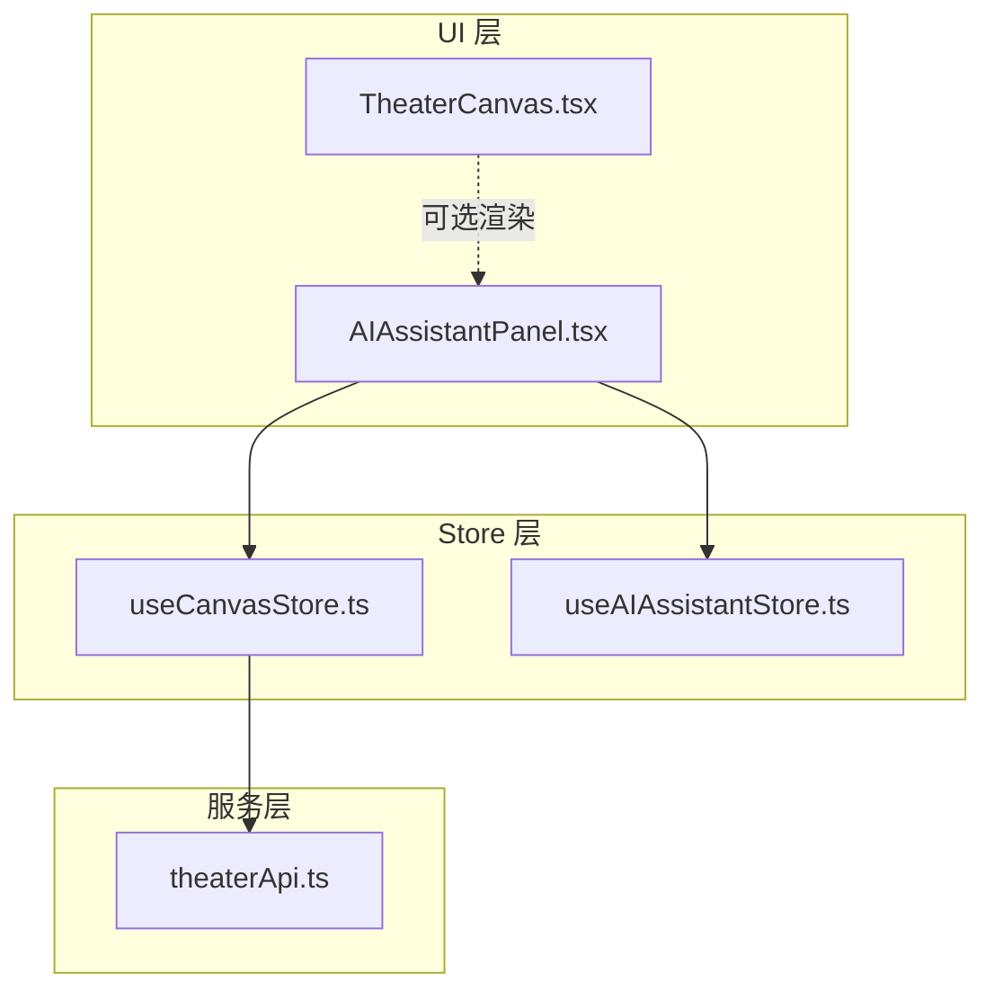
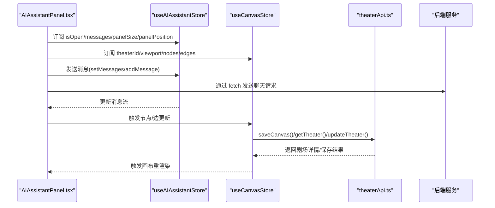
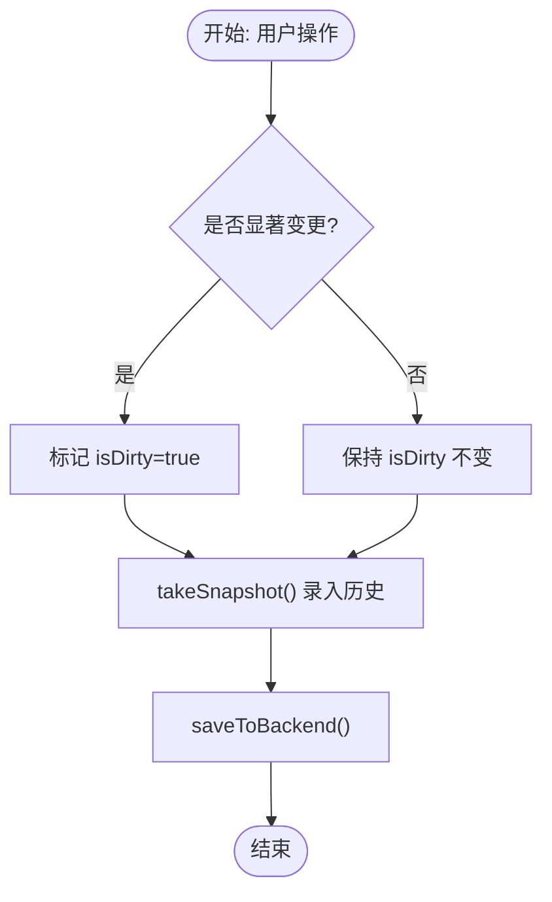
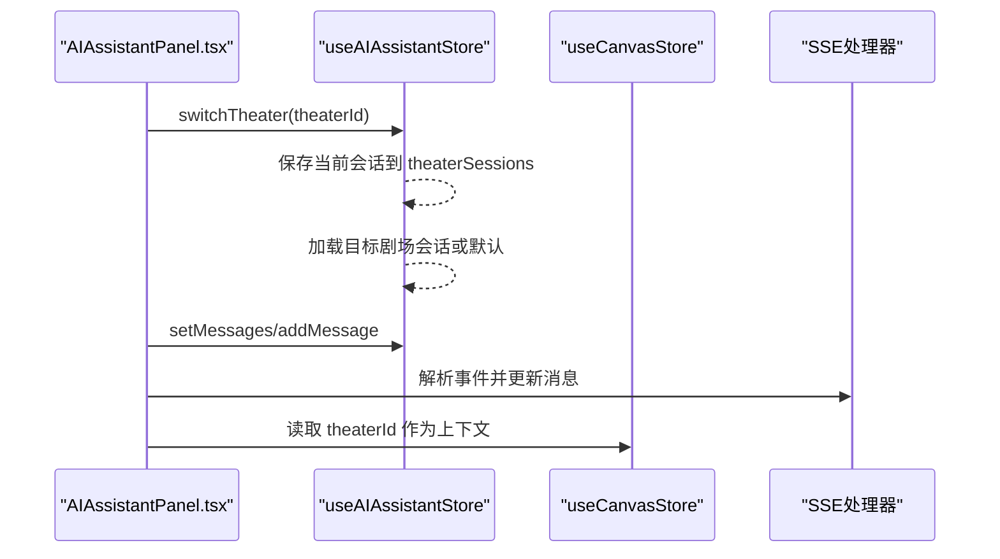
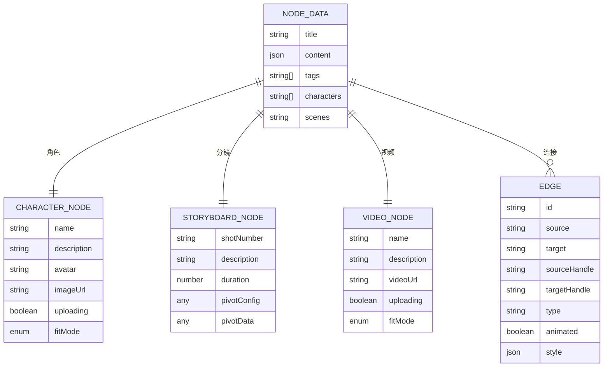
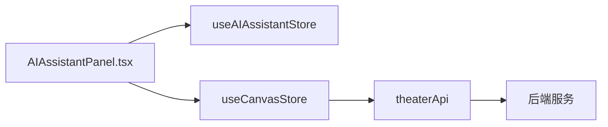

# Zustand Store 设计

<cite>
**本文引用的文件**
- [useCanvasStore.ts](file://frontend/src/store/useCanvasStore.ts)
- [useAIAssistantStore.ts](file://frontend/src/store/useAIAssistantStore.ts)
- [useCanvasStore.test.ts](file://frontend/src/store/__tests__/useCanvasStore.test.ts)
- [theaterApi.ts](file://frontend/src/lib/theaterApi.ts)
- [AIAssistantPanel.tsx](file://frontend/src/components/canvas/AIAssistantPanel.tsx)
- [TheaterCanvas.tsx](file://frontend/src/components/TheaterCanvas.tsx)
- [usePivotEngine.ts](file://frontend/src/components/canvas/pivot/usePivotEngine.ts)
</cite>

## 目录
1. [简介](#简介)
2. [项目结构](#项目结构)
3. [核心组件](#核心组件)
4. [架构总览](#架构总览)
5. [详细组件分析](#详细组件分析)
6. [依赖关系分析](#依赖关系分析)
7. [性能考量](#性能考量)
8. [故障排查指南](#故障排查指南)
9. [结论](#结论)
10. [附录](#附录)

## 简介
本文件系统性梳理 Infinite Game 前端中基于 Zustand 的状态管理设计，重点覆盖以下方面：
- store 创建与配置：状态结构设计、action 定义、持久化策略与合并逻辑
- 画布状态管理 useCanvasStore：节点/边/视口同步、历史快照、撤销重做、与后端的同步与保存
- 助手状态管理 useAIAssistantStore：消息流、会话切换、面板尺寸位置、图像编辑上下文
- 模块化设计原则：状态隔离、action 命名规范、状态更新模式
- 最佳实践：状态订阅优化、action 组合、异步状态处理
- 典型使用场景与代码示例路径，帮助开发者正确使用与扩展 store

## 项目结构
前端 store 位于 frontend/src/store，采用按功能域划分的模块化组织：
- useCanvasStore.ts：画布状态与后端同步
- useAIAssistantStore.ts：AI 助手面板状态与消息流
- __tests__/useCanvasStore.test.ts：画布自动保存的测试用例

图表来源
- [useCanvasStore.ts:185-540](file://frontend/src/store/useCanvasStore.ts#L185-L540)
- [useAIAssistantStore.ts:145-274](file://frontend/src/store/useAIAssistantStore.ts#L145-L274)
- [AIAssistantPanel.tsx:14-326](file://frontend/src/components/canvas/AIAssistantPanel.tsx#L14-L326)
- [TheaterCanvas.tsx:10-50](file://frontend/src/components/TheaterCanvas.tsx#L10-L50)
- [theaterApi.ts:107-159](file://frontend/src/lib/theaterApi.ts#L107-L159)

章节来源
- [useCanvasStore.ts:1-540](file://frontend/src/store/useCanvasStore.ts#L1-L540)
- [useAIAssistantStore.ts:1-274](file://frontend/src/store/useAIAssistantStore.ts#L1-L274)
- [AIAssistantPanel.tsx:14-326](file://frontend/src/components/canvas/AIAssistantPanel.tsx#L14-L326)
- [TheaterCanvas.tsx:10-50](file://frontend/src/components/TheaterCanvas.tsx#L10-L50)
- [theaterApi.ts:107-159](file://frontend/src/lib/theaterApi.ts#L107-L159)

## 核心组件
本节概述两个 store 的职责边界与关键能力：
- useCanvasStore：负责画布节点、边、视口、剧场同步、历史快照与撤销重做、设置项（吸附网格/导轨）等
- useAIAssistantStore：负责助手面板可见性、消息流、会话切换、可用智能体、面板尺寸与位置、图像编辑上下文等

章节来源
- [useCanvasStore.ts:67-114](file://frontend/src/store/useCanvasStore.ts#L67-L114)
- [useAIAssistantStore.ts:74-136](file://frontend/src/store/useAIAssistantStore.ts#L74-L136)

## 架构总览
下图展示 store 与 UI、服务层之间的交互关系与数据流向。

图表来源
- [AIAssistantPanel.tsx:87-179](file://frontend/src/components/canvas/AIAssistantPanel.tsx#L87-L179)
- [useCanvasStore.ts:378-505](file://frontend/src/store/useCanvasStore.ts#L378-L505)
- [theaterApi.ts:141-150](file://frontend/src/lib/theaterApi.ts#L141-L150)

## 详细组件分析

### useCanvasStore 画布状态管理
- 状态结构设计
  - 节点/边/视口：基础画布元素
  - 剧场同步：theaterId、theaterTitle、isLoading/isSaving、isDirty、lastSavedAt
  - 历史：history 与 historyIndex，支持撤销/重做
  - 设置：snapToGrid、snapToGuides
  - 回调：onNodesChange/onEdgesChange/onConnect
- action 函数定义
  - 节点/边变更：addNode/deleteNode/deleteEdge/updateNodeData/updateNodeDimensions/setViewport
  - 历史：takeSnapshot/undo/redo
  - 后端同步：setTheaterId/setTheaterTitle/loadTheater/syncTheater/saveToBackend/markDirty
- selector 优化
  - 在组件中使用选择器仅订阅所需字段，避免不必要的重渲染
  - 示例：在 AI 助手面板中仅订阅 theaterId，减少画布渲染压力
- 异步状态处理
  - saveToBackend 使用 isSaving 防止并发保存
  - loadTheater/syncTheater 包含错误处理与状态回滚
- 数据映射
  - nodeToApi/apiToNode、edgeToApi/apiToEdge 实现前端节点/边与后端格式的双向转换
- 持久化与合并
  - persist 中的 partialize 仅持久化必要字段
  - merge 对重复节点进行去重

图表来源
- [useCanvasStore.ts:209-254](file://frontend/src/store/useCanvasStore.ts#L209-L254)
- [useCanvasStore.ts:335-348](file://frontend/src/store/useCanvasStore.ts#L335-L348)
- [useCanvasStore.ts:478-505](file://frontend/src/store/useCanvasStore.ts#L478-L505)

章节来源
- [useCanvasStore.ts:67-114](file://frontend/src/store/useCanvasStore.ts#L67-L114)
- [useCanvasStore.ts:185-540](file://frontend/src/store/useCanvasStore.ts#L185-L540)
- [theaterApi.ts:107-159](file://frontend/src/lib/theaterApi.ts#L107-L159)

### useAIAssistantStore 助手状态管理
- 状态结构设计
  - 面板可见性：isOpen
  - 当前剧场：currentTheaterId
  - 消息流：messages（含角色、内容、状态、技能/工具/多智能体扩展）
  - 会话：sessionId、agentId、agentName
  - 可用智能体：availableAgents
  - 会话缓存：theaterSessions（按剧场ID缓存）
  - 面板尺寸与位置：panelSize、panelPosition
  - 图像编辑上下文：imageEditContext
- action 函数定义
  - 面板：setIsOpen/toggleOpen
  - 剧场切换：switchTheater（保存当前会话并加载目标剧场会话或默认）
  - 消息：setMessages/addMessage/updateLastMessage/clearMessages/clearMessagesKeepSession
  - 会话：setSessionId/setAgentId/setAgentName/setCurrentAgent/clearSession
  - 面板：setPanelSize/resetPanelSize/setPanelPosition/resetPanelPosition
  - 图像编辑：setImageEditContext/clearImageEditContext
- 持久化策略
  - persist 仅持久化 isOpen/currentTheaterId/messages/session/agents/sessions/panel 尺寸与位置
- 与画布的集成
  - AI 助手面板在打开时根据当前剧场初始化会话，并通过 fetch 与后端 SSE 流通信

图表来源
- [useAIAssistantStore.ts:166-204](file://frontend/src/store/useAIAssistantStore.ts#L166-L204)
- [AIAssistantPanel.tsx:87-179](file://frontend/src/components/canvas/AIAssistantPanel.tsx#L87-L179)

章节来源
- [useAIAssistantStore.ts:74-136](file://frontend/src/store/useAIAssistantStore.ts#L74-L136)
- [useAIAssistantStore.ts:145-274](file://frontend/src/store/useAIAssistantStore.ts#L145-L274)
- [AIAssistantPanel.tsx:14-326](file://frontend/src/components/canvas/AIAssistantPanel.tsx#L14-L326)

### 类型与数据模型
- 节点类型
  - ScriptNodeData：脚本文本节点
  - CharacterNodeData：角色节点
  - StoryboardNodeData：分镜节点
  - VideoNodeData：视频节点
- 边类型
  - Edge：连接节点的边，支持自定义样式与动画
- 历史状态
  - HistoryState：记录 nodes/edges 快照
- 消息与多智能体
  - Message/SkillCall/ToolCall/AgentStep/MultiAgentData：支撑多模态与协作流程

图表来源
- [useCanvasStore.ts:27-60](file://frontend/src/store/useCanvasStore.ts#L27-L60)
- [useCanvasStore.ts:144-168](file://frontend/src/store/useCanvasStore.ts#L144-L168)

章节来源
- [useCanvasStore.ts:27-60](file://frontend/src/store/useCanvasStore.ts#L27-L60)
- [useCanvasStore.ts:144-168](file://frontend/src/store/useCanvasStore.ts#L144-L168)

## 依赖关系分析
- 组件对 store 的依赖
  - AIAssistantPanel 依赖 useAIAssistantStore 与 useCanvasStore 的部分字段
- store 对外部服务的依赖
  - useCanvasStore 依赖 theaterApi 进行后端同步与保存
- 数据映射与转换
  - 节点/边在前端与后端之间双向转换，确保兼容性与一致性

图表来源
- [AIAssistantPanel.tsx:14-326](file://frontend/src/components/canvas/AIAssistantPanel.tsx#L14-L326)
- [useCanvasStore.ts:185-540](file://frontend/src/store/useCanvasStore.ts#L185-L540)
- [theaterApi.ts:107-159](file://frontend/src/lib/theaterApi.ts#L107-L159)

章节来源
- [AIAssistantPanel.tsx:14-326](file://frontend/src/components/canvas/AIAssistantPanel.tsx#L14-L326)
- [useCanvasStore.ts:185-540](file://frontend/src/store/useCanvasStore.ts#L185-L540)
- [theaterApi.ts:107-159](file://frontend/src/lib/theaterApi.ts#L107-L159)

## 性能考量
- 选择器优化
  - 在组件中使用选择器仅订阅需要的状态片段，避免因全局状态变化导致的不必要重渲染
  - 示例：在 AI 助手面板中仅订阅 isOpen、messages、panelSize、panelPosition 等
- 异步状态与防抖
  - 画布保存采用 isSaving 防止并发保存；可结合定时器实现自动保存的防抖策略
- 历史快照与内存控制
  - MAX_HISTORY 控制历史长度，避免内存膨胀
- 持久化粒度
  - persist 的 partialize 仅持久化必要字段，减少存储体积与恢复开销
- 大数据量处理
  - 测试用例验证了连续添加 200 个节点不会丢失数据，建议在批量操作时合并更新以降低重渲染次数

章节来源
- [useCanvasStore.ts:116-117](file://frontend/src/store/useCanvasStore.ts#L116-L117)
- [useCanvasStore.ts:511-538](file://frontend/src/store/useCanvasStore.ts#L511-L538)
- [useCanvasStore.test.ts:106-122](file://frontend/src/store/__tests__/useCanvasStore.test.ts#L106-L122)

## 故障排查指南
- 保存失败与离线重试
  - 保存异常时 isSaving 会复位，isDirty 保持为 true，便于后续重试
- 同步冲突与一致性
  - syncTheater 对比节点/边差异，仅在有变化时更新，避免不必要的重绘
- 循环与自环检测
  - onConnect 阻止自环与循环连接，保证图结构合法性
- 节点去重
  - merge 中对重复节点 ID 进行去重，防止状态污染

章节来源
- [useCanvasStore.ts:238-254](file://frontend/src/store/useCanvasStore.ts#L238-L254)
- [useCanvasStore.ts:400-476](file://frontend/src/store/useCanvasStore.ts#L400-L476)
- [useCanvasStore.ts:521-536](file://frontend/src/store/useCanvasStore.ts#L521-L536)

## 结论
本设计通过清晰的状态分区、严格的 action 命名与更新模式、完善的持久化与合并策略，实现了画布与助手两大领域的稳定状态管理。配合选择器优化与异步状态处理，既保证了开发体验，也兼顾了性能与可靠性。建议在扩展新功能时遵循现有命名与更新范式，确保模块化与可维护性。

## 附录

### 最佳实践清单
- 状态订阅优化
  - 在组件中使用选择器仅订阅所需字段，避免全局订阅
  - 将复杂计算放入 selector 或 useMemo，减少渲染成本
- Action 组合
  - 将多个状态更新封装为复合 action，保证原子性
  - 对批量更新场景，优先使用局部更新而非全量替换
- 异步状态处理
  - 使用 isSaving/isLoading 等标志位防止并发操作
  - 对网络错误进行分类处理与用户提示
- 数据映射与校验
  - 前后端数据映射函数保持一一对应，确保字段一致
  - 在 onConnect/onNodesChange 等关键入口处进行合法性校验
- 持久化与迁移
  - 持久化字段应最小化，避免存储冗余
  - 对历史版本进行 merge 兼容，保证升级后状态可用

### 常见使用场景与示例路径
- 在画布中新增节点并自动保存
  - 路径参考：[useCanvasStore.ts:256-264](file://frontend/src/store/useCanvasStore.ts#L256-L264)
- 在助手面板中发送消息并接收流式响应
  - 路径参考：[AIAssistantPanel.tsx:87-179](file://frontend/src/components/canvas/AIAssistantPanel.tsx#L87-L179)
- 切换剧场并保留会话
  - 路径参考：[useAIAssistantStore.ts:166-204](file://frontend/src/store/useAIAssistantStore.ts#L166-L204)
- 同步后端画布并合并差异
  - 路径参考：[useCanvasStore.ts:400-476](file://frontend/src/store/useCanvasStore.ts#L400-L476)