# 增强的AI助手存储

<cite>
**本文档引用的文件**
- [README.md](file://README.md)
- [main.py](file://backend/main.py)
- [models.py](file://backend/models.py)
- [schemas.py](file://backend/schemas.py)
- [config.py](file://backend/config.py)
- [database.py](file://backend/database.py)
- [agents.py](file://backend/routers/agents.py)
- [agent_executor.py](file://backend/services/agent_executor.py)
- [useAIAssistantStore.ts](file://frontend/src/store/useAIAssistantStore.ts)
- [useSessionManager.ts](file://frontend/src/components/ai-assistant/hooks/useSessionManager.ts)
- [api.ts](file://frontend/src/lib/api.ts)
- [index.ts](file://frontend/src/components/ai-assistant/index.ts)
</cite>

## 目录
1. [简介](#简介)
2. [项目结构](#项目结构)
3. [核心组件](#核心组件)
4. [架构概览](#架构概览)
5. [详细组件分析](#详细组件分析)
6. [依赖关系分析](#依赖关系分析)
7. [性能考虑](#性能考虑)
8. [故障排除指南](#故障排除指南)
9. [结论](#结论)

## 简介

增强的AI助手存储是基于AgentScope多智能体框架构建的通用AI内容创作和交互平台。该项目实现了完整的AI助手会话管理和状态持久化机制，支持多智能体协作、实时交互和智能计费系统。

该平台的核心特色包括：
- **智能代理编排**：基于AgentScope的多智能体协作系统
- **插件化技能体系**：可扩展的技能插件架构
- **多模态内容生成**：集成多种AI服务商的文本、图像、视频生成能力
- **实时交互引擎**：基于WebSocket和Server-Sent Events的低延迟双向通信
- **智能计费系统**：基于积分的精细化消费模式
- **可视化管理后台**：提供完整的用户管理、代理监控界面

## 项目结构

项目采用前后端分离架构，包含三个主要部分：

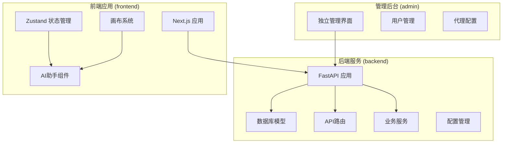

**图表来源**
- [main.py:110-175](file://backend/main.py#L110-L175)
- [README.md:70-127](file://README.md#L70-L127)

**章节来源**
- [README.md:70-127](file://README.md#L70-L127)
- [main.py:110-175](file://backend/main.py#L110-L175)

## 核心组件

### 数据库模型系统

系统使用SQLAlchemy ORM定义了完整的数据模型层次：

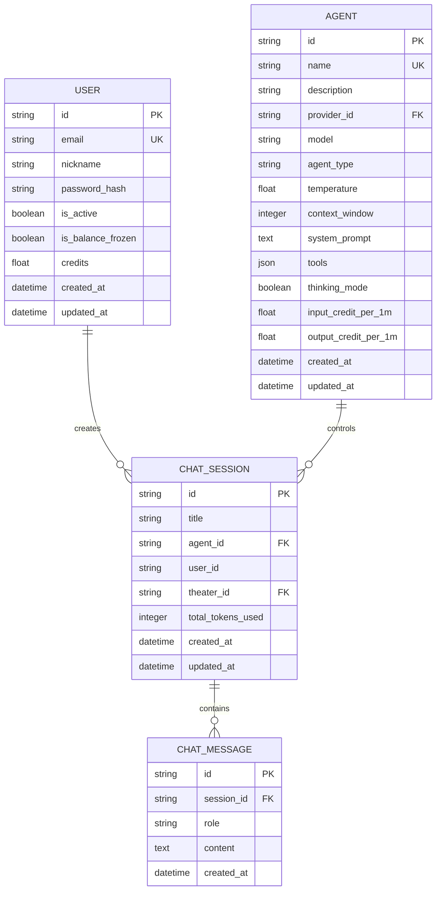

**图表来源**
- [models.py:35-262](file://backend/models.py#L35-L262)

### 前端状态管理系统

使用Zustand实现的轻量级状态管理，支持AI助手的完整生命周期：

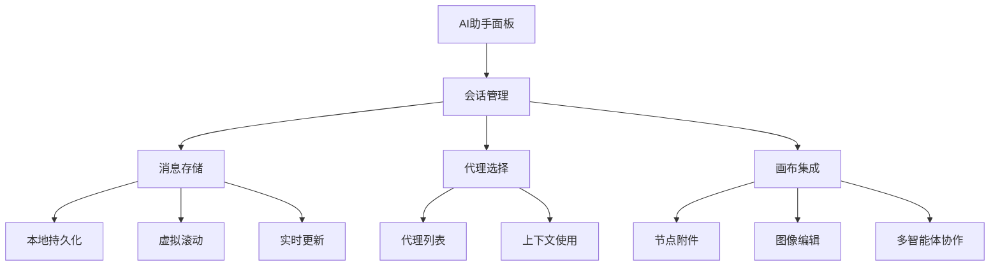

**图表来源**
- [useAIAssistantStore.ts:92-188](file://frontend/src/store/useAIAssistantStore.ts#L92-L188)

**章节来源**
- [models.py:35-262](file://backend/models.py#L35-L262)
- [useAIAssistantStore.ts:92-188](file://frontend/src/store/useAIAssistantStore.ts#L92-L188)

## 架构概览

系统采用分层架构设计，实现了清晰的关注点分离：

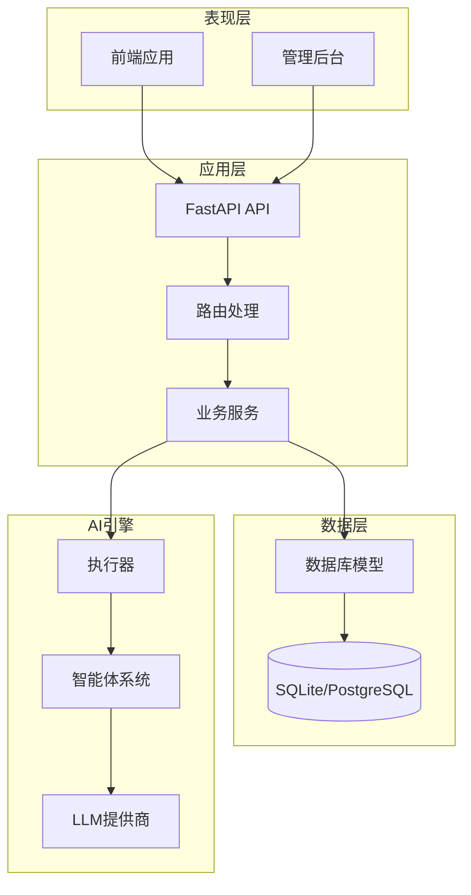

**图表来源**
- [main.py:32-45](file://backend/main.py#L32-L45)
- [agent_executor.py:63-126](file://backend/services/agent_executor.py#L63-L126)

## 详细组件分析

### 后端API架构

#### 智能体管理API

智能体管理提供了完整的CRUD操作和验证机制：

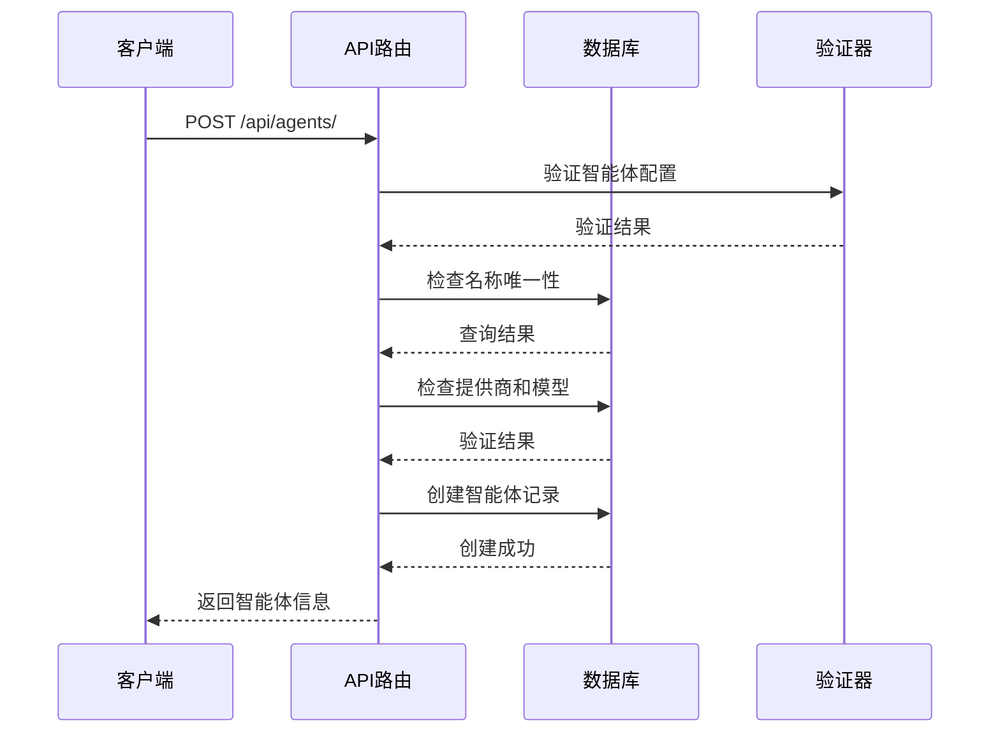

**图表来源**
- [agents.py:16-65](file://backend/routers/agents.py#L16-L65)

#### 会话管理机制

前端使用自定义Hook管理AI助手会话：

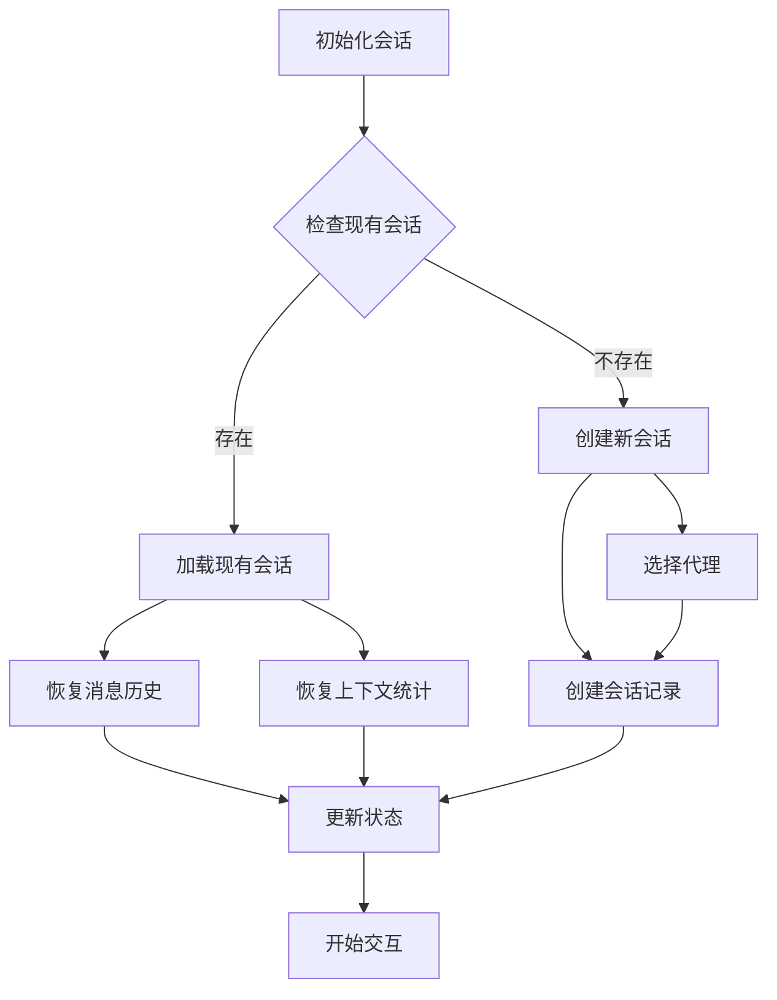

**图表来源**
- [useSessionManager.ts:52-123](file://frontend/src/components/ai-assistant/hooks/useSessionManager.ts#L52-L123)

**章节来源**
- [agents.py:16-151](file://backend/routers/agents.py#L16-L151)
- [useSessionManager.ts:52-123](file://frontend/src/components/ai-assistant/hooks/useSessionManager.ts#L52-L123)

### 数据持久化策略

#### 后端数据模型设计

系统采用标准化的数据库模型设计，支持完整的AI助手功能：

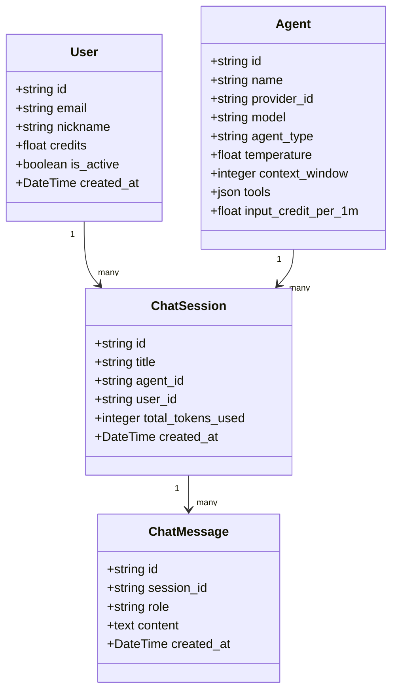

**图表来源**
- [models.py:35-262](file://backend/models.py#L35-L262)

#### 前端状态持久化

使用localStorage实现状态持久化，确保用户体验连续性：

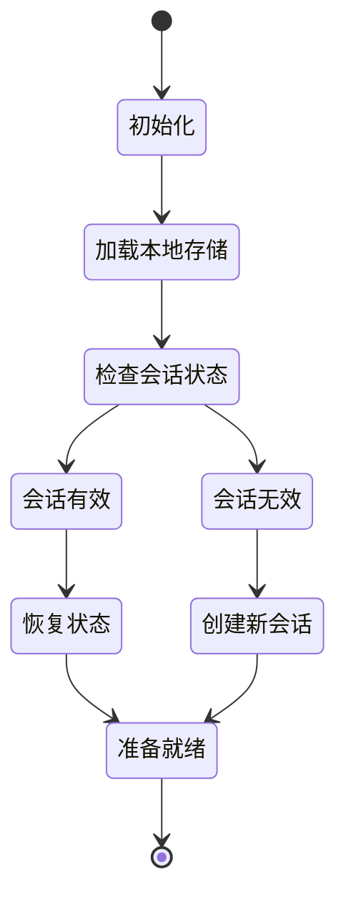

**图表来源**
- [useAIAssistantStore.ts:224-265](file://frontend/src/store/useAIAssistantStore.ts#L224-L265)

**章节来源**
- [models.py:35-262](file://backend/models.py#L35-L262)
- [useAIAssistantStore.ts:224-265](file://frontend/src/store/useAIAssistantStore.ts#L224-L265)

### 实时通信机制

#### WebSocket集成

系统集成了WebSocket支持实时双向通信：

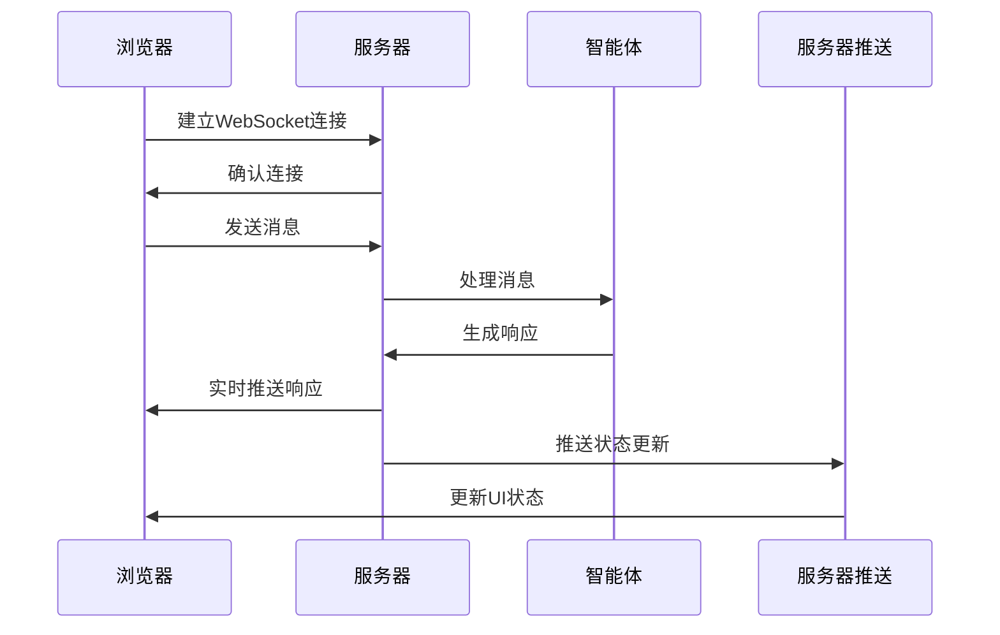

**图表来源**
- [main.py:161-172](file://backend/main.py#L161-L172)

**章节来源**
- [main.py:161-172](file://backend/main.py#L161-L172)

## 依赖关系分析

### 技术栈依赖

系统采用现代化的技术栈组合：

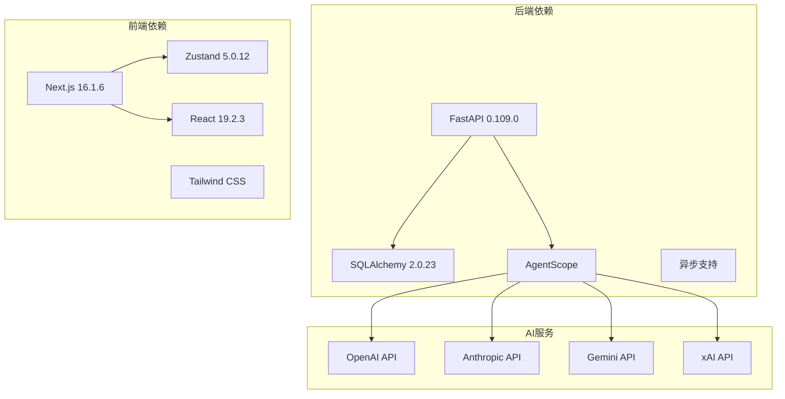

**图表来源**
- [package.json:13-94](file://frontend/package.json#L13-L94)

### 数据流依赖

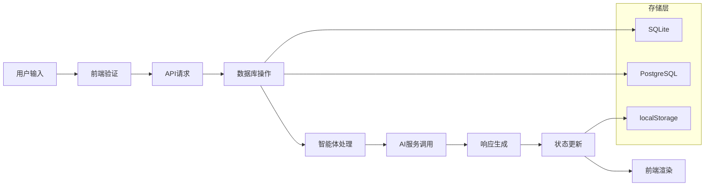

**图表来源**
- [api.ts:31-81](file://frontend/src/lib/api.ts#L31-L81)

**章节来源**
- [package.json:13-94](file://frontend/package.json#L13-L94)
- [api.ts:31-81](file://frontend/src/lib/api.ts#L31-L81)

## 性能考虑

### 数据库优化

系统采用了多项数据库优化策略：

1. **连接池配置**：使用异步连接池提高并发性能
2. **SQLite优化**：启用WAL模式和适当的PRAGMA设置
3. **索引策略**：为常用查询字段建立索引
4. **查询优化**：使用分页和限制返回数量

### 前端性能优化

1. **虚拟滚动**：使用React Window实现大数据集的高效渲染
2. **状态分区**：将大型状态分割为更小的独立状态
3. **缓存策略**：合理使用localStorage缓存静态数据
4. **懒加载**：按需加载组件和数据

### 实时通信优化

1. **WebSocket复用**：单连接支持多路复用
2. **消息压缩**：对传输数据进行压缩
3. **心跳机制**：维持连接活跃状态
4. **错误重连**：自动处理连接中断

## 故障排除指南

### 常见问题诊断

#### 数据库连接问题

**症状**：应用启动时数据库连接失败

**解决方案**：
1. 检查DATABASE_URL配置
2. 验证数据库服务状态
3. 检查网络连接
4. 确认权限设置

#### 会话管理问题

**症状**：AI助手会话状态丢失

**解决方案**：
1. 检查localStorage可用性
2. 验证状态序列化
3. 检查浏览器隐私设置
4. 确认状态存储键名

#### 实时通信问题

**症状**：WebSocket连接不稳定

**解决方案**：
1. 检查防火墙设置
2. 验证服务器配置
3. 检查网络延迟
4. 确认客户端重连逻辑

**章节来源**
- [database.py:24-31](file://backend/database.py#L24-L31)
- [useAIAssistantStore.ts:348-368](file://frontend/src/store/useAIAssistantStore.ts#L348-L368)

## 结论

增强的AI助手存储项目展现了现代全栈应用的最佳实践。通过合理的架构设计、完善的组件分离和高效的性能优化，该项目成功实现了复杂的AI助手功能。

### 主要优势

1. **架构清晰**：前后端分离，职责明确
2. **扩展性强**：模块化设计支持功能扩展
3. **性能优秀**：多层优化确保响应速度
4. **用户体验好**：状态持久化和实时交互
5. **技术先进**：采用最新的开发技术和工具

### 技术亮点

- 基于AgentScope的智能体系统
- 基于Zustand的状态管理
- 响应式的实时通信
- 完整的数据库模型设计
- 现代化的前端开发体验

该项目为AI内容创作平台提供了一个坚实的技术基础，具备良好的可维护性和扩展性，适合进一步的功能开发和生产环境部署。