# 增强的AI助手存储

<cite>
**本文档引用的文件**
- [README.md](file://README.md)
- [main.py](file://backend/main.py)
- [models.py](file://backend/models.py)
- [schemas.py](file://backend/schemas.py)
- [config.py](file://backend/config.py)
- [database.py](file://backend/database.py)
- [agents.py](file://backend/routers/agents.py)
- [agent_executor.py](file://backend/services/agent_executor.py)
- [videos.py](file://backend/routers/videos.py)
- [useAIAssistantStore.ts](file://frontend/src/store/useAIAssistantStore.ts)
- [useSessionManager.ts](file://frontend/src/components/ai-assistant/hooks/useSessionManager.ts)
- [useSSEHandler.ts](file://frontend/src/components/ai-assistant/hooks/useSSEHandler.ts)
- [VideoTaskCard.tsx](file://frontend/src/components/ai-assistant/VideoTaskCard.tsx)
- [AIAssistantPanel.tsx](file://frontend/src/components/canvas/AIAssistantPanel.tsx)
- [WelcomeMessage.tsx](file://frontend/src/components/ai-assistant/WelcomeMessage.tsx)
- [api.ts](file://frontend/src/lib/api.ts)
- [index.ts](file://frontend/src/components/ai-assistant/index.ts)
- [useVideoTasks.ts](file://backend/admin/src/hooks/useVideoTasks.ts)
- [VideoPreviewModal.tsx](file://backend/admin/src/app/admin/videos/VideoPreviewModal.tsx)
- [video.ts](file://backend/admin/src/types/video.ts)
</cite>

## 更新摘要
**所做更改**
- 新增欢迎消息状态管理章节，详细介绍isWelcome属性的引入和使用
- 更新核心组件分析，增加Message接口的isWelcome字段支持
- 优化默认消息初始化逻辑，实现智能欢迎消息状态管理
- 新增AI助手面板的欢迎状态布局处理机制
- 更新前端状态管理，支持欢迎消息的完整生命周期

## 目录
1. [简介](#简介)
2. [项目结构](#项目结构)
3. [核心组件](#核心组件)
4. [架构概览](#架构概览)
5. [详细组件分析](#详细组件分析)
6. [欢迎消息状态管理](#欢迎消息状态管理)
7. [视频任务跟踪系统](#视频任务跟踪系统)
8. [依赖关系分析](#依赖关系分析)
9. [性能考虑](#性能考虑)
10. [故障排除指南](#故障排除指南)
11. [结论](#结论)

## 简介

增强的AI助手存储是基于AgentScope多智能体框架构建的通用AI内容创作和交互平台。该项目实现了完整的AI助手会话管理和状态持久化机制，支持多智能体协作、实时交互、智能计费系统以及**新增的欢迎消息状态管理能力**。

该平台的核心特色包括：
- **智能代理编排**：基于AgentScope的多智能体协作系统
- **插件化技能体系**：可扩展的技能插件架构
- **多模态内容生成**：集成多种AI服务商的文本、图像、**视频生成能力**
- **实时交互引擎**：基于WebSocket和Server-Sent Events的低延迟双向通信
- **智能计费系统**：基于积分的精细化消费模式
- **可视化管理后台**：提供完整的用户管理、代理监控界面
- **视频任务跟踪**：完整的视频生成任务生命周期管理，支持进度监控和状态更新
- **智能欢迎消息**：基于isWelcome属性的欢迎消息状态管理，优化用户体验

## 项目结构

项目采用前后端分离架构，包含三个主要部分，并新增了智能欢迎消息管理模块：

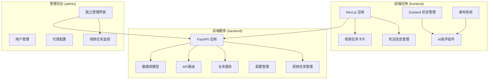

**图表来源**
- [main.py:110-175](file://backend/main.py#L110-L175)
- [README.md:70-127](file://README.md#L70-L127)

**章节来源**
- [README.md:70-127](file://README.md#L70-L127)
- [main.py:110-175](file://backend/main.py#L110-L175)

## 核心组件

### 数据库模型系统

系统使用SQLAlchemy ORM定义了完整的数据模型层次，**新增视频任务模型和优化的消息模型**：

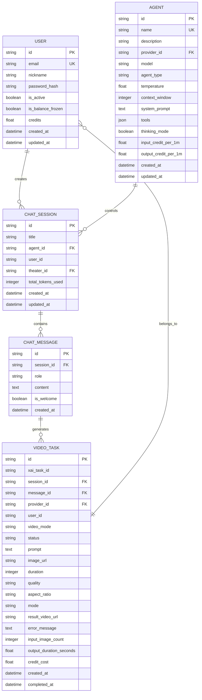

**图表来源**
- [models.py:35-234](file://backend/models.py#L35-L234)
- [models.py:402-434](file://backend/models.py#L402-L434)

### 前端状态管理系统

使用Zustand实现的轻量级状态管理，支持AI助手的完整生命周期，**新增欢迎消息状态管理**：

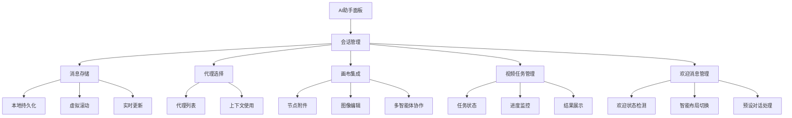

**图表来源**
- [useAIAssistantStore.ts:92-188](file://frontend/src/store/useAIAssistantStore.ts#L92-L188)

**章节来源**
- [models.py:35-234](file://backend/models.py#L35-L234)
- [useAIAssistantStore.ts:92-188](file://frontend/src/store/useAIAssistantStore.ts#L92-L188)

## 架构概览

系统采用分层架构设计，实现了清晰的关注点分离，**新增欢迎消息处理层**：

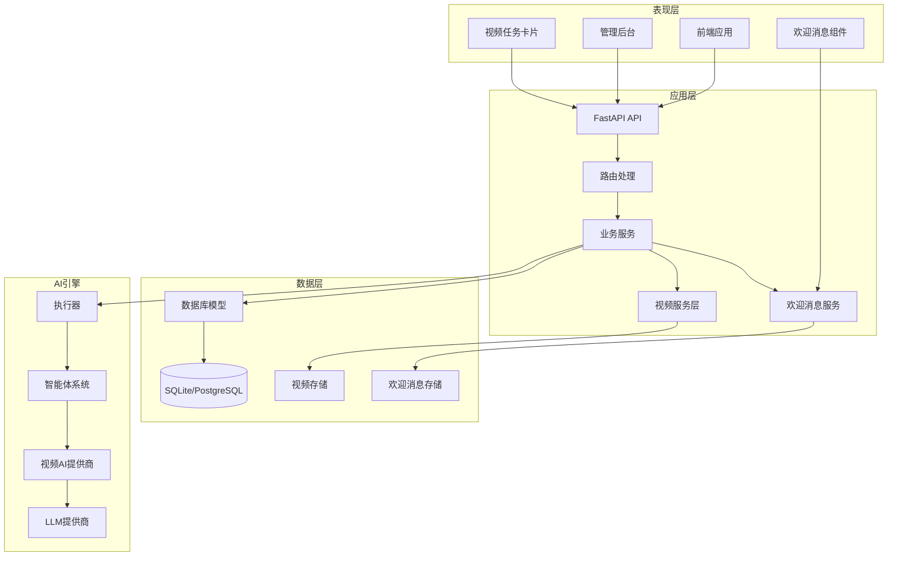

**图表来源**
- [main.py:32-45](file://backend/main.py#L32-L45)
- [agent_executor.py:63-126](file://backend/services/agent_executor.py#L63-L126)

## 详细组件分析

### 后端API架构

#### 智能体管理API

智能体管理提供了完整的CRUD操作和验证机制：

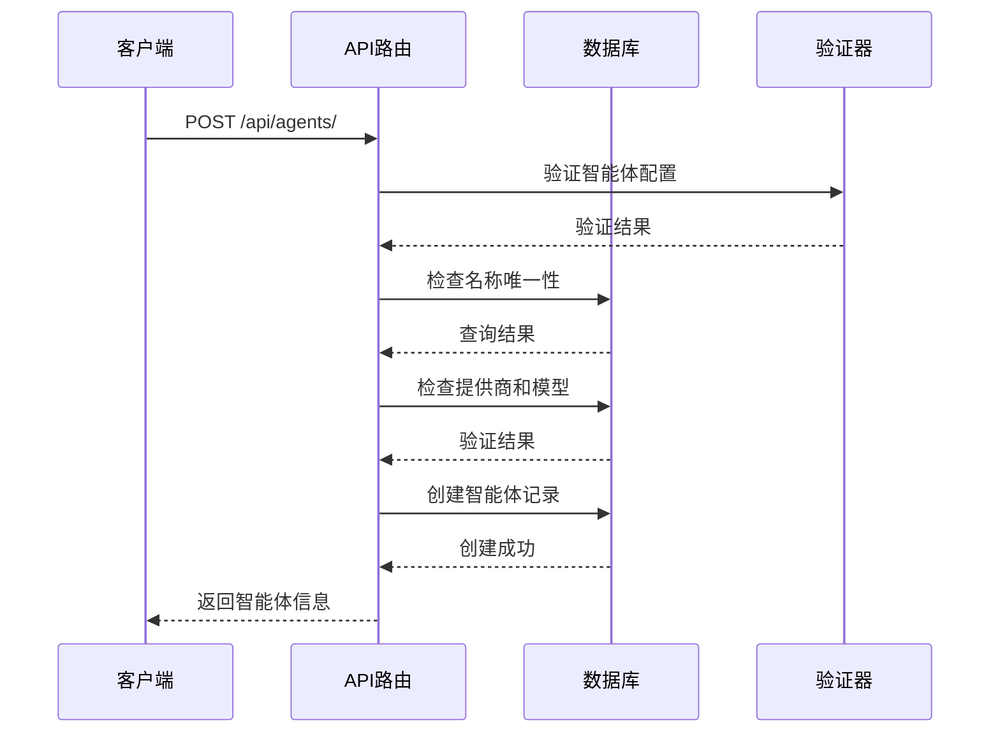

**图表来源**
- [agents.py:16-65](file://backend/routers/agents.py#L16-L65)

#### 会话管理机制

前端使用自定义Hook管理AI助手会话：

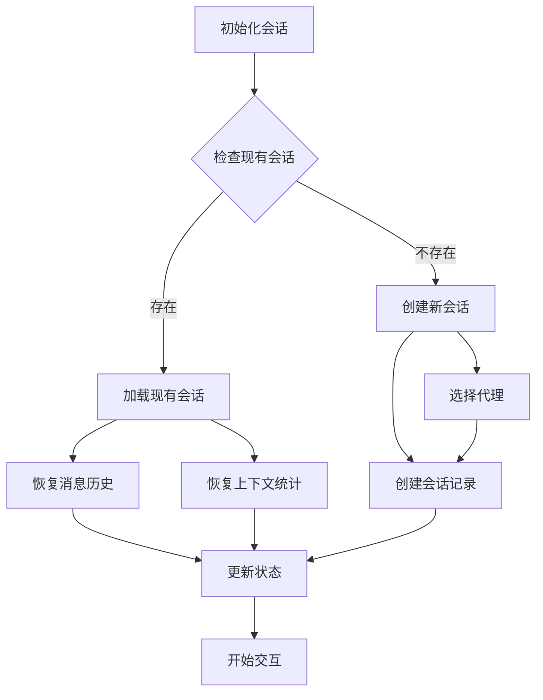

**图表来源**
- [useSessionManager.ts:52-123](file://frontend/src/components/ai-assistant/hooks/useSessionManager.ts#L52-L123)

**章节来源**
- [agents.py:16-151](file://backend/routers/agents.py#L16-L151)
- [useSessionManager.ts:52-123](file://frontend/src/components/ai-assistant/hooks/useSessionManager.ts#L52-L123)

### 数据持久化策略

#### 后端数据模型设计

系统采用标准化的数据库模型设计，支持完整的AI助手功能，**新增视频任务模型和欢迎消息字段**：

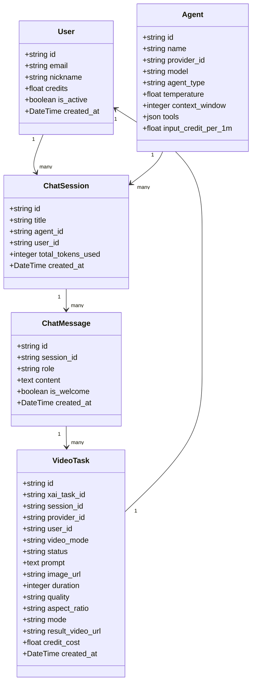

**图表来源**
- [models.py:35-234](file://backend/models.py#L35-L234)
- [models.py:402-434](file://backend/models.py#L402-L434)

#### 前端状态持久化

使用localStorage实现状态持久化，确保用户体验连续性：

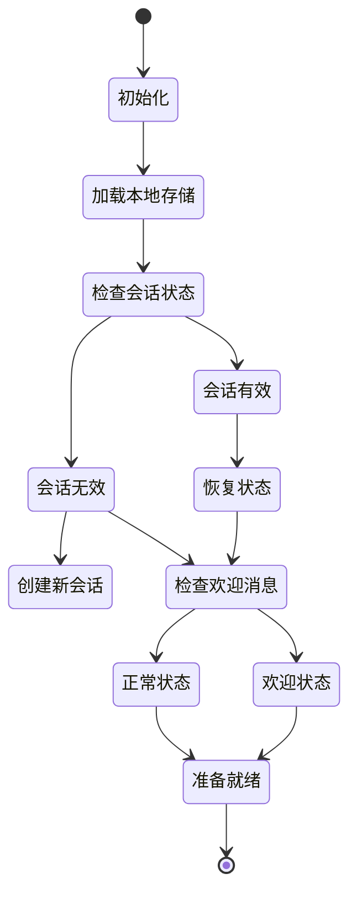

**图表来源**
- [useAIAssistantStore.ts:224-265](file://frontend/src/store/useAIAssistantStore.ts#L224-L265)

**章节来源**
- [models.py:35-234](file://backend/models.py#L35-L234)
- [useAIAssistantStore.ts:224-265](file://frontend/src/store/useAIAssistantStore.ts#L224-L265)

### 实时通信机制

#### WebSocket集成

系统集成了WebSocket支持实时双向通信，**新增视频任务状态推送和欢迎消息通知**：

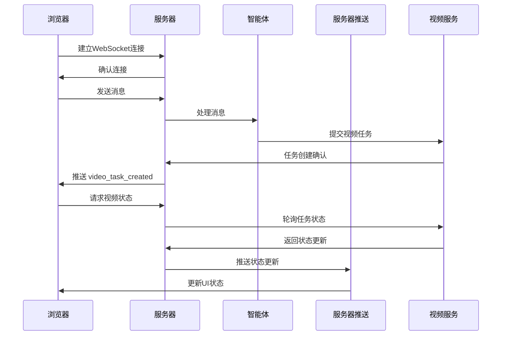

**图表来源**
- [main.py:161-172](file://backend/main.py#L161-L172)
- [useSSEHandler.ts:167-182](file://frontend/src/components/ai-assistant/hooks/useSSEHandler.ts#L167-L182)

**章节来源**
- [main.py:161-172](file://backend/main.py#L161-L172)
- [useSSEHandler.ts:167-182](file://frontend/src/components/ai-assistant/hooks/useSSEHandler.ts#L167-L182)

## 欢迎来消息状态管理

### 欢迎消息状态检测机制

系统实现了智能的欢迎消息状态管理，通过isWelcome属性标识欢迎消息并提供相应的UI处理：

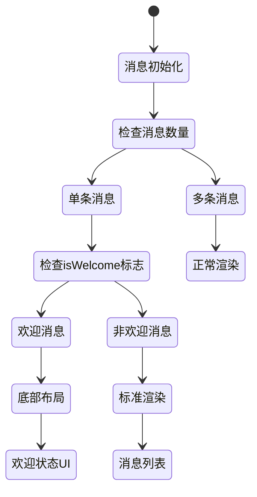

**图表来源**
- [AIAssistantPanel.tsx:457-497](file://frontend/src/components/canvas/AIAssistantPanel.tsx#L457-L497)

### Message接口增强

Message接口新增isWelcome属性，支持欢迎消息的状态管理：

```typescript
export interface Message {
  role: MessageRole;
  content: string;
  status?: MessageStatus;
  // 扩展字段用于技能/工具/多智能体/视频任务展示
  skill_calls?: SkillCall[];
  tool_calls?: ToolCall[];
  multi_agent?: MultiAgentData;
  video_tasks?: VideoTaskData[];
  // 欢迎消息标记
  isWelcome?: boolean;
}
```

**图表来源**
- [useAIAssistantStore.ts:50-61](file://frontend/src/store/useAIAssistantStore.ts#L50-L61)

### 默认消息初始化优化

系统优化了默认消息初始化逻辑，确保欢迎消息的正确状态：

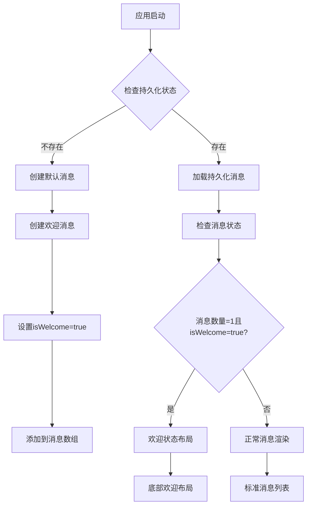

**图表来源**
- [useAIAssistantStore.ts:200-202](file://frontend/src/store/useAIAssistantStore.ts#L200-L202)
- [useSessionManager.ts:8-10](file://frontend/src/components/ai-assistant/hooks/useSessionManager.ts#L8-L10)

### AI助手面板欢迎状态处理

AI助手面板实现了智能的欢迎状态布局处理：

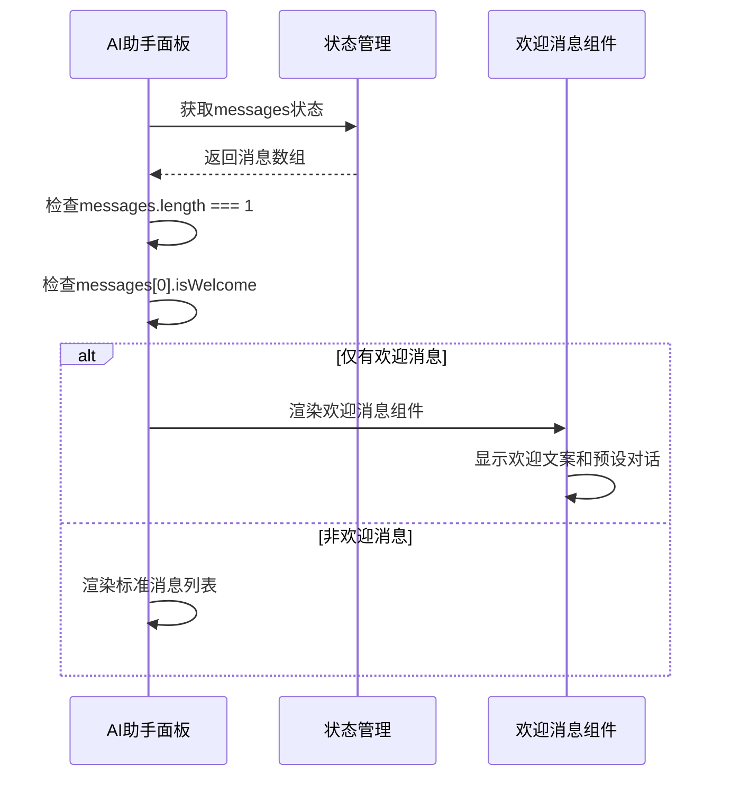

**图表来源**
- [AIAssistantPanel.tsx:457-497](file://frontend/src/components/canvas/AIAssistantPanel.tsx#L457-L497)

### 欢迎消息组件设计

WelcomeMessage组件提供了完整的欢迎体验：

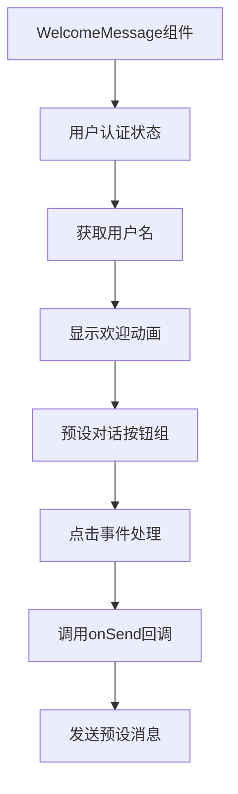

**图表来源**
- [WelcomeMessage.tsx:28-67](file://frontend/src/components/ai-assistant/WelcomeMessage.tsx#L28-L67)

**章节来源**
- [AIAssistantPanel.tsx:457-497](file://frontend/src/components/canvas/AIAssistantPanel.tsx#L457-L497)
- [useAIAssistantStore.ts:50-61](file://frontend/src/store/useAIAssistantStore.ts#L50-L61)
- [useSessionManager.ts:8-10](file://frontend/src/components/ai-assistant/hooks/useSessionManager.ts#L8-L10)
- [WelcomeMessage.tsx:28-67](file://frontend/src/components/ai-assistant/WelcomeMessage.tsx#L28-L67)

## 视频任务跟踪系统

### 视频任务生命周期

系统提供了完整的视频生成任务生命周期管理：

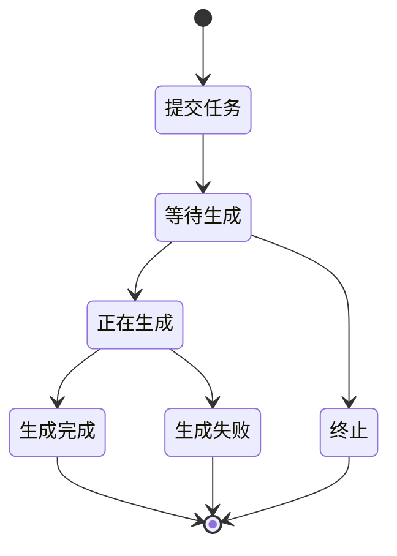

**图表来源**
- [videos.py:149-232](file://backend/routers/videos.py#L149-L232)
- [VideoTaskCard.tsx:36-46](file://frontend/src/components/ai-assistant/VideoTaskCard.tsx#L36-L46)

### 视频任务API接口

#### 任务创建接口

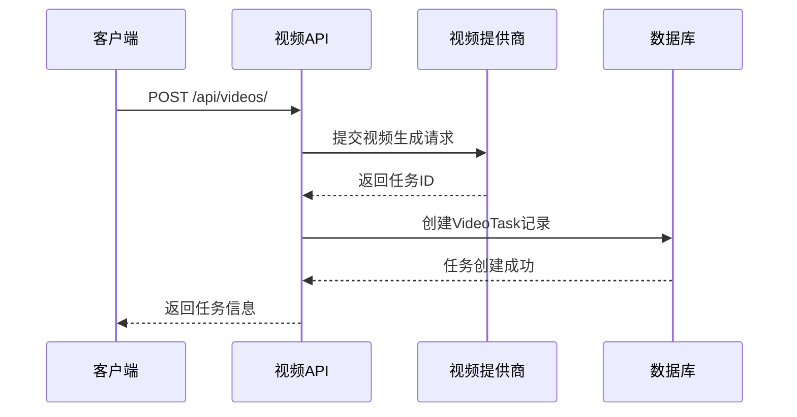

**图表来源**
- [videos.py:74-146](file://backend/routers/videos.py#L74-L146)

#### 任务状态查询

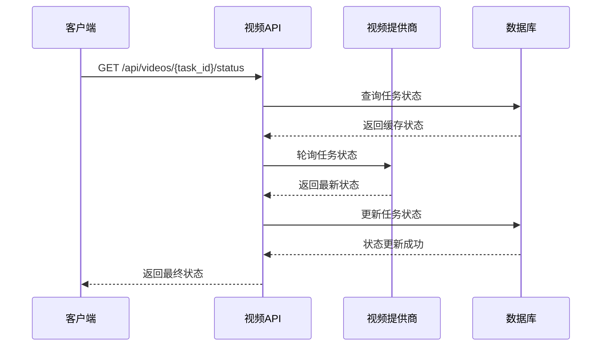

**图表来源**
- [videos.py:149-232](file://backend/routers/videos.py#L149-L232)

### 前端视频任务管理

#### 视频任务卡片组件

前端实现了完整的视频任务状态展示和交互功能：

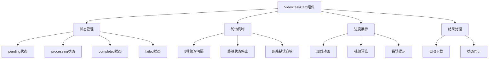

**图表来源**
- [VideoTaskCard.tsx:64-235](file://frontend/src/components/ai-assistant/VideoTaskCard.tsx#L64-L235)

**章节来源**
- [videos.py:74-232](file://backend/routers/videos.py#L74-L232)
- [VideoTaskCard.tsx:64-235](file://frontend/src/components/ai-assistant/VideoTaskCard.tsx#L64-L235)

## 依赖关系分析

### 技术栈依赖

系统采用现代化的技术栈组合，**新增视频处理相关依赖和欢迎消息处理依赖**：

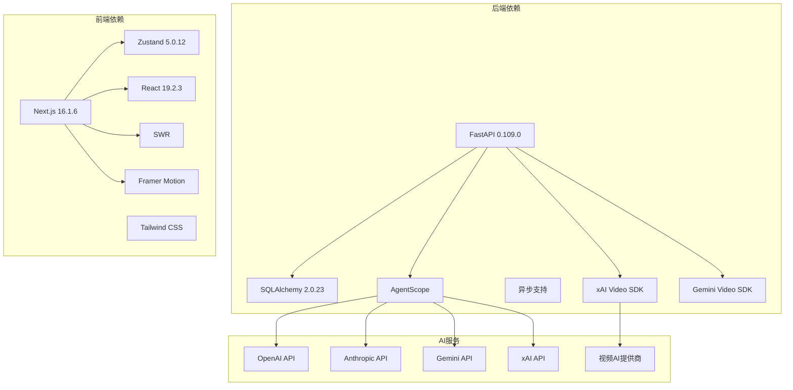

**图表来源**
- [package.json:13-94](file://frontend/package.json#L13-L94)

### 数据流依赖

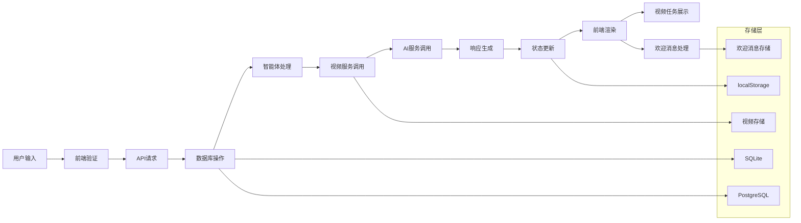

**图表来源**
- [api.ts:31-81](file://frontend/src/lib/api.ts#L31-L81)

**章节来源**
- [package.json:13-94](file://frontend/package.json#L13-L94)
- [api.ts:31-81](file://frontend/src/lib/api.ts#L31-L81)

## 性能考虑

### 数据库优化

系统采用了多项数据库优化策略，**新增视频任务相关优化和欢迎消息索引优化**：

1. **连接池配置**：使用异步连接池提高并发性能
2. **SQLite优化**：启用WAL模式和适当的PRAGMA设置
3. **索引策略**：为常用查询字段建立索引，包括视频任务的状态和用户ID索引，**新增欢迎消息is_welcome字段索引**
4. **查询优化**：使用分页和限制返回数量，优化视频任务列表查询
5. **批量操作**：支持视频任务的批量状态更新和查询
6. **欢迎消息缓存**：优化欢迎消息的查询和渲染性能

### 前端性能优化

1. **虚拟滚动**：使用React Window实现大数据集的高效渲染
2. **状态分区**：将大型状态分割为更小的独立状态
3. **缓存策略**：合理使用localStorage缓存静态数据
4. **懒加载**：按需加载组件和数据
5. **轮询优化**：智能轮询策略，活跃任务才进行频繁轮询
6. **欢迎消息优化**：**新增欢迎消息的特殊渲染优化，避免不必要的DOM操作**

### 实时通信优化

1. **WebSocket复用**：单连接支持多路复用
2. **消息压缩**：对传输数据进行压缩
3. **心跳机制**：维持连接活跃状态
4. **错误重连**：自动处理连接中断
5. **视频状态推送**：基于Server-Sent Events的实时状态更新
6. **欢迎消息推送**：**新增欢迎消息状态的实时推送机制**

### 视频任务性能优化

1. **异步处理**：视频生成任务异步执行，不阻塞主线程
2. **状态缓存**：终端状态任务使用缓存减少API调用
3. **轮询节流**：活跃任务每5秒轮询一次，非活跃任务停止轮询
4. **资源管理**：及时清理已完成的视频文件和相关资源
5. **错误处理**：网络错误和超时的优雅降级处理

### 欢迎消息性能优化

1. **状态检测优化**：**新增高效的欢迎消息状态检测算法**
2. **条件渲染优化**：**智能的条件渲染机制，仅在必要时渲染欢迎消息**
3. **布局优化**：**专门的底部布局优化，提升用户体验**
4. **预设对话缓存**：**预设对话按钮的性能优化和缓存机制**

## 故障排除指南

### 常见问题诊断

#### 数据库连接问题

**症状**：应用启动时数据库连接失败

**解决方案**：
1. 检查DATABASE_URL配置
2. 验证数据库服务状态
3. 检查网络连接
4. 确认权限设置

#### 会话管理问题

**症状**：AI助手会话状态丢失

**解决方案**：
1. 检查localStorage可用性
2. 验证状态序列化
3. 检查浏览器隐私设置
4. 确认状态存储键名

#### 实时通信问题

**症状**：WebSocket连接不稳定

**解决方案**：
1. 检查防火墙设置
2. 验证服务器配置
3. 检查网络延迟
4. 确认客户端重连逻辑

#### 视频任务问题

**症状**：视频任务状态无法更新

**解决方案**：
1. 检查视频提供商API密钥
2. 验证网络连接和超时设置
3. 检查轮询间隔配置
4. 确认任务状态转换逻辑
5. 验证视频文件存储权限

#### 欢迎消息问题

**症状**：欢迎消息显示异常或无法正常工作

**解决方案**：
1. **检查Message接口的isWelcome字段定义**
2. **验证DEFAULT_MESSAGES数组中的欢迎消息配置**
3. **确认AI助手面板的欢迎状态检测逻辑**
4. **检查WelcomeMessage组件的渲染逻辑**
5. **验证localStorage中的欢迎消息状态**
6. **确认状态管理中欢迎消息的处理流程**

**章节来源**
- [database.py:24-31](file://backend/database.py#L24-L31)
- [useAIAssistantStore.ts:348-368](file://frontend/src/store/useAIAssistantStore.ts#L348-L368)

## 结论

增强的AI助手存储项目展现了现代全栈应用的最佳实践。通过合理的架构设计、完善的组件分离、高效的性能优化以及**新增的欢迎消息状态管理能力**，该项目成功实现了复杂的AI助手功能。

### 主要优势

1. **架构清晰**：前后端分离，职责明确
2. **扩展性强**：模块化设计支持功能扩展
3. **性能优秀**：多层优化确保响应速度
4. **用户体验好**：状态持久化和实时交互
5. **技术先进**：采用最新的开发技术和工具
6. **功能完整**：支持文本、图像、**视频**等多种内容生成
7. **管理完善**：提供完整的视频任务监控和管理功能
8. **智能欢迎体验**：**基于isWelcome属性的智能欢迎消息管理**

### 技术亮点

- 基于AgentScope的智能体系统
- 基于Zustand的状态管理
- 响应式的实时通信
- 完整的数据库模型设计
- 现代化的前端开发体验
- **智能的欢迎消息状态管理**
- **优化的默认消息初始化逻辑**
- **专门的欢迎状态UI处理**
- **完整的视频任务生命周期管理**
- **智能的视频生成计费系统**
- **直观的视频任务监控界面**

### 新增功能价值

**欢迎消息状态管理系统的引入**为平台带来了以下价值：
- **智能的用户体验优化**：通过isWelcome属性实现智能的欢迎消息识别和处理
- **优化的界面布局**：当仅有欢迎消息时，自动采用底部布局，提供更好的视觉体验
- **完整的欢迎流程**：从消息初始化到UI渲染的完整欢迎消息处理链路
- **预设对话功能**：为用户提供便捷的预设对话入口，降低使用门槛
- **状态持久化支持**：欢迎消息状态与整体应用状态管理无缝集成
- **性能优化**：专门的欢迎消息渲染优化，提升应用响应速度

**视频任务跟踪系统的引入**为平台带来了以下价值：
- **完整的多模态内容创作能力**：从文本到图像再到视频的全流程支持
- **实时进度监控**：用户可以实时查看视频生成进度
- **智能状态管理**：自动处理视频生成的各种状态变化
- **完善的错误处理**：提供详细的错误信息和重试机制
- **资源优化**：智能的轮询策略和资源清理机制
- **管理便利**：后台提供完整的视频任务监控和管理功能

**欢迎消息状态管理和视频任务跟踪系统的结合**使该项目成为了一个真正意义上的多模态AI创作平台，具备了完整的用户体验和专业的功能特性，为AI内容创作提供了坚实的技术基础，具备良好的可维护性和扩展性，适合进一步的功能开发和生产环境部署。