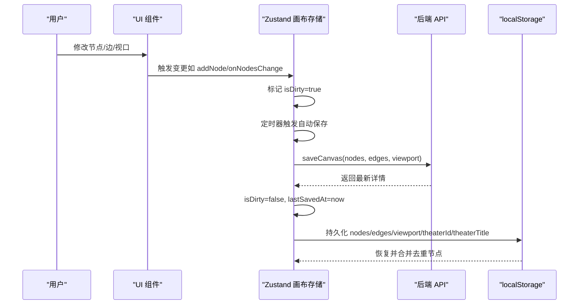
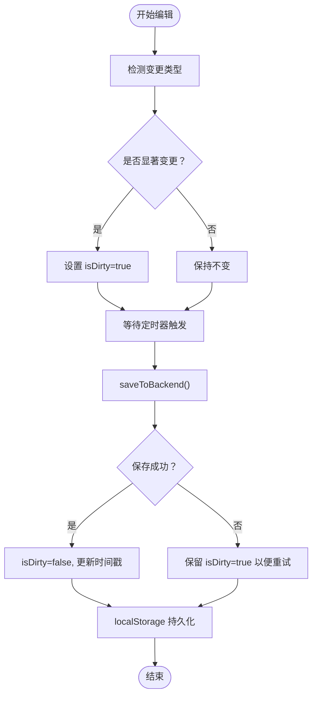
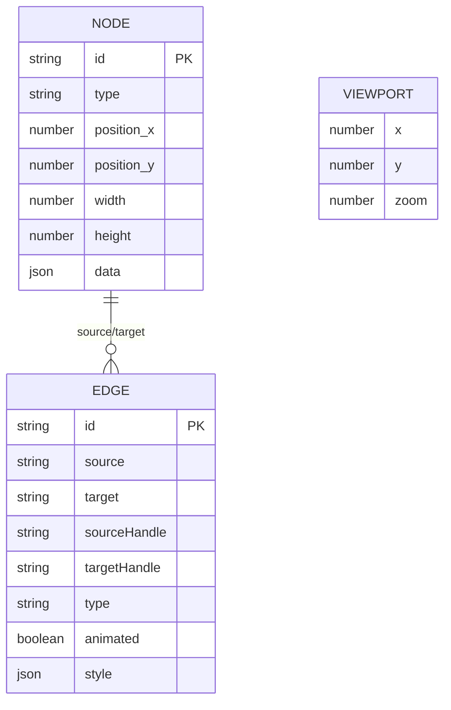
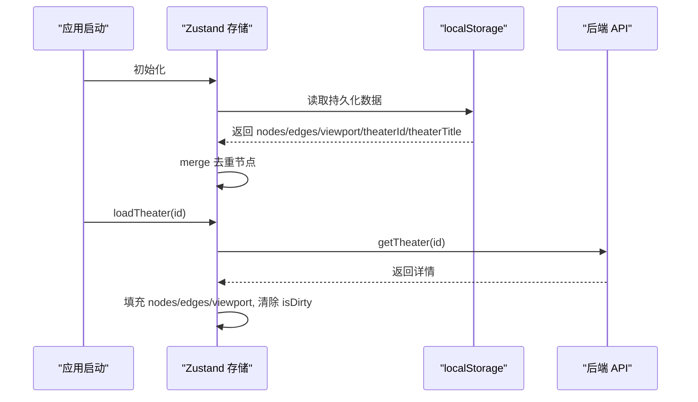
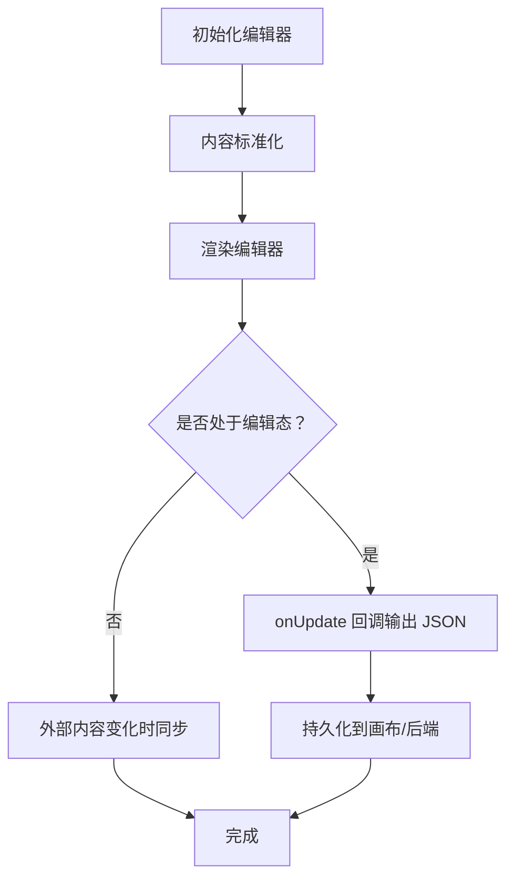
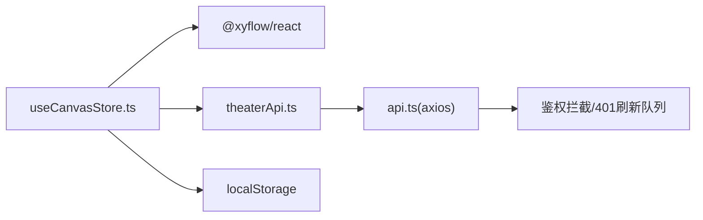

# 状态持久化

<cite>
**本文引用的文件**
- [useCanvasStore.ts](file://frontend/src/store/useCanvasStore.ts)
- [useCanvasStore.test.ts](file://frontend/src/store/__tests__/useCanvasStore.test.ts)
- [theaterApi.ts](file://frontend/src/lib/theaterApi.ts)
- [ScriptEditor.tsx](file://frontend/src/components/canvas/ScriptEditor.tsx)
- [TopBar.tsx](file://frontend/src/app/theater/[id]/components/TopBar.tsx)
- [Sidebar.tsx](file://frontend/src/components/canvas/Sidebar.tsx)
- [api.ts](file://frontend/src/lib/api.ts)
</cite>

## 目录
1. [简介](#简介)
2. [项目结构](#项目结构)
3. [核心组件](#核心组件)
4. [架构总览](#架构总览)
5. [详细组件分析](#详细组件分析)
6. [依赖分析](#依赖分析)
7. [性能考量](#性能考量)
8. [故障排查指南](#故障排查指南)
9. [结论](#结论)
10. [附录：最佳实践与示例路径](#附录最佳实践与示例路径)

## 简介
本文件聚焦 Infinite Game 的状态持久化系统，围绕前端 Zustand + localStorage 的画布状态持久化展开，涵盖以下主题：
- localStorage 使用策略：状态序列化、反序列化与合并策略
- 画布状态持久化机制：节点位置、连接关系、视口与编辑器状态
- 状态恢复流程：应用启动时的数据加载、错误处理与降级策略
- 状态清理与迁移：去重、兼容性与未来演进方向
- 性能优化与最佳实践：容量控制、离线缓存与重试队列

## 项目结构
与状态持久化直接相关的模块分布如下：
- 状态存储：Zustand Canvas Store（localStorage 持久化）
- 后端接口：剧团与画布数据的读写
- 编辑器：Tiptap 文档编辑器，支持本地内容同步
- UI 层：顶部栏显示保存状态，侧边栏展示资产

```mermaid
graph TB
subgraph "前端"
A["Zustand 画布存储<br/>localStorage 持久化"]
B["Tiptap 编辑器<br/>本地内容同步"]
C["UI 组件<br/>顶部栏/侧边栏"]
end
subgraph "后端"
D["剧团/画布 API"]
end
A <- --> D
B --> A
C --> A
```

**图表来源**
- [useCanvasStore.ts:185-539](file://frontend/src/store/useCanvasStore.ts#L185-L539)
- [theaterApi.ts:107-158](file://frontend/src/lib/theaterApi.ts#L107-L158)
- [ScriptEditor.tsx:117-280](file://frontend/src/components/canvas/ScriptEditor.tsx#L117-L280)
- [TopBar.tsx:7-11](file://frontend/src/app/theater/[id]/components/TopBar.tsx#L7-L11)
- [Sidebar.tsx:52-93](file://frontend/src/components/canvas/Sidebar.tsx#L52-L93)

**章节来源**
- [useCanvasStore.ts:185-539](file://frontend/src/store/useCanvasStore.ts#L185-L539)
- [theaterApi.ts:107-158](file://frontend/src/lib/theaterApi.ts#L107-L158)
- [ScriptEditor.tsx:117-280](file://frontend/src/components/canvas/ScriptEditor.tsx#L117-L280)
- [TopBar.tsx:7-11](file://frontend/src/app/theater/[id]/components/TopBar.tsx#L7-L11)
- [Sidebar.tsx:52-93](file://frontend/src/components/canvas/Sidebar.tsx#L52-L93)

## 核心组件
- 画布状态存储（Zustand + localStorage）
  - 关键字段：nodes、edges、viewport、theaterId、theaterTitle、isSaving、isLoading、lastSavedAt、isDirty、history、historyIndex
  - 持久化配置：名称、存储介质、部分化（仅持久化必要字段）、合并策略（去重节点）
  - 自动保存：通过 isDirty 与定时器触发后端保存
  - 历史快照：undo/redo 基于历史栈
- 后端接口封装
  - 获取/更新剧团信息、保存画布数据（节点、边、视口）
- 编辑器与 UI
  - ScriptEditor：内容标准化与本地同步
  - TopBar：保存状态提示
  - Sidebar：基于节点内容统计资产

**章节来源**
- [useCanvasStore.ts:67-114](file://frontend/src/store/useCanvasStore.ts#L67-L114)
- [useCanvasStore.ts:511-539](file://frontend/src/store/useCanvasStore.ts#L511-L539)
- [theaterApi.ts:107-158](file://frontend/src/lib/theaterApi.ts#L107-L158)
- [ScriptEditor.tsx:117-280](file://frontend/src/components/canvas/ScriptEditor.tsx#L117-L280)
- [TopBar.tsx:7-11](file://frontend/src/app/theater/[id]/components/TopBar.tsx#L7-L11)
- [Sidebar.tsx:52-93](file://frontend/src/components/canvas/Sidebar.tsx#L52-L93)

## 架构总览
下图展示了状态持久化与画布编辑的关键交互：



**图表来源**
- [useCanvasStore.ts:185-539](file://frontend/src/store/useCanvasStore.ts#L185-L539)
- [theaterApi.ts:141-150](file://frontend/src/lib/theaterApi.ts#L141-L150)

## 详细组件分析

### 1) Zustand 画布存储与 localStorage 持久化
- 序列化与反序列化
  - 使用 createJSONStorage 包装 localStorage
  - 通过 partialize 仅持久化 nodes、edges、viewport、theaterId、theaterTitle
- 合并与去重
  - merge 将持久化状态与当前状态合并
  - 对 nodes 执行按 id 去重，避免重复
- 自动保存与防抖
  - isDirty 标志位触发定时器（约 300ms）批量保存
  - 失败时不清理 isDirty，便于离线重试
- 历史与撤销重做
  - takeSnapshot 记录快照，限制最大数量
  - undo/redo 基于历史索引回放



**图表来源**
- [useCanvasStore.ts:209-254](file://frontend/src/store/useCanvasStore.ts#L209-L254)
- [useCanvasStore.ts:478-505](file://frontend/src/store/useCanvasStore.ts#L478-L505)
- [useCanvasStore.ts:511-539](file://frontend/src/store/useCanvasStore.ts#L511-L539)

**章节来源**
- [useCanvasStore.ts:511-539](file://frontend/src/store/useCanvasStore.ts#L511-L539)
- [useCanvasStore.test.ts:29-104](file://frontend/src/store/__tests__/useCanvasStore.test.ts#L29-L104)

### 2) 画布状态持久化机制
- 节点位置与尺寸
  - 通过 nodes 数组保存每个节点的位置与尺寸
- 连接关系
  - edges 数组保存边的源/目标与样式
- 视口状态
  - viewport 记录缩放与平移，便于恢复用户视角
- 编辑器状态
  - ScriptEditor 内容标准化与本地同步，避免跨会话丢失
- 剧场元数据
  - theaterId/theaterTitle 用于区分不同剧场的画布



**图表来源**
- [useCanvasStore.ts:60-168](file://frontend/src/store/useCanvasStore.ts#L60-L168)
- [theaterApi.ts:6-86](file://frontend/src/lib/theaterApi.ts#L6-L86)

**章节来源**
- [useCanvasStore.ts:60-168](file://frontend/src/store/useCanvasStore.ts#L60-L168)
- [theaterApi.ts:60-86](file://frontend/src/lib/theaterApi.ts#L60-L86)

### 3) 状态恢复流程
- 应用启动时
  - Zustand 持久化中间件从 localStorage 读取并合并到初始状态
  - merge 逻辑确保去重节点，避免重复
- 加载剧场
  - loadTheater 从后端获取详情，填充 nodes/edges/viewport，并清除 isDirty
- 同步剧场
  - syncTheater 比较远端与本地差异，选择性合并节点与边，保留用户视口



**图表来源**
- [useCanvasStore.ts:185-539](file://frontend/src/store/useCanvasStore.ts#L185-L539)
- [theaterApi.ts:124-127](file://frontend/src/lib/theaterApi.ts#L124-L127)

**章节来源**
- [useCanvasStore.ts:185-539](file://frontend/src/store/useCanvasStore.ts#L185-L539)
- [theaterApi.ts:124-127](file://frontend/src/lib/theaterApi.ts#L124-L127)

### 4) 状态清理与迁移机制
- 去重与兼容
  - merge 中按节点 id 去重，避免旧版本重复数据
- 版本兼容
  - partialize 仅持久化受支持字段；新增字段默认不会影响旧版恢复
- 迁移建议
  - 新增字段时：在 merge 中提供默认值，保证旧数据可恢复
  - 删除字段时：在持久化前进行清理（例如在应用启动时清理不再使用的字段）

**章节来源**
- [useCanvasStore.ts:521-536](file://frontend/src/store/useCanvasStore.ts#L521-L536)

### 5) 编辑器状态与内容持久化
- ScriptEditor
  - 内容标准化：支持字符串/JSON 输入，统一为 Tiptap JSON
  - 本地同步：外部内容变化时在非编辑态下安全同步
- 离线缓存与重试
  - 通过本地缓存与在线事件实现离线重试（参考覆盖率报告中的缓存逻辑）



**图表来源**
- [ScriptEditor.tsx:117-280](file://frontend/src/components/canvas/ScriptEditor.tsx#L117-L280)

**章节来源**
- [ScriptEditor.tsx:117-280](file://frontend/src/components/canvas/ScriptEditor.tsx#L117-L280)

### 6) UI 层状态反馈
- 顶部栏显示保存状态：保存中/未保存/最后保存时间
- 侧边栏统计资产：基于 nodes 中的图片/视频等资源

**章节来源**
- [TopBar.tsx:7-11](file://frontend/src/app/theater/[id]/components/TopBar.tsx#L7-L11)
- [Sidebar.tsx:52-93](file://frontend/src/components/canvas/Sidebar.tsx#L52-L93)

## 依赖分析
- 组件耦合
  - useCanvasStore 依赖 @xyflow/react 的变更处理器与工具函数
  - 依赖 theaterApi 进行后端读写
  - 依赖 localStorage 作为持久化介质
- 外部依赖
  - axios 用于网络请求，带鉴权拦截与 401 刷新队列



**图表来源**
- [useCanvasStore.ts:2-24](file://frontend/src/store/useCanvasStore.ts#L2-L24)
- [theaterApi.ts:1-1](file://frontend/src/lib/theaterApi.ts#L1-L1)
- [api.ts:1-48](file://frontend/src/lib/api.ts#L1-L48)

**章节来源**
- [useCanvasStore.ts:2-24](file://frontend/src/store/useCanvasStore.ts#L2-L24)
- [theaterApi.ts:1-1](file://frontend/src/lib/theaterApi.ts#L1-L1)
- [api.ts:1-48](file://frontend/src/lib/api.ts#L1-L48)

## 性能考量
- 持久化粒度
  - 仅持久化 nodes/edges/viewport/theaterId/theaterTitle，减少存储体积
- 变更批处理
  - isDirty + 定时器防抖，降低频繁保存开销
- 历史限制
  - 历史快照上限，避免内存膨胀
- 去重与比较
  - merge 去重节点；内容同步时进行字符串化比较，避免不必要的重绘

**章节来源**
- [useCanvasStore.ts:511-539](file://frontend/src/store/useCanvasStore.ts#L511-L539)
- [useCanvasStore.ts:116-116](file://frontend/src/store/useCanvasStore.ts#L116-L116)
- [useCanvasStore.ts:335-348](file://frontend/src/store/useCanvasStore.ts#L335-L348)

## 故障排查指南
- 保存失败不清理 isDirty
  - 现象：保存失败后仍显示“未保存”
  - 原因：设计为离线重试队列逻辑
  - 处理：等待网络恢复后自动重试
- 节点重复
  - 现象：恢复后出现重复节点
  - 原因：旧版本残留数据
  - 处理：merge 已执行去重；若仍存在，手动清理 localStorage 中对应键
- 同步不生效
  - 现象：远端更新未反映到本地
  - 原因：仅在非编辑态下进行内容同步
  - 处理：退出编辑态或确认 isEditable 状态

**章节来源**
- [useCanvasStore.test.ts:85-104](file://frontend/src/store/__tests__/useCanvasStore.test.ts#L85-L104)
- [useCanvasStore.ts:521-536](file://frontend/src/store/useCanvasStore.ts#L521-L536)
- [ScriptEditor.tsx:184-202](file://frontend/src/components/canvas/ScriptEditor.tsx#L184-L202)

## 结论
本系统通过轻量的 localStorage 持久化与 ZUSTAND 状态管理，实现了画布状态的可靠保存与恢复，兼顾了性能与可用性。结合后端 API 的读写能力与编辑器的内容标准化，整体具备良好的扩展性与向前兼容性。

## 附录：最佳实践与示例路径
- 最佳实践
  - 控制存储容量：仅持久化必要字段，定期清理无用键
  - 兼容性：新增字段时提供默认值，避免破坏旧版本恢复
  - 性能：合理使用防抖与历史快照上限，避免内存与 IO 压力
  - 安全：localStorage 不适合敏感数据；涉及凭证请走服务端
- 示例路径
  - 画布存储与持久化配置：[useCanvasStore.ts:511-539](file://frontend/src/store/useCanvasStore.ts#L511-L539)
  - 自动保存与防抖测试：[useCanvasStore.test.ts:29-104](file://frontend/src/store/__tests__/useCanvasStore.test.ts#L29-L104)
  - 后端读写接口：[theaterApi.ts:141-150](file://frontend/src/lib/theaterApi.ts#L141-L150)
  - 编辑器内容标准化与同步：[ScriptEditor.tsx:117-280](file://frontend/src/components/canvas/ScriptEditor.tsx#L117-L280)
  - 顶部栏保存状态反馈：[TopBar.tsx:7-11](file://frontend/src/app/theater/[id]/components/TopBar.tsx#L7-L11)
  - 侧边栏资产统计：[Sidebar.tsx:52-93](file://frontend/src/components/canvas/Sidebar.tsx#L52-L93)
  - 鉴权与 401 刷新队列（间接影响持久化稳定性）：[api.ts:1-48](file://frontend/src/lib/api.ts#L1-L48)