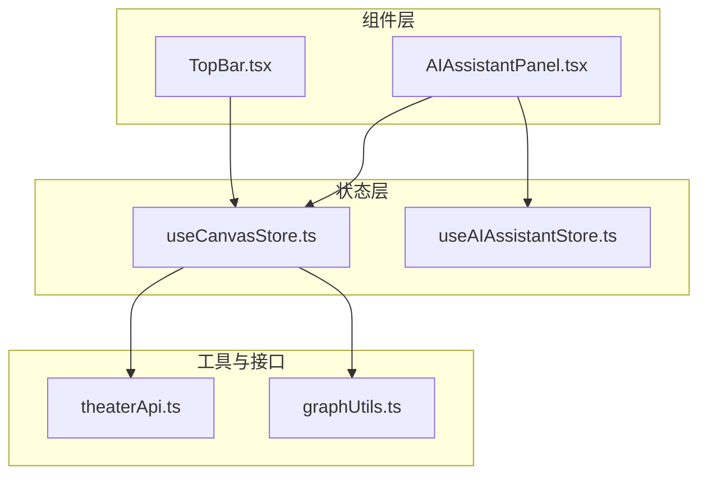
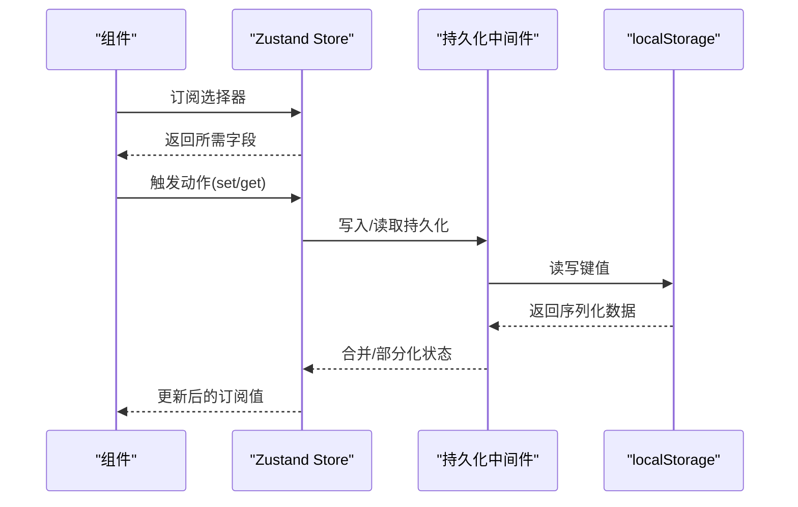
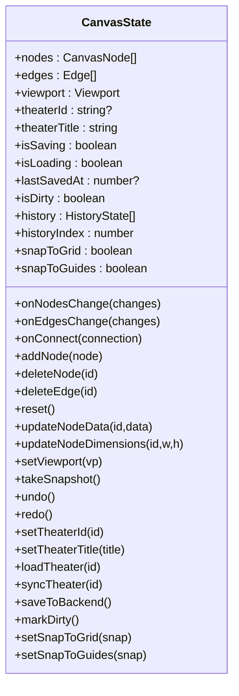
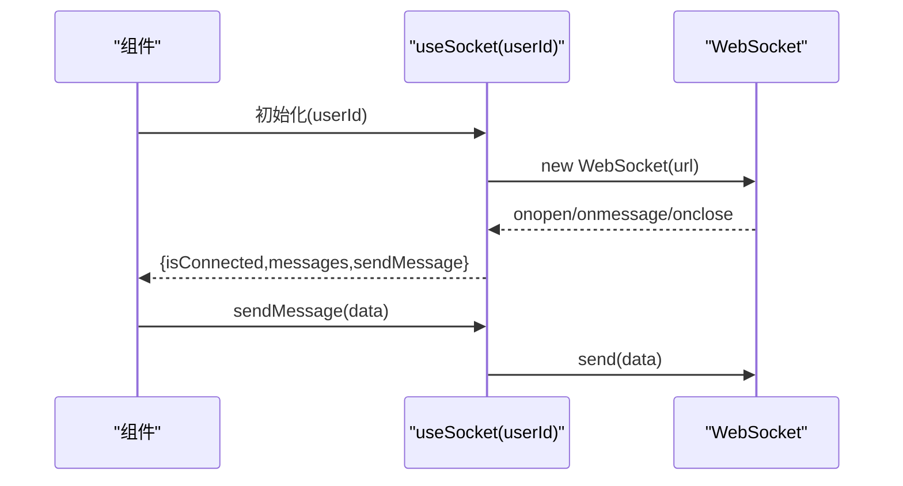
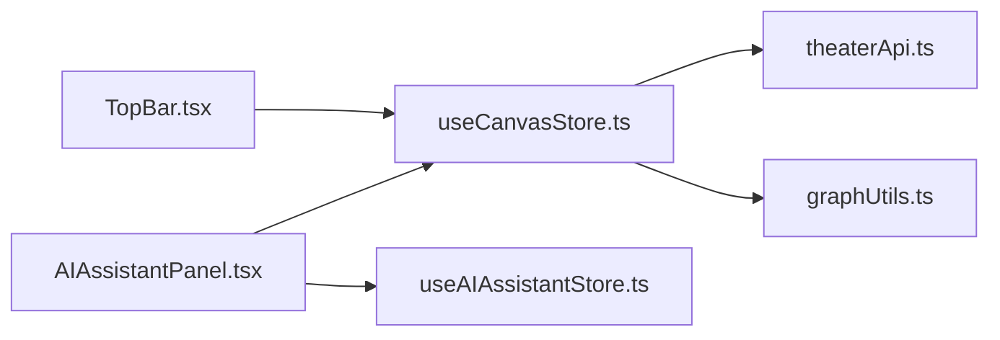

# 状态管理

<cite>
**本文引用的文件**
- [useCanvasStore.ts](file://frontend/src/store/useCanvasStore.ts)
- [useAIAssistantStore.ts](file://frontend/src/store/useAIAssistantStore.ts)
- [useSocket.ts](file://frontend/src/hooks/useSocket.ts)
- [useCanvasStore.test.ts](file://frontend/src/store/__tests__/useCanvasStore.test.ts)
- [TopBar.tsx](file://frontend/src/app/theater/[id]/components/TopBar.tsx)
- [AIAssistantPanel.tsx](file://frontend/src/components/canvas/AIAssistantPanel.tsx)
- [theaterApi.ts](file://frontend/src/lib/theaterApi.ts)
- [graphUtils.ts](file://frontend/src/lib/graphUtils.ts)
</cite>

## 目录
1. [简介](#简介)
2. [项目结构](#项目结构)
3. [核心组件](#核心组件)
4. [架构总览](#架构总览)
5. [组件详解](#组件详解)
6. [依赖关系分析](#依赖关系分析)
7. [性能与内存优化](#性能与内存优化)
8. [故障排查指南](#故障排查指南)
9. [结论](#结论)
10. [附录：最佳实践清单](#附录最佳实践清单)

## 简介
本文件系统性梳理 Infinite Game 前端的状态管理方案，重点围绕 Zustand Store 的设计与使用，涵盖以下主题：
- Store 设计：类型安全的数据模型、动作定义与副作用封装
- 订阅机制：基于 Zustand 的选择器订阅与组件解耦
- 组件间数据共享：全局状态、局部状态与跨组件通信策略
- 自定义 Hooks：useSocket、useCanvasStore 等核心 Hook 的职责与用法
- 状态持久化：localStorage 集成、恢复与合并策略
- 调试与开发体验：日志、事件与测试保障
- 性能与健壮性：历史快照、去重、防抖与内存泄漏防护

## 项目结构
前端状态相关代码主要位于以下位置：
- 全局状态 Store：frontend/src/store
- 自定义 Hooks：frontend/src/hooks
- 组件中对 Store 的消费：frontend/src/components 与 frontend/src/app/theater



图表来源
- [useCanvasStore.ts:185-540](file://frontend/src/store/useCanvasStore.ts#L185-L540)
- [useAIAssistantStore.ts:145-274](file://frontend/src/store/useAIAssistantStore.ts#L145-L274)
- [TopBar.tsx:1-20](file://frontend/src/app/theater/[id]/components/TopBar.tsx#L1-L20)
- [AIAssistantPanel.tsx:1-50](file://frontend/src/components/canvas/AIAssistantPanel.tsx#L1-L50)

章节来源
- [useCanvasStore.ts:1-540](file://frontend/src/store/useCanvasStore.ts#L1-L540)
- [useAIAssistantStore.ts:1-274](file://frontend/src/store/useAIAssistantStore.ts#L1-L274)
- [TopBar.tsx:1-20](file://frontend/src/app/theater/[id]/components/TopBar.tsx#L1-L20)
- [AIAssistantPanel.tsx:1-50](file://frontend/src/components/canvas/AIAssistantPanel.tsx#L1-L50)

## 核心组件
- useCanvasStore：画布与剧场的全局状态中心，负责节点/边/视口、历史快照、后端同步、脏标记与持久化
- useAIAssistantStore：AI 助手面板的全局状态中心，负责面板可见性、消息流、会话切换、多剧场缓存与面板尺寸位置
- useSocket：WebSocket 连接与消息收发的 Hook，提供连接状态、消息队列与发送能力

章节来源
- [useCanvasStore.ts:67-114](file://frontend/src/store/useCanvasStore.ts#L67-L114)
- [useAIAssistantStore.ts:74-136](file://frontend/src/store/useAIAssistantStore.ts#L74-L136)
- [useSocket.ts:1-43](file://frontend/src/hooks/useSocket.ts#L1-L43)

## 架构总览
Zustand Store 通过 create 与 persist 中间件实现：
- 数据模型：严格的 TypeScript 接口定义，确保类型安全
- 动作函数：集中封装业务逻辑，避免在组件中直接操作状态
- 持久化：localStorage 存储 + partialize 精准选择字段 + merge 合并策略
- 订阅：组件通过选择器订阅所需字段，减少不必要渲染



图表来源
- [useCanvasStore.ts:185-540](file://frontend/src/store/useCanvasStore.ts#L185-L540)
- [useAIAssistantStore.ts:145-274](file://frontend/src/store/useAIAssistantStore.ts#L145-L274)

## 组件详解

### useCanvasStore：画布与剧场状态
- 数据模型
  - 节点/边/视口：支持多种节点类型（脚本文本、角色、分镜、视频）
  - 历史快照：固定长度的历史栈，支持撤销/重做
  - 后端同步：加载剧场详情、增量同步、保存到后端
  - 脏标记：根据变更类型自动标记是否需要保存
- 关键动作
  - onNodesChange/onEdgesChange：应用 XYFlow 变更并按需标记脏
  - onConnect：防自环与成环，添加边并记录快照
  - addNode/deleteNode/deleteEdge/reset/updateNodeData/updateNodeDimensions/setViewport
  - takeSnapshot/undo/redo：历史管理
  - loadTheater/syncTheater/saveToBackend：与后端交互
  - markDirty：显式标记脏
- 持久化
  - 键名：infinite-theater-storage
  - 存储字段：nodes、edges、viewport、theaterId、theaterTitle
  - 合并策略：去重节点 ID，避免重复
- 订阅与使用
  - 组件通过选择器订阅所需字段，如 theaterTitle、isDirty、isSaving 等
  - 在 TopBar 等组件中直接消费 Store 并调用动作



图表来源
- [useCanvasStore.ts:67-114](file://frontend/src/store/useCanvasStore.ts#L67-L114)

章节来源
- [useCanvasStore.ts:185-540](file://frontend/src/store/useCanvasStore.ts#L185-L540)
- [TopBar.tsx:1-20](file://frontend/src/app/theater/[id]/components/TopBar.tsx#L1-L20)

### useAIAssistantStore：AI 助手面板状态
- 数据模型
  - 面板可见性、当前剧场、消息列表、会话信息、可用智能体、多剧场会话缓存
  - 面板尺寸与位置、图像编辑上下文
- 关键动作
  - setIsOpen/toggleOpen：面板显示控制
  - switchTheater：切换剧场时保存/恢复会话
  - setMessages/addMessage/updateLastMessage/clearMessages：消息管理
  - setSessionId/setAgentId/setAgentName/setCurrentAgent/clearSession/clearMessagesKeepSession：会话管理
  - setAvailableAgents：可用智能体列表
  - setPanelSize/resetPanelSize/setPanelPosition/resetPanelPosition：面板布局
  - setImageEditContext/clearImageEditContext：图像编辑上下文
- 持久化
  - 键名：ai-assistant-storage
  - 存储字段：isOpen、currentTheaterId、messages、sessionId、agentId、agentName、availableAgents、theaterSessions、panelSize、panelPosition

```mermaid
classDiagram
class AIAssistantState {
+isOpen : boolean
+currentTheaterId : string?
+messages : Message[]
+sessionId : string?
+agentId : string?
+agentName : string
+availableAgents : AgentInfo[]
+theaterSessions : Record<string, TheaterSession>
+panelSize : {width,height}
+panelPosition : {x,y}
+imageEditContext : ImageEditContext?
+setIsOpen(isOpen)
+toggleOpen()
+switchTheater(id)
+setMessages(messages)
+addMessage(msg)
+updateLastMessage(content,status?)
+clearMessages()
+setSessionId(id)
+setAgentId(id)
+setAgentName(name)
+setCurrentAgent(id,name)
+clearSession()
+clearMessagesKeepSession()
+setAvailableAgents(agents)
+setPanelSize(size)
+resetPanelSize()
+setPanelPosition(pos)
+resetPanelPosition()
+setImageEditContext(ctx)
+clearImageEditContext()
}
```

图表来源
- [useAIAssistantStore.ts:74-136](file://frontend/src/store/useAIAssistantStore.ts#L74-L136)

章节来源
- [useAIAssistantStore.ts:145-274](file://frontend/src/store/useAIAssistantStore.ts#L145-L274)
- [AIAssistantPanel.tsx:1-50](file://frontend/src/components/canvas/AIAssistantPanel.tsx#L1-L50)

### useSocket：WebSocket Hook
- 职责：建立与后端的 WebSocket 连接，维护连接状态与消息队列，提供发送消息的能力
- 使用方式：传入用户 ID，返回 isConnected、messages、sendMessage
- 注意：连接地址为本地服务示例，实际部署需调整



图表来源
- [useSocket.ts:1-43](file://frontend/src/hooks/useSocket.ts#L1-L43)

章节来源
- [useSocket.ts:1-43](file://frontend/src/hooks/useSocket.ts#L1-L43)

## 依赖关系分析
- 组件对 Store 的依赖
  - TopBar 依赖 useCanvasStore 获取剧场标题与保存状态
  - AIAssistantPanel 同时依赖 useCanvasStore 与 useAIAssistantStore，实现画布与助手面板的联动
- Store 对外部模块的依赖
  - useCanvasStore 依赖 theaterApi 进行后端交互，并依赖 graphUtils 进行图算法校验
  - useAIAssistantStore 仅管理前端状态，无后端依赖



图表来源
- [TopBar.tsx:1-20](file://frontend/src/app/theater/[id]/components/TopBar.tsx#L1-L20)
- [AIAssistantPanel.tsx:1-50](file://frontend/src/components/canvas/AIAssistantPanel.tsx#L1-L50)
- [useCanvasStore.ts:185-540](file://frontend/src/store/useCanvasStore.ts#L185-L540)

章节来源
- [TopBar.tsx:1-20](file://frontend/src/app/theater/[id]/components/TopBar.tsx#L1-L20)
- [AIAssistantPanel.tsx:1-50](file://frontend/src/components/canvas/AIAssistantPanel.tsx#L1-L50)
- [useCanvasStore.ts:185-540](file://frontend/src/store/useCanvasStore.ts#L185-L540)

## 性能与内存优化
- 历史快照与撤销重做
  - 固定最大历史条目数，避免无限增长导致内存压力
  - 仅存储 nodes/edges 快照，不包含重型数据
- 脏标记与节流保存
  - 根据变更类型决定是否标记脏，减少不必要的保存请求
  - 结合测试体现的保存节流机制（测试中模拟 300ms 防抖），避免频繁网络请求
- 去重与合并
  - 持久化恢复时对节点 ID 去重，防止重复数据
  - 合并策略保证本地状态与持久化状态一致
- 订阅粒度
  - 组件使用选择器订阅最小必要字段，降低渲染频率
- 内存泄漏防护
  - WebSocket Hook 在依赖为空时不再初始化连接
  - Store 动作中避免持有长生命周期引用，及时清理事件或定时器

章节来源
- [useCanvasStore.ts:116-116](file://frontend/src/store/useCanvasStore.ts#L116-L116)
- [useCanvasStore.ts:335-376](file://frontend/src/store/useCanvasStore.ts#L335-L376)
- [useCanvasStore.ts:521-536](file://frontend/src/store/useCanvasStore.ts#L521-L536)
- [useCanvasStore.test.ts:13-124](file://frontend/src/store/__tests__/useCanvasStore.test.ts#L13-L124)
- [useSocket.ts:30-33](file://frontend/src/hooks/useSocket.ts#L30-L33)

## 故障排查指南
- 无法保存到后端
  - 检查 isSaving 与 theaterId 是否满足保存前置条件
  - 查看保存动作中的错误日志与异常抛出
- 撤销/重做无效
  - 确认历史索引与历史数组长度，检查 takeSnapshot 是否被调用
- 节点/边不同步
  - 使用 syncTheater 的合并逻辑，确认节点/边 ID 与关键字段是否一致
- 持久化数据异常
  - 检查 partialize 字段是否正确，merge 是否执行去重
- WebSocket 不工作
  - 确认 userId 是否存在，连接地址是否可达，浏览器控制台是否有错误

章节来源
- [useCanvasStore.ts:478-505](file://frontend/src/store/useCanvasStore.ts#L478-L505)
- [useCanvasStore.ts:350-376](file://frontend/src/store/useCanvasStore.ts#L350-L376)
- [useCanvasStore.ts:400-476](file://frontend/src/store/useCanvasStore.ts#L400-L476)
- [useCanvasStore.ts:511-537](file://frontend/src/store/useCanvasStore.ts#L511-L537)
- [useSocket.ts:8-33](file://frontend/src/hooks/useSocket.ts#L8-L33)

## 结论
本项目采用 Zustand 实现轻量、可组合且强类型的全局状态管理：
- 通过明确的动作与选择器订阅，实现清晰的组件解耦
- 以持久化中间件与合并策略保障用户体验与数据一致性
- 以撤销重做、脏标记与去重等机制提升性能与稳定性
- 通过自定义 Hook 将网络与 UI 行为抽象，便于复用与测试

## 附录：最佳实践清单
- 状态结构设计
  - 明确区分全局状态与局部状态；仅将跨组件共享的数据放入 Store
  - 使用严格类型接口定义状态与动作参数
- 订阅与渲染
  - 使用选择器订阅最小必要字段，避免全量订阅
  - 将重型计算移出 Store，使用派生状态或 useMemo
- 历史与保存
  - 控制历史快照数量上限，避免内存膨胀
  - 保存前进行前置条件检查（如 isSaving、theaterId）
- 持久化
  - 精准选择持久化字段，避免存储大对象
  - 提供 merge 合并策略，处理数据迁移与去重
- 测试与可观测性
  - 为关键流程编写单元测试（如保存节流）
  - 在开发环境输出关键日志，便于定位问题
- 安全与健壮性
  - 对外链路增加超时与重试策略
  - 对 WebSocket 连接进行断线重连与消息去重