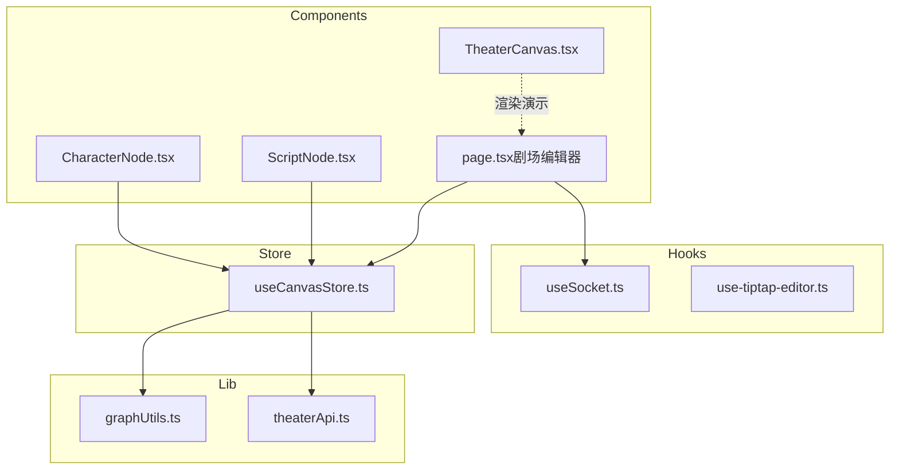
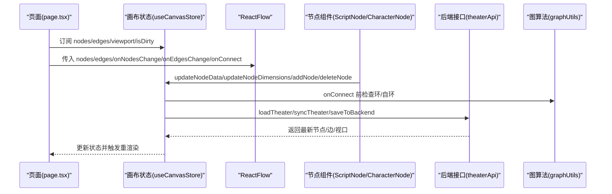
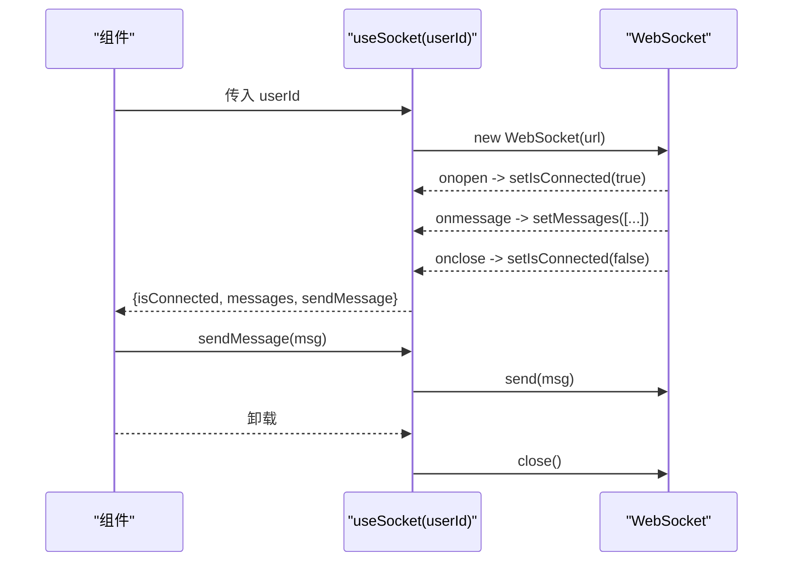
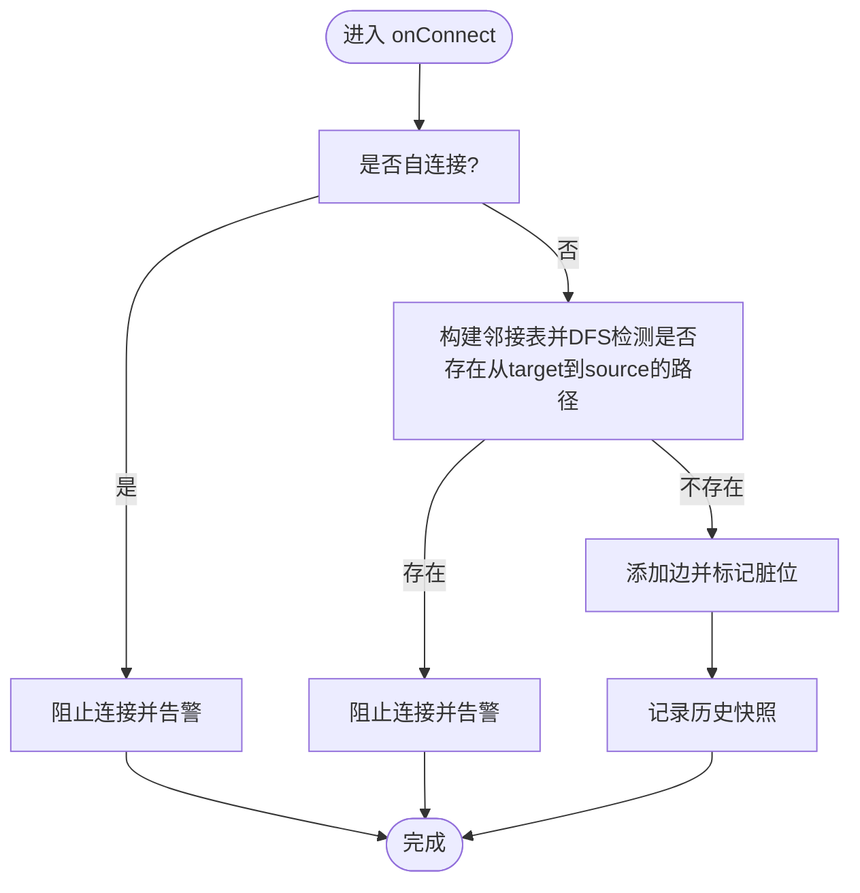
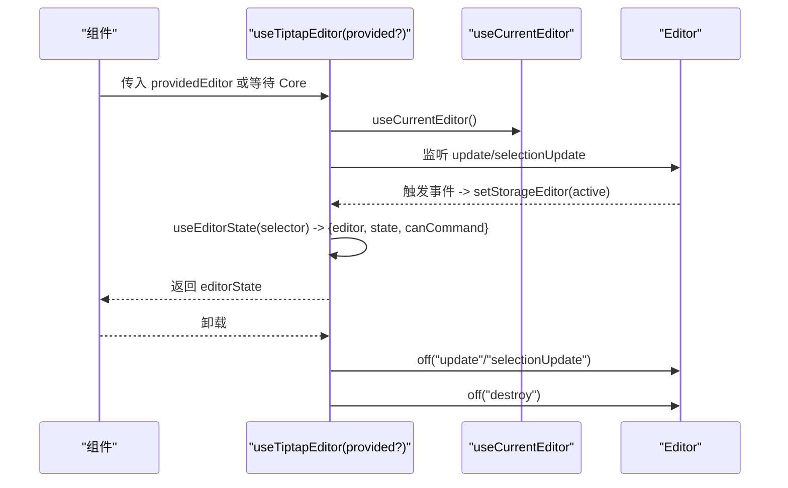
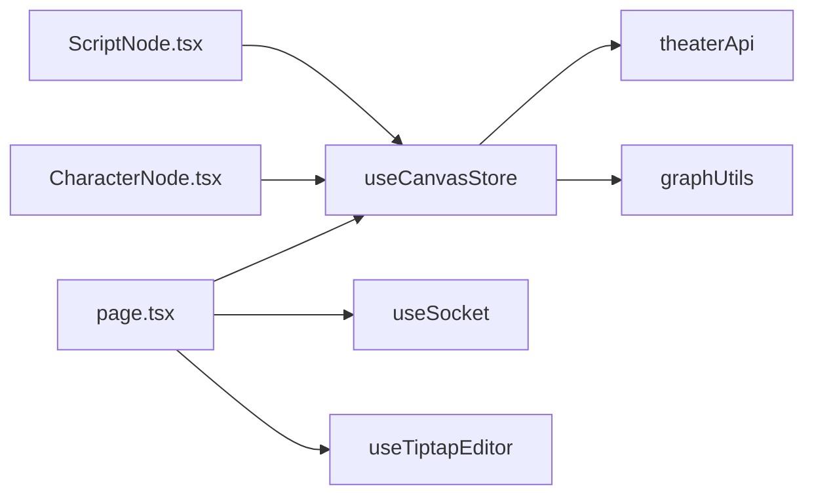

# 自定义 Hooks

<cite>
**本文引用的文件**
- [useSocket.ts](file://frontend/src/hooks/useSocket.ts)
- [useCanvasStore.ts](file://frontend/src/store/useCanvasStore.ts)
- [use-tiptap-editor.ts](file://frontend/src/hooks/use-tiptap-editor.ts)
- [page.tsx（剧场编辑器）](file://frontend/src/app/theater/[id]/page.tsx)
- [ScriptNode.tsx](file://frontend/src/components/canvas/ScriptNode.tsx)
- [CharacterNode.tsx](file://frontend/src/components/canvas/CharacterNode.tsx)
- [graphUtils.ts](file://frontend/src/lib/graphUtils.ts)
- [theaterApi.ts](file://frontend/src/lib/theaterApi.ts)
- [TheaterCanvas.tsx](file://frontend/src/components/TheaterCanvas.tsx)
</cite>

## 目录
1. [简介](#简介)
2. [项目结构](#项目结构)
3. [核心组件](#核心组件)
4. [架构总览](#架构总览)
5. [详细组件分析](#详细组件分析)
6. [依赖关系分析](#依赖关系分析)
7. [性能考量](#性能考量)
8. [故障排查指南](#故障排查指南)
9. [结论](#结论)
10. [附录](#附录)

## 简介
本文件系统性梳理 Infinite Game 前端的自定义 Hooks 体系，重点覆盖以下三类能力：
- useSocket：WebSocket 连接管理与消息收发，含连接建立、消息处理与断线重连策略建议。
- useCanvasStore：画布状态与操作中心，涵盖节点管理、连接约束、历史快照、本地持久化与后端同步。
- useTiptapEditor：富文本编辑器集成 Hook，负责编辑器实例发现、状态同步与事件绑定。

文档同时总结设计模式（依赖注入、状态封装、副作用管理）、最佳实践（性能优化、错误处理、生命周期管理），并提供可直接落地的使用示例与常见问题解决方案。

## 项目结构
前端自定义 Hooks 主要位于以下位置：
- hooks：useSocket、use-tiptap-editor
- store：useCanvasStore（Zustand）
- lib：graphUtils（图算法）、theaterApi（后端接口）
- 组件：ScriptNode、CharacterNode 等节点组件消费 useCanvasStore；页面 TheaterEditor 使用 useCanvasStore 并驱动 ReactFlow。

图表来源
- [useSocket.ts:1-43](file://frontend/src/hooks/useSocket.ts#L1-L43)
- [use-tiptap-editor.ts:1-71](file://frontend/src/hooks/use-tiptap-editor.ts#L1-L71)
- [useCanvasStore.ts:1-540](file://frontend/src/store/useCanvasStore.ts#L1-L540)
- [page.tsx（剧场编辑器）:1-484](file://frontend/src/app/theater/[id]/page.tsx#L1-L484)
- [ScriptNode.tsx:1-351](file://frontend/src/components/canvas/ScriptNode.tsx#L1-L351)
- [CharacterNode.tsx:1-692](file://frontend/src/components/canvas/CharacterNode.tsx#L1-L692)
- [graphUtils.ts:1-39](file://frontend/src/lib/graphUtils.ts#L1-L39)
- [theaterApi.ts:1-159](file://frontend/src/lib/theaterApi.ts#L1-L159)
- [TheaterCanvas.tsx:1-50](file://frontend/src/components/TheaterCanvas.tsx#L1-L50)

章节来源
- [useSocket.ts:1-43](file://frontend/src/hooks/useSocket.ts#L1-L43)
- [useCanvasStore.ts:1-540](file://frontend/src/store/useCanvasStore.ts#L1-L540)
- [use-tiptap-editor.ts:1-71](file://frontend/src/hooks/use-tiptap-editor.ts#L1-L71)
- [page.tsx（剧场编辑器）:1-484](file://frontend/src/app/theater/[id]/page.tsx#L1-L484)
- [ScriptNode.tsx:1-351](file://frontend/src/components/canvas/ScriptNode.tsx#L1-L351)
- [CharacterNode.tsx:1-692](file://frontend/src/components/canvas/CharacterNode.tsx#L1-L692)
- [graphUtils.ts:1-39](file://frontend/src/lib/graphUtils.ts#L1-L39)
- [theaterApi.ts:1-159](file://frontend/src/lib/theaterApi.ts#L1-L159)
- [TheaterCanvas.tsx:1-50](file://frontend/src/components/TheaterCanvas.tsx#L1-L50)

## 核心组件
- useSocket：基于原生 WebSocket 的轻量 Hook，负责连接、消息队列与发送。当前实现未内置自动重连逻辑，建议在业务层结合用户态重连策略使用。
- useCanvasStore：Zustand 状态库，统一管理画布节点、边、视口、脏标记、历史快照、本地持久化与后端同步。提供 onNodesChange/onEdgesChange/onConnect 等回调，以及 load/sync/save 等异步动作。
- useTiptapEditor：对 @tiptap/react 的二次封装，用于在多页面编辑场景下定位“当前激活”的子编辑器，并暴露 editorState/canCommand 等能力。

章节来源
- [useSocket.ts:1-43](file://frontend/src/hooks/useSocket.ts#L1-L43)
- [useCanvasStore.ts:1-540](file://frontend/src/store/useCanvasStore.ts#L1-L540)
- [use-tiptap-editor.ts:1-71](file://frontend/src/hooks/use-tiptap-editor.ts#L1-L71)

## 架构总览
整体数据流与交互如下：
- 页面 TheaterEditor 通过 useCanvasStore 获取节点/边/视口状态与操作方法，并将其传入 ReactFlow。
- 节点组件（如 ScriptNode、CharacterNode）通过 useCanvasStore 更新节点数据、尺寸与删除节点。
- 后端通过 theaterApi 提供加载、保存、更新剧场元信息与画布数据。
- graphUtils 提供环检测等图算法，保障连接合法性。
- useSocket 作为实时通信通道，可在页面层按需启用；useTiptapEditor 用于富文本内容的编辑与状态同步。

图表来源
- [page.tsx（剧场编辑器）:78-87](file://frontend/src/app/theater/[id]/page.tsx#L78-L87)
- [useCanvasStore.ts:209-254](file://frontend/src/store/useCanvasStore.ts#L209-L254)
- [graphUtils.ts:4-38](file://frontend/src/lib/graphUtils.ts#L4-L38)
- [theaterApi.ts:124-150](file://frontend/src/lib/theaterApi.ts#L124-L150)

## 详细组件分析

### useSocket：WebSocket 连接管理 Hook
- 设计要点
  - 依赖注入：通过 userId 参数决定连接目标，避免硬编码。
  - 状态封装：内部维护 messages 列表与 isConnected 标志，对外暴露 sendMessage 方法。
  - 副作用管理：在 effect 中创建 WebSocket，设置 onopen/onmessage/onclose，并在卸载时关闭连接。
- 断线重连机制
  - 当前实现未包含自动重连逻辑。建议在业务层（如页面）监听 isConnected=false，在合适的时机（如用户可见性恢复、定时器）重新调用连接逻辑，或引入指数退避策略。
- 使用建议
  - 在需要实时消息的面板或聊天场景中，结合业务状态进行重连与消息去重。
  - 对于高吞吐消息，建议在 Hook 内部增加节流/批处理队列，避免频繁重渲染。

图表来源
- [useSocket.ts:8-33](file://frontend/src/hooks/useSocket.ts#L8-L33)

章节来源
- [useSocket.ts:1-43](file://frontend/src/hooks/useSocket.ts#L1-L43)

### useCanvasStore：画布操作与状态中心
- 数据模型与类型
  - 节点数据类型：ScriptNodeData、CharacterNodeData、StoryboardNodeData、VideoNodeData。
  - CanvasNode：统一节点类型，包含 id、type、position、width/height、data 等。
  - 边类型 Edge 与连接 Connection。
- 关键能力
  - 节点/边变更：onNodesChange/onEdgesChange/onConnect，内部应用变化并标记 isDirty。
  - 连接约束：禁止自环与环路，使用 graphUtils.hasCycle 检测。
  - 历史快照：takeSnapshot/undo/redo，限制最大历史长度。
  - 本地持久化：使用 persist + localStorage，合并/去重策略保证一致性。
  - 后端同步：loadTheater/syncTheater/saveToBackend，支持标题更新与画布保存。
- 生命周期与副作用
  - 初始化：store 内部通过 persist 管理本地存储。
  - 异步：saveToBackend 带有 isSaving 标记，避免并发写入。
  - 合并与去重：merge/partialize 确保本地与持久化状态一致。

图表来源
- [useCanvasStore.ts:238-254](file://frontend/src/store/useCanvasStore.ts#L238-L254)
- [graphUtils.ts:4-38](file://frontend/src/lib/graphUtils.ts#L4-L38)

章节来源
- [useCanvasStore.ts:1-540](file://frontend/src/store/useCanvasStore.ts#L1-L540)
- [graphUtils.ts:1-39](file://frontend/src/lib/graphUtils.ts#L1-L39)
- [theaterApi.ts:1-159](file://frontend/src/lib/theaterApi.ts#L1-L159)

### useTiptapEditor：富文本编辑器集成 Hook
- 设计要点
  - 依赖注入：支持传入外部 editor 实例，否则回退到 useCurrentEditor。
  - 状态封装：通过 useEditorState 暴露 editor/state/canCommand，便于 UI 控件联动。
  - 副作用管理：监听 update/selectionUpdate 事件，动态定位“当前激活”的子编辑器；监听 destroy 事件清理状态。
- 典型用法
  - 在多页面编辑器中，通过 getActivePageEditor 获取当前页面的编辑器实例。
  - 将 editorState 传递给工具栏按钮，实现“可用/不可用”状态控制。

图表来源
- [use-tiptap-editor.ts:13-70](file://frontend/src/hooks/use-tiptap-editor.ts#L13-L70)

章节来源
- [use-tiptap-editor.ts:1-71](file://frontend/src/hooks/use-tiptap-editor.ts#L1-L71)

## 依赖关系分析
- 组件与 Hook 的耦合
  - 页面 TheaterEditor 通过 useCanvasStore 驱动 ReactFlow，节点组件通过 useCanvasStore 更新数据。
  - ScriptNode/CharacterNode 与 useCanvasStore 强耦合，体现“状态下沉、行为上提”的设计。
- 外部依赖
  - ReactFlow：节点/边渲染与交互。
  - @tiptap/react：富文本编辑器生态。
  - Zustand：状态管理与持久化。
  - graphUtils：图算法辅助。
  - theaterApi：后端接口封装。

图表来源
- [page.tsx（剧场编辑器）:78-87](file://frontend/src/app/theater/[id]/page.tsx#L78-L87)
- [ScriptNode.tsx:11-15](file://frontend/src/components/canvas/ScriptNode.tsx#L11-L15)
- [CharacterNode.tsx:13-18](file://frontend/src/components/canvas/CharacterNode.tsx#L13-L18)
- [useCanvasStore.ts:185-510](file://frontend/src/store/useCanvasStore.ts#L185-L510)
- [theaterApi.ts:107-150](file://frontend/src/lib/theaterApi.ts#L107-L150)
- [graphUtils.ts:1-39](file://frontend/src/lib/graphUtils.ts#L1-L39)
- [useSocket.ts:1-43](file://frontend/src/hooks/useSocket.ts#L1-L43)
- [use-tiptap-editor.ts:1-71](file://frontend/src/hooks/use-tiptap-editor.ts#L1-L71)

章节来源
- [page.tsx（剧场编辑器）:1-484](file://frontend/src/app/theater/[id]/page.tsx#L1-L484)
- [ScriptNode.tsx:1-351](file://frontend/src/components/canvas/ScriptNode.tsx#L1-L351)
- [CharacterNode.tsx:1-692](file://frontend/src/components/canvas/CharacterNode.tsx#L1-L692)
- [useCanvasStore.ts:1-540](file://frontend/src/store/useCanvasStore.ts#L1-L540)
- [theaterApi.ts:1-159](file://frontend/src/lib/theaterApi.ts#L1-L159)
- [graphUtils.ts:1-39](file://frontend/src/lib/graphUtils.ts#L1-L39)
- [useSocket.ts:1-43](file://frontend/src/hooks/useSocket.ts#L1-L43)
- [use-tiptap-editor.ts:1-71](file://frontend/src/hooks/use-tiptap-editor.ts#L1-L71)

## 性能考量
- useCanvasStore
  - 历史快照上限：MAX_HISTORY=50，避免内存膨胀。
  - 变更标记：仅对显著变更（位置、尺寸、删除、新增）标记 isDirty，减少不必要的保存。
  - 本地持久化：partialize 仅持久化必要字段，merge 去重节点，降低冲突概率。
  - 后端保存：防抖与 isSaving 标记，避免频繁写入。
- useSocket
  - 建议在业务层实现重连与退避策略，避免高频重建连接。
  - 对高频消息采用批处理或节流，减少渲染压力。
- useTiptapEditor
  - 仅在需要时订阅 editorState，避免不必要的重渲染。
  - 工具栏按钮通过 canCommand 控制可用性，减少无效点击。

[本节为通用指导，无需特定文件来源]

## 故障排查指南
- WebSocket 无法连接
  - 检查服务端地址与 userId 是否有效；确认浏览器控制台是否有跨域或证书问题。
  - 若出现断线，建议在页面层监听 isConnected=false 并触发重连。
- 画布保存失败
  - 查看 isSaving 标记与错误日志；确认 theaterId 存在且未并发写入。
  - 后端返回异常时，确保调用方捕获并提示用户。
- 连接被阻止
  - onConnect 会阻止自环与环路；检查图结构，必要时调整连接方向或删除冗余边。
- 富文本编辑器状态不同步
  - 确认 useTiptapEditor 正确监听 update/selectionUpdate；若使用多页面编辑器，确保 getActivePageEditor 能正确返回当前页面编辑器。

章节来源
- [useSocket.ts:8-33](file://frontend/src/hooks/useSocket.ts#L8-L33)
- [useCanvasStore.ts:378-505](file://frontend/src/store/useCanvasStore.ts#L378-L505)
- [useCanvasStore.ts:238-254](file://frontend/src/store/useCanvasStore.ts#L238-L254)
- [use-tiptap-editor.ts:23-52](file://frontend/src/hooks/use-tiptap-editor.ts#L23-L52)

## 结论
本 Hooks 体系以“状态下沉、行为上提”为核心思想，通过 useCanvasStore 统一画布状态与后端同步，借助 useSocket 提供实时通信能力，配合 useTiptapEditor 实现富文本编辑的灵活集成。建议在业务层补充断线重连、防抖与去重策略，持续优化性能与稳定性。

[本节为总结性内容，无需特定文件来源]

## 附录

### 最佳实践清单
- 状态封装
  - 将副作用收敛在 Hook 内部，向组件暴露稳定的数据与方法。
- 依赖注入
  - 通过参数或上下文注入外部依赖（如 editor、userId），提升可测试性与复用性。
- 副作用管理
  - 在 useEffect 中注册事件，在卸载时清理；避免内存泄漏。
- 性能优化
  - 对高频事件（如滚动、缩放、输入）进行节流/防抖；合理拆分状态，避免大对象深拷贝。
- 错误处理
  - 明确错误边界与降级策略；对异步操作提供 loading/done/error 三态。
- 生命周期管理
  - 在组件卸载时主动释放资源（如关闭 WebSocket、移除事件监听）。

[本节为通用指导，无需特定文件来源]

### 实际使用示例（步骤说明）
- 使用 useSocket
  - 在页面组件中传入 userId，读取 isConnected/messages，调用 sendMessage 发送消息；在组件卸载时自动关闭连接。
- 使用 useCanvasStore
  - 在页面中订阅 nodes/edges/viewport/isDirty，将 onNodesChange/onEdgesChange/onConnect 传给 ReactFlow；通过 addNode/deleteNode/updateNodeData 等方法操作画布；在合适时机调用 saveToBackend。
- 使用 useTiptapEditor
  - 在富文本容器中调用 useTiptapEditor，将 editorState 传递给工具栏按钮；根据 canCommand 控制按钮可用性。

章节来源
- [useSocket.ts:3-41](file://frontend/src/hooks/useSocket.ts#L3-L41)
- [page.tsx（剧场编辑器）:78-87](file://frontend/src/app/theater/[id]/page.tsx#L78-L87)
- [use-tiptap-editor.ts:13-69](file://frontend/src/hooks/use-tiptap-editor.ts#L13-L69)