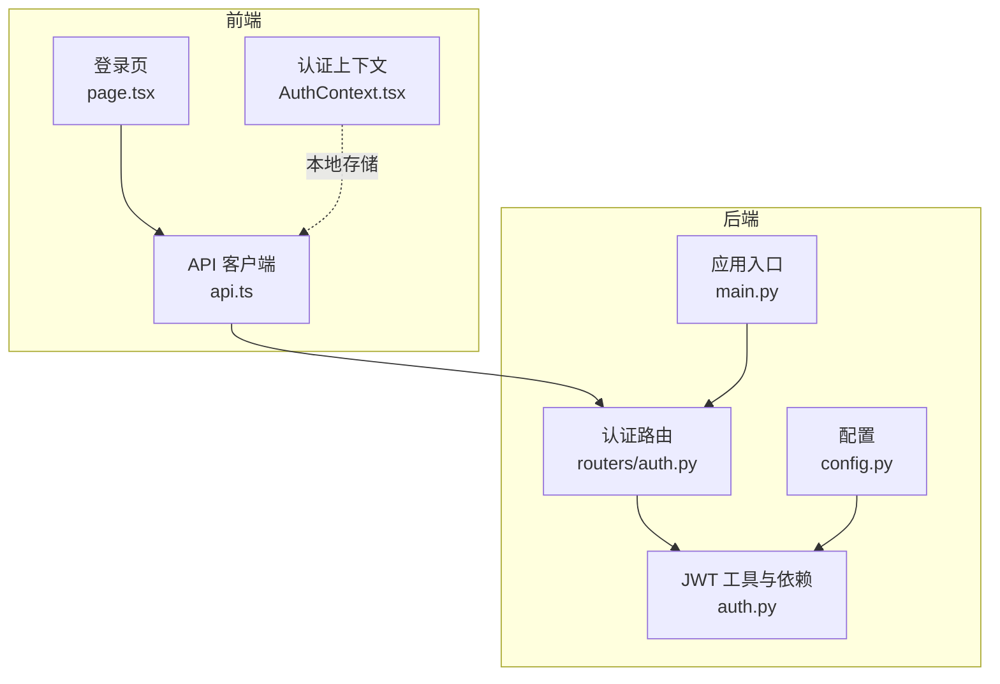
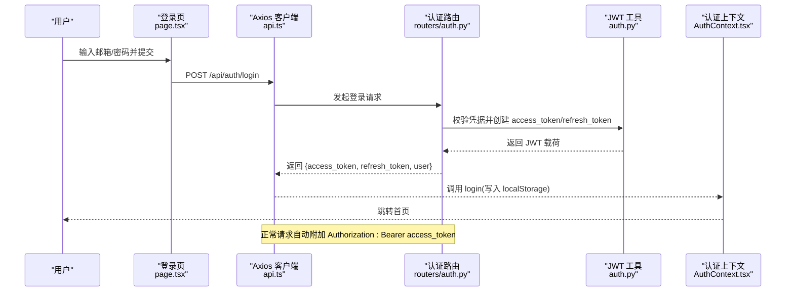
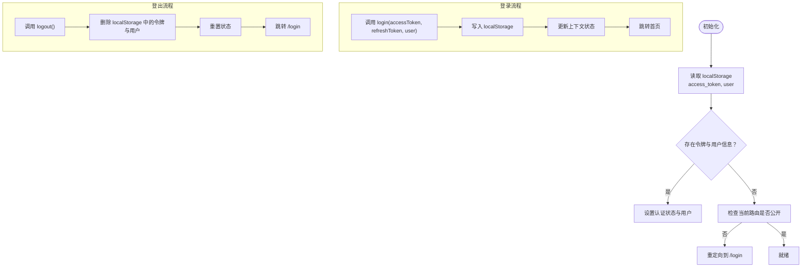
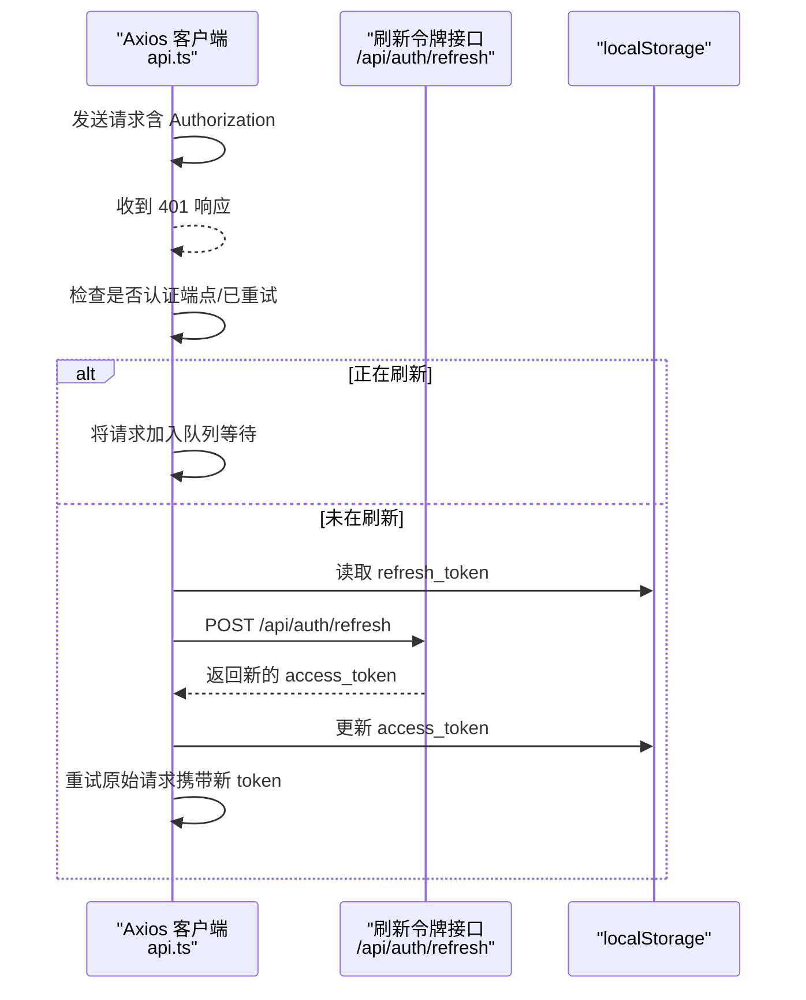
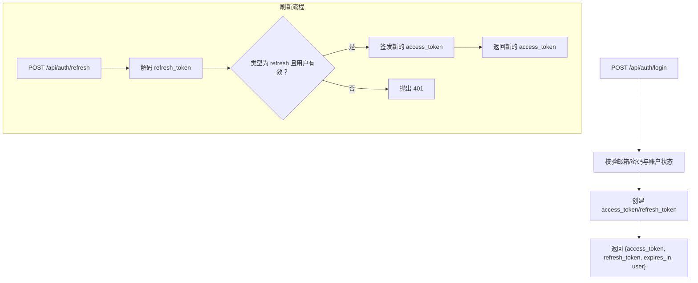
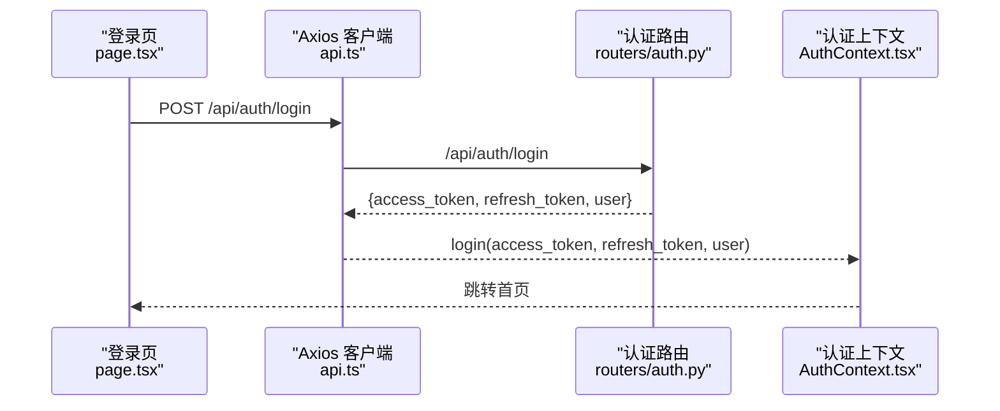
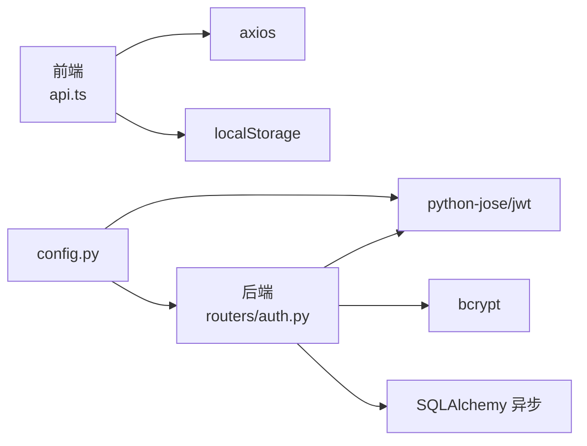
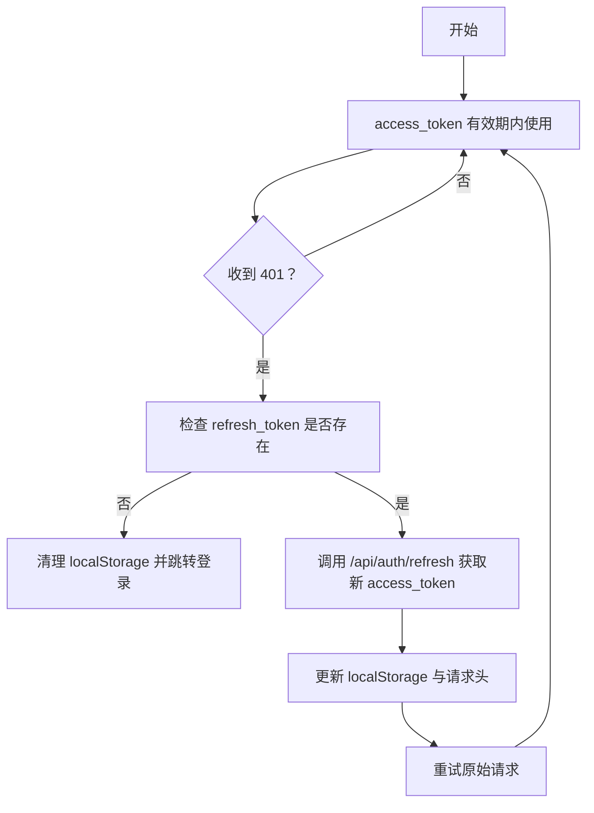

# 令牌管理

<cite>
**本文引用的文件**
- [AuthContext.tsx](file://frontend/src/context/AuthContext.tsx)
- [api.ts](file://frontend/src/lib/api.ts)
- [page.tsx](file://frontend/src/app/login/page.tsx)
- [auth.py](file://backend/routers/auth.py)
- [auth_core.py](file://backend/auth.py)
- [main.py](file://backend/main.py)
- [config.py](file://backend/config.py)
- [axios_admin.ts](file://backend/admin/src/lib/axios.ts)
</cite>

## 目录
1. [简介](#简介)
2. [项目结构](#项目结构)
3. [核心组件](#核心组件)
4. [架构总览](#架构总览)
5. [详细组件分析](#详细组件分析)
6. [依赖分析](#依赖分析)
7. [性能考量](#性能考量)
8. [故障排查指南](#故障排查指南)
9. [结论](#结论)
10. [附录](#附录)

## 简介
本文件系统性梳理 Infinite Game 的令牌管理系统，覆盖以下关键主题：
- 前端 JWT 令牌的存储策略与安全性
- 令牌生命周期管理：自动刷新、过期检测、重新登录
- refresh_token 的作用机制与安全存储建议
- API 请求中令牌的自动附加与请求拦截器实现
- 令牌失效处理策略：401 错误响应与会话清理
- 最佳实践与安全建议

## 项目结构
前端采用 Next.js 应用，后端采用 FastAPI。令牌管理涉及：
- 前端：登录页发起认证，Axios 拦截器自动附加 Authorization 头；401 时尝试刷新令牌并重试原请求；本地持久化 access_token、refresh_token、用户信息。
- 后端：提供 /api/auth/login、/api/auth/refresh 等端点；使用 HS256 签发 JWT；通过 FastAPI 依赖注入校验访问令牌。

图表来源
- [page.tsx:18-29](file://frontend/src/app/login/page.tsx#L18-L29)
- [api.ts:3-17](file://frontend/src/lib/api.ts#L3-L17)
- [AuthContext.tsx:75-94](file://frontend/src/context/AuthContext.tsx#L75-L94)
- [auth.py:63-99](file://backend/routers/auth.py#L63-L99)
- [auth_core.py:30-75](file://backend/auth.py#L30-L75)
- [main.py:139-152](file://backend/main.py#L139-L152)
- [config.py:26-30](file://backend/config.py#L26-L30)

章节来源
- [page.tsx:18-29](file://frontend/src/app/login/page.tsx#L18-L29)
- [api.ts:3-17](file://frontend/src/lib/api.ts#L3-L17)
- [AuthContext.tsx:75-94](file://frontend/src/context/AuthContext.tsx#L75-L94)
- [auth.py:63-99](file://backend/routers/auth.py#L63-L99)
- [auth_core.py:30-75](file://backend/auth.py#L30-L75)
- [main.py:139-152](file://backend/main.py#L139-L152)
- [config.py:26-30](file://backend/config.py#L26-L30)

## 核心组件
- 前端认证上下文：负责初始化、登录、登出、更新余额等，并持久化令牌与用户信息至 localStorage。
- Axios 请求/响应拦截器：统一附加 Authorization 头；处理 401 并进行令牌刷新与队列重试。
- 后端认证路由：提供登录、刷新、个人信息查询；签发 access_token 与 refresh_token。
- JWT 工具与依赖：创建/解码 JWT；FastAPI 依赖注入校验访问令牌。
- 应用入口与中间件：注册路由、CORS、调试中间件。

章节来源
- [AuthContext.tsx:52-109](file://frontend/src/context/AuthContext.tsx#L52-L109)
- [api.ts:8-81](file://frontend/src/lib/api.ts#L8-L81)
- [auth.py:63-136](file://backend/routers/auth.py#L63-L136)
- [auth_core.py:30-114](file://backend/auth.py#L30-L114)
- [main.py:119-136](file://backend/main.py#L119-L136)

## 架构总览
下图展示从前端登录到后端签发令牌，再到请求拦截器自动附加与刷新的整体流程。

图表来源
- [page.tsx:18-29](file://frontend/src/app/login/page.tsx#L18-L29)
- [api.ts:3-17](file://frontend/src/lib/api.ts#L3-L17)
- [auth.py:63-99](file://backend/routers/auth.py#L63-L99)
- [auth_core.py:30-75](file://backend/auth.py#L30-L75)
- [AuthContext.tsx:75-84](file://frontend/src/context/AuthContext.tsx#L75-L84)

## 详细组件分析

### 前端：认证上下文与本地存储
- 初始化：启动时从 localStorage 读取 access_token、user，设置认证状态与用户信息；若处于受保护路由且未认证则跳转登录。
- 登录：保存 access_token、refresh_token、user 至 localStorage，设置认证状态并跳转首页。
- 登出：移除 localStorage 中的令牌与用户信息，重置状态并跳转登录。
- 余额更新：更新用户余额并同步写回 localStorage。

图表来源
- [AuthContext.tsx:60-73](file://frontend/src/context/AuthContext.tsx#L60-L73)
- [AuthContext.tsx:75-94](file://frontend/src/context/AuthContext.tsx#L75-L94)

章节来源
- [AuthContext.tsx:52-109](file://frontend/src/context/AuthContext.tsx#L52-L109)

### 前端：Axios 请求/响应拦截器与自动刷新
- 请求拦截：向每个请求自动附加 Authorization: Bearer access_token。
- 响应拦截：
  - 若响应为 401 且非认证端点且未重试过，则进入刷新流程；
  - 若正在刷新中，将并发请求加入队列等待；
  - 读取 refresh_token 并调用 /api/auth/refresh 获取新 access_token；
  - 成功后更新 localStorage 与请求头，重试原始请求；
  - 刷新失败或无 refresh_token 时，清理 localStorage 并跳转登录。

图表来源
- [api.ts:19-81](file://frontend/src/lib/api.ts#L19-L81)

章节来源
- [api.ts:8-81](file://frontend/src/lib/api.ts#L8-L81)

### 后端：认证路由与 JWT 工具
- 登录：校验邮箱/密码与账户状态，签发 access_token 与 refresh_token，并返回用户信息。
- 刷新：校验 refresh_token 类型与用户有效性，签发新的 access_token。
- JWT 工具：创建 access_token（含 exp）、创建 refresh_token（含 exp）、解码 token 并抛出 401。
- FastAPI 依赖：OAuth2PasswordBearer 提供 tokenUrl，get_current_active_user 校验访问令牌并确保账户有效。

图表来源
- [auth.py:63-99](file://backend/routers/auth.py#L63-L99)
- [auth.py:102-129](file://backend/routers/auth.py#L102-L129)
- [auth_core.py:30-75](file://backend/auth.py#L30-L75)
- [auth_core.py:83-113](file://backend/auth.py#L83-L113)

章节来源
- [auth.py:63-136](file://backend/routers/auth.py#L63-L136)
- [auth_core.py:30-114](file://backend/auth.py#L30-L114)

### 登录页与认证上下文联动
- 登录页提交邮箱/密码到 /api/auth/login，成功后调用认证上下文的 login 方法，写入 localStorage 并跳转首页。
- 注册后自动触发登录并走相同流程。

图表来源
- [page.tsx:18-29](file://frontend/src/app/login/page.tsx#L18-L29)
- [AuthContext.tsx:75-84](file://frontend/src/context/AuthContext.tsx#L75-L84)
- [auth.py:63-99](file://backend/routers/auth.py#L63-L99)

章节来源
- [page.tsx:18-29](file://frontend/src/app/login/page.tsx#L18-L29)
- [AuthContext.tsx:75-84](file://frontend/src/context/AuthContext.tsx#L75-L84)

### 管理后台 Axios 配置（对比参考）
- 管理后台同样使用 Axios 拦截器附加 Authorization 头；
- 401 时尝试刷新，但使用 /admin/auth/refresh 端点；
- 刷新失败或无 refresh_token 时清理 localStorage 并跳转 /admin/login。

章节来源
- [axios_admin.ts:12-102](file://backend/admin/src/lib/axios.ts#L12-L102)

## 依赖分析
- 前端依赖 axios 进行网络请求，使用 localStorage 进行令牌持久化。
- 后端依赖 FastAPI、SQLAlchemy 异步、bcrypt、python-jose/jwt 实现认证与令牌签发。
- 配置集中于 config.py，包含 JWT 密钥、算法、过期间隔等。

图表来源
- [api.ts](file://frontend/src/lib/api.ts#L1)
- [axios_admin.ts](file://backend/admin/src/lib/axios.ts#L1)
- [auth.py:1-26](file://backend/routers/auth.py#L1-L26)
- [auth_core.py:1-13](file://backend/auth.py#L1-L13)
- [config.py:26-30](file://backend/config.py#L26-L30)

章节来源
- [api.ts](file://frontend/src/lib/api.ts#L1)
- [axios_admin.ts](file://backend/admin/src/lib/axios.ts#L1)
- [auth.py:1-26](file://backend/routers/auth.py#L1-L26)
- [auth_core.py:1-13](file://backend/auth.py#L1-L13)
- [config.py:26-30](file://backend/config.py#L26-L30)

## 性能考量
- 访问令牌短期有效（默认 30 分钟），减少长期暴露风险。
- 刷新令牌短期有效（默认 7 天），降低泄露影响面。
- Axios 拦截器对并发请求进行队列化刷新，避免重复刷新与请求风暴。
- 本地存储读写开销低，但需注意跨标签页同步与安全边界。

## 故障排查指南
- 401 未自动刷新
  - 检查是否命中认证端点（/auth/）或已标记重试；
  - 确认 localStorage 中 refresh_token 是否存在；
  - 查看刷新接口返回与网络状态。
- 刷新失败或循环 401
  - 可能 refresh_token 已失效或用户被禁用；
  - 清理 localStorage 并强制跳转登录。
- 登录后仍提示未认证
  - 检查初始化时是否正确读取 localStorage；
  - 确认受保护路由跳转逻辑。
- 管理后台登录异常
  - 管理后台使用独立刷新端点与登录路径，需确保对应拦截器配置正确。

章节来源
- [api.ts:31-81](file://frontend/src/lib/api.ts#L31-L81)
- [AuthContext.tsx:60-73](file://frontend/src/context/AuthContext.tsx#L60-L73)
- [axios_admin.ts:44-102](file://backend/admin/src/lib/axios.ts#L44-L102)

## 结论
本系统采用标准 JWT 流程：短效 access_token 与中效 refresh_token 组合，前端通过 Axios 拦截器实现透明鉴权与自动刷新，后端以 FastAPI 依赖注入保障访问令牌有效性。整体设计简洁、可维护性强，建议结合安全最佳实践进一步加固。

## 附录

### 令牌生命周期与刷新流程（概念图）

### 安全建议与最佳实践
- 令牌存储
  - 优先使用 HttpOnly Cookie 存储 refresh_token，避免 XSS 泄露；access_token 可考虑内存存储或短期 localStorage。
  - 对敏感操作启用 SameSite=Strict/Lax，限制跨站携带。
- 传输安全
  - 强制 HTTPS，防止中间人攻击与令牌窃听。
- 令牌策略
  - 缩短 access_token 过期时间，提高刷新频率；
  - 严格管理 refresh_token 生命周期，支持服务端撤销与黑名单。
- 前端防护
  - 对关键请求增加二次确认与最小权限原则；
  - 在多标签页场景监听 storage 事件，保持令牌状态一致。
- 后端强化
  - 引入设备指纹与 IP 白名单；
  - 对异常登录行为进行审计与阻断。