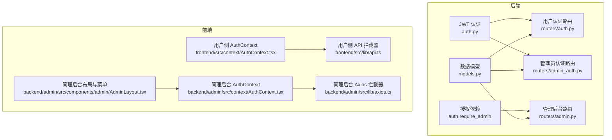
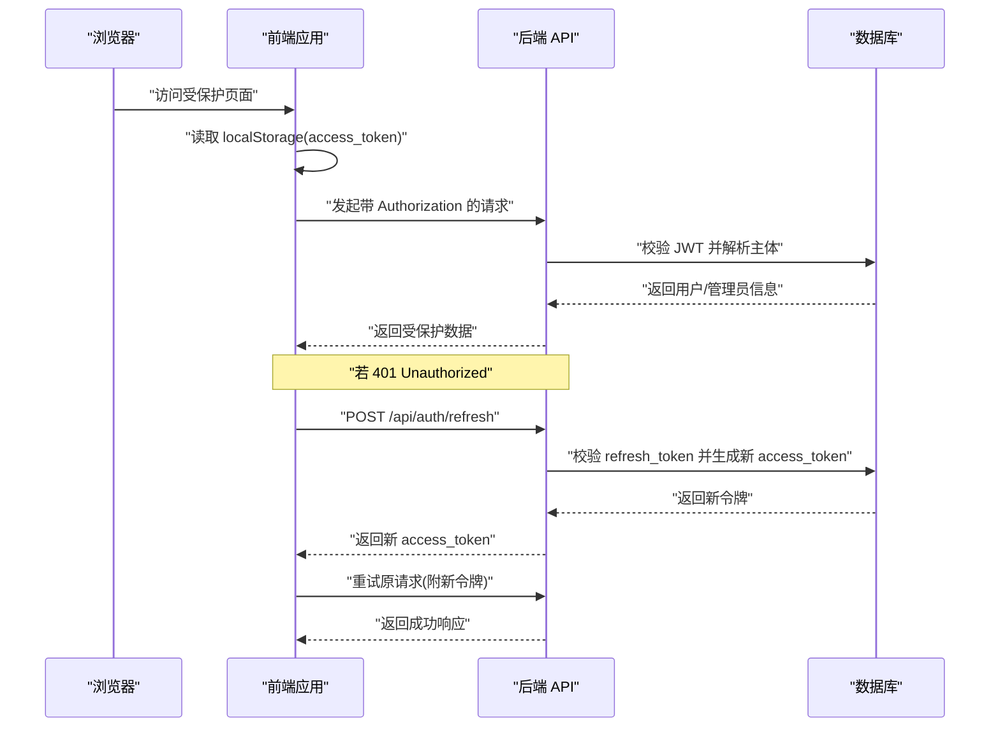
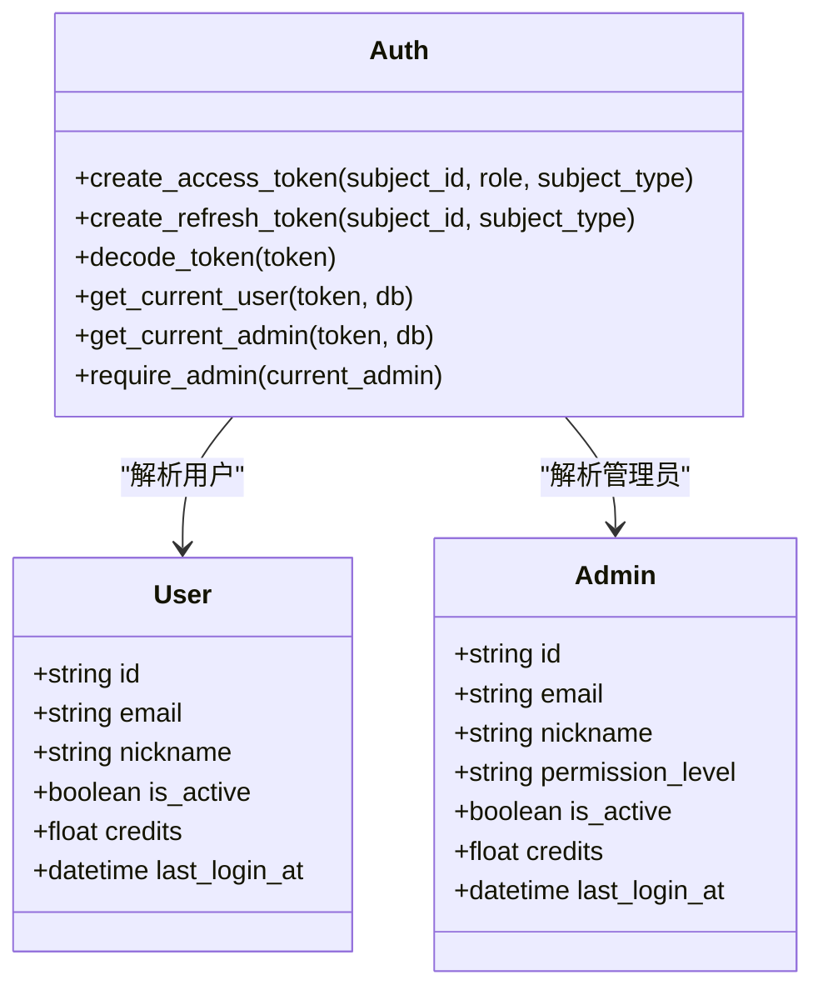
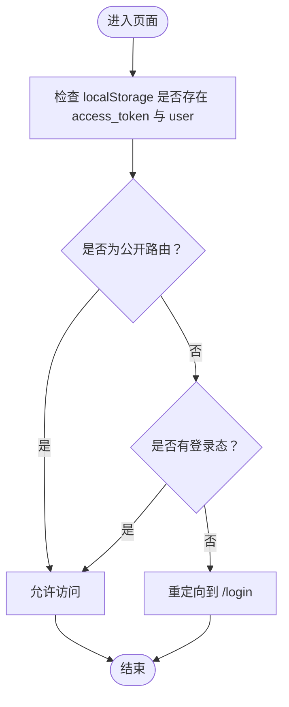
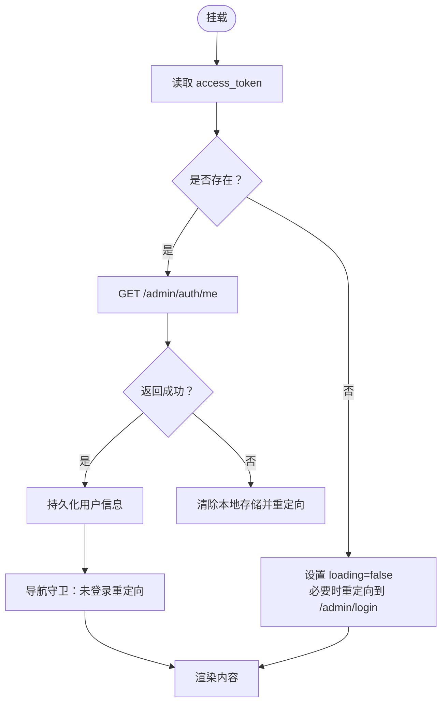
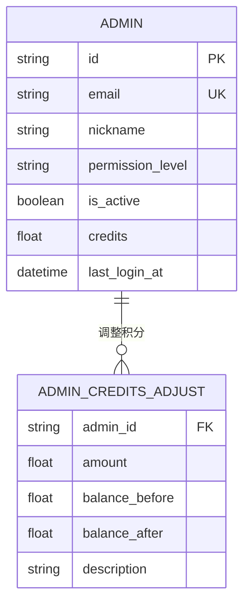
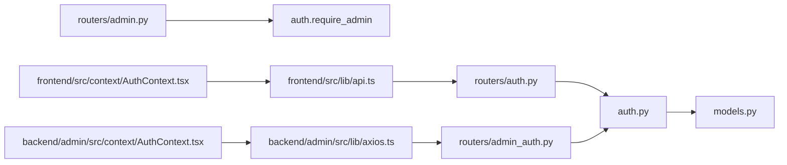

# 权限控制

<cite>
**本文引用的文件**
- [auth.py](file://backend/auth.py)
- [routers/auth.py](file://backend/routers/auth.py)
- [routers/admin_auth.py](file://backend/routers/admin_auth.py)
- [models.py](file://backend/models.py)
- [schemas.py](file://backend/schemas.py)
- [routers/admin.py](file://backend/routers/admin.py)
- [frontend/src/context/AuthContext.tsx](file://frontend/src/context/AuthContext.tsx)
- [frontend/src/lib/api.ts](file://frontend/src/lib/api.ts)
- [backend/admin/src/context/AuthContext.tsx](file://backend/admin/src/context/AuthContext.tsx)
- [backend/admin/src/lib/axios.ts](file://backend/admin/src/lib/axios.ts)
- [backend/admin/src/components/admin/AdminLayout.tsx](file://backend/admin/src/components/admin/AdminLayout.tsx)
- [frontend/src/components/home/TopBar.tsx](file://frontend/src/components/home/TopBar.tsx)
</cite>

## 目录
1. [简介](#简介)
2. [项目结构](#项目结构)
3. [核心组件](#核心组件)
4. [架构总览](#架构总览)
5. [详细组件分析](#详细组件分析)
6. [依赖分析](#依赖分析)
7. [性能考虑](#性能考虑)
8. [故障排查指南](#故障排查指南)
9. [结论](#结论)
10. [附录](#附录)

## 简介
本文件系统性梳理 Infinite Game 的权限控制体系，涵盖后端基于 JWT 的认证与授权、前端路由与组件级权限保护、动态菜单与导航权限控制，以及扩展与调试指南。文档面向不同技术背景读者，既提供高层概览也给出代码级定位与图示。

## 项目结构
权限控制涉及前后端协同：
- 后端
  - 认证与令牌：JWT 生成、校验、刷新；用户与管理员双通道
  - 授权：FastAPI 依赖注入与端点保护
  - 数据模型：用户、管理员、订阅、积分等
  - 管理后台路由：管理员 CRUD、用户管理、订阅与积分管理
- 前端
  - 用户侧：Next.js App Router + 自定义 AuthContext 实现登录态与路由保护
  - 管理后台：独立 Next.js 应用，独立 AuthContext 与拦截器，动态菜单与导航

图表来源
- [auth.py:1-173](file://backend/auth.py#L1-L173)
- [routers/auth.py:1-136](file://backend/routers/auth.py#L1-L136)
- [routers/admin_auth.py:1-118](file://backend/routers/admin_auth.py#L1-L118)
- [models.py:1-447](file://backend/models.py#L1-L447)
- [routers/admin.py:1-501](file://backend/routers/admin.py#L1-L501)
- [frontend/src/context/AuthContext.tsx:1-110](file://frontend/src/context/AuthContext.tsx#L1-L110)
- [frontend/src/lib/api.ts:1-84](file://frontend/src/lib/api.ts#L1-L84)
- [backend/admin/src/context/AuthContext.tsx:1-117](file://backend/admin/src/context/AuthContext.tsx#L1-L117)
- [backend/admin/src/lib/axios.ts:1-105](file://backend/admin/src/lib/axios.ts#L1-L105)
- [backend/admin/src/components/admin/AdminLayout.tsx:1-198](file://backend/admin/src/components/admin/AdminLayout.tsx#L1-L198)

章节来源
- [auth.py:1-173](file://backend/auth.py#L1-L173)
- [routers/auth.py:1-136](file://backend/routers/auth.py#L1-L136)
- [routers/admin_auth.py:1-118](file://backend/routers/admin_auth.py#L1-L118)
- [models.py:1-447](file://backend/models.py#L1-L447)
- [routers/admin.py:1-501](file://backend/routers/admin.py#L1-L501)
- [frontend/src/context/AuthContext.tsx:1-110](file://frontend/src/context/AuthContext.tsx#L1-L110)
- [frontend/src/lib/api.ts:1-84](file://frontend/src/lib/api.ts#L1-L84)
- [backend/admin/src/context/AuthContext.tsx:1-117](file://backend/admin/src/context/AuthContext.tsx#L1-L117)
- [backend/admin/src/lib/axios.ts:1-105](file://backend/admin/src/lib/axios.ts#L1-L105)
- [backend/admin/src/components/admin/AdminLayout.tsx:1-198](file://backend/admin/src/components/admin/AdminLayout.tsx#L1-L198)

## 核心组件
- 后端认证与授权
  - JWT 生成与解码：access/refresh 令牌，携带 sub、role/subject_type、type 等声明
  - 当前用户/管理员依赖：校验令牌并解析主体，支持活跃状态检查
  - 管理员强制依赖：require_admin，仅管理员可访问
- 前端路由与组件级权限
  - 用户侧 AuthContext：登录态持久化、受保护路由重定向、积分更新
  - 管理后台 AuthContext：独立登录态、挂载时校验、导航守卫
  - Axios 拦截器：自动附加 Authorization 头，401 自动刷新令牌并重试
- 动态菜单与导航
  - 管理后台布局：基于路径高亮当前菜单项，支持折叠与登出
  - 菜单项：按模块组织，支持仪表盘、智能体、视频、模板、用户、订阅、管理员等

章节来源
- [auth.py:39-173](file://backend/auth.py#L39-L173)
- [routers/auth.py:63-136](file://backend/routers/auth.py#L63-L136)
- [routers/admin_auth.py:80-118](file://backend/routers/admin_auth.py#L80-L118)
- [frontend/src/context/AuthContext.tsx:1-110](file://frontend/src/context/AuthContext.tsx#L1-L110)
- [frontend/src/lib/api.ts:1-84](file://frontend/src/lib/api.ts#L1-L84)
- [backend/admin/src/context/AuthContext.tsx:1-117](file://backend/admin/src/context/AuthContext.tsx#L1-L117)
- [backend/admin/src/lib/axios.ts:1-105](file://backend/admin/src/lib/axios.ts#L1-L105)
- [backend/admin/src/components/admin/AdminLayout.tsx:48-198](file://backend/admin/src/components/admin/AdminLayout.tsx#L48-L198)

## 架构总览
下图展示用户登录到受保护资源的完整流程，包括令牌签发、存储、请求头附加、401 刷新与重试。

图表来源
- [frontend/src/lib/api.ts:1-84](file://frontend/src/lib/api.ts#L1-L84)
- [routers/auth.py:102-136](file://backend/routers/auth.py#L102-L136)
- [auth.py:65-113](file://backend/auth.py#L65-L113)

章节来源
- [frontend/src/lib/api.ts:1-84](file://frontend/src/lib/api.ts#L1-L84)
- [routers/auth.py:102-136](file://backend/routers/auth.py#L102-L136)
- [auth.py:65-113](file://backend/auth.py#L65-L113)

## 详细组件分析

### RBAC 与权限模型
- 角色与主体
  - 用户：users 表，字段包含积分、订阅、活跃状态等
  - 管理员：admins 表，新增 permission_level 字段（admin/super_admin），与用户表分离
- 令牌与声明
  - access_token：包含 sub、role/subject_type、type=access、过期时间
  - refresh_token：包含 sub、type=refresh、过期时间
- 授权依赖
  - get_current_user/get_current_active_user：校验 access_token，解析用户并确认活跃
  - get_current_admin/get_current_active_admin：校验 access_token，解析管理员并确认活跃
  - require_admin：强制管理员访问
- 端点保护
  - 管理后台路由通过 require_admin 保护，仅管理员可访问

图表来源
- [models.py:35-72](file://backend/models.py#L35-L72)
- [models.py:10-33](file://backend/models.py#L10-L33)
- [auth.py:39-173](file://backend/auth.py#L39-L173)

章节来源
- [models.py:35-72](file://backend/models.py#L35-L72)
- [models.py:10-33](file://backend/models.py#L10-L33)
- [auth.py:39-173](file://backend/auth.py#L39-L173)

### 路由级权限保护（用户侧）
- 登录态检测
  - 挂载时读取 localStorage 中的 access_token 与 user
  - 若非公开路由且未登录，重定向至 /login
- 登出与重定向
  - 清空本地存储并重定向至 /login
- 令牌刷新
  - 401 时尝试刷新 access_token，并重试原请求

图表来源
- [frontend/src/context/AuthContext.tsx:60-73](file://frontend/src/context/AuthContext.tsx#L60-L73)

章节来源
- [frontend/src/context/AuthContext.tsx:1-110](file://frontend/src/context/AuthContext.tsx#L1-L110)
- [frontend/src/lib/api.ts:1-84](file://frontend/src/lib/api.ts#L1-L84)

### 路由级权限保护（管理后台）
- 保护范围
  - 以 /admin 开头且非 /admin/login 的路由为受保护
- 首次加载校验
  - 存在 access_token 时调用 /admin/auth/me 校验并持久化用户信息
  - 校验失败则清空本地存储并重定向
- 导航守卫
  - 在路由变化时再次校验，未登录则重定向
- 登录与登出
  - 登录成功写入令牌与用户信息并跳转 /admin
  - 登出清理并跳转 /admin/login

图表来源
- [backend/admin/src/context/AuthContext.tsx:47-83](file://backend/admin/src/context/AuthContext.tsx#L47-L83)

章节来源
- [backend/admin/src/context/AuthContext.tsx:1-117](file://backend/admin/src/context/AuthContext.tsx#L1-L117)
- [backend/admin/src/lib/axios.ts:1-105](file://backend/admin/src/lib/axios.ts#L1-L105)

### 组件级权限检查与动态菜单
- 管理后台布局
  - 基于当前路径高亮菜单项
  - 提供折叠与展开，支持登出
- 动态菜单项
  - 仪表盘、AI 供应商、智能体管理、技能管理、MCP 客户端、视频生成、提示词模板、用户管理、订阅套餐、管理员
- 顶部栏（用户侧）
  - 主题切换、用户下拉菜单（个人资料、设置、退出登录）

章节来源
- [backend/admin/src/components/admin/AdminLayout.tsx:48-198](file://backend/admin/src/components/admin/AdminLayout.tsx#L48-L198)
- [frontend/src/components/home/TopBar.tsx:1-118](file://frontend/src/components/home/TopBar.tsx#L1-L118)

### 管理员权限扩展与角色管理
- 管理员权限级别
  - permission_level：admin、super_admin
- 管理端点
  - 列表、创建、详情、更新、删除管理员
  - 管理员积分调整
- 数据模型与校验
  - Admin 模型包含 permission_level、credits 等
  - Pydantic 模型用于请求与响应校验

图表来源
- [models.py:10-33](file://backend/models.py#L10-L33)
- [routers/admin.py:322-440](file://backend/routers/admin.py#L322-L440)
- [schemas.py:68-111](file://backend/schemas.py#L68-L111)

章节来源
- [models.py:10-33](file://backend/models.py#L10-L33)
- [routers/admin.py:307-440](file://backend/routers/admin.py#L307-L440)
- [schemas.py:68-111](file://backend/schemas.py#L68-L111)

## 依赖分析
- 后端
  - routers/auth.py 依赖 auth.py 的令牌生成与用户解析
  - routers/admin_auth.py 依赖 auth.py 的令牌生成与管理员解析
  - routers/admin.py 依赖 require_admin 进行管理员端点保护
  - models.py 定义用户与管理员数据结构
- 前端
  - 用户侧 api.ts 依赖 localStorage 与 /api/auth/refresh
  - 管理后台 axios.ts 依赖 /api/admin/auth/refresh
  - AuthContext.tsx 依赖路由守卫与本地存储

图表来源
- [routers/auth.py:1-136](file://backend/routers/auth.py#L1-L136)
- [routers/admin_auth.py:1-118](file://backend/routers/admin_auth.py#L1-L118)
- [auth.py:1-173](file://backend/auth.py#L1-L173)
- [routers/admin.py:1-501](file://backend/routers/admin.py#L1-L501)
- [models.py:1-447](file://backend/models.py#L1-L447)
- [frontend/src/lib/api.ts:1-84](file://frontend/src/lib/api.ts#L1-L84)
- [backend/admin/src/lib/axios.ts:1-105](file://backend/admin/src/lib/axios.ts#L1-L105)
- [frontend/src/context/AuthContext.tsx:1-110](file://frontend/src/context/AuthContext.tsx#L1-L110)
- [backend/admin/src/context/AuthContext.tsx:1-117](file://backend/admin/src/context/AuthContext.tsx#L1-L117)

章节来源
- [routers/auth.py:1-136](file://backend/routers/auth.py#L1-L136)
- [routers/admin_auth.py:1-118](file://backend/routers/admin_auth.py#L1-L118)
- [auth.py:1-173](file://backend/auth.py#L1-L173)
- [routers/admin.py:1-501](file://backend/routers/admin.py#L1-L501)
- [models.py:1-447](file://backend/models.py#L1-L447)
- [frontend/src/lib/api.ts:1-84](file://frontend/src/lib/api.ts#L1-L84)
- [backend/admin/src/lib/axios.ts:1-105](file://backend/admin/src/lib/axios.ts#L1-L105)
- [frontend/src/context/AuthContext.tsx:1-110](file://frontend/src/context/AuthContext.tsx#L1-L110)
- [backend/admin/src/context/AuthContext.tsx:1-117](file://backend/admin/src/context/AuthContext.tsx#L1-L117)

## 性能考虑
- 令牌缓存与复用：前端在内存中持有用户信息，避免重复请求 /me
- 请求队列：401 刷新期间排队并发请求，减少重复刷新与抖动
- 路由守卫：仅在挂载与路由变化时执行，避免频繁 IO
- 数据模型：管理员与用户分离，降低鉴权判断复杂度

## 故障排查指南
- 401 未授权
  - 检查 access_token 是否过期或被篡改
  - 确认 refresh_token 是否存在且有效
  - 查看前端拦截器是否正确附加 Authorization 头
- 登录后仍被重定向
  - 用户侧：确认 localStorage 中 access_token 与 user 是否同时存在
  - 管理后台：确认 /admin/auth/me 是否返回 200
- 令牌刷新失败
  - 检查 /api/auth/refresh 或 /api/admin/auth/refresh 的响应
  - 确认服务器时间与客户端时间同步
- 菜单不显示或高亮异常
  - 确认路径匹配规则与当前路由一致
  - 检查 AdminLayout 的菜单项定义与链接

章节来源
- [frontend/src/lib/api.ts:31-81](file://frontend/src/lib/api.ts#L31-L81)
- [backend/admin/src/lib/axios.ts:44-102](file://backend/admin/src/lib/axios.ts#L44-L102)
- [frontend/src/context/AuthContext.tsx:60-73](file://frontend/src/context/AuthContext.tsx#L60-L73)
- [backend/admin/src/context/AuthContext.tsx:47-83](file://backend/admin/src/context/AuthContext.tsx#L47-L83)
- [backend/admin/src/components/admin/AdminLayout.tsx:132-149](file://backend/admin/src/components/admin/AdminLayout.tsx#L132-L149)

## 结论
Infinite Game 的权限控制采用“JWT + RBAC”的清晰分层：后端通过依赖注入实现端点级保护，前端通过上下文与拦截器实现路由与请求级保护。管理员与用户分离的数据模型简化了权限判定，配合动态菜单与导航，提供了良好的可维护性与扩展性。

## 附录
- 权限扩展建议
  - 引入细粒度权限矩阵：在 Admin/Role 模型中增加权限集合，结合端点白名单
  - 增加审计日志：记录管理员关键操作与权限变更
  - 多租户隔离：在令牌中加入 tenant_id，端点中按租户过滤
- 最佳实践
  - 严格区分用户与管理员令牌的 subject_type
  - 保持 access_token 短有效期与 refresh_token 安全存储
  - 在前端对敏感操作进行二次确认与权限二次校验