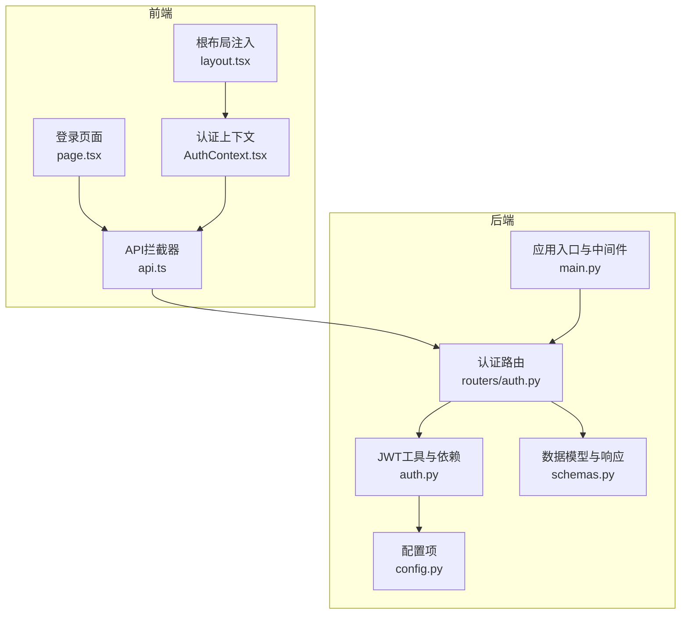
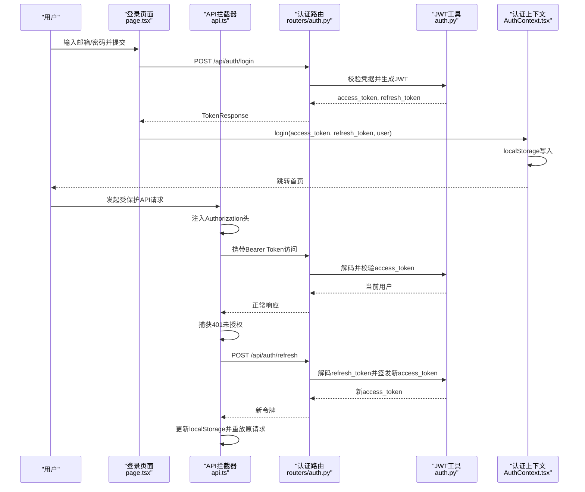
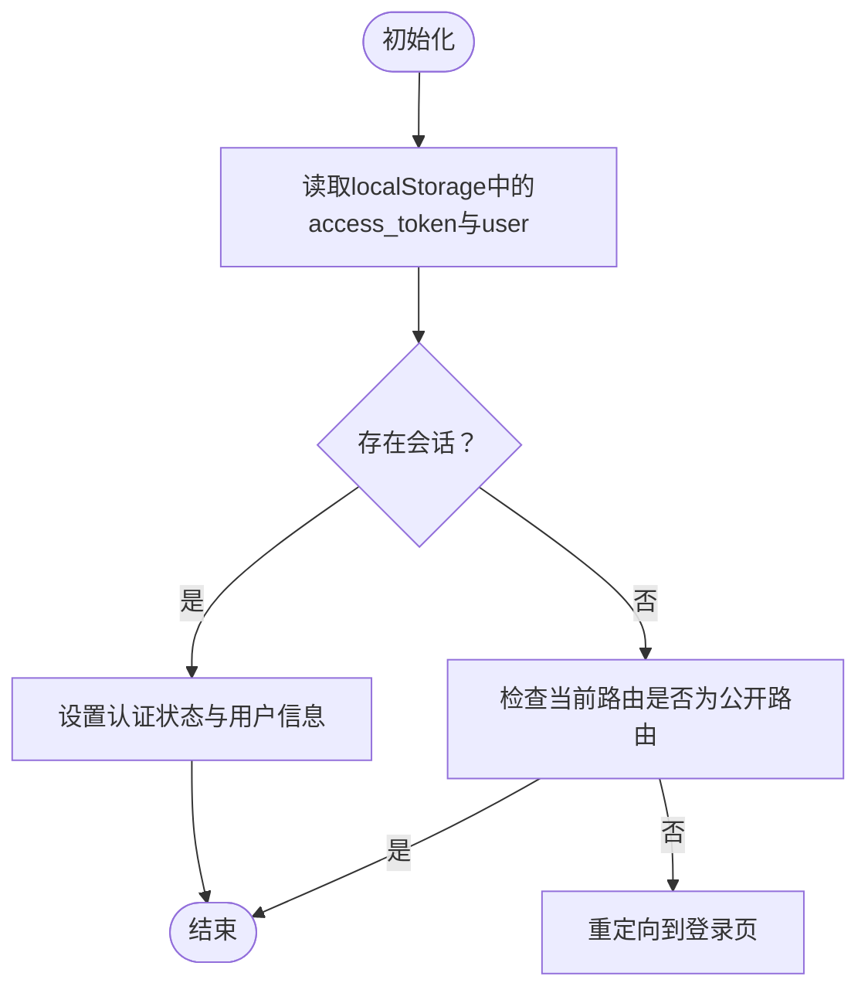
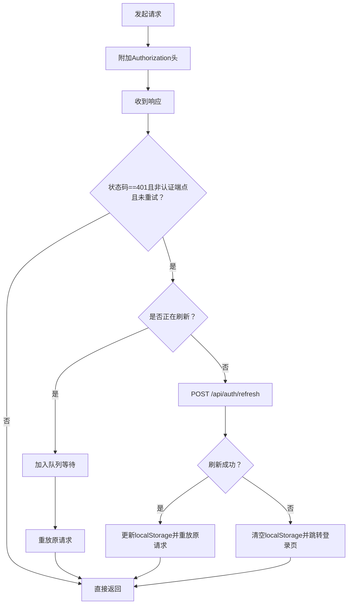
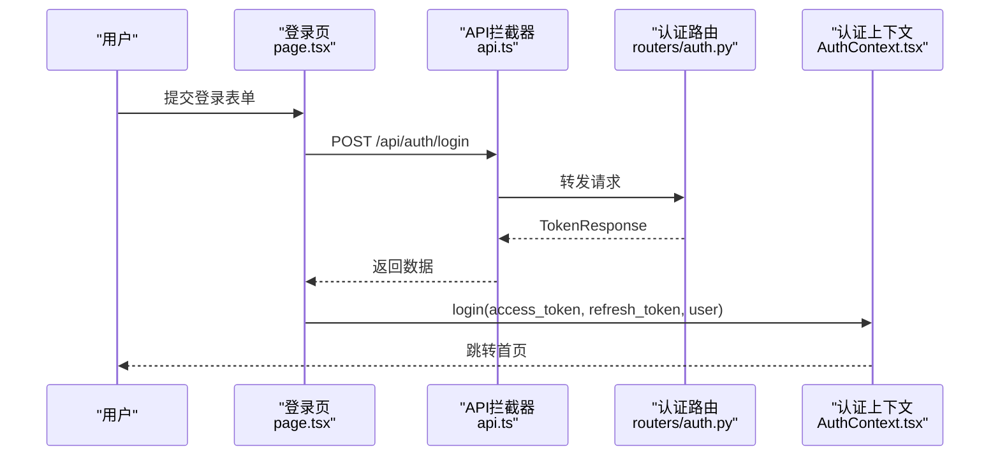
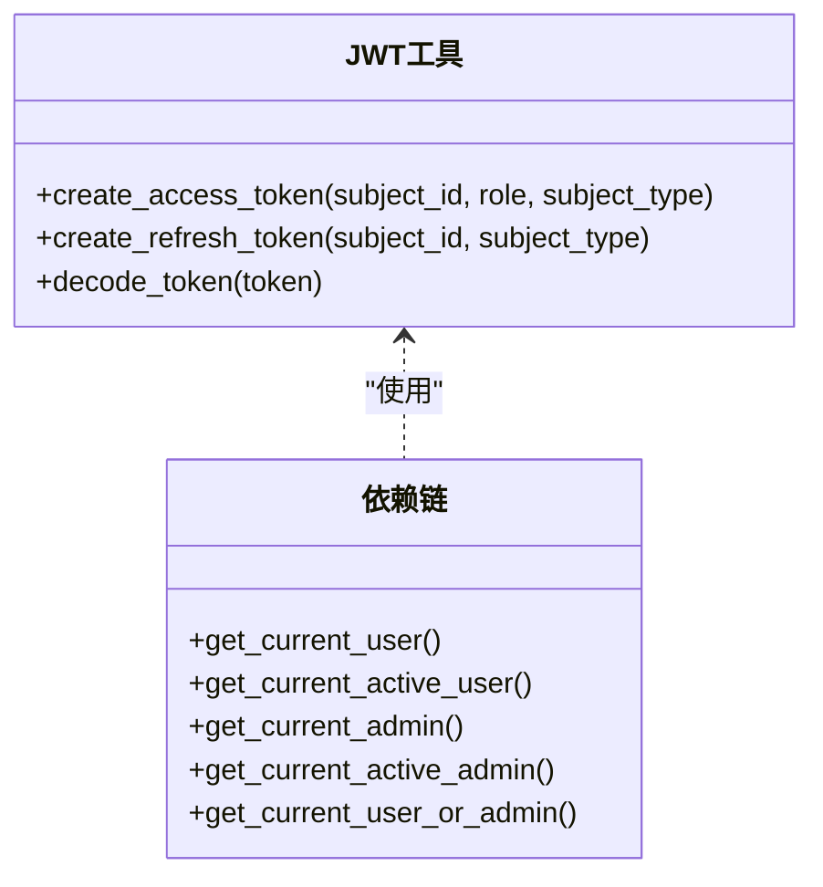
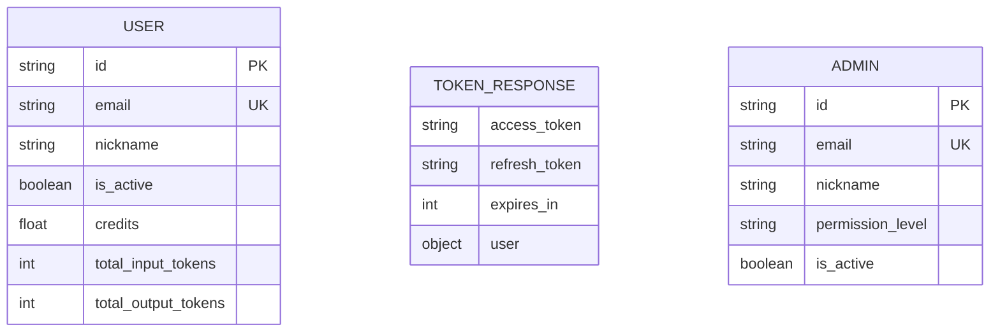
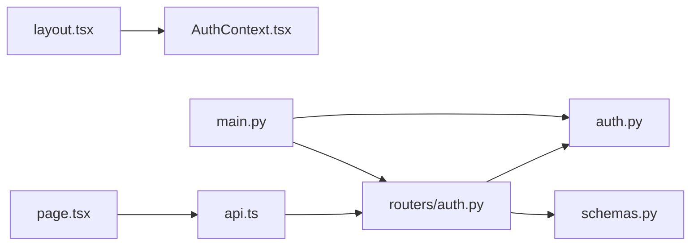

# 用户认证系统

<cite>
**本文档引用的文件**
- [AuthContext.tsx](file://frontend/src/context/AuthContext.tsx)
- [api.ts](file://frontend/src/lib/api.ts)
- [page.tsx](file://frontend/src/app/login/page.tsx)
- [layout.tsx](file://frontend/src/app/layout.tsx)
- [auth.py](file://backend/auth.py)
- [auth.py](file://backend/routers/auth.py)
- [schemas.py](file://backend/schemas.py)
- [config.py](file://backend/config.py)
- [main.py](file://backend/main.py)
</cite>

## 目录
1. [简介](#简介)
2. [项目结构](#项目结构)
3. [核心组件](#核心组件)
4. [架构总览](#架构总览)
5. [详细组件分析](#详细组件分析)
6. [依赖关系分析](#依赖关系分析)
7. [性能考虑](#性能考虑)
8. [故障排除指南](#故障排除指南)
9. [结论](#结论)
10. [附录](#附录)

## 简介
本文件面向Infinite Game的用户认证系统，围绕JWT认证流程、前端状态管理与持久化、自动刷新机制、过期处理、登录页面实现、权限控制与路由保护、API调用示例与错误处理策略进行系统性说明，并提供安全最佳实践与常见问题解决方案。

## 项目结构
认证系统由前后端协同完成：
- 前端负责用户界面、状态管理、本地存储、请求拦截与自动刷新。
- 后端负责JWT签发与校验、用户与管理员鉴权依赖、路由保护与权限校验。

**图表来源**
- [layout.tsx:34](file://frontend/src/app/layout.tsx#L34)
- [AuthContext.tsx:104](file://frontend/src/context/AuthContext.tsx#L104-L109)
- [api.ts:3](file://frontend/src/lib/api.ts#L3-L6)
- [page.tsx:18](file://frontend/src/app/login/page.tsx#L18-L29)
- [main.py:139](file://backend/main.py#L139)
- [auth.py:83](file://backend/auth.py#L83-L113)
- [auth.py:63](file://backend/routers/auth.py#L63-L99)
- [schemas.py:51](file://backend/schemas.py#L51-L63)
- [config.py:26](file://backend/config.py#L26-L30)

**章节来源**
- [layout.tsx:23-41](file://frontend/src/app/layout.tsx#L23-L41)
- [main.py:139-152](file://backend/main.py#L139-L152)

## 核心组件
- 前端认证上下文：提供用户信息、登录/登出、积分更新与全局状态管理；初始化时读取localStorage并进行路由保护。
- 请求拦截器：自动附加Authorization头；在401时触发刷新队列与令牌刷新。
- 登录页面：支持登录/注册切换，表单验证与错误提示，成功后写入localStorage并跳转。
- 后端JWT工具：生成access/refresh token、解码与校验、FastAPI依赖链（当前用户/激活用户/管理员）。
- 认证路由：提供注册、登录、刷新、个人信息查询等接口。
- 配置：JWT密钥、算法、过期时间、刷新周期等。

**章节来源**
- [AuthContext.tsx:52-109](file://frontend/src/context/AuthContext.tsx#L52-L109)
- [api.ts:9-83](file://frontend/src/lib/api.ts#L9-L83)
- [page.tsx:18-50](file://frontend/src/app/login/page.tsx#L18-L50)
- [auth.py:30-75](file://backend/auth.py#L30-L75)
- [auth.py:83-113](file://backend/auth.py#L83-L113)
- [auth.py:63-99](file://backend/routers/auth.py#L63-L99)
- [config.py:26-30](file://backend/config.py#L26-L30)

## 架构总览
下图展示从登录到API调用、再到自动刷新的整体流程。

**图表来源**
- [page.tsx:18-29](file://frontend/src/app/login/page.tsx#L18-L29)
- [api.ts:9-83](file://frontend/src/lib/api.ts#L9-L83)
- [auth.py:63-99](file://backend/routers/auth.py#L63-L99)
- [auth.py:102-129](file://backend/routers/auth.py#L102-L129)
- [auth.py:65-74](file://backend/auth.py#L65-L74)
- [AuthContext.tsx:75-94](file://frontend/src/context/AuthContext.tsx#L75-L94)

## 详细组件分析

### 前端认证上下文（AuthContext）
- 状态与能力
  - 用户信息缓存：localStorage中读取并解析用户数据。
  - 登录状态持久化：登录成功写入access_token、refresh_token与user。
  - 路由保护：初始化时检测路径与会话，非公开路由且未登录则重定向至登录页。
  - 积分更新：本地更新用户积分并同步到localStorage。
- 关键行为
  - 初始化副作用：读取localStorage，设置认证状态，必要时重定向。
  - 登录回调：写入令牌与用户信息，跳转首页。
  - 登出回调：清除localStorage，重置状态，跳转登录页。

**图表来源**
- [AuthContext.tsx:60-73](file://frontend/src/context/AuthContext.tsx#L60-L73)

**章节来源**
- [AuthContext.tsx:52-109](file://frontend/src/context/AuthContext.tsx#L52-L109)

### 请求拦截器与自动刷新（api.ts）
- 请求阶段
  - 在每个请求前从localStorage读取access_token并附加到Authorization头。
- 响应阶段
  - 捕获401未授权且非认证端点、非已重试请求时：
    - 若正在刷新，则将后续请求加入队列等待；
    - 读取refresh_token并调用POST /api/auth/refresh；
    - 成功后更新localStorage中的access_token并重放原请求；
    - 失败则清空localStorage并跳转登录页。

**图表来源**
- [api.ts:31-81](file://frontend/src/lib/api.ts#L31-L81)

**章节来源**
- [api.ts:9-83](file://frontend/src/lib/api.ts#L9-L83)

### 登录页面实现（page.tsx）
- 功能特性
  - 登录/注册双模式切换；
  - 表单验证：邮箱格式、必填、密码长度、二次确认一致性；
  - 错误处理：捕获后端错误并显示友好提示；
  - 成功后调用AuthContext.login写入令牌与用户信息并跳转。
- 用户体验
  - 加载态按钮、Ant Design组件、中英文文案与布局优化。

**图表来源**
- [page.tsx:18-29](file://frontend/src/app/login/page.tsx#L18-L29)
- [api.ts:3](file://frontend/src/lib/api.ts#L3-L6)
- [auth.py:63-99](file://backend/routers/auth.py#L63-L99)
- [AuthContext.tsx:75-84](file://frontend/src/context/AuthContext.tsx#L75-L84)

**章节来源**
- [page.tsx:12-50](file://frontend/src/app/login/page.tsx#L12-L50)

### 后端JWT与认证依赖（auth.py）
- JWT生成
  - access_token：包含sub、role、subject_type、type=access、exp。
  - refresh_token：包含sub、subject_type、type=refresh、exp。
- 解码与校验
  - decode_token：校验签名与过期，失败抛出401。
- FastAPI依赖
  - get_current_user：OAuth2方案，校验access_token并加载用户。
  - get_current_active_user：确保账户处于活跃状态。
  - 管理员与通用鉴权：分别针对admins表与联合查询。

**图表来源**
- [auth.py:30-75](file://backend/auth.py#L30-L75)
- [auth.py:83-113](file://backend/auth.py#L83-L113)
- [auth.py:119-156](file://backend/auth.py#L119-L156)
- [auth.py:162-210](file://backend/auth.py#L162-L210)

**章节来源**
- [auth.py:30-75](file://backend/auth.py#L30-L75)
- [auth.py:83-113](file://backend/auth.py#L83-L113)

### 认证路由与数据模型（routers/auth.py, schemas.py）
- 路由
  - POST /api/auth/register：注册新用户。
  - POST /api/auth/login：邮箱+密码登录，返回TokenResponse。
  - POST /api/auth/refresh：使用refresh_token换取新的access_token。
  - GET /api/auth/me：返回当前用户信息。
- 数据模型
  - TokenResponse：access_token、refresh_token、expires_in、user。
  - UserResponse：用户信息（含积分、计数等）。
  - TokenRefresh：刷新请求体。

**图表来源**
- [schemas.py:28-48](file://backend/schemas.py#L28-L48)
- [schemas.py:51-63](file://backend/schemas.py#L51-L63)
- [auth.py:63-99](file://backend/routers/auth.py#L63-L99)
- [auth.py:102-129](file://backend/routers/auth.py#L102-L129)

**章节来源**
- [auth.py:63-136](file://backend/routers/auth.py#L63-L136)
- [schemas.py:13-63](file://backend/schemas.py#L13-L63)

### 配置与应用入口（config.py, main.py）
- 配置
  - JWT_SECRET_KEY、JWT_ALGORITHM、ACCESS_TOKEN_EXPIRE_MINUTES、REFRESH_TOKEN_EXPIRE_DAYS。
- 应用入口
  - 注册认证路由与CORS中间件，调试中间件输出Authorization头日志。

**章节来源**
- [config.py:26-30](file://backend/config.py#L26-L30)
- [main.py:130-152](file://backend/main.py#L130-L152)

## 依赖关系分析
- 前端
  - layout.tsx注入AuthProvider，使整个应用树具备认证上下文。
  - page.tsx通过api.ts调用后端认证路由。
  - api.ts依赖localStorage与后端刷新接口，形成自动刷新闭环。
- 后端
  - routers/auth.py依赖auth.py进行JWT生成与校验。
  - schemas.py定义请求/响应模型，保证前后端契约一致。
  - main.py注册路由并启用CORS与调试中间件。

**图表来源**
- [layout.tsx:34](file://frontend/src/app/layout.tsx#L34)
- [page.tsx:18-29](file://frontend/src/app/login/page.tsx#L18-L29)
- [api.ts:3](file://frontend/src/lib/api.ts#L3-L6)
- [main.py:139](file://backend/main.py#L139)
- [auth.py:63](file://backend/routers/auth.py#L63-L99)

**章节来源**
- [layout.tsx:23-41](file://frontend/src/app/layout.tsx#L23-L41)
- [main.py:139-152](file://backend/main.py#L139-L152)

## 性能考虑
- 令牌过期时间：ACCESS_TOKEN_EXPIRE_MINUTES默认较短，有助于降低泄露风险；结合刷新机制减少频繁登录。
- 刷新队列：并发请求遇到401时统一排队，避免重复刷新与请求风暴。
- 前端缓存：用户信息与令牌本地持久化，减少重复登录成本。
- CORS与中间件：合理配置允许域与方法，避免不必要的跨域失败。

## 故障排除指南
- 登录后仍被重定向到登录页
  - 检查AuthContext初始化是否正确读取localStorage，以及PUBLIC_ROUTES判定。
  - 确认路由守卫逻辑与pathname匹配。
- 401频繁出现
  - 检查请求拦截器是否正确附加Authorization头。
  - 确认刷新流程是否成功写回access_token并重放请求。
- 刷新失败导致无法使用
  - 检查refresh_token是否存在与有效。
  - 确认后端decode_token与get_current_active_user逻辑未拒绝请求。
- 管理员端登录异常
  - 管理员端有独立的AuthContext与axios拦截器，需确保/admin路由下的鉴权流程一致。

**章节来源**
- [AuthContext.tsx:60-73](file://frontend/src/context/AuthContext.tsx#L60-L73)
- [api.ts:31-81](file://frontend/src/lib/api.ts#L31-L81)
- [auth.py:65-74](file://backend/auth.py#L65-L74)
- [auth.py:109-113](file://backend/auth.py#L109-L113)

## 结论
该认证系统以JWT为核心，结合前端拦截器与后端依赖链，实现了完整的登录、令牌持久化、自动刷新与路由保护。通过清晰的上下文与拦截器设计，既保证了安全性，也提升了用户体验。建议在生产环境中强化密钥管理、引入HTTPS与安全头、定期轮换密钥，并对敏感操作增加二次验证。

## 附录

### API调用示例与错误处理策略
- 登录
  - 方法：POST /api/auth/login
  - 请求体：邮箱、密码
  - 成功：返回TokenResponse（包含access_token、refresh_token、expires_in、user）
  - 失败：401（凭据错误）、403（账户禁用）
- 注册
  - 方法：POST /api/auth/register
  - 请求体：邮箱、昵称、密码
  - 成功：201，返回UserResponse
  - 失败：409（邮箱已存在）
- 刷新
  - 方法：POST /api/auth/refresh
  - 请求体：refresh_token
  - 成功：返回新的access_token与expires_in
  - 失败：401（无效token类型或用户不存在/禁用）
- 获取当前用户
  - 方法：GET /api/auth/me
  - 成功：返回UserResponse
  - 失败：401/403（未认证或账户禁用）

错误处理策略
- 前端：401时自动刷新，刷新失败则清空本地存储并跳转登录。
- 后端：decode_token失败抛401；get_current_active_user/ get_current_active_admin校验账户状态。

**章节来源**
- [auth.py:63-136](file://backend/routers/auth.py#L63-L136)
- [auth.py:65-74](file://backend/auth.py#L65-L74)
- [auth.py:109-113](file://backend/auth.py#L109-L113)
- [api.ts:31-81](file://frontend/src/lib/api.ts#L31-L81)