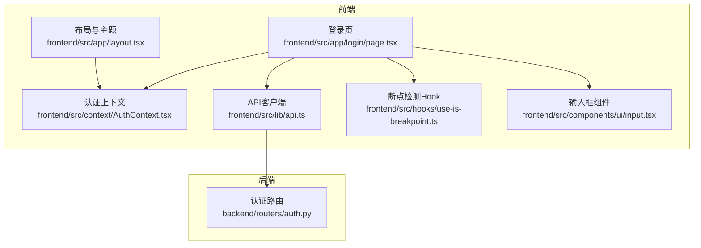
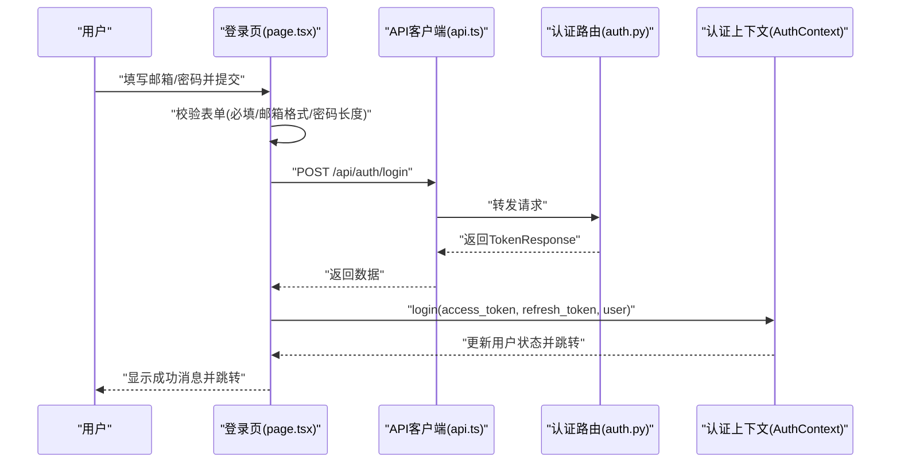
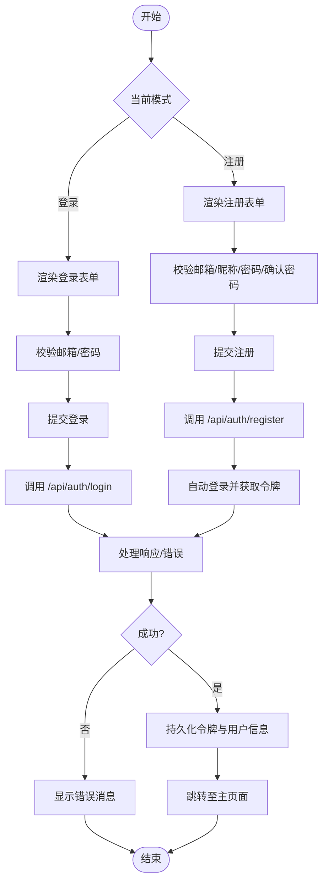
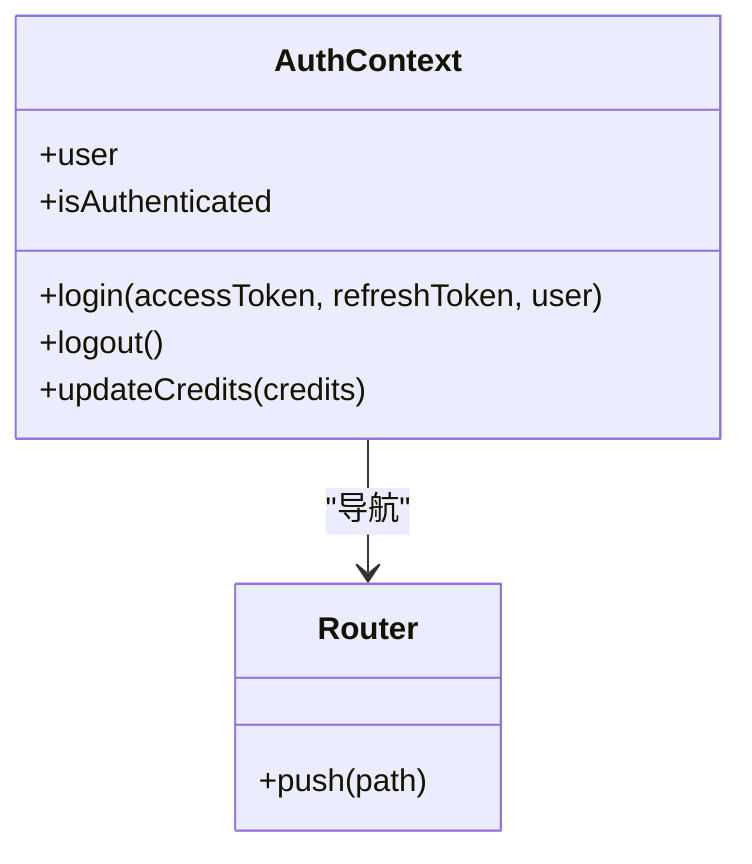
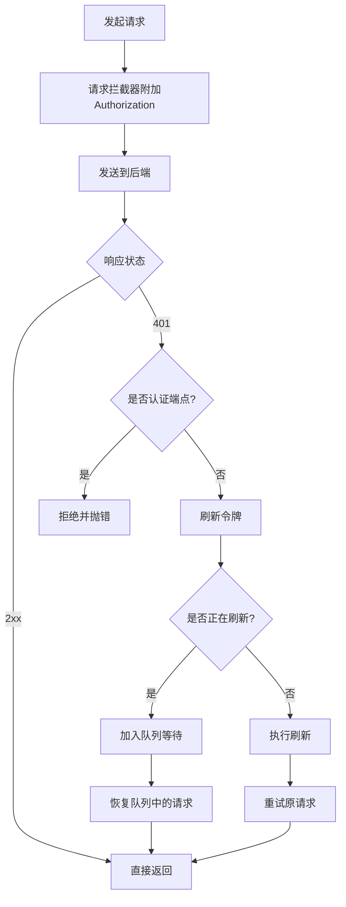
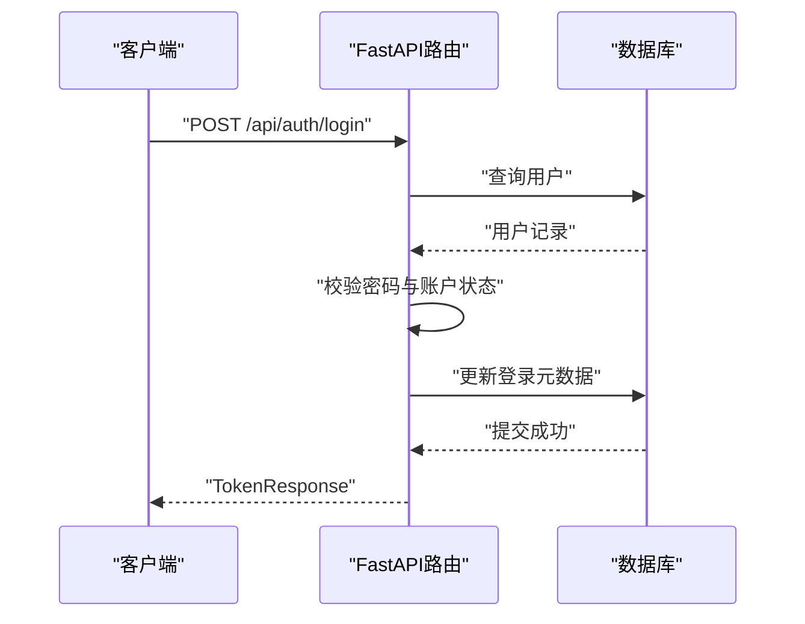
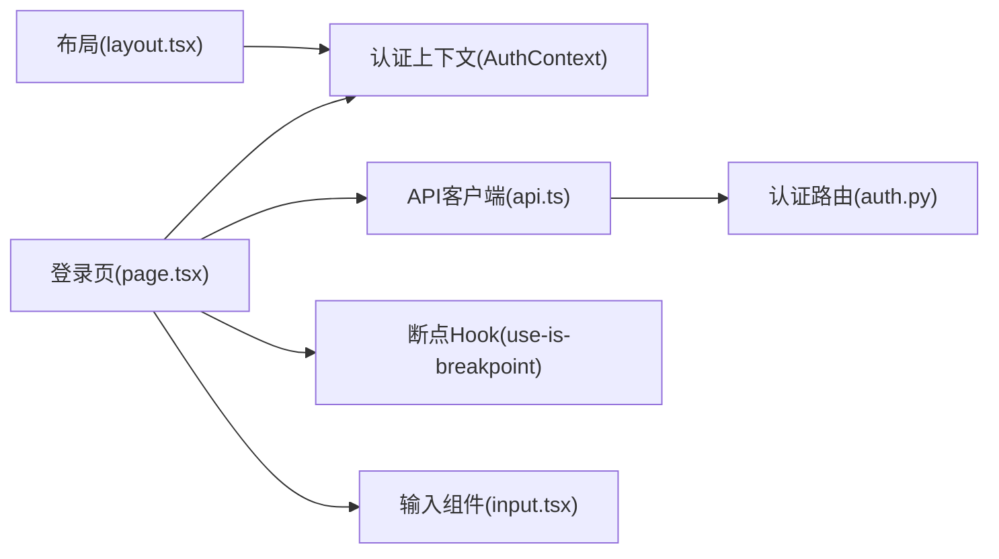

# 登录页面

<cite>
**本文引用的文件**
- [frontend/src/app/login/page.tsx](file://frontend/src/app/login/page.tsx)
- [frontend/src/context/AuthContext.tsx](file://frontend/src/context/AuthContext.tsx)
- [frontend/src/lib/api.ts](file://frontend/src/lib/api.ts)
- [frontend/src/app/layout.tsx](file://frontend/src/app/layout.tsx)
- [frontend/src/hooks/use-is-breakpoint.ts](file://frontend/src/hooks/use-is-breakpoint.ts)
- [frontend/src/components/ui/input.tsx](file://frontend/src/components/ui/input.tsx)
- [backend/routers/auth.py](file://backend/routers/auth.py)
- [backend/admin/src/app/admin/login/page.tsx](file://backend/admin/src/app/admin/login/page.tsx)
- [backend/admin/src/context/AuthContext.tsx](file://backend/admin/src/context/AuthContext.tsx)
- [backend/admin/src/lib/axios.ts](file://backend/admin/src/lib/axios.ts)
- [backend/admin/src/components/ui/form.tsx](file://backend/admin/src/components/ui/form.tsx)
- [backend/admin/src/components/ui/use-toast.ts](file://backend/admin/src/components/ui/use-toast.ts)
</cite>

## 目录
1. [简介](#简介)
2. [项目结构](#项目结构)
3. [核心组件](#核心组件)
4. [架构总览](#架构总览)
5. [详细组件分析](#详细组件分析)
6. [依赖关系分析](#依赖关系分析)
7. [性能考虑](#性能考虑)
8. [故障排除指南](#故障排除指南)
9. [结论](#结论)
10. [附录](#附录)

## 简介
本文件面向Infinite Game的登录页面，提供从前端到后端的完整实现与使用说明。内容涵盖：
- 登录表单的输入验证规则与错误处理机制
- 登录API调用流程、请求参数格式、响应处理与错误状态码
- 登录成功后的重定向逻辑与用户状态更新
- 表单防重复提交与加载状态管理
- 样式定制指南与响应式设计实现
- 常见登录问题的诊断与解决方案

## 项目结构
登录页面位于前端Next.js应用中，采用Ant Design表单与自定义UI组件；同时存在一个独立的管理员登录页面，使用React Hook Form与Shadcn UI组件库。

图表来源
- [frontend/src/app/login/page.tsx:12-193](file://frontend/src/app/login/page.tsx#L12-L193)
- [frontend/src/context/AuthContext.tsx:39-109](file://frontend/src/context/AuthContext.tsx#L39-L109)
- [frontend/src/lib/api.ts:1-48](file://frontend/src/lib/api.ts#L1-L48)
- [frontend/src/app/layout.tsx:23-41](file://frontend/src/app/layout.tsx#L23-L41)
- [frontend/src/hooks/use-is-breakpoint.ts:13-37](file://frontend/src/hooks/use-is-breakpoint.ts#L13-L37)
- [frontend/src/components/ui/input.tsx:1-23](file://frontend/src/components/ui/input.tsx#L1-L23)
- [backend/routers/auth.py:30-136](file://backend/routers/auth.py#L30-L136)

章节来源
- [frontend/src/app/login/page.tsx:12-193](file://frontend/src/app/login/page.tsx#L12-L193)
- [frontend/src/context/AuthContext.tsx:39-109](file://frontend/src/context/AuthContext.tsx#L39-L109)
- [frontend/src/lib/api.ts:1-48](file://frontend/src/lib/api.ts#L1-L48)
- [frontend/src/app/layout.tsx:23-41](file://frontend/src/app/layout.tsx#L23-L41)
- [frontend/src/hooks/use-is-breakpoint.ts:13-37](file://frontend/src/hooks/use-is-breakpoint.ts#L13-L37)
- [frontend/src/components/ui/input.tsx:1-23](file://frontend/src/components/ui/input.tsx#L1-L23)
- [backend/routers/auth.py:30-136](file://backend/routers/auth.py#L30-L136)

## 核心组件
- 用户登录页：负责展示登录/注册表单、输入验证、错误提示、加载状态与跳转逻辑。
- 认证上下文：统一管理用户状态、登录/登出、令牌持久化与路由守卫。
- API客户端：封装Axios实例，自动注入Authorization头，处理401刷新与并发队列。
- 响应式断点Hook：用于适配移动端与桌面端布局。
- 输入组件：通用输入框样式与交互。

章节来源
- [frontend/src/app/login/page.tsx:12-193](file://frontend/src/app/login/page.tsx#L12-L193)
- [frontend/src/context/AuthContext.tsx:39-109](file://frontend/src/context/AuthContext.tsx#L39-L109)
- [frontend/src/lib/api.ts:1-48](file://frontend/src/lib/api.ts#L1-L48)
- [frontend/src/hooks/use-is-breakpoint.ts:13-37](file://frontend/src/hooks/use-is-breakpoint.ts#L13-L37)
- [frontend/src/components/ui/input.tsx:1-23](file://frontend/src/components/ui/input.tsx#L1-L23)

## 架构总览
下图展示了用户登录的关键交互路径：从前端表单提交到后端认证，再到前端状态更新与页面跳转。

图表来源
- [frontend/src/app/login/page.tsx:18-29](file://frontend/src/app/login/page.tsx#L18-L29)
- [frontend/src/lib/api.ts:1-48](file://frontend/src/lib/api.ts#L1-L48)
- [backend/routers/auth.py:63-99](file://backend/routers/auth.py#L63-L99)
- [frontend/src/context/AuthContext.tsx:39-109](file://frontend/src/context/AuthContext.tsx#L39-L109)

## 详细组件分析

### 登录页实现（用户端）
- 表单模式切换：支持“登录”与“注册”双模式，通过状态切换渲染不同字段。
- 输入验证规则：
  - 邮箱：必填且符合邮箱格式
  - 密码：必填；注册时要求最少6位
  - 确认密码：需与密码一致
- 错误处理：
  - 使用Ant Design的消息组件展示错误
  - 注册后自动触发登录流程并复用相同错误处理
- 加载状态与防重复提交：
  - 提交期间设置loading，按钮禁用
  - 通过finally确保loading在任何情况下都会被清除
- 成功后行为：
  - 显示欢迎消息
  - 调用认证上下文的login方法，持久化令牌与用户信息，并进行页面跳转

图表来源
- [frontend/src/app/login/page.tsx:18-50](file://frontend/src/app/login/page.tsx#L18-L50)
- [frontend/src/app/login/page.tsx:74-178](file://frontend/src/app/login/page.tsx#L74-L178)
- [frontend/src/context/AuthContext.tsx:39-109](file://frontend/src/context/AuthContext.tsx#L39-L109)

章节来源
- [frontend/src/app/login/page.tsx:12-193](file://frontend/src/app/login/page.tsx#L12-L193)
- [frontend/src/app/login/page.tsx:74-178](file://frontend/src/app/login/page.tsx#L74-L178)
- [frontend/src/context/AuthContext.tsx:39-109](file://frontend/src/context/AuthContext.tsx#L39-L109)

### 认证上下文（用户端）
- 状态管理：维护user、isAuthenticated、loading
- 登录流程：写入access_token/refresh_token/user到localStorage，更新上下文状态，跳转到首页
- 登出流程：清理本地存储并跳转到登录页
- 路由守卫：对受保护路由进行鉴权，未登录则重定向到登录页
- 信用额度更新：提供updateCredits方法以更新本地用户信息

图表来源
- [frontend/src/context/AuthContext.tsx:39-109](file://frontend/src/context/AuthContext.tsx#L39-L109)

章节来源
- [frontend/src/context/AuthContext.tsx:39-109](file://frontend/src/context/AuthContext.tsx#L39-L109)

### API客户端（用户端）
- 基础配置：baseURL指向/api，Content-Type为application/json
- 请求拦截器：自动附加Authorization: Bearer token
- 响应拦截器：处理401未授权（除认证端点外），支持刷新令牌与并发请求排队
- 刷新流程：在刷新期间将后续请求加入队列，刷新完成后统一重试

图表来源
- [frontend/src/lib/api.ts:1-48](file://frontend/src/lib/api.ts#L1-L48)

章节来源
- [frontend/src/lib/api.ts:1-48](file://frontend/src/lib/api.ts#L1-L48)

### 后端认证路由（用户端）
- /api/auth/register：注册新用户，校验邮箱唯一性，返回用户信息
- /api/auth/login：邮箱+密码登录，校验用户存在与密码正确性，检查账户是否激活，更新登录元数据，签发访问/刷新令牌
- /api/auth/refresh：使用刷新令牌换取新的访问令牌
- /api/auth/me：返回当前已认证用户信息

图表来源
- [backend/routers/auth.py:63-99](file://backend/routers/auth.py#L63-L99)

章节来源
- [backend/routers/auth.py:36-136](file://backend/routers/auth.py#L36-L136)

### 管理员登录页面（对比参考）
- 使用React Hook Form与Zod进行强类型验证
- 支持“记住邮箱”功能，使用localStorage持久化
- 对401/403/422/5xx等状态码进行差异化错误提示
- 使用Toast组件进行成功提示
- 登录成功后调用AuthContext的login方法并跳转

章节来源
- [backend/admin/src/app/admin/login/page.tsx:43-128](file://backend/admin/src/app/admin/login/page.tsx#L43-L128)
- [backend/admin/src/context/AuthContext.tsx:39-116](file://backend/admin/src/context/AuthContext.tsx#L39-L116)
- [backend/admin/src/lib/axios.ts:1-105](file://backend/admin/src/lib/axios.ts#L1-L105)
- [backend/admin/src/components/ui/form.tsx:1-167](file://backend/admin/src/components/ui/form.tsx#L1-L167)
- [backend/admin/src/components/ui/use-toast.ts:1-192](file://backend/admin/src/components/ui/use-toast.ts#L1-L192)

## 依赖关系分析
- 登录页依赖认证上下文进行状态更新与路由跳转
- API客户端依赖Axios并内置拦截器处理认证与刷新
- 布局文件将AuthProvider包裹在根节点，确保全局可用
- 断点Hook用于响应式布局适配

图表来源
- [frontend/src/app/login/page.tsx:12-193](file://frontend/src/app/login/page.tsx#L12-L193)
- [frontend/src/context/AuthContext.tsx:39-109](file://frontend/src/context/AuthContext.tsx#L39-L109)
- [frontend/src/lib/api.ts:1-48](file://frontend/src/lib/api.ts#L1-L48)
- [backend/routers/auth.py:30-136](file://backend/routers/auth.py#L30-L136)
- [frontend/src/app/layout.tsx:23-41](file://frontend/src/app/layout.tsx#L23-L41)
- [frontend/src/hooks/use-is-breakpoint.ts:13-37](file://frontend/src/hooks/use-is-breakpoint.ts#L13-L37)
- [frontend/src/components/ui/input.tsx:1-23](file://frontend/src/components/ui/input.tsx#L1-L23)

章节来源
- [frontend/src/app/login/page.tsx:12-193](file://frontend/src/app/login/page.tsx#L12-L193)
- [frontend/src/context/AuthContext.tsx:39-109](file://frontend/src/context/AuthContext.tsx#L39-L109)
- [frontend/src/lib/api.ts:1-48](file://frontend/src/lib/api.ts#L1-L48)
- [backend/routers/auth.py:30-136](file://backend/routers/auth.py#L30-L136)
- [frontend/src/app/layout.tsx:23-41](file://frontend/src/app/layout.tsx#L23-L41)
- [frontend/src/hooks/use-is-breakpoint.ts:13-37](file://frontend/src/hooks/use-is-breakpoint.ts#L13-L37)
- [frontend/src/components/ui/input.tsx:1-23](file://frontend/src/components/ui/input.tsx#L1-L23)

## 性能考虑
- 并发请求队列：在刷新令牌期间将后续请求排队，避免重复刷新与请求风暴
- 本地存储：令牌与用户信息持久化，减少重复登录成本
- 按需渲染：登录页仅在需要时渲染，避免不必要的计算
- 响应式布局：通过断点Hook适配不同屏幕尺寸，提升移动端体验

## 故障排除指南
- 登录失败但无错误提示
  - 检查API响应拦截器是否正确处理401/403/422/5xx
  - 确认后端路由返回的错误详情字段
- 无法跳转或反复重定向
  - 检查认证上下文的路由守卫逻辑与PUBLIC_ROUTES配置
  - 确认登录成功后是否正确写入localStorage并调用login
- 重复提交导致多次登录
  - 确保提交期间loading为true，按钮禁用
  - 确认finally块会清除loading状态
- 移动端显示异常
  - 使用断点Hook检测当前视口并调整布局
  - 检查Tailwind类名与组件尺寸属性

章节来源
- [frontend/src/lib/api.ts:19-48](file://frontend/src/lib/api.ts#L19-L48)
- [frontend/src/context/AuthContext.tsx:49-94](file://frontend/src/context/AuthContext.tsx#L49-L94)
- [frontend/src/app/login/page.tsx:18-29](file://frontend/src/app/login/page.tsx#L18-L29)
- [frontend/src/hooks/use-is-breakpoint.ts:13-37](file://frontend/src/hooks/use-is-breakpoint.ts#L13-L37)

## 结论
本文档系统梳理了Infinite Game登录页面的前端实现、认证上下文、API客户端与后端路由，明确了输入验证、错误处理、加载状态与重定向逻辑。通过拦截器与并发队列机制，系统具备良好的安全性与稳定性。建议在生产环境中结合日志监控与更细粒度的错误分类，持续优化用户体验。

## 附录

### 登录API调用规范（用户端）
- 请求方法与路径
  - 注册：POST /api/auth/register
  - 登录：POST /api/auth/login
  - 刷新：POST /api/auth/refresh
  - 获取当前用户：GET /api/auth/me
- 请求参数
  - 注册：邮箱、昵称、密码
  - 登录：邮箱、密码
  - 刷新：刷新令牌
- 响应数据
  - 登录/注册：TokenResponse（包含访问令牌、刷新令牌、过期时间与用户信息）
  - 当前用户：UserResponse（用户资料）
- 错误状态码
  - 400：请求参数错误
  - 401：凭据无效或未授权
  - 403：账户被禁用
  - 409：邮箱已注册
  - 5xx：服务器内部错误

章节来源
- [backend/routers/auth.py:36-136](file://backend/routers/auth.py#L36-L136)

### 样式定制与响应式设计
- 组件样式
  - 输入框组件提供基础样式与焦点态，可在业务层扩展尺寸与主题
- 响应式适配
  - 使用断点Hook检测视口宽度，按需调整布局与间距
- 主题与字体
  - 布局文件引入Geist字体变量，确保全局一致性

章节来源
- [frontend/src/components/ui/input.tsx:1-23](file://frontend/src/components/ui/input.tsx#L1-L23)
- [frontend/src/hooks/use-is-breakpoint.ts:13-37](file://frontend/src/hooks/use-is-breakpoint.ts#L13-L37)
- [frontend/src/app/layout.tsx:8-16](file://frontend/src/app/layout.tsx#L8-L16)