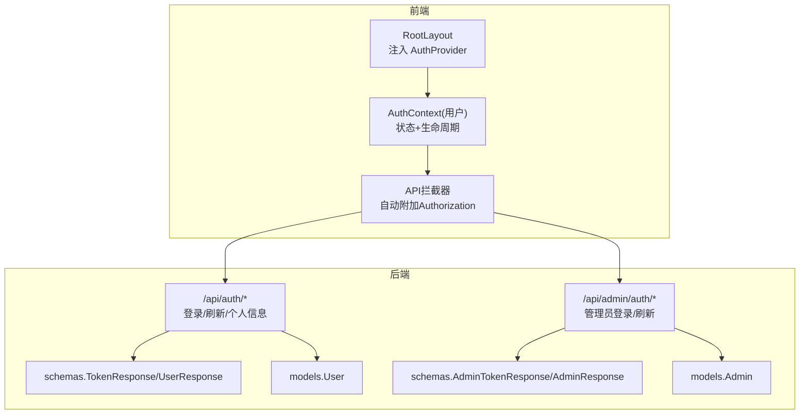
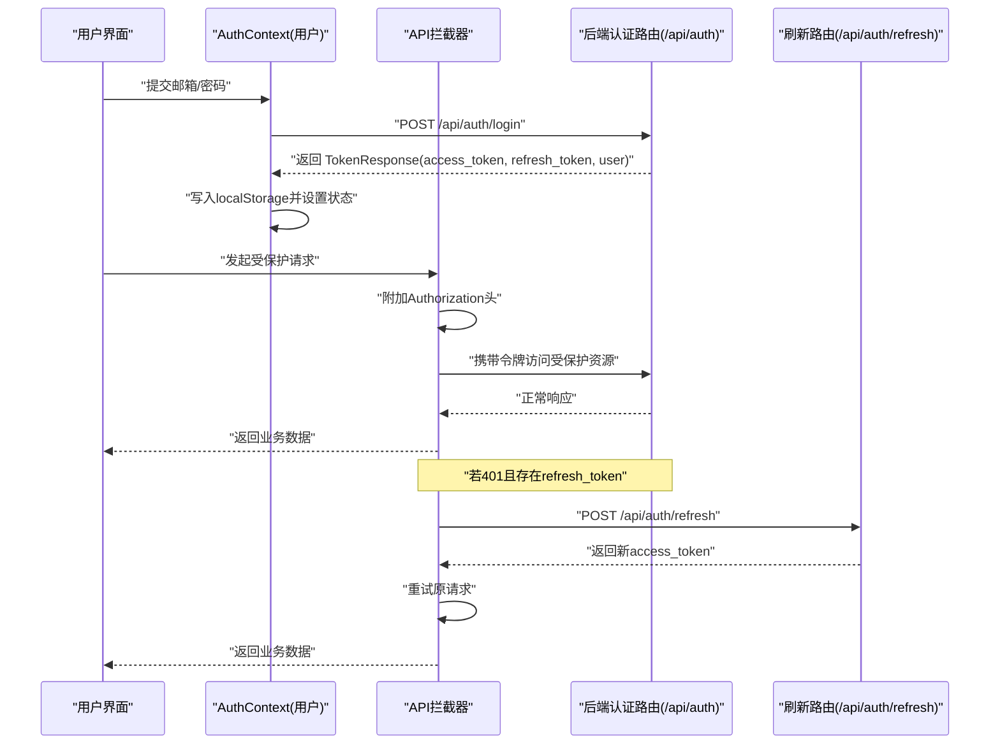
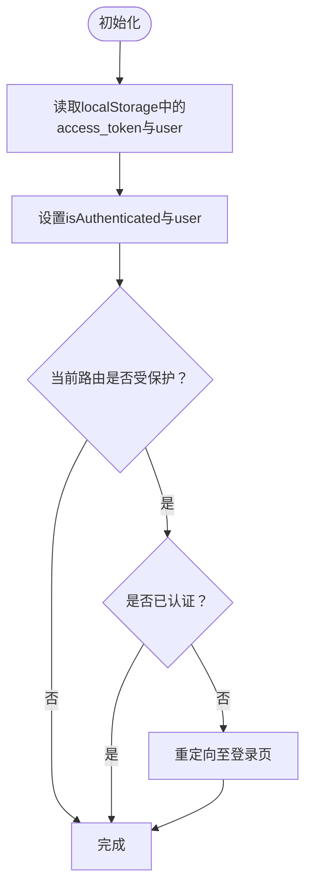
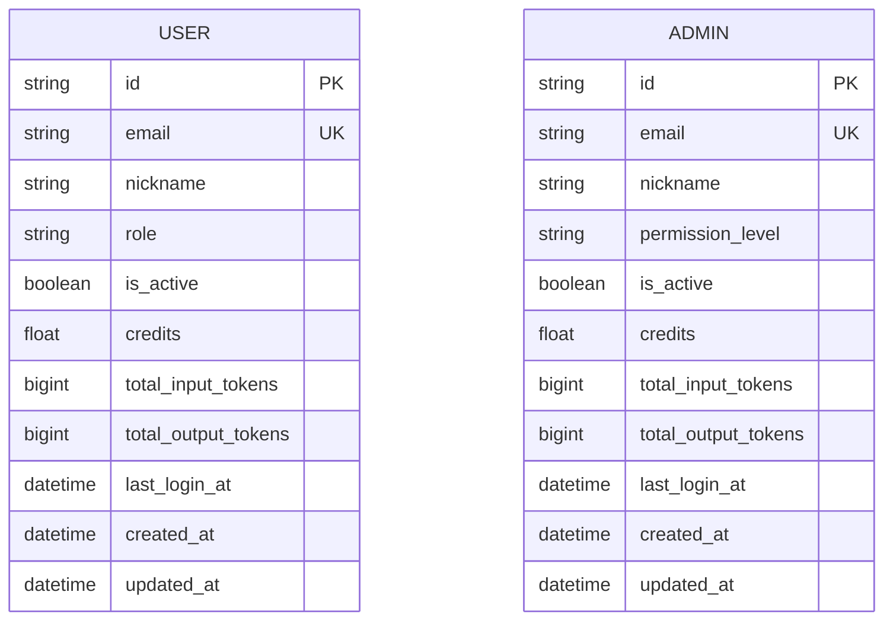
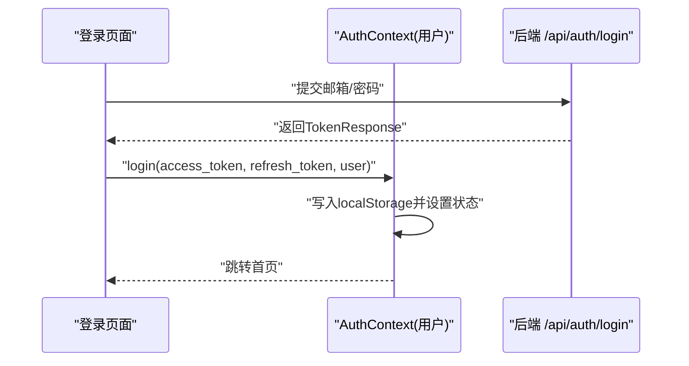
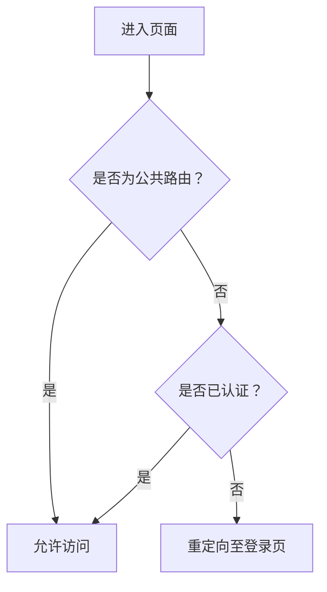
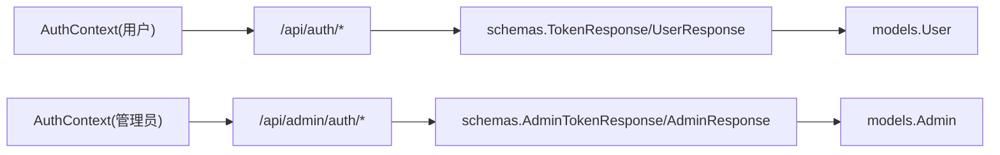

# 认证上下文

<cite>
**本文引用的文件**
- [frontend/src/context/AuthContext.tsx](file://frontend/src/context/AuthContext.tsx)
- [frontend/src/lib/api.ts](file://frontend/src/lib/api.ts)
- [frontend/src/app/layout.tsx](file://frontend/src/app/layout.tsx)
- [frontend/src/app/login/page.tsx](file://frontend/src/app/login/page.tsx)
- [backend/routers/auth.py](file://backend/routers/auth.py)
- [backend/schemas.py](file://backend/schemas.py)
- [backend/models.py](file://backend/models.py)
- [backend/migrations/versions/c74e516c6d87_add_credit_billing_system.py](file://backend/migrations/versions/c74e516c6d87_add_credit_billing_system.py)
- [backend/admin/src/context/AuthContext.tsx](file://backend/admin/src/context/AuthContext.tsx)
- [backend/admin/src/app/admin/login/page.tsx](file://backend/admin/src/app/admin/login/page.tsx)
- [backend/admin/src/types/index.ts](file://backend/admin/src/types/index.ts)
- [backend/routers/admin_auth.py](file://backend/routers/admin_auth.py)
- [backend/routers/admin.py](file://backend/routers/admin.py)
</cite>

## 目录
1. [简介](#简介)
2. [项目结构](#项目结构)
3. [核心组件](#核心组件)
4. [架构总览](#架构总览)
5. [详细组件分析](#详细组件分析)
6. [依赖分析](#依赖分析)
7. [性能考虑](#性能考虑)
8. [故障排查指南](#故障排查指南)
9. [结论](#结论)
10. [附录](#附录)

## 简介
本文件面向Infinite Game的认证上下文系统，围绕前端用户认证上下文与后端API进行系统化说明。内容涵盖：
- AuthContext设计与职责边界（用户状态管理、认证状态跟踪、权限验证机制）
- TokenResponse接口字段语义与使用场景
- 用户信息数据结构（角色权限、积分余额、使用统计）
- 认证生命周期（初始化检查、登录登出流程、状态更新）
- 路由保护机制（公共路由配置、受保护路由守卫）
- 实际使用示例与最佳实践

## 项目结构
认证上下文横跨前后端：
- 前端：Next.js应用中的用户认证上下文、全局拦截器、根布局注入
- 后端：FastAPI认证路由、Pydantic模型与响应结构、数据库模型及迁移

图表来源
- [frontend/src/app/layout.tsx:23-37](file://frontend/src/app/layout.tsx#L23-L37)
- [frontend/src/context/AuthContext.tsx:52-109](file://frontend/src/context/AuthContext.tsx#L52-L109)
- [frontend/src/lib/api.ts:3-84](file://frontend/src/lib/api.ts#L3-L84)
- [backend/routers/auth.py:30-136](file://backend/routers/auth.py#L30-L136)
- [backend/schemas.py:51-63](file://backend/schemas.py#L51-L63)
- [backend/models.py:35-73](file://backend/models.py#L35-L73)
- [backend/routers/admin_auth.py:80-118](file://backend/routers/admin_auth.py#L80-L118)
- [backend/schemas.py:105-111](file://backend/schemas.py#L105-L111)
- [backend/models.py:10-33](file://backend/models.py#L10-L33)

章节来源
- [frontend/src/app/layout.tsx:23-37](file://frontend/src/app/layout.tsx#L23-L37)
- [frontend/src/context/AuthContext.tsx:52-109](file://frontend/src/context/AuthContext.tsx#L52-L109)
- [frontend/src/lib/api.ts:3-84](file://frontend/src/lib/api.ts#L3-L84)
- [backend/routers/auth.py:30-136](file://backend/routers/auth.py#L30-L136)
- [backend/schemas.py:51-63](file://backend/schemas.py#L51-L63)
- [backend/models.py:35-73](file://backend/models.py#L35-L73)
- [backend/routers/admin_auth.py:80-118](file://backend/routers/admin_auth.py#L80-L118)
- [backend/schemas.py:105-111](file://backend/schemas.py#L105-L111)
- [backend/models.py:10-33](file://backend/models.py#L10-L33)

## 核心组件
- 前端用户认证上下文（AuthContext）
  - 状态：当前用户、是否已认证、更新积分
  - 生命周期：初始化检查本地存储、导航时校验受保护路由
  - 登录/登出：写入/清理本地存储，跳转路由
- 全局API拦截器
  - 请求头自动附加Authorization: Bearer <access_token>
  - 401时尝试刷新令牌并重试
- 后端认证路由
  - 用户：登录、刷新、获取当前用户
  - 管理员：登录、刷新、获取当前管理员
- 数据模型与响应结构
  - User/Admin模型包含积分、令牌、使用统计等字段
  - TokenResponse/AccessTokenResponse/AdminTokenResponse定义响应结构

章节来源
- [frontend/src/context/AuthContext.tsx:12-102](file://frontend/src/context/AuthContext.tsx#L12-L102)
- [frontend/src/lib/api.ts:9-81](file://frontend/src/lib/api.ts#L9-L81)
- [backend/routers/auth.py:63-136](file://backend/routers/auth.py#L63-L136)
- [backend/schemas.py:51-63](file://backend/schemas.py#L51-L63)
- [backend/models.py:35-73](file://backend/models.py#L35-L73)
- [backend/routers/admin_auth.py:80-118](file://backend/routers/admin_auth.py#L80-L118)
- [backend/schemas.py:105-111](file://backend/schemas.py#L105-L111)

## 架构总览
下图展示从登录到请求拦截再到令牌刷新的整体流程。

图表来源
- [frontend/src/app/login/page.tsx:39-44](file://frontend/src/app/login/page.tsx#L39-L44)
- [frontend/src/context/AuthContext.tsx:75-94](file://frontend/src/context/AuthContext.tsx#L75-L94)
- [frontend/src/lib/api.ts:31-81](file://frontend/src/lib/api.ts#L31-L81)
- [backend/routers/auth.py:63-136](file://backend/routers/auth.py#L63-L136)

## 详细组件分析

### 前端用户认证上下文（AuthContext）
- 设计要点
  - 使用React Context暴露user、isAuthenticated、login、logout、updateCredits
  - 初始化时读取localStorage中的access_token与user，决定初始认证状态
  - 导航时对非公开路由进行守卫，未认证则跳转登录
  - 登录成功后持久化令牌与用户信息，并跳转首页；登出清理并跳转登录页
- 生命周期
  - 首次挂载：读取本地存储，判断是否已登录
  - 路由变化：若处于受保护路由且未登录，则重定向
  - 登录/登出：更新内存状态与本地存储
- 更新积分
  - updateCredits仅更新内存与本地存储，不触发网络调用

图表来源
- [frontend/src/context/AuthContext.tsx:60-73](file://frontend/src/context/AuthContext.tsx#L60-L73)

章节来源
- [frontend/src/context/AuthContext.tsx:52-109](file://frontend/src/context/AuthContext.tsx#L52-L109)

### TokenResponse接口与字段语义
- 字段说明
  - access_token：访问令牌字符串
  - refresh_token：刷新令牌字符串
  - token_type：令牌类型，默认为bearer
  - expires_in：过期时间（秒）
  - user/admin：当前用户/管理员信息对象
- 使用场景
  - 登录成功后，服务端返回TokenResponse，前端将其存入localStorage并设置上下文状态
  - 刷新接口返回AccessTokenResponse，用于在401时替换access_token
- 注意
  - 前端拦截器会自动将access_token附加到Authorization头
  - 若401且存在refresh_token，拦截器会尝试刷新并重试

章节来源
- [frontend/src/context/AuthContext.tsx:23-29](file://frontend/src/context/AuthContext.tsx#L23-L29)
- [frontend/src/lib/api.ts:65-68](file://frontend/src/lib/api.ts#L65-L68)
- [backend/schemas.py:51-63](file://backend/schemas.py#L51-L63)
- [backend/schemas.py:105-111](file://backend/schemas.py#L105-L111)

### 用户信息数据结构（角色权限、积分余额、使用统计）
- User/Admin通用字段
  - id、email、nickname
  - is_active：是否启用
  - credits：积分余额
  - total_input_tokens / total_output_tokens：输入/输出token统计
  - last_login_at / created_at / updated_at：时间戳
- User特有
  - role：已废弃，保留兼容
  - subscription_*：订阅计划与状态
- Admin特有
  - permission_level：权限级别（如admin、super_admin）
  - last_login_at等

图表来源
- [backend/models.py:35-73](file://backend/models.py#L35-L73)
- [backend/models.py:10-33](file://backend/models.py#L10-L33)
- [backend/schemas.py:28-48](file://backend/schemas.py#L28-L48)
- [backend/schemas.py:87-102](file://backend/schemas.py#L87-L102)

章节来源
- [backend/models.py:35-73](file://backend/models.py#L35-L73)
- [backend/models.py:10-33](file://backend/models.py#L10-L33)
- [backend/schemas.py:28-48](file://backend/schemas.py#L28-L48)
- [backend/schemas.py:87-102](file://backend/schemas.py#L87-L102)

### 认证状态生命周期管理
- 初始化检查
  - 首次渲染时读取localStorage，设置初始认证状态与用户信息
  - 对受保护路由进行守卫，未认证则跳转登录
- 登录流程
  - 前端调用后端登录接口，接收TokenResponse
  - AuthContext写入localStorage并设置状态，随后跳转首页
- 登出流程
  - 清理localStorage，重置状态，跳转登录页
- 状态更新
  - updateCredits仅更新内存与本地存储，不触发网络调用

图表来源
- [frontend/src/app/login/page.tsx:39-44](file://frontend/src/app/login/page.tsx#L39-L44)
- [frontend/src/context/AuthContext.tsx:75-84](file://frontend/src/context/AuthContext.tsx#L75-L84)

章节来源
- [frontend/src/context/AuthContext.tsx:60-94](file://frontend/src/context/AuthContext.tsx#L60-L94)
- [frontend/src/app/login/page.tsx:39-44](file://frontend/src/app/login/page.tsx#L39-L44)

### 路由保护机制与公共路由
- 公共路由
  - 前端用户认证上下文定义了公共路由列表（例如登录页），无需认证即可访问
- 受保护路由守卫
  - 首次挂载：若检测到token但无用户信息，可能触发后端校验（管理员上下文）
  - 导航时：若处于受保护路由且未认证，重定向至登录页
- 管理员上下文
  - 独立的管理员AuthContext，首次挂载时调用后端“获取当前管理员”接口进行校验
  - 受保护路由以路径前缀判断（如/admin且非/admin/login）

图表来源
- [frontend/src/context/AuthContext.tsx:49-73](file://frontend/src/context/AuthContext.tsx#L49-L73)
- [backend/admin/src/context/AuthContext.tsx:37-83](file://backend/admin/src/context/AuthContext.tsx#L37-L83)

章节来源
- [frontend/src/context/AuthContext.tsx:49-73](file://frontend/src/context/AuthContext.tsx#L49-L73)
- [backend/admin/src/context/AuthContext.tsx:37-83](file://backend/admin/src/context/AuthContext.tsx#L37-L83)

### 管理员认证上下文（对比与差异）
- 相同点
  - 均通过localStorage持有令牌与用户信息
  - 均在首次挂载时进行一次令牌有效性校验
  - 均提供login与logout方法
- 差异点
  - 管理员上下文在加载期间显示“加载中”，避免受保护内容闪烁
  - 管理员上下文守卫基于路径前缀判断受保护路由
  - 管理员上下文在登录成功后跳转/admin，登出跳转/admin/login

章节来源
- [backend/admin/src/context/AuthContext.tsx:39-116](file://backend/admin/src/context/AuthContext.tsx#L39-L116)

### 积分与使用统计
- 积分余额
  - User/Admin均包含credits字段，用于消费与充值
  - 后端提供管理员调整积分的接口，支持正负调整
- 使用统计
  - total_input_tokens / total_output_tokens记录输入/输出token数
  - 后端迁移引入credit_transactions表，记录每次交易的输入/输出token与余额变化
- 订阅系统
  - User包含订阅计划与状态字段，支持按订阅发放积分等策略

章节来源
- [backend/models.py:65-68](file://backend/models.py#L65-L68)
- [backend/models.py:26-26](file://backend/models.py#L26-L26)
- [backend/routers/admin.py:421-440](file://backend/routers/admin.py#L421-L440)
- [backend/migrations/versions/c74e516c6d87_add_credit_billing_system.py:21-66](file://backend/migrations/versions/c74e516c6d87_add_credit_billing_system.py#L21-L66)
- [backend/schemas.py:173-187](file://backend/schemas.py#L173-L187)

## 依赖分析
- 前端依赖
  - AuthContext依赖Next.js路由钩子（useRouter、usePathname）与localStorage
  - API拦截器依赖axios，负责请求头附加与401刷新
- 后端依赖
  - FastAPI路由依赖数据库会话、JWT工具与Pydantic模型
  - 管理员上下文依赖独立的后端认证路由与类型定义

图表来源
- [frontend/src/context/AuthContext.tsx:52-109](file://frontend/src/context/AuthContext.tsx#L52-L109)
- [backend/routers/auth.py:30-136](file://backend/routers/auth.py#L30-L136)
- [backend/schemas.py:51-63](file://backend/schemas.py#L51-L63)
- [backend/models.py:35-73](file://backend/models.py#L35-L73)
- [backend/routers/admin_auth.py:80-118](file://backend/routers/admin_auth.py#L80-L118)
- [backend/schemas.py:105-111](file://backend/schemas.py#L105-L111)
- [backend/models.py:10-33](file://backend/models.py#L10-L33)

章节来源
- [frontend/src/context/AuthContext.tsx:52-109](file://frontend/src/context/AuthContext.tsx#L52-L109)
- [backend/routers/auth.py:30-136](file://backend/routers/auth.py#L30-L136)
- [backend/schemas.py:51-63](file://backend/schemas.py#L51-L63)
- [backend/models.py:35-73](file://backend/models.py#L35-L73)
- [backend/routers/admin_auth.py:80-118](file://backend/routers/admin_auth.py#L80-L118)
- [backend/schemas.py:105-111](file://backend/schemas.py#L105-L111)
- [backend/models.py:10-33](file://backend/models.py#L10-L33)

## 性能考虑
- 令牌刷新队列
  - 当并发请求遇到401时，拦截器会排队等待刷新完成，避免重复刷新与并发风暴
- 本地存储读写
  - 初始化与更新积分均通过localStorage同步读写，建议避免频繁调用updateCredits
- 路由守卫
  - 在客户端侧进行轻量守卫，减少不必要的后端请求

## 故障排查指南
- 401未刷新
  - 检查是否存在refresh_token；若无，拦截器会清空存储并跳转登录
  - 确认拦截器未对认证路由进行刷新（/auth/开头的路由不会刷新）
- 登录后仍被重定向
  - 确认登录成功后是否正确调用了AuthContext.login并写入localStorage
  - 检查受保护路由守卫逻辑与当前pathname
- 管理员登录问题
  - 确认管理员AuthContext的受保护路由判断与后端“获取当前管理员”接口可用性
  - 检查localStorage中access_token与user是否正确写入

章节来源
- [frontend/src/lib/api.ts:38-81](file://frontend/src/lib/api.ts#L38-L81)
- [frontend/src/context/AuthContext.tsx:68-73](file://frontend/src/context/AuthContext.tsx#L68-L73)
- [backend/admin/src/context/AuthContext.tsx:37-83](file://backend/admin/src/context/AuthContext.tsx#L37-L83)

## 结论
Infinite Game的认证上下文采用“前端上下文+后端路由”的组合方案：
- 前端负责状态管理、路由守卫与请求拦截
- 后端负责令牌签发、刷新与用户信息查询
- 通过清晰的TokenResponse结构与本地存储约定，实现了稳定的认证生命周期与良好的用户体验

## 附录

### 使用示例与最佳实践
- 登录流程
  - 在登录页提交凭据，调用后端登录接口，接收TokenResponse
  - 调用AuthContext.login，写入localStorage并跳转首页
- 请求拦截
  - 通过API拦截器自动附加Authorization头；401时自动刷新并重试
- 管理员登录
  - 使用管理员登录页调用管理员登录接口，登录后跳转/admin
- 更新积分
  - 使用AuthContext.updateCredits更新本地积分；若需持久化，应配合后端接口进行服务端更新

章节来源
- [frontend/src/app/login/page.tsx:39-44](file://frontend/src/app/login/page.tsx#L39-L44)
- [frontend/src/context/AuthContext.tsx:75-102](file://frontend/src/context/AuthContext.tsx#L75-L102)
- [frontend/src/lib/api.ts:31-81](file://frontend/src/lib/api.ts#L31-L81)
- [backend/admin/src/app/admin/login/page.tsx:115-118](file://backend/admin/src/app/admin/login/page.tsx#L115-L118)