# AI助手面板增强

<cite>
**本文档引用的文件**
- [AIAssistantPanel.tsx](file://frontend/src/components/canvas/AIAssistantPanel.tsx)
- [ChatMessage.tsx](file://frontend/src/components/ai-assistant/ChatMessage.tsx)
- [MessageInput.tsx](file://frontend/src/components/ai-assistant/MessageInput.tsx)
- [PanelHeader.tsx](file://frontend/src/components/ai-assistant/PanelHeader.tsx)
- [useSSEHandler.ts](file://frontend/src/components/ai-assistant/hooks/useSSEHandler.ts)
- [useSessionManager.ts](file://frontend/src/components/ai-assistant/hooks/useSessionManager.ts)
- [index.ts](file://frontend/src/components/ai-assistant/index.ts)
- [useAIAssistantStore.ts](file://frontend/src/store/useAIAssistantStore.ts)
- [useCanvasStore.ts](file://frontend/src/store/useCanvasStore.ts)
- [api.ts](file://frontend/src/lib/api.ts)
- [MultiAgentSteps.tsx](file://frontend/src/components/canvas/MultiAgentSteps.tsx)
- [AuthContext.tsx](file://frontend/src/context/AuthContext.tsx)
- [chats.py](file://backend/routers/chats.py)
- [orchestrator.py](file://backend/services/orchestrator.py)
- [agent_executor.py](file://backend/services/agent_executor.py)
- [theater.py](file://backend/services/theater.py)
- [models.py](file://backend/models.py)
- [schemas.py](file://backend/schemas.py)
- [main.py](file://backend/main.py)
- [billing.py](file://backend/services/billing.py)
- [llm_stream.py](file://backend/services/llm_stream.py)
</cite>

## 更新摘要
**变更内容**
- 新增实时积分余额同步功能，通过SSE事件实时更新用户余额
- 增强SSE事件处理，支持更丰富的事件类型和状态管理
- 改进错误处理机制，提供更好的用户体验和故障恢复
- 扩展多智能体协作UI，支持更详细的步骤跟踪和状态显示
- 新增更好的HTTP错误处理，特别是402积分不足状态的友好提示

## 目录
1. [简介](#简介)
2. [项目结构](#项目结构)
3. [核心组件](#核心组件)
4. [架构概览](#架构概览)
5. [详细组件分析](#详细组件分析)
6. [模块化组件系统](#模块化组件系统)
7. [Hook系统](#hook系统)
8. [多模态内容支持](#多模态内容支持)
9. [SSE事件处理增强](#sse事件处理增强)
10. [实时积分余额同步](#实时积分余额同步)
11. [多智能体协作UI](#多智能体协作ui)
12. [错误处理改进](#错误处理改进)
13. [依赖关系分析](#依赖关系分析)
14. [性能考虑](#性能考虑)
15. [故障排除指南](#故障排除指南)
16. [结论](#结论)

## 简介

AI助手面板增强项目经过重大重构，采用了全新的模块化架构设计。项目通过拆分AI助手面板为专用组件和Hook系统，实现了更好的代码组织、可维护性和可测试性。新增的ChatMessage、MessageInput、PanelHeader等组件以及useSSEHandler和useSessionManager Hook，为开发者提供了更清晰的开发体验和更强的扩展能力。

**重大重构功能**：
- **模块化组件架构**：ChatMessage、MessageInput、PanelHeader等专用组件
- **Hook系统**：useSSEHandler和useSessionManager实现关注点分离
- **增强的状态管理**：更清晰的组件职责划分
- **改进的可维护性**：模块化设计提升代码质量
- **更好的可测试性**：独立组件便于单元测试
- **增强的扩展性**：Hook系统支持自定义扩展
- **实时积分同步**：通过SSE事件实现实时余额更新
- **多智能体协作**：增强的多智能体工作流支持
- **改进的错误处理**：更好的用户体验和故障恢复

## 项目结构

项目采用全新的模块化架构设计，将AI助手功能拆分为独立的组件和Hook：

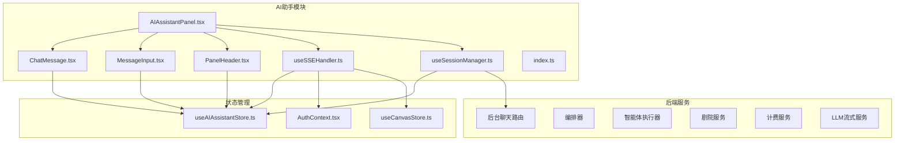
```mermaid
graph TB
subgraph "AI助手模块"
AIAssistantPanel[AIAssistantPanel.tsx]
ChatMessage[ChatMessage.tsx]
MessageInput[MessageInput.tsx]
PanelHeader[PanelHeader.tsx]
useSSEHandler[useSSEHandler.ts]
useSessionManager[useSessionManager.ts]
index[index.ts]
end
subgraph "状态管理"
useAIAssistantStore[useAIAssistantStore.ts]
useCanvasStore[useCanvasStore.ts]
AuthContext[AuthContext.tsx]
end
subgraph "后端服务"
chats[后台聊天路由]
orchestrator[编排器]
agent_executor[智能体执行器]
theater[剧院服务]
billing[计费服务]
llm_stream[LLM流式服务]
end
AIAssistantPanel --> ChatMessage
AIAssistantPanel --> MessageInput
AIAssistantPanel --> PanelHeader
AIAssistantPanel --> useSSEHandler
AIAssistantPanel --> useSessionManager
ChatMessage --> useAIAssistantStore
MessageInput --> useAIAssistantStore
PanelHeader --> useAIAssistantStore
useSSEHandler --> useAIAssistantStore
useSSEHandler --> AuthContext
useSessionManager --> useAIAssistantStore
useSSEHandler --> useCanvasStore
useSessionManager --> chats
```

**图表来源**
- [AIAssistantPanel.tsx:10-12](file://frontend/src/components/canvas/AIAssistantPanel.tsx#L10-L12)
- [index.ts:1-22](file://frontend/src/components/ai-assistant/index.ts#L1-L22)

**章节来源**
- [AIAssistantPanel.tsx:1-295](file://frontend/src/components/canvas/AIAssistantPanel.tsx#L1-L295)
- [index.ts:1-22](file://frontend/src/components/ai-assistant/index.ts#L1-L22)

## 核心组件

### 重构后的AI助手面板组件

AI助手面板经过重构，现在采用模块化设计，将功能拆分为多个专用组件：

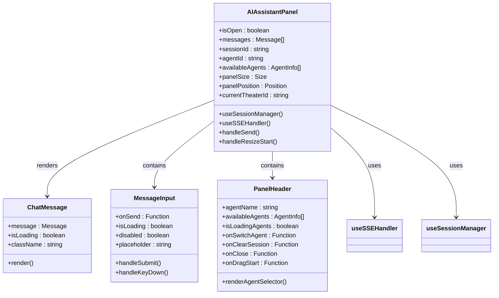
```mermaid
classDiagram
class AIAssistantPanel {
+isOpen : boolean
+messages : Message[]
+sessionId : string
+agentId : string
+availableAgents : AgentInfo[]
+panelSize : Size
+panelPosition : Position
+currentTheaterId : string
+useSessionManager()
+useSSEHandler()
+handleSend()
+handleResizeStart()
}
class ChatMessage {
+message : Message
+isLoading : boolean
+className : string
+render()
}
class MessageInput {
+onSend : Function
+isLoading : boolean
+disabled : boolean
+placeholder : string
+handleSubmit()
+handleKeyDown()
}
class PanelHeader {
+agentName : string
+availableAgents : AgentInfo[]
+isLoadingAgents : boolean
+onSwitchAgent : Function
+onClearSession : Function
+onClose : Function
+onDragStart : Function
+renderAgentSelector()
}
AIAssistantPanel --> ChatMessage : renders
AIAssistantPanel --> MessageInput : contains
AIAssistantPanel --> PanelHeader : contains
AIAssistantPanel --> useSSEHandler : uses
AIAssistantPanel --> useSessionManager : uses
```

**图表来源**
- [AIAssistantPanel.tsx:14-295](file://frontend/src/components/canvas/AIAssistantPanel.tsx#L14-L295)
- [ChatMessage.tsx:46-126](file://frontend/src/components/ai-assistant/ChatMessage.tsx#L46-L126)
- [MessageInput.tsx:9-110](file://frontend/src/components/ai-assistant/MessageInput.tsx#L9-L110)
- [PanelHeader.tsx:15-123](file://frontend/src/components/ai-assistant/PanelHeader.tsx#L15-L123)

### Hook系统架构

新增的Hook系统实现了关注点分离，提供专门的功能封装：

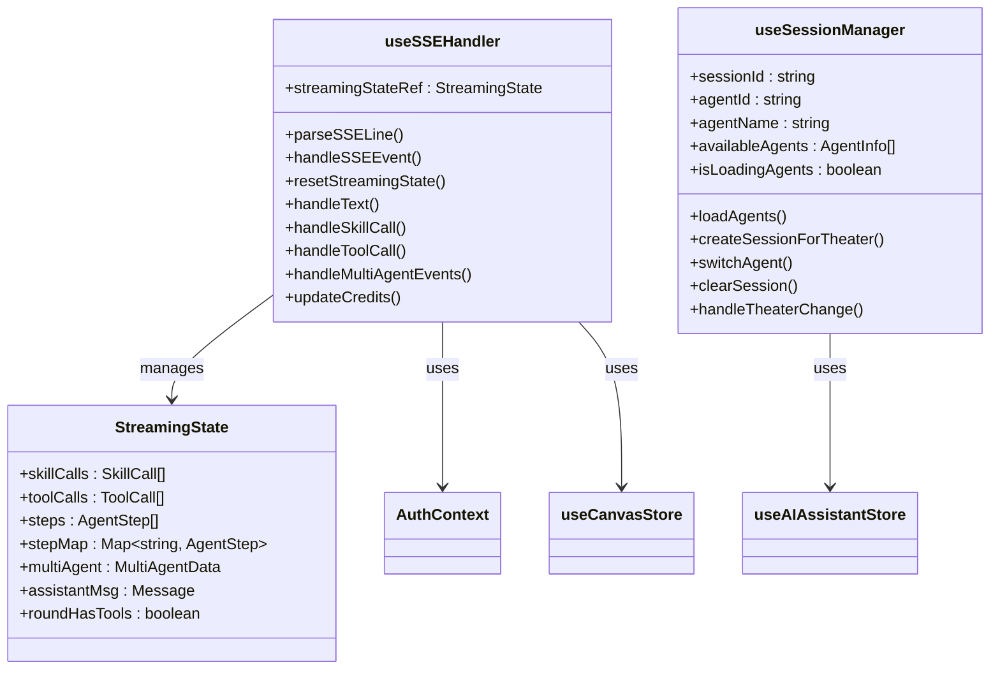
```mermaid
classDiagram
class useSSEHandler {
+streamingStateRef : StreamingState
+parseSSELine()
+handleSSEEvent()
+resetStreamingState()
+handleText()
+handleSkillCall()
+handleToolCall()
+handleMultiAgentEvents()
+updateCredits()
}
class useSessionManager {
+sessionId : string
+agentId : string
+agentName : string
+availableAgents : AgentInfo[]
+isLoadingAgents : boolean
+loadAgents()
+createSessionForTheater()
+switchAgent()
+clearSession()
+handleTheaterChange()
}
class StreamingState {
+skillCalls : SkillCall[]
+toolCalls : ToolCall[]
+steps : AgentStep[]
+stepMap : Map~string, AgentStep~
+multiAgent : MultiAgentData
+assistantMsg : Message
+roundHasTools : boolean
}
useSSEHandler --> StreamingState : manages
useSSEHandler --> AuthContext : uses
useSessionManager --> useAIAssistantStore : uses
useSSEHandler --> useCanvasStore : uses
```

**图表来源**
- [useSSEHandler.ts:23-335](file://frontend/src/components/ai-assistant/hooks/useSSEHandler.ts#L23-L335)
- [useSessionManager.ts:12-179](file://frontend/src/components/ai-assistant/hooks/useSessionManager.ts#L12-L179)

**章节来源**
- [AIAssistantPanel.tsx:25-39](file://frontend/src/components/canvas/AIAssistantPanel.tsx#L25-L39)
- [useSSEHandler.ts:1-335](file://frontend/src/components/ai-assistant/hooks/useSSEHandler.ts#L1-L335)
- [useSessionManager.ts:1-179](file://frontend/src/components/ai-assistant/hooks/useSessionManager.ts#L1-L179)

## 架构概览

系统采用模块化架构设计，实现了清晰的关注点分离：

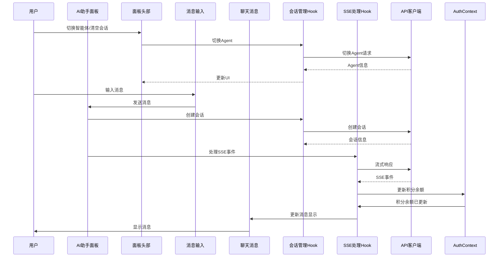
```mermaid
sequenceDiagram
participant User as 用户
participant AIAssistantPanel as AI助手面板
participant PanelHeader as 面板头部
participant MessageInput as 消息输入
participant ChatMessage as 聊天消息
participant useSessionManager as 会话管理Hook
participant useSSEHandler as SSE处理Hook
participant API as API客户端
User->>PanelHeader : 切换智能体/清空会话
PanelHeader->>useSessionManager : 切换Agent
useSessionManager->>API : 切换Agent请求
API-->>useSessionManager : Agent信息
useSessionManager-->>PanelHeader : 更新UI
User->>MessageInput : 输入消息
MessageInput->>AIAssistantPanel : 发送消息
AIAssistantPanel->>useSessionManager : 创建会话
useSessionManager->>API : 创建会话
API-->>useSessionManager : 会话信息
AIAssistantPanel->>useSSEHandler : 处理SSE事件
useSSEHandler->>API : 流式响应
API-->>useSSEHandler : SSE事件
useSSEHandler->>AuthContext : 更新积分余额
AuthContext->>useSSEHandler : 积分余额已更新
useSSEHandler->>ChatMessage : 更新消息显示
ChatMessage->>User : 显示消息
```

**图表来源**
- [AIAssistantPanel.tsx:246-265](file://frontend/src/components/canvas/AIAssistantPanel.tsx#L246-L265)
- [useSessionManager.ts:110-131](file://frontend/src/components/ai-assistant/hooks/useSessionManager.ts#L110-L131)
- [useSSEHandler.ts:61-327](file://frontend/src/components/ai-assistant/hooks/useSSEHandler.ts#L61-L327)

**章节来源**
- [AIAssistantPanel.tsx:82-157](file://frontend/src/components/canvas/AIAssistantPanel.tsx#L82-L157)
- [useSessionManager.ts:48-108](file://frontend/src/components/ai-assistant/hooks/useSessionManager.ts#L48-L108)

## 详细组件分析

### ChatMessage组件

ChatMessage组件负责单个消息的渲染，支持多种消息类型和状态显示：

#### 组件特性
- **多模态内容渲染**：支持文本和代码块的Markdown渲染
- **流式内容显示**：实时显示流式文本内容
- **状态指示器**：显示技能调用和工具执行状态
- **多智能体支持**：显示多智能体协作步骤
- **思考状态指示**：AI思考时的动画效果

#### 渲染逻辑

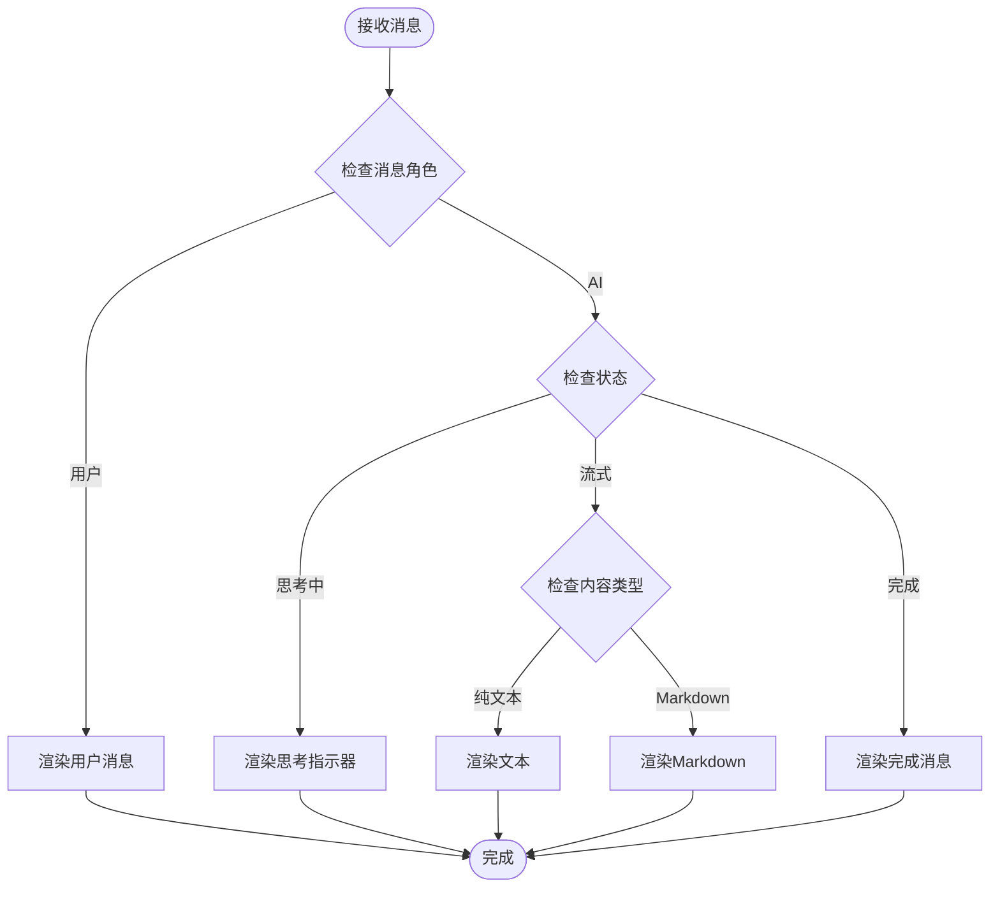
```mermaid
flowchart TD
Start([接收消息]) --> CheckRole{检查消息角色}
CheckRole --> |用户| RenderUser[渲染用户消息]
CheckRole --> |AI| CheckStatus{检查状态}
CheckStatus --> |思考中| RenderThinking[渲染思考指示器]
CheckStatus --> |流式| CheckContent{检查内容类型}
CheckStatus --> |完成| RenderComplete[渲染完成消息]
CheckContent --> |纯文本| RenderText[渲染文本]
CheckContent --> |Markdown| RenderMarkdown[渲染Markdown]
RenderUser --> End([完成])
RenderThinking --> End
RenderText --> End
RenderMarkdown --> End
RenderComplete --> End
```

**图表来源**
- [ChatMessage.tsx:52-126](file://frontend/src/components/ai-assistant/ChatMessage.tsx#L52-L126)

**章节来源**
- [ChatMessage.tsx:1-126](file://frontend/src/components/ai-assistant/ChatMessage.tsx#L1-L126)

### MessageInput组件

MessageInput组件提供消息输入功能，支持键盘快捷键和状态反馈：

#### 组件特性
- **智能输入处理**：Enter发送，Shift+Enter换行
- **状态反馈**：显示AI响应状态
- **禁用控制**：根据加载状态自动禁用
- **焦点管理**：自动聚焦和重新聚焦
- **占位符提示**：友好的用户提示

#### 输入处理流程

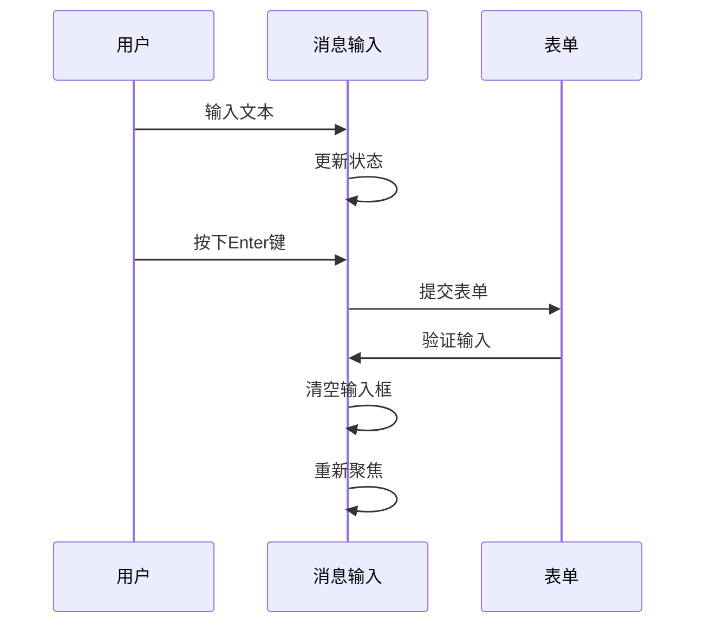
```mermaid
sequenceDiagram
participant User as 用户
participant MessageInput as 消息输入
participant Form as 表单
User->>MessageInput : 输入文本
MessageInput->>MessageInput : 更新状态
User->>MessageInput : 按下Enter键
MessageInput->>Form : 提交表单
Form->>MessageInput : 验证输入
MessageInput->>MessageInput : 清空输入框
MessageInput->>MessageInput : 重新聚焦
```

**图表来源**
- [MessageInput.tsx:32-50](file://frontend/src/components/ai-assistant/MessageInput.tsx#L32-L50)

**章节来源**
- [MessageInput.tsx:1-110](file://frontend/src/components/ai-assistant/MessageInput.tsx#L1-L110)

### PanelHeader组件

PanelHeader组件提供面板头部功能，包含智能体选择和操作按钮：

#### 组件特性
- **智能体选择**：下拉菜单选择可用智能体
- **动态加载**：智能体列表的加载状态显示
- **操作按钮**：清空会话和关闭面板
- **拖拽支持**：面板拖拽功能
- **节点类型显示**：显示智能体支持的节点类型

#### 智能体选择流程

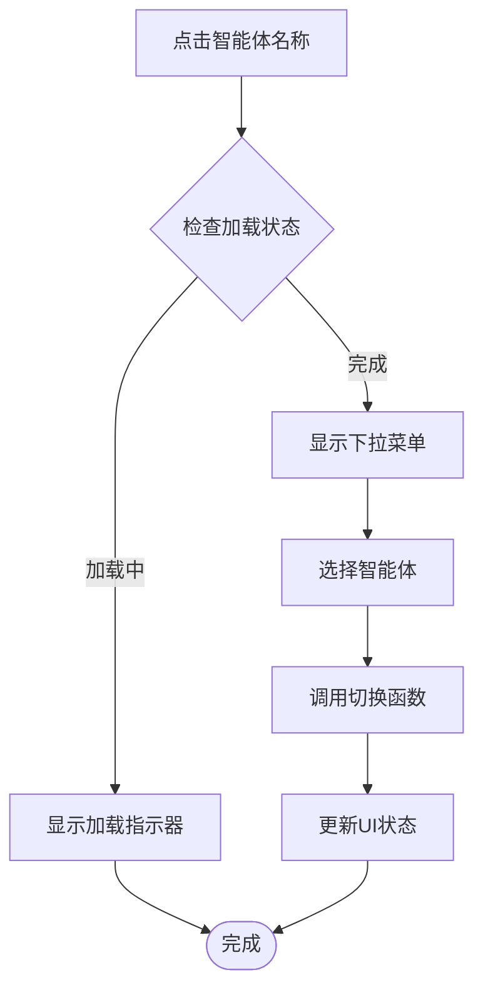
```mermaid
flowchart TD
Click[点击智能体名称] --> CheckLoading{检查加载状态}
CheckLoading --> |加载中| ShowSpinner[显示加载指示器]
CheckLoading --> |完成| ShowDropdown[显示下拉菜单]
ShowDropdown --> SelectAgent[选择智能体]
SelectAgent --> CallSwitch[调用切换函数]
CallSwitch --> UpdateUI[更新UI状态]
ShowSpinner --> End([完成])
UpdateUI --> End
```

**图表来源**
- [PanelHeader.tsx:51-90](file://frontend/src/components/ai-assistant/PanelHeader.tsx#L51-L90)

**章节来源**
- [PanelHeader.tsx:1-123](file://frontend/src/components/ai-assistant/PanelHeader.tsx#L1-L123)

### useSSEHandler Hook

useSSEHandler Hook封装了SSE事件处理逻辑，提供统一的事件处理接口：

#### Hook特性
- **事件分类处理**：区分单智能体和多智能体事件
- **状态管理**：维护流式处理状态
- **事件解析**：解析SSE事件格式
- **状态重置**：处理完成后重置状态
- **画布同步**：处理画布更新事件
- **积分同步**：实时更新用户积分余额

#### 事件处理架构

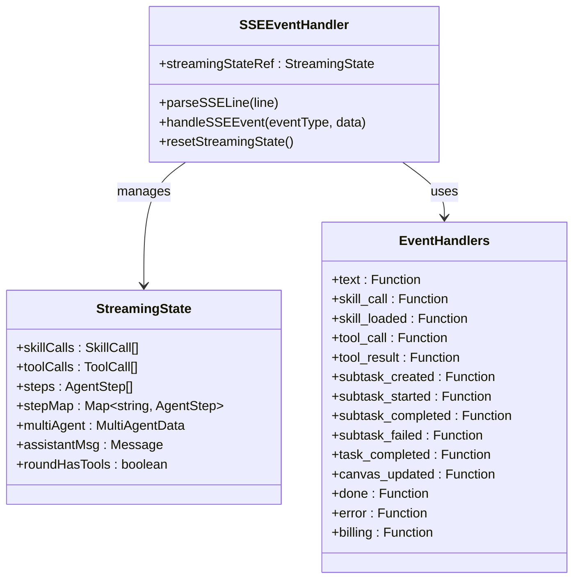
```mermaid
classDiagram
class SSEEventHandler {
+streamingStateRef : StreamingState
+parseSSELine(line)
+handleSSEEvent(eventType, data)
+resetStreamingState()
}
class StreamingState {
+skillCalls : SkillCall[]
+toolCalls : ToolCall[]
+steps : AgentStep[]
+stepMap : Map~string, AgentStep~
+multiAgent : MultiAgentData
+assistantMsg : Message
+roundHasTools : boolean
}
class EventHandlers {
+text : Function
+skill_call : Function
+skill_loaded : Function
+tool_call : Function
+tool_result : Function
+subtask_created : Function
+subtask_started : Function
+subtask_completed : Function
+subtask_failed : Function
+task_completed : Function
+canvas_updated : Function
+done : Function
+error : Function
+billing : Function
}
SSEEventHandler --> StreamingState : manages
SSEEventHandler --> EventHandlers : uses
```

**图表来源**
- [useSSEHandler.ts:23-335](file://frontend/src/components/ai-assistant/hooks/useSSEHandler.ts#L23-L335)

**章节来源**
- [useSSEHandler.ts:1-335](file://frontend/src/components/ai-assistant/hooks/useSSEHandler.ts#L1-L335)

### useSessionManager Hook

useSessionManager Hook封装了会话管理逻辑，提供完整的会话生命周期管理：

#### Hook特性
- **智能体管理**：加载和切换智能体
- **会话创建**：为剧院创建会话
- **消息管理**：加载和清空消息
- **剧院切换**：处理剧院切换逻辑
- **状态同步**：与画布状态同步

#### 会话管理流程

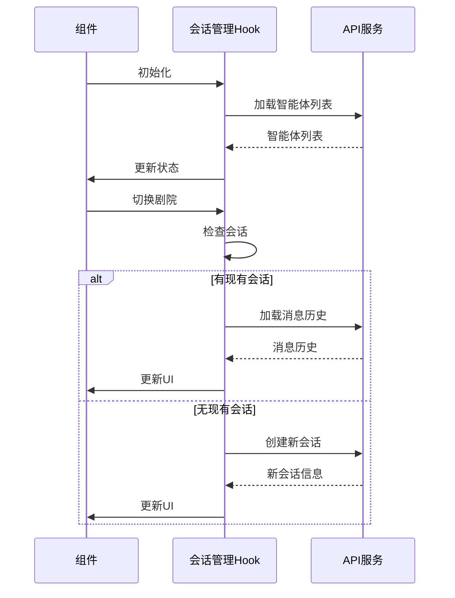
```mermaid
sequenceDiagram
participant Component as 组件
participant useSessionManager as 会话管理Hook
participant API as API服务
Component->>useSessionManager : 初始化
useSessionManager->>API : 加载智能体列表
API-->>useSessionManager : 智能体列表
useSessionManager->>Component : 更新状态
Component->>useSessionManager : 切换剧院
useSessionManager->>useSessionManager : 检查会话
alt 有现有会话
useSessionManager->>API : 加载消息历史
API-->>useSessionManager : 消息历史
useSessionManager->>Component : 更新UI
else 无现有会话
useSessionManager->>API : 创建新会话
API-->>useSessionManager : 新会话信息
useSessionManager->>Component : 更新UI
end
```

**图表来源**
- [useSessionManager.ts:48-108](file://frontend/src/components/ai-assistant/hooks/useSessionManager.ts#L48-L108)

**章节来源**
- [useSessionManager.ts:1-179](file://frontend/src/components/ai-assistant/hooks/useSessionManager.ts#L1-L179)

## 模块化组件系统

### 组件导出系统

AI助手模块现在通过统一的导出入口提供所有组件和Hook：

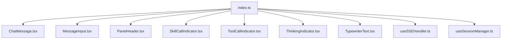
```mermaid
graph TB
index[index.ts]
ChatMessage[ChatMessage.tsx]
MessageInput[MessageInput.tsx]
PanelHeader[PanelHeader.tsx]
SkillCallIndicator[SkillCallIndicator.tsx]
ToolCallIndicator[ToolCallIndicator.tsx]
ThinkingIndicator[ThinkingIndicator.tsx]
TypewriterText[TypewriterText.tsx]
useSSEHandler[useSSEHandler.ts]
useSessionManager[useSessionManager.ts]
index --> ChatMessage
index --> MessageInput
index --> PanelHeader
index --> SkillCallIndicator
index --> ToolCallIndicator
index --> ThinkingIndicator
index --> TypewriterText
index --> useSSEHandler
index --> useSessionManager
```

**图表来源**
- [index.ts:1-22](file://frontend/src/components/ai-assistant/index.ts#L1-L22)

### 组件职责分离

每个组件都有明确的职责范围：

#### ChatMessage组件
- **职责**：渲染单个消息内容
- **输入**：Message对象和加载状态
- **输出**：格式化的消息显示
- **依赖**：Markdown渲染、状态指示器

#### MessageInput组件
- **职责**：处理用户输入和提交
- **输入**：回调函数和状态
- **输出**：标准化的消息内容
- **依赖**：表单验证、键盘事件

#### PanelHeader组件
- **职责**：提供面板头部功能
- **输入**：智能体信息和回调函数
- **输出**：用户交互事件
- **依赖**：下拉菜单、按钮组件

**章节来源**
- [index.ts:1-22](file://frontend/src/components/ai-assistant/index.ts#L1-L22)
- [ChatMessage.tsx:46-50](file://frontend/src/components/ai-assistant/ChatMessage.tsx#L46-L50)
- [MessageInput.tsx:9-15](file://frontend/src/components/ai-assistant/MessageInput.tsx#L9-L15)
- [PanelHeader.tsx:15-24](file://frontend/src/components/ai-assistant/PanelHeader.tsx#L15-L24)

## Hook系统

### Hook设计原则

Hook系统遵循单一职责原则，每个Hook专注于特定功能领域：

#### useSSEHandler Hook
- **专注领域**：SSE事件处理
- **状态管理**：流式处理状态
- **事件解析**：SSE事件格式解析
- **UI更新**：触发状态更新
- **积分同步**：实时更新用户余额

#### useSessionManager Hook
- **专注领域**：会话生命周期管理
- **API交互**：与后端服务通信
- **状态同步**：与全局状态同步
- **错误处理**：统一的错误处理

### Hook组合使用

AI助手面板通过Hook组合实现复杂功能：

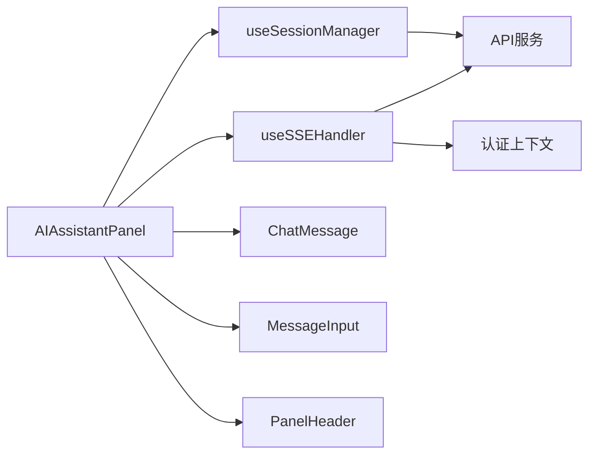
```mermaid
graph LR
AIAssistantPanel[AIAssistantPanel]
useSessionManager[useSessionManager]
useSSEHandler[useSSEHandler]
ChatMessage[ChatMessage]
MessageInput[MessageInput]
PanelHeader[PanelHeader]
AIAssistantPanel --> useSessionManager
AIAssistantPanel --> useSSEHandler
AIAssistantPanel --> ChatMessage
AIAssistantPanel --> MessageInput
AIAssistantPanel --> PanelHeader
useSessionManager --> API[API服务]
useSSEHandler --> API
useSSEHandler --> AuthContext[认证上下文]
```

**图表来源**
- [AIAssistantPanel.tsx:25-39](file://frontend/src/components/canvas/AIAssistantPanel.tsx#L25-L39)

**章节来源**
- [useSSEHandler.ts:23-335](file://frontend/src/components/ai-assistant/hooks/useSSEHandler.ts#L23-L335)
- [useSessionManager.ts:12-179](file://frontend/src/components/ai-assistant/hooks/useSessionManager.ts#L12-L179)

## 多模态内容支持

系统保持了完整的多模态内容支持，包括文本和图像的混合处理：

### 内容类型定义

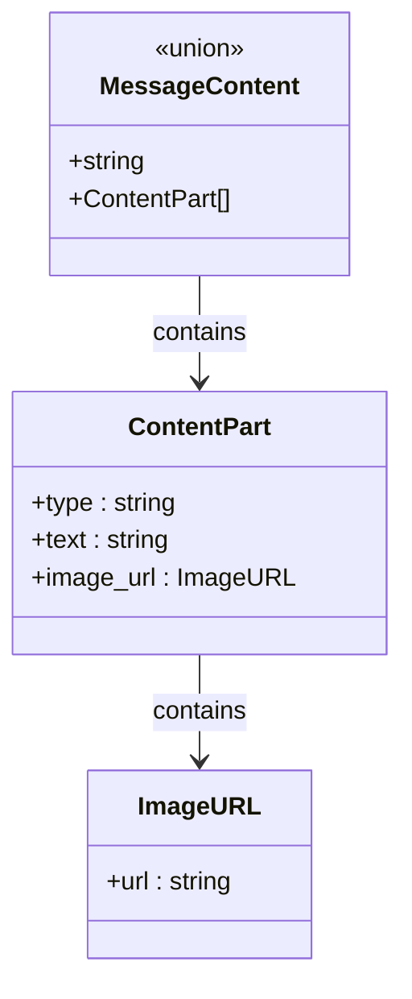
```mermaid
classDiagram
class MessageContent {
<<union>>
+string
+ContentPart[]
}
class ContentPart {
+type : string
+text : string
+image_url : ImageURL
}
class ImageURL {
+url : string
}
MessageContent --> ContentPart : contains
ContentPart --> ImageURL : contains
```

**图表来源**
- [useAIAssistantStore.ts:39-40](file://frontend/src/store/useAIAssistantStore.ts#L39-L40)

### 图像处理机制

系统支持多种图像处理场景：

#### 图像注入流程
1. **图像检测**：从历史消息中查找最后的图像
2. **数据URL转换**：将本地文件转换为data URL格式
3. **内容重构**：将图像和文本组合为多模态内容
4. **Gemini兼容**：确保图像格式符合特定模型要求

#### 图像处理流程

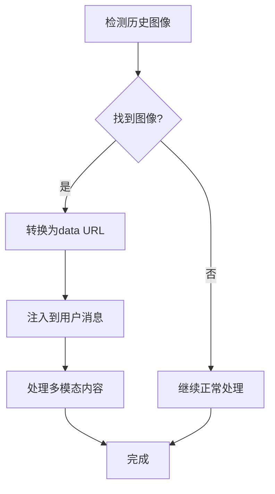
```mermaid
flowchart TD
Detect[检测历史图像] --> Found{找到图像?}
Found --> |是| Convert[转换为data URL]
Found --> |否| Continue[继续正常处理]
Convert --> Inject[注入到用户消息]
Inject --> Process[处理多模态内容]
Process --> Complete[完成]
Continue --> Complete
```

**图表来源**
- [chats.py:460-484](file://backend/routers/chats.py#L460-L484)

**章节来源**
- [chats.py:460-484](file://backend/routers/chats.py#L460-L484)

## SSE事件处理增强

系统实现了增强的SSE事件处理机制，支持详细的事件状态跟踪：

### 事件类型系统

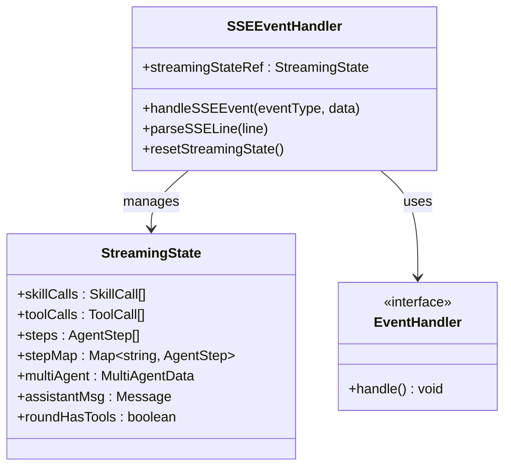
```mermaid
classDiagram
class SSEEventHandler {
+streamingStateRef : StreamingState
+handleSSEEvent(eventType, data)
+parseSSELine(line)
+resetStreamingState()
}
class StreamingState {
+skillCalls : SkillCall[]
+toolCalls : ToolCall[]
+steps : AgentStep[]
+stepMap : Map~string, AgentStep~
+multiAgent : MultiAgentData
+assistantMsg : Message
+roundHasTools : boolean
}
class EventHandler {
<<interface>>
+handle() void
}
SSEEventHandler --> StreamingState : manages
SSEEventHandler --> EventHandler : uses
```

**图表来源**
- [useSSEHandler.ts:23-335](file://frontend/src/components/ai-assistant/hooks/useSSEHandler.ts#L23-L335)

### 事件处理流程

系统支持以下事件类型：

#### 单智能体事件
- **text**：流式文本内容
- **skill_call**：技能调用开始
- **skill_loaded**：技能加载完成
- **tool_call**：工具调用开始
- **tool_result**：工具执行结果

#### 多智能体事件
- **subtask_created**：子任务创建
- **subtask_started**：子任务开始
- **subtask_chunk**：子任务流式内容
- **subtask_completed**：子任务完成
- **subtask_failed**：子任务失败
- **task_completed**：任务完成

#### 系统事件
- **canvas_updated**：画布状态更新
- **done**：流式响应完成
- **error**：错误发生
- **billing**：计费信息更新

**章节来源**
- [useSSEHandler.ts:64-327](file://frontend/src/components/ai-assistant/hooks/useSSEHandler.ts#L64-L327)

## 实时积分余额同步

系统新增了实时积分余额同步功能，通过SSE事件实现实时更新：

### 积分同步机制

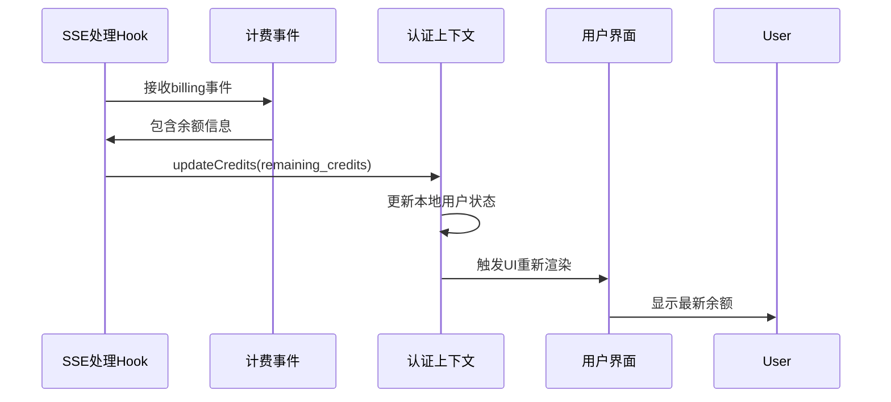
```mermaid
sequenceDiagram
participant SSEHandler as SSE处理Hook
participant BillingEvent as 计费事件
participant AuthContext as 认证上下文
participant UI as 用户界面
SSEHandler->>BillingEvent : 接收billing事件
BillingEvent->>SSEHandler : 包含余额信息
SSEHandler->>AuthContext : updateCredits(remaining_credits)
AuthContext->>AuthContext : 更新本地用户状态
AuthContext->>UI : 触发UI重新渲染
UI->>User : 显示最新余额
```

**图表来源**
- [useSSEHandler.ts:278-298](file://frontend/src/components/ai-assistant/hooks/useSSEHandler.ts#L278-L298)
- [AuthContext.tsx:96-102](file://frontend/src/context/AuthContext.tsx#L96-L102)

### 积分同步特性
- **实时更新**：通过SSE事件实时同步用户余额
- **友好提示**：积分不足时显示友好提醒
- **账户状态**：支持账户冻结状态的同步
- **状态持久化**：本地存储更新后的余额信息

**章节来源**
- [useSSEHandler.ts:278-298](file://frontend/src/components/ai-assistant/hooks/useSSEHandler.ts#L278-L298)
- [AuthContext.tsx:96-102](file://frontend/src/context/AuthContext.tsx#L96-L102)

## 多智能体协作UI

系统新增了专门的多智能体协作UI组件，提供可视化的工作流展示：

### 组件结构

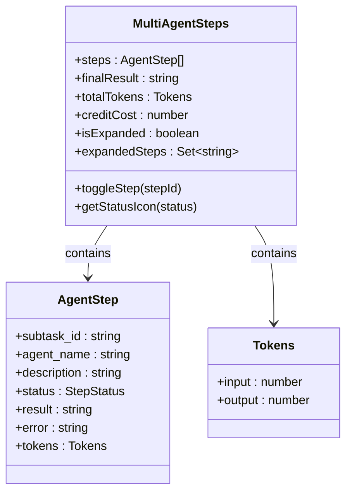
```mermaid
classDiagram
class MultiAgentSteps {
+steps : AgentStep[]
+finalResult : string
+totalTokens : Tokens
+creditCost : number
+isExpanded : boolean
+expandedSteps : Set~string~
+toggleStep(stepId)
+getStatusIcon(status)
}
class AgentStep {
+subtask_id : string
+agent_name : string
+description : string
+status : StepStatus
+result : string
+error : string
+tokens : Tokens
}
class Tokens {
+input : number
+output : number
}
MultiAgentSteps --> AgentStep : contains
MultiAgentSteps --> Tokens : contains
```

**图表来源**
- [MultiAgentSteps.tsx:7-22](file://frontend/src/components/canvas/MultiAgentSteps.tsx#L7-L22)

### 状态管理

组件支持以下状态：

#### 步骤状态
- **pending**：待执行
- **running**：执行中
- **completed**：已完成
- **failed**：执行失败

#### 用户交互
- **展开/收起**：切换详细信息显示
- **步骤详情**：点击查看具体执行结果
- **状态指示**：使用不同图标表示状态

#### 统计信息
- **进度显示**：已完成/总数的百分比
- **Token统计**：输入输出Token使用情况
- **积分消耗**：任务消耗的积分金额

**章节来源**
- [MultiAgentSteps.tsx:28-128](file://frontend/src/components/canvas/MultiAgentSteps.tsx#L28-L128)

## 错误处理改进

系统增强了错误处理机制，提供更好的用户体验：

### HTTP错误处理

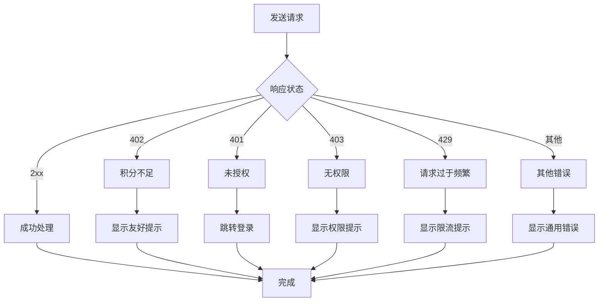
```mermaid
flowchart TD
Request[发送请求] --> Response{响应状态}
Response --> |2xx| Success[成功处理]
Response --> |402| Insufficient[积分不足]
Response --> |401| Unauthorized[未授权]
Response --> |403| Forbidden[无权限]
Response --> |429| TooMany[请求过于频繁]
Response --> |其他| OtherError[其他错误]
Success --> End[完成]
Insufficient --> ShowTip[显示友好提示]
Unauthorized --> ShowLogin[跳转登录]
Forbidden --> ShowAccess[显示权限提示]
TooMany --> ShowRateLimit[显示限流提示]
OtherError --> ShowGeneric[显示通用错误]
ShowTip --> End
ShowLogin --> End
ShowAccess --> End
ShowRateLimit --> End
ShowGeneric --> End
```

**图表来源**
- [AIAssistantPanel.tsx:120-129](file://frontend/src/components/canvas/AIAssistantPanel.tsx#L120-L129)

### 错误处理特性
- **HTTP状态码映射**：402积分不足、401未授权、403无权限、429请求频繁
- **友好提示**：针对不同错误显示相应的用户提示
- **自动恢复**：支持请求取消和重试机制
- **错误日志**：记录详细的错误信息用于调试

**章节来源**
- [AIAssistantPanel.tsx:120-166](file://frontend/src/components/canvas/AIAssistantPanel.tsx#L120-L166)

## 依赖关系分析

系统各组件间的依赖关系更加清晰：

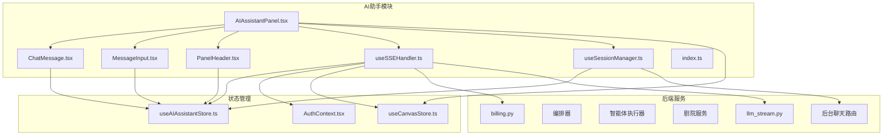
```mermaid
graph TD
subgraph "AI助手模块"
AIAssistantPanel[AIAssistantPanel.tsx]
ChatMessage[ChatMessage.tsx]
MessageInput[MessageInput.tsx]
PanelHeader[PanelHeader.tsx]
useSSEHandler[useSSEHandler.ts]
useSessionManager[useSessionManager.ts]
index[index.ts]
end
subgraph "状态管理"
useAIAssistantStore[useAIAssistantStore.ts]
useCanvasStore[useCanvasStore.ts]
AuthContext[AuthContext.tsx]
end
subgraph "后端服务"
chats[后台聊天路由]
orchestrator[编排器]
agent_executor[智能体执行器]
theater[剧院服务]
billing[billing.py]
llm_stream[llm_stream.py]
end
AIAssistantPanel --> ChatMessage
AIAssistantPanel --> MessageInput
AIAssistantPanel --> PanelHeader
AIAssistantPanel --> useSSEHandler
AIAssistantPanel --> useSessionManager
ChatMessage --> useAIAssistantStore
MessageInput --> useAIAssistantStore
PanelHeader --> useAIAssistantStore
useSSEHandler --> useAIAssistantStore
useSSEHandler --> AuthContext
useSessionManager --> useAIAssistantStore
useSSEHandler --> useCanvasStore
useSessionManager --> chats
AIAssistantPanel --> useCanvasStore
useSSEHandler --> billing
useSSEHandler --> llm_stream
```

**图表来源**
- [AIAssistantPanel.tsx:10-12](file://frontend/src/components/canvas/AIAssistantPanel.tsx#L10-L12)
- [useSSEHandler.ts:4-6](file://frontend/src/components/ai-assistant/hooks/useSSEHandler.ts#L4-L6)

**章节来源**
- [AIAssistantPanel.tsx:1-295](file://frontend/src/components/canvas/AIAssistantPanel.tsx#L1-L295)
- [useSessionManager.ts:3-6](file://frontend/src/components/ai-assistant/hooks/useSessionManager.ts#L3-L6)

## 性能考虑

模块化架构带来了多项性能优化：

### 前端性能优化
- **组件懒加载**：独立组件便于按需加载
- **状态隔离**：Hook提供细粒度的状态管理
- **渲染优化**：组件职责分离减少不必要的重渲染
- **内存管理**：Hook自动管理事件监听器和定时器
- **模块化缓存**：独立组件支持更好的缓存策略
- **事件处理优化**：Hook集中处理事件提高效率
- **SSE连接管理**：优化SSE连接的建立和断开

### Hook性能优化
- **状态引用**：使用useRef避免不必要的状态更新
- **回调优化**：useCallback优化回调函数
- **依赖管理**：精确的依赖数组减少重渲染
- **异步处理**：Hook内部处理异步操作
- **错误边界**：Hook提供统一的错误处理

### 组件性能优化
- **条件渲染**：根据状态决定渲染内容
- **虚拟滚动**：大量消息时的性能优化
- **图片懒加载**：多模态内容的图片优化
- **Markdown渲染**：高效的Markdown处理
- **动画优化**：Framer Motion的性能优化

## 故障排除指南

### 模块化架构常见问题

#### 1. 组件导入错误
**症状**：组件无法正确导入
**可能原因**：
- 导出路径错误
- 组件名称不匹配
- 类型定义缺失

**解决步骤**：
1. 检查index.ts导出路径
2. 验证组件文件名和导出名称
3. 确认类型定义正确
4. 检查模块解析配置

#### 2. Hook状态不同步
**症状**：Hook状态与组件状态不一致
**可能原因**：
- Hook依赖数组错误
- 状态更新时机问题
- 异步操作处理不当

**解决步骤**：
1. 检查Hook的依赖数组
2. 验证状态更新逻辑
3. 确认异步操作的正确处理
4. 查看控制台错误日志

#### 3. SSE事件处理异常
**症状**：SSE事件处理失败
**可能原因**：
- 事件格式错误
- 状态管理问题
- 网络连接中断
- 积分同步失败

**解决步骤**：
1. 检查SSE事件格式
2. 验证状态引用完整性
3. 确认网络连接稳定性
4. 查看事件处理日志
5. 检查AuthContext的updateCredits方法

#### 4. 会话管理问题
**症状**：会话状态管理异常
**可能原因**：
- API调用失败
- 状态同步问题
- 剧院切换逻辑错误

**解决步骤**：
1. 检查API响应状态
2. 验证状态同步逻辑
3. 确认剧院ID匹配
4. 查看会话管理日志

#### 5. 组件渲染问题
**症状**：消息渲染异常
**可能原因**：
- Markdown渲染错误
- 状态传递问题
- 条件渲染逻辑错误

**解决步骤**：
1. 检查Markdown语法
2. 验证状态传递
3. 确认渲染条件
4. 查看组件日志

#### 6. Hook组合使用问题
**症状**：多个Hook组合使用异常
**可能原因**：
- Hook依赖关系错误
- 状态冲突
- 事件处理冲突

**解决步骤**：
1. 检查Hook依赖关系
2. 验证状态隔离
3. 确认事件处理顺序
4. 查看Hook组合日志

#### 7. 积分同步问题
**症状**：积分余额不同步
**可能原因**：
- SSE billing事件未接收到
- AuthContext更新失败
- 本地存储写入失败

**解决步骤**：
1. 检查SSE连接状态
2. 验证billing事件格式
3. 确认AuthContext.updateCredits调用
4. 查看localStorage写入状态
5. 检查浏览器存储权限

**章节来源**
- [index.ts:1-22](file://frontend/src/components/ai-assistant/index.ts#L1-L22)
- [useSSEHandler.ts:38-48](file://frontend/src/components/ai-assistant/hooks/useSSEHandler.ts#L38-L48)
- [useSessionManager.ts:30-46](file://frontend/src/components/ai-assistant/hooks/useSessionManager.ts#L30-L46)

## 结论

AI助手面板增强项目经过重大重构，采用了全新的模块化架构设计，显著提升了代码质量和可维护性。通过拆分AI助手面板为专用组件和Hook系统，项目实现了更好的关注点分离和职责划分。

### 主要成就
- **模块化架构**：ChatMessage、MessageInput、PanelHeader等专用组件
- **Hook系统**：useSSEHandler和useSessionManager实现关注点分离
- **增强的可维护性**：清晰的组件职责划分
- **改进的可测试性**：独立组件便于单元测试
- **更好的扩展性**：Hook系统支持自定义扩展
- **统一的导出接口**：通过index.ts提供统一访问
- **实时积分同步**：通过SSE事件实现实时余额更新
- **多智能体协作**：增强的多智能体工作流支持
- **改进的错误处理**：更好的用户体验和故障恢复

### 技术亮点
- **组件职责分离**：每个组件专注于特定功能
- **Hook设计模式**：提供可复用的功能封装
- **状态管理优化**：细粒度的状态控制
- **事件处理增强**：完整的SSE事件处理机制
- **模块化设计**：便于维护和扩展
- **类型安全**：完整的TypeScript类型定义
- **实时通信**：SSE事件实现双向通信
- **用户体验**：友好的错误提示和状态反馈

### 未来发展方向
- **组件库扩展**：支持更多专用组件
- **Hook生态**：构建更多的功能Hook
- **性能优化**：进一步优化渲染性能
- **测试覆盖**：增加单元测试覆盖率
- **文档完善**：提供更详细的开发文档
- **社区贡献**：支持第三方组件贡献
- **监控集成**：添加性能监控和错误追踪
- **国际化支持**：扩展多语言支持

这次重构为AI助手系统奠定了坚实的技术基础，展示了现代前端开发的最佳实践，为未来的功能扩展和技术演进提供了良好的架构支撑。