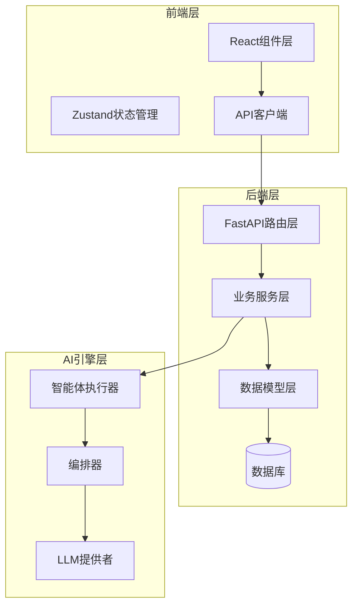
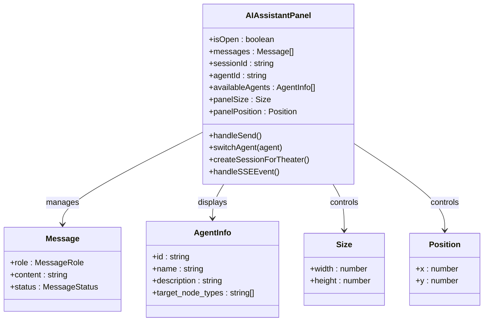
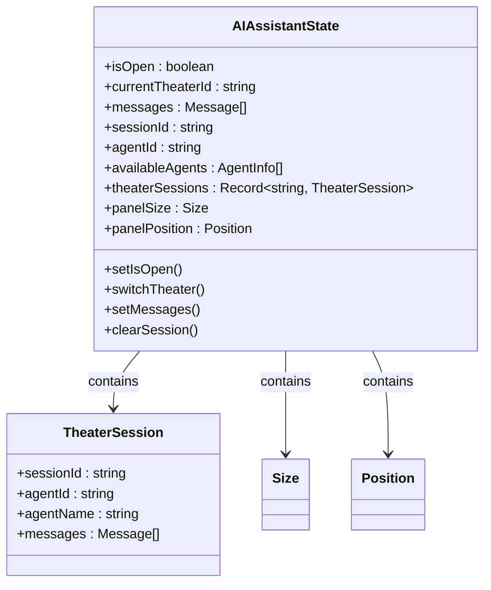
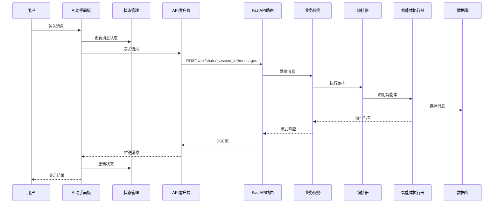
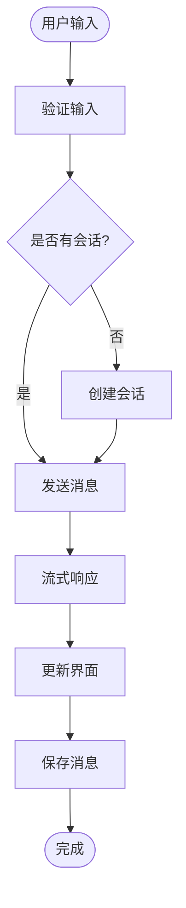
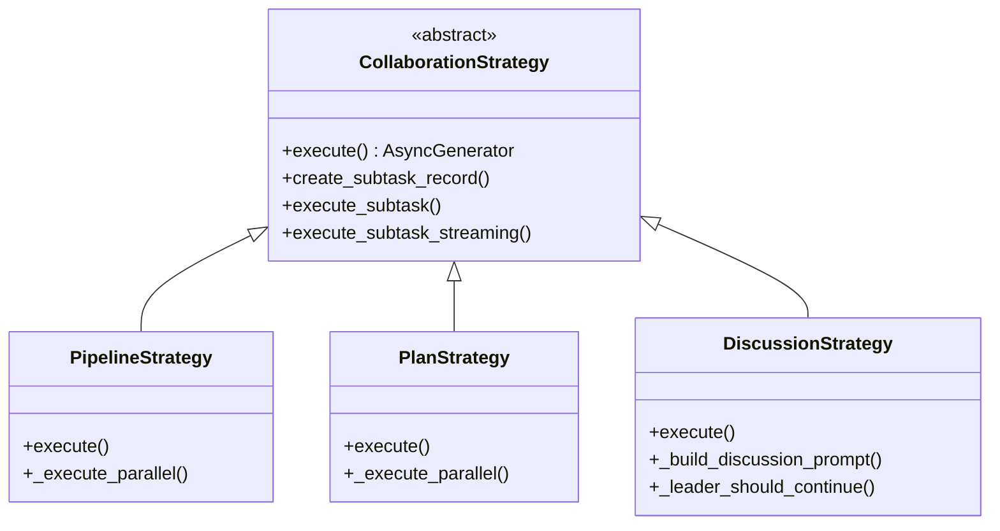
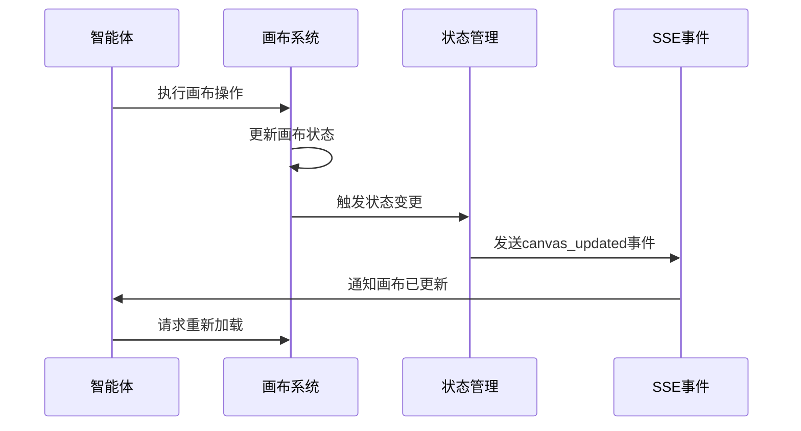

# AI助手面板增强

<cite>
**本文档引用的文件**
- [AIAssistantPanel.tsx](file://frontend/src/components/canvas/AIAssistantPanel.tsx)
- [useAIAssistantStore.ts](file://frontend/src/store/useAIAssistantStore.ts)
- [useCanvasStore.ts](file://frontend/src/store/useCanvasStore.ts)
- [api.ts](file://frontend/src/lib/api.ts)
- [chats.py](file://backend/routers/chats.py)
- [orchestrator.py](file://backend/services/orchestrator.py)
- [agent_executor.py](file://backend/services/agent_executor.py)
- [models.py](file://backend/models.py)
- [schemas.py](file://backend/schemas.py)
- [main.py](file://backend/main.py)
- [page.tsx](file://backend/admin/src/app/admin/agents/[id]/page.tsx)
</cite>

## 目录
1. [简介](#简介)
2. [项目结构](#项目结构)
3. [核心组件](#核心组件)
4. [架构概览](#架构概览)
5. [详细组件分析](#详细组件分析)
6. [依赖关系分析](#依赖关系分析)
7. [性能考虑](#性能考虑)
8. [故障排除指南](#故障排除指南)
9. [结论](#结论)

## 简介

AI助手面板增强是一个集成了智能对话、多智能体协作和画布集成的综合性AI创作平台。该项目通过一个可拖拽、可调整大小的AI助手面板，为用户提供实时的AI对话体验，同时支持多智能体协作、画布节点操作和实时流式响应。

该系统的核心特色包括：
- **实时AI对话**：支持流式响应和多轮对话
- **多智能体协作**：支持管道、计划和讨论三种协作策略
- **画布集成**：AI助手可以直接操作和编辑画布节点
- **智能体切换**：支持动态切换不同的AI智能体
- **会话管理**：完整的对话历史管理和持久化

## 项目结构

项目采用前后端分离的架构设计，主要分为以下层次：



**图表来源**
- [main.py:110-152](file://backend/main.py#L110-L152)
- [AIAssistantPanel.tsx:16-573](file://frontend/src/components/canvas/AIAssistantPanel.tsx#L16-L573)

**章节来源**
- [main.py:1-174](file://backend/main.py#L1-174)
- [models.py:1-200](file://backend/models.py#L1-L200)

## 核心组件

### AI助手面板组件

AI助手面板是整个系统的核心交互界面，提供了完整的AI对话体验：



**图表来源**
- [AIAssistantPanel.tsx:16-573](file://frontend/src/components/canvas/AIAssistantPanel.tsx#L16-L573)
- [useAIAssistantStore.ts:7-210](file://frontend/src/store/useAIAssistantStore.ts#L7-L210)

### 状态管理系统

系统采用Zustand进行状态管理，实现了跨组件的状态共享和持久化：



**图表来源**
- [useAIAssistantStore.ts:28-210](file://frontend/src/store/useAIAssistantStore.ts#L28-L210)

**章节来源**
- [AIAssistantPanel.tsx:16-573](file://frontend/src/components/canvas/AIAssistantPanel.tsx#L16-L573)
- [useAIAssistantStore.ts:1-210](file://frontend/src/store/useAIAssistantStore.ts#L1-L210)

## 架构概览

系统采用分层架构设计，实现了清晰的关注点分离：



**图表来源**
- [AIAssistantPanel.tsx:253-331](file://frontend/src/components/canvas/AIAssistantPanel.tsx#L253-L331)
- [chats.py:189-238](file://backend/routers/chats.py#L189-L238)

**章节来源**
- [chats.py:1-733](file://backend/routers/chats.py#L1-L733)
- [orchestrator.py:560-672](file://backend/services/orchestrator.py#L560-L672)

## 详细组件分析

### AI助手面板组件

AI助手面板是一个高度交互的组件，提供了丰富的功能特性：

#### 组件特性
- **可拖拽布局**：支持拖拽改变位置和大小
- **多智能体支持**：动态切换不同AI智能体
- **实时流式响应**：支持SSE流式传输
- **画布集成**：与画布系统深度集成
- **会话管理**：完整的对话历史管理

#### 核心功能实现



**图表来源**
- [AIAssistantPanel.tsx:253-331](file://frontend/src/components/canvas/AIAssistantPanel.tsx#L253-L331)

**章节来源**
- [AIAssistantPanel.tsx:16-573](file://frontend/src/components/canvas/AIAssistantPanel.tsx#L16-L573)

### 多智能体编排系统

系统支持三种不同的智能体协作策略：

#### 策略类型
1. **管道策略**：顺序或并行的任务执行
2. **计划策略**：基于依赖关系的任务规划
3. **讨论策略**：多智能体间的讨论协作

#### 执行流程



**图表来源**
- [orchestrator.py:82-530](file://backend/services/orchestrator.py#L82-L530)

**章节来源**
- [orchestrator.py:1-800](file://backend/services/orchestrator.py#L1-L800)

### 画布集成机制

AI助手与画布系统的集成提供了强大的创作能力：

#### 画布工具支持
- **节点创建**：智能体可以直接创建新的画布节点
- **节点编辑**：支持编辑现有节点内容
- **节点删除**：可以删除不需要的节点
- **节点连接**：自动建立节点间的连接关系

#### 事件同步



**图表来源**
- [chats.py:590-594](file://backend/routers/chats.py#L590-L594)
- [AIAssistantPanel.tsx:229-234](file://frontend/src/components/canvas/AIAssistantPanel.tsx#L229-L234)

**章节来源**
- [chats.py:325-417](file://backend/routers/chats.py#L325-L417)
- [useCanvasStore.ts:185-462](file://frontend/src/store/useCanvasStore.ts#L185-L462)

## 依赖关系分析

系统各组件间的依赖关系清晰明确：

```mermaid
graph TD
subgraph "前端依赖"
A[AIAssistantPanel.tsx] --> B[useAIAssistantStore.ts]
A --> C[useCanvasStore.ts]
A --> D[api.ts]
B --> E[Zustand]
C --> F[@xyflow/react]
D --> G[Axios]
end
subgraph "后端依赖"
H[chats.py] --> I[FastAPI]
H --> J[SQLAlchemy]
K[orchestrator.py] --> L[agentscope]
M[agent_executor.py] --> N[DialogAgent]
O[models.py] --> P[SQLAlchemy ORM]
end
subgraph "AI引擎依赖"
Q[LLM提供者] --> R[OpenAI]
Q --> S[Anthropic]
Q --> T[Gemini]
Q --> U[DashScope]
end
A --> H
H --> K
K --> M
M --> Q
```

**图表来源**
- [main.py:41-152](file://backend/main.py#L41-L152)
- [AIAssistantPanel.tsx:1-15](file://frontend/src/components/canvas/AIAssistantPanel.tsx#L1-L15)

**章节来源**
- [main.py:1-174](file://backend/main.py#L1-L174)
- [models.py:1-200](file://backend/models.py#L1-L200)

## 性能考虑

系统在设计时充分考虑了性能优化：

### 前端性能优化
- **状态持久化**：使用localStorage减少重新加载时间
- **组件懒加载**：动态导入大型组件
- **内存管理**：及时清理事件监听器和定时器
- **渲染优化**：使用React.memo和useCallback优化重渲染

### 后端性能优化
- **异步处理**：全面使用async/await减少阻塞
- **连接池**：数据库连接池管理
- **缓存策略**：智能体和模型实例缓存
- **流式响应**：SSE流式传输减少延迟

### 数据库优化
- **索引优化**：关键字段建立索引
- **查询优化**：批量操作和预加载
- **事务管理**：原子性操作保证数据一致性

## 故障排除指南

### 常见问题及解决方案

#### 1. AI助手无法启动
**症状**：点击AI按钮无反应
**可能原因**：
- WebSocket连接失败
- API端点不可用
- 认证令牌过期

**解决步骤**：
1. 检查网络连接
2. 验证API服务状态
3. 清除浏览器缓存和令牌
4. 重启应用

#### 2. 会话消息丢失
**症状**：刷新页面后对话历史消失
**可能原因**：
- localStorage访问权限问题
- 浏览器隐私设置
- 存储空间不足

**解决步骤**：
1. 检查浏览器localStorage状态
2. 关闭隐私模式重试
3. 清理浏览器缓存
4. 确认有足够的存储空间

#### 3. 多智能体协作失败
**症状**：智能体间通信异常
**可能原因**：
- 智能体配置错误
- LLM提供者连接问题
- 数据库连接异常

**解决步骤**：
1. 验证智能体配置
2. 检查LLM提供者设置
3. 查看数据库连接状态
4. 检查网络连接

#### 4. 画布集成问题
**症状**：AI助手无法操作画布
**可能原因**：
- 权限不足
- 画布节点类型不匹配
- 代理工具配置错误

**解决步骤**：
1. 检查智能体的target_node_types配置
2. 验证画布节点权限
3. 确认代理工具可用性
4. 查看代理工具日志

**章节来源**
- [AIAssistantPanel.tsx:54-62](file://frontend/src/components/canvas/AIAssistantPanel.tsx#L54-L62)
- [chats.py:223-226](file://backend/routers/chats.py#L223-L226)

## 结论

AI助手面板增强项目展现了现代全栈应用的最佳实践，通过精心设计的架构和丰富的功能特性，为用户提供了强大的AI创作体验。

### 主要成就
- **完整的AI对话系统**：支持实时流式响应和多轮对话
- **灵活的多智能体协作**：三种不同的协作策略满足不同场景需求
- **深度的画布集成**：AI助手可以直接操作和编辑画布内容
- **优秀的用户体验**：直观的界面设计和流畅的交互体验
- **可靠的系统架构**：清晰的分层设计和完善的错误处理机制

### 技术亮点
- **前后端分离架构**：现代化的技术栈和清晰的职责划分
- **状态管理优化**：Zustand提供了轻量级但功能强大的状态管理
- **流式数据处理**：SSE技术实现实时数据传输
- **智能体系统**：灵活的多智能体协作框架
- **画布集成**：创新的AI与可视化工具结合

### 未来发展方向
- **性能进一步优化**：考虑引入Web Workers处理复杂计算
- **AI能力扩展**：支持更多类型的AI模型和工具
- **协作功能增强**：添加更多协作模式和权限管理
- **移动端适配**：优化移动设备上的使用体验
- **插件生态**：构建开放的插件系统支持第三方扩展

该项目为AI创作工具的发展提供了宝贵的参考，展示了如何将复杂的AI技术与用户友好的界面设计相结合，创造出真正有价值的应用程序。