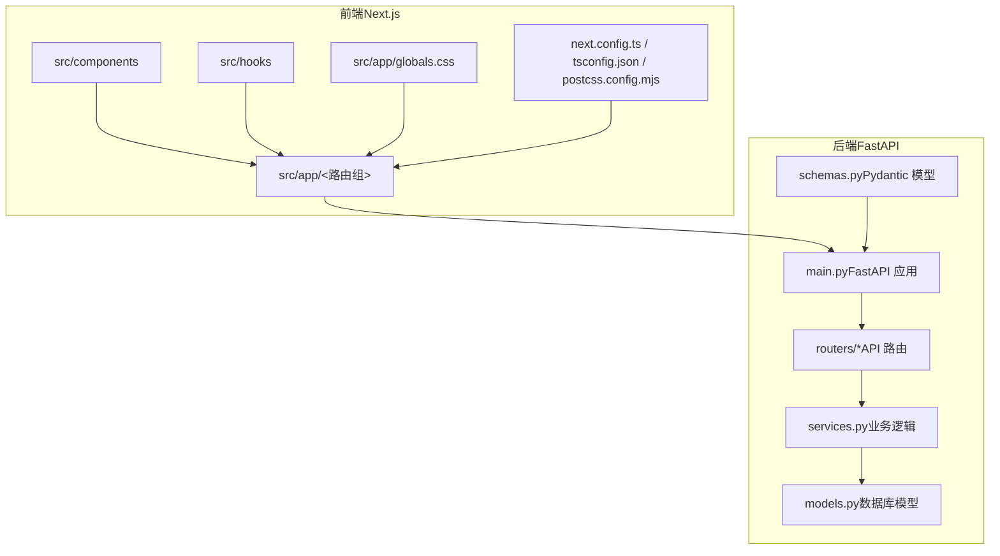
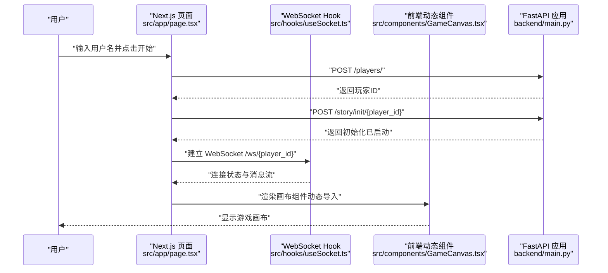
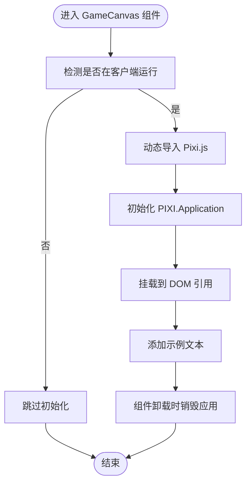
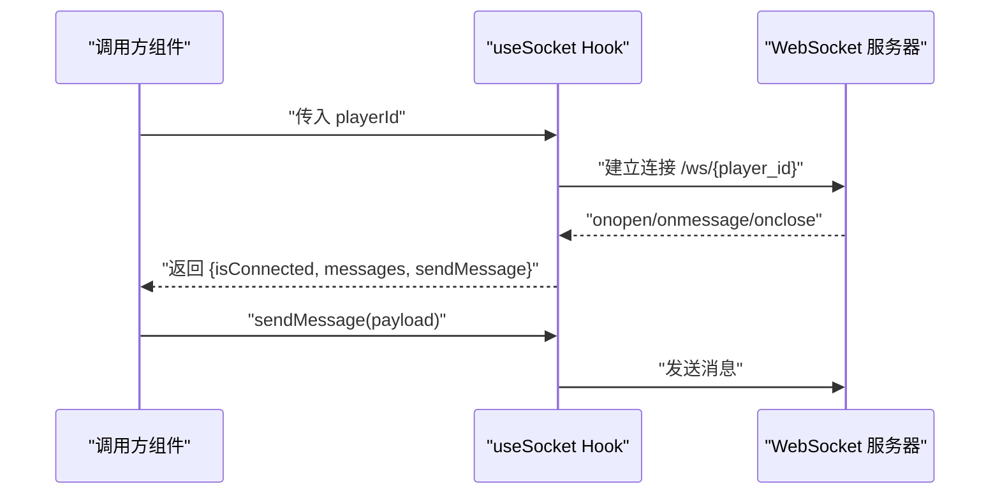
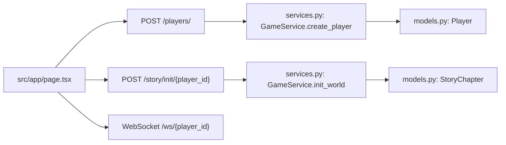
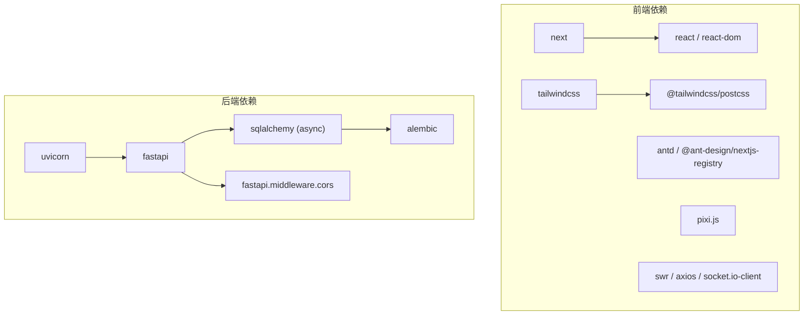

# Next.js 应用架构

<cite>
**本文引用的文件**
- [frontend/next.config.ts](file://frontend/next.config.ts)
- [frontend/src/app/layout.tsx](file://frontend/src/app/layout.tsx)
- [frontend/src/app/page.tsx](file://frontend/src/app/page.tsx)
- [frontend/src/components/GameCanvas.tsx](file://frontend/src/components/GameCanvas.tsx)
- [frontend/src/hooks/useSocket.ts](file://frontend/src/hooks/useSocket.ts)
- [frontend/src/app/globals.css](file://frontend/src/app/globals.css)
- [frontend/package.json](file://frontend/package.json)
- [frontend/postcss.config.mjs](file://frontend/postcss.config.mjs)
- [frontend/tsconfig.json](file://frontend/tsconfig.json)
- [backend/main.py](file://backend/main.py)
- [backend/routers/agents.py](file://backend/routers/agents.py)
- [backend/models.py](file://backend/models.py)
- [backend/services.py](file://backend/services.py)
- [backend/schemas.py](file://backend/schemas.py)
</cite>

## 目录
1. [简介](#简介)
2. [项目结构](#项目结构)
3. [核心组件](#核心组件)
4. [架构总览](#架构总览)
5. [详细组件分析](#详细组件分析)
6. [依赖关系分析](#依赖关系分析)
7. [性能考量](#性能考量)
8. [故障排查指南](#故障排查指南)
9. [结论](#结论)
10. [附录](#附录)

## 简介
本技术文档面向一个基于 Next.js 的叙事驱动型游戏前端与 FastAPI 后端的全栈项目，系统性梳理了以下主题：App Router 目录结构与页面组件设计模式、服务端渲染（SSR）与静态生成（SSG）策略、动态导入（dynamic imports）的使用场景与性能优化、全局样式配置与 Tailwind CSS 集成、中间件与 API 路由设计、数据获取模式、构建优化与代码分割、错误边界与容错机制、SEO 优化与 PWA 支持建议等。文档在保证技术深度的同时，力求对非专业读者也具备可读性。

## 项目结构
该项目采用前后端分离的双仓库结构：
- 前端（Next.js 16）位于 frontend/，采用 App Router 目录结构，使用 TypeScript、Tailwind CSS v4、PostCSS 与 Next.js 构建工具链。
- 后端（FastAPI）位于 backend/，提供 REST 与 WebSocket 接口，负责玩家管理、故事章节生成与实时通信。

图表来源
- [frontend/src/app/layout.tsx](file://frontend/src/app/layout.tsx#L1-L35)
- [frontend/src/app/page.tsx](file://frontend/src/app/page.tsx#L1-L85)
- [backend/main.py](file://backend/main.py#L83-L173)

章节来源
- [frontend/next.config.ts](file://frontend/next.config.ts#L1-L8)
- [frontend/tsconfig.json](file://frontend/tsconfig.json#L1-L35)
- [frontend/postcss.config.mjs](file://frontend/postcss.config.mjs#L1-L8)
- [frontend/src/app/layout.tsx](file://frontend/src/app/layout.tsx#L1-L35)
- [frontend/src/app/page.tsx](file://frontend/src/app/page.tsx#L1-L85)
- [backend/main.py](file://backend/main.py#L83-L173)

## 核心组件
- App Router 页面与布局
  - 根布局负责注入全局字体与元数据，根页面承载客户端交互与动态导入的 Canvas 组件。
- 动态导入与客户端渲染
  - 使用 Next.js 动态导入避免 SSR 渲染对浏览器特有 API 的依赖；同时通过客户端标记确保仅在客户端执行。
- WebSocket 客户端钩子
  - 封装 WebSocket 连接状态、消息收发与清理逻辑，便于页面组件复用。
- 全局样式与 Tailwind 集成
  - 在全局样式中引入 Tailwind，并通过 CSS 变量与字体变量统一主题与排版。
- 类型与构建配置
  - TypeScript 配置启用路径别名与严格模式；PostCSS 集成 Tailwind 插件；Next.js 配置留空以便后续扩展。

章节来源
- [frontend/src/app/layout.tsx](file://frontend/src/app/layout.tsx#L1-L35)
- [frontend/src/app/page.tsx](file://frontend/src/app/page.tsx#L1-L85)
- [frontend/src/components/GameCanvas.tsx](file://frontend/src/components/GameCanvas.tsx#L1-L50)
- [frontend/src/hooks/useSocket.ts](file://frontend/src/hooks/useSocket.ts#L1-L43)
- [frontend/src/app/globals.css](file://frontend/src/app/globals.css#L1-L27)
- [frontend/package.json](file://frontend/package.json#L1-L35)
- [frontend/postcss.config.mjs](file://frontend/postcss.config.mjs#L1-L8)
- [frontend/tsconfig.json](file://frontend/tsconfig.json#L1-L35)
- [frontend/next.config.ts](file://frontend/next.config.ts#L1-L8)

## 架构总览
下图展示了前端页面到后端 API 的典型请求流程，包括玩家创建、故事初始化与 WebSocket 实时通信。

图表来源
- [frontend/src/app/page.tsx](file://frontend/src/app/page.tsx#L14-L35)
- [frontend/src/hooks/useSocket.ts](file://frontend/src/hooks/useSocket.ts#L3-L33)
- [frontend/src/components/GameCanvas.tsx](file://frontend/src/components/GameCanvas.tsx#L14-L37)
- [backend/main.py](file://backend/main.py#L138-L156)
- [backend/main.py](file://backend/main.py#L157-L169)

## 详细组件分析

### App Router 页面与布局
- 根布局负责：
  - 注入 Google Fonts（Geist Sans/Mono），并通过 CSS 变量暴露字体族。
  - 提供默认元数据（标题、描述）。
  - 包裹子树，确保字体与主题在整站生效。
- 根页面：
  - 使用客户端标记，启用状态与副作用。
  - 通过动态导入屏蔽 SSR 的浏览器依赖，渲染游戏画布。
  - 通过自定义 Hook 管理 WebSocket 连接与消息展示。
  - 与后端交互完成玩家创建与故事初始化。

章节来源
- [frontend/src/app/layout.tsx](file://frontend/src/app/layout.tsx#L1-L35)
- [frontend/src/app/page.tsx](file://frontend/src/app/page.tsx#L1-L85)

### 动态导入与客户端渲染（GameCanvas）
- 设计要点：
  - 使用 Next.js 动态导入禁用 SSR，确保仅在客户端执行。
  - 在组件内部异步加载 Pixi.js 并初始化 Application，随后挂载到 DOM。
  - 在卸载时销毁实例，避免内存泄漏。
- 性能优化建议：
  - 将大型库拆分为独立 chunk，结合懒加载减少首屏体积。
  - 对于频繁切换的视图，可考虑预取与缓存策略。

图表来源
- [frontend/src/components/GameCanvas.tsx](file://frontend/src/components/GameCanvas.tsx#L14-L44)

章节来源
- [frontend/src/components/GameCanvas.tsx](file://frontend/src/components/GameCanvas.tsx#L1-L50)

### WebSocket 客户端钩子（useSocket）
- 功能概述：
  - 基于 playerId 建立 WebSocket 连接，维护连接状态与消息队列。
  - 提供发送消息方法，支持清理资源。
- 错误处理：
  - 连接失败或异常断开时更新状态，调用方可据此提示用户。

图表来源
- [frontend/src/hooks/useSocket.ts](file://frontend/src/hooks/useSocket.ts#L3-L33)
- [backend/main.py](file://backend/main.py#L157-L169)

章节来源
- [frontend/src/hooks/useSocket.ts](file://frontend/src/hooks/useSocket.ts#L1-L43)
- [backend/main.py](file://backend/main.py#L157-L169)

### 全局样式、字体与 Tailwind 集成
- 全局样式：
  - 引入 Tailwind CSS，使用 @theme inline 定义颜色与字体变量，适配明暗模式。
  - 通过 CSS 变量与字体变量统一站点风格。
- 构建配置：
  - PostCSS 集成 Tailwind 插件，TypeScript 配置启用严格模式与路径别名，Next.js 配置留空以便扩展。

章节来源
- [frontend/src/app/globals.css](file://frontend/src/app/globals.css#L1-L27)
- [frontend/postcss.config.mjs](file://frontend/postcss.config.mjs#L1-L8)
- [frontend/tsconfig.json](file://frontend/tsconfig.json#L1-L35)
- [frontend/next.config.ts](file://frontend/next.config.ts#L1-L8)

### 中间件、API 路由与数据获取模式
- 中间件：
  - 当前未发现显式中间件文件；如需跨域、认证或日志，可在入口处集中配置。
- API 路由：
  - 根路由返回欢迎信息。
  - 玩家创建与故事初始化接口，均通过 FastAPI 路由器注册。
  - WebSocket 接口用于实时通信。
- 数据获取模式：
  - 前端通过标准 fetch 发起请求；WebSocket 用于事件驱动的数据流。
  - 后端服务层封装业务逻辑，模型与 Pydantic Schema 负责数据校验与序列化。

图表来源
- [frontend/src/app/page.tsx](file://frontend/src/app/page.tsx#L18-L31)
- [backend/main.py](file://backend/main.py#L128-L156)
- [backend/main.py](file://backend/main.py#L157-L169)
- [backend/services.py](file://backend/services.py#L8-L17)
- [backend/services.py](file://backend/services.py#L19-L58)
- [backend/models.py](file://backend/models.py#L9-L23)
- [backend/models.py](file://backend/models.py#L24-L44)

章节来源
- [backend/main.py](file://backend/main.py#L83-L173)
- [backend/routers/agents.py](file://backend/routers/agents.py#L1-L141)
- [backend/services.py](file://backend/services.py#L1-L66)
- [backend/models.py](file://backend/models.py#L1-L122)
- [backend/schemas.py](file://backend/schemas.py#L1-L102)

## 依赖关系分析
- 前端依赖
  - Next.js 16、React 19、Tailwind CSS v4、Ant Design Next.js Registry、Pixi.js、SWR、Axios、Socket.IO 客户端等。
- 后端依赖
  - FastAPI、SQLAlchemy（异步）、Uvicorn、Alembic（迁移）、CORS 中间件等。
- 数据模型与路由
  - 后端通过 Pydantic 模型进行请求/响应校验，路由层负责参数解析与业务调度，服务层封装领域逻辑，模型层映射数据库表结构。

图表来源
- [frontend/package.json](file://frontend/package.json#L11-L32)
- [backend/main.py](file://backend/main.py#L30-L91)

章节来源
- [frontend/package.json](file://frontend/package.json#L1-L35)
- [backend/main.py](file://backend/main.py#L30-L91)

## 性能考量
- 代码分割与懒加载
  - 利用 Next.js 动态导入将大型库（如 Pixi.js）按需加载，降低首屏包体。
  - 对于非关键路径的页面或组件，可进一步拆分路由层级，配合 App Router 的并行数据获取能力提升体验。
- 构建优化
  - 使用严格 TypeScript 配置与增量编译，减少类型检查成本。
  - Tailwind CSS v4 与 PostCSS 配合，确保仅产出所需样式，避免无用类导致的体积膨胀。
- 数据获取与缓存
  - 对于只读列表或静态内容，可考虑使用 SSG 或增量静态再生（ISR）策略（需在 Next.js 中配置）。
  - 对于实时数据，优先使用 WebSocket 或长轮询，结合前端缓存策略（如 SWR）提升交互流畅度。
- 图像与媒体
  - 使用 Next.js 内置图像优化与懒加载，减少带宽占用与阻塞时间。

## 故障排查指南
- WebSocket 连接失败
  - 检查后端 CORS 配置与端口可达性；确认前端传入的 playerId 正确。
  - 查看浏览器网络面板与后端日志，定位握手阶段错误。
- 动态导入报错
  - 确认动态导入语法正确且 SSR 已被禁用；检查打包产物中对应 chunk 是否生成。
- Tailwind 样式不生效
  - 确认 PostCSS 插件已正确安装与配置；检查全局样式文件是否被正确引入。
- 数据模型与路由
  - 若出现 404 或 422，检查路由前缀与参数类型；核对 Pydantic Schema 字段约束。

章节来源
- [frontend/src/hooks/useSocket.ts](file://frontend/src/hooks/useSocket.ts#L3-L33)
- [frontend/src/components/GameCanvas.tsx](file://frontend/src/components/GameCanvas.tsx#L14-L37)
- [frontend/src/app/globals.css](file://frontend/src/app/globals.css#L1-L27)
- [backend/main.py](file://backend/main.py#L85-L91)
- [backend/schemas.py](file://backend/schemas.py#L1-L102)

## 结论
本项目在前端采用 Next.js App Router 与现代构建工具链，在后端采用 FastAPI 提供高性能 API 与 WebSocket 能力。通过动态导入与懒加载策略有效控制首屏体积，结合 Tailwind CSS 与全局样式实现一致的主题体验。建议后续在 Next.js 中完善 SSG/ISR、错误边界与 SEO 元数据配置，并在后端补充中间件与更完善的错误处理与审计日志，以进一步提升稳定性与可维护性。

## 附录
- SEO 优化建议
  - 在根布局中完善元数据（标题、描述、关键词、Open Graph、Twitter Card），并为不同页面设置差异化描述。
  - 对于可预渲染的内容，考虑使用 SSG 或 ISR 生成静态页面，提高搜索引擎抓取效率。
- PWA 支持建议
  - 添加 Web App Manifest 与 Service Worker，实现离线访问与安装提示；结合缓存策略与预缓存清单提升离线体验。
- 中间件与安全
  - 在后端增加 CORS、速率限制、认证与授权中间件；在前端对敏感数据进行最小化暴露与本地存储加密。