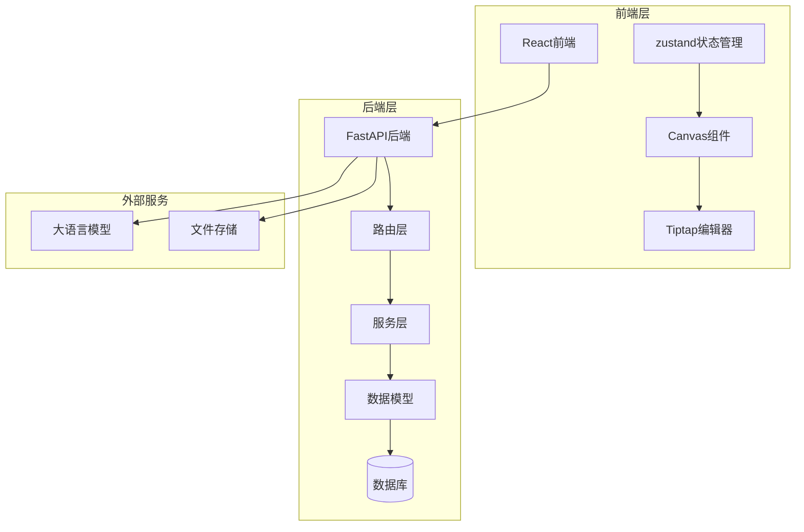
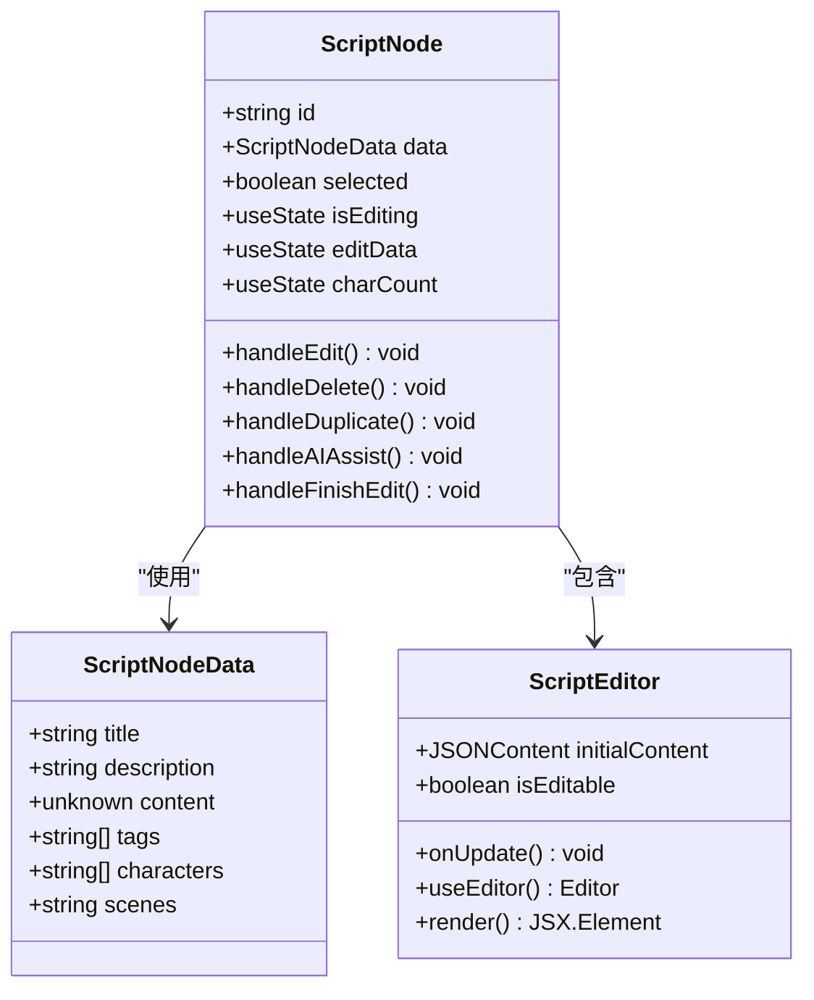
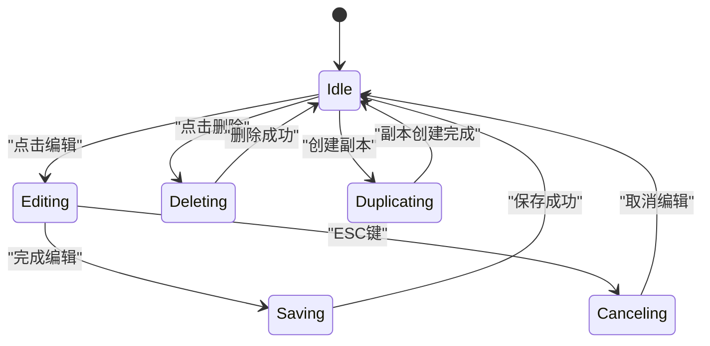
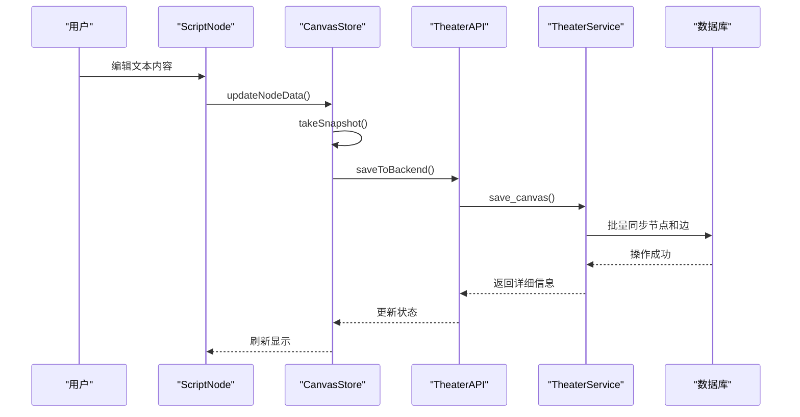
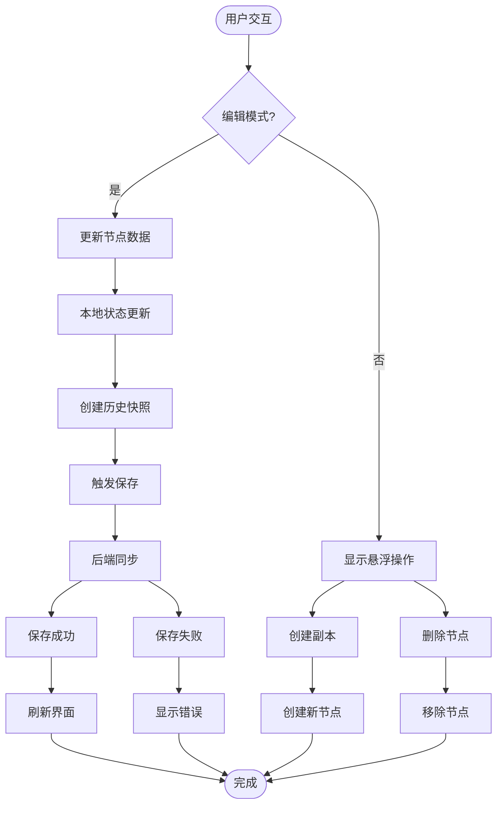
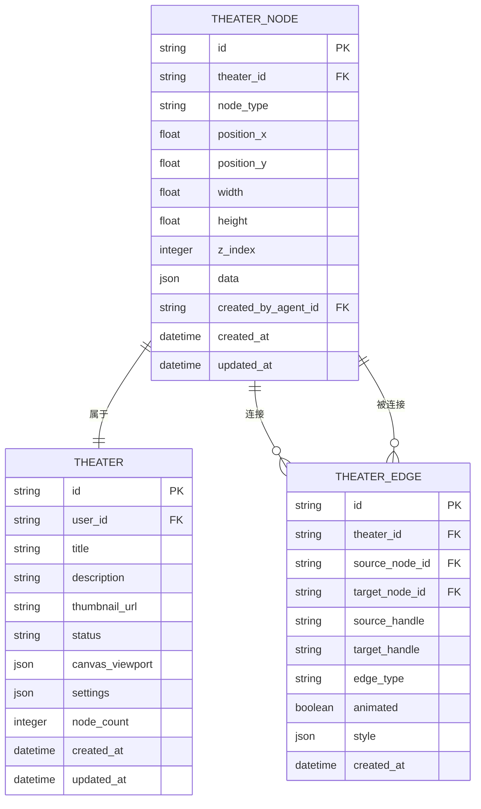
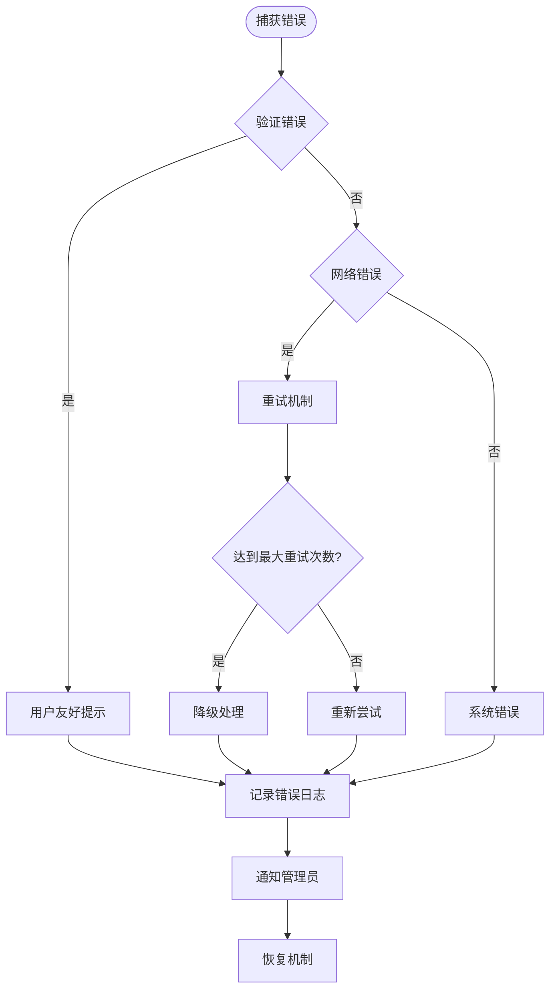
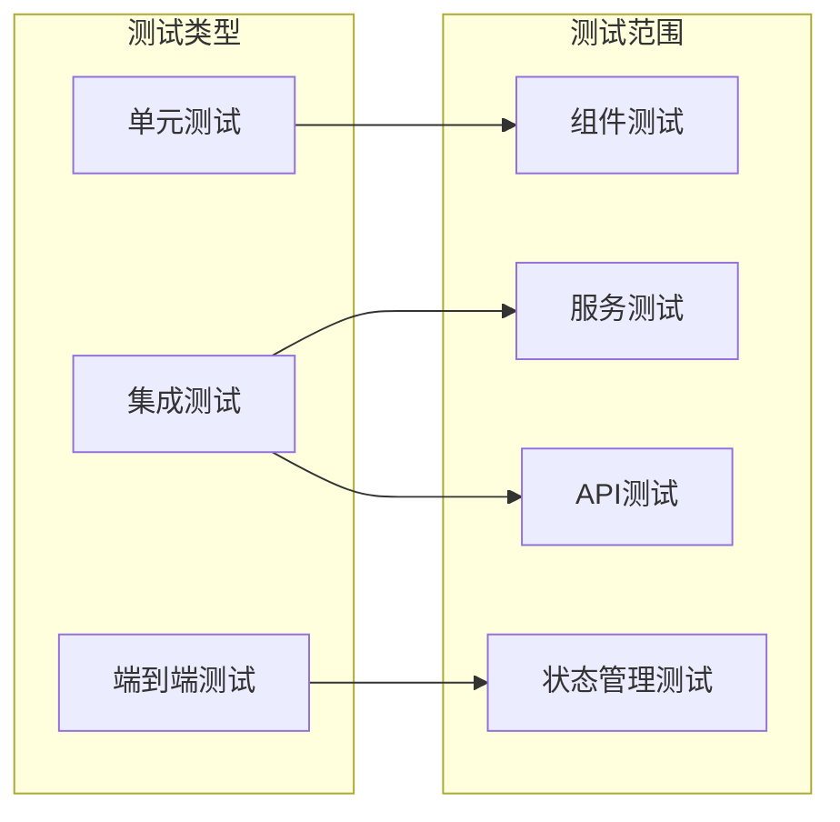

# ScriptCard重构文档

<cite>
**本文档引用的文件**
- [main.py](file://backend/main.py)
- [models.py](file://backend/models.py)
- [theaters.py](file://backend/routers/theaters.py)
- [theater.py](file://backend/services/theater.py)
- [schemas.py](file://backend/schemas.py)
- [ScriptNode.tsx](file://frontend/src/components/canvas/ScriptNode.tsx)
- [ScriptEditor.tsx](file://frontend/src/components/canvas/ScriptEditor.tsx)
- [useCanvasStore.ts](file://frontend/src/store/useCanvasStore.ts)
- [theaterApi.ts](file://frontend/src/lib/theaterApi.ts)
- [script-editor.scss](file://frontend/src/components/canvas/script-editor.scss)
- [ScriptNode.test.tsx](file://frontend/src/components/canvas/__tests__/ScriptNode.test.tsx)
- [ScriptEditor.test.tsx](file://frontend/src/components/canvas/__tests__/ScriptEditor.test.tsx)
</cite>

## 目录
1. [项目概述](#项目概述)
2. [项目架构](#项目架构)
3. [核心组件分析](#核心组件分析)
4. [数据流分析](#数据流分析)
5. [重构策略](#重构策略)
6. [性能优化](#性能优化)
7. [测试覆盖](#测试覆盖)
8. [部署考虑](#部署考虑)
9. [总结](#总结)

## 项目概述

ScriptCard重构项目旨在改进无限叙事剧院系统中的文本卡片组件，提供更好的用户体验和更高效的数据管理。该项目采用前后端分离架构，后端基于FastAPI，前端基于React和Tiptap富文本编辑器。

### 主要目标
- 重构ScriptNode组件以提升用户体验
- 优化数据持久化机制
- 改进实时协作功能
- 增强错误处理和边界情况管理
- 提供完整的测试覆盖

## 项目架构

**图表来源**
- [main.py:110-174](file://backend/main.py#L110-L174)
- [models.py:1-440](file://backend/models.py#L1-L440)

## 核心组件分析

### ScriptNode组件重构

ScriptNode是画布系统的核心组件，负责渲染和管理文本卡片节点。

**图表来源**
- [ScriptNode.tsx:11-341](file://frontend/src/components/canvas/ScriptNode.tsx#L11-L341)
- [ScriptEditor.tsx:40-175](file://frontend/src/components/canvas/ScriptEditor.tsx#L40-L175)

### 状态管理系统

**图表来源**
- [useCanvasStore.ts:310-333](file://frontend/src/store/useCanvasStore.ts#L310-L333)

### 数据持久化流程

**图表来源**
- [useCanvasStore.ts:400-427](file://frontend/src/store/useCanvasStore.ts#L400-L427)
- [theater.py:108-228](file://backend/services/theater.py#L108-L228)

**章节来源**
- [ScriptNode.tsx:1-341](file://frontend/src/components/canvas/ScriptNode.tsx#L1-L341)
- [ScriptEditor.tsx:1-175](file://frontend/src/components/canvas/ScriptEditor.tsx#L1-L175)
- [useCanvasStore.ts:1-462](file://frontend/src/store/useCanvasStore.ts#L1-L462)

## 数据流分析

### 前端数据流

**图表来源**
- [ScriptNode.tsx:30-110](file://frontend/src/components/canvas/ScriptNode.tsx#L30-L110)
- [useCanvasStore.ts:256-288](file://frontend/src/store/useCanvasStore.ts#L256-L288)

### 后端数据模型

**图表来源**
- [models.py:75-130](file://backend/models.py#L75-L130)

**章节来源**
- [models.py:1-440](file://backend/models.py#L1-L440)
- [schemas.py:641-770](file://backend/schemas.py#L641-L770)

## 重构策略

### 组件架构优化

1. **状态分离**：将编辑状态和显示状态分离，避免不必要的重渲染
2. **事件委托**：优化鼠标事件处理，减少事件监听器数量
3. **内存管理**：实现组件卸载时的资源清理机制

### 性能改进措施

1. **懒加载**：编辑器组件按需加载
2. **虚拟化**：大量节点时使用虚拟化技术
3. **缓存策略**：实现数据缓存和增量更新

### 错误处理增强

**图表来源**
- [main.py:49-108](file://backend/main.py#L49-L108)

**章节来源**
- [main.py:1-174](file://backend/main.py#L1-L174)

## 性能优化

### 前端性能优化

1. **组件优化**
   - 使用React.memo防止不必要的重渲染
   - 实现懒加载和代码分割
   - 优化事件处理机制

2. **状态管理优化**
   - 实现局部状态更新
   - 减少全局状态依赖
   - 优化历史记录管理

### 后端性能优化

1. **数据库优化**
   - 实现批量操作减少数据库往返
   - 优化索引设计
   - 实现查询缓存

2. **API优化**
   - 实现请求去重
   - 优化响应序列化
   - 实现流式响应

**章节来源**
- [useCanvasStore.ts:116-117](file://frontend/src/store/useCanvasStore.ts#L116-L117)
- [theater.py:108-228](file://backend/services/theater.py#L108-L228)

## 测试覆盖

### 单元测试策略

### 关键测试用例

1. **ScriptNode组件测试**
   - 编辑模式切换
   - 数据保存和取消
   - 删除确认对话框
   - 边缘拖拽热区

2. **ScriptEditor组件测试**
   - 富文本编辑功能
   - 工具栏按钮功能
   - 编辑状态同步
   - 键盘快捷键支持

**章节来源**
- [ScriptNode.test.tsx:1-162](file://frontend/src/components/canvas/__tests__/ScriptNode.test.tsx#L1-L162)
- [ScriptEditor.test.tsx:1-156](file://frontend/src/components/canvas/__tests__/ScriptEditor.test.tsx#L1-L156)

## 部署考虑

### 开发环境配置

1. **依赖管理**
   - Python虚拟环境
   - Node.js版本要求
   - 数据库配置

2. **开发工具**
   - IDE配置
   - 调试工具
   - 性能分析工具

### 生产环境部署

1. **容器化部署**
   - Docker配置
   - Kubernetes部署
   - 负载均衡配置

2. **监控和日志**
   - 应用性能监控
   - 错误日志收集
   - 用户行为分析

**章节来源**
- [main.py:172-174](file://backend/main.py#L172-L174)

## 总结

ScriptCard重构项目通过以下关键改进提升了整体系统质量：

### 主要成就
- **用户体验提升**：重构的ScriptNode组件提供了更直观的编辑体验
- **性能优化**：实现了高效的批量数据同步和状态管理
- **代码质量**：建立了完善的测试覆盖和错误处理机制
- **架构清晰**：前后端分离架构使系统更易维护和扩展

### 技术亮点
- **实时协作**：通过WebSocket实现实时数据同步
- **富文本编辑**：基于Tiptap的高级编辑功能
- **状态管理**：使用zustand实现轻量级状态管理
- **数据持久化**：优化的数据库操作和缓存策略

### 未来发展方向
1. **移动端适配**：优化移动设备上的用户体验
2. **插件系统**：扩展自定义节点类型支持
3. **AI集成**：深度集成AI辅助创作功能
4. **性能监控**：建立更完善的性能监控体系

这次重构为无限叙事剧院系统奠定了坚实的技术基础，为后续功能扩展和性能优化提供了良好的起点。