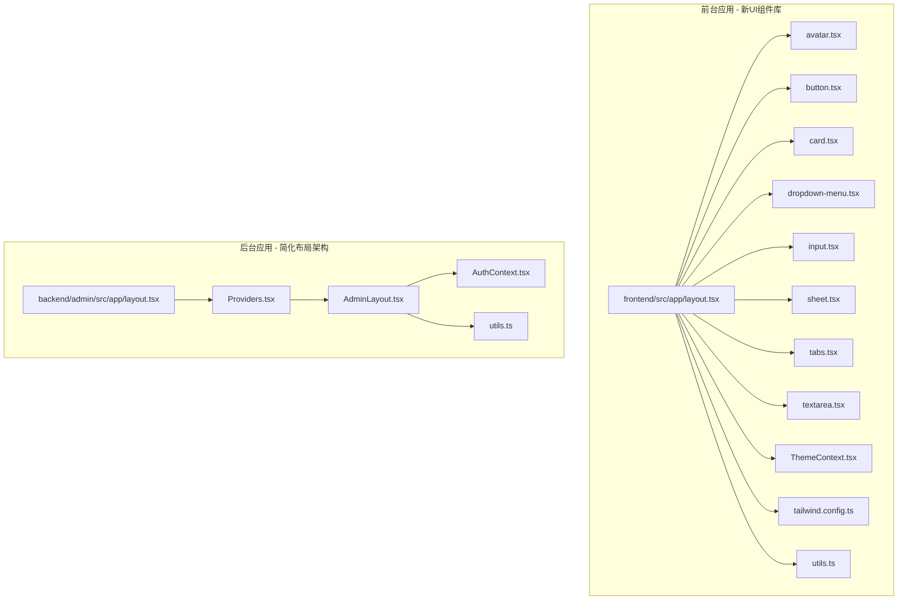
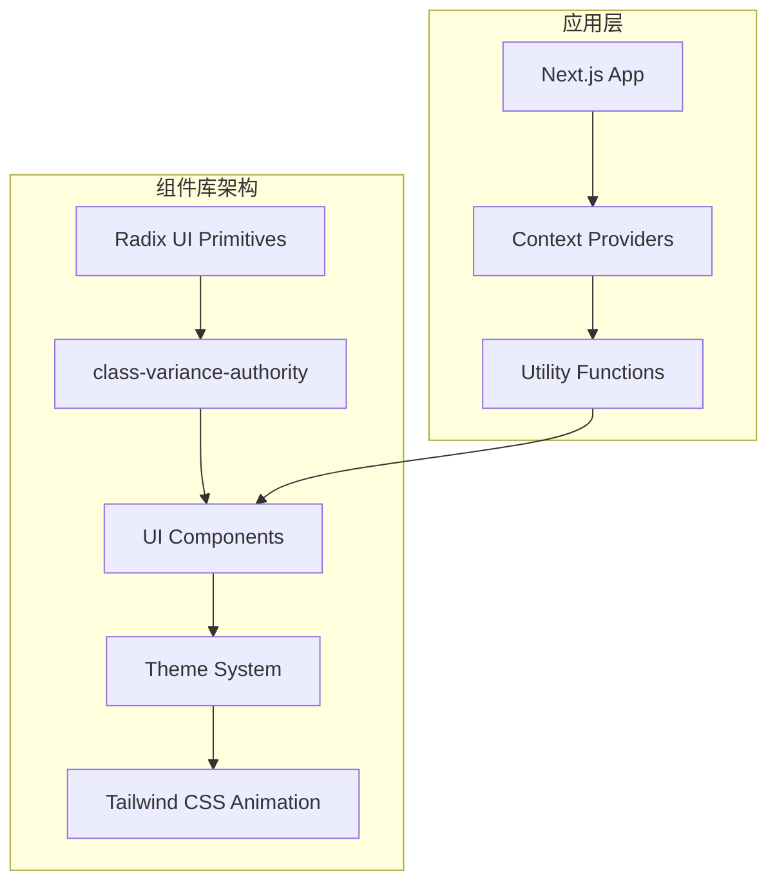
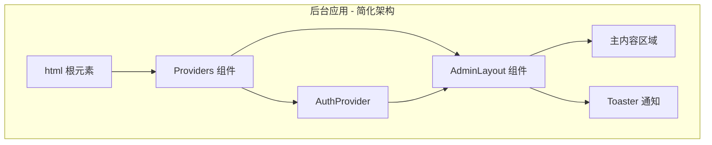
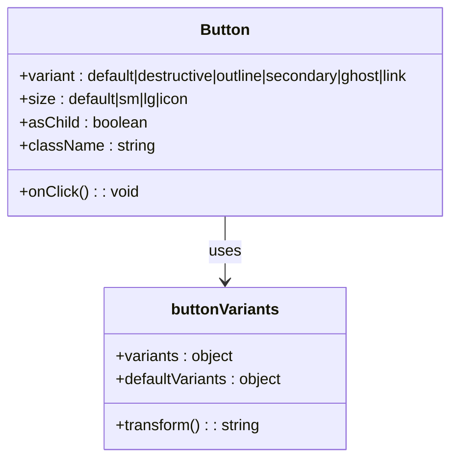
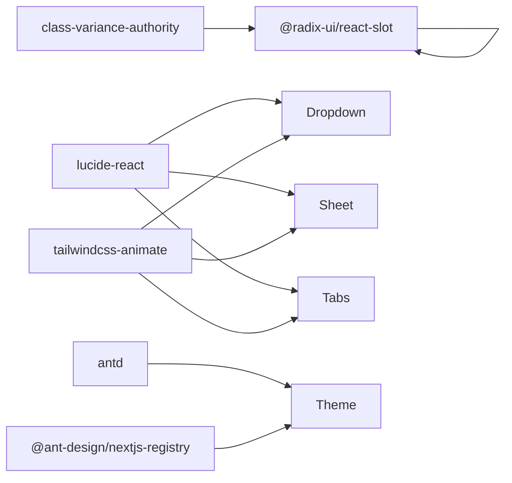

# UI 组件设计

<cite>
**本文引用的文件**
- [frontend/src/app/layout.tsx](file://frontend/src/app/layout.tsx)
- [frontend/src/components/ui/avatar.tsx](file://frontend/src/components/ui/avatar.tsx)
- [frontend/src/components/ui/button.tsx](file://frontend/src/components/ui/button.tsx)
- [frontend/src/components/ui/card.tsx](file://frontend/src/components/ui/card.tsx)
- [frontend/src/components/ui/dropdown-menu.tsx](file://frontend/src/components/ui/dropdown-menu.tsx)
- [frontend/src/components/ui/input.tsx](file://frontend/src/components/ui/input.tsx)
- [frontend/src/components/ui/sheet.tsx](file://frontend/src/components/ui/sheet.tsx)
- [frontend/src/components/ui/tabs.tsx](file://frontend/src/components/ui/tabs.tsx)
- [frontend/src/components/ui/textarea.tsx](file://frontend/src/components/ui/textarea.tsx)
- [frontend/src/context/ThemeContext.tsx](file://frontend/src/context/ThemeContext.tsx)
- [frontend/tailwind.config.ts](file://frontend/tailwind.config.ts)
- [frontend/src/lib/utils.ts](file://frontend/src/lib/utils.ts)
- [frontend/package.json](file://frontend/package.json)
- [frontend/src/hooks/useSocket.ts](file://frontend/src/hooks/useSocket.ts)
- [frontend/src/components/GameCanvas.tsx](file://frontend/src/components/GameCanvas.tsx)
- [backend/admin/src/components/admin/AdminLayout.tsx](file://backend/admin/src/components/admin/AdminLayout.tsx)
- [backend/admin/src/components/Providers.tsx](file://backend/admin/src/components/Providers.tsx)
- [backend/admin/src/app/layout.tsx](file://backend/admin/src/app/layout.tsx)
- [backend/admin/src/context/AuthContext.tsx](file://backend/admin/src/context/AuthContext.tsx)
- [backend/admin/src/lib/utils.ts](file://backend/admin/src/lib/utils.ts)
</cite>

## 更新摘要
**所做更改**
- 更新后台布局组件架构分析，反映 AdminLayout 组件的简化实现
- 移除对特定全屏逻辑判断的讨论，因为该逻辑已被移除
- 更新后台应用的整体架构图，体现简化的组件结构
- 强调后台布局组件的现代化设计模式和用户体验改进

## 目录
1. [简介](#简介)
2. [项目结构](#项目结构)
3. [核心组件](#核心组件)
4. [架构总览](#架构总览)
5. [详细组件分析](#详细组件分析)
6. [依赖分析](#依赖分析)
7. [性能考虑](#性能考虑)
8. [故障排查指南](#故障排查指南)
9. [结论](#结论)
10. [附录](#附录)

## 简介
本指南面向全新的基于 Radix UI 和 Tailwind CSS 构建的 UI 组件库，系统性地给出组件架构设计、Props 接口定义、状态管理模式、响应式与移动端适配、Tailwind 类名规范与主题定制、动画与过渡、无障碍访问、组件复用与组合式 API 使用、测试与文档、版本管理与性能优化等最佳实践。该组件库包含 Avatar、Button、Card、DropdownMenu、Input、Sheet、Tabs、Textarea 等核心组件，支持完整的主题切换和暗模式功能。

**更新** 后台管理系统采用了简化的布局架构，移除了复杂的全屏逻辑判断，提升了代码简洁性和用户体验。

## 项目结构
本仓库包含两个主要前端应用，均采用现代化的 UI 组件库架构：
- 前端游戏页面：基于 Radix UI 和 Tailwind CSS 的组件库，负责玩家交互、画布渲染与实时消息展示
- 后台管理系统：Next.js 应用（admin），提供管理界面、布局与认证上下文

**图表来源**
- [frontend/src/app/layout.tsx:23-41](file://frontend/src/app/layout.tsx#L23-L41)
- [frontend/src/components/ui/avatar.tsx:1-51](file://frontend/src/components/ui/avatar.tsx#L1-L51)
- [frontend/src/components/ui/button.tsx:1-57](file://frontend/src/components/ui/button.tsx#L1-L57)
- [frontend/src/components/ui/card.tsx:1-80](file://frontend/src/components/ui/card.tsx#L1-L80)
- [frontend/src/components/ui/dropdown-menu.tsx:1-201](file://frontend/src/components/ui/dropdown-menu.tsx#L1-L201)
- [frontend/src/components/ui/input.tsx:1-23](file://frontend/src/components/ui/input.tsx#L1-L23)
- [frontend/src/components/ui/sheet.tsx:1-143](file://frontend/src/components/ui/sheet.tsx#L1-L143)
- [frontend/src/components/ui/tabs.tsx:1-128](file://frontend/src/components/ui/tabs.tsx#L1-L128)
- [frontend/src/components/ui/textarea.tsx:1-24](file://frontend/src/components/ui/textarea.tsx#L1-L24)
- [frontend/src/context/ThemeContext.tsx:1-72](file://frontend/src/context/ThemeContext.tsx#L1-L72)
- [frontend/tailwind.config.ts:1-64](file://frontend/tailwind.config.ts#L1-L64)
- [backend/admin/src/app/layout.tsx:1-25](file://backend/admin/src/app/layout.tsx#L1-L25)
- [backend/admin/src/components/Providers.tsx:1-16](file://backend/admin/src/components/Providers.tsx#L1-L16)
- [backend/admin/src/components/admin/AdminLayout.tsx:1-185](file://backend/admin/src/components/admin/AdminLayout.tsx#L1-L185)

**章节来源**
- [frontend/src/app/layout.tsx:1-42](file://frontend/src/app/layout.tsx#L1-L42)
- [frontend/src/context/ThemeContext.tsx:1-72](file://frontend/src/context/ThemeContext.tsx#L1-L72)
- [backend/admin/src/app/layout.tsx:1-25](file://backend/admin/src/app/layout.tsx#L1-L25)
- [backend/admin/src/components/Providers.tsx:1-16](file://backend/admin/src/components/Providers.tsx#L1-L16)

## 核心组件
### 新UI组件库核心组件
- **原子化组件设计**：基于 Radix UI primitives 构建，确保可访问性和语义化
- **Button 组件**：支持多种变体和尺寸，使用 class-variance-authority 实现变体系统
- **Card 组件**：完整的卡片组件系统，包含标题、描述、内容和页脚
- **DropdownMenu 组件**：支持子菜单、复选框、单选框和快捷键
- **Sheet 组件**：模态对话框组件，支持多方向滑入动画
- **Tabs 组件**：响应式选项卡系统，支持受控和非受控模式
- **表单组件**：Input 和 Textarea 组件，提供一致的样式和交互

### 主题系统
- **暗模式支持**：完整的 CSS 自定义属性主题系统
- **Ant Design 集成**：通过 AntdRegistry 提供主题算法切换
- **本地存储持久化**：用户偏好自动保存和恢复

### 后台布局组件
**更新** 后台管理系统采用了简化的布局架构，AdminLayout 组件实现了现代化的布局模式：

- **简化导航结构**：移除了复杂的全屏逻辑判断，采用统一的布局模式
- **响应式侧边栏**：支持折叠/展开的侧边栏，提升移动端体验
- **集成认证上下文**：内置用户认证和登出功能
- **现代化组件集成**：使用最新的 UI 组件库构建

**章节来源**
- [frontend/src/components/ui/button.tsx:7-34](file://frontend/src/components/ui/button.tsx#L7-L34)
- [frontend/src/components/ui/card.tsx:5-79](file://frontend/src/components/ui/card.tsx#L5-L79)
- [frontend/src/components/ui/dropdown-menu.tsx:9-200](file://frontend/src/components/ui/dropdown-menu.tsx#L9-L200)
- [frontend/src/context/ThemeContext.tsx:15-62](file://frontend/src/context/ThemeContext.tsx#L15-L62)
- [backend/admin/src/components/admin/AdminLayout.tsx:35-185](file://backend/admin/src/components/admin/AdminLayout.tsx#L35-L185)

## 架构总览
全新的 UI 组件库采用分层架构设计，从底层的 Radix UI primitives 到高层的业务组件：

**更新** 后台应用采用了简化的架构模式，通过 Providers 组件统一管理认证和布局：

**图表来源**
- [frontend/src/components/ui/button.tsx:3-34](file://frontend/src/components/ui/button.tsx#L3-L34)
- [frontend/src/context/ThemeContext.tsx:46-61](file://frontend/src/context/ThemeContext.tsx#L46-L61)
- [frontend/tailwind.config.ts:61-62](file://frontend/tailwind.config.ts#L61-L62)
- [backend/admin/src/components/Providers.tsx:7-14](file://backend/admin/src/components/Providers.tsx#L7-L14)

## 详细组件分析

### Button 组件系统
Button 组件采用 class-variance-authority 实现强大的变体系统，支持多种视觉风格和尺寸：

**变体类型**：
- default：主要操作按钮
- destructive：危险操作按钮
- outline：轮廓按钮
- secondary：次要按钮
- ghost：幽灵按钮
- link：链接按钮

**尺寸系统**：
- default：标准尺寸
- sm：小尺寸
- lg：大尺寸
- icon：图标按钮

**图表来源**
- [frontend/src/components/ui/button.tsx:36-54](file://frontend/src/components/ui/button.tsx#L36-L54)

**章节来源**
- [frontend/src/components/ui/button.tsx:1-57](file://frontend/src/components/ui/button.tsx#L1-L57)

### Card 组件系统
Card 组件提供完整的卡片布局系统，包含多个子组件：

**组件层次**：
- Card：容器组件
- CardHeader：头部区域
- CardTitle：标题
- CardDescription：描述文本
- CardContent：主要内容
- CardFooter：底部区域

每个子组件都支持通过 forwardRef 接收 ref 和 className 属性，确保完全的可定制性。

**章节来源**
- [frontend/src/components/ui/card.tsx:1-80](file://frontend/src/components/ui/card.tsx#L1-L80)

### DropdownMenu 组件系统
DropdownMenu 组件是完整的菜单系统，支持复杂交互：

**核心组件**：
- DropdownMenu：根组件
- DropdownMenuTrigger：触发器
- DropdownMenuContent：内容区域
- DropdownMenuItem：菜单项
- DropdownMenuCheckboxItem：复选框菜单项
- DropdownMenuRadioItem：单选菜单项
- DropdownMenuLabel：标签
- DropdownMenuSeparator：分隔符
- DropdownMenuShortcut：快捷键

**动画系统**：使用 Radix UI 的内置动画，支持淡入淡出和滑动效果。

**章节来源**
- [frontend/src/components/ui/dropdown-menu.tsx:1-201](file://frontend/src/components/ui/dropdown-menu.tsx#L1-L201)

### Sheet 组件系统
Sheet 组件提供模态对话框功能，支持多方向滑入：

**侧边选项**：
- top：顶部滑入
- bottom：底部滑入
- left：左侧滑入
- right：右侧滑入

**动画系统**：使用 slide-in 和 slide-out 动画，配合透明度变化。

**章节来源**
- [frontend/src/components/ui/sheet.tsx:33-77](file://frontend/src/components/ui/sheet.tsx#L33-L77)

### Tabs 组件系统
Tabs 组件支持受控和非受控两种模式：

**组件类型**：
- Tabs：根组件，管理活动标签
- TabsList：标签列表
- TabsTrigger：单个标签触发器
- TabsContent：标签内容区域

**状态管理**：内部使用 useState 管理活动标签，支持外部值同步。

**章节来源**
- [frontend/src/components/ui/tabs.tsx:7-127](file://frontend/src/components/ui/tabs.tsx#L7-L127)

### 表单组件
**Input 组件**：提供一致的输入样式，支持禁用状态和焦点状态
**Textarea 组件**：支持多行文本输入，提供最小高度约束

**章节来源**
- [frontend/src/components/ui/input.tsx:1-23](file://frontend/src/components/ui/input.tsx#L1-L23)
- [frontend/src/components/ui/textarea.tsx:1-24](file://frontend/src/components/ui/textarea.tsx#L1-L24)

### 主题系统架构
**ThemeContext**：提供完整的主题切换功能

**特性**：
- 支持 light 和 dark 两种主题
- 本地存储持久化用户偏好
- 系统主题检测（prefers-color-scheme）
- Ant Design 主题算法切换
- CSS 自定义属性动态更新

**实现机制**：
- 使用 document.documentElement.classList 添加主题类
- 通过 AntdRegistry 提供主题算法
- 支持运行时主题切换

**章节来源**
- [frontend/src/context/ThemeContext.tsx:1-72](file://frontend/src/context/ThemeContext.tsx#L1-L72)

### Tailwind CSS 配置
**配置特点**：
- 使用 CSS 自定义属性映射所有颜色变量
- 支持暗模式类选择器
- 集成 tailwindcss-animate 插件
- 完整的圆角半径系统

**颜色系统**：基于 CSS 变量的完整色彩体系，包括 background、foreground、card、popover、primary、secondary、muted、accent、destructive、border、input、ring、chart 等。

**章节来源**
- [frontend/tailwind.config.ts:1-64](file://frontend/tailwind.config.ts#L1-L64)

### 工具函数系统
**cn 函数**：使用 clsx 和 tailwind-merge 实现智能类名合并

**功能**：
- 合并多个类名
- 避免重复类名
- 处理条件类名
- 优化最终类名字符串

**章节来源**
- [frontend/src/lib/utils.ts:1-7](file://frontend/src/lib/utils.ts#L1-L7)

### 后台布局组件分析
**更新** AdminLayout 组件采用了简化的现代化设计模式：

**核心特性**：
- **统一布局模式**：移除了复杂的全屏逻辑判断，采用统一的固定布局
- **响应式侧边栏**：支持折叠/展开功能，提升移动端体验
- **集成导航系统**：内置完整的导航菜单，支持多级路由
- **认证集成**：内置用户认证和登出功能
- **现代化设计**：使用最新的 UI 组件库构建

**布局结构**：
- 固定外层容器：`fixed inset-0 flex w-full h-full`
- 侧边栏区域：`hidden border-r bg-background sm:flex flex-col`
- 主内容区域：`flex flex-col flex-1 min-w-0 w-full h-full overflow-hidden`
- 通知系统：内置 Toaster 组件

**导航系统**：
- 支持 8 个主要功能模块
- 响应式显示标题和图标
- 活动状态高亮显示
- 用户信息下拉菜单

**章节来源**
- [backend/admin/src/components/admin/AdminLayout.tsx:35-185](file://backend/admin/src/components/admin/AdminLayout.tsx#L35-L185)

### Providers 组件架构
**更新** Providers 组件实现了简化的应用包装模式：

**组件职责**：
- 管理认证状态：AuthProvider 提供用户认证上下文
- 统一布局：AdminLayout 包装所有页面内容
- 状态共享：在整个应用中提供共享的状态管理

**架构优势**：
- 单一职责原则：每个组件专注于特定功能
- 组件复用：Providers 可以在多个页面中复用
- 状态一致性：确保认证状态在整个应用中保持一致

**章节来源**
- [backend/admin/src/components/Providers.tsx:7-14](file://backend/admin/src/components/Providers.tsx#L7-L14)

## 依赖分析
**核心依赖**：
- @radix-ui/react-*：可访问性友好的 UI primitives
- class-variance-authority：变体系统
- lucide-react：SVG 图标库
- tailwindcss-animate：动画插件
- antd + @ant-design/nextjs-registry：主题系统

**图表来源**
- [frontend/package.json:11-31](file://frontend/package.json#L11-L31)

**章节来源**
- [frontend/package.json:1-50](file://frontend/package.json#L1-L50)

## 性能考虑
**组件性能优化**：
- 使用 React.memo 和 forwardRef 优化渲染
- 基于 CSS 变量的颜色系统减少样式计算
- Radix UI primitives 提供高效的可访问性实现
- 按需加载动画和图标资源

**主题性能**：
- CSS 自定义属性避免重新计算样式
- 本地存储减少主题检测开销
- Ant Design 算法预编译优化

**后台布局性能**：
- **简化的布局逻辑**：移除复杂的全屏判断，减少条件分支
- **响应式优化**：侧边栏的折叠/展开使用 CSS 过渡动画
- **组件懒加载**：导航项使用 Next.js Link 组件实现客户端导航

## 故障排查指南
**组件相关问题**：
- 变体样式不生效：检查 class-variance-authority 配置
- 动画异常：确认 tailwindcss-animate 插件已安装
- 可访问性问题：检查 Radix UI 组件的语义化标签

**主题相关问题**：
- 主题切换无效：检查 CSS 自定义属性是否正确更新
- 本地存储异常：确认浏览器支持 localStorage
- Ant Design 主题错误：验证 @ant-design/nextjs-registry 配置

**后台布局问题**：
- **布局显示异常**：检查 AdminLayout 的固定定位类名
- **侧边栏功能失效**：确认折叠状态管理逻辑正常工作
- **导航链接不工作**：验证 Next.js Link 组件的 href 属性

**章节来源**
- [frontend/src/context/ThemeContext.tsx:30-35](file://frontend/src/context/ThemeContext.tsx#L30-L35)
- [backend/admin/src/components/admin/AdminLayout.tsx:95-100](file://backend/admin/src/components/admin/AdminLayout.tsx#L95-L100)

## 结论
全新的 UI 组件库基于 Radix UI 和 Tailwind CSS 构建，提供了完整的组件生态系统和强大的主题系统。通过原子化组件设计、变体系统、可访问性支持和性能优化，为现代 Web 应用提供了坚实的基础。

**更新** 后台管理系统采用了简化的布局架构，AdminLayout 组件移除了复杂的全屏逻辑判断，采用统一的现代化设计模式。这种架构改进提升了用户体验，减少了代码复杂性，同时保持了完整的功能完整性。建议在后续开发中充分利用这些组件的可定制性，同时保持一致的设计语言和用户体验。

## 附录
**组件开发最佳实践**：
- 始终使用 forwardRef 接收 ref
- 支持 className 属性以便样式覆盖
- 提供适当的 TypeScript 类型定义
- 确保完整的可访问性支持
- 使用 CSS 自定义属性而非硬编码颜色

**主题开发指南**：
- 在 CSS 变量中定义所有颜色
- 提供明暗两套主题变量
- 支持用户偏好和系统偏好
- 通过 Ant Design 算法实现主题切换
- 确保动画和过渡效果的一致性

**后台布局开发指南**：
- **简化的布局模式**：优先考虑统一的布局逻辑
- **响应式设计**：确保移动端的良好体验
- **导航集成**：提供清晰的功能导航结构
- **状态管理**：合理组织认证和布局状态
- **性能优化**：避免复杂的条件判断和状态计算

**性能优化建议**：
- 使用 React.lazy 和 Suspense 实现按需加载
- 优化 SVG 图标的渲染性能
- 减少不必要的 re-render
- 使用 CSS 变量而非内联样式
- 实现组件的 memo 化
- **后台布局优化**：利用简化的架构减少状态管理开销