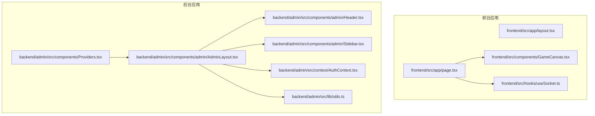
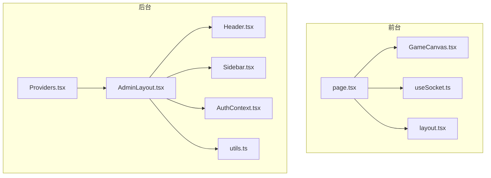
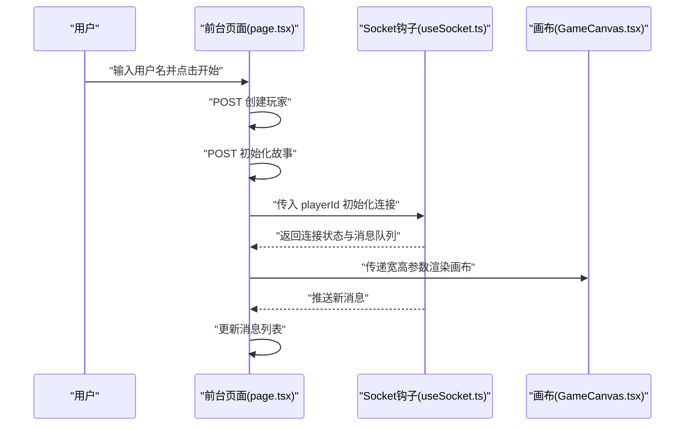
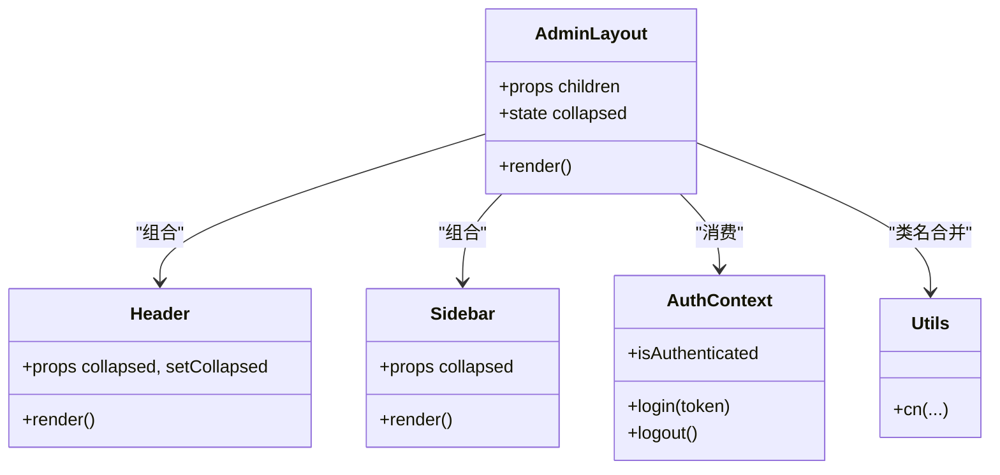
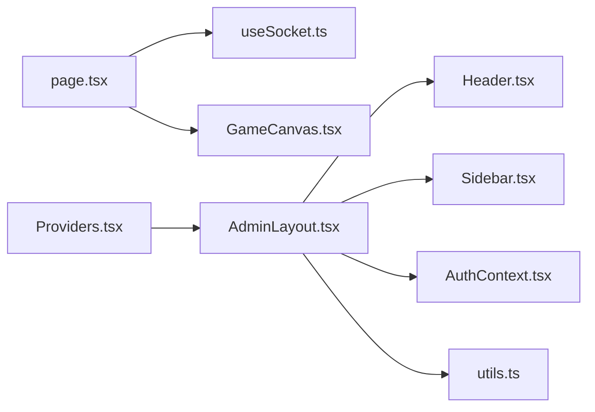

# UI 组件设计

<cite>
**本文引用的文件**
- [frontend/src/app/layout.tsx](file://frontend/src/app/layout.tsx)
- [frontend/src/app/page.tsx](file://frontend/src/app/page.tsx)
- [frontend/src/components/GameCanvas.tsx](file://frontend/src/components/GameCanvas.tsx)
- [frontend/src/hooks/useSocket.ts](file://frontend/src/hooks/useSocket.ts)
- [backend/admin/src/components/admin/AdminLayout.tsx](file://backend/admin/src/components/admin/AdminLayout.tsx)
- [backend/admin/src/components/admin/Header.tsx](file://backend/admin/src/components/admin/Header.tsx)
- [backend/admin/src/components/admin/Sidebar.tsx](file://backend/admin/src/components/admin/Sidebar.tsx)
- [backend/admin/src/components/Providers.tsx](file://backend/admin/src/components/Providers.tsx)
- [backend/admin/src/context/AuthContext.tsx](file://backend/admin/src/context/AuthContext.tsx)
- [backend/admin/src/lib/utils.ts](file://backend/admin/src/lib/utils.ts)
</cite>

## 目录
1. [简介](#简介)
2. [项目结构](#项目结构)
3. [核心组件](#核心组件)
4. [架构总览](#架构总览)
5. [详细组件分析](#详细组件分析)
6. [依赖分析](#依赖分析)
7. [性能考虑](#性能考虑)
8. [故障排查指南](#故障排查指南)
9. [结论](#结论)
10. [附录](#附录)

## 简介
本指南面向 UI 组件设计与实现，结合仓库中前端与后台管理系统的现有组件，系统性地给出组件架构设计、Props 接口定义、状态管理模式、响应式与移动端适配、Tailwind 类名规范与主题定制、动画与过渡、无障碍访问、组件复用与组合式 API 使用、测试与文档、版本管理与性能优化等最佳实践。内容以“可落地”为目标，既适合初学者快速上手，也便于资深工程师进行架构审视与优化。

## 项目结构
本仓库包含两个主要前端应用：
- 前端游戏页面：Next.js 应用，负责玩家交互、画布渲染与实时消息展示。
- 后台管理系统：Next.js 应用（admin），提供管理界面、布局与认证上下文。

图表来源
- [frontend/src/app/layout.tsx](file://frontend/src/app/layout.tsx#L1-L35)
- [frontend/src/app/page.tsx](file://frontend/src/app/page.tsx#L1-L85)
- [frontend/src/components/GameCanvas.tsx](file://frontend/src/components/GameCanvas.tsx)
- [frontend/src/hooks/useSocket.ts](file://frontend/src/hooks/useSocket.ts)
- [backend/admin/src/components/Providers.tsx](file://backend/admin/src/components/Providers.tsx#L1-L16)
- [backend/admin/src/components/admin/AdminLayout.tsx](file://backend/admin/src/components/admin/AdminLayout.tsx#L1-L156)
- [backend/admin/src/components/admin/Header.tsx](file://backend/admin/src/components/admin/Header.tsx#L1-L64)
- [backend/admin/src/components/admin/Sidebar.tsx](file://backend/admin/src/components/admin/Sidebar.tsx#L1-L88)
- [backend/admin/src/context/AuthContext.tsx](file://backend/admin/src/context/AuthContext.tsx#L1-L55)
- [backend/admin/src/lib/utils.ts](file://backend/admin/src/lib/utils.ts#L1-L7)

章节来源
- [frontend/src/app/layout.tsx](file://frontend/src/app/layout.tsx#L1-L35)
- [frontend/src/app/page.tsx](file://frontend/src/app/page.tsx#L1-L85)
- [backend/admin/src/components/Providers.tsx](file://backend/admin/src/components/Providers.tsx#L1-L16)

## 核心组件
- 前台页面容器：负责玩家输入、实时连接与画布渲染，采用动态导入避免 SSR 渲染。
- 游戏画布组件：承载 Canvas 渲染逻辑，作为可复用的可视化组件。
- Socket 钩子：封装 WebSocket 连接、消息收发与状态管理。
- 后台布局组件：提供侧边栏、头部导航与主内容区，支持折叠与响应式。
- 认证上下文：集中管理登录态、路由守卫与本地存储。
- 工具函数：统一 Tailwind 类名合并与条件拼接。

章节来源
- [frontend/src/app/page.tsx](file://frontend/src/app/page.tsx#L1-L85)
- [frontend/src/components/GameCanvas.tsx](file://frontend/src/components/GameCanvas.tsx)
- [frontend/src/hooks/useSocket.ts](file://frontend/src/hooks/useSocket.ts)
- [backend/admin/src/components/admin/AdminLayout.tsx](file://backend/admin/src/components/admin/AdminLayout.tsx#L1-L156)
- [backend/admin/src/context/AuthContext.tsx](file://backend/admin/src/context/AuthContext.tsx#L1-L55)
- [backend/admin/src/lib/utils.ts](file://backend/admin/src/lib/utils.ts#L1-L7)

## 架构总览
前台与后台分别运行独立的 Next.js 应用，通过各自入口与布局组件串联业务模块。前台页面通过动态导入画布组件与 Socket 钩子，降低首屏负担；后台通过 Provider 包裹布局，形成统一的主题、导航与认证能力。

图表来源
- [frontend/src/app/page.tsx](file://frontend/src/app/page.tsx#L1-L85)
- [frontend/src/components/GameCanvas.tsx](file://frontend/src/components/GameCanvas.tsx)
- [frontend/src/hooks/useSocket.ts](file://frontend/src/hooks/useSocket.ts)
- [frontend/src/app/layout.tsx](file://frontend/src/app/layout.tsx#L1-L35)
- [backend/admin/src/components/Providers.tsx](file://backend/admin/src/components/Providers.tsx#L1-L16)
- [backend/admin/src/components/admin/AdminLayout.tsx](file://backend/admin/src/components/admin/AdminLayout.tsx#L1-L156)
- [backend/admin/src/components/admin/Header.tsx](file://backend/admin/src/components/admin/Header.tsx#L1-L64)
- [backend/admin/src/components/admin/Sidebar.tsx](file://backend/admin/src/components/admin/Sidebar.tsx#L1-L88)
- [backend/admin/src/context/AuthContext.tsx](file://backend/admin/src/context/AuthContext.tsx#L1-L55)
- [backend/admin/src/lib/utils.ts](file://backend/admin/src/lib/utils.ts#L1-L7)

## 详细组件分析

### 前台页面与画布组件
- 页面职责：处理玩家输入、创建玩家、发起故事初始化、维护实时连接状态与消息列表，并渲染画布与日志面板。
- 动态导入：通过动态导入避免在 SSR 阶段渲染客户端专属组件，提升首屏性能与稳定性。
- 画布组件：作为纯展示型组件，接收尺寸参数，内部封装渲染逻辑，便于复用与替换。
- Socket 钩子：封装连接建立、消息订阅与发送，暴露状态与方法供页面消费。

图表来源
- [frontend/src/app/page.tsx](file://frontend/src/app/page.tsx#L14-L35)
- [frontend/src/hooks/useSocket.ts](file://frontend/src/hooks/useSocket.ts)
- [frontend/src/components/GameCanvas.tsx](file://frontend/src/components/GameCanvas.tsx)

章节来源
- [frontend/src/app/page.tsx](file://frontend/src/app/page.tsx#L1-L85)
- [frontend/src/hooks/useSocket.ts](file://frontend/src/hooks/useSocket.ts)
- [frontend/src/components/GameCanvas.tsx](file://frontend/src/components/GameCanvas.tsx)

### 后台布局与导航组件
- 布局组件：提供侧边栏、头部区域与主内容区，支持侧栏折叠与响应式切换；通过工具函数合并类名，保证样式一致性。
- 头部组件：集成用户头像下拉菜单、登出操作，使用语义化标签提升无障碍体验。
- 侧边栏组件：根据当前路由高亮选中项，支持图标与标题显示/隐藏。
- 认证上下文：集中管理登录态、Token 存储与路由跳转，保障后台受保护页面的安全访问。

图表来源
- [backend/admin/src/components/admin/AdminLayout.tsx](file://backend/admin/src/components/admin/AdminLayout.tsx#L34-L152)
- [backend/admin/src/components/admin/Header.tsx](file://backend/admin/src/components/admin/Header.tsx#L21-L62)
- [backend/admin/src/components/admin/Sidebar.tsx](file://backend/admin/src/components/admin/Sidebar.tsx#L46-L86)
- [backend/admin/src/context/AuthContext.tsx](file://backend/admin/src/context/AuthContext.tsx#L20-L53)
- [backend/admin/src/lib/utils.ts](file://backend/admin/src/lib/utils.ts#L4-L6)

章节来源
- [backend/admin/src/components/admin/AdminLayout.tsx](file://backend/admin/src/components/admin/AdminLayout.tsx#L1-L156)
- [backend/admin/src/components/admin/Header.tsx](file://backend/admin/src/components/admin/Header.tsx#L1-L64)
- [backend/admin/src/components/admin/Sidebar.tsx](file://backend/admin/src/components/admin/Sidebar.tsx#L1-L88)
- [backend/admin/src/context/AuthContext.tsx](file://backend/admin/src/context/AuthContext.tsx#L1-L55)
- [backend/admin/src/lib/utils.ts](file://backend/admin/src/lib/utils.ts#L1-L7)

### Props 接口与状态管理
- 页面 Props：children（用于根布局）、动态导入参数（SSR 关闭）。
- 布局 Props：children（内容区）、collapsed（折叠状态）、setCollapsed（切换回调）。
- 认证上下文：提供登录、登出与登录态读取，内部通过路由守卫与本地存储维持状态。
- 状态模式建议：
  - 将 UI 状态与业务状态分离：如页面中的玩家信息、连接状态与消息列表。
  - 使用不可变更新与局部状态优先，避免全局污染。
  - 对于跨组件共享的状态（如布局折叠状态），可通过上下文或轻量状态库管理。

章节来源
- [frontend/src/app/page.tsx](file://frontend/src/app/page.tsx#L20-L35)
- [backend/admin/src/components/admin/AdminLayout.tsx](file://backend/admin/src/components/admin/AdminLayout.tsx#L34-L42)
- [backend/admin/src/context/AuthContext.tsx](file://backend/admin/src/context/AuthContext.tsx#L20-L47)

### 响应式设计与移动端适配
- 断点策略：利用 Tailwind 的响应式前缀（sm/lg 等）控制侧栏、按钮与布局区域的显示/隐藏与宽度。
- 移动端适配：头部提供移动端菜单触发按钮；侧栏在小屏时可折叠以节省空间。
- 字体与排版：根布局引入字体变量，确保全局一致的排版基础。

章节来源
- [backend/admin/src/components/admin/AdminLayout.tsx](file://backend/admin/src/components/admin/AdminLayout.tsx#L72-L123)
- [frontend/src/app/layout.tsx](file://frontend/src/app/layout.tsx#L5-L13)

### Tailwind 类名规范与主题定制
- 类名合并：通过工具函数统一合并类名，避免重复与冲突。
- 主题变量：根布局注入字体变量，便于全局主题与排版一致性。
- 组件样式：优先使用语义化类名（如 bg-muted/text-primary 等），减少自定义样式耦合。

章节来源
- [backend/admin/src/lib/utils.ts](file://backend/admin/src/lib/utils.ts#L1-L7)
- [frontend/src/app/layout.tsx](file://frontend/src/app/layout.tsx#L27-L28)

### 动画与过渡效果
- 平滑过渡：侧栏展开/收起使用过渡时长与缓动，提升交互感知。
- 可访问性：为交互元素提供 sr-only 文本，辅助屏幕阅读器识别。

章节来源
- [backend/admin/src/components/admin/AdminLayout.tsx](file://backend/admin/src/components/admin/AdminLayout.tsx#L74-L78)
- [backend/admin/src/components/admin/Header.tsx](file://backend/admin/src/components/admin/Header.tsx#L32-L34)

### 无障碍访问支持
- 语义化标签：按钮、菜单、下拉等使用合适的语义与角色。
- 屏幕阅读器友好：为图标按钮添加 sr-only 文本，明确其功能。
- 键盘可达性：保持默认焦点顺序与 Tab 导航流畅。

章节来源
- [backend/admin/src/components/admin/Header.tsx](file://backend/admin/src/components/admin/Header.tsx#L35-L60)

### 组件复用模式与组合式 API
- 复用模式：将布局、导航、上下文等抽象为可复用模块，通过 Provider 与组合方式注入。
- 组合式 API：在页面中组合多个 Hook（如 useSocket）与组件（如动态导入的画布），实现关注点分离。
- 插槽设计：通过 children 透传内容，实现灵活的布局嵌套与扩展。

章节来源
- [backend/admin/src/components/Providers.tsx](file://backend/admin/src/components/Providers.tsx#L7-L14)
- [frontend/src/app/page.tsx](file://frontend/src/app/page.tsx#L7-L7)

### 测试策略与文档
- 单元测试：对 Hook 与工具函数进行隔离测试，验证状态变更与类名合并逻辑。
- 集成测试：对页面流程（创建玩家、初始化故事、消息推送）进行端到端验证。
- 文档编写：为每个组件提供 Props、事件与行为说明，配合示例与截图。
- 版本管理：遵循语义化版本，记录重大 UI 变更与破坏性修改。

（本节为通用指导，不直接分析具体文件）

### 性能优化与 Bundle 控制
- 按需加载：动态导入客户端组件，减少 SSR 与初始包体积。
- 资源懒加载：对非关键资源延迟加载，优化首屏时间。
- 样式优化：集中使用 Tailwind，避免内联样式与重复类名。
- 缓存策略：合理配置静态资源缓存与构建产物指纹化。

章节来源
- [frontend/src/app/page.tsx](file://frontend/src/app/page.tsx#L7-L7)

## 依赖分析
- 前台页面依赖 Socket 钩子与画布组件，二者均为纯 UI/逻辑组件，耦合度低，易于替换。
- 后台布局依赖头部、侧边栏与认证上下文，形成稳定的布局体系。
- 工具函数提供跨组件的类名合并能力，降低样式耦合风险。

图表来源
- [frontend/src/app/page.tsx](file://frontend/src/app/page.tsx#L1-L85)
- [frontend/src/hooks/useSocket.ts](file://frontend/src/hooks/useSocket.ts)
- [frontend/src/components/GameCanvas.tsx](file://frontend/src/components/GameCanvas.tsx)
- [backend/admin/src/components/Providers.tsx](file://backend/admin/src/components/Providers.tsx#L1-L16)
- [backend/admin/src/components/admin/AdminLayout.tsx](file://backend/admin/src/components/admin/AdminLayout.tsx#L1-L156)
- [backend/admin/src/components/admin/Header.tsx](file://backend/admin/src/components/admin/Header.tsx#L1-L64)
- [backend/admin/src/components/admin/Sidebar.tsx](file://backend/admin/src/components/admin/Sidebar.tsx#L1-L88)
- [backend/admin/src/context/AuthContext.tsx](file://backend/admin/src/context/AuthContext.tsx#L1-L55)
- [backend/admin/src/lib/utils.ts](file://backend/admin/src/lib/utils.ts#L1-L7)

章节来源
- [frontend/src/app/page.tsx](file://frontend/src/app/page.tsx#L1-L85)
- [backend/admin/src/components/Providers.tsx](file://backend/admin/src/components/Providers.tsx#L1-L16)

## 性能考虑
- 首屏优化：动态导入与按需渲染，减少不必要的 SSR。
- 事件与渲染：避免在渲染阶段执行重计算，将耗时逻辑移至 Effect 或异步任务。
- 图形与动画：在画布组件中限制帧率与绘制范围，避免过度重绘。
- 资源压缩：启用 Gzip/Brotli 压缩与图片优化，控制传输体积。

（本节为通用指导，不直接分析具体文件）

## 故障排查指南
- 登录态异常：检查认证上下文中 Token 存储与路由跳转逻辑，确认受保护页面是否正确拦截。
- 布局错位：核对响应式类名与过渡时长，确保在不同断点下的表现一致。
- 类名冲突：使用工具函数统一合并类名，避免重复覆盖导致的样式异常。
- 无障碍问题：检查 sr-only 文本与键盘焦点顺序，确保屏幕阅读器可用。

章节来源
- [backend/admin/src/context/AuthContext.tsx](file://backend/admin/src/context/AuthContext.tsx#L25-L47)
- [backend/admin/src/lib/utils.ts](file://backend/admin/src/lib/utils.ts#L4-L6)

## 结论
本指南基于现有组件总结了 UI 设计的关键实践：清晰的组件分层、合理的状态与 Props 设计、响应式与无障碍支持、Tailwind 规范与主题一致性、以及性能与可维护性的平衡。建议在后续迭代中持续完善测试与文档，保持版本演进的可追踪性。

## 附录
- 组件命名建议：语义化、可读性强，避免缩写与歧义。
- 样式组织建议：按功能域划分样式文件，统一使用 Tailwind 修饰，必要时引入主题变量。
- 动画与交互：统一使用过渡时长与缓动曲线，确保一致的交互节奏。
- 文档与测试：为每个组件提供使用示例、Props 说明与测试用例，形成闭环。

（本节为通用指导，不直接分析具体文件）