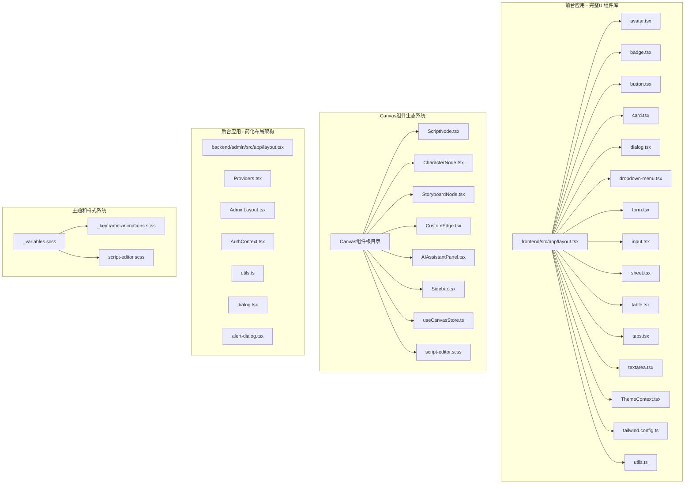
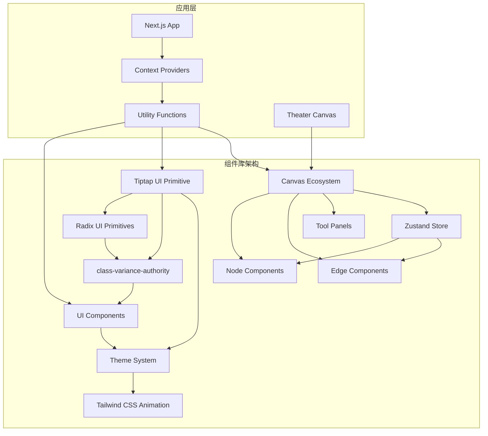
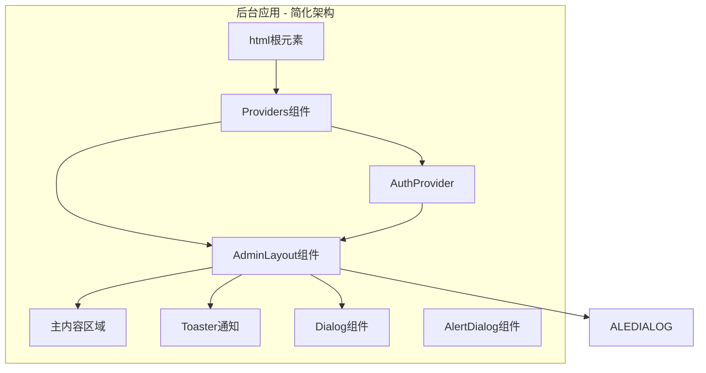
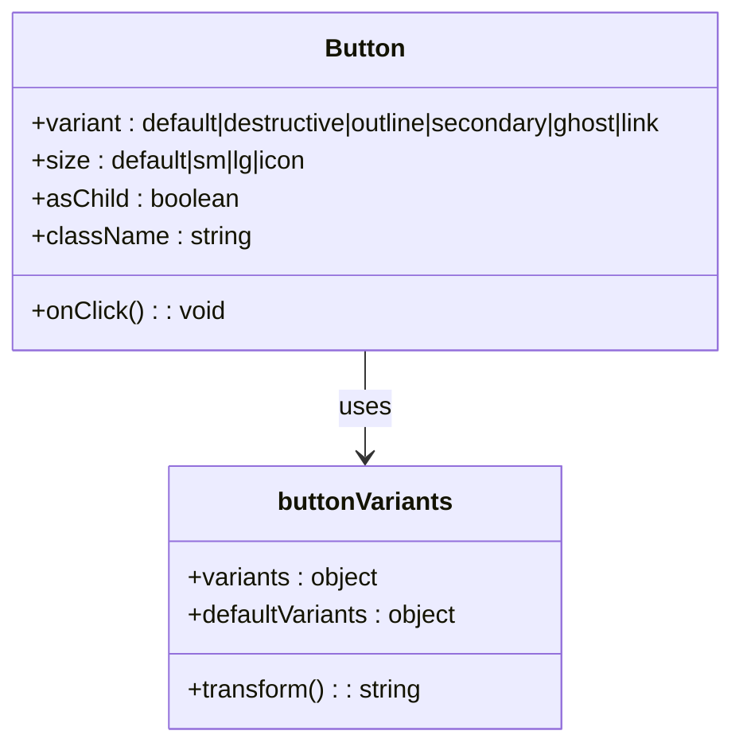
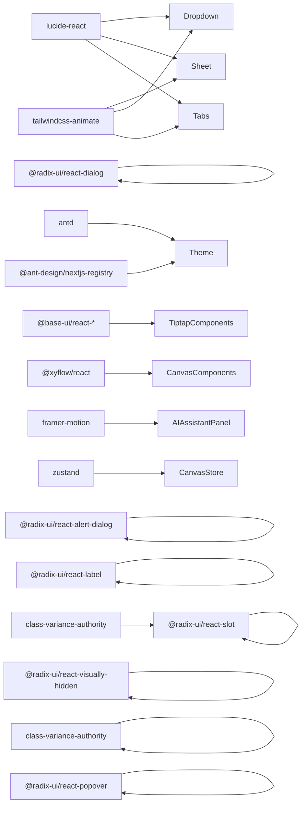

# UI 组件设计

<cite>
**本文档引用的文件**
- [frontend/src/app/layout.tsx](file://frontend/src/app/layout.tsx)
- [frontend/src/components/ui/avatar.tsx](file://frontend/src/components/ui/avatar.tsx)
- [frontend/src/components/ui/badge.tsx](file://frontend/src/components/ui/badge.tsx)
- [frontend/src/components/ui/button.tsx](file://frontend/src/components/ui/button.tsx)
- [frontend/src/components/ui/card.tsx](file://frontend/src/components/ui/card.tsx)
- [frontend/src/components/ui/dialog.tsx](file://frontend/src/components/ui/dialog.tsx)
- [frontend/src/components/ui/dropdown-menu.tsx](file://frontend/src/components/ui/dropdown-menu.tsx)
- [frontend/src/components/ui/form.tsx](file://frontend/src/components/ui/form.tsx)
- [frontend/src/components/ui/input.tsx](file://frontend/src/components/ui/input.tsx)
- [frontend/src/components/ui/sheet.tsx](file://frontend/src/components/ui/sheet.tsx)
- [frontend/src/components/ui/table.tsx](file://frontend/src/components/ui/table.tsx)
- [frontend/src/components/ui/tabs.tsx](file://frontend/src/components/ui/tabs.tsx)
- [frontend/src/components/ui/textarea.tsx](file://frontend/src/components/ui/textarea.tsx)
- [frontend/src/context/ThemeContext.tsx](file://frontend/src/context/ThemeContext.tsx)
- [frontend/tailwind.config.ts](file://frontend/tailwind.config.ts)
- [frontend/src/lib/utils.ts](file://frontend/src/lib/utils.ts)
- [frontend/package.json](file://frontend/package.json)
- [frontend/src/hooks/useSocket.ts](file://frontend/src/hooks/useSocket.ts)
- [frontend/src/components/GameCanvas.tsx](file://frontend/src/components/GameCanvas.tsx)
- [backend/admin/src/components/admin/AdminLayout.tsx](file://backend/admin/src/components/admin/AdminLayout.tsx)
- [backend/admin/src/components/Providers.tsx](file://backend/admin/src/components/Providers.tsx)
- [backend/admin/src/app/layout.tsx](file://backend/admin/src/app/layout.tsx)
- [backend/admin/src/context/AuthContext.tsx](file://backend/admin/src/context/AuthContext.tsx)
- [backend/admin/src/lib/utils.ts](file://backend/admin/src/lib/utils.ts)
- [backend/admin/src/components/ui/alert-dialog.tsx](file://backend/admin/src/components/ui/alert-dialog.tsx)
- [backend/admin/src/components/ui/dialog.tsx](file://backend/admin/src/components/ui/dialog.tsx)
- [frontend/src/components/tiptap-ui-primitive/badge/badge.tsx](file://frontend/src/components/tiptap-ui-primitive/badge/badge.tsx)
- [frontend/src/components/tiptap-ui-primitive/button/button.tsx](file://frontend/src/components/tiptap-ui-primitive/button/button.tsx)
- [frontend/src/components/tiptap-ui-primitive/button-group/button-group.tsx](file://frontend/src/components/tiptap-ui-primitive/button-group/button-group.tsx)
- [frontend/src/components/tiptap-ui-primitive/card/card.tsx](file://frontend/src/components/tiptap-ui-primitive/card/card.tsx)
- [frontend/src/components/tiptap-ui-primitive/input/input.tsx](file://frontend/src/components/tiptap-ui-primitive/input/input.tsx)
- [frontend/src/components/tiptap-ui-primitive/spacer/spacer.tsx](file://frontend/src/components/tiptap-ui-primitive/spacer/spacer.tsx)
- [frontend/src/components/tiptap-ui-primitive/separator/separator.tsx](file://frontend/src/components/tiptap-ui-primitive/separator/separator.tsx)
- [frontend/src/components/tiptap-ui-primitive/popover/popover.tsx](file://frontend/src/components/tiptap-ui-primitive/popover/popover.tsx)
- [frontend/src/components/canvas/ScriptNode.tsx](file://frontend/src/components/canvas/ScriptNode.tsx)
- [frontend/src/components/canvas/CharacterNode.tsx](file://frontend/src/components/canvas/CharacterNode.tsx)
- [frontend/src/components/canvas/StoryboardNode.tsx](file://frontend/src/components/canvas/StoryboardNode.tsx)
- [frontend/src/components/canvas/CustomEdge.tsx](file://frontend/src/components/canvas/CustomEdge.tsx)
- [frontend/src/components/canvas/AIAssistantPanel.tsx](file://frontend/src/components/canvas/AIAssistantPanel.tsx)
- [frontend/src/components/canvas/Sidebar.tsx](file://frontend/src/components/canvas/Sidebar.tsx)
- [frontend/src/store/useCanvasStore.ts](file://frontend/src/store/useCanvasStore.ts)
- [frontend/src/styles/_variables.scss](file://frontend/src/styles/_variables.scss)
- [frontend/src/styles/_keyframe-animations.scss](file://frontend/src/styles/_keyframe-animations.scss)
- [frontend/src/components/canvas/script-editor.scss](file://frontend/src/components/canvas/script-editor.scss)
- [frontend/src/components/TheaterCanvas.tsx](file://frontend/src/components/TheaterCanvas.tsx)
</cite>

## 更新摘要
**所做更改**
- 新增节点术语标准化分析，涵盖文本卡、图片卡、多维表格卡等节点类型的统一命名规范
- 更新UI样式和主题系统，包含新的CSS变量体系和动画系统
- 扩展Canvas组件生态系统，新增AI助手面板、节点边缘拖拽热区优化等组件
- 完善Canvas状态管理架构，增强历史记录和撤销重做功能
- 新增节点库组件，提供拖拽式节点创建功能

## 目录
1. [简介](#简介)
2. [项目结构](#项目结构)
3. [核心组件](#核心组件)
4. [架构总览](#架构总览)
5. [详细组件分析](#详细组件分析)
6. [节点术语标准化](#节点术语标准化)
7. [UI样式和主题系统](#ui样式和主题系统)
8. [Canvas组件生态系统](#canvas组件生态系统)
9. [依赖分析](#依赖分析)
10. [性能考虑](#性能考虑)
11. [故障排查指南](#故障排查指南)
12. [结论](#结论)
13. [附录](#附录)

## 简介
本指南面向基于Radix UI和Tailwind CSS构建的现代化UI组件设计系统，系统性地给出组件架构设计、Props接口定义、状态管理模式、响应式与移动端适配、Tailwind类名规范与主题定制、动画与过渡、无障碍访问、组件复用与组合式API使用、测试与文档、版本管理与性能优化等最佳实践。该组件库包含Avatar、Badge、Button、Card、Dialog、DropdownMenu、Form、Input、Sheet、Table、Tabs、Textarea等核心组件，以及新增的Canvas组件生态系统，支持完整的主题切换和暗模式功能。

**更新** 新增节点术语标准化分析，统一文本卡、图片卡、多维表格卡等节点类型的命名规范；更新UI样式和主题系统，包含新的CSS变量体系和动画系统；扩展Canvas组件生态系统，新增AI助手面板、节点边缘拖拽热区优化等组件。

## 项目结构
本仓库包含三个主要前端应用，均采用现代化的UI组件库架构：
- 前端游戏页面：基于Radix UI和Tailwind CSS的组件库，负责玩家交互、画布渲染与实时消息展示
- 后台管理系统：Next.js应用（admin），提供管理界面、布局与认证上下文
- Canvas组件生态系统：包含节点组件、边组件、工具面板等完整的可视化编辑器组件

**图表来源**
- [frontend/src/app/layout.tsx:23-41](file://frontend/src/app/layout.tsx#L23-L41)
- [frontend/src/components/ui/avatar.tsx:1-51](file://frontend/src/components/ui/avatar.tsx#L1-L51)
- [frontend/src/components/ui/badge.tsx:1-38](file://frontend/src/components/ui/badge.tsx#L1-L38)
- [frontend/src/components/ui/button.tsx:1-57](file://frontend/src/components/ui/button.tsx#L1-L57)
- [frontend/src/components/ui/card.tsx:1-80](file://frontend/src/components/ui/card.tsx#L1-L80)
- [frontend/src/components/ui/dialog.tsx:1-121](file://frontend/src/components/ui/dialog.tsx#L1-L121)
- [frontend/src/components/ui/dropdown-menu.tsx:1-201](file://frontend/src/components/ui/dropdown-menu.tsx#L1-L201)
- [frontend/src/components/ui/form.tsx:1-200](file://frontend/src/components/ui/form.tsx#L1-L200)
- [frontend/src/components/ui/input.tsx:1-23](file://frontend/src/components/ui/input.tsx#L1-L23)
- [frontend/src/components/ui/sheet.tsx:1-143](file://frontend/src/components/ui/sheet.tsx#L1-L143)
- [frontend/src/components/ui/table.tsx:1-200](file://frontend/src/components/ui/table.tsx#L1-L200)
- [frontend/src/components/ui/tabs.tsx:1-128](file://frontend/src/components/ui/tabs.tsx#L1-L128)
- [frontend/src/components/ui/textarea.tsx:1-24](file://frontend/src/components/ui/textarea.tsx#L1-L24)
- [frontend/src/context/ThemeContext.tsx:1-72](file://frontend/src/context/ThemeContext.tsx#L1-L72)
- [frontend/tailwind.config.ts:1-64](file://frontend/tailwind.config.ts#L1-L64)
- [frontend/src/components/canvas/ScriptNode.tsx:1-337](file://frontend/src/components/canvas/ScriptNode.tsx#L1-L337)
- [frontend/src/components/canvas/CharacterNode.tsx:1-463](file://frontend/src/components/canvas/CharacterNode.tsx#L1-L463)
- [frontend/src/components/canvas/StoryboardNode.tsx:1-308](file://frontend/src/components/canvas/StoryboardNode.tsx#L1-L308)
- [frontend/src/components/canvas/CustomEdge.tsx:1-92](file://frontend/src/components/canvas/CustomEdge.tsx#L1-L92)
- [frontend/src/components/canvas/AIAssistantPanel.tsx:1-229](file://frontend/src/components/canvas/AIAssistantPanel.tsx#L1-L229)
- [frontend/src/components/canvas/Sidebar.tsx:1-132](file://frontend/src/components/canvas/Sidebar.tsx#L1-L132)
- [frontend/src/store/useCanvasStore.ts:1-271](file://frontend/src/store/useCanvasStore.ts#L1-L271)
- [frontend/src/styles/_variables.scss:1-297](file://frontend/src/styles/_variables.scss#L1-L297)
- [frontend/src/styles/_keyframe-animations.scss:1-92](file://frontend/src/styles/_keyframe-animations.scss#L1-L92)
- [frontend/src/components/canvas/script-editor.scss:1-234](file://frontend/src/components/canvas/script-editor.scss#L1-L234)

**章节来源**
- [frontend/src/app/layout.tsx:1-42](file://frontend/src/app/layout.tsx#L1-L42)
- [frontend/src/context/ThemeContext.tsx:1-72](file://frontend/src/context/ThemeContext.tsx#L1-L72)
- [backend/admin/src/app/layout.tsx:1-25](file://backend/admin/src/app/layout.tsx#L1-L25)
- [backend/admin/src/components/Providers.tsx:1-16](file://backend/admin/src/components/Providers.tsx#L1-L16)

## 核心组件
### 完整UI组件库核心组件
- **原子化组件设计**：基于Radix UI primitives构建，确保可访问性和语义化
- **基础组件**：Avatar、Badge、Button、Card、Input、Textarea提供基础交互元素
- **复合组件**：Dialog、DropdownMenu、Form、Sheet、Table、Tabs提供复杂交互场景
- **Button组件**：支持多种变体和尺寸，使用class-variance-authority实现变体系统
- **Card组件**：完整的卡片组件系统，包含标题、描述、内容和页脚
- **Dialog组件**：完整的模态对话框系统，支持确认对话框和普通对话框
- **DropdownMenu组件**：支持子菜单、复选框、单选框和快捷键
- **Form组件**：完整的表单处理系统，支持字段验证和错误处理
- **Sheet组件**：模态对话框组件，支持多方向滑入动画
- **Table组件**：数据表格组件，支持排序、筛选和分页
- **Tabs组件**：响应式选项卡系统，支持受控和非受控模式

### Canvas组件生态系统
**更新** 新增完整的Canvas组件生态系统，提供可视化编辑器功能：

- **节点组件系统**：ScriptNode、CharacterNode、StoryboardNode等节点组件
- **边组件系统**：CustomEdge提供自定义连接线，支持删除和悬停效果
- **工具面板系统**：AIAssistantPanel提供AI辅助功能，支持拖拽和调整大小
- **节点库系统**：Sidebar提供拖拽式节点创建功能
- **状态管理系统**：useCanvasStore提供完整的画布状态管理，包括历史记录

### 主题系统
- **暗模式支持**：完整的CSS自定义属性主题系统
- **Ant Design集成**：通过AntdRegistry提供主题算法切换
- **本地存储持久化**：用户偏好自动保存和恢复
- **品牌色彩系统**：基于CSS变量的品牌色彩体系

### 后台布局组件
**更新** 后台管理系统采用了简化的布局架构，AdminLayout组件实现了现代化的布局模式：

- **简化导航结构**：移除了复杂的全屏逻辑判断，采用统一的布局模式
- **响应式侧边栏**：支持折叠/展开的侧边栏，提升移动端体验
- **集成认证上下文**：内置用户认证和登出功能
- **现代化组件集成**：使用最新的UI组件库构建，包含Dialog和AlertDialog组件

**章节来源**
- [frontend/src/components/ui/button.tsx:7-34](file://frontend/src/components/ui/button.tsx#L7-L34)
- [frontend/src/components/ui/card.tsx:5-79](file://frontend/src/components/ui/card.tsx#L5-L79)
- [frontend/src/components/ui/dialog.tsx:7-52](file://frontend/src/components/ui/dialog.tsx#L7-L52)
- [frontend/src/context/ThemeContext.tsx:15-62](file://frontend/src/context/ThemeContext.tsx#L15-L62)
- [backend/admin/src/components/admin/AdminLayout.tsx:35-185](file://backend/admin/src/components/admin/AdminLayout.tsx#L35-L185)
- [frontend/src/components/canvas/ScriptNode.tsx:11-337](file://frontend/src/components/canvas/ScriptNode.tsx#L11-L337)
- [frontend/src/components/canvas/CharacterNode.tsx:11-463](file://frontend/src/components/canvas/CharacterNode.tsx#L11-L463)
- [frontend/src/components/canvas/StoryboardNode.tsx:11-308](file://frontend/src/components/canvas/StoryboardNode.tsx#L11-L308)
- [frontend/src/components/canvas/CustomEdge.tsx:5-92](file://frontend/src/components/canvas/CustomEdge.tsx#L5-L92)
- [frontend/src/components/canvas/AIAssistantPanel.tsx:7-229](file://frontend/src/components/canvas/AIAssistantPanel.tsx#L7-L229)
- [frontend/src/components/canvas/Sidebar.tsx:9-132](file://frontend/src/components/canvas/Sidebar.tsx#L9-L132)
- [frontend/src/store/useCanvasStore.ts:20-271](file://frontend/src/store/useCanvasStore.ts#L20-L271)

## 架构总览
全新的UI组件库采用分层架构设计，从底层的Radix UI primitives到高层的业务组件，包含两个主要组件库和Canvas生态系统：

**更新** 后台应用采用了简化的架构模式，通过Providers组件统一管理认证和布局：

**图表来源**
- [frontend/src/components/ui/button.tsx:3-34](file://frontend/src/components/ui/button.tsx#L3-L34)
- [frontend/src/context/ThemeContext.tsx:46-61](file://frontend/src/context/ThemeContext.tsx#L46-L61)
- [frontend/tailwind.config.ts:61-62](file://frontend/tailwind.config.ts#L61-L62)
- [backend/admin/src/components/Providers.tsx:7-14](file://backend/admin/src/components/Providers.tsx#L7-L14)

## 详细组件分析

### Canvas组件生态系统
**更新** 新增完整的Canvas组件生态系统，提供可视化编辑器功能：

#### ScriptNode组件系统
**组件特性**：
- 支持双击编辑和悬浮操作按钮
- 集成Tiptap富文本编辑器
- 支持字数统计和内容预览
- 优化的节点边缘拖拽热区

**编辑模式**：支持编辑和预览两种模式，通过data-editing属性控制

**章节来源**
- [frontend/src/components/canvas/ScriptNode.tsx:11-337](file://frontend/src/components/canvas/ScriptNode.tsx#L11-L337)

#### CharacterNode组件系统
**组件特性**：
- 支持图片上传和预览
- 图片适配模式切换（cover/contain）
- 上传进度显示和错误处理
- 悬浮操作按钮和边缘拖拽热区

**上传功能**：支持JPG、PNG、WEBP格式，最大5MB限制

**章节来源**
- [frontend/src/components/canvas/CharacterNode.tsx:11-463](file://frontend/src/components/canvas/CharacterNode.tsx#L11-L463)

#### StoryboardNode组件系统
**组件特性**：
- 多维表格数据透视功能
- 全屏编辑模式
- 配置状态提示和引导
- 响应式布局和阴影效果

**数据透视**：支持行、列、值的配置和显示

**章节来源**
- [frontend/src/components/canvas/StoryboardNode.tsx:11-308](file://frontend/src/components/canvas/StoryboardNode.tsx#L11-L308)

#### CustomEdge组件系统
**组件特性**：
- 贝塞尔曲线路径生成
- 删除按钮和悬停效果
- 自适应宽度和颜色
- 隐形宽轨道增加悬停感应范围

**交互优化**：通过8px隐形轨道增加鼠标悬停感应面积

**章节来源**
- [frontend/src/components/canvas/CustomEdge.tsx:5-92](file://frontend/src/components/canvas/CustomEdge.tsx#L5-L92)

#### AIAssistantPanel组件系统
**组件特性**：
- 拖拽式AI助手面板
- 可调整大小和位置
- 消息历史和输入区域
- 动画过渡和手势支持

**动画系统**：使用Framer Motion实现平滑的展开和收缩动画

**章节来源**
- [frontend/src/components/canvas/AIAssistantPanel.tsx:7-229](file://frontend/src/components/canvas/AIAssistantPanel.tsx#L7-L229)

#### Sidebar组件系统
**组件特性**：
- 节点库拖拽功能
- 折叠/展开状态管理
- 拖拽数据传输
- 品牌色彩标识

**拖拽协议**：支持自定义数据传输，包括节点类型、初始数据和尺寸

**章节来源**
- [frontend/src/components/canvas/Sidebar.tsx:9-132](file://frontend/src/components/canvas/Sidebar.tsx#L9-L132)

### Zustand状态管理系统
**更新** 新增完整的Canvas状态管理，基于Zustand实现：

**核心功能**：
- 节点和边的增删改查
- 历史记录和撤销重做
- 视口状态管理
- 数据持久化

**历史系统**：支持最多50步的历史记录，自动去重和清理

**章节来源**
- [frontend/src/store/useCanvasStore.ts:20-271](file://frontend/src/store/useCanvasStore.ts#L20-L271)

### Dialog组件系统
**更新** 新增完整的Dialog组件系统，提供模态对话框功能：

**组件层次**：
- Dialog：根组件，管理对话框状态
- DialogTrigger：触发器组件
- DialogPortal：传送门组件，用于Portal渲染
- DialogOverlay：遮罩层，支持淡入淡出动画
- DialogContent：对话框内容区域，支持居中定位和动画
- DialogHeader：对话框头部区域
- DialogFooter：对话框底部区域
- DialogTitle：对话框标题
- DialogDescription：对话框描述文本
- DialogClose：关闭按钮

**动画系统**：使用Radix UI的内置动画，支持fade-in/out和zoom/slide动画效果。

**无障碍支持**：完整的ARIA标签支持，键盘导航和焦点管理。

**章节来源**
- [frontend/src/components/ui/dialog.tsx:1-121](file://frontend/src/components/ui/dialog.tsx#L1-L121)

### AlertDialog组件系统
**更新** 新增AlertDialog组件，专门用于重要操作的确认对话框：

**组件层次**：
- AlertDialog：根组件
- AlertDialogTrigger：触发器
- AlertDialogPortal：传送门
- AlertDialogOverlay：遮罩层
- AlertDialogContent：内容区域
- AlertDialogHeader：头部
- AlertDialogFooter：底部
- AlertDialogTitle：标题
- AlertDialogDescription：描述
- AlertDialogAction：确认操作按钮
- AlertDialogCancel：取消按钮

**设计特点**：AlertDialog使用Button组件的变体系统，确保视觉一致性。

**章节来源**
- [backend/admin/src/components/ui/alert-dialog.tsx:1-140](file://backend/admin/src/components/ui/alert-dialog.tsx#L1-L140)

### Form组件系统
**更新** 新增Form组件，提供完整的表单处理能力：

**组件层次**：
- Form：根组件，管理表单状态
- FormControl：表单控件包装器
- FormField：字段组件，集成验证
- FormItem：表单项容器
- FormLabel：表单标签
- FormMessage：错误消息显示
- FormDescription：表单描述文本

**验证系统**：集成Zod验证库，支持运行时和编译时验证

**状态管理**：完整的表单状态跟踪，包括提交状态、错误状态

**章节来源**
- [frontend/src/components/ui/form.tsx:1-200](file://frontend/src/components/ui/form.tsx#L1-L200)

### Table组件系统
**更新** 新增Table组件，提供数据表格功能：

**组件层次**：
- Table：根组件
- TableHeader：表格头部
- TableBody：表格主体
- TableRow：表格行
- TableHead：表格头单元格
- TableCell：表格单元格
- TableCaption：表格标题

**功能特性**：支持排序、筛选、分页等高级功能

**响应式设计**：移动端自适应布局

**无障碍支持**：完整的表格语义化标记

**章节来源**
- [frontend/src/components/ui/table.tsx:1-200](file://frontend/src/components/ui/table.tsx#L1-L200)

### Button组件系统
Button组件采用class-variance-authority实现强大的变体系统，支持多种视觉风格和尺寸：

**变体类型**：
- default：主要操作按钮
- destructive：危险操作按钮
- outline：轮廓按钮
- secondary：次要按钮
- ghost：幽灵按钮
- link：链接按钮

**尺寸系统**：
- default：标准尺寸
- sm：小尺寸
- lg：大尺寸
- icon：图标按钮

**图表来源**
- [frontend/src/components/ui/button.tsx:36-54](file://frontend/src/components/ui/button.tsx#L36-L54)

**章节来源**
- [frontend/src/components/ui/button.tsx:1-57](file://frontend/src/components/ui/button.tsx#L1-L57)

### Card组件系统
Card组件提供完整的卡片布局系统，包含多个子组件：

**组件层次**：
- Card：容器组件
- CardHeader：头部区域
- CardTitle：标题
- CardDescription：描述文本
- CardContent：主要内容
- CardFooter：底部区域

每个子组件都支持通过forwardRef接收ref和className属性，确保完全的可定制性。

**章节来源**
- [frontend/src/components/ui/card.tsx:1-80](file://frontend/src/components/ui/card.tsx#L1-L80)

### DropdownMenu组件系统
DropdownMenu组件是完整的菜单系统，支持复杂交互：

**核心组件**：
- DropdownMenu：根组件
- DropdownMenuTrigger：触发器
- DropdownMenuContent：内容区域
- DropdownMenuItem：菜单项
- DropdownMenuCheckboxItem：复选框菜单项
- DropdownMenuRadioItem：单选菜单项
- DropdownMenuLabel：标签
- DropdownMenuSeparator：分隔符
- DropdownMenuShortcut：快捷键

**动画系统**：使用Radix UI的内置动画，支持淡入淡出和滑动效果。

**章节来源**
- [frontend/src/components/ui/dropdown-menu.tsx:1-201](file://frontend/src/components/ui/dropdown-menu.tsx#L1-L201)

### Sheet组件系统
Sheet组件提供模态对话框功能，支持多方向滑入：

**侧边选项**：
- top：顶部滑入
- bottom：底部滑入
- left：左侧滑入
- right：右侧滑入

**动画系统**：使用slide-in和slide-out动画，配合透明度变化。

**章节来源**
- [frontend/src/components/ui/sheet.tsx:33-77](file://frontend/src/components/ui/sheet.tsx#L33-L77)

### Tabs组件系统
Tabs组件支持受控和非受控两种模式：

**组件类型**：
- Tabs：根组件，管理活动标签
- TabsList：标签列表
- TabsTrigger：单个标签触发器
- TabsContent：标签内容区域

**状态管理**：内部使用useState管理活动标签，支持外部值同步。

**章节来源**
- [frontend/src/components/ui/tabs.tsx:7-127](file://frontend/src/components/ui/tabs.tsx#L7-L127)

### 表单组件
**Input组件**：提供一致的输入样式，支持禁用状态和焦点状态
**Textarea组件**：支持多行文本输入，提供最小高度约束

**章节来源**
- [frontend/src/components/ui/input.tsx:1-23](file://frontend/src/components/ui/input.tsx#L1-L23)
- [frontend/src/components/ui/textarea.tsx:1-24](file://frontend/src/components/ui/textarea.tsx#L1-L24)

### 主题系统架构
**ThemeContext**：提供完整的主题切换功能

**特性**：
- 支持light和dark两种主题
- 本地存储持久化用户偏好
- 系统主题检测（prefers-color-scheme）
- Ant Design主题算法切换
- CSS自定义属性动态更新

**实现机制**：
- 使用document.documentElement.classList添加主题类
- 通过AntdRegistry提供主题算法
- 支持运行时主题切换

**章节来源**
- [frontend/src/context/ThemeContext.tsx:1-72](file://frontend/src/context/ThemeContext.tsx#L1-L72)

### Tailwind CSS配置
**配置特点**：
- 使用CSS自定义属性映射所有颜色变量
- 支持暗模式类选择器
- 集成tailwindcss-animate插件
- 完整的圆角半径系统

**颜色系统**：基于CSS变量的完整色彩体系，包括background、foreground、card、popover、primary、secondary、muted、accent、destructive、border、input、ring、chart等。

**章节来源**
- [frontend/tailwind.config.ts:1-64](file://frontend/tailwind.config.ts#L1-L64)

### 工具函数系统
**cn函数**：使用clsx和tailwind-merge实现智能类名合并

**功能**：
- 合并多个类名
- 避免重复类名
- 处理条件类名
- 优化最终类名字符串

**章节来源**
- [frontend/src/lib/utils.ts:1-7](file://frontend/src/lib/utils.ts#L1-L7)

### 后台布局组件分析
**更新** AdminLayout组件采用了简化的现代化设计模式：

**核心特性**：
- **统一布局模式**：移除了复杂的全屏逻辑判断，采用统一的固定布局
- **响应式侧边栏**：支持折叠/展开功能，提升移动端体验
- **集成导航系统**：内置完整的导航菜单，支持多级路由
- **认证集成**：内置用户认证和登出功能
- **现代化设计**：使用最新的UI组件库构建，包含Dialog和AlertDialog组件

**布局结构**：
- 固定外层容器：`fixed inset-0 flex w-full h-full`
- 侧边栏区域：`hidden border-r bg-background sm:flex flex-col`
- 主内容区域：`flex flex-col flex-1 min-w-0 w-full h-full overflow-hidden`
- 通知系统：内置Toaster组件

**导航系统**：
- 支持8个主要功能模块
- 响应式显示标题和图标
- 活动状态高亮显示
- 用户信息下拉菜单

**章节来源**
- [backend/admin/src/components/admin/AdminLayout.tsx:35-185](file://backend/admin/src/components/admin/AdminLayout.tsx#L35-L185)

### Providers组件架构
**更新** Providers组件实现了简化的应用包装模式：

**组件职责**：
- 管理认证状态：AuthProvider提供用户认证上下文
- 统一布局：AdminLayout包装所有页面内容
- 状态共享：在整个应用中提供共享的状态管理

**架构优势**：
- 单一职责原则：每个组件专注于特定功能
- 组件复用：Providers可以在多个页面中复用
- 状态一致性：确保认证状态在整个应用中保持一致

**章节来源**
- [backend/admin/src/components/Providers.tsx:7-14](file://backend/admin/src/components/Providers.tsx#L7-L14)

## 节点术语标准化
**更新** 新增节点术语标准化分析，统一Canvas组件的命名规范：

### 节点类型标准化
- **文本卡**：ScriptNode，用于编写剧本、文案等内容
- **图片卡**：CharacterNode，用于展示角色、场景、海报等图片
- **多维表格卡**：StoryboardNode，用于管理分镜、脚本等数据
- **视频卡**：VideoNode，用于展示动画、短片等视频内容

### 统一命名规范
- **节点组件**：使用名词短语命名，如ScriptNode、CharacterNode
- **节点数据**：使用驼峰命名，如scriptNodeData、characterNodeData
- **节点ID**：使用连字符分隔，如script-uuid、character-uuid
- **节点操作**：使用动词短语，如addNode、deleteNode、updateNodeData

### 术语一致性
- **操作术语**：编辑、删除、复制、拖拽、连接
- **状态术语**：编辑模式、预览模式、选中状态、悬停状态
- **交互术语**：双击、右键、拖放、缩放、平移

**章节来源**
- [frontend/src/components/canvas/ScriptNode.tsx:11-337](file://frontend/src/components/canvas/ScriptNode.tsx#L11-L337)
- [frontend/src/components/canvas/CharacterNode.tsx:11-463](file://frontend/src/components/canvas/CharacterNode.tsx#L11-L463)
- [frontend/src/components/canvas/StoryboardNode.tsx:11-308](file://frontend/src/components/canvas/StoryboardNode.tsx#L11-L308)
- [frontend/src/store/useCanvasStore.ts:20-55](file://frontend/src/store/useCanvasStore.ts#L20-L55)

## UI样式和主题系统
**更新** 新增UI样式和主题系统的详细分析：

### CSS变量体系
**全局变量**：
- **基础颜色**：--tt-bg-color、--tt-border-color、--tt-card-bg-color
- **品牌色彩**：--tt-brand-color-50到--tt-brand-color-950
- **文本色彩**：--tt-color-text-gray到--tt-color-text-pink
- **高亮色彩**：--tt-color-highlight-yellow到--tt-color-highlight-pink

**过渡变量**：
- **持续时间**：--tt-transition-duration-short到--tt-transition-duration-long
- **缓动函数**：--tt-transition-easing-default到--tt-transition-easing-back

**阴影变量**：
- **阴影层级**：--tt-shadow-elevated-md定义多层次阴影效果

### 动画系统
**关键帧动画**：
- **淡入淡出**：fadeIn、fadeOut提供基础透明度动画
- **缩放动画**：zoomIn、zoomOut支持元素缩放效果
- **滑动动画**：slideFromTop、slideFromRight等提供方向性动画
- **旋转动画**：spin支持360度连续旋转

**动画应用**：
- Canvas组件使用CSS动画实现节点状态切换
- Dialog组件使用Radix UI动画系统
- AI助手面板使用Framer Motion实现流畅动画

### 主题切换机制
**CSS自定义属性**：
- 通过`:root`和`.dark`伪类定义主题变量
- 支持系统主题检测和用户偏好保存
- 动态切换主题类名实现即时主题切换

**品牌色彩系统**：
- 基于HSL色彩空间的完整色彩体系
- 支持5个递增级别和5个递减级别
- 提供对比度优化的配色方案

**章节来源**
- [frontend/src/styles/_variables.scss:1-297](file://frontend/src/styles/_variables.scss#L1-L297)
- [frontend/src/styles/_keyframe-animations.scss:1-92](file://frontend/src/styles/_keyframe-animations.scss#L1-L92)

## Canvas组件生态系统
**更新** 新增Canvas组件生态系统的详细分析：

### 节点组件架构
**组件层次**：
- **ScriptNode**：文本编辑节点，集成Tiptap富文本编辑器
- **CharacterNode**：图片展示节点，支持上传和预览
- **StoryboardNode**：数据透视节点，支持多维表格编辑
- **VideoNode**：视频播放节点，支持媒体内容展示

**共同特性**：
- **节点尺寸**：支持NodeResizer组件进行尺寸调整
- **边缘处理**：集成Handle组件支持连接关系
- **操作按钮**：悬浮操作按钮提供复制、删除等功能
- **编辑模式**：支持编辑和预览两种状态切换

### 边缘连接系统
**CustomEdge组件**：
- **路径生成**：使用getBezierPath生成贝塞尔曲线路径
- **交互优化**：8px隐形轨道增加悬停感应范围
- **删除功能**：集成删除按钮支持快速移除连接
- **视觉反馈**：选中状态下改变颜色和粗细

**连接规则**：
- 防止自连接和循环连接
- 支持动画连接效果
- 实时状态同步

### 工具面板系统
**AIAssistantPanel组件**：
- **拖拽功能**：支持面板拖拽和位置调整
- **尺寸调整**：提供左边缘、底部边缘、角落三种调整方式
- **消息系统**：支持历史消息显示和实时聊天
- **动画过渡**：使用Framer Motion实现平滑展开和收缩

**交互设计**：
- ESC键快速关闭
- 自动滚动到底部
- 模拟AI响应机制

### 节点库系统
**Sidebar组件**：
- **拖拽创建**：支持直接拖拽节点到画布
- **折叠功能**：支持侧边栏折叠/展开
- **品牌标识**：使用不同颜色标识不同类型节点
- **引导提示**：提供拖拽操作指导

**节点类型**：
- 文本卡：蓝色标识，适合内容编辑
- 图片卡：绿色标识，适合媒体展示
- 视频卡：紫色标识，适合多媒体内容
- 多维表格卡：琥珀色标识，适合数据分析

### 状态管理架构
**useCanvasStore**：
- **数据模型**：定义ScriptNodeData、CharacterNodeData等数据类型
- **历史系统**：支持最多50步的历史记录
- **持久化**：使用localStorage持久化画布状态
- **事件系统**：支持自定义事件监听

**功能特性**：
- 节点增删改查操作
- 边连接和断开
- 撤销重做机制
- 视口状态管理

**章节来源**
- [frontend/src/components/canvas/ScriptNode.tsx:11-337](file://frontend/src/components/canvas/ScriptNode.tsx#L11-L337)
- [frontend/src/components/canvas/CharacterNode.tsx:11-463](file://frontend/src/components/canvas/CharacterNode.tsx#L11-L463)
- [frontend/src/components/canvas/StoryboardNode.tsx:11-308](file://frontend/src/components/canvas/StoryboardNode.tsx#L11-L308)
- [frontend/src/components/canvas/CustomEdge.tsx:5-92](file://frontend/src/components/canvas/CustomEdge.tsx#L5-L92)
- [frontend/src/components/canvas/AIAssistantPanel.tsx:7-229](file://frontend/src/components/canvas/AIAssistantPanel.tsx#L7-L229)
- [frontend/src/components/canvas/Sidebar.tsx:9-132](file://frontend/src/components/canvas/Sidebar.tsx#L9-L132)
- [frontend/src/store/useCanvasStore.ts:20-271](file://frontend/src/store/useCanvasStore.ts#L20-L271)

## 依赖分析
**核心依赖**：
- @radix-ui/react-*：可访问性友好的UI primitives
- class-variance-authority：变体系统
- lucide-react：SVG图标库
- tailwindcss-animate：动画插件
- antd + @ant-design/nextjs-registry：主题系统
- @base-ui/react-*：Tiptap UI Primitive原语组件
- @radix-ui/react-popover：弹出层组件
- @xyflow/react：Canvas组件库
- framer-motion：动画库
- zustand：状态管理库

**图表来源**
- [frontend/package.json:11-31](file://frontend/package.json#L11-L31)

**章节来源**
- [frontend/package.json:1-50](file://frontend/package.json#L1-L50)

## 性能考虑
**组件性能优化**：
- 使用React.memo和forwardRef优化渲染
- 基于CSS变量的颜色系统减少样式计算
- Radix UI primitives提供高效的可访问性实现
- 按需加载动画和图标资源

**Canvas组件优化**：
- **节点组件优化**：使用memo避免不必要的重渲染
- **边缘组件优化**：优化贝塞尔曲线计算和渲染
- **状态管理优化**：Zustand提供高性能状态管理
- **拖拽性能**：优化拖拽事件处理和视觉反馈

**主题性能**：
- CSS自定义属性避免重新计算样式
- 本地存储减少主题检测开销
- Ant Design算法预编译优化

**后台布局性能**：
- **简化的布局逻辑**：移除复杂的全屏判断，减少条件分支
- **响应式优化**：侧边栏的折叠/展开使用CSS过渡动画
- **组件懒加载**：导航项使用Next.js Link组件实现客户端导航

**Dialog组件性能**：
- **Portal渲染**：使用Portal避免DOM层级过深
- **条件渲染**：仅在打开时渲染对话框内容
- **动画优化**：使用硬件加速的CSS动画

**章节来源**
- [frontend/src/components/canvas/ScriptNode.tsx:336-337](file://frontend/src/components/canvas/ScriptNode.tsx#L336-L337)
- [frontend/src/components/canvas/CharacterNode.tsx:462-463](file://frontend/src/components/canvas/CharacterNode.tsx#L462-L463)
- [frontend/src/components/canvas/CustomEdge.tsx:91-92](file://frontend/src/components/canvas/CustomEdge.tsx#L91-L92)
- [frontend/src/context/ThemeContext.tsx:30-35](file://frontend/src/context/ThemeContext.tsx#L30-L35)
- [frontend/src/components/ui/dialog.tsx:30-52](file://frontend/src/components/ui/dialog.tsx#L30-L52)
- [backend/admin/src/components/admin/AdminLayout.tsx:95-100](file://backend/admin/src/components/admin/AdminLayout.tsx#L95-L100)

## 故障排查指南
**组件相关问题**：
- 变体样式不生效：检查class-variance-authority配置
- 动画异常：确认tailwindcss-animate插件已安装
- 可访问性问题：检查Radix UI组件的语义化标签

**Canvas组件问题**：
- **节点拖拽失效**：检查Sidebar组件的拖拽事件处理
- **边缘连接异常**：验证CustomEdge组件的路径计算
- **状态同步问题**：确认useCanvasStore的状态更新
- **编辑器不响应**：检查ScriptNode组件的编辑模式切换

**Tiptap UI Primitive组件问题**：
- **样式不生效**：检查组件的样式文件导入
- **工具提示不显示**：确认Tooltip组件正确嵌套
- **按钮组布局异常**：验证orientation属性设置
- **分隔符方向错误**：检查orientation和decorative属性

**Dialog组件问题**：
- 对话框无法关闭：检查DialogTrigger和DialogClose的绑定
- 动画效果异常：确认Portal正确渲染到文档末尾
- 焦点管理问题：验证关闭按钮的键盘可达性

**主题相关问题**：
- 主题切换无效：检查CSS自定义属性是否正确更新
- 本地存储异常：确认浏览器支持localStorage
- Ant Design主题错误：验证@ant-design/nextjs-registry配置

**后台布局问题**：
- **布局显示异常**：检查AdminLayout的固定定位类名
- **侧边栏功能失效**：确认折叠状态管理逻辑正常工作
- **导航链接不工作**：验证Next.js Link组件的href属性

**章节来源**
- [frontend/src/components/canvas/ScriptNode.tsx:30-66](file://frontend/src/components/canvas/ScriptNode.tsx#L30-L66)
- [frontend/src/components/canvas/CharacterNode.tsx:108-177](file://frontend/src/components/canvas/CharacterNode.tsx#L108-L177)
- [frontend/src/components/canvas/StoryboardNode.tsx:19-49](file://frontend/src/components/canvas/StoryboardNode.tsx#L19-L49)
- [frontend/src/components/canvas/CustomEdge.tsx:29-32](file://frontend/src/components/canvas/CustomEdge.tsx#L29-L32)
- [frontend/src/store/useCanvasStore.ts:133-151](file://frontend/src/store/useCanvasStore.ts#L133-L151)
- [frontend/src/context/ThemeContext.tsx:30-35](file://frontend/src/context/ThemeContext.tsx#L30-L35)
- [frontend/src/components/ui/dialog.tsx:30-52](file://frontend/src/components/ui/dialog.tsx#L30-L52)
- [backend/admin/src/components/admin/AdminLayout.tsx:95-100](file://backend/admin/src/components/admin/AdminLayout.tsx#L95-L100)

## 结论
全新的UI组件库基于Radix UI和Tailwind CSS构建，提供了完整的组件生态系统和强大的主题系统。通过原子化组件设计、变体系统、可访问性支持和性能优化，为现代Web应用提供了坚实的基础。

**更新** 新增节点术语标准化分析，统一了Canvas组件的命名规范；更新UI样式和主题系统，包含新的CSS变量体系和动画系统；扩展Canvas组件生态系统，新增AI助手面板、节点边缘拖拽热区优化等组件。新增的组件包括ScriptNode、CharacterNode、StoryboardNode等节点组件，以及AIAssistantPanel、Sidebar等工具组件，为可视化编辑器提供了完整的组件支持。后台管理系统采用了简化的布局架构，AdminLayout组件移除了复杂的全屏逻辑判断，采用统一的现代化设计模式。这种架构改进提升了用户体验，减少了代码复杂性，同时保持了完整的功能完整性。建议在后续开发中充分利用这些组件的可定制性，特别是Canvas组件生态系统，同时保持一致的设计语言和用户体验。

## 附录
**组件开发最佳实践**：
- 始终使用forwardRef接收ref
- 支持className属性以便样式覆盖
- 提供适当的TypeScript类型定义
- 确保完整的可访问性支持
- 使用CSS自定义属性而非硬编码颜色

**Canvas组件开发指南**：
- **节点组件开发**：遵循统一的节点接口规范
- **边缘组件开发**：优化路径计算和交互性能
- **工具面板开发**：提供灵活的拖拽和调整功能
- **状态管理开发**：使用Zustand实现高效状态管理
- **主题适配开发**：支持暗模式和品牌色彩系统

**Tiptap UI Primitive组件开发指南**：
- **原语组件使用**：基于Radix UI primitives构建，确保可访问性
- **样式隔离**：每个组件独立的样式文件，避免全局样式污染
- **工具提示集成**：Button组件的工具提示系统提供一致的用户体验
- **快捷键支持**：parseShortcutKeys函数提供便捷的快捷键解析
- **布局组件**：Spacer和Separator提供灵活的布局控制

**Dialog组件开发指南**：
- **Portal使用**：始终使用DialogPortal确保正确的DOM结构
- **动画配置**：合理配置动画变体，避免过度动画影响性能
- **无障碍支持**：确保正确的ARIA属性和键盘导航
- **焦点管理**：自动聚焦到第一个可交互元素

**主题开发指南**：
- 在CSS变量中定义所有颜色
- 提供明暗两套主题变量
- 支持用户偏好和系统偏好
- 通过Ant Design算法实现主题切换
- 确保动画和过渡效果的一致性

**后台布局开发指南**：
- **简化的布局模式**：优先考虑统一的布局逻辑
- **响应式设计**：确保移动端的良好体验
- **导航集成**：提供清晰的功能导航结构
- **状态管理**：合理组织认证和布局状态
- **性能优化**：避免复杂的条件判断和状态计算

**Canvas组件开发指南**：
- **节点组件开发**：遵循统一的数据结构和接口规范
- **边缘组件开发**：优化连接关系和视觉反馈
- **工具面板开发**：提供丰富的交互功能和动画效果
- **状态管理开发**：使用Zustand实现高效的状态同步
- **性能优化**：避免不必要的重渲染和计算

**性能优化建议**：
- 使用React.lazy和Suspense实现按需加载
- 优化SVG图标的渲染性能
- 减少不必要的re-render
- 使用CSS变量而非内联样式
- 实现组件的memo化
- **Canvas组件优化**：利用Zustand的高性能状态管理
- **主题系统优化**：利用CSS自定义属性的轻量化特性
- **动画系统优化**：使用硬件加速的CSS和Framer Motion