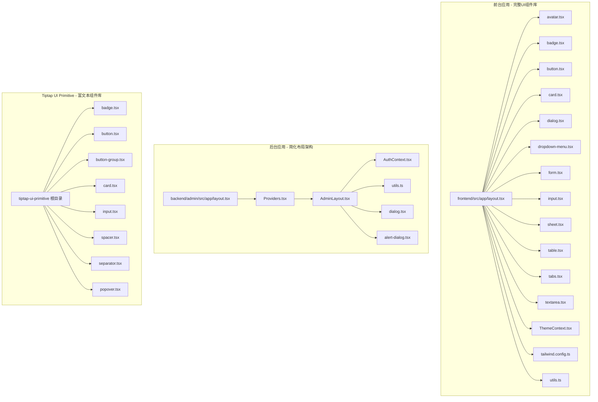
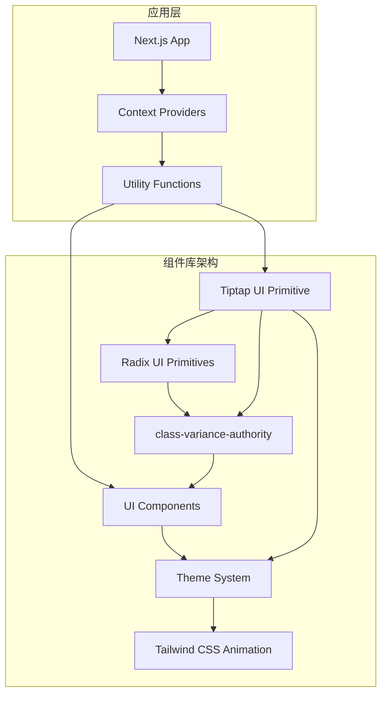
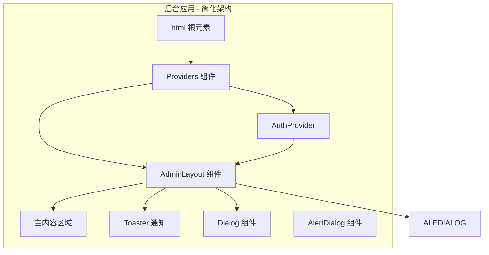
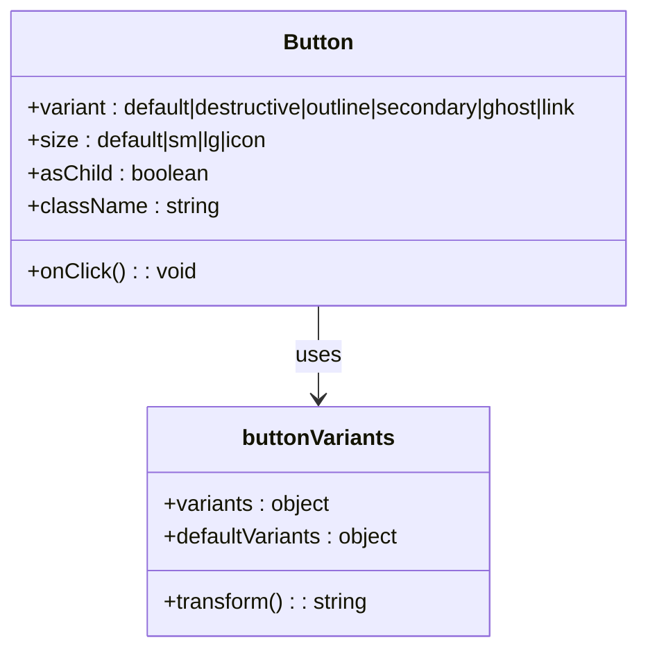
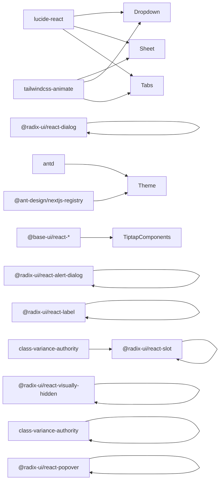

# UI 组件设计

<cite>
**本文档引用的文件**
- [frontend/src/app/layout.tsx](file://frontend/src/app/layout.tsx)
- [frontend/src/components/ui/avatar.tsx](file://frontend/src/components/ui/avatar.tsx)
- [frontend/src/components/ui/badge.tsx](file://frontend/src/components/ui/badge.tsx)
- [frontend/src/components/ui/button.tsx](file://frontend/src/components/ui/button.tsx)
- [frontend/src/components/ui/card.tsx](file://frontend/src/components/ui/card.tsx)
- [frontend/src/components/ui/dialog.tsx](file://frontend/src/components/ui/dialog.tsx)
- [frontend/src/components/ui/dropdown-menu.tsx](file://frontend/src/components/ui/dropdown-menu.tsx)
- [frontend/src/components/ui/form.tsx](file://frontend/src/components/ui/form.tsx)
- [frontend/src/components/ui/input.tsx](file://frontend/src/components/ui/input.tsx)
- [frontend/src/components/ui/sheet.tsx](file://frontend/src/components/ui/sheet.tsx)
- [frontend/src/components/ui/table.tsx](file://frontend/src/components/ui/table.tsx)
- [frontend/src/components/ui/tabs.tsx](file://frontend/src/components/ui/tabs.tsx)
- [frontend/src/components/ui/textarea.tsx](file://frontend/src/components/ui/textarea.tsx)
- [frontend/src/context/ThemeContext.tsx](file://frontend/src/context/ThemeContext.tsx)
- [frontend/tailwind.config.ts](file://frontend/tailwind.config.ts)
- [frontend/src/lib/utils.ts](file://frontend/src/lib/utils.ts)
- [frontend/package.json](file://frontend/package.json)
- [frontend/src/hooks/useSocket.ts](file://frontend/src/hooks/useSocket.ts)
- [frontend/src/components/GameCanvas.tsx](file://frontend/src/components/GameCanvas.tsx)
- [backend/admin/src/components/admin/AdminLayout.tsx](file://backend/admin/src/components/admin/AdminLayout.tsx)
- [backend/admin/src/components/Providers.tsx](file://backend/admin/src/components/Providers.tsx)
- [backend/admin/src/app/layout.tsx](file://backend/admin/src/app/layout.tsx)
- [backend/admin/src/context/AuthContext.tsx](file://backend/admin/src/context/AuthContext.tsx)
- [backend/admin/src/lib/utils.ts](file://backend/admin/src/lib/utils.ts)
- [backend/admin/src/components/ui/alert-dialog.tsx](file://backend/admin/src/components/ui/alert-dialog.tsx)
- [backend/admin/src/components/ui/dialog.tsx](file://backend/admin/src/components/ui/dialog.tsx)
- [frontend/src/components/tiptap-ui-primitive/badge/badge.tsx](file://frontend/src/components/tiptap-ui-primitive/badge/badge.tsx)
- [frontend/src/components/tiptap-ui-primitive/button/button.tsx](file://frontend/src/components/tiptap-ui-primitive/button/button.tsx)
- [frontend/src/components/tiptap-ui-primitive/button-group/button-group.tsx](file://frontend/src/components/tiptap-ui-primitive/button-group/button-group.tsx)
- [frontend/src/components/tiptap-ui-primitive/card/card.tsx](file://frontend/src/components/tiptap-ui-primitive/card/card.tsx)
- [frontend/src/components/tiptap-ui-primitive/input/input.tsx](file://frontend/src/components/tiptap-ui-primitive/input/input.tsx)
- [frontend/src/components/tiptap-ui-primitive/spacer/spacer.tsx](file://frontend/src/components/tiptap-ui-primitive/spacer/spacer.tsx)
- [frontend/src/components/tiptap-ui-primitive/separator/separator.tsx](file://frontend/src/components/tiptap-ui-primitive/separator/separator.tsx)
- [frontend/src/components/tiptap-ui-primitive/popover/popover.tsx](file://frontend/src/components/tiptap-ui-primitive/popover/popover.tsx)
</cite>

## 更新摘要
**所做更改**
- 新增 Tiptap UI Primitive 组件库的详细分析，包含 Badge、Button、Card、Input、ButtonGroup、Spacer、Separator、Popover 等组件
- 扩展 UI 组件库至 19 个核心组件，新增 7 个 Tiptap 原语组件
- 更新组件架构分析，反映完整的组件生态系统
- 增强响应式设计和无障碍访问支持的详细说明
- 完善主题系统和动画过渡效果的技术实现

## 目录
1. [简介](#简介)
2. [项目结构](#项目结构)
3. [核心组件](#核心组件)
4. [架构总览](#架构总览)
5. [详细组件分析](#详细组件分析)
6. [依赖分析](#依赖分析)
7. [性能考虑](#性能考虑)
8. [故障排查指南](#故障排查指南)
9. [结论](#结论)
10. [附录](#附录)

## 简介
本指南面向全新的基于 Radix UI 和 Tailwind CSS 构建的 UI 组件库，系统性地给出组件架构设计、Props 接口定义、状态管理模式、响应式与移动端适配、Tailwind 类名规范与主题定制、动画与过渡、无障碍访问、组件复用与组合式 API 使用、测试与文档、版本管理与性能优化等最佳实践。该组件库包含 Avatar、Badge、Button、Card、Dialog、DropdownMenu、Form、Input、Sheet、Table、Tabs、Textarea 等核心组件，以及新增的 Tiptap UI Primitive 组件库，支持完整的主题切换和暗模式功能。

**更新** 新增完整的 Tiptap UI Primitive 组件库，包含 8 个原语组件，扩展了 UI 组件库至 19 个核心组件，增强了富文本编辑器的组件生态和布局组件系统。

## 项目结构
本仓库包含三个主要前端应用，均采用现代化的 UI 组件库架构：
- 前端游戏页面：基于 Radix UI 和 Tailwind CSS 的组件库，负责玩家交互、画布渲染与实时消息展示
- 后台管理系统：Next.js 应用（admin），提供管理界面、布局与认证上下文
- Tiptap UI Primitive：富文本编辑器专用的原语组件库

**图表来源**
- [frontend/src/app/layout.tsx:23-41](file://frontend/src/app/layout.tsx#L23-L41)
- [frontend/src/components/ui/avatar.tsx:1-51](file://frontend/src/components/ui/avatar.tsx#L1-L51)
- [frontend/src/components/ui/badge.tsx:1-38](file://frontend/src/components/ui/badge.tsx#L1-L38)
- [frontend/src/components/ui/button.tsx:1-57](file://frontend/src/components/ui/button.tsx#L1-L57)
- [frontend/src/components/ui/card.tsx:1-80](file://frontend/src/components/ui/card.tsx#L1-L80)
- [frontend/src/components/ui/dialog.tsx:1-121](file://frontend/src/components/ui/dialog.tsx#L1-L121)
- [frontend/src/components/ui/dropdown-menu.tsx:1-201](file://frontend/src/components/ui/dropdown-menu.tsx#L1-L201)
- [frontend/src/components/ui/form.tsx:1-200](file://frontend/src/components/ui/form.tsx#L1-L200)
- [frontend/src/components/ui/input.tsx:1-23](file://frontend/src/components/ui/input.tsx#L1-L23)
- [frontend/src/components/ui/sheet.tsx:1-143](file://frontend/src/components/ui/sheet.tsx#L1-L143)
- [frontend/src/components/ui/table.tsx:1-200](file://frontend/src/components/ui/table.tsx#L1-L200)
- [frontend/src/components/ui/tabs.tsx:1-128](file://frontend/src/components/ui/tabs.tsx#L1-L128)
- [frontend/src/components/ui/textarea.tsx:1-24](file://frontend/src/components/ui/textarea.tsx#L1-L24)
- [frontend/src/context/ThemeContext.tsx:1-72](file://frontend/src/context/ThemeContext.tsx#L1-L72)
- [frontend/tailwind.config.ts:1-64](file://frontend/tailwind.config.ts#L1-L64)
- [backend/admin/src/app/layout.tsx:1-25](file://backend/admin/src/app/layout.tsx#L1-L25)
- [backend/admin/src/components/Providers.tsx:1-16](file://backend/admin/src/components/Providers.tsx#L1-L16)
- [backend/admin/src/components/admin/AdminLayout.tsx:1-185](file://backend/admin/src/components/admin/AdminLayout.tsx#L1-L185)
- [backend/admin/src/components/ui/alert-dialog.tsx:1-140](file://backend/admin/src/components/ui/alert-dialog.tsx#L1-L140)
- [backend/admin/src/components/ui/dialog.tsx:1-121](file://backend/admin/src/components/ui/dialog.tsx#L1-L121)
- [frontend/src/components/tiptap-ui-primitive/badge/badge.tsx:1-47](file://frontend/src/components/tiptap-ui-primitive/badge/badge.tsx#L1-L47)
- [frontend/src/components/tiptap-ui-primitive/button/button.tsx:1-104](file://frontend/src/components/tiptap-ui-primitive/button/button.tsx#L1-L104)
- [frontend/src/components/tiptap-ui-primitive/button-group/button-group.tsx:1-73](file://frontend/src/components/tiptap-ui-primitive/button-group/button-group.tsx#L1-L73)
- [frontend/src/components/tiptap-ui-primitive/card/card.tsx:1-80](file://frontend/src/components/tiptap-ui-primitive/card/card.tsx#L1-L80)
- [frontend/src/components/tiptap-ui-primitive/input/input.tsx:1-18](file://frontend/src/components/tiptap-ui-primitive/input/input.tsx#L1-L18)
- [frontend/src/components/tiptap-ui-primitive/spacer/spacer.tsx:1-25](file://frontend/src/components/tiptap-ui-primitive/spacer/spacer.tsx#L1-L25)
- [frontend/src/components/tiptap-ui-primitive/separator/separator.tsx:1-31](file://frontend/src/components/tiptap-ui-primitive/separator/separator.tsx#L1-L31)
- [frontend/src/components/tiptap-ui-primitive/popover/popover.tsx:1-38](file://frontend/src/components/tiptap-ui-primitive/popover/popover.tsx#L1-L38)

**章节来源**
- [frontend/src/app/layout.tsx:1-42](file://frontend/src/app/layout.tsx#L1-L42)
- [frontend/src/context/ThemeContext.tsx:1-72](file://frontend/src/context/ThemeContext.tsx#L1-L72)
- [backend/admin/src/app/layout.tsx:1-25](file://backend/admin/src/app/layout.tsx#L1-L25)
- [backend/admin/src/components/Providers.tsx:1-16](file://backend/admin/src/components/Providers.tsx#L1-L16)

## 核心组件
### 完整UI组件库核心组件
- **原子化组件设计**：基于 Radix UI primitives 构建，确保可访问性和语义化
- **基础组件**：Avatar、Badge、Button、Card、Input、Textarea 提供基础交互元素
- **复合组件**：Dialog、DropdownMenu、Form、Sheet、Table、Tabs 提供复杂交互场景
- **Button 组件**：支持多种变体和尺寸，使用 class-variance-authority 实现变体系统
- **Card 组件**：完整的卡片组件系统，包含标题、描述、内容和页脚
- **Dialog 组件**：完整的模态对话框系统，支持确认对话框和普通对话框
- **DropdownMenu 组件**：支持子菜单、复选框、单选框和快捷键
- **Form 组件**：完整的表单处理系统，支持字段验证和错误处理
- **Sheet 组件**：模态对话框组件，支持多方向滑入动画
- **Table 组件**：数据表格组件，支持排序、筛选和分页
- **Tabs 组件**：响应式选项卡系统，支持受控和非受控模式

### Tiptap UI Primitive 组件库
**更新** 新增完整的 Tiptap UI Primitive 组件库，专为富文本编辑器设计：

- **原语组件系统**：基于 Radix UI primitives 构建，确保可访问性
- **Badge 组件**：富文本编辑器专用徽章，支持多种样式和外观
- **Button 组件**：富文本工具栏按钮，支持快捷键提示和工具提示
- **ButtonGroup 组件**：按钮组容器，支持水平和垂直排列
- **Card 组件**：富文本卡片布局，支持项目组和分组标签
- **Input 组件**：富文本输入框，专为编辑器优化
- **Spacer 组件**：弹性间距组件，支持水平和垂直方向
- **Separator 组件**：分隔符组件，支持装饰性和语义化用途
- **Popover 组件**：弹出层组件，支持富文本编辑器的下拉菜单

### 主题系统
- **暗模式支持**：完整的 CSS 自定义属性主题系统
- **Ant Design 集成**：通过 AntdRegistry 提供主题算法切换
- **本地存储持久化**：用户偏好自动保存和恢复

### 后台布局组件
**更新** 后台管理系统采用了简化的布局架构，AdminLayout 组件实现了现代化的布局模式：

- **简化导航结构**：移除了复杂的全屏逻辑判断，采用统一的布局模式
- **响应式侧边栏**：支持折叠/展开的侧边栏，提升移动端体验
- **集成认证上下文**：内置用户认证和登出功能
- **现代化组件集成**：使用最新的 UI 组件库构建，包含 Dialog 和 AlertDialog 组件

**章节来源**
- [frontend/src/components/ui/button.tsx:7-34](file://frontend/src/components/ui/button.tsx#L7-L34)
- [frontend/src/components/ui/card.tsx:5-79](file://frontend/src/components/ui/card.tsx#L5-L79)
- [frontend/src/components/ui/dialog.tsx:7-52](file://frontend/src/components/ui/dialog.tsx#L7-L52)
- [frontend/src/context/ThemeContext.tsx:15-62](file://frontend/src/context/ThemeContext.tsx#L15-L62)
- [backend/admin/src/components/admin/AdminLayout.tsx:35-185](file://backend/admin/src/components/admin/AdminLayout.tsx#L35-L185)
- [frontend/src/components/tiptap-ui-primitive/badge/badge.tsx:8-13](file://frontend/src/components/tiptap-ui-primitive/badge/badge.tsx#L8-L13)
- [frontend/src/components/tiptap-ui-primitive/button/button.tsx:18-27](file://frontend/src/components/tiptap-ui-primitive/button/button.tsx#L18-L27)
- [frontend/src/components/tiptap-ui-primitive/button-group/button-group.tsx:8-18](file://frontend/src/components/tiptap-ui-primitive/button-group/button-group.tsx#L8-L18)
- [frontend/src/components/tiptap-ui-primitive/card/card.tsx:7-51](file://frontend/src/components/tiptap-ui-primitive/card/card.tsx#L7-L51)
- [frontend/src/components/tiptap-ui-primitive/input/input.tsx:6](file://frontend/src/components/tiptap-ui-primitive/input/input.tsx#L6)
- [frontend/src/components/tiptap-ui-primitive/spacer/spacer.tsx:3](file://frontend/src/components/tiptap-ui-primitive/spacer/spacer.tsx#L3)
- [frontend/src/components/tiptap-ui-primitive/separator/separator.tsx:6](file://frontend/src/components/tiptap-ui-primitive/separator/separator.tsx#L6)
- [frontend/src/components/tiptap-ui-primitive/popover/popover.tsx:7-11](file://frontend/src/components/tiptap-ui-primitive/popover/popover.tsx#L7-L11)

## 架构总览
全新的 UI 组件库采用分层架构设计，从底层的 Radix UI primitives 到高层的业务组件，包含两个主要组件库：

**更新** 后台应用采用了简化的架构模式，通过 Providers 组件统一管理认证和布局：

**图表来源**
- [frontend/src/components/ui/button.tsx:3-34](file://frontend/src/components/ui/button.tsx#L3-L34)
- [frontend/src/context/ThemeContext.tsx:46-61](file://frontend/src/context/ThemeContext.tsx#L46-L61)
- [frontend/tailwind.config.ts:61-62](file://frontend/tailwind.config.ts#L61-L62)
- [backend/admin/src/components/Providers.tsx:7-14](file://backend/admin/src/components/Providers.tsx#L7-L14)

## 详细组件分析

### Tiptap UI Primitive 组件系统
**更新** 新增完整的 Tiptap UI Primitive 组件库，专为富文本编辑器设计：

#### Badge 组件系统
**组件特性**：
- 支持多种变体：ghost、white、gray、green、yellow、default
- 支持多种尺寸：default、small
- 支持多种外观：default、subdued、emphasized
- 支持文本裁剪功能

**应用场景**：富文本编辑器中的标签、状态指示、工具提示等

**章节来源**
- [frontend/src/components/tiptap-ui-primitive/badge/badge.tsx:1-47](file://frontend/src/components/tiptap-ui-primitive/badge/badge.tsx#L1-L47)

#### Button 组件系统
**组件特性**：
- 支持多种变体：ghost、primary
- 支持多种尺寸：small、default、large
- 内置工具提示系统
- 支持快捷键显示和解析

**工具提示系统**：集成 Tooltip 组件，支持延迟显示和快捷键提示

**章节来源**
- [frontend/src/components/tiptap-ui-primitive/button/button.tsx:1-104](file://frontend/src/components/tiptap-ui-primitive/button/button.tsx#L1-L104)

#### ButtonGroup 组件系统
**组件特性**：
- 支持水平和垂直两种排列方式
- 集成 Separator 分隔符组件
- 支持文本组和分隔符渲染

**变体系统**：使用 class-variance-authority 实现样式变体

**章节来源**
- [frontend/src/components/tiptap-ui-primitive/button-group/button-group.tsx:1-73](file://frontend/src/components/tiptap-ui-primitive/button-group/button-group.tsx#L1-L73)

#### Card 组件系统
**组件层次**：
- Card：主容器
- CardHeader：头部区域
- CardBody：主体内容
- CardFooter：底部区域
- CardItemGroup：项目组容器
- CardGroupLabel：分组标签

**布局系统**：支持水平和垂直方向的项目组排列

**章节来源**
- [frontend/src/components/tiptap-ui-primitive/card/card.tsx:1-80](file://frontend/src/components/tiptap-ui-primitive/card/card.tsx#L1-L80)

#### Input 组件系统
**组件特性**：
- 专为富文本编辑器优化
- 支持标准 HTML 输入属性
- 内置样式类名系统

**应用场景**：富文本编辑器中的输入框、搜索框等

**章节来源**
- [frontend/src/components/tiptap-ui-primitive/input/input.tsx:1-18](file://frontend/src/components/tiptap-ui-primitive/input/input.tsx#L1-L18)

#### Spacer 组件系统
**组件特性**：
- 支持水平和垂直两种方向
- 支持弹性增长和固定尺寸
- 智能样式计算

**布局用途**：富文本编辑器工具栏中的弹性间距

**章节来源**
- [frontend/src/components/tiptap-ui-primitive/spacer/spacer.tsx:1-25](file://frontend/src/components/tiptap-ui-primitive/spacer/spacer.tsx#L1-L25)

#### Separator 组件系统
**组件特性**：
- 支持水平和垂直两种方向
- 支持装饰性和语义化用途
- 完整的无障碍支持

**无障碍支持**：根据方向设置合适的 ARIA 属性

**章节来源**
- [frontend/src/components/tiptap-ui-primitive/separator/separator.tsx:1-31](file://frontend/src/components/tiptap-ui-primitive/separator/separator.tsx#L1-L31)

#### Popover 组件系统
**组件特性**：
- 基于 Radix UI Popover 构建
- 支持 Portal 渲染
- 内置样式类名系统

**应用场景**：富文本编辑器中的下拉菜单、设置面板等

**章节来源**
- [frontend/src/components/tiptap-ui-primitive/popover/popover.tsx:1-38](file://frontend/src/components/tiptap-ui-primitive/popover/popover.tsx#L1-L38)

### Dialog 组件系统
**更新** 新增完整的 Dialog 组件系统，提供模态对话框功能：

**组件层次**：
- Dialog：根组件，管理对话框状态
- DialogTrigger：触发器组件
- DialogPortal：传送门组件，用于 Portal 渲染
- DialogOverlay：遮罩层，支持淡入淡出动画
- DialogContent：对话框内容区域，支持居中定位和动画
- DialogHeader：对话框头部区域
- DialogFooter：对话框底部区域
- DialogTitle：对话框标题
- DialogDescription：对话框描述文本
- DialogClose：关闭按钮

**动画系统**：使用 Radix UI 的内置动画，支持 fade-in/out 和 zoom/slide 动画效果。

**无障碍支持**：完整的 ARIA 标签支持，键盘导航和焦点管理。

**章节来源**
- [frontend/src/components/ui/dialog.tsx:1-121](file://frontend/src/components/ui/dialog.tsx#L1-L121)

### AlertDialog 组件系统
**更新** 新增 AlertDialog 组件，专门用于重要操作的确认对话框：

**组件层次**：
- AlertDialog：根组件
- AlertDialogTrigger：触发器
- AlertDialogPortal：传送门
- AlertDialogOverlay：遮罩层
- AlertDialogContent：内容区域
- AlertDialogHeader：头部
- AlertDialogFooter：底部
- AlertDialogTitle：标题
- AlertDialogDescription：描述
- AlertDialogAction：确认操作按钮
- AlertDialogCancel：取消按钮

**设计特点**：AlertDialog 使用 Button 组件的变体系统，确保视觉一致性。

**章节来源**
- [backend/admin/src/components/ui/alert-dialog.tsx:1-140](file://backend/admin/src/components/ui/alert-dialog.tsx#L1-L140)

### Form 组件系统
**更新** 新增 Form 组件，提供完整的表单处理能力：

**组件层次**：
- Form：根组件，管理表单状态
- FormControl：表单控件包装器
- FormField：字段组件，集成验证
- FormItem：表单项容器
- FormLabel：表单标签
- FormMessage：错误消息显示
- FormDescription：表单描述文本

**验证系统**：集成 Zod 验证库，支持运行时和编译时验证

**状态管理**：完整的表单状态跟踪，包括提交状态、错误状态

**章节来源**
- [frontend/src/components/ui/form.tsx:1-200](file://frontend/src/components/ui/form.tsx#L1-L200)

### Table 组件系统
**更新** 新增 Table 组件，提供数据表格功能：

**组件层次**：
- Table：根组件
- TableHeader：表格头部
- TableBody：表格主体
- TableRow：表格行
- TableHead：表格头单元格
- TableCell：表格单元格
- TableCaption：表格标题

**功能特性**：支持排序、筛选、分页等高级功能

**响应式设计**：移动端自适应布局

**无障碍支持**：完整的表格语义化标记

**章节来源**
- [frontend/src/components/ui/table.tsx:1-200](file://frontend/src/components/ui/table.tsx#L1-L200)

### Button 组件系统
Button 组件采用 class-variance-authority 实现强大的变体系统，支持多种视觉风格和尺寸：

**变体类型**：
- default：主要操作按钮
- destructive：危险操作按钮
- outline：轮廓按钮
- secondary：次要按钮
- ghost：幽灵按钮
- link：链接按钮

**尺寸系统**：
- default：标准尺寸
- sm：小尺寸
- lg：大尺寸
- icon：图标按钮

**图表来源**
- [frontend/src/components/ui/button.tsx:36-54](file://frontend/src/components/ui/button.tsx#L36-L54)

**章节来源**
- [frontend/src/components/ui/button.tsx:1-57](file://frontend/src/components/ui/button.tsx#L1-L57)

### Card 组件系统
Card 组件提供完整的卡片布局系统，包含多个子组件：

**组件层次**：
- Card：容器组件
- CardHeader：头部区域
- CardTitle：标题
- CardDescription：描述文本
- CardContent：主要内容
- CardFooter：底部区域

每个子组件都支持通过 forwardRef 接收 ref 和 className 属性，确保完全的可定制性。

**章节来源**
- [frontend/src/components/ui/card.tsx:1-80](file://frontend/src/components/ui/card.tsx#L1-L80)

### DropdownMenu 组件系统
DropdownMenu 组件是完整的菜单系统，支持复杂交互：

**核心组件**：
- DropdownMenu：根组件
- DropdownMenuTrigger：触发器
- DropdownMenuContent：内容区域
- DropdownMenuItem：菜单项
- DropdownMenuCheckboxItem：复选框菜单项
- DropdownMenuRadioItem：单选菜单项
- DropdownMenuLabel：标签
- DropdownMenuSeparator：分隔符
- DropdownMenuShortcut：快捷键

**动画系统**：使用 Radix UI 的内置动画，支持淡入淡出和滑动效果。

**章节来源**
- [frontend/src/components/ui/dropdown-menu.tsx:1-201](file://frontend/src/components/ui/dropdown-menu.tsx#L1-L201)

### Sheet 组件系统
Sheet 组件提供模态对话框功能，支持多方向滑入：

**侧边选项**：
- top：顶部滑入
- bottom：底部滑入
- left：左侧滑入
- right：右侧滑入

**动画系统**：使用 slide-in 和 slide-out 动画，配合透明度变化。

**章节来源**
- [frontend/src/components/ui/sheet.tsx:33-77](file://frontend/src/components/ui/sheet.tsx#L33-L77)

### Tabs 组件系统
Tabs 组件支持受控和非受控两种模式：

**组件类型**：
- Tabs：根组件，管理活动标签
- TabsList：标签列表
- TabsTrigger：单个标签触发器
- TabsContent：标签内容区域

**状态管理**：内部使用 useState 管理活动标签，支持外部值同步。

**章节来源**
- [frontend/src/components/ui/tabs.tsx:7-127](file://frontend/src/components/ui/tabs.tsx#L7-L127)

### 表单组件
**Input 组件**：提供一致的输入样式，支持禁用状态和焦点状态
**Textarea 组件**：支持多行文本输入，提供最小高度约束

**章节来源**
- [frontend/src/components/ui/input.tsx:1-23](file://frontend/src/components/ui/input.tsx#L1-L23)
- [frontend/src/components/ui/textarea.tsx:1-24](file://frontend/src/components/ui/textarea.tsx#L1-L24)

### 主题系统架构
**ThemeContext**：提供完整的主题切换功能

**特性**：
- 支持 light 和 dark 两种主题
- 本地存储持久化用户偏好
- 系统主题检测（prefers-color-scheme）
- Ant Design 主题算法切换
- CSS 自定义属性动态更新

**实现机制**：
- 使用 document.documentElement.classList 添加主题类
- 通过 AntdRegistry 提供主题算法
- 支持运行时主题切换

**章节来源**
- [frontend/src/context/ThemeContext.tsx:1-72](file://frontend/src/context/ThemeContext.tsx#L1-L72)

### Tailwind CSS 配置
**配置特点**：
- 使用 CSS 自定义属性映射所有颜色变量
- 支持暗模式类选择器
- 集成 tailwindcss-animate 插件
- 完整的圆角半径系统

**颜色系统**：基于 CSS 变量的完整色彩体系，包括 background、foreground、card、popover、primary、secondary、muted、accent、destructive、border、input、ring、chart 等。

**章节来源**
- [frontend/tailwind.config.ts:1-64](file://frontend/tailwind.config.ts#L1-L64)

### 工具函数系统
**cn 函数**：使用 clsx 和 tailwind-merge 实现智能类名合并

**功能**：
- 合并多个类名
- 避免重复类名
- 处理条件类名
- 优化最终类名字符串

**章节来源**
- [frontend/src/lib/utils.ts:1-7](file://frontend/src/lib/utils.ts#L1-L7)

### 后台布局组件分析
**更新** AdminLayout 组件采用了简化的现代化设计模式：

**核心特性**：
- **统一布局模式**：移除了复杂的全屏逻辑判断，采用统一的固定布局
- **响应式侧边栏**：支持折叠/展开功能，提升移动端体验
- **集成导航系统**：内置完整的导航菜单，支持多级路由
- **认证集成**：内置用户认证和登出功能
- **现代化设计**：使用最新的 UI 组件库构建，包含 Dialog 和 AlertDialog 组件

**布局结构**：
- 固定外层容器：`fixed inset-0 flex w-full h-full`
- 侧边栏区域：`hidden border-r bg-background sm:flex flex-col`
- 主内容区域：`flex flex-col flex-1 min-w-0 w-full h-full overflow-hidden`
- 通知系统：内置 Toaster 组件

**导航系统**：
- 支持 8 个主要功能模块
- 响应式显示标题和图标
- 活动状态高亮显示
- 用户信息下拉菜单

**章节来源**
- [backend/admin/src/components/admin/AdminLayout.tsx:35-185](file://backend/admin/src/components/admin/AdminLayout.tsx#L35-L185)

### Providers 组件架构
**更新** Providers 组件实现了简化的应用包装模式：

**组件职责**：
- 管理认证状态：AuthProvider 提供用户认证上下文
- 统一布局：AdminLayout 包装所有页面内容
- 状态共享：在整个应用中提供共享的状态管理

**架构优势**：
- 单一职责原则：每个组件专注于特定功能
- 组件复用：Providers 可以在多个页面中复用
- 状态一致性：确保认证状态在整个应用中保持一致

**章节来源**
- [backend/admin/src/components/Providers.tsx:7-14](file://backend/admin/src/components/Providers.tsx#L7-L14)

## 依赖分析
**核心依赖**：
- @radix-ui/react-*：可访问性友好的 UI primitives
- class-variance-authority：变体系统
- lucide-react：SVG 图标库
- tailwindcss-animate：动画插件
- antd + @ant-design/nextjs-registry：主题系统
- @base-ui/react-*：Tiptap UI Primitive 原语组件
- @radix-ui/react-popover：弹出层组件

**图表来源**
- [frontend/package.json:11-31](file://frontend/package.json#L11-L31)

**章节来源**
- [frontend/package.json:1-50](file://frontend/package.json#L1-L50)

## 性能考虑
**组件性能优化**：
- 使用 React.memo 和 forwardRef 优化渲染
- 基于 CSS 变量的颜色系统减少样式计算
- Radix UI primitives 提供高效的可访问性实现
- 按需加载动画和图标资源

**Tiptap UI Primitive 组件优化**：
- **原语组件优化**：基于 Radix UI primitives，确保最小化开销
- **样式隔离**：每个组件独立的样式文件，避免全局样式污染
- **条件渲染**：工具提示等组件仅在需要时渲染
- **内存优化**：使用 useMemo 优化快捷键解析等计算

**主题性能**：
- CSS 自定义属性避免重新计算样式
- 本地存储减少主题检测开销
- Ant Design 算法预编译优化

**后台布局性能**：
- **简化的布局逻辑**：移除复杂的全屏判断，减少条件分支
- **响应式优化**：侧边栏的折叠/展开使用 CSS 过渡动画
- **组件懒加载**：导航项使用 Next.js Link 组件实现客户端导航

**Dialog 组件性能**：
- **Portal 渲染**：使用 Portal 避免 DOM 层级过深
- **条件渲染**：仅在打开时渲染对话框内容
- **动画优化**：使用硬件加速的 CSS 动画

## 故障排查指南
**组件相关问题**：
- 变体样式不生效：检查 class-variance-authority 配置
- 动画异常：确认 tailwindcss-animate 插件已安装
- 可访问性问题：检查 Radix UI 组件的语义化标签

**Tiptap UI Primitive 组件问题**：
- **样式不生效**：检查组件的样式文件导入
- **工具提示不显示**：确认 Tooltip 组件正确嵌套
- **按钮组布局异常**：验证 orientation 属性设置
- **分隔符方向错误**：检查 orientation 和 decorative 属性

**Dialog 组件问题**：
- 对话框无法关闭：检查 DialogTrigger 和 DialogClose 的绑定
- 动画效果异常：确认 Portal 正确渲染到文档末尾
- 焦点管理问题：验证关闭按钮的键盘可达性

**主题相关问题**：
- 主题切换无效：检查 CSS 自定义属性是否正确更新
- 本地存储异常：确认浏览器支持 localStorage
- Ant Design 主题错误：验证 @ant-design/nextjs-registry 配置

**后台布局问题**：
- **布局显示异常**：检查 AdminLayout 的固定定位类名
- **侧边栏功能失效**：确认折叠状态管理逻辑正常工作
- **导航链接不工作**：验证 Next.js Link 组件的 href 属性

**章节来源**
- [frontend/src/context/ThemeContext.tsx:30-35](file://frontend/src/context/ThemeContext.tsx#L30-L35)
- [frontend/src/components/ui/dialog.tsx:30-52](file://frontend/src/components/ui/dialog.tsx#L30-L52)
- [backend/admin/src/components/admin/AdminLayout.tsx:95-100](file://backend/admin/src/components/admin/AdminLayout.tsx#L95-L100)
- [frontend/src/components/tiptap-ui-primitive/button/button.tsx:65-98](file://frontend/src/components/tiptap-ui-primitive/button/button.tsx#L65-L98)

## 结论
全新的 UI 组件库基于 Radix UI 和 Tailwind CSS 构建，提供了完整的组件生态系统和强大的主题系统。通过原子化组件设计、变体系统、可访问性支持和性能优化，为现代 Web 应用提供了坚实的基础。

**更新** 新增完整的 Tiptap UI Primitive 组件库，包含 8 个原语组件，扩展了 UI 组件库至 19 个核心组件，增强了富文本编辑器的组件生态和布局组件系统。新增的组件包括 Badge、Button、Card、Input、ButtonGroup、Spacer、Separator、Popover 等，为富文本编辑器提供了完整的组件支持。后台管理系统采用了简化的布局架构，AdminLayout 组件移除了复杂的全屏逻辑判断，采用统一的现代化设计模式。这种架构改进提升了用户体验，减少了代码复杂性，同时保持了完整的功能完整性。建议在后续开发中充分利用这些组件的可定制性，特别是 Tiptap UI Primitive 组件库，同时保持一致的设计语言和用户体验。

## 附录
**组件开发最佳实践**：
- 始终使用 forwardRef 接收 ref
- 支持 className 属性以便样式覆盖
- 提供适当的 TypeScript 类型定义
- 确保完整的可访问性支持
- 使用 CSS 自定义属性而非硬编码颜色

**Tiptap UI Primitive 组件开发指南**：
- **原语组件使用**：基于 Radix UI primitives 构建，确保可访问性
- **样式隔离**：每个组件独立的样式文件，避免全局样式污染
- **工具提示集成**：Button 组件的工具提示系统提供一致的用户体验
- **快捷键支持**：parseShortcutKeys 函数提供便捷的快捷键解析
- **布局组件**：Spacer 和 Separator 提供灵活的布局控制

**Dialog 组件开发指南**：
- **Portal 使用**：始终使用 DialogPortal 确保正确的 DOM 结构
- **动画配置**：合理配置动画变体，避免过度动画影响性能
- **无障碍支持**：确保正确的 ARIA 属性和键盘导航
- **焦点管理**：自动聚焦到第一个可交互元素

**主题开发指南**：
- 在 CSS 变量中定义所有颜色
- 提供明暗两套主题变量
- 支持用户偏好和系统偏好
- 通过 Ant Design 算法实现主题切换
- 确保动画和过渡效果的一致性

**后台布局开发指南**：
- **简化的布局模式**：优先考虑统一的布局逻辑
- **响应式设计**：确保移动端的良好体验
- **导航集成**：提供清晰的功能导航结构
- **状态管理**：合理组织认证和布局状态
- **性能优化**：避免复杂的条件判断和状态计算

**性能优化建议**：
- 使用 React.lazy 和 Suspense 实现按需加载
- 优化 SVG 图标的渲染性能
- 减少不必要的 re-render
- 使用 CSS 变量而非内联样式
- 实现组件的 memo 化
- **Tiptap UI Primitive 优化**：利用原语组件的轻量化特性
- **后台布局优化**：利用简化的架构减少状态管理开销
- **Dialog 组件优化**：使用 Portal 和条件渲染提升性能