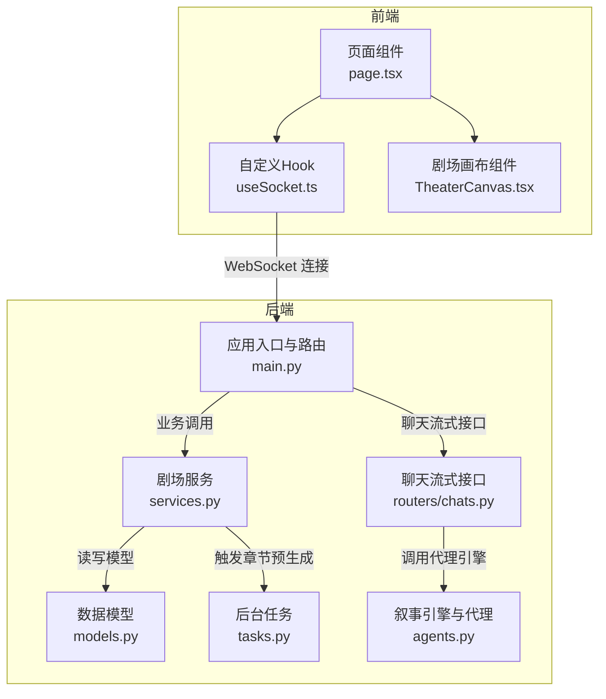
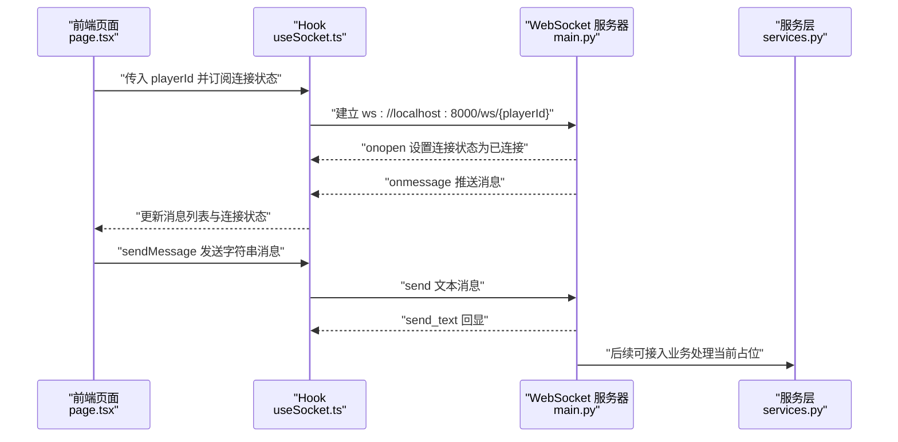
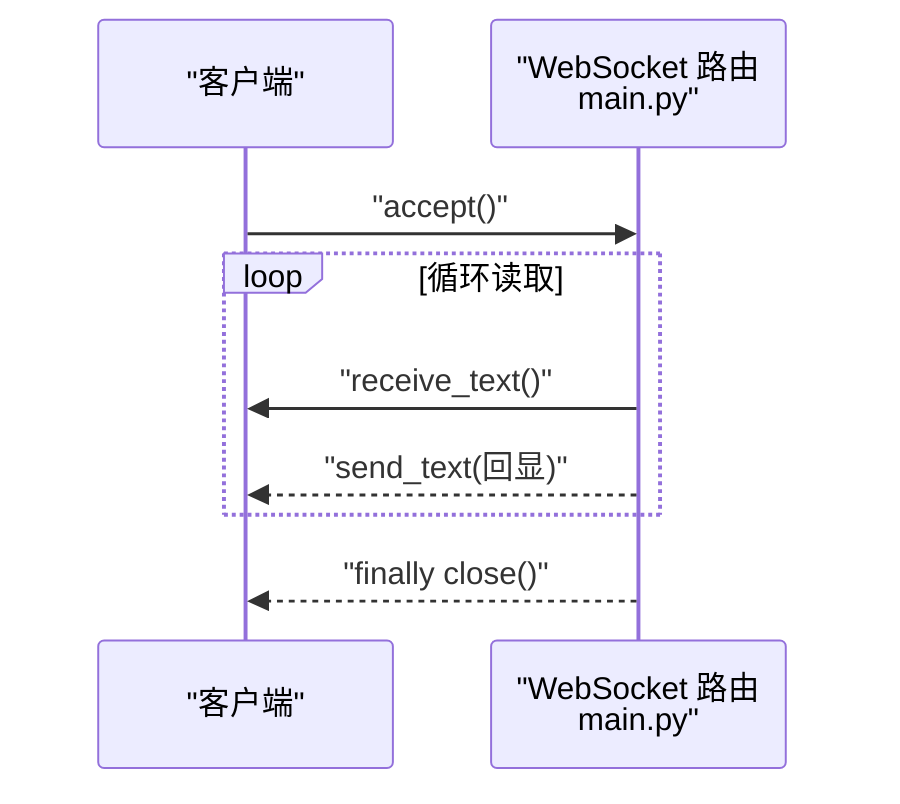
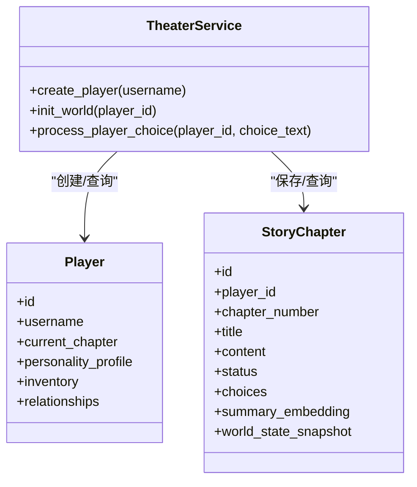
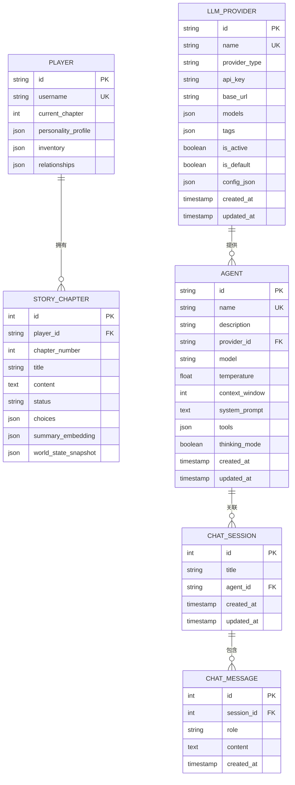
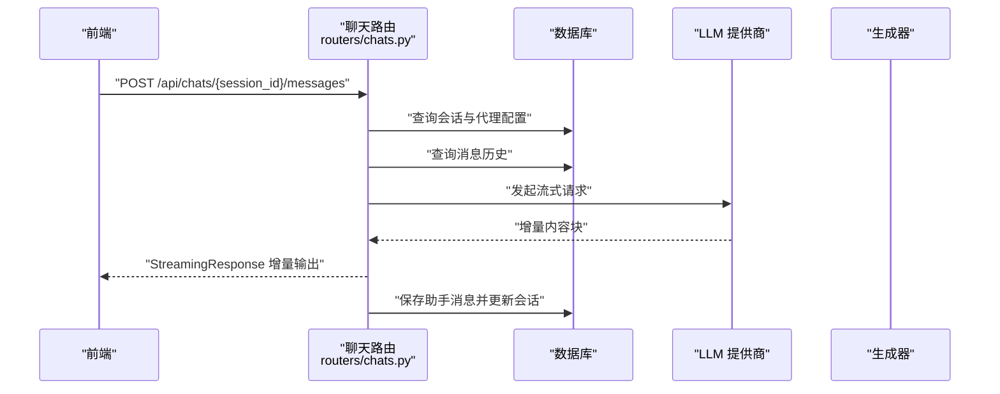
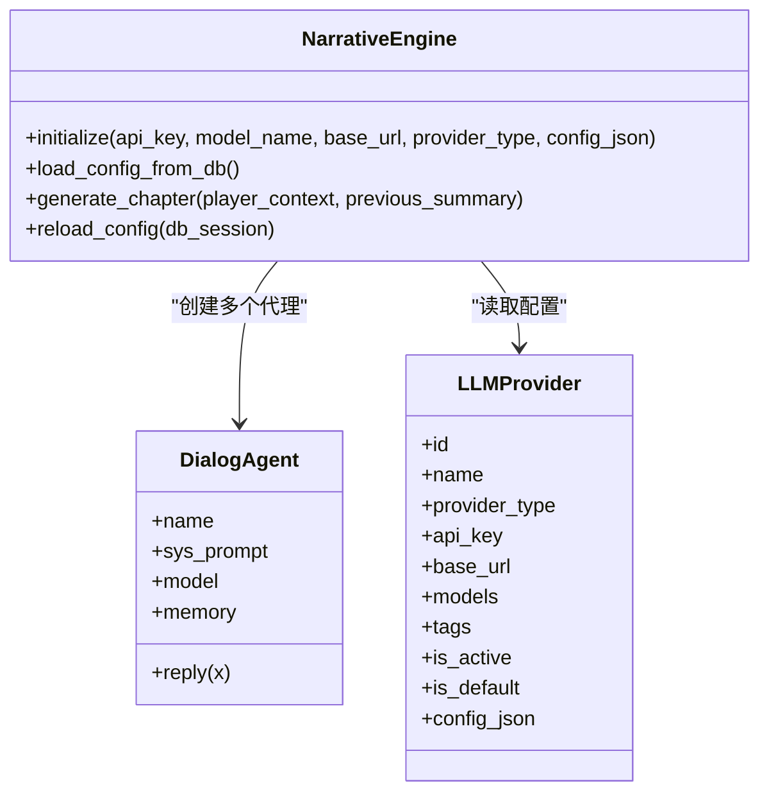
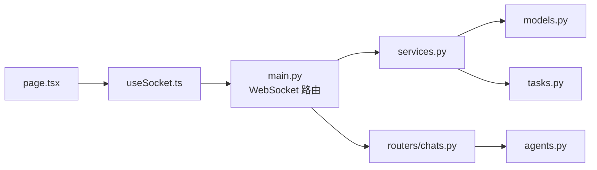

# WebSocket 实时通信

<cite>
**本文引用的文件**
- [frontend/src/hooks/useSocket.ts](file://frontend/src/hooks/useSocket.ts)
- [frontend/src/app/page.tsx](file://frontend/src/app/page.tsx)
- [frontend/src/components/TheaterCanvas.tsx](file://frontend/src/components/TheaterCanvas.tsx)
- [backend/main.py](file://backend/main.py)
- [backend/services.py](file://backend/services.py)
- [backend/models.py](file://backend/models.py)
- [backend/routers/chats.py](file://backend/routers/chats.py)
- [backend/agents.py](file://backend/agents.py)
- [backend/tasks.py](file://backend/tasks.py)
</cite>

## 目录
1. [简介](#简介)
2. [项目结构](#项目结构)
3. [核心组件](#核心组件)
4. [架构总览](#架构总览)
5. [详细组件分析](#详细组件分析)
6. [依赖关系分析](#依赖关系分析)
7. [性能考虑](#性能考虑)
8. [故障排查指南](#故障排查指南)
9. [结论](#结论)
10. [附录](#附录)

## 简介
本技术文档围绕基于 WebSocket 的实时通信系统进行深入解析，覆盖连接建立、心跳与断线重连、消息协议与序列化、React Hooks 在 WebSocket 中的应用模式、状态管理与副作用处理、消息队列与缓冲区管理、消息去重策略、错误处理与异常恢复、性能监控、客户端与服务端消息格式规范、事件类型定义以及状态同步机制。同时提供调试工具使用、网络诊断与性能优化建议。

## 项目结构
该仓库采用前后端分离架构：前端使用 Next.js 客户端组件与自定义 Hook 管理 WebSocket；后端使用 FastAPI 提供 WebSocket 路由与业务服务。数据库模型与聊天流式接口位于后端模块中，故事生成与代理引擎位于独立模块。

图表来源
- [frontend/src/app/page.tsx](file://frontend/src/app/page.tsx#L1-L85)
- [frontend/src/hooks/useSocket.ts](file://frontend/src/hooks/useSocket.ts#L1-L43)
- [frontend/src/components/TheaterCanvas.tsx](file://frontend/src/components/TheaterCanvas.tsx#L1-L50)
- [backend/main.py](file://backend/main.py#L157-L170)
- [backend/services.py](file://backend/services.py#L1-L66)
- [backend/models.py](file://backend/models.py#L1-L122)
- [backend/routers/chats.py](file://backend/routers/chats.py#L1-L275)
- [backend/agents.py](file://backend/agents.py#L1-L195)
- [backend/tasks.py](file://backend/tasks.py#L1-L62)

章节来源
- [frontend/src/app/page.tsx](file://frontend/src/app/page.tsx#L1-L85)
- [frontend/src/hooks/useSocket.ts](file://frontend/src/hooks/useSocket.ts#L1-L43)
- [frontend/src/components/TheaterCanvas.tsx](file://frontend/src/components/TheaterCanvas.tsx#L1-L50)
- [backend/main.py](file://backend/main.py#L157-L170)
- [backend/services.py](file://backend/services.py#L1-L66)
- [backend/models.py](file://backend/models.py#L1-L122)
- [backend/routers/chats.py](file://backend/routers/chats.py#L1-L275)
- [backend/agents.py](file://backend/agents.py#L1-L195)
- [backend/tasks.py](file://backend/tasks.py#L1-L62)

## 核心组件
- 前端自定义 Hook useSocket：负责 WebSocket 连接生命周期、消息接收与发送、连接状态管理。
- 页面组件 page.tsx：负责用户交互、玩家创建与故事初始化、展示消息列表与连接状态。
- 后端 WebSocket 路由：接受连接、循环读取消息并回显，当前未实现心跳与断线重连。
- 剧场画布组件 TheaterCanvas：用于渲染基础场景，与 WebSocket 无直接耦合。
- 服务层 TheaterService：封装玩家创建、世界初始化、章节生成等业务逻辑。
- 数据模型：定义玩家、章节、聊天会话与消息、LLM 提供商、资产等实体。
- 聊天流式接口：支持按会话拉取消息历史、向 LLM 推送消息并流式返回响应。
- 代理与叙事引擎：封装对话代理与章节生成流程，支持多提供商模型。
- 后台任务：章节预生成与资源生成的异步任务。

章节来源
- [frontend/src/hooks/useSocket.ts](file://frontend/src/hooks/useSocket.ts#L1-L43)
- [frontend/src/app/page.tsx](file://frontend/src/app/page.tsx#L1-L85)
- [frontend/src/components/TheaterCanvas.tsx](file://frontend/src/components/TheaterCanvas.tsx#L1-L50)
- [backend/main.py](file://backend/main.py#L157-L170)
- [backend/services.py](file://backend/services.py#L1-L66)
- [backend/models.py](file://backend/models.py#L1-L122)
- [backend/routers/chats.py](file://backend/routers/chats.py#L1-L275)
- [backend/agents.py](file://backend/agents.py#L1-L195)
- [backend/tasks.py](file://backend/tasks.py#L1-L62)

## 架构总览
系统采用“前端 Hook + 后端 FastAPI WebSocket”的轻量实时通信架构。前端通过 useSocket 建立到后端的 WebSocket 连接，后端在路由中接受连接并循环处理文本消息。当前实现未包含心跳与断线重连逻辑，后续可扩展以提升稳定性。

图表来源
- [frontend/src/app/page.tsx](file://frontend/src/app/page.tsx#L10-L35)
- [frontend/src/hooks/useSocket.ts](file://frontend/src/hooks/useSocket.ts#L8-L33)
- [backend/main.py](file://backend/main.py#L157-L170)
- [backend/services.py](file://backend/services.py#L1-L66)

章节来源
- [frontend/src/app/page.tsx](file://frontend/src/app/page.tsx#L1-L85)
- [frontend/src/hooks/useSocket.ts](file://frontend/src/hooks/useSocket.ts#L1-L43)
- [backend/main.py](file://backend/main.py#L157-L170)
- [backend/services.py](file://backend/services.py#L1-L66)

## 详细组件分析

### 前端 WebSocket Hook：useSocket
- 连接建立：在依赖变化时创建 WebSocket，监听 onopen/onmessage/onclose，设置连接状态与消息队列。
- 消息发送：仅在连接处于 OPEN 状态时发送，避免异常。
- 生命周期：组件卸载时主动关闭连接，防止内存泄漏。
- 可扩展点：可加入心跳定时器与指数退避的断线重连策略。

图表来源
- [frontend/src/hooks/useSocket.ts](file://frontend/src/hooks/useSocket.ts#L8-L33)

章节来源
- [frontend/src/hooks/useSocket.ts](file://frontend/src/hooks/useSocket.ts#L1-L43)

### 页面组件：连接状态与消息展示
- 用户输入用户名后创建玩家并触发故事初始化。
- 展示连接状态、玩家 ID 与消息列表。
- 与 useSocket 解耦，便于复用与测试。

章节来源
- [frontend/src/app/page.tsx](file://frontend/src/app/page.tsx#L1-L85)

### 后端 WebSocket 路由
- 接受连接后进入循环，接收文本消息并回显。
- 异常捕获与最终关闭，保证资源释放。
- 当前未实现心跳与断线重连，建议补充。

图表来源
- [backend/main.py](file://backend/main.py#L157-L170)

章节来源
- [backend/main.py](file://backend/main.py#L157-L170)

### 服务层：TheaterService
- 封装玩家创建、世界初始化、章节生成等业务。
- 与数据库会话交互，保存章节内容与状态。
- 支持异步任务触发章节预生成与资源生成。

图表来源
- [backend/services.py](file://backend/services.py#L1-L66)
- [backend/models.py](file://backend/models.py#L9-L44)

章节来源
- [backend/services.py](file://backend/services.py#L1-L66)
- [backend/models.py](file://backend/models.py#L1-L122)

### 数据模型：实体关系
- Player 与 StoryChapter 一对多。
- ChatSession 与 ChatMessage 一对多。
- Agent 与 ChatSession 多对一。
- LLMProvider 与 Agent 多对一。

图表来源
- [backend/models.py](file://backend/models.py#L9-L122)

章节来源
- [backend/models.py](file://backend/models.py#L1-L122)

### 聊天流式接口：消息历史与流式响应
- 支持创建会话、列出会话、获取会话详情、获取消息历史。
- 发送消息后准备历史上下文，调用不同提供商的流式接口，逐块返回增量内容。
- 最终保存助手回复并更新会话时间戳。

图表来源
- [backend/routers/chats.py](file://backend/routers/chats.py#L72-L258)

章节来源
- [backend/routers/chats.py](file://backend/routers/chats.py#L1-L275)

### 代理与叙事引擎：章节生成与对话代理
- DialogAgent：维护记忆，构造消息数组并调用模型生成回复。
- NarrativeEngine：根据 LLMProvider 初始化模型，协调 Director/Narrator/NPC_Manager 生成章节大纲与正文。
- 支持从数据库加载配置，动态切换提供商与模型。

图表来源
- [backend/agents.py](file://backend/agents.py#L11-L195)
- [backend/models.py](file://backend/models.py#L58-L78)

章节来源
- [backend/agents.py](file://backend/agents.py#L1-L195)
- [backend/models.py](file://backend/models.py#L58-L78)

### 后台任务：章节预生成与资源生成
- 预生成下一章内容，避免玩家等待。
- 触发资源生成（如图片），与章节内容分析关联。

章节来源
- [backend/tasks.py](file://backend/tasks.py#L1-L62)

## 依赖关系分析
- 前端 page.tsx 依赖 useSocket，间接依赖后端 WebSocket。
- 后端 main.py 注册 WebSocket 路由，依赖 TheaterService 与数据库。
- 聊天路由依赖数据库与代理引擎，生成器内部按提供商类型选择实现。
- 服务层依赖模型与代理引擎，支撑世界初始化与章节生成。
- 后台任务依赖代理引擎与数据库，异步生成章节与资源。

图表来源
- [frontend/src/app/page.tsx](file://frontend/src/app/page.tsx#L1-L85)
- [frontend/src/hooks/useSocket.ts](file://frontend/src/hooks/useSocket.ts#L1-L43)
- [backend/main.py](file://backend/main.py#L157-L170)
- [backend/services.py](file://backend/services.py#L1-L66)
- [backend/models.py](file://backend/models.py#L1-L122)
- [backend/routers/chats.py](file://backend/routers/chats.py#L1-L275)
- [backend/agents.py](file://backend/agents.py#L1-L195)
- [backend/tasks.py](file://backend/tasks.py#L1-L62)

章节来源
- [frontend/src/app/page.tsx](file://frontend/src/app/page.tsx#L1-L85)
- [frontend/src/hooks/useSocket.ts](file://frontend/src/hooks/useSocket.ts#L1-L43)
- [backend/main.py](file://backend/main.py#L157-L170)
- [backend/services.py](file://backend/services.py#L1-L66)
- [backend/models.py](file://backend/models.py#L1-L122)
- [backend/routers/chats.py](file://backend/routers/chats.py#L1-L275)
- [backend/agents.py](file://backend/agents.py#L1-L195)
- [backend/tasks.py](file://backend/tasks.py#L1-L62)

## 性能考虑
- WebSocket 连接池与并发：限制同一用户的连接数量，避免资源耗尽。
- 消息批处理：前端批量入队消息，减少渲染压力；后端流式响应避免大包阻塞。
- 缓冲区管理：设置消息队列上限，超限丢弃或压缩旧消息。
- 序列化开销：统一使用文本协议，避免复杂对象序列化；必要时采用二进制帧。
- 背压与背压控制：后端在高负载时延迟或节流响应，前端降频刷新。
- 数据库访问：聊天路由中多次查询与事务提交，应使用连接池与索引优化。
- 异步与并发：服务层与后台任务使用异步，避免阻塞主循环。

## 故障排查指南
- 连接失败
  - 检查后端是否启动、端口是否开放、CORS 配置是否允许前端域名。
  - 查看浏览器网络面板与后端日志，确认握手阶段错误。
- 消息丢失
  - 确认前端只在 OPEN 状态发送；后端 receive_text 是否被正确消费。
  - 若需可靠传输，引入消息 ID 与确认机制。
- 断线频繁
  - 当前后端未实现心跳与断线重连，建议在前端增加指数退避重连与心跳保活。
- 性能瓶颈
  - 使用浏览器性能面板与后端指标监控，定位慢查询与高 CPU 占用。
  - 对聊天流式接口进行分页与上下文截断，避免过长历史导致延迟。
- 错误处理
  - 后端路由已捕获异常并关闭连接；建议增加更细粒度的错误码与日志级别。
  - 前端对异常连接状态进行提示与自动重试。

章节来源
- [frontend/src/hooks/useSocket.ts](file://frontend/src/hooks/useSocket.ts#L1-L43)
- [backend/main.py](file://backend/main.py#L157-L170)
- [backend/routers/chats.py](file://backend/routers/chats.py#L112-L258)

## 结论
当前系统实现了基础的 WebSocket 实时通信与聊天流式接口，具备可扩展性。为进一步提升稳定性与用户体验，建议补充心跳与断线重连、消息去重与确认、缓冲区与背压控制、完善的错误处理与性能监控，并在消息协议层面明确事件类型与数据格式，确保前后端一致的契约。

## 附录

### 消息协议与事件类型（建议）
- 事件类型
  - 心跳 Ping/Pong
  - 文本消息 Text
  - 系统通知 System
  - 流式片段 StreamChunk
  - 连接状态 Change
- 字段约定
  - type：事件类型
  - id：消息唯一标识（用于去重与确认）
  - payload：事件载荷
  - timestamp：时间戳
  - from/to：发送方/接收方标识
- 示例格式（JSON）
  - { "type": "Text", "id": "uuid", "payload": { "content": "...", "sender": "player" }, "timestamp": 1710000000 }
  - { "type": "StreamChunk", "id": "uuid", "payload": { "chunk": "...", "done": false } }

### 心跳与断线重连（建议实现）
- 心跳
  - 前端每 30 秒发送 Ping，后端收到后立即 Pong。
  - 超过 2 倍周期未收到 Pong 判定为断线。
- 重连
  - 指数退避（1s, 2s, 4s, 8s），最大重试次数与抖动。
  - 重连成功后请求增量同步，补齐断线期间的消息。

### 消息队列与缓冲区管理（建议）
- 前端
  - 消息队列上限 1000 条，超过则丢弃最旧条目。
  - 批量渲染，每帧最多更新 10 次。
- 后端
  - 每个会话维护历史窗口，按字符数或消息数截断。
  - 流式响应中累积增量，达到阈值再推送。

### 消息去重策略（建议）
- 基于消息 ID 去重，服务端记录已处理 ID，客户端记录已渲染 ID。
- 对重复消息进行幂等处理，避免重复触发业务逻辑。

### 性能监控与可观测性（建议）
- 前端
  - 记录连接耗时、消息延迟、重连次数、渲染帧率。
- 后端
  - 记录请求耗时、并发连接数、数据库查询耗时、流式响应吞吐。
  - 使用指标导出与告警，结合日志聚合平台。