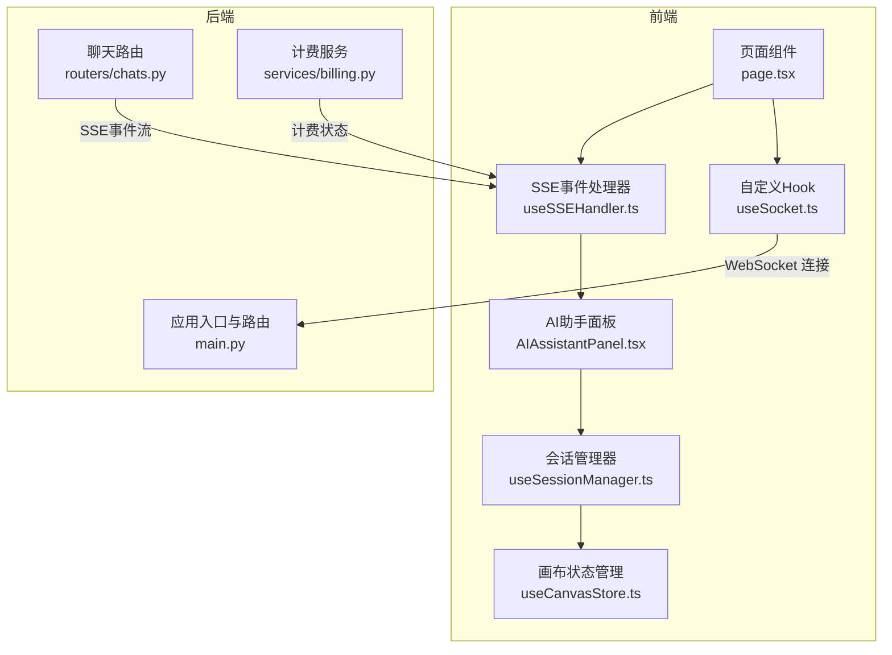
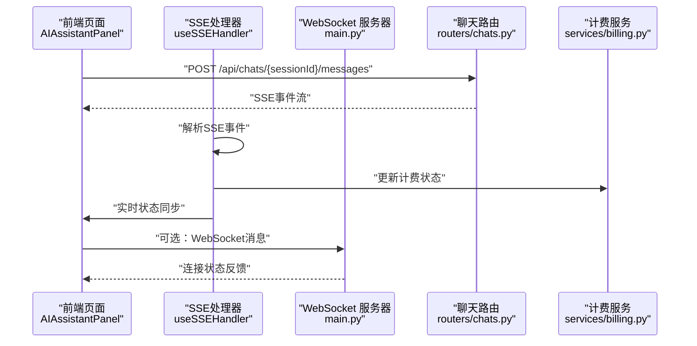
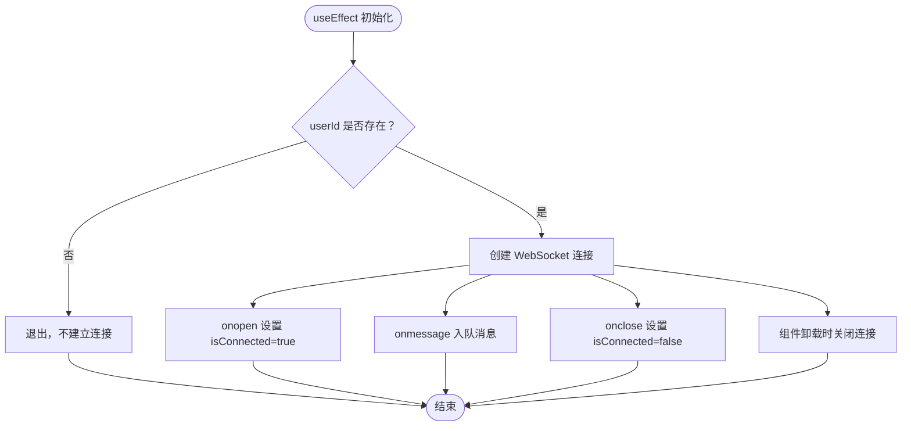
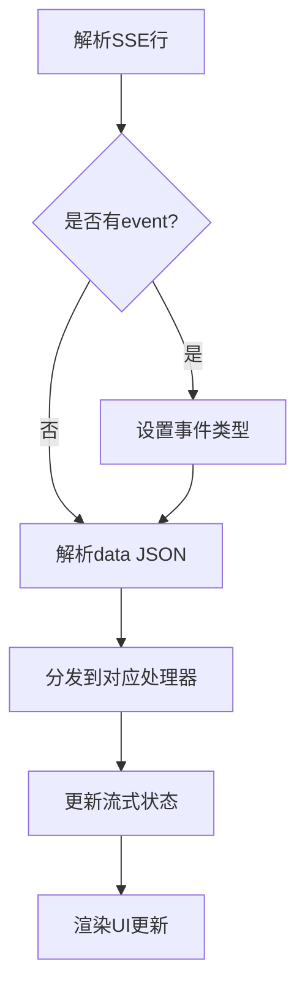
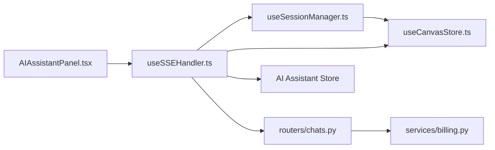

# WebSocket 实时通信

<cite>
**本文引用的文件**
- [frontend/src/hooks/useSocket.ts](file://frontend/src/hooks/useSocket.ts)
- [frontend/src/components/ai-assistant/hooks/useSSEHandler.ts](file://frontend/src/components/ai-assistant/hooks/useSSEHandler.ts)
- [frontend/src/components/ai-assistant/hooks/useSessionManager.ts](file://frontend/src/components/ai-assistant/hooks/useSessionManager.ts)
- [frontend/src/components/canvas/AIAssistantPanel.tsx](file://frontend/src/components/canvas/AIAssistantPanel.tsx)
- [frontend/src/store/useCanvasStore.ts](file://frontend/src/store/useCanvasStore.ts)
- [backend/main.py](file://backend/main.py)
- [backend/routers/chats.py](file://backend/routers/chats.py)
- [backend/services/billing.py](file://backend/services/billing.py)
</cite>

## 更新摘要
**变更内容**
- 增强了SSE事件处理机制，支持更丰富的事件类型和状态同步
- 改进了错误消息处理，提供更好的用户体验
- 实现了Canvas实时状态同步和积分余额的实时更新
- 完善了多智能体协作模式下的事件流处理

## 目录
1. [简介](#简介)
2. [项目结构](#项目结构)
3. [核心组件](#核心组件)
4. [架构总览](#架构总览)
5. [详细组件分析](#详细组件分析)
6. [SSE事件处理增强](#sse事件处理增强)
7. [错误处理与状态同步](#错误处理与状态同步)
8. [Canvas实时同步机制](#canvas实时同步机制)
9. [依赖关系分析](#依赖关系分析)
10. [性能考虑](#性能考虑)
11. [故障排查指南](#故障排查指南)
12. [结论](#结论)
13. [附录](#附录)

## 简介
本技术文档围绕基于 WebSocket 和 Server-Sent Events (SSE) 的实时通信系统进行深入解析，覆盖连接建立、心跳与断线重连、消息协议与序列化、React Hooks 在 WebSocket/SSE 中的应用模式、状态管理与副作用处理、消息队列与缓冲区管理、消息去重策略、错误处理与异常恢复、性能监控、客户端与服务端消息格式规范、事件类型定义以及状态同步机制。系统现已支持SSE事件处理的增强、更好的错误消息和实时状态同步。

## 项目结构
该仓库采用前后端分离架构：前端使用 Next.js 客户端组件与自定义 Hook 管理 WebSocket 和 SSE；后端使用 FastAPI 提供 WebSocket 路由与业务服务。系统支持两种实时通信方式：WebSocket用于双向通信，SSE用于服务器推送事件。



**图表来源**
- [frontend/src/hooks/useSocket.ts:1-43](file://frontend/src/hooks/useSocket.ts#L1-L43)
- [frontend/src/components/ai-assistant/hooks/useSSEHandler.ts:1-335](file://frontend/src/components/ai-assistant/hooks/useSSEHandler.ts#L1-L335)
- [frontend/src/components/ai-assistant/hooks/useSessionManager.ts:1-179](file://frontend/src/components/ai-assistant/hooks/useSessionManager.ts#L1-L179)
- [frontend/src/components/canvas/AIAssistantPanel.tsx:100-295](file://frontend/src/components/canvas/AIAssistantPanel.tsx#L100-L295)
- [frontend/src/store/useCanvasStore.ts:1-200](file://frontend/src/store/useCanvasStore.ts#L1-L200)
- [backend/main.py:160-171](file://backend/main.py#L160-L171)
- [backend/routers/chats.py:27-245](file://backend/routers/chats.py#L27-L245)
- [backend/services/billing.py:40-255](file://backend/services/billing.py#L40-L255)

**章节来源**
- [frontend/src/hooks/useSocket.ts:1-43](file://frontend/src/hooks/useSocket.ts#L1-L43)
- [frontend/src/components/ai-assistant/hooks/useSSEHandler.ts:1-335](file://frontend/src/components/ai-assistant/hooks/useSSEHandler.ts#L1-L335)
- [frontend/src/components/ai-assistant/hooks/useSessionManager.ts:1-179](file://frontend/src/components/ai-assistant/hooks/useSessionManager.ts#L1-L179)
- [frontend/src/components/canvas/AIAssistantPanel.tsx:100-295](file://frontend/src/components/canvas/AIAssistantPanel.tsx#L100-L295)
- [frontend/src/store/useCanvasStore.ts:1-200](file://frontend/src/store/useCanvasStore.ts#L1-L200)
- [backend/main.py:160-171](file://backend/main.py#L160-L171)
- [backend/routers/chats.py:27-245](file://backend/routers/chats.py#L27-L245)
- [backend/services/billing.py:40-255](file://backend/services/billing.py#L40-L255)

## 核心组件
- **前端自定义 Hook useSocket**：负责 WebSocket 连接生命周期、消息接收与发送、连接状态管理。
- **SSE事件处理器 useSSEHandler**：专门处理服务器推送的事件流，支持多种事件类型和状态同步。
- **会话管理器 useSessionManager**：管理AI助手会话的创建、切换和清理。
- **AI助手面板 AIAssistantPanel**：集成SSE事件处理的用户界面组件。
- **画布状态管理 useCanvasStore**：管理画布状态的持久化和同步。
- **后端WebSocket路由**：接受WebSocket连接，当前未实现心跳与断线重连。
- **聊天路由**：支持SSE事件流，提供多智能体协作和实时状态同步。

**章节来源**
- [frontend/src/hooks/useSocket.ts:1-43](file://frontend/src/hooks/useSocket.ts#L1-L43)
- [frontend/src/components/ai-assistant/hooks/useSSEHandler.ts:1-335](file://frontend/src/components/ai-assistant/hooks/useSSEHandler.ts#L1-L335)
- [frontend/src/components/ai-assistant/hooks/useSessionManager.ts:1-179](file://frontend/src/components/ai-assistant/hooks/useSessionManager.ts#L1-L179)
- [frontend/src/components/canvas/AIAssistantPanel.tsx:100-295](file://frontend/src/components/canvas/AIAssistantPanel.tsx#L100-L295)
- [frontend/src/store/useCanvasStore.ts:1-200](file://frontend/src/store/useCanvasStore.ts#L1-L200)
- [backend/main.py:160-171](file://backend/main.py#L160-L171)
- [backend/routers/chats.py:27-245](file://backend/routers/chats.py#L27-L245)

## 架构总览
系统采用"前端 Hook + 后端 FastAPI SSE"的实时通信架构。前端通过 useSocket 建立到后端的 WebSocket 连接，通过 useSSEHandler 处理服务器推送的事件流。后端在聊天路由中提供SSE事件流，支持多智能体协作、计费状态更新和画布同步。



**图表来源**
- [frontend/src/components/canvas/AIAssistantPanel.tsx:107-166](file://frontend/src/components/canvas/AIAssistantPanel.tsx#L107-L166)
- [frontend/src/components/ai-assistant/hooks/useSSEHandler.ts:63-327](file://frontend/src/components/ai-assistant/hooks/useSSEHandler.ts#L63-L327)
- [backend/main.py:160-171](file://backend/main.py#L160-L171)
- [backend/routers/chats.py:237-245](file://backend/routers/chats.py#L237-L245)
- [backend/services/billing.py:44-82](file://backend/services/billing.py#L44-L82)

**章节来源**
- [frontend/src/components/canvas/AIAssistantPanel.tsx:100-295](file://frontend/src/components/canvas/AIAssistantPanel.tsx#L100-L295)
- [frontend/src/components/ai-assistant/hooks/useSSEHandler.ts:1-335](file://frontend/src/components/ai-assistant/hooks/useSSEHandler.ts#L1-L335)
- [backend/main.py:160-171](file://backend/main.py#L160-L171)
- [backend/routers/chats.py:237-245](file://backend/routers/chats.py#L237-L245)
- [backend/services/billing.py:44-82](file://backend/services/billing.py#L44-L82)

## 详细组件分析

### 前端 WebSocket Hook：useSocket
- **连接建立**：在依赖变化时创建 WebSocket，监听 onopen/onmessage/onclose，设置连接状态与消息队列。
- **消息发送**：仅在连接处于 OPEN 状态时发送，避免异常。
- **生命周期**：组件卸载时主动关闭连接，防止内存泄漏。
- **可扩展点**：可加入心跳定时器与指数退避的断线重连策略。



**图表来源**
- [frontend/src/hooks/useSocket.ts:8-33](file://frontend/src/hooks/useSocket.ts#L8-L33)

**章节来源**
- [frontend/src/hooks/useSocket.ts:1-43](file://frontend/src/hooks/useSocket.ts#L1-L43)

### SSE事件处理器：useSSEHandler
**更新** 增强了SSE事件处理能力，支持多种事件类型和实时状态同步。

- **事件解析**：支持 event 和 data 行的解析，处理SSE格式的事件流。
- **多事件类型支持**：
  - 文本流式事件 (`text`)：处理AI助手的流式回复
  - 技能调用事件 (`skill_call`, `skill_loaded`)：处理技能调用的开始和完成
  - 工具调用事件 (`tool_call`, `tool_result`)：处理工具执行的状态变化
  - 多智能体事件 (`subtask_created`, `subtask_started`, `subtask_completed`, `task_completed`)：处理协作任务的状态
  - 计费事件 (`billing`)：实时更新积分余额和状态
  - 画布更新事件 (`canvas_updated`)：同步画布状态
  - 完成事件 (`done`)：标记流式事件的结束
  - 错误事件 (`error`)：处理错误状态

- **状态管理**：维护流式状态，包括技能调用、工具调用、步骤和多智能体状态。
- **实时同步**：支持积分余额更新、画布状态同步和多智能体协作状态。



**图表来源**
- [frontend/src/components/ai-assistant/hooks/useSSEHandler.ts:52-61](file://frontend/src/components/ai-assistant/hooks/useSSEHandler.ts#L52-L61)
- [frontend/src/components/ai-assistant/hooks/useSSEHandler.ts:63-327](file://frontend/src/components/ai-assistant/hooks/useSSEHandler.ts#L63-L327)

**章节来源**
- [frontend/src/components/ai-assistant/hooks/useSSEHandler.ts:1-335](file://frontend/src/components/ai-assistant/hooks/useSSEHandler.ts#L1-L335)

### 会话管理器：useSessionManager
- **会话创建**：为指定theater创建或查找现有会话，加载消息历史。
- **Agent切换**：支持在不同Agent之间切换，创建新的会话。
- **状态同步**：处理theater切换时的会话状态同步。
- **错误处理**：提供友好的错误提示和状态恢复。

**章节来源**
- [frontend/src/components/ai-assistant/hooks/useSessionManager.ts:1-179](file://frontend/src/components/ai-assistant/hooks/useSessionManager.ts#L1-L179)

### AI助手面板：AIAssistantPanel
- **SSE集成**：集成SSE事件处理，支持实时状态更新。
- **错误处理**：友好的HTTP错误处理，特别是402积分不足的情况。
- **事件解析**：实现SSE事件的解析和处理逻辑。
- **状态管理**：管理消息列表、加载状态和面板大小。

**章节来源**
- [frontend/src/components/canvas/AIAssistantPanel.tsx:100-295](file://frontend/src/components/canvas/AIAssistantPanel.tsx#L100-L295)

## SSE事件处理增强

### 事件类型定义
系统支持以下SSE事件类型：

1. **文本事件** (`text`)
   - 用途：AI助手的流式文本回复
   - 数据：包含 `chunk` 字段的文本片段

2. **技能事件** (`skill_call`, `skill_loaded`)
   - 用途：技能调用的开始和完成
   - 数据：包含 `skill_name` 字段

3. **工具事件** (`tool_call`, `tool_result`)
   - 用途：工具执行的状态跟踪
   - 数据：包含 `tool_name` 和 `arguments` 字段

4. **多智能体事件** (`subtask_created`, `subtask_started`, `subtask_completed`, `task_completed`)
   - 用途：多智能体协作任务的状态管理
   - 数据：包含任务ID、代理名称、描述、结果等

5. **计费事件** (`billing`)
   - 用途：实时更新计费状态
   - 数据：包含 `credit_cost`、`remaining_credits`、`insufficient`、`frozen` 等

6. **画布事件** (`canvas_updated`)
   - 用途：画布状态的实时同步
   - 数据：包含 `theater_id` 字段

7. **控制事件** (`done`, `error`)
   - 用途：流式事件的结束和错误处理
   - 数据：错误事件包含 `message` 字段

**章节来源**
- [frontend/src/components/ai-assistant/hooks/useSSEHandler.ts:66-327](file://frontend/src/components/ai-assistant/hooks/useSSEHandler.ts#L66-L327)
- [backend/routers/chats.py:27-29](file://backend/routers/chats.py#L27-L29)

## 错误处理与状态同步

### 错误处理机制
**更新** 改进了错误消息处理，提供更好的用户体验。

- **HTTP错误处理**：针对402积分不足、401登录过期、403权限不足、429请求频繁等情况提供友好的错误提示。
- **SSE错误事件**：处理服务器端的错误事件，显示具体的错误信息。
- **状态恢复**：错误发生后重置流式状态，确保系统回到稳定状态。

### 实时状态同步
**更新** 实现了多种实时状态同步机制：

1. **积分余额同步** (`billing` 事件)
   - 实时更新用户积分余额
   - 处理积分不足和账户冻结状态
   - 提供友好的用户提示

2. **画布状态同步** (`canvas_updated` 事件)
   - 根据事件中的 `theater_id` 同步画布状态
   - 仅在当前激活的画布上应用更新

3. **多智能体状态同步**
   - 实时更新子任务状态
   - 同步最终结果和统计信息

**章节来源**
- [frontend/src/components/canvas/AIAssistantPanel.tsx:120-129](file://frontend/src/components/canvas/AIAssistantPanel.tsx#L120-L129)
- [frontend/src/components/ai-assistant/hooks/useSSEHandler.ts:278-323](file://frontend/src/components/ai-assistant/hooks/useSSEHandler.ts#L278-L323)
- [backend/services/billing.py:44-82](file://backend/services/billing.py#L44-L82)

## Canvas实时同步机制

### 同步触发机制
**更新** 通过SSE事件实现画布的实时同步。

- **事件触发**：当画布状态发生变化时，后端通过 `canvas_updated` 事件推送更新
- **条件检查**：前端仅在当前激活的画布 (`theater_id`) 匹配时才应用更新
- **状态同步**：调用 `syncTheater` 方法获取最新的画布数据并更新本地状态

### 状态管理
- **本地状态**：使用Zustand状态管理库维护画布的节点、边和视口状态
- **持久化**：支持本地持久化，确保页面刷新后状态不丢失
- **历史记录**：支持撤销/重做功能，维护操作历史

**章节来源**
- [frontend/src/components/ai-assistant/hooks/useSSEHandler.ts:300-307](file://frontend/src/components/ai-assistant/hooks/useSSEHandler.ts#L300-L307)
- [frontend/src/store/useCanvasStore.ts:400-407](file://frontend/src/store/useCanvasStore.ts#L400-L407)

## 依赖关系分析
**更新** 增加了SSE相关组件的依赖关系。

- 前端 AIAssistantPanel 依赖 useSSEHandler 和 useSessionManager
- useSSEHandler 依赖 useAIAssistantStore、useCanvasStore 和 useAuth
- 后端聊天路由依赖数据库、代理引擎和计费服务
- SSE事件流通过聊天路由提供，支持多智能体协作和实时状态同步



**图表来源**
- [frontend/src/components/canvas/AIAssistantPanel.tsx:100-166](file://frontend/src/components/canvas/AIAssistantPanel.tsx#L100-L166)
- [frontend/src/components/ai-assistant/hooks/useSSEHandler.ts:25-27](file://frontend/src/components/ai-assistant/hooks/useSSEHandler.ts#L25-L27)
- [frontend/src/components/ai-assistant/hooks/useSessionManager.ts:12-28](file://frontend/src/components/ai-assistant/hooks/useSessionManager.ts#L12-L28)
- [frontend/src/store/useCanvasStore.ts:185-200](file://frontend/src/store/useCanvasStore.ts#L185-L200)
- [backend/routers/chats.py:237-245](file://backend/routers/chats.py#L237-L245)
- [backend/services/billing.py:44-82](file://backend/services/billing.py#L44-L82)

**章节来源**
- [frontend/src/components/canvas/AIAssistantPanel.tsx:100-295](file://frontend/src/components/canvas/AIAssistantPanel.tsx#L100-L295)
- [frontend/src/components/ai-assistant/hooks/useSSEHandler.ts:1-335](file://frontend/src/components/ai-assistant/hooks/useSSEHandler.ts#L1-L335)
- [frontend/src/components/ai-assistant/hooks/useSessionManager.ts:1-179](file://frontend/src/components/ai-assistant/hooks/useSessionManager.ts#L1-L179)
- [frontend/src/store/useCanvasStore.ts:1-200](file://frontend/src/store/useCanvasStore.ts#L1-L200)
- [backend/routers/chats.py:237-245](file://backend/routers/chats.py#L237-L245)
- [backend/services/billing.py:44-82](file://backend/services/billing.py#L44-L82)

## 性能考虑
**更新** 增加了SSE和状态同步的性能考虑。

- **WebSocket连接池与并发**：限制同一用户的连接数量，避免资源耗尽。
- **SSE事件批处理**：前端批量处理SSE事件，减少渲染压力；后端流式响应避免大包阻塞。
- **缓冲区管理**：设置消息队列上限，超限丢弃或压缩旧消息。
- **状态同步优化**：仅在必要时更新UI，避免不必要的重渲染。
- **画布同步优化**：仅在当前激活的画布上应用更新，减少不必要的状态变更。
- **计费状态缓存**：前端缓存积分余额，避免频繁的API调用。
- **多智能体状态管理**：使用Map结构高效管理子任务状态。

## 故障排查指南
**更新** 增加了SSE和状态同步相关的故障排查。

- **连接失败**
  - 检查后端是否启动、端口是否开放、CORS 配置是否允许前端域名。
  - 查看浏览器网络面板与后端日志，确认握手阶段错误。
- **SSE事件处理失败**
  - 确认SSE事件格式正确，event和data字段解析正常。
  - 检查事件处理器是否正确注册和调用。
- **状态同步问题**
  - 确认事件中的 `theater_id` 与当前激活的画布匹配。
  - 检查 `syncTheater` 方法的调用和错误处理。
- **计费状态不同步**
  - 确认 `billing` 事件的数据格式正确。
  - 检查积分余额更新逻辑和错误处理。
- **断线频繁**
  - 当前后端未实现心跳与断线重连，建议在前端增加指数退避重连与心跳保活。
- **性能瓶颈**
  - 使用浏览器性能面板与后端指标监控，定位慢查询与高CPU占用。
  - 对聊天流式接口进行分页与上下文截断，避免过长历史导致延迟。

**章节来源**
- [frontend/src/hooks/useSocket.ts:1-43](file://frontend/src/hooks/useSocket.ts#L1-L43)
- [frontend/src/components/ai-assistant/hooks/useSSEHandler.ts:1-335](file://frontend/src/components/ai-assistant/hooks/useSSEHandler.ts#L1-L335)
- [frontend/src/components/canvas/AIAssistantPanel.tsx:120-129](file://frontend/src/components/canvas/AIAssistantPanel.tsx#L120-L129)
- [backend/main.py:160-171](file://backend/main.py#L160-L171)

## 结论
当前系统实现了增强的WebSocket和SSE实时通信，具备多智能体协作、实时状态同步和友好的错误处理能力。系统支持丰富的SSE事件类型，能够实现实时的积分余额更新、画布状态同步和多智能体协作状态管理。为进一步提升稳定性与用户体验，建议补充心跳与断线重连、消息去重与确认、缓冲区与背压控制、完善的错误处理与性能监控，并在消息协议层面明确事件类型与数据格式，确保前后端一致的契约。

## 附录

### SSE事件协议规范
**更新** 完善了SSE事件协议规范。

- **事件格式**
  ```
  event: {event_type}
  data: {json_data}
  ```

- **事件类型定义**
  - `text`: 文本流式事件，数据包含 `chunk` 字段
  - `skill_call`: 技能调用开始，数据包含 `skill_name`
  - `skill_loaded`: 技能加载完成，数据包含 `skill_name`
  - `tool_call`: 工具调用开始，数据包含 `tool_name` 和 `arguments`
  - `tool_result`: 工具执行完成，数据包含 `tool_name`
  - `subtask_created`: 子任务创建，数据包含 `subtask_id`, `agent`, `description`
  - `subtask_started`: 子任务开始，数据包含 `subtask_id`, `agent_name`
  - `subtask_completed`: 子任务完成，数据包含 `subtask_id`, `result`, `tokens`
  - `subtask_failed`: 子任务失败，数据包含 `subtask_id`, `error`
  - `task_completed`: 任务完成，数据包含 `result`, `total_tokens`, `credit_cost`
  - `billing`: 计费状态，数据包含 `credit_cost`, `remaining_credits`, `insufficient`, `frozen`
  - `canvas_updated`: 画布更新，数据包含 `theater_id`
  - `done`: 事件完成
  - `error`: 错误事件，数据包含 `message`

### 心跳与断线重连（建议实现）
- **心跳**
  - 前端每 30 秒发送 Ping，后端收到后立即 Pong。
  - 超过 2 倍周期未收到 Pong 判定为断线。
- **重连**
  - 指数退避（1s, 2s, 4s, 8s），最大重试次数与抖动。
  - 重连成功后请求增量同步，补齐断线期间的消息。

### 消息队列与缓冲区管理（建议）
- **前端**
  - 消息队列上限 1000 条，超过则丢弃最旧条目。
  - 批量渲染，每帧最多更新 10 次。
- **后端**
  - 每个会话维护历史窗口，按字符数或消息数截断。
  - 流式响应中累积增量，达到阈值再推送。

### 消息去重策略（建议）
- **基于消息 ID 去重**，服务端记录已处理 ID，客户端记录已渲染 ID。
- 对重复消息进行幂等处理，避免重复触发业务逻辑。

### 性能监控与可观测性（建议）
- **前端**
  - 记录连接耗时、消息延迟、重连次数、渲染帧率。
  - 监控SSE事件处理性能和状态同步延迟。
- **后端**
  - 记录请求耗时、并发连接数、数据库查询耗时、流式响应吞吐。
  - 监控SSE事件发送性能和多智能体协作延迟。
  - 使用指标导出与告警，结合日志聚合平台。