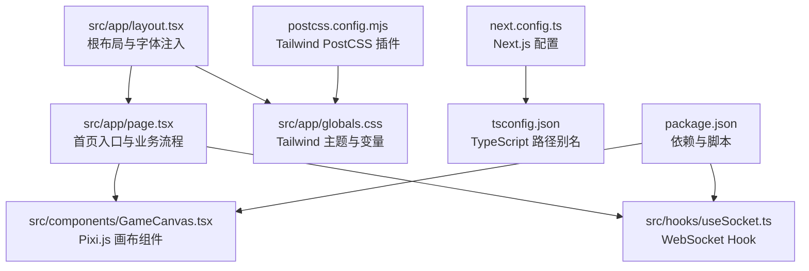
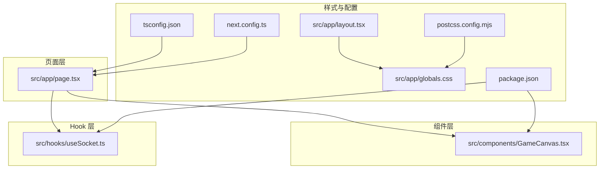
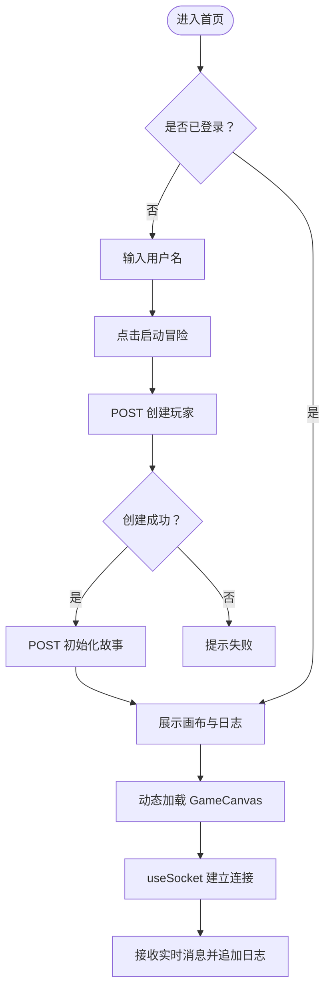
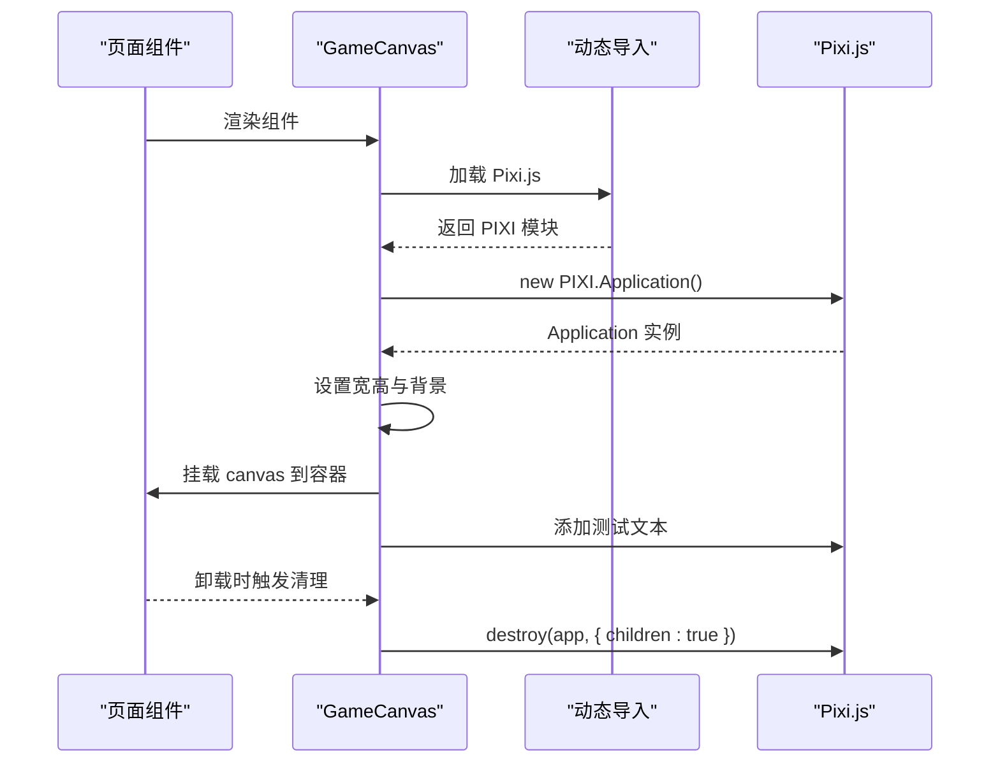
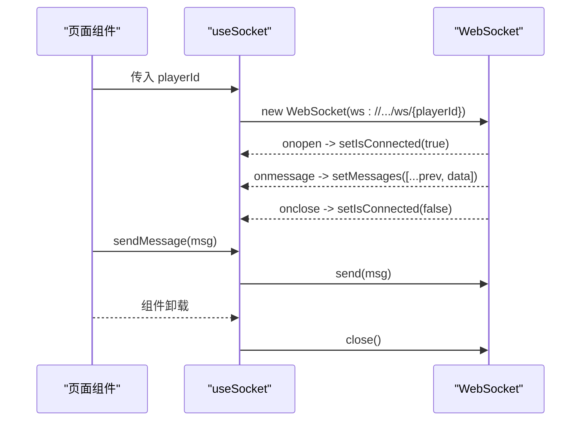
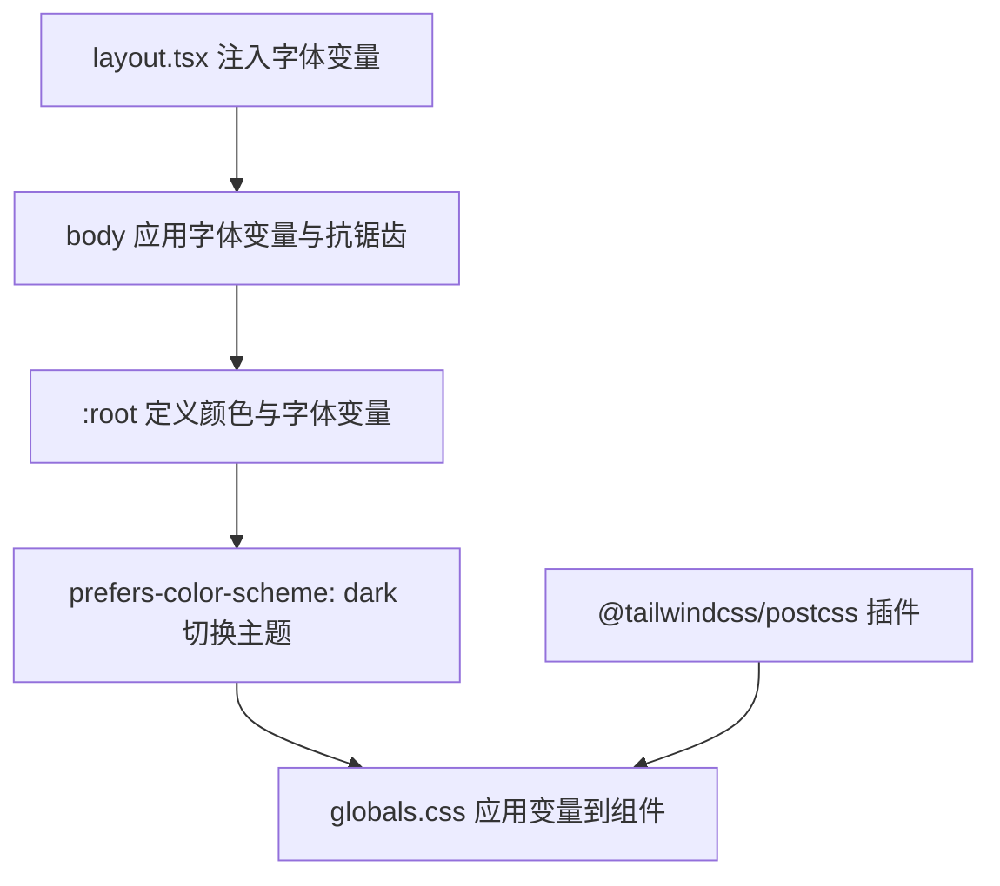
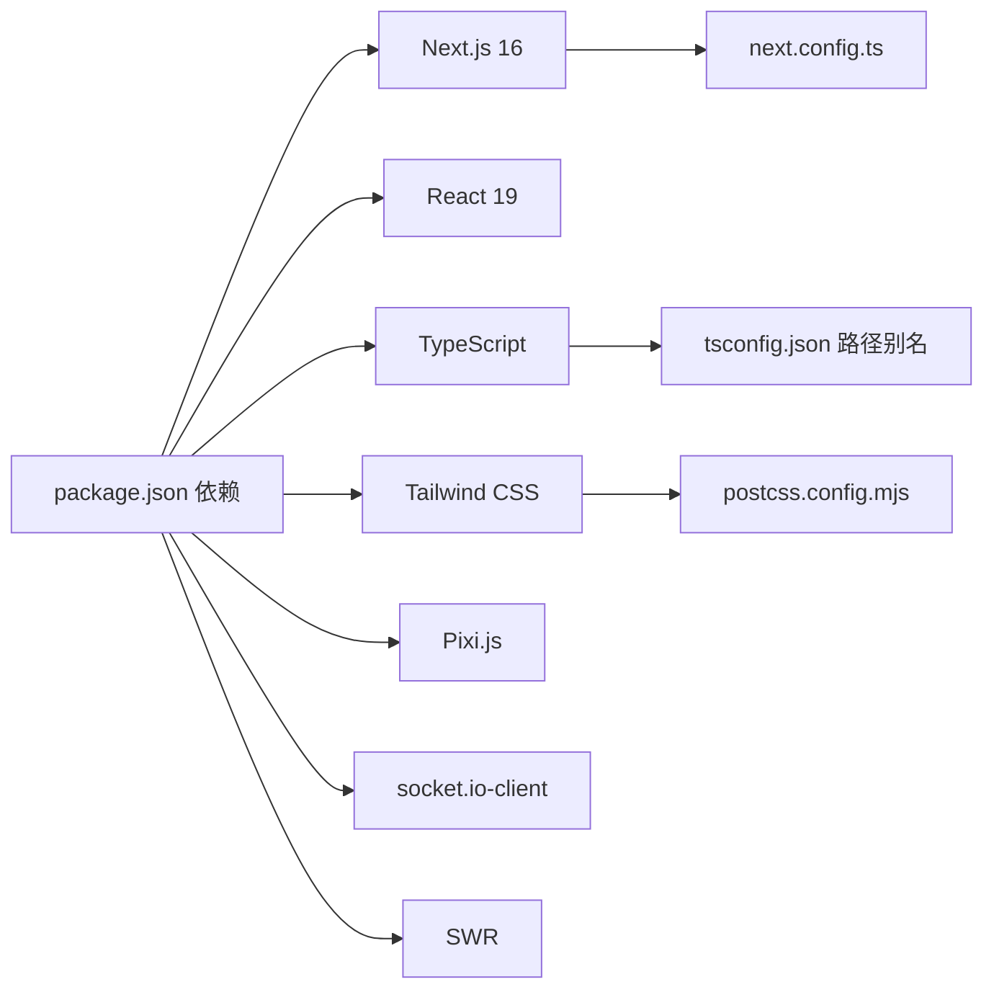

# 前端开发指南

<cite>
**本文引用的文件**
- [frontend/src/app/layout.tsx](file://frontend/src/app/layout.tsx)
- [frontend/src/app/page.tsx](file://frontend/src/app/page.tsx)
- [frontend/src/components/GameCanvas.tsx](file://frontend/src/components/GameCanvas.tsx)
- [frontend/src/hooks/useSocket.ts](file://frontend/src/hooks/useSocket.ts)
- [frontend/src/app/globals.css](file://frontend/src/app/globals.css)
- [frontend/package.json](file://frontend/package.json)
- [frontend/next.config.ts](file://frontend/next.config.ts)
- [frontend/tsconfig.json](file://frontend/tsconfig.json)
- [frontend/postcss.config.mjs](file://frontend/postcss.config.mjs)
- [README.md](file://README.md)
- [docs/wiki/Frontend-Guide.md](file://docs/wiki/Frontend-Guide.md)
</cite>

## 目录
1. [简介](#简介)
2. [项目结构](#项目结构)
3. [核心组件](#核心组件)
4. [架构总览](#架构总览)
5. [详细组件分析](#详细组件分析)
6. [依赖关系分析](#依赖关系分析)
7. [性能考虑](#性能考虑)
8. [故障排查指南](#故障排查指南)
9. [结论](#结论)
10. [附录](#附录)

## 简介
本指南面向前端开发者，围绕基于 Next.js 16 的 App Router 应用，系统讲解页面与布局组织、组件设计模式、基于 Pixi.js 的 2D 画布渲染、WebSocket 实时通信、React Hooks 使用与状态管理、响应式设计与性能优化、UI 组件开发规范与主题定制，并提供调试技巧与常见问题解决方案。该系统同时具备后台管理前端与游戏客户端前端，本文聚焦游戏客户端前端。

## 项目结构
- 前端采用 Next.js 16 App Router 结构，页面级路由位于 src/app 下，全局样式与字体在 layout.tsx 与 globals.css 中统一配置。
- 组件层包含 GameCanvas（Pixi.js 画布）、通用 UI 组件与自定义 Hooks。
- 构建与样式工具链：Next.js、TypeScript、Tailwind CSS（PostCSS 插件）、动态导入与 SSR 兼容策略。

图表来源
- [frontend/src/app/layout.tsx](file://frontend/src/app/layout.tsx#L1-L35)
- [frontend/src/app/page.tsx](file://frontend/src/app/page.tsx#L1-L85)
- [frontend/src/components/GameCanvas.tsx](file://frontend/src/components/GameCanvas.tsx#L1-L50)
- [frontend/src/hooks/useSocket.ts](file://frontend/src/hooks/useSocket.ts#L1-L43)
- [frontend/src/app/globals.css](file://frontend/src/app/globals.css#L1-L27)
- [frontend/next.config.ts](file://frontend/next.config.ts#L1-L8)
- [frontend/tsconfig.json](file://frontend/tsconfig.json#L1-L35)
- [frontend/postcss.config.mjs](file://frontend/postcss.config.mjs#L1-L8)
- [frontend/package.json](file://frontend/package.json#L1-L35)

章节来源
- [frontend/src/app/layout.tsx](file://frontend/src/app/layout.tsx#L1-L35)
- [frontend/src/app/page.tsx](file://frontend/src/app/page.tsx#L1-L85)
- [frontend/src/app/globals.css](file://frontend/src/app/globals.css#L1-L27)
- [frontend/next.config.ts](file://frontend/next.config.ts#L1-L8)
- [frontend/tsconfig.json](file://frontend/tsconfig.json#L1-L35)
- [frontend/postcss.config.mjs](file://frontend/postcss.config.mjs#L1-L8)
- [frontend/package.json](file://frontend/package.json#L1-L35)
- [README.md](file://README.md#L23-L33)
- [docs/wiki/Frontend-Guide.md](file://docs/wiki/Frontend-Guide.md#L3-L21)

## 核心组件
- 根布局与字体：在根布局中引入 Geist 字体变量并在 html/body 上应用，保证全局字体与抗锯齿。
- 首页页面：负责玩家创建、故事初始化、实时消息展示与画布容器布局。
- 游戏画布组件：动态导入 Pixi.js，初始化 Application 并挂载到 DOM，提供销毁清理。
- WebSocket Hook：封装连接建立、消息收发、连接状态与发送方法返回。

章节来源
- [frontend/src/app/layout.tsx](file://frontend/src/app/layout.tsx#L5-L34)
- [frontend/src/app/page.tsx](file://frontend/src/app/page.tsx#L9-L84)
- [frontend/src/components/GameCanvas.tsx](file://frontend/src/components/GameCanvas.tsx#L10-L47)
- [frontend/src/hooks/useSocket.ts](file://frontend/src/hooks/useSocket.ts#L3-L42)
- [docs/wiki/Frontend-Guide.md](file://docs/wiki/Frontend-Guide.md#L23-L58)

## 架构总览
前端整体采用“页面驱动 + 组件组合 + Hook 封装”的分层设计。页面负责业务流程编排，组件负责渲染与交互，Hook 负责跨组件的状态与副作用抽象。

图表来源
- [frontend/src/app/page.tsx](file://frontend/src/app/page.tsx#L1-L85)
- [frontend/src/components/GameCanvas.tsx](file://frontend/src/components/GameCanvas.tsx#L1-L50)
- [frontend/src/hooks/useSocket.ts](file://frontend/src/hooks/useSocket.ts#L1-L43)
- [frontend/src/app/layout.tsx](file://frontend/src/app/layout.tsx#L1-L35)
- [frontend/src/app/globals.css](file://frontend/src/app/globals.css#L1-L27)
- [frontend/tsconfig.json](file://frontend/tsconfig.json#L21-L23)
- [frontend/next.config.ts](file://frontend/next.config.ts#L3-L5)
- [frontend/postcss.config.mjs](file://frontend/postcss.config.mjs#L1-L8)
- [frontend/package.json](file://frontend/package.json#L11-L22)

## 详细组件分析

### 页面组件设计模式（Home）
- 双态布局：未登录时显示用户名输入与启动按钮；登录后展示连接状态、玩家 ID、画布与故事日志。
- 业务流程：创建玩家 → 初始化故事 → 接收实时消息 → 渲染画布。
- 交互要点：动态导入 GameCanvas 以避免 SSR 渲染；使用受控表单输入；条件渲染与 Flex 布局。

图表来源
- [frontend/src/app/page.tsx](file://frontend/src/app/page.tsx#L14-L35)
- [frontend/src/app/page.tsx](file://frontend/src/app/page.tsx#L58-L80)
- [frontend/src/components/GameCanvas.tsx](file://frontend/src/components/GameCanvas.tsx#L7-L7)
- [frontend/src/hooks/useSocket.ts](file://frontend/src/hooks/useSocket.ts#L8-L33)

章节来源
- [frontend/src/app/page.tsx](file://frontend/src/app/page.tsx#L9-L84)
- [docs/wiki/Frontend-Guide.md](file://docs/wiki/Frontend-Guide.md#L46-L53)

### 游戏画布组件（GameCanvas）
- 动态导入：使用 next/dynamic 且 ssr: false，确保仅在客户端加载 Pixi.js。
- 生命周期：初始化 Pixi Application，设置宽高与背景色，将 canvas 挂载到容器；卸载时销毁应用与纹理资源。
- 扩展点：可在 stage 上添加更多精灵、文本与交互事件。

图表来源
- [frontend/src/app/page.tsx](file://frontend/src/app/page.tsx#L7-L7)
- [frontend/src/components/GameCanvas.tsx](file://frontend/src/components/GameCanvas.tsx#L14-L44)

章节来源
- [frontend/src/components/GameCanvas.tsx](file://frontend/src/components/GameCanvas.tsx#L1-L50)
- [docs/wiki/Frontend-Guide.md](file://docs/wiki/Frontend-Guide.md#L25-L34)

### WebSocket Hook（useSocket）
- 连接建立：根据 playerId 构造 ws 地址，监听 open/close/message 事件。
- 状态管理：维护 isConnected 与 messages 数组，提供 sendMessage 方法。
- 清理策略：组件卸载时关闭连接，避免内存泄漏。

图表来源
- [frontend/src/hooks/useSocket.ts](file://frontend/src/hooks/useSocket.ts#L8-L33)
- [frontend/src/hooks/useSocket.ts](file://frontend/src/hooks/useSocket.ts#L35-L39)

章节来源
- [frontend/src/hooks/useSocket.ts](file://frontend/src/hooks/useSocket.ts#L1-L43)
- [docs/wiki/Frontend-Guide.md](file://docs/wiki/Frontend-Guide.md#L35-L44)

### 样式与主题（Tailwind + 字体）
- 字体：在根布局注入 Geist Sans 与 Geist Mono 字体变量，body 应用变量并启用抗锯齿。
- 主题：通过 :root 变量与 @theme inline 定义颜色与字体变量；支持暗色模式媒体查询。
- PostCSS：使用 @tailwindcss/postcss 插件，配合 Tailwind 原子类快速构建 UI。

图表来源
- [frontend/src/app/layout.tsx](file://frontend/src/app/layout.tsx#L5-L28)
- [frontend/src/app/globals.css](file://frontend/src/app/globals.css#L3-L26)
- [frontend/postcss.config.mjs](file://frontend/postcss.config.mjs#L1-L8)

章节来源
- [frontend/src/app/layout.tsx](file://frontend/src/app/layout.tsx#L1-L35)
- [frontend/src/app/globals.css](file://frontend/src/app/globals.css#L1-L27)
- [frontend/postcss.config.mjs](file://frontend/postcss.config.mjs#L1-L8)

## 依赖关系分析
- 依赖生态：Next.js 16、React 19、TypeScript、Tailwind CSS、Pixi.js、socket.io-client、SWR 等。
- 构建配置：tsconfig.json 使用路径别名 @/* 指向 src；next.config.ts 为空配置占位；postcss.config.mjs 引入 Tailwind 插件。
- 组件耦合：页面与组件松耦合，通过 props 传递尺寸；Hook 作为横切关注点被页面复用。

图表来源
- [frontend/package.json](file://frontend/package.json#L11-L22)
- [frontend/tsconfig.json](file://frontend/tsconfig.json#L21-L23)
- [frontend/next.config.ts](file://frontend/next.config.ts#L3-L5)
- [frontend/postcss.config.mjs](file://frontend/postcss.config.mjs#L1-L8)

章节来源
- [frontend/package.json](file://frontend/package.json#L1-L35)
- [frontend/tsconfig.json](file://frontend/tsconfig.json#L1-L35)
- [frontend/next.config.ts](file://frontend/next.config.ts#L1-L8)
- [frontend/postcss.config.mjs](file://frontend/postcss.config.mjs#L1-L8)

## 性能考虑
- 动态导入与 SSR 兼容：GameCanvas 使用 next/dynamic 且 ssr: false，避免服务端渲染时的 DOM 依赖。
- Pixi.js 资源管理：组件卸载时销毁 Application 与纹理，防止内存泄漏与重复实例。
- WebSocket 连接：仅在有有效 playerId 时建立连接；组件卸载时主动关闭，降低后台压力。
- 样式体积：Tailwind 原子类按需使用，避免引入未使用的样式；字体变量集中管理减少重复计算。
- 构建优化：TypeScript 开启严格模式与隔离模块，提升类型安全与 Tree-shaking 效果。

章节来源
- [frontend/src/components/GameCanvas.tsx](file://frontend/src/components/GameCanvas.tsx#L14-L44)
- [frontend/src/hooks/useSocket.ts](file://frontend/src/hooks/useSocket.ts#L8-L33)
- [frontend/src/app/globals.css](file://frontend/src/app/globals.css#L1-L27)
- [frontend/tsconfig.json](file://frontend/tsconfig.json#L7-L14)

## 故障排查指南
- WebSocket 无法连接
  - 确认后端服务已启动且端口 8000 可访问。
  - 检查 useSocket 中的 ws 地址与 playerId 是否正确。
  - 查看浏览器控制台网络面板与 WebSocket 事件日志。
- Pixi.js 未渲染或报错
  - 确认 GameCanvas 已通过 dynamic 导入且 ssr: false。
  - 检查容器 div 是否存在且可挂载 canvas。
  - 确保组件卸载时正确销毁 Pixi Application。
- 样式异常
  - 检查 globals.css 中字体变量与 @theme inline 是否生效。
  - 确认 postcss.config.mjs 正确引入 @tailwindcss/postcss 插件。
- 构建错误
  - 检查 tsconfig.json 的路径别名与模块解析策略。
  - 确认 Next.js 16 与 React 19 版本兼容性。

章节来源
- [frontend/src/hooks/useSocket.ts](file://frontend/src/hooks/useSocket.ts#L8-L33)
- [frontend/src/components/GameCanvas.tsx](file://frontend/src/components/GameCanvas.tsx#L14-L44)
- [frontend/src/app/globals.css](file://frontend/src/app/globals.css#L1-L27)
- [frontend/postcss.config.mjs](file://frontend/postcss.config.mjs#L1-L8)
- [frontend/tsconfig.json](file://frontend/tsconfig.json#L21-L23)
- [docs/wiki/Frontend-Guide.md](file://docs/wiki/Frontend-Guide.md#L59-L69)

## 结论
本指南从项目结构、页面与组件设计、渲染与通信、样式与主题、性能与调试等方面，系统梳理了基于 Next.js 16 的前端开发实践。建议在后续迭代中进一步完善组件抽象、状态管理与错误边界，并持续优化渲染性能与用户体验。

## 附录
- 快速启动
  - 安装依赖：在 frontend 目录执行安装命令。
  - 启动开发服务器：在 frontend 目录执行开发命令。
  - 访问地址：在浏览器打开本地开发地址。
- 相关文档
  - Wiki 前端指南：包含目录结构、核心组件与调试步骤。

章节来源
- [README.md](file://README.md#L103-L114)
- [docs/wiki/Frontend-Guide.md](file://docs/wiki/Frontend-Guide.md#L59-L69)