# 前端开发指南

<cite>
**本文引用的文件**
- [frontend/src/app/layout.tsx](file://frontend/src/app/layout.tsx)
- [frontend/src/app/page.tsx](file://frontend/src/app/page.tsx)
- [frontend/src/components/TheaterCanvas.tsx](file://frontend/src/components/TheaterCanvas.tsx)
- [frontend/src/hooks/useSocket.ts](file://frontend/src/hooks/useSocket.ts)
- [frontend/src/app/globals.css](file://frontend/src/app/globals.css)
- [frontend/package.json](file://frontend/package.json)
- [frontend/next.config.ts](file://frontend/next.config.ts)
- [frontend/tsconfig.json](file://frontend/tsconfig.json)
- [frontend/postcss.config.mjs](file://frontend/postcss.config.mjs)
- [backend/admin/src/app/admin/videos/new/page.tsx](file://backend/admin/src/app/admin/videos/new/page.tsx)
- [backend/admin/src/app/admin/videos/page.tsx](file://backend/admin/src/app/admin/videos/page.tsx)
- [backend/admin/src/app/admin/videos/VideoPreviewModal.tsx](file://backend/admin/src/app/admin/videos/VideoPreviewModal.tsx)
- [backend/admin/src/hooks/useVideoTasks.ts](file://backend/admin/src/hooks/useVideoTasks.ts)
- [backend/admin/src/types/video.ts](file://backend/admin/src/types/video.ts)
- [backend/services/video_providers/minimax_provider.py](file://backend/services/video_providers/minimax_provider.py)
- [backend/admin/src/app/admin/llm/create/page.tsx](file://backend/admin/src/app/admin/llm/create/page.tsx)
- [backend/admin/src/app/admin/llm/[id]/page.tsx](file://backend/admin/src/app/admin/llm/[id]/page.tsx)
- [backend/admin/src/app/admin/llm/components/provider-form.tsx](file://backend/admin/src/app/admin/llm/components/provider-form.tsx)
- [backend/admin/src/app/admin/admins/page.tsx](file://backend/admin/src/app/admin/admins/page.tsx)
- [backend/admin/src/app/admin/agents/[id]/page.tsx](file://backend/admin/src/app/admin/agents/[id]/page.tsx)
- [README.md](file://README.md)
- [docs/wiki/Frontend-Guide.md](file://docs/wiki/Frontend-Guide.md)
</cite>

## 更新摘要
**所做更改**
- 新增后台管理系统架构分析，涵盖视频管理、LLM供应商管理、管理员管理等模块
- 更新视频生成功能实现，包括新建视频任务页面和高级配置选项
- 新增MiniMax特有配置支持，包括提示词优化和快速预处理功能
- 扩展后台管理页面设计模式，从对话框式迁移到页面化架构
- 增强模型能力检测和表单动态显示机制
- 新增视频任务状态管理和实时轮询功能

## 目录
1. [简介](#简介)
2. [项目结构](#项目结构)
3. [核心组件](#核心组件)
4. [架构总览](#架构总览)
5. [详细组件分析](#详细组件分析)
6. [后台管理系统](#后台管理系统)
7. [视频生成系统](#视频生成系统)
8. [LLM供应商管理](#llm供应商管理)
9. [管理员管理](#管理员管理)
10. [智能体管理](#智能体管理)
11. [依赖关系分析](#依赖关系分析)
12. [性能考虑](#性能考虑)
13. [故障排查指南](#故障排查指南)
14. [结论](#结论)
15. [附录](#附录)

## 简介
本指南面向前端开发者，围绕基于 Next.js 16 的 App Router 应用，系统讲解页面与布局组织、组件设计模式、基于 Pixi.js 的 2D 画布渲染、WebSocket 实时通信、React Hooks 使用与状态管理、响应式设计与性能优化、UI 组件开发规范与主题定制，并提供调试技巧与常见问题解决方案。该系统同时具备后台管理前端与剧场客户端前端，本文重点介绍后台管理系统的页面化架构和视频生成功能。

## 项目结构
- 前端采用 Next.js 16 App Router 结构，页面级路由位于 src/app 下，全局样式与字体在 layout.tsx 与 globals.css 中统一配置。
- 后台管理系统位于 backend/admin/src/app/admin 下，采用页面化架构替代传统的对话框式设计。
- 组件层包含 TheaterCanvas（Pixi.js 画布）、通用 UI 组件与自定义 Hooks。
- 视频生成系统支持多种供应商，包括 MiniMax 的特有配置选项。
- 构建与样式工具链：Next.js、TypeScript、Tailwind CSS（PostCSS 插件）、动态导入与 SSR 兼容策略。

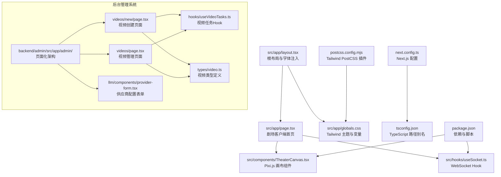

**图表来源**
- [frontend/src/app/layout.tsx:1-35](file://frontend/src/app/layout.tsx#L1-L35)
- [frontend/src/app/page.tsx:1-85](file://frontend/src/app/page.tsx#L1-L85)
- [frontend/src/components/TheaterCanvas.tsx:1-50](file://frontend/src/components/TheaterCanvas.tsx#L1-L50)
- [frontend/src/hooks/useSocket.ts:1-43](file://frontend/src/hooks/useSocket.ts#L1-L43)
- [frontend/src/app/globals.css:1-27](file://frontend/src/app/globals.css#L1-L27)
- [frontend/next.config.ts:1-8](file://frontend/next.config.ts#L1-L8)
- [frontend/tsconfig.json:1-35](file://frontend/tsconfig.json#L1-L35)
- [frontend/postcss.config.mjs:1-8](file://frontend/postcss.config.mjs#L1-L8)
- [frontend/package.json:1-35](file://frontend/package.json#L1-L35)
- [backend/admin/src/app/admin/videos/new/page.tsx:1-420](file://backend/admin/src/app/admin/videos/new/page.tsx#L1-L420)
- [backend/admin/src/app/admin/videos/page.tsx:1-268](file://backend/admin/src/app/admin/videos/page.tsx#L1-L268)
- [backend/admin/src/app/admin/llm/components/provider-form.tsx:1-672](file://backend/admin/src/app/admin/llm/components/provider-form.tsx#L1-L672)

**章节来源**
- [frontend/src/app/layout.tsx:1-35](file://frontend/src/app/layout.tsx#L1-L35)
- [frontend/src/app/page.tsx:1-85](file://frontend/src/app/page.tsx#L1-L85)
- [frontend/src/app/globals.css:1-27](file://frontend/src/app/globals.css#L1-L27)
- [frontend/next.config.ts:1-8](file://frontend/next.config.ts#L1-L8)
- [frontend/tsconfig.json:1-35](file://frontend/tsconfig.json#L1-L35)
- [frontend/postcss.config.mjs:1-8](file://frontend/postcss.config.mjs#L1-L8)
- [frontend/package.json:1-35](file://frontend/package.json#L1-L35)
- [README.md:23-33](file://README.md#L23-L33)
- [docs/wiki/Frontend-Guide.md:3-21](file://docs/wiki/Frontend-Guide.md#L3-L21)

## 核心组件
- 根布局与字体：在根布局中引入 Geist 字体变量并在 html/body 上应用，保证全局字体与抗锯齿。
- 首页页面：负责玩家创建、故事初始化、实时消息展示与画布容器布局。
- 剧场画布组件：动态导入 Pixi.js，初始化 Application 并挂载到 DOM，提供销毁清理。
- WebSocket Hook：封装连接建立、消息收发、连接状态与发送方法返回。
- 后台管理页面：采用页面化架构，提供完整的 CRUD 操作界面。

**章节来源**
- [frontend/src/app/layout.tsx:5-34](file://frontend/src/app/layout.tsx#L5-L34)
- [frontend/src/app/page.tsx:9-84](file://frontend/src/app/page.tsx#L9-L84)
- [frontend/src/components/TheaterCanvas.tsx:10-47](file://frontend/src/components/TheaterCanvas.tsx#L10-L47)
- [frontend/src/hooks/useSocket.ts:3-42](file://frontend/src/hooks/useSocket.ts#L3-L42)
- [docs/wiki/Frontend-Guide.md:23-58](file://docs/wiki/Frontend-Guide.md#L23-L58)

## 架构总览
前端整体采用"页面驱动 + 组件组合 + Hook 封装"的分层设计。页面负责业务流程编排，组件负责渲染与交互，Hook 负责跨组件的状态与副作用抽象。后台管理系统采用页面化架构，每个功能模块都有独立的页面组件。

```mermaid
graph TB
subgraph "前台客户端"
P["src/app/page.tsx<br/>剧场客户端页面"]
GC["src/components/TheaterCanvas.tsx<br/>剧场画布组件"]
WS["src/hooks/useSocket.ts<br/>WebSocket Hook"]
LYT["src/app/layout.tsx<br/>根布局"]
CSS["src/app/globals.css<br/>全局样式"]
end
subgraph "后台管理系统"
ADM["backend/admin/src/app/admin/<br/>管理页面集合"]
VID["videos/new/page.tsx<br/>视频创建页面"]
VIDLIST["videos/page.tsx<br/>视频列表页面"]
LLM["llm/components/provider-form.tsx<br/>LLM供应商表单"]
ADMIN["admins/page.tsx<br/>管理员管理页面"]
AGENT["agents/[id]/page.tsx<br/>智能体详情页面"]
end
subgraph "共享组件与Hook"
HOOKS["hooks/useVideoTasks.ts<br/>视频任务Hook"]
TYPES["types/video.ts<br/>类型定义"]
END
P --> GC
P --> WS
LYT --> CSS
VID --> HOOKS
VIDLIST --> HOOKS
VID --> TYPES
VIDLIST --> TYPES
LLM --> HOOKS
ADMIN --> HOOKS
AGENT --> HOOKS
```

**图表来源**
- [frontend/src/app/page.tsx:1-85](file://frontend/src/app/page.tsx#L1-L85)
- [frontend/src/components/TheaterCanvas.tsx:1-50](file://frontend/src/components/TheaterCanvas.tsx#L1-L50)
- [frontend/src/hooks/useSocket.ts:1-43](file://frontend/src/hooks/useSocket.ts#L1-L43)
- [frontend/src/app/layout.tsx:1-35](file://frontend/src/app/layout.tsx#L1-L35)
- [frontend/src/app/globals.css:1-27](file://frontend/src/app/globals.css#L1-L27)
- [backend/admin/src/app/admin/videos/new/page.tsx:1-420](file://backend/admin/src/app/admin/videos/new/page.tsx#L1-L420)
- [backend/admin/src/app/admin/videos/page.tsx:1-268](file://backend/admin/src/app/admin/videos/page.tsx#L1-L268)
- [backend/admin/src/app/admin/llm/components/provider-form.tsx:1-672](file://backend/admin/src/app/admin/llm/components/provider-form.tsx#L1-L672)
- [backend/admin/src/app/admin/admins/page.tsx:1-530](file://backend/admin/src/app/admin/admins/page.tsx#L1-L530)
- [backend/admin/src/app/admin/agents/[id]/page.tsx](file://backend/admin/src/app/admin/agents/[id]/page.tsx#L1-L149)
- [backend/admin/src/hooks/useVideoTasks.ts:1-73](file://backend/admin/src/hooks/useVideoTasks.ts#L1-L73)
- [backend/admin/src/types/video.ts:1-53](file://backend/admin/src/types/video.ts#L1-L53)

**章节来源**
- [frontend/src/app/page.tsx:1-85](file://frontend/src/app/page.tsx#L1-L85)
- [backend/admin/src/app/admin/videos/new/page.tsx:1-420](file://backend/admin/src/app/admin/videos/new/page.tsx#L1-L420)
- [backend/admin/src/app/admin/videos/page.tsx:1-268](file://backend/admin/src/app/admin/videos/page.tsx#L1-L268)

## 详细组件分析

### 页面组件设计模式（Home）
- 双态布局：未登录时显示用户名输入与启动按钮；登录后展示连接状态、玩家 ID、画布与故事日志。
- 业务流程：创建玩家 → 初始化故事 → 接收实时消息 → 渲染画布。
- 交互要点：动态导入 TheaterCanvas 以避免 SSR 渲染；使用受控表单输入；条件渲染与 Flex 布局。


**图表来源**
- [frontend/src/app/page.tsx:14-35](file://frontend/src/app/page.tsx#L14-L35)
- [frontend/src/app/page.tsx:58-80](file://frontend/src/app/page.tsx#L58-L80)
- [frontend/src/components/TheaterCanvas.tsx:7-7](file://frontend/src/components/TheaterCanvas.tsx#L7-L7)
- [frontend/src/hooks/useSocket.ts:8-33](file://frontend/src/hooks/useSocket.ts#L8-L33)

**章节来源**
- [frontend/src/app/page.tsx:9-84](file://frontend/src/app/page.tsx#L9-L84)
- [docs/wiki/Frontend-Guide.md:46-53](file://docs/wiki/Frontend-Guide.md#L46-L53)

### 剧场画布组件（TheaterCanvas）
- 动态导入：使用 next/dynamic 且 ssr: false，确保仅在客户端加载 Pixi.js。
- 生命周期：初始化 Pixi Application，设置宽高与背景色，将 canvas 挂载到容器；卸载时销毁应用与纹理资源。
- 扩展点：可在 stage 上添加更多精灵、文本与交互事件。

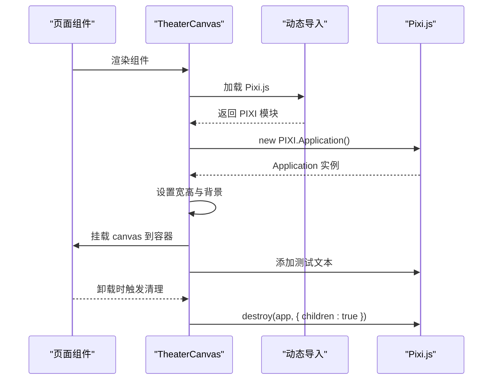

**图表来源**
- [frontend/src/app/page.tsx:7-7](file://frontend/src/app/page.tsx#L7-L7)
- [frontend/src/components/TheaterCanvas.tsx:14-44](file://frontend/src/components/TheaterCanvas.tsx#L14-L44)

**章节来源**
- [frontend/src/components/TheaterCanvas.tsx:1-50](file://frontend/src/components/TheaterCanvas.tsx#L1-L50)
- [docs/wiki/Frontend-Guide.md:25-34](file://docs/wiki/Frontend-Guide.md#L25-L34)

### WebSocket Hook（useSocket）
- 连接建立：根据 playerId 构造 ws 地址，监听 open/close/message 事件。
- 状态管理：维护 isConnected 与 messages 数组，提供 sendMessage 方法。
- 清理策略：组件卸载时关闭连接，避免内存泄漏。

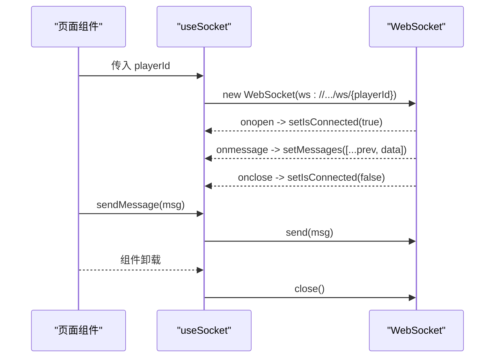

**图表来源**
- [frontend/src/hooks/useSocket.ts:8-33](file://frontend/src/hooks/useSocket.ts#L8-L33)
- [frontend/src/hooks/useSocket.ts:35-39](file://frontend/src/hooks/useSocket.ts#L35-L39)

**章节来源**
- [frontend/src/hooks/useSocket.ts:1-43](file://frontend/src/hooks/useSocket.ts#L1-L43)
- [docs/wiki/Frontend-Guide.md:35-44](file://docs/wiki/Frontend-Guide.md#L35-L44)

### 样式与主题（Tailwind + 字体）
- 字体：在根布局注入 Geist Sans 与 Geist Mono 字体变量，body 应用变量并启用抗锯齿。
- 主题：通过 :root 变量与 @theme inline 定义颜色与字体变量；支持暗色模式媒体查询。
- PostCSS：使用 @tailwindcss/postcss 插件，配合 Tailwind 原子类快速构建 UI。

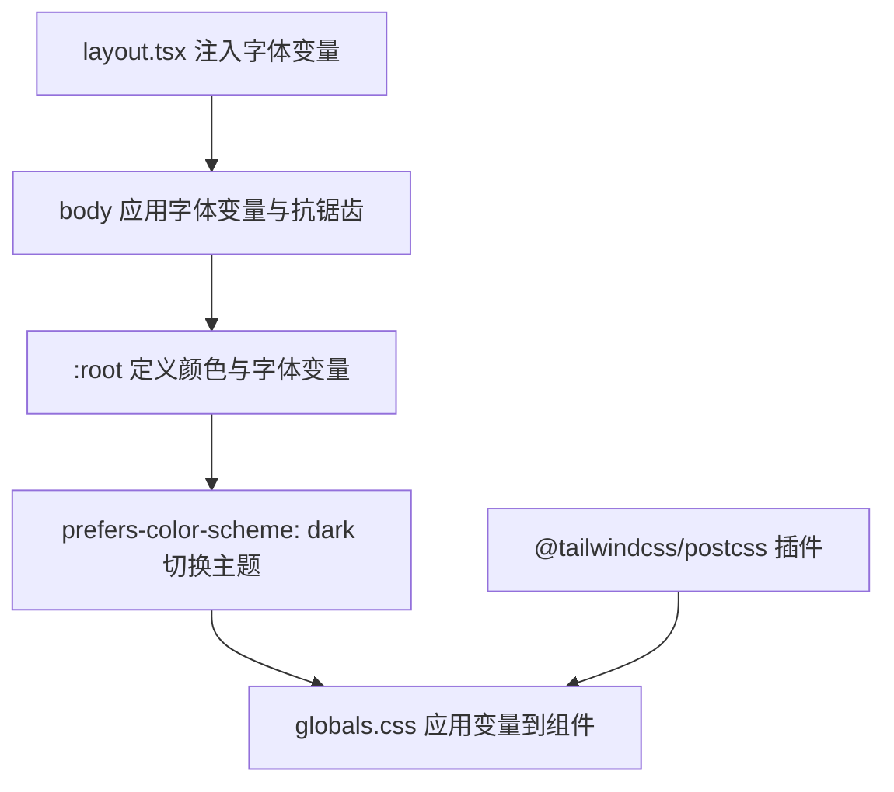

**图表来源**
- [frontend/src/app/layout.tsx:5-28](file://frontend/src/app/layout.tsx#L5-L28)
- [frontend/src/app/globals.css:3-26](file://frontend/src/app/globals.css#L3-L26)
- [frontend/postcss.config.mjs:1-8](file://frontend/postcss.config.mjs#L1-L8)

**章节来源**
- [frontend/src/app/layout.tsx:1-35](file://frontend/src/app/layout.tsx#L1-L35)
- [frontend/src/app/globals.css:1-27](file://frontend/src/app/globals.css#L1-L27)
- [frontend/postcss.config.mjs:1-8](file://frontend/postcss.config.mjs#L1-L8)

## 后台管理系统

### 管理页面架构模式
后台管理系统采用页面化架构，每个功能模块都有独立的页面组件，替代了传统的对话框式设计。这种架构提供了更好的用户体验和更清晰的功能组织。

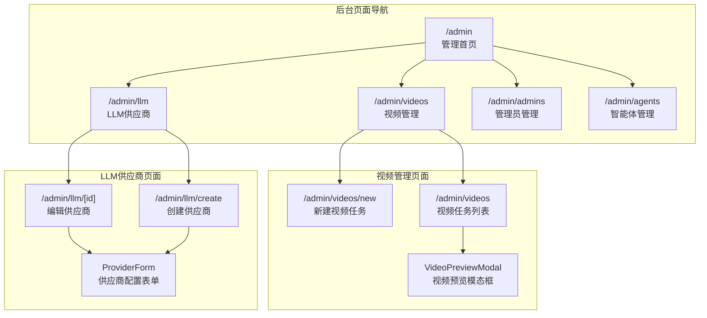

**图表来源**
- [backend/admin/src/app/admin/videos/new/page.tsx:1-420](file://backend/admin/src/app/admin/videos/new/page.tsx#L1-L420)
- [backend/admin/src/app/admin/videos/page.tsx:1-268](file://backend/admin/src/app/admin/videos/page.tsx#L1-L268)
- [backend/admin/src/app/admin/llm/create/page.tsx:1-9](file://backend/admin/src/app/admin/llm/create/page.tsx#L1-L9)
- [backend/admin/src/app/admin/llm/[id]/page.tsx](file://backend/admin/src/app/admin/llm/[id]/page.tsx#L1-L51)
- [backend/admin/src/app/admin/llm/components/provider-form.tsx:1-672](file://backend/admin/src/app/admin/llm/components/provider-form.tsx#L1-L672)

**章节来源**
- [backend/admin/src/app/admin/videos/new/page.tsx:1-420](file://backend/admin/src/app/admin/videos/new/page.tsx#L1-L420)
- [backend/admin/src/app/admin/videos/page.tsx:1-268](file://backend/admin/src/app/admin/videos/page.tsx#L1-L268)
- [backend/admin/src/app/admin/llm/create/page.tsx:1-9](file://backend/admin/src/app/admin/llm/create/page.tsx#L1-L9)
- [backend/admin/src/app/admin/llm/[id]/page.tsx](file://backend/admin/src/app/admin/llm/[id]/page.tsx#L1-L51)

## 视频生成系统

### 视频创建页面（CreateVideoPage）
视频创建页面是后台管理系统的核心功能之一，支持多种视频生成模式和高级配置选项。

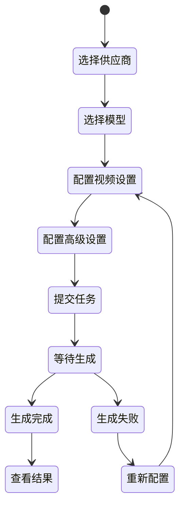

**图表来源**
- [backend/admin/src/app/admin/videos/new/page.tsx:101-130](file://backend/admin/src/app/admin/videos/new/page.tsx#L101-L130)

#### 核心功能特性
- **多供应商支持**：支持不同视频生成供应商的配置和切换
- **动态表单显示**：根据模型能力动态显示相应的配置选项
- **MiniMax特有配置**：支持提示词优化和快速预处理功能
- **实时状态管理**：集成视频任务状态管理和轮询机制

**章节来源**
- [backend/admin/src/app/admin/videos/new/page.tsx:25-150](file://backend/admin/src/app/admin/videos/new/page.tsx#L25-L150)
- [backend/admin/src/app/admin/videos/new/page.tsx:150-420](file://backend/admin/src/app/admin/videos/new/page.tsx#L150-L420)

### 视频任务管理
视频任务管理页面提供完整的视频任务生命周期管理，包括创建、查看、删除等功能。

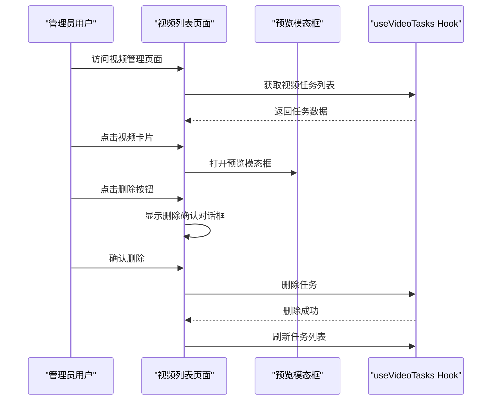

**图表来源**
- [backend/admin/src/app/admin/videos/page.tsx:63-267](file://backend/admin/src/app/admin/videos/page.tsx#L63-L267)
- [backend/admin/src/app/admin/videos/VideoPreviewModal.tsx:24-115](file://backend/admin/src/app/admin/videos/VideoPreviewModal.tsx#L24-L115)

#### 任务状态管理
- **状态映射**：支持排队中、生成中、已完成、失败等状态
- **自动轮询**：对活跃任务进行定时轮询更新
- **分页显示**：支持大量任务的分页浏览
- **实时预览**：支持视频文件的在线预览

**章节来源**
- [backend/admin/src/app/admin/videos/page.tsx:31-58](file://backend/admin/src/app/admin/videos/page.tsx#L31-L58)
- [backend/admin/src/app/admin/videos/page.tsx:63-267](file://backend/admin/src/app/admin/videos/page.tsx#L63-L267)
- [backend/admin/src/hooks/useVideoTasks.ts:17-57](file://backend/admin/src/hooks/useVideoTasks.ts#L17-L57)

### 模型能力检测系统
系统实现了智能的模型能力检测机制，能够根据不同的视频模型自动调整表单配置。

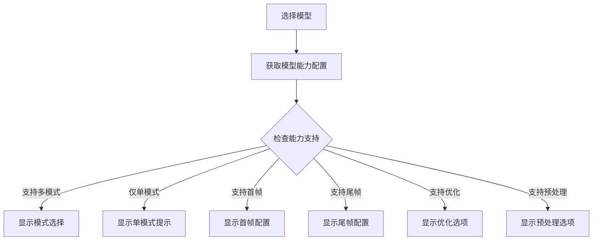

**图表来源**
- [backend/admin/src/hooks/useModelCapabilities.ts:38-69](file://backend/admin/src/hooks/useModelCapabilities.ts#L38-L69)

**章节来源**
- [backend/admin/src/hooks/useModelCapabilities.ts:11-33](file://backend/admin/src/hooks/useModelCapabilities.ts#L11-L33)
- [backend/admin/src/hooks/useModelCapabilities.ts:38-69](file://backend/admin/src/hooks/useModelCapabilities.ts#L38-L69)
- [backend/admin/src/types/video.ts:5-53](file://backend/admin/src/types/video.ts#L5-L53)

## LLM供应商管理

### 供应商配置表单
LLM供应商管理提供了完整的供应商配置界面，支持多种供应商类型的配置和测试连接功能。

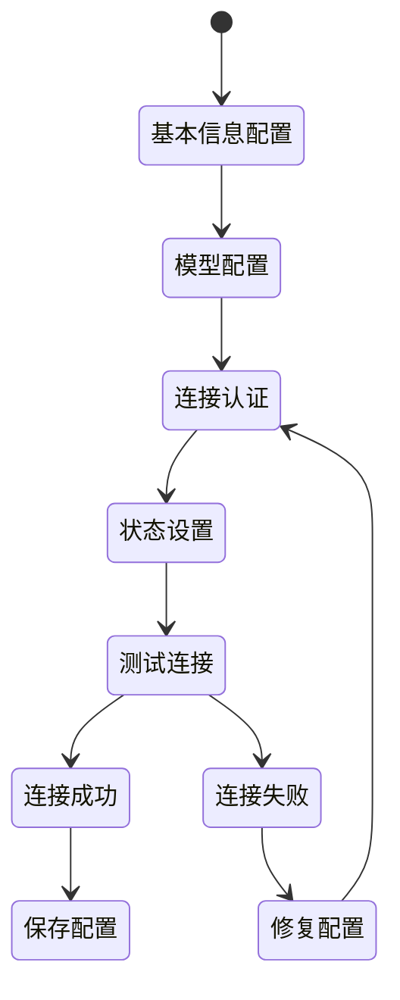

**图表来源**
- [backend/admin/src/app/admin/llm/components/provider-form.tsx:78-126](file://backend/admin/src/app/admin/llm/components/provider-form.tsx#L78-L126)

#### 表单特性
- **动态模型管理**：支持添加、删除和编辑模型配置
- **成本配置管理**：支持预设和自定义成本维度配置
- **标签系统**：支持供应商标签的添加和管理
- **测试连接功能**：支持连接测试和错误提示
- **状态控制**：支持启用/禁用和默认供应商设置

**章节来源**
- [backend/admin/src/app/admin/llm/components/provider-form.tsx:42-183](file://backend/admin/src/app/admin/llm/components/provider-form.tsx#L42-L183)
- [backend/admin/src/app/admin/llm/create/page.tsx:6-8](file://backend/admin/src/app/admin/llm/create/page.tsx#L6-L8)
- [backend/admin/src/app/admin/llm/[id]/page.tsx](file://backend/admin/src/app/admin/llm/[id]/page.tsx#L14-L50)

### 供应商类型定义
系统支持多种LLM供应商类型，每种类型都有特定的配置要求和功能特性。

**章节来源**
- [backend/admin/src/app/admin/llm/components/provider-form.tsx:36-36](file://backend/admin/src/app/admin/llm/components/provider-form.tsx#L36-L36)

## 管理员管理

### 管理员列表与操作
管理员管理页面提供了完整的管理员账户管理功能，包括创建、编辑、删除和积分调整等操作。

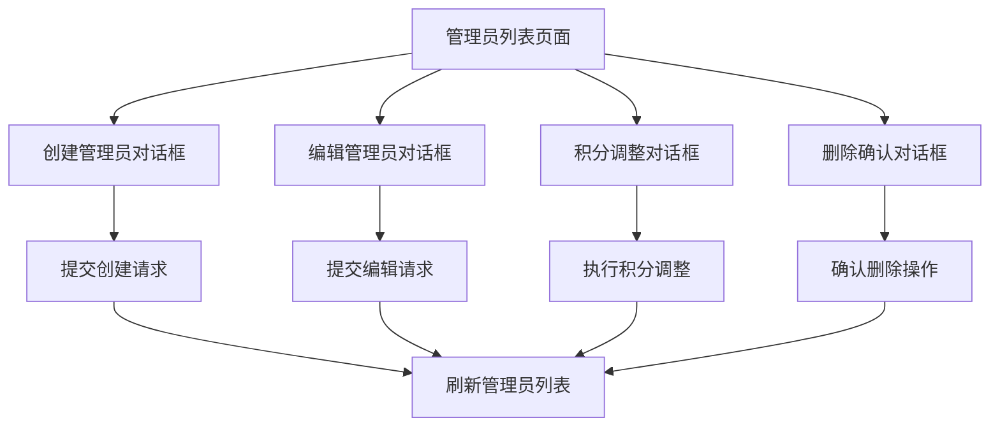

**图表来源**
- [backend/admin/src/app/admin/admins/page.tsx:140-227](file://backend/admin/src/app/admin/admins/page.tsx#L140-L227)

#### 核心功能
- **权限管理**：支持管理员权限级别的设置和管理
- **状态控制**：支持管理员账户的启用/禁用状态管理
- **积分系统**：支持管理员积分的充值、扣减和记录管理
- **批量操作**：支持批量删除和状态切换操作

**章节来源**
- [backend/admin/src/app/admin/admins/page.tsx:87-310](file://backend/admin/src/app/admin/admins/page.tsx#L87-L310)
- [backend/admin/src/app/admin/admins/page.tsx:312-530](file://backend/admin/src/app/admin/admins/page.tsx#L312-L530)

## 智能体管理

### 智能体详情页面
智能体管理页面提供了智能体的完整配置和预览功能，支持实时聊天预览和配置编辑。

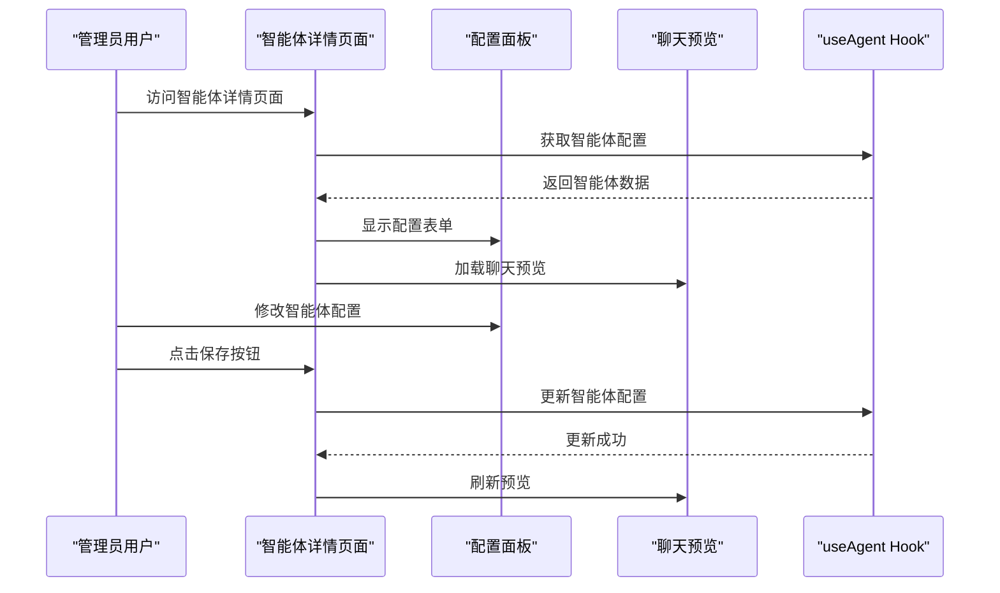

**图表来源**
- [backend/admin/src/app/admin/agents/[id]/page.tsx](file://backend/admin/src/app/admin/agents/[id]/page.tsx#L19-L117)

#### 页面布局设计
- **双栏布局**：左侧配置面板，右侧聊天预览
- **实时预览**：配置修改后即时反映在聊天预览中
- **表单验证**：集成表单验证和错误处理
- **动态加载**：支持智能体的创建和编辑两种模式

**章节来源**
- [backend/admin/src/app/admin/agents/[id]/page.tsx](file://backend/admin/src/app/admin/agents/[id]/page.tsx#L19-L149)

## 依赖关系分析
- 依赖生态：Next.js 16、React 19、TypeScript、Tailwind CSS、Pixi.js、socket.io-client、SWR、Lucide React 等。
- 构建配置：tsconfig.json 使用路径别名 @/* 指向 src；next.config.ts 为空配置占位；postcss.config.mjs 引入 Tailwind 插件。
- 组件耦合：页面与组件松耦合，通过 props 传递尺寸；Hook 作为横切关注点被页面复用。
- 后台管理：采用模块化设计，每个功能模块都有独立的页面和组件。

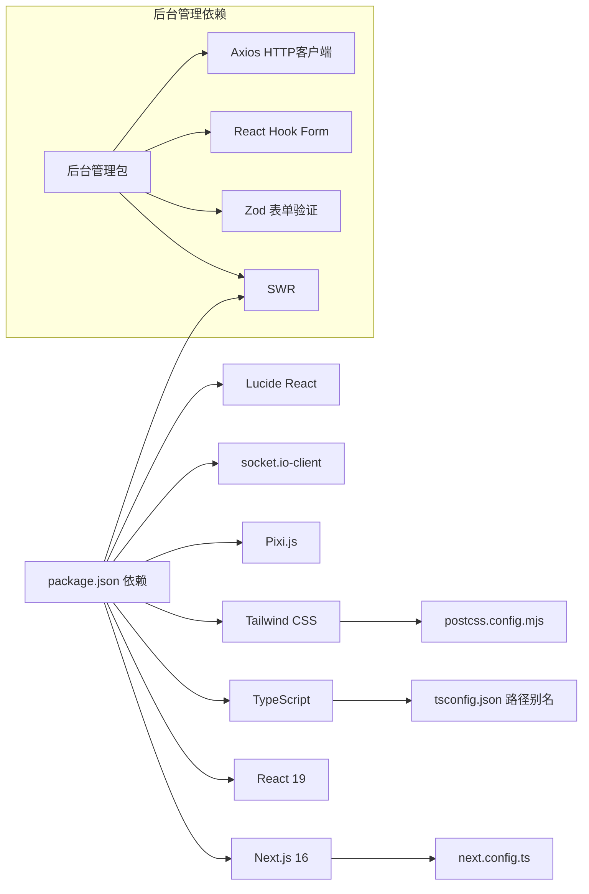

**图表来源**
- [frontend/package.json:11-22](file://frontend/package.json#L11-L22)
- [frontend/tsconfig.json:21-23](file://frontend/tsconfig.json#L21-L23)
- [frontend/next.config.ts:3-5](file://frontend/next.config.ts#L3-L5)
- [frontend/postcss.config.mjs:1-8](file://frontend/postcss.config.mjs#L1-L8)
- [backend/admin/src/app/admin/llm/components/provider-form.tsx:5-6](file://backend/admin/src/app/admin/llm/components/provider-form.tsx#L5-L6)

**章节来源**
- [frontend/package.json:1-35](file://frontend/package.json#L1-L35)
- [frontend/tsconfig.json:1-35](file://frontend/tsconfig.json#L1-L35)
- [frontend/next.config.ts:1-8](file://frontend/next.config.ts#L1-L8)
- [frontend/postcss.config.mjs:1-8](file://frontend/postcss.config.mjs#L1-L8)

## 性能考虑
- 动态导入与 SSR 兼容：TheaterCanvas 使用 next/dynamic 且 ssr: false，避免服务端渲染时的 DOM 依赖。
- Pixi.js 资源管理：组件卸载时销毁 Application 与纹理，防止内存泄漏与重复实例。
- WebSocket 连接：仅在有有效 playerId 时建立连接；组件卸载时主动关闭，降低后台压力。
- 视频任务轮询：对活跃任务进行智能轮询，避免不必要的 API 调用。
- 表单优化：使用 React Hook Form 进行高性能表单管理。
- 样式体积：Tailwind 原子类按需使用，避免引入未使用的样式；字体变量集中管理减少重复计算。
- 构建优化：TypeScript 开启严格模式与隔离模块，提升类型安全与 Tree-shaking 效果。

**章节来源**
- [frontend/src/components/TheaterCanvas.tsx:14-44](file://frontend/src/components/TheaterCanvas.tsx#L14-L44)
- [frontend/src/hooks/useSocket.ts:8-33](file://frontend/src/hooks/useSocket.ts#L8-L33)
- [backend/admin/src/hooks/useVideoTasks.ts:34-48](file://backend/admin/src/hooks/useVideoTasks.ts#L34-L48)
- [frontend/src/app/globals.css:1-27](file://frontend/src/app/globals.css#L1-L27)
- [frontend/tsconfig.json:7-14](file://frontend/tsconfig.json#L7-L14)

## 故障排查指南
- WebSocket 无法连接
  - 确认后端服务已启动且端口 8000 可访问。
  - 检查 useSocket 中的 ws 地址与 playerId 是否正确。
  - 查看浏览器控制台网络面板与 WebSocket 事件日志。
- Pixi.js 未渲染或报错
  - 确认 TheaterCanvas 已通过 dynamic 导入且 ssr: false。
  - 检查容器 div 是否存在且可挂载 canvas。
  - 确保组件卸载时正确销毁 Pixi Application。
- 视频任务状态异常
  - 检查 useVideoTasks Hook 中的轮询逻辑是否正常工作。
  - 确认后端视频生成服务的可用性和配置正确性。
  - 查看浏览器控制台的网络请求和错误日志。
- 表单验证问题
  - 检查 React Hook Form 的配置和验证规则。
  - 确认 Zod Schema 的定义是否正确。
  - 查看表单字段的错误提示和状态。
- 样式异常
  - 检查 globals.css 中字体变量与 @theme inline 是否生效。
  - 确认 postcss.config.mjs 正确引入 @tailwindcss/postcss 插件。
- 构建错误
  - 检查 tsconfig.json 的路径别名与模块解析策略。
  - 确认 Next.js 16 与 React 19 版本兼容性。

**章节来源**
- [frontend/src/hooks/useSocket.ts:8-33](file://frontend/src/hooks/useSocket.ts#L8-L33)
- [frontend/src/components/TheaterCanvas.tsx:14-44](file://frontend/src/components/TheaterCanvas.tsx#L14-L44)
- [backend/admin/src/hooks/useVideoTasks.ts:34-48](file://backend/admin/src/hooks/useVideoTasks.ts#L34-L48)
- [frontend/src/app/globals.css:1-27](file://frontend/src/app/globals.css#L1-L27)
- [frontend/postcss.config.mjs:1-8](file://frontend/postcss.config.mjs#L1-L8)
- [frontend/tsconfig.json:21-23](file://frontend/tsconfig.json#L21-L23)
- [docs/wiki/Frontend-Guide.md:59-69](file://docs/wiki/Frontend-Guide.md#L59-L69)

## 结论
本指南从项目结构、页面与组件设计、渲染与通信、样式与主题、后台管理系统、视频生成系统、LLM供应商管理、管理员管理、智能体管理、性能与调试等方面，系统梳理了基于 Next.js 16 的前端开发实践。后台管理系统采用了页面化架构，提供了更好的用户体验和更清晰的功能组织。视频生成系统支持多种供应商和高级配置选项，特别是 MiniMax 的特有功能。建议在后续迭代中进一步完善组件抽象、状态管理与错误边界，并持续优化渲染性能与用户体验。

## 附录
- 快速启动
  - 安装依赖：在 frontend 目录执行安装命令。
  - 启动开发服务器：在 frontend 目录执行开发命令。
  - 访问地址：在浏览器打开本地开发地址。
  - 后台管理：访问 http://localhost:3000/admin 进入后台管理系统。
- 相关文档
  - Wiki 前端指南：包含目录结构、核心组件与调试步骤。
  - 后台管理文档：详细说明各功能模块的使用方法和配置选项。

**章节来源**
- [README.md:103-114](file://README.md#L103-L114)
- [docs/wiki/Frontend-Guide.md:59-69](file://docs/wiki/Frontend-Guide.md#L59-L69)