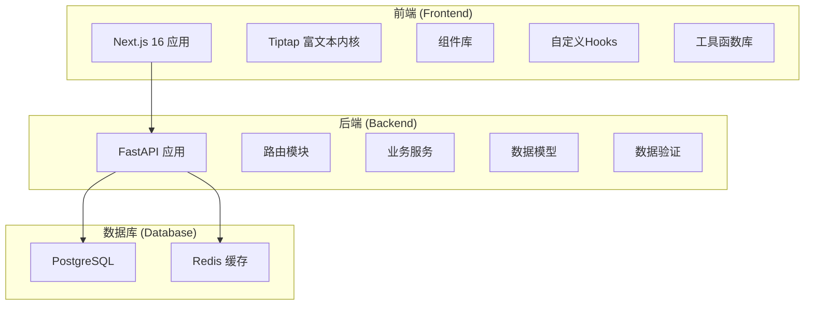
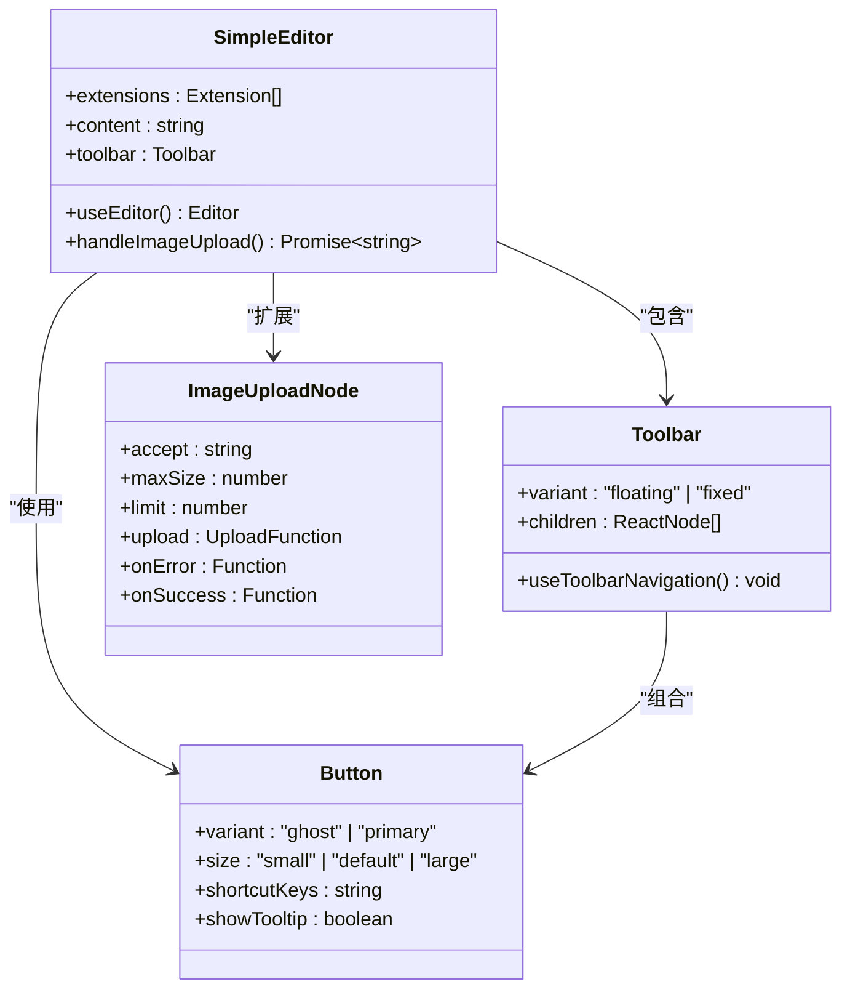
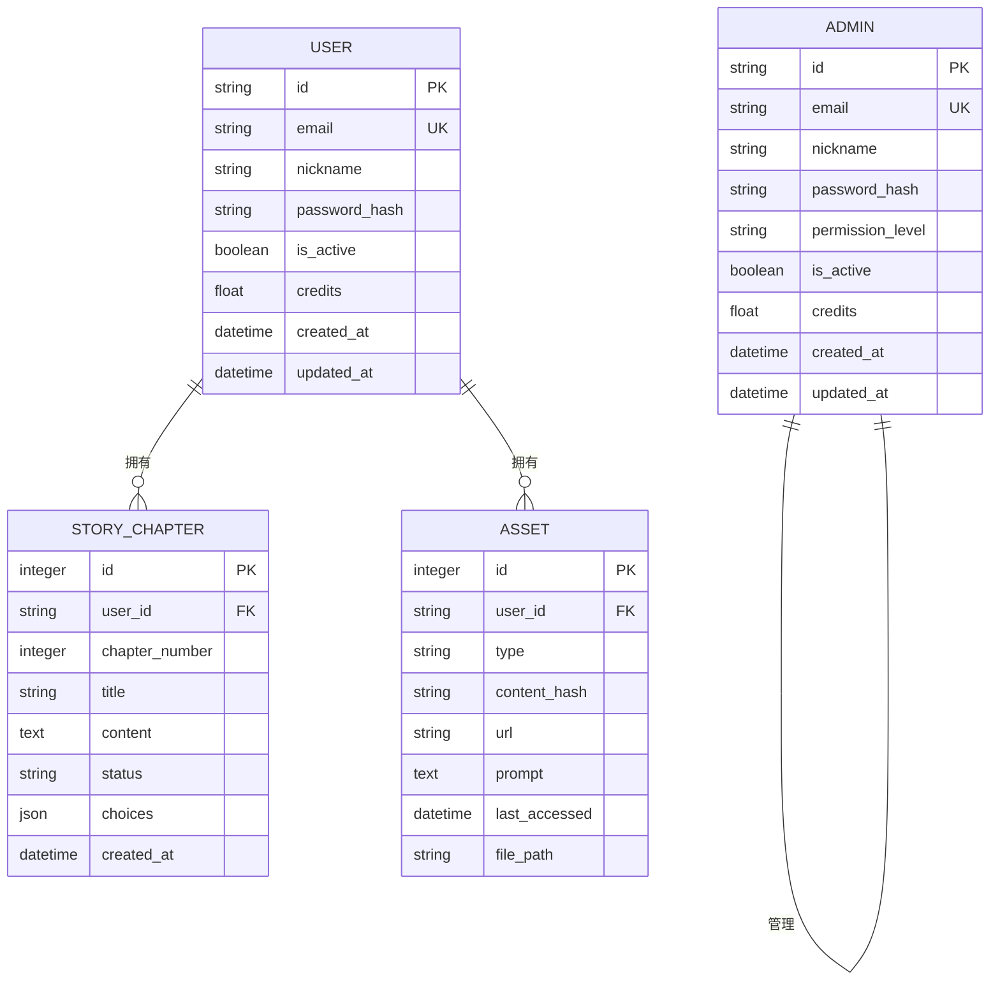
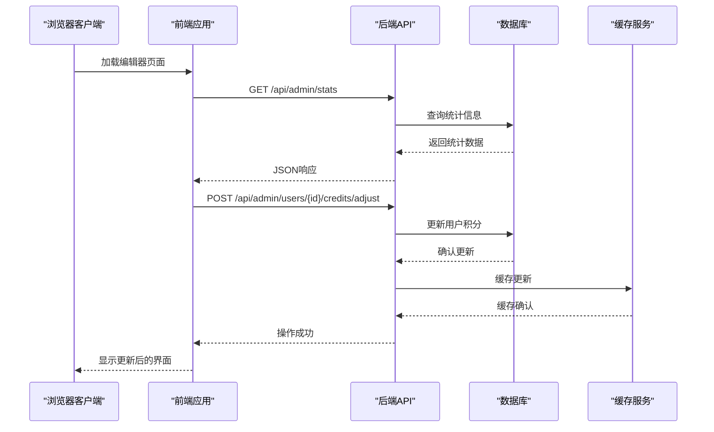
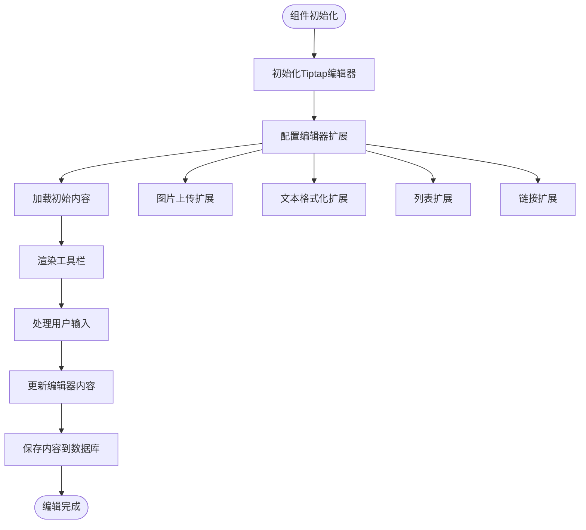
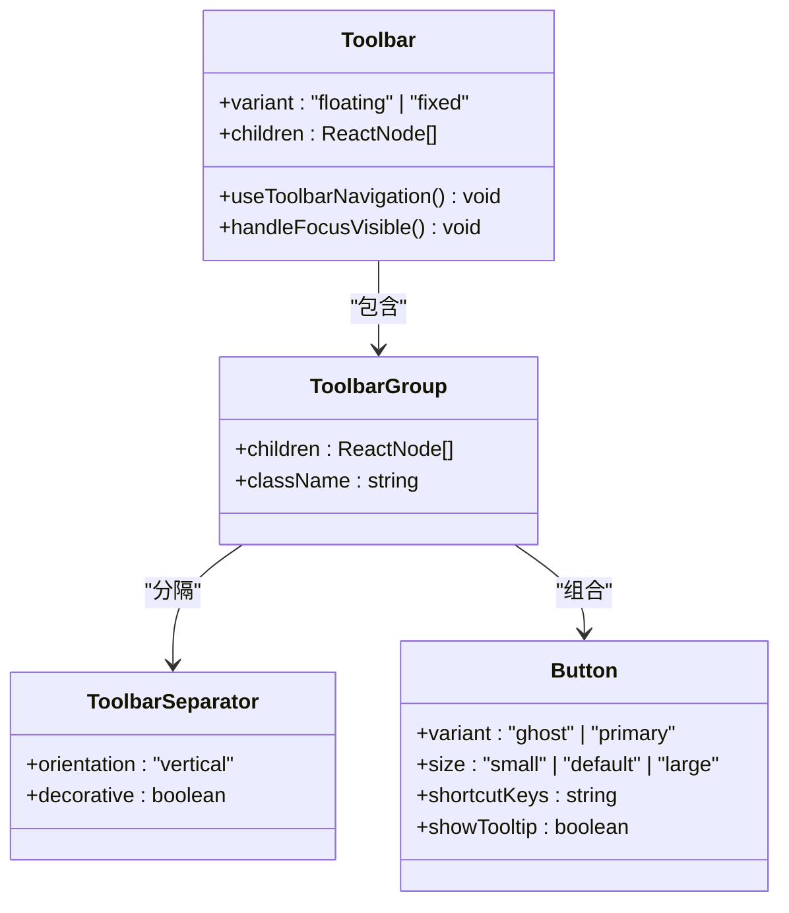
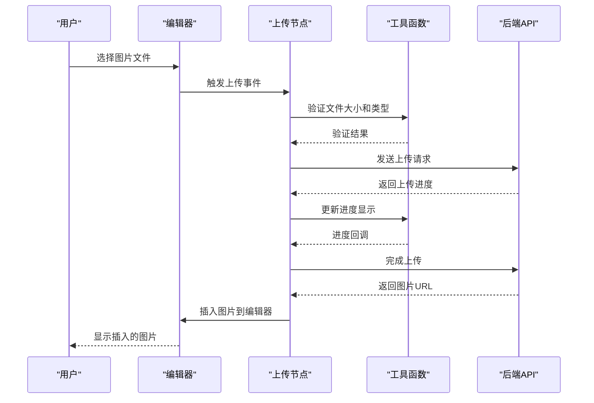
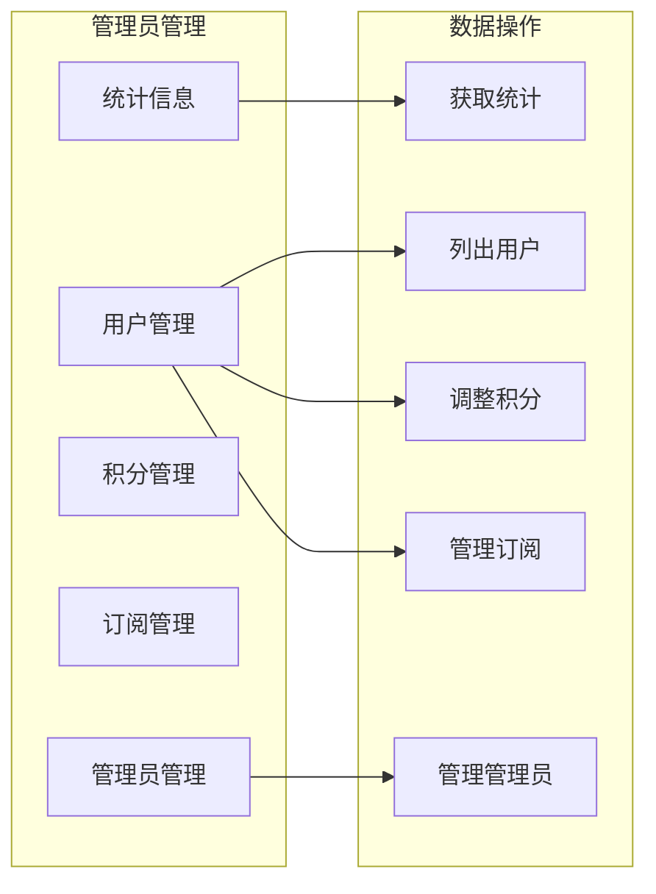

# 富文本编辑系统

<cite>
**本文档引用的文件**
- [main.py](file://backend/main.py)
- [simple-editor.tsx](file://frontend/src/components/tiptap-templates/simple/simple-editor.tsx)
- [use-tiptap-editor.ts](file://frontend/src/hooks/use-tiptap-editor.ts)
- [tiptap-utils.ts](file://frontend/src/lib/tiptap-utils.ts)
- [admin.py](file://backend/routers/admin.py)
- [models.py](file://backend/models.py)
- [schemas.py](file://backend/schemas.py)
- [package.json](file://frontend/package.json)
- [requirements.txt](file://backend/requirements.txt)
- [README.md](file://README.md)
- [toolbar.tsx](file://frontend/src/components/tiptap-ui-primitive/toolbar/toolbar.tsx)
- [button.tsx](file://frontend/src/components/tiptap-ui-primitive/button/button.tsx)
- [simple-editor.scss](file://frontend/src/components/tiptap-templates/simple/simple-editor.scss)
- [image-upload-node-extension.ts](file://frontend/src/components/tiptap-node/image-upload-node/image-upload-node-extension.ts)
</cite>

## 目录
1. [简介](#简介)
2. [项目结构](#项目结构)
3. [核心组件](#核心组件)
4. [架构概览](#架构概览)
5. [详细组件分析](#详细组件分析)
6. [依赖关系分析](#依赖关系分析)
7. [性能考虑](#性能考虑)
8. [故障排除指南](#故障排除指南)
9. [结论](#结论)

## 简介

富文本编辑系统是一个基于现代Web技术栈构建的高性能富文本编辑器，采用前后端分离架构设计。系统集成了强大的Tiptap富文本编辑内核，提供了丰富的文本格式化功能、图片上传能力以及响应式UI设计。

该系统的核心特色包括：
- **现代化编辑体验**：基于Tiptap 3.x构建，支持多种文本格式化选项
- **响应式设计**：适配桌面端和移动端设备
- **插件化架构**：模块化的组件设计，便于扩展和维护
- **类型安全**：完整的TypeScript类型定义
- **高性能渲染**：优化的React组件和状态管理

## 项目结构

项目采用清晰的前后端分离架构，每个部分都有独立的技术栈和职责分工：



**图表来源**
- [main.py:111-154](file://backend/main.py#L111-L154)
- [README.md:39-54](file://README.md#L39-L54)

**章节来源**
- [README.md:37-139](file://README.md#L37-L139)

## 核心组件

### 前端核心组件

系统的核心前端组件基于Tiptap富文本编辑器，提供了完整的编辑功能：

#### 主要组件架构



**图表来源**
- [simple-editor.tsx:186-281](file://frontend/src/components/tiptap-templates/simple/simple-editor.tsx#L186-L281)
- [toolbar.tsx:82-124](file://frontend/src/components/tiptap-ui-primitive/toolbar/toolbar.tsx#L82-L124)
- [button.tsx:46-104](file://frontend/src/components/tiptap-ui-primitive/button/button.tsx#L46-L104)

### 后端核心组件

后端采用FastAPI框架，提供了RESTful API接口和数据库管理功能：

#### 数据模型关系



**图表来源**
- [models.py:35-383](file://backend/models.py#L35-L383)

**章节来源**
- [simple-editor.tsx:1-281](file://frontend/src/components/tiptap-templates/simple/simple-editor.tsx#L1-L281)
- [models.py:1-383](file://backend/models.py#L1-L383)

## 架构概览

系统采用现代全栈架构设计，实现了前后端的完全分离：



**图表来源**
- [main.py:135-154](file://backend/main.py#L135-L154)
- [admin.py:29-47](file://backend/routers/admin.py#L29-L47)

系统架构的关键特点：

1. **前后端分离**：前端使用Next.js 16，后端使用FastAPI
2. **响应式设计**：支持桌面端和移动端适配
3. **插件化扩展**：基于Tiptap的模块化架构
4. **类型安全**：完整的TypeScript和Pydantic验证
5. **高性能**：优化的组件渲染和状态管理

**章节来源**
- [main.py:1-154](file://backend/main.py#L1-L154)
- [README.md:14-33](file://README.md#L14-L33)

## 详细组件分析

### 富文本编辑器组件

#### SimpleEditor 组件

SimpleEditor是系统的核心编辑器组件，基于Tiptap构建，提供了完整的富文本编辑功能：



**图表来源**
- [simple-editor.tsx:194-232](file://frontend/src/components/tiptap-templates/simple/simple-editor.tsx#L194-L232)

#### 工具栏组件

工具栏组件提供了直观的编辑操作界面：



**图表来源**
- [toolbar.tsx:82-124](file://frontend/src/components/tiptap-ui-primitive/toolbar/toolbar.tsx#L82-L124)
- [button.tsx:46-104](file://frontend/src/components/tiptap-ui-primitive/button/button.tsx#L46-L104)

**章节来源**
- [simple-editor.tsx:78-155](file://frontend/src/components/tiptap-templates/simple/simple-editor.tsx#L78-L155)
- [toolbar.tsx:1-124](file://frontend/src/components/tiptap-ui-primitive/toolbar/toolbar.tsx#L1-L124)

### 图片上传功能

系统集成了强大的图片上传功能，支持拖拽上传和进度跟踪：

#### 图片上传流程



**图表来源**
- [image-upload-node-extension.ts:66-163](file://frontend/src/components/tiptap-node/image-upload-node/image-upload-node-extension.ts#L66-L163)
- [tiptap-utils.ts:361-388](file://frontend/src/lib/tiptap-utils.ts#L361-L388)

**章节来源**
- [image-upload-node-extension.ts:1-163](file://frontend/src/components/tiptap-node/image-upload-node/image-upload-node-extension.ts#L1-L163)
- [tiptap-utils.ts:1-641](file://frontend/src/lib/tiptap-utils.ts#L1-L641)

### 后端管理功能

#### 管理员API接口

后端提供了完整的管理员管理功能，包括用户管理、积分管理和订阅管理：



**图表来源**
- [admin.py:29-498](file://backend/routers/admin.py#L29-L498)

**章节来源**
- [admin.py:1-498](file://backend/routers/admin.py#L1-L498)

## 依赖关系分析

### 前端依赖关系

系统前端使用了现代化的依赖管理策略，确保了最佳的开发体验和性能表现：

```mermaid
graph TB
subgraph "核心依赖"
React[react@19.2.3]
Next[next@16.1.6]
Tiptap[@tiptap/*]
Zustand[zustand@5.0.12]
end
subgraph "UI组件库"
RadixUI[@radix-ui/*]
Lucide[lucide-react@0.574.0]
Tailwind[tailwindcss@4]
end
subgraph "工具库"
clsx[clsx@2.1.1]
uuid[uuid@13.0.0]
axios[axios@1.13.5]
end
React --> Tiptap
Next --> React
Tiptap --> Zustand
RadixUI --> React
Lucide --> React
```

**图表来源**
- [package.json:13-61](file://frontend/package.json#L13-L61)

### 后端依赖关系

后端采用FastAPI框架，提供了高性能的API服务：

```mermaid
graph TB
subgraph "Web框架"
FastAPI[fastapi>=0.129.0]
Uvicorn[uvicorn[standard]>=0.41.0]
end
subgraph "数据库层"
SQLAlchemy[sqlalchemy>=2.0.46]
AsyncPG[asyncpg>=0.31.0]
Alembic[alembic>=1.18.4]
end
subgraph "AI集成"
Agentscope[agentscope>=1.0.16]
OpenAI[openai>=2.21.0]
GoogleGenAI[google-genai>=1.65.0]
end
subgraph "其他工具"
Redis[redis>=5.0.0]
Websockets[websockets>=16.0]
Bcrypt[bcrypt>=4.0.0]
end
FastAPI --> SQLAlchemy
FastAPI --> Agentscope
SQLAlchemy --> AsyncPG
Agentscope --> OpenAI
Agentscope --> GoogleGenAI
```

**图表来源**
- [requirements.txt:1-26](file://backend/requirements.txt#L1-L26)

**章节来源**
- [package.json:1-86](file://frontend/package.json#L1-L86)
- [requirements.txt:1-26](file://backend/requirements.txt#L1-L26)

## 性能考虑

### 前端性能优化

系统在前端层面采用了多项性能优化策略：

1. **懒加载组件**：使用React.lazy和Suspense实现组件懒加载
2. **状态管理优化**：采用Zustand进行轻量级状态管理
3. **CSS模块化**：使用SCSS模块化避免样式冲突
4. **响应式设计**：优化移动端性能和用户体验

### 后端性能优化

后端系统通过以下方式确保高性能：

1. **异步处理**：使用FastAPI的异步特性处理高并发请求
2. **数据库优化**：采用SQLAlchemy异步ORM减少数据库连接开销
3. **缓存策略**：使用Redis缓存热点数据
4. **连接池管理**：合理配置数据库连接池参数

## 故障排除指南

### 常见问题及解决方案

#### 编辑器初始化失败

**问题症状**：编辑器无法正常加载或显示空白

**可能原因**：
1. Tiptap扩展未正确配置
2. 编辑器内容格式不正确
3. 样式文件加载失败

**解决方案**：
1. 检查编辑器扩展配置
2. 验证内容格式的合法性
3. 确认样式文件路径正确

#### 图片上传失败

**问题症状**：图片无法上传或显示错误

**可能原因**：
1. 文件大小超过限制
2. 文件类型不受支持
3. 网络连接问题

**解决方案**：
1. 检查文件大小是否超过5MB限制
2. 确认文件类型为图片格式
3. 验证网络连接稳定性

#### API请求超时

**问题症状**：后端API响应缓慢或超时

**可能原因**：
1. 数据库连接池耗尽
2. Redis缓存未响应
3. 网络延迟过高

**解决方案**：
1. 检查数据库连接池配置
2. 验证Redis服务状态
3. 优化网络配置

**章节来源**
- [tiptap-utils.ts:361-388](file://frontend/src/lib/tiptap-utils.ts#L361-L388)
- [main.py:50-110](file://backend/main.py#L50-L110)

## 结论

富文本编辑系统是一个功能完整、架构清晰的现代化编辑器解决方案。系统通过前后端分离的设计，实现了高度的模块化和可扩展性。

### 主要优势

1. **技术先进性**：采用最新的React 19、Next.js 16和Tiptap 3.x技术栈
2. **用户体验优秀**：提供流畅的编辑体验和响应式设计
3. **扩展性强**：模块化的组件设计便于功能扩展
4. **性能优异**：通过多种优化策略确保系统高性能运行
5. **开发友好**：完整的TypeScript支持和清晰的代码结构

### 未来发展方向

1. **AI集成增强**：进一步整合AI生成功能
2. **协作编辑**：支持多人实时协作编辑
3. **插件生态**：建立丰富的第三方插件生态系统
4. **移动端优化**：进一步提升移动端编辑体验
5. **性能监控**：建立完善的性能监控和分析体系

该系统为富文本编辑领域提供了一个优秀的开源解决方案，具有很高的实用价值和推广前景。