# 开发基础设施

<cite>
**本文档引用的文件**
- [backend/main.py](file://backend/main.py)
- [backend/config.py](file://backend/config.py)
- [backend/database.py](file://backend/database.py)
- [backend/requirements.txt](file://backend/requirements.txt)
- [frontend/package.json](file://frontend/package.json)
- [frontend/tsconfig.json](file://frontend/tsconfig.json)
- [frontend/next.config.ts](file://frontend/next.config.ts)
- [frontend/eslint.config.mjs](file://frontend/eslint.config.mjs)
- [frontend/tailwind.config.ts](file://frontend/tailwind.config.ts)
- [frontend/next-env.d.ts](file://frontend/next-env.d.ts)
- [backend/admin/tsconfig.json](file://backend/admin/tsconfig.json)
- [backend/admin/vitest.config.ts](file://backend/admin/vitest.config.ts)
</cite>

## 更新摘要
**所做更改**
- 更新了前端开发环境配置部分，反映了Next.js开发模式下类型检查路径的修复
- 新增了关于开发服务器正确使用.dev/types/routes.d.ts而非.next/types/routes.d.ts的说明
- 补充了TypeScript配置中类型检查路径的相关内容

## 目录
1. [项目概述](#项目概述)
2. [整体架构](#整体架构)
3. [后端开发环境](#后端开发环境)
4. [前端开发环境](#前端开发环境)
5. [配置管理](#配置管理)
6. [数据库基础设施](#数据库基础设施)
7. [构建与部署](#构建与部署)
8. [测试框架](#测试框架)
9. [开发工具链](#开发工具链)
10. [性能优化](#性能优化)
11. [故障排除指南](#故障排除指南)
12. [总结](#总结)

## 项目概述

无限叙事剧院是一个基于现代Web技术栈构建的全栈应用，专注于提供沉浸式的叙事体验。该项目采用前后端分离架构，后端使用FastAPI提供RESTful API服务，前端使用Next.js构建用户界面。

### 核心特性
- **实时通信**: 支持WebSocket连接实现双向数据传输
- **多模型支持**: 集成多种AI模型提供商（OpenAI、Gemini、Claude等）
- **多媒体处理**: 支持视频生成和图像处理功能
- **权限管理**: 完整的用户认证和授权系统
- **响应式设计**: 基于Tailwind CSS的现代化UI组件

## 整体架构

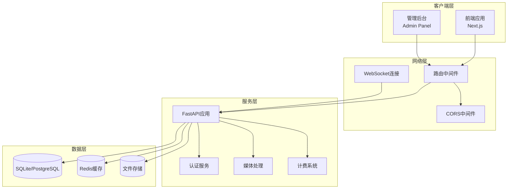

**图表来源**
- [backend/main.py:111-132](file://backend/main.py#L111-L132)
- [backend/config.py:15](file://backend/config.py#L15)

## 后端开发环境

### 依赖管理

后端使用Python 3.11+开发，主要依赖包括：

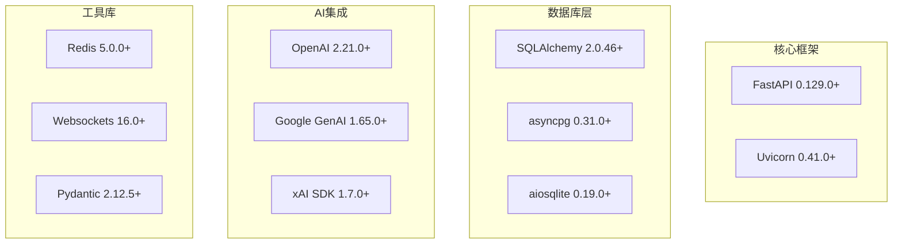

**图表来源**
- [backend/requirements.txt:1-26](file://backend/requirements.txt#L1-L26)

### 应用启动流程

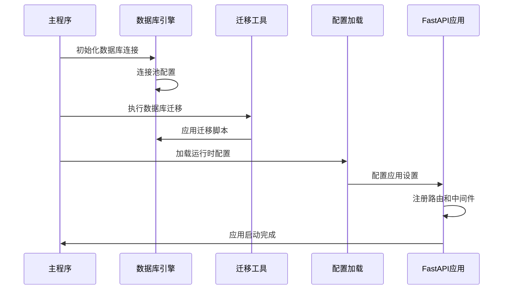

**图表来源**
- [backend/main.py:50-109](file://backend/main.py#L50-L109)

**章节来源**
- [backend/requirements.txt:1-26](file://backend/requirements.txt#L1-L26)
- [backend/main.py:152-154](file://backend/main.py#L152-L154)

## 前端开发环境

### 依赖配置

前端使用Next.js 16.1.6构建，包含以下核心依赖：

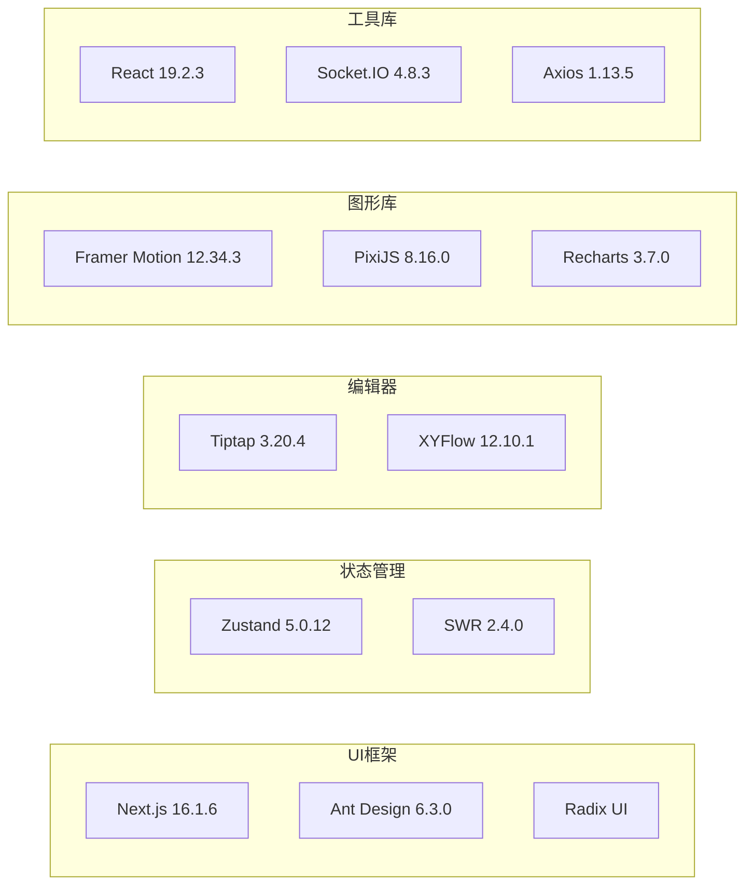

**图表来源**
- [frontend/package.json:13-61](file://frontend/package.json#L13-L61)

### TypeScript配置

前端采用严格的TypeScript配置，支持现代JavaScript特性：

| 配置项 | 值 | 说明 |
|--------|-----|------|
| target | ES2017 | 编译目标版本 |
| strict | true | 启用严格模式 |
| jsx | react-jsx | JSX处理方式 |
| moduleResolution | bundler | 模块解析策略 |
| skipLibCheck | true | 跳过库类型检查 |
| incremental | true | 启用增量编译 |

**更新** 修正了开发模式下的类型检查路径配置，确保开发服务器正确使用`.next/dev/types/routes.d.ts`而非`.next/types/routes.d.ts`

**章节来源**
- [frontend/tsconfig.json:1-35](file://frontend/tsconfig.json#L1-L35)
- [frontend/next-env.d.ts:1-7](file://frontend/next-env.d.ts#L1-L7)
- [frontend/package.json:1-86](file://frontend/package.json#L1-L86)

## 配置管理

### 环境变量结构

系统使用Pydantic Settings进行配置管理，支持多种环境配置：

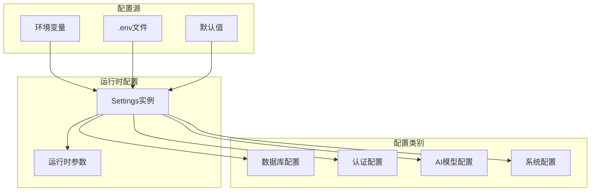

**图表来源**
- [backend/config.py:7-42](file://backend/config.py#L7-L42)

### 配置优先级

配置加载遵循以下优先级顺序：
1. 环境变量（最高优先级）
2. .env文件
3. 默认值（最低优先级）

**章节来源**
- [backend/config.py:1-43](file://backend/config.py#L1-L43)

## 数据库基础设施

### 连接池配置

数据库连接使用异步连接池，支持高并发访问：

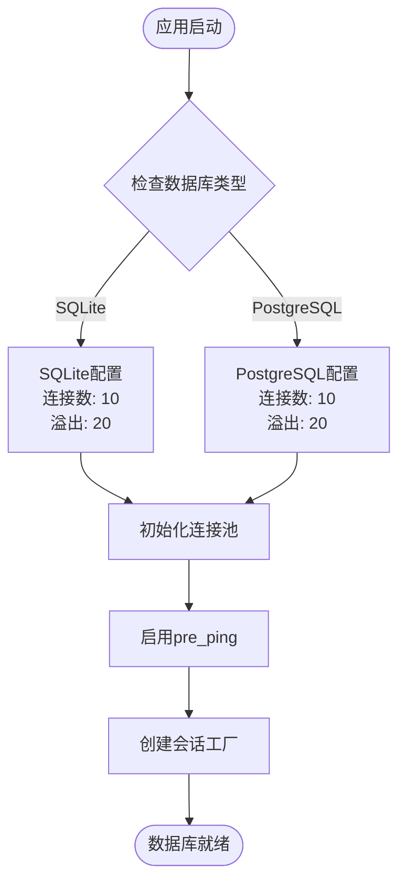

**图表来源**
- [backend/database.py:8-23](file://backend/database.py#L8-L23)

### 迁移管理

系统使用Alembic进行数据库迁移管理：

| 迁移类别 | 描述 | 版本号范围 |
|----------|------|------------|
| 初始版本 | 基础表结构 | 14746eaf1c81 |
| 用户系统 | 用户和管理员表 | 5f5b1c3da653 |
| 媒体功能 | 视频任务和代理字段 | 7459f2d26782 |
| 订阅系统 | 订阅和计费功能 | h4i5j6k7l8m9 |
| 多代理协作 | 多代理协作功能 | d8e9f0a1b2c3 |

**章节来源**
- [backend/database.py:1-31](file://backend/database.py#L1-L31)

## 构建与部署

### 开发服务器配置

前端通过Next.js开发服务器提供热重载功能：

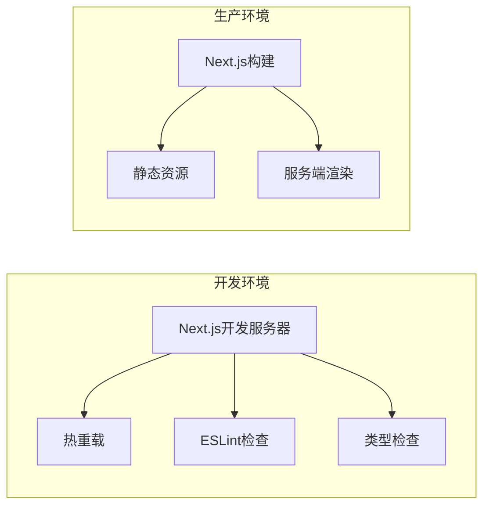

**更新** 类型检查已修复，开发服务器现在正确使用`.next/dev/types/routes.d.ts`路径

**图表来源**
- [frontend/next.config.ts:4-11](file://frontend/next.config.ts#L4-L11)

### API代理配置

前端通过rewrites规则将API请求代理到后端：

| 请求路径 | 目标地址 | 功能 |
|----------|----------|------|
| /api/* | http://127.0.0.1:8000/api/* | RESTful API |
| /ws/* | ws://127.0.0.1:8000/ws/* | WebSocket连接 |

**章节来源**
- [frontend/next.config.ts:1-15](file://frontend/next.config.ts#L1-L15)

## 测试框架

### 单元测试配置

系统使用Jest和Vitest进行单元测试：

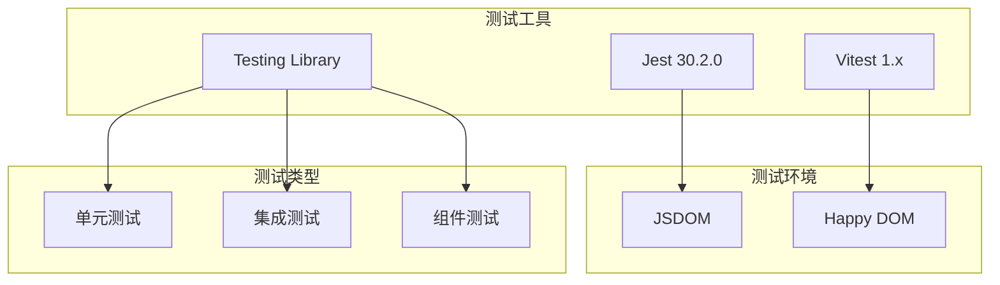

**图表来源**
- [backend/admin/vitest.config.ts:1-16](file://backend/admin/vitest.config.ts#L1-L16)

### 测试配置特点

- **环境隔离**: 使用独立的测试环境配置
- **快照测试**: 支持组件快照测试
- **异步测试**: 完善的Promise和async/await支持
- **覆盖率报告**: 自动生成测试覆盖率报告

**章节来源**
- [backend/admin/vitest.config.ts:1-16](file://backend/admin/vitest.config.ts#L1-L16)

## 开发工具链

### 代码质量工具

系统集成了完整的代码质量工具链：

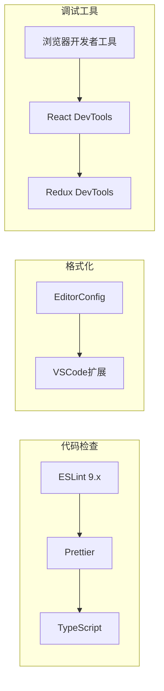

**图表来源**
- [frontend/eslint.config.mjs:1-19](file://frontend/eslint.config.mjs#L1-L19)

### 构建脚本

| 脚本命令 | 功能描述 | 用途 |
|----------|----------|------|
| dev | 启动开发服务器 | 本地开发 |
| build | 构建生产版本 | 生产部署 |
| start | 启动生产服务器 | 生产运行 |
| lint | 代码检查 | 代码质量 |
| test | 运行测试 | 单元测试 |
| test:watch | 监听测试 | 开发调试 |

**章节来源**
- [frontend/package.json:5-12](file://frontend/package.json#L5-L12)

## 性能优化

### 缓存策略

系统采用多层缓存策略提升性能：

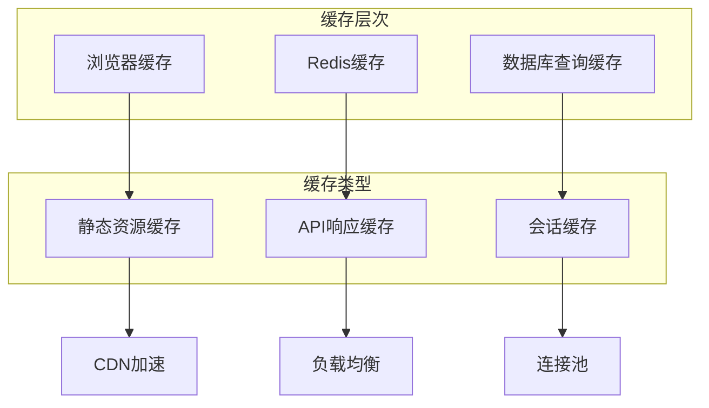

### WebSocket优化

实时通信使用WebSocket实现低延迟数据传输：

| 优化特性 | 实现方式 | 性能收益 |
|----------|----------|----------|
| 心跳检测 | 定期ping-pong | 连接稳定性 |
| 错误重连 | 自动重连机制 | 可靠性保障 |
| 消息队列 | 异步消息处理 | 响应速度提升 |
| 连接池 | 多连接管理 | 并发处理能力 |

## 故障排除指南

### 常见启动问题

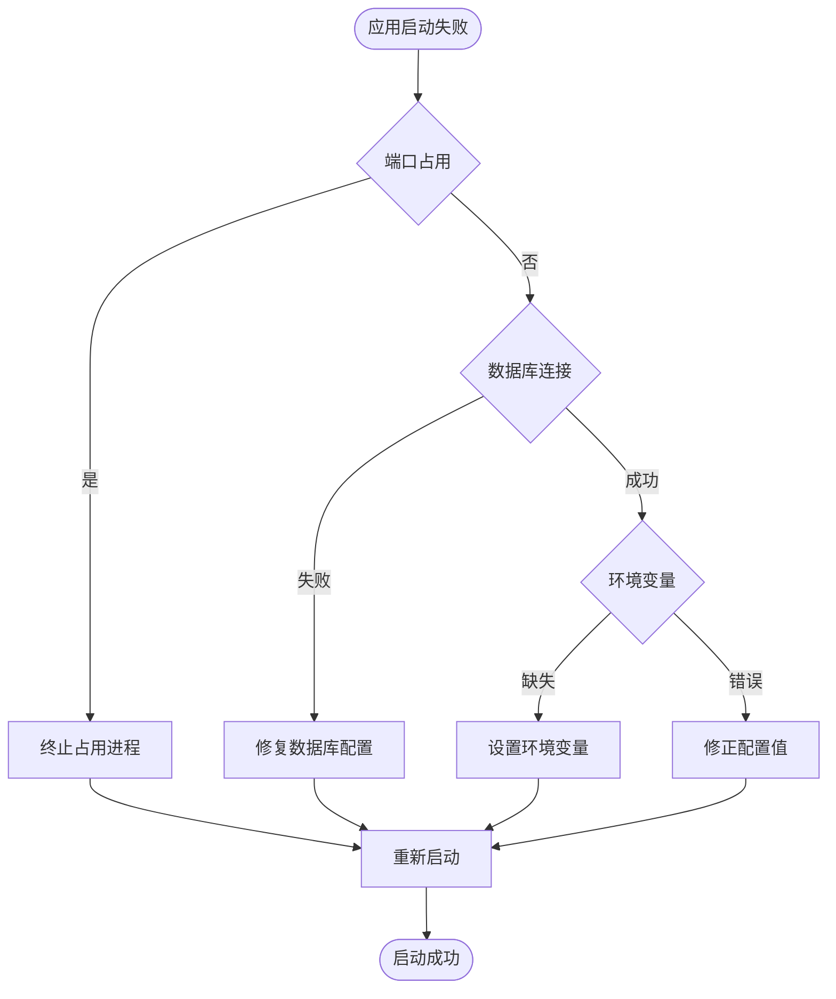

### 类型检查问题

**更新** 开发模式下类型检查已修复，解决以下问题：

- **问题**: 开发服务器错误使用`.next/types/routes.d.ts`路径
- **解决方案**: 正确使用`.next/dev/types/routes.d.ts`路径
- **影响**: 确保开发环境中的类型检查准确性

当遇到类型检查相关问题时：

1. **确认路径配置**: 检查`tsconfig.json`中的类型检查路径
2. **验证环境变量**: 确认`NODE_ENV`设置为`development`
3. **清理缓存**: 删除`.next`目录后重新启动开发服务器
4. **重新安装依赖**: 运行`npm ci`重新安装所有依赖

**章节来源**
- [frontend/tsconfig.json:25-35](file://frontend/tsconfig.json#L25-L35)
- [frontend/next-env.d.ts:1-7](file://frontend/next-env.d.ts#L1-L7)

## 总结

无限叙事剧院项目展现了现代全栈应用的完整开发基础设施。项目采用模块化的架构设计，前后端分离的开发模式，以及完善的工具链支持。

### 技术亮点

- **现代化技术栈**: 使用最新的Python和JavaScript生态
- **异步架构**: 全面采用异步编程模式提升性能
- **容器化友好**: 支持Docker部署和微服务架构
- **开发体验**: 完善的开发工具和测试框架
- **可扩展性**: 模块化设计便于功能扩展

### 最佳实践

- **配置管理**: 统一的环境变量和配置文件管理
- **代码质量**: 完整的ESLint和TypeScript配置
- **测试覆盖**: 全面的单元测试和集成测试
- **文档规范**: 清晰的项目结构和注释规范
- **安全考虑**: 完善的认证授权和数据保护

**更新** 本次更新特别加强了开发环境的类型检查配置，确保开发服务器能够正确识别和使用`.next/dev/types/routes.d.ts`路径，提升了开发体验和类型安全性。

该基础设施为项目的长期发展奠定了坚实基础，支持团队高效协作和持续迭代开发。