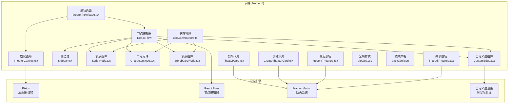
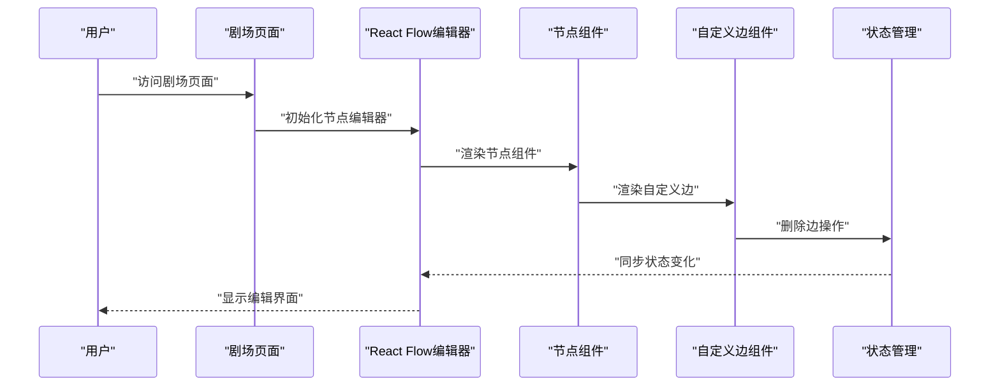
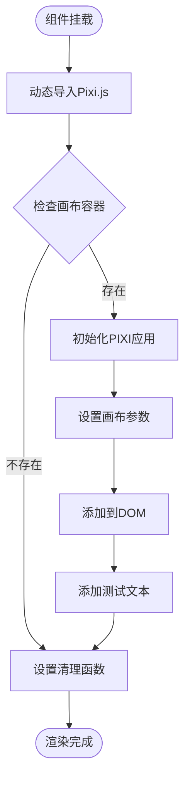
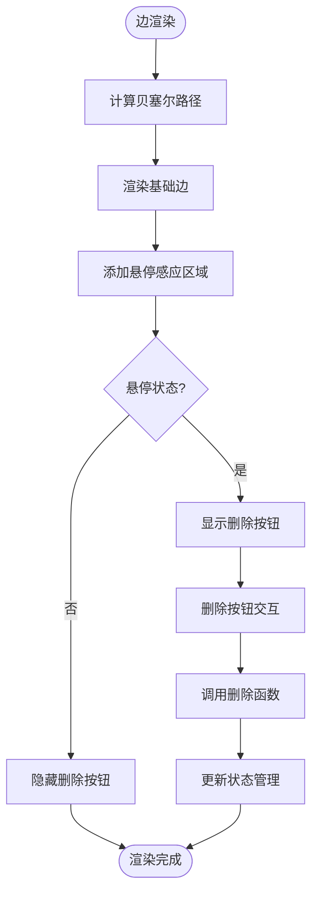
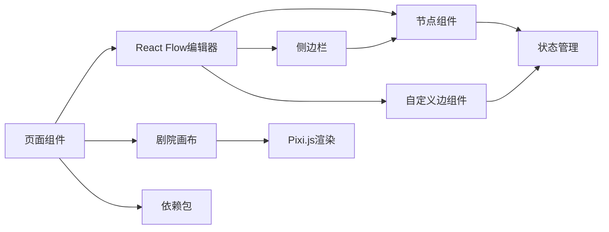

# 剧场画布渲染系统

<cite>
**本文引用的文件**
- [TheaterCanvas.tsx](file://frontend/src/components/TheaterCanvas.tsx)
- [page.tsx](file://frontend/src/app/theater/new/page.tsx)
- [useCanvasStore.ts](file://frontend/src/store/useCanvasStore.ts)
- [Sidebar.tsx](file://frontend/src/components/canvas/Sidebar.tsx)
- [ScriptNode.tsx](file://frontend/src/components/canvas/ScriptNode.tsx)
- [CharacterNode.tsx](file://frontend/src/components/canvas/CharacterNode.tsx)
- [StoryboardNode.tsx](file://frontend/src/components/canvas/StoryboardNode.tsx)
- [CustomEdge.tsx](file://frontend/src/components/canvas/CustomEdge.tsx)
- [page.tsx](file://frontend/src/app/page.tsx)
- [TheaterCard.tsx](file://frontend/src/components/home/TheaterCard.tsx)
- [CreateTheaterCard.tsx](file://frontend/src/components/home/CreateTheaterCard.tsx)
- [RecentTheaters.tsx](file://frontend/src/components/home/RecentTheaters.tsx)
- [SharedTheaters.tsx](file://frontend/src/components/home/SharedTheaters.tsx)
- [globals.css](file://frontend/src/app/globals.css)
- [package.json](file://frontend/package.json)
- [useSocket.ts](file://frontend/src/hooks/useSocket.ts)
- [Frontend-Guide.md](file://docs/wiki/Frontend-Guide.md)
- [Architecture.md](file://docs/wiki/Architecture.md)
- [README.md](file://README.md)
</cite>

## 更新摘要
**所做更改**
- 新增自定义边组件（CustomEdge）实现删除按钮和悬停交互
- 增强节点交互系统，所有节点都具备边缘拖拽热区
- 改进画布渲染系统的用户交互体验
- 更新节点组件的边缘处理逻辑和事件委托机制
- 新增边缘删除功能的状态管理和事件分发

## 目录
1. [引言](#引言)
2. [项目结构](#项目结构)
3. [核心组件](#核心组件)
4. [架构总览](#架构总览)
5. [详细组件分析](#详细组件分析)
6. [依赖关系分析](#依赖关系分析)
7. [性能考虑](#性能考虑)
8. [故障排除指南](#故障排除指南)
9. [结论](#结论)
10. [附录](#附录)

## 引言
本技术指南围绕重构后的剧场画布渲染系统展开，该系统已从传统的卡片式界面设计升级为现代化的混合渲染架构。新系统结合了基于Pixi.js的2D图形渲染能力和基于React Flow的节点编辑器，为用户提供了一个功能丰富的剧场创作平台。系统支持实时渲染、节点拖拽、历史记录管理和多类型节点编辑，采用React组件化架构，通过Zustand实现高效的状态管理。

**更新** 新增自定义边组件和增强的节点交互功能，提供更直观的连线管理和删除操作。

## 项目结构
前端采用Next.js 16 App Router架构，重构后的系统主要包含四个核心模块：2D图形渲染模块、节点编辑器模块、剧场卡片管理模块和状态管理系统。所有组件均采用客户端渲染，通过动态导入优化首屏加载性能。

**图表来源**
- [page.tsx:1-402](file://frontend/src/app/theater/new/page.tsx#L1-L402)
- [TheaterCanvas.tsx:1-50](file://frontend/src/components/TheaterCanvas.tsx#L1-L50)
- [Sidebar.tsx:1-52](file://frontend/src/components/canvas/Sidebar.tsx#L1-L52)
- [ScriptNode.tsx:1-337](file://frontend/src/components/canvas/ScriptNode.tsx#L1-L337)
- [CharacterNode.tsx:1-463](file://frontend/src/components/canvas/CharacterNode.tsx#L1-L463)
- [StoryboardNode.tsx:1-308](file://frontend/src/components/canvas/StoryboardNode.tsx#L1-L308)
- [CustomEdge.tsx:1-92](file://frontend/src/components/canvas/CustomEdge.tsx#L1-L92)
- [useCanvasStore.ts:1-271](file://frontend/src/store/useCanvasStore.ts#L1-L271)
- [TheaterCard.tsx:1-55](file://frontend/src/components/home/TheaterCard.tsx#L1-L55)
- [CreateTheaterCard.tsx:1-27](file://frontend/src/components/home/CreateTheaterCard.tsx#L1-L27)
- [RecentTheaters.tsx:1-50](file://frontend/src/components/home/RecentTheaters.tsx#L1-L50)
- [SharedTheaters.tsx:1-78](file://frontend/src/components/home/SharedTheaters.tsx#L1-L78)

**章节来源**
- [README.md:34-51](file://README.md#L34-L51)
- [Frontend-Guide.md:3-21](file://docs/wiki/Frontend-Guide.md#L3-L21)

## 核心组件
- **剧院画布渲染器**：基于Pixi.js的2D图形渲染系统，支持动态导入和生命周期管理。
- **React Flow节点编辑器**：提供拖拽式节点编辑功能，支持多种节点类型和连接关系。
- **节点组件系统**：包含剧本节点、角色节点和分镜节点，支持双击编辑和数据绑定。
- **自定义边组件**：提供删除按钮、悬停交互和贝塞尔曲线路径渲染。
- **边缘拖拽热区**：所有节点都具备精确的边缘拖拽区域和事件处理。
- **侧边栏节点库**：提供拖拽式节点创建功能，支持节点类型和默认数据配置。
- **剧场卡片系统**：提供剧院的卡片展示，支持悬停动画、渐变遮罩和播放按钮。
- **状态管理系统**：基于Zustand的高性能状态管理，支持历史记录和撤销重做。
- **键盘快捷键系统**：支持Ctrl+S保存、Ctrl+Z撤销、Ctrl+Y重做等快捷操作。

**更新** 新增自定义边组件和边缘拖拽热区系统，提供更直观的连线管理体验。

**章节来源**
- [TheaterCanvas.tsx:1-50](file://frontend/src/components/TheaterCanvas.tsx#L1-L50)
- [page.tsx:1-402](file://frontend/src/app/theater/new/page.tsx#L1-L402)
- [Sidebar.tsx:1-52](file://frontend/src/components/canvas/Sidebar.tsx#L1-L52)
- [ScriptNode.tsx:1-337](file://frontend/src/components/canvas/ScriptNode.tsx#L1-L337)
- [CharacterNode.tsx:1-463](file://frontend/src/components/canvas/CharacterNode.tsx#L1-L463)
- [StoryboardNode.tsx:1-308](file://frontend/src/components/canvas/StoryboardNode.tsx#L1-L308)
- [CustomEdge.tsx:1-92](file://frontend/src/components/canvas/CustomEdge.tsx#L1-L92)
- [TheaterCard.tsx:1-55](file://frontend/src/components/home/TheaterCard.tsx#L1-L55)

## 架构总览
系统采用分层架构设计，从顶层的页面组件到底层的渲染引擎，每个层次都有明确的职责分工。剧院画布通过Pixi.js实现2D图形渲染，节点编辑器通过React Flow实现拖拽交互，状态管理通过Zustand实现高效的数据同步。

**图表来源**
- [page.tsx:41-43](file://frontend/src/app/theater/new/page.tsx#L41-L43)
- [useCanvasStore.ts:153-166](file://frontend/src/store/useCanvasStore.ts#L153-L166)

## 详细组件分析

### 剧院画布渲染器（TheaterCanvas）
- **功能职责**
  - 动态导入Pixi.js库确保客户端渲染
  - 初始化PIXI.Application并设置画布参数
  - 管理画布生命周期和资源清理
  - 添加基础文本元素进行渲染验证
- **关键特性**
  - 异步导入避免服务端渲染问题
  - 自动销毁确保内存泄漏防护
  - 可配置的画布尺寸和背景色
  - 响应式布局适配不同屏幕尺寸

**图表来源**
- [TheaterCanvas.tsx:14-44](file://frontend/src/components/TheaterCanvas.tsx#L14-L44)

**章节来源**
- [TheaterCanvas.tsx:1-50](file://frontend/src/components/TheaterCanvas.tsx#L1-L50)

### React Flow节点编辑器
- **功能职责**
  - 提供拖拽式节点编辑界面
  - 支持节点连接和边缘管理
  - 实现视口控制和缩放功能
  - 集成撤销重做和快照功能
- **关键特性**
  - 多种节点类型支持（脚本、角色、分镜）
  - 自定义边类型支持删除按钮和悬停交互
  - 连接模式和边缘样式配置
  - 吸附网格和缩放限制
  - 快捷键支持和键盘导航

**更新** 新增自定义边类型，提供删除按钮和悬停交互功能。

**章节来源**
- [page.tsx:41-49](file://frontend/src/app/theater/new/page.tsx#L41-L49)
- [page.tsx:301-321](file://frontend/src/app/theater/new/page.tsx#L301-L321)

### 节点组件系统
#### 剧本节点（ScriptNode）
- **功能职责**
  - 编辑剧本的基本信息（标题、描述、标签）
  - 支持双击进入编辑模式
  - 实时数据更新和状态同步
- **关键特性**
  - 输入验证和格式化
  - 标签逗号分隔处理
  - 本地状态缓存减少存储压力
  - **新增** 边缘拖拽热区和精确的事件处理

#### 角色节点（CharacterNode）
- **功能职责**
  - 管理角色基本信息和描述
  - 支持头像显示和占位符
  - 双击编辑功能
- **关键特性**
  - Avatar组件集成
  - 名称首字母占位符
  - 描述文本域编辑
  - **新增** 边缘拖拽热区和精确的事件处理

#### 分镜节点（StoryboardNode）
- **功能职责**
  - 编辑分镜编号和持续时间
  - 添加视觉描述和镜头信息
  - 时间单位显示和编辑
- **关键特性**
  - SHOT编号格式化
  - 持续时间数字输入
  - 时钟图标和单位显示
  - **新增** 边缘拖拽热区和精确的事件处理

**更新** 所有节点都增加了边缘拖拽热区系统，提供更精确的连接操作。

**章节来源**
- [ScriptNode.tsx:1-337](file://frontend/src/components/canvas/ScriptNode.tsx#L1-L337)
- [CharacterNode.tsx:1-463](file://frontend/src/components/canvas/CharacterNode.tsx#L1-L463)
- [StoryboardNode.tsx:1-308](file://frontend/src/components/canvas/StoryboardNode.tsx#L1-L308)

### 自定义边组件（CustomEdge）
- **功能职责**
  - 渲染自定义贝塞尔曲线边
  - 提供删除按钮和悬停交互
  - 支持移动设备触摸事件
  - 管理边的选中状态和样式
- **关键特性**
  - 贝塞尔曲线路径计算和渲染
  - 删除按钮的悬停显示和隐藏
  - 触摸事件支持和延迟隐藏
  - 选中状态的颜色和粗细变化
  - 辅助的隐形宽轨道增加悬停感应面积

**图表来源**
- [CustomEdge.tsx:17-58](file://frontend/src/components/canvas/CustomEdge.tsx#L17-L58)
- [CustomEdge.tsx:29-32](file://frontend/src/components/canvas/CustomEdge.tsx#L29-L32)

**章节来源**
- [CustomEdge.tsx:1-92](file://frontend/src/components/canvas/CustomEdge.tsx#L1-L92)

### 边缘拖拽热区系统
- **功能职责**
  - 提供精确的边缘拖拽区域
  - 支持左右两侧的连接操作
  - 实现事件委托和精确坐标处理
  - 管理边缘手柄的可见性和交互
- **关键特性**
  - 包装器级别的事件处理
  - 内部元素的精确定位和透明度控制
  - 原生Handle元素的事件代理
  - 悬停状态下的视觉反馈

**更新** 新增边缘拖拽热区系统，提供更直观的节点连接体验。

**章节来源**
- [ScriptNode.tsx:221-309](file://frontend/src/components/canvas/ScriptNode.tsx#L221-L309)
- [StoryboardNode.tsx:178-195](file://frontend/src/components/canvas/StoryboardNode.tsx#L178-L195)

### 侧边栏节点库
- **功能职责**
  - 提供节点拖拽创建功能
  - 支持多种节点类型的快速创建
  - 默认数据预设和配置
- **关键特性**
  - 拖拽事件处理
  - 节点类型标识
  - 数据传输和序列化

**章节来源**
- [Sidebar.tsx:1-52](file://frontend/src/components/canvas/Sidebar.tsx#L1-L52)

### 剧场卡片系统
#### 剧场卡片（TheaterCard）
- **功能职责**
  - 展示剧场封面图片或渐变背景
  - 实现悬停动画效果，包括图片缩放和遮罩透明度变化
  - 显示剧场标题和播放按钮
  - 支持点击事件和路由导航
- **关键特性**
  - 使用Next.js Image组件实现响应式图片加载
  - Framer Motion实现平滑的悬停动画
  - 渐变遮罩提供更好的文字可读性
  - 玻璃模糊效果增强视觉层次

#### 创建剧场卡片（CreateTheaterCard）
- **功能职责**
  - 引导用户创建新剧场的视觉提示
  - 提供创建按钮的交互反馈
  - 支持路由导航到创建流程
- **关键特性**
  - 虚线边框和加号图标营造创建意图
  - 悬停时的缩放和颜色变化
  - 响应式设计适配不同屏幕尺寸

#### 最近剧场轮播（RecentTheaters）
- **功能职责**
  - 实现可拖拽的剧场卡片轮播
  - 支持响应式布局和触摸手势
  - 集成创建卡片和剧场卡片
- **关键特性**
  - Framer Motion实现流畅的拖拽动画
  - 自适应宽度计算和约束
  - 事件监听器的生命周期管理

#### 共享剧场系统（SharedTheaters）
- **功能职责**
  - 加载和展示社区剧场
  - 支持无限滚动和懒加载
  - 处理加载状态和错误情况
- **关键特性**
  - Intersection Observer实现懒加载
  - 加载指示器和状态管理
  - 占位符内容和空状态处理

**章节来源**
- [TheaterCard.tsx:1-55](file://frontend/src/components/home/TheaterCard.tsx#L1-L55)
- [CreateTheaterCard.tsx:1-27](file://frontend/src/components/home/CreateTheaterCard.tsx#L1-L27)
- [RecentTheaters.tsx:1-50](file://frontend/src/components/home/RecentTheaters.tsx#L1-L50)
- [SharedTheaters.tsx:1-78](file://frontend/src/components/home/SharedTheaters.tsx#L1-L78)

### 状态管理系统（useCanvasStore）
- **功能职责**
  - 定义节点编辑器的完整状态结构
  - 提供节点操作的Action类型
  - 实现历史记录和撤销重做功能
  - **新增** 边缘删除操作和事件分发
- **关键特性**
  - TypeScript类型安全的状态定义
  - 历史记录栈管理
  - 持久化存储和状态合并
  - 循环检测防止节点连接形成环路
  - **新增** 自定义事件分发支持外部监听

**更新** 新增边缘删除功能的状态管理和事件分发机制。

**章节来源**
- [useCanvasStore.ts:153-166](file://frontend/src/store/useCanvasStore.ts#L153-L166)
- [useCanvasStore.ts:200-271](file://frontend/src/store/useCanvasStore.ts#L200-L271)

## 依赖关系分析
- **前端依赖**
  - Next.js 16：App Router、动态导入、SSR
  - Pixi.js：2D图形渲染引擎
  - @xyflow/react：节点编辑器和拖拽交互
  - Framer Motion：动画系统和手势交互
  - Tailwind CSS：样式系统和响应式布局
  - Zustand：状态管理和持久化
  - Next.js Image：优化的图片加载
- **组件耦合**
  - 页面组件与渲染组件通过props传递数据
  - 节点组件与状态管理松耦合设计
  - 侧边栏与节点编辑器事件通信
  - 剧场卡片与路由系统集成
  - **新增** 自定义边组件与状态管理的直接交互

**图表来源**
- [page.tsx:1-402](file://frontend/src/app/theater/new/page.tsx#L1-L402)
- [TheaterCanvas.tsx:1-50](file://frontend/src/components/TheaterCanvas.tsx#L1-L50)
- [Sidebar.tsx:1-52](file://frontend/src/components/canvas/Sidebar.tsx#L1-L52)
- [CustomEdge.tsx:1-92](file://frontend/src/components/canvas/CustomEdge.tsx#L1-L92)
- [useCanvasStore.ts:1-271](file://frontend/src/store/useCanvasStore.ts#L1-L271)
- [package.json:1-35](file://frontend/package.json#L1-L35)

**章节来源**
- [package.json:1-35](file://frontend/package.json#L1-L35)
- [Frontend-Guide.md:1-21](file://docs/wiki/Frontend-Guide.md#L1-L21)

## 性能考虑
- **渲染性能**
  - 使用React.memo优化节点组件重渲染
  - Pixi.js动态导入避免不必要的服务器渲染
  - React Flow虚拟化渲染大量节点
  - 图片懒加载和响应式尺寸适配
  - **新增** 自定义边组件的优化渲染策略
- **状态管理性能**
  - 精细化的状态更新，避免不必要的重渲染
  - 历史记录限制防止内存溢出
  - 持久化存储分离避免状态膨胀
  - 循环检测优化连接性能
  - **新增** 边缘删除操作的即时状态更新
- **网络性能**
  - 模板数据的本地缓存
  - AI生成的节流和防抖处理
  - 图片资源的CDN优化
  - 动态导入按需加载第三方库

**更新** 新增自定义边组件和边缘拖拽热区的性能优化考虑。

## 故障排除指南
- **画布渲染问题**
  - 检查Pixi.js动态导入是否成功
  - 确认画布容器引用正确
  - 验证画布尺寸参数有效性
  - 检查浏览器兼容性和权限
- **节点编辑问题**
  - 检查节点类型定义和数据结构
  - 确认拖拽事件处理正确
  - 验证连接规则和循环检测
  - 检查状态更新和历史记录
  - **新增** 验证边缘拖拽热区的事件委托
- **自定义边组件问题**
  - 检查贝塞尔路径计算是否正确
  - 确认删除按钮的悬停状态切换
  - 验证触摸事件处理和延迟隐藏
  - 检查状态管理中的边缘删除操作
- **动画异常**
  - 检查Framer Motion版本兼容性
  - 确认DOM结构符合动画要求
  - 验证CSS动画冲突
  - 检查响应式断点配置
- **状态管理问题**
  - 检查Action类型定义
  - 确认reducer的纯函数性质
  - 验证初始状态配置
  - 检查持久化存储格式
  - **新增** 验证自定义事件分发机制

**更新** 新增自定义边组件和边缘拖拽热区的故障排除指南。

**章节来源**
- [TheaterCanvas.tsx:14-44](file://frontend/src/components/TheaterCanvas.tsx#L14-L44)
- [CustomEdge.tsx:29-32](file://frontend/src/components/canvas/CustomEdge.tsx#L29-L32)
- [useCanvasStore.ts:153-166](file://frontend/src/store/useCanvasStore.ts#L153-L166)

## 结论
重构后的剧场画布渲染系统已从传统的卡片式界面设计升级为功能丰富的混合渲染架构。新系统通过精心设计的组件架构、基于Pixi.js的2D图形渲染、React Flow的节点编辑器和强大的状态管理，为用户提供了一个直观、高效的剧场创作体验。

**更新** 新增的自定义边组件和边缘拖拽热区系统显著提升了用户的交互体验，提供了更直观的连线管理和删除操作。系统不仅保持了优秀的性能表现，还通过类型安全的设计和完善的错误处理机制，为未来的功能扩展奠定了坚实的基础。

## 附录
- **移动端适配**
  - 响应式网格布局自动调整列数
  - 触摸手势支持拖拽轮播
  - 移动端优化的点击区域大小
  - 触摸友好的节点交互
  - **新增** 移动端自定义边删除按钮的触摸支持
- **无障碍访问**
  - 语义化HTML结构
  - 键盘导航支持
  - 屏幕阅读器友好的标签
  - 高对比度模式支持
- **开发工具**
  - TypeScript类型检查
  - ESLint代码规范
  - Prettier代码格式化
  - React DevTools调试支持
- **性能监控**
  - FPS计数器和性能指标
  - 内存使用情况监控
  - 渲染帧率优化
  - 状态更新频率统计
  - **新增** 自定义边组件的渲染性能监控

**更新** 新增移动端自定义边删除按钮支持和性能监控功能。

**章节来源**
- [globals.css:15-26](file://frontend/src/app/globals.css#L15-L26)
- [Frontend-Guide.md:54-69](file://docs/wiki/Frontend-Guide.md#L54-L69)
- [Architecture.md:46-62](file://docs/wiki/Architecture.md#L46-L62)