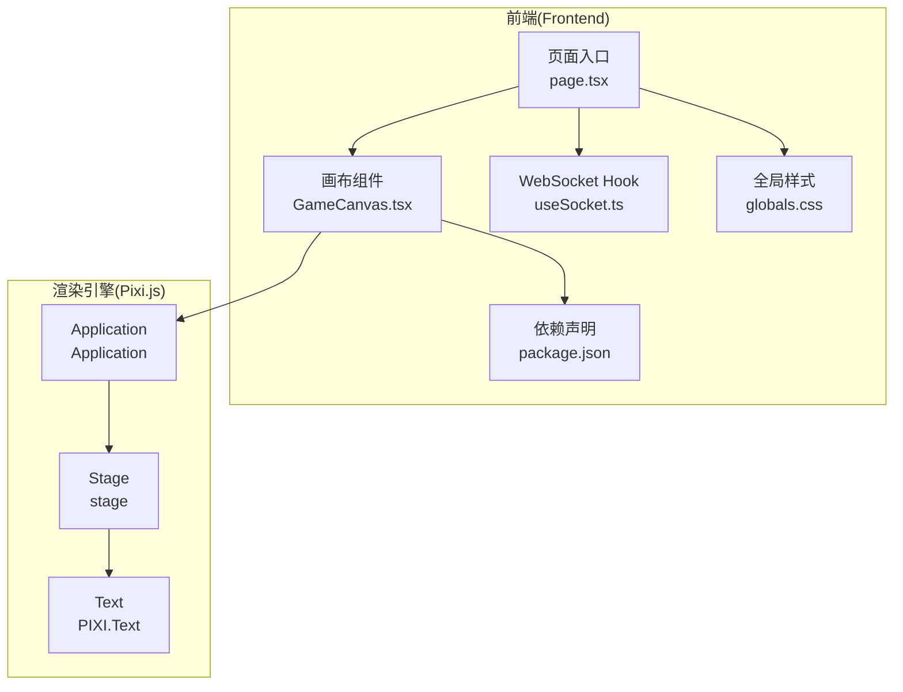
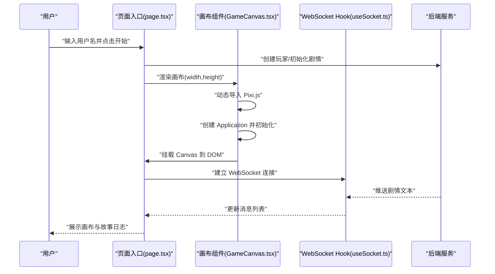
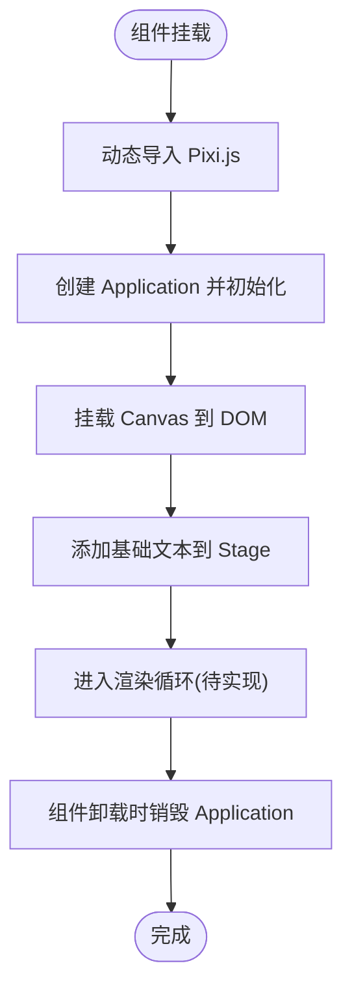
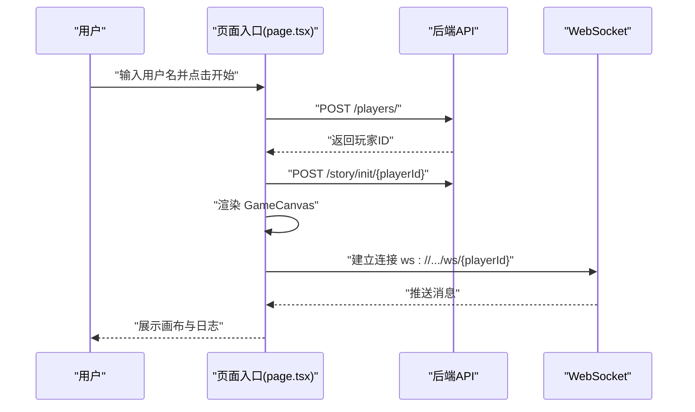
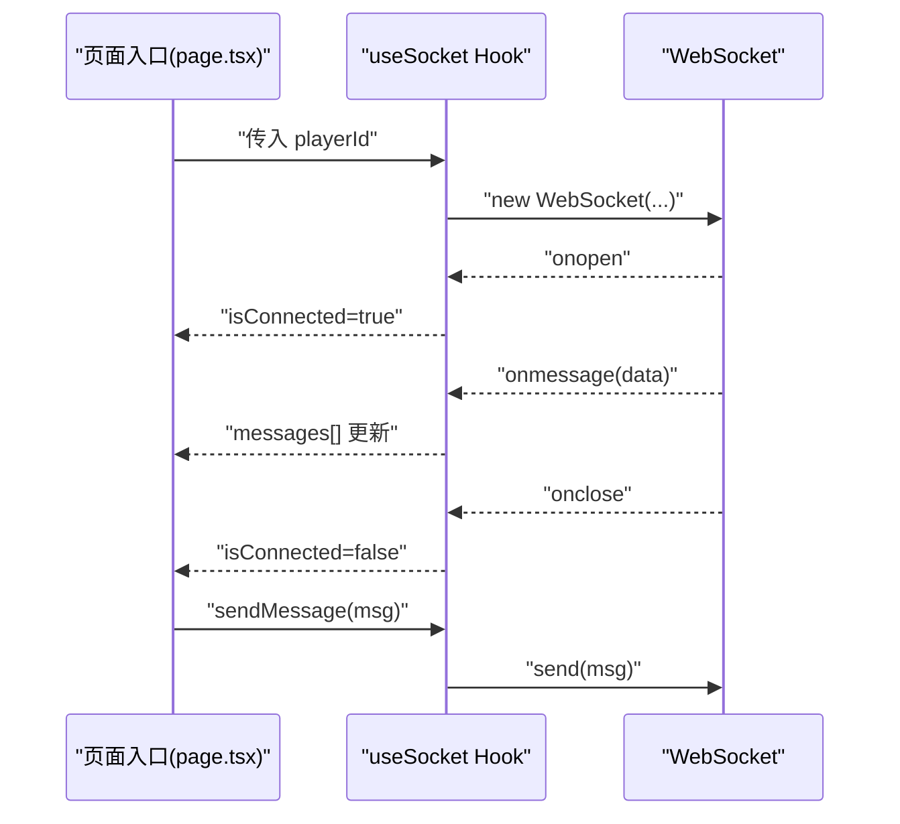
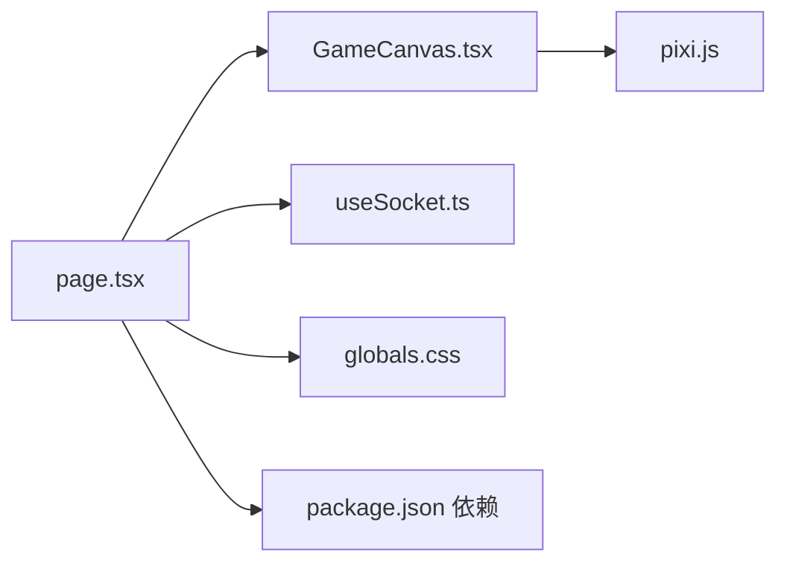

# 游戏画布渲染系统

<cite>
**本文引用的文件**
- [GameCanvas.tsx](file://frontend/src/components/GameCanvas.tsx)
- [page.tsx](file://frontend/src/app/page.tsx)
- [useSocket.ts](file://frontend/src/hooks/useSocket.ts)
- [globals.css](file://frontend/src/app/globals.css)
- [package.json](file://frontend/package.json)
- [Frontend-Guide.md](file://docs/wiki/Frontend-Guide.md)
- [Architecture.md](file://docs/wiki/Architecture.md)
- [README.md](file://README.md)
</cite>

## 目录
1. [引言](#引言)
2. [项目结构](#项目结构)
3. [核心组件](#核心组件)
4. [架构总览](#架构总览)
5. [详细组件分析](#详细组件分析)
6. [依赖关系分析](#依赖关系分析)
7. [性能考虑](#性能考虑)
8. [故障排除指南](#故障排除指南)
9. [结论](#结论)
10. [附录](#附录)

## 引言
本技术指南围绕基于 Pixi.js 的 2D 游戏画布渲染系统展开，聚焦于画布初始化、视口设置、渲染循环、纹理与资源管理、内存优化、动画与帧率控制、性能监控、碰撞检测与物理模拟、用户交互、粒子效果、背景滚动与特效实现，以及移动端适配与响应式布局。当前仓库中的前端实现了基础的 Pixi Application 初始化与挂载，后续可在该基础上扩展完整的渲染管线。

## 项目结构
前端采用 Next.js 16 App Router 架构，核心渲染组件位于 components 目录中，页面入口负责初始化与布局，样式通过 Tailwind CSS 与全局样式文件统一管理。WebSocket Hook 负责与后端实时通信，支撑剧情驱动的动态内容。

**图表来源**
- [page.tsx](file://frontend/src/app/page.tsx#L1-L85)
- [GameCanvas.tsx](file://frontend/src/components/GameCanvas.tsx#L1-L50)
- [useSocket.ts](file://frontend/src/hooks/useSocket.ts#L1-L42)
- [globals.css](file://frontend/src/app/globals.css#L1-L27)
- [package.json](file://frontend/package.json#L1-L35)

**章节来源**
- [README.md](file://README.md#L34-L51)
- [Frontend-Guide.md](file://docs/wiki/Frontend-Guide.md#L3-L21)

## 核心组件
- 画布组件：负责 Pixi Application 的动态初始化、画布挂载、基础文本渲染与销毁清理。
- 页面入口：负责玩家创建、剧情初始化触发、布局组织与 WebSocket 状态展示。
- WebSocket Hook：负责与后端建立长连接、消息收发与连接状态维护。
- 样式系统：通过 Tailwind CSS 与全局样式实现主题与响应式布局。

**章节来源**
- [GameCanvas.tsx](file://frontend/src/components/GameCanvas.tsx#L1-L50)
- [page.tsx](file://frontend/src/app/page.tsx#L1-L85)
- [useSocket.ts](file://frontend/src/hooks/useSocket.ts#L1-L42)
- [globals.css](file://frontend/src/app/globals.css#L1-L27)
- [Frontend-Guide.md](file://docs/wiki/Frontend-Guide.md#L23-L44)

## 架构总览
渲染系统以 React 组件为入口，通过动态导入方式在客户端侧初始化 Pixi Application，并将其 Canvas 挂载到 DOM。页面入口负责与后端的实时通信，将剧情文本等动态内容注入到 UI 区域。整体架构强调 SSR 兼容与客户端渲染分离。

**图表来源**
- [page.tsx](file://frontend/src/app/page.tsx#L14-L35)
- [GameCanvas.tsx](file://frontend/src/components/GameCanvas.tsx#L14-L35)
- [useSocket.ts](file://frontend/src/hooks/useSocket.ts#L8-L33)

## 详细组件分析

### 画布组件（GameCanvas）
- 功能职责
  - 动态导入 Pixi.js，确保仅在客户端执行。
  - 初始化 Pixi Application，设置画布尺寸与背景色。
  - 将 Pixi Canvas 挂载到容器元素。
  - 在舞台添加基础文本以验证渲染。
  - 组件卸载时销毁 Application 及相关资源，避免内存泄漏。
- 关键流程
  - 初始化：动态导入 -> 创建 Application -> 初始化配置 -> 挂载 Canvas -> 添加基础元素。
  - 销毁：清理 Application，释放子节点与纹理资源。
- 扩展建议
  - 引入渲染循环钩子（如 ticker）以支持动画。
  - 增加纹理加载与资源池管理。
  - 实现视口与相机系统，支持场景缩放与平移。
  - 加入精灵(Sprite)容器与层级管理。
  - 集成事件系统处理用户交互。

**图表来源**
- [GameCanvas.tsx](file://frontend/src/components/GameCanvas.tsx#L14-L44)

**章节来源**
- [GameCanvas.tsx](file://frontend/src/components/GameCanvas.tsx#L1-L50)

### 页面入口（Home）
- 功能职责
  - 玩家创建与剧情初始化。
  - 布局组织：左侧画布区域，右侧故事日志区域。
  - WebSocket 状态展示与消息列表渲染。
- 关键流程
  - 用户输入 -> 发起玩家创建请求 -> 成功后触发剧情初始化 -> 渲染 GameCanvas -> 建立 WebSocket 连接 -> 接收并展示消息。

**图表来源**
- [page.tsx](file://frontend/src/app/page.tsx#L14-L35)

**章节来源**
- [page.tsx](file://frontend/src/app/page.tsx#L1-L85)

### WebSocket Hook（useSocket）
- 功能职责
  - 建立与后端的 WebSocket 连接。
  - 维护连接状态与消息数组。
  - 提供发送消息的能力。
- 关键流程
  - 建立连接 -> 监听 open/message/close -> 更新状态 -> 组件卸载时关闭连接。

**图表来源**
- [useSocket.ts](file://frontend/src/hooks/useSocket.ts#L8-L33)

**章节来源**
- [useSocket.ts](file://frontend/src/hooks/useSocket.ts#L1-L42)

### 样式与主题（globals.css）
- 功能职责
  - 通过 Tailwind CSS 与主题变量实现深浅色模式切换。
  - 统一字体与背景色，保证画布与 UI 的协调。
- 响应式布局
  - 页面采用 Flex 布局，右侧故事日志区域具备滚动能力，适配不同屏幕尺寸。

**章节来源**
- [globals.css](file://frontend/src/app/globals.css#L1-L27)
- [page.tsx](file://frontend/src/app/page.tsx#L38-L81)

## 依赖关系分析
- 前端依赖
  - Next.js 16：App Router、动态导入、SSR。
  - Pixi.js：2D 渲染引擎。
  - Tailwind CSS：样式与响应式布局。
  - Socket.IO 客户端：WebSocket 通信。
- 组件耦合
  - 页面入口与画布组件通过动态导入解耦，确保 SSR 兼容。
  - 画布组件与 WebSocket Hook 通过页面入口组合，形成渲染与数据驱动闭环。

**图表来源**
- [page.tsx](file://frontend/src/app/page.tsx#L3-L7)
- [GameCanvas.tsx](file://frontend/src/components/GameCanvas.tsx#L17)
- [useSocket.ts](file://frontend/src/hooks/useSocket.ts#L11)
- [package.json](file://frontend/package.json#L11-L22)

**章节来源**
- [package.json](file://frontend/package.json#L1-L35)
- [Frontend-Guide.md](file://docs/wiki/Frontend-Guide.md#L1-L21)

## 性能考虑
- 渲染循环与帧率控制
  - 建议引入 Pixi 的 ticker，在渲染循环中按需更新精灵与场景，避免不必要的重绘。
  - 通过帧率限制与时间步长控制，保证动画流畅度与跨设备稳定性。
- 纹理与资源管理
  - 使用资源加载器集中管理纹理与图集，启用缓存与去重策略，减少重复加载。
  - 在组件销毁时及时释放纹理与容器，防止内存泄漏。
- 内存优化
  - 合理使用对象池与批量创建，降低垃圾回收压力。
  - 控制同时存在的精灵数量与层级深度，避免过度渲染。
- 性能监控
  - 结合浏览器性能面板与帧率计数，定位渲染瓶颈。
  - 在开发阶段记录关键操作耗时，逐步优化热点路径。

## 故障排除指南
- 画布不显示
  - 检查动态导入是否成功，确认组件在客户端渲染。
  - 确认 Application 初始化参数与容器元素存在。
- 渲染异常或白屏
  - 核对背景色与文本颜色对比度，确保可见性。
  - 检查舞台层级与容器挂载顺序。
- WebSocket 连接问题
  - 确认后端服务已启动，端口与路径正确。
  - 查看控制台错误与网络面板，确认握手与消息推送链路。
- 内存泄漏
  - 组件卸载时确保销毁 Application 与释放纹理。
  - 避免在回调中持有对已销毁对象的引用。

**章节来源**
- [GameCanvas.tsx](file://frontend/src/components/GameCanvas.tsx#L39-L44)
- [useSocket.ts](file://frontend/src/hooks/useSocket.ts#L13-L26)

## 结论
当前前端已实现基于 Pixi.js 的基础画布初始化与挂载，页面入口与 WebSocket Hook 形成了数据驱动的渲染闭环。后续可在现有基础上扩展渲染循环、资源管理、动画系统、碰撞检测与物理模拟、粒子与特效、背景滚动、移动端适配与响应式布局，以构建完整的 2D 游戏渲染体系。

## 附录
- 移动端适配与响应式布局
  - 使用 CSS 媒体查询与相对单位，确保在小屏设备上画布与日志区域合理分配。
  - 在画布组件中支持窗口尺寸变化，动态调整画布尺寸与视口。
- 分辨率缩放
  - 通过 Pixi 的 resolution 与 screen 的 devicePixelRatio 协同，提升高 DPI 设备清晰度。
- 开发与调试
  - 结合 Next.js 开发服务器与浏览器开发者工具，持续验证渲染与交互表现。

**章节来源**
- [globals.css](file://frontend/src/app/globals.css#L15-L26)
- [Frontend-Guide.md](file://docs/wiki/Frontend-Guide.md#L54-L69)
- [Architecture.md](file://docs/wiki/Architecture.md#L46-L62)