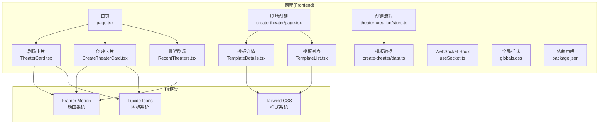
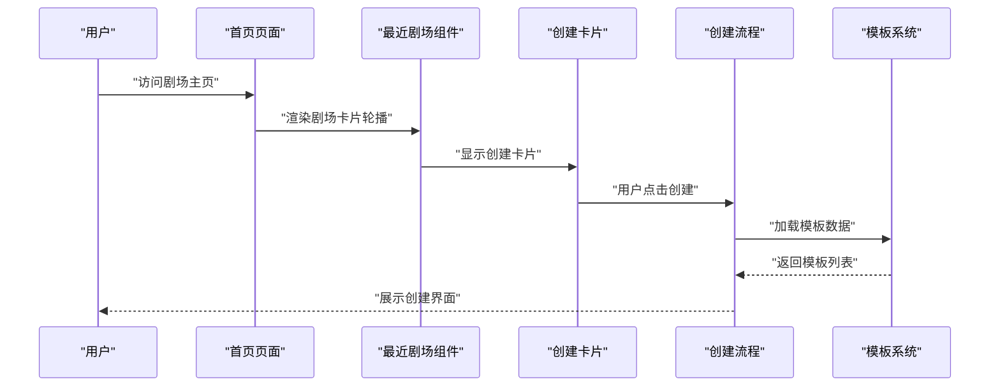
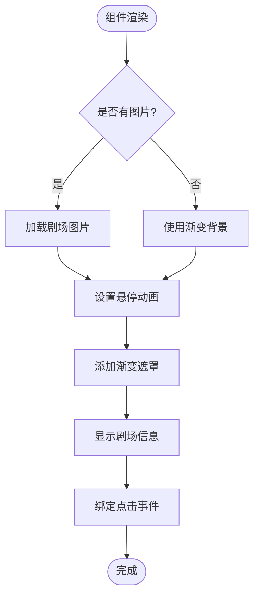
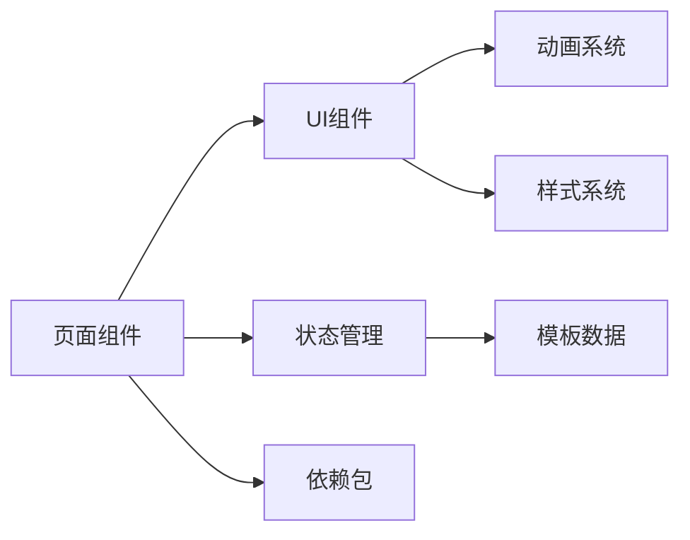

# 剧场画布渲染系统

<cite>
**本文引用的文件**
- [TheaterCanvas.tsx](file://frontend/src/components/TheaterCanvas.tsx)
- [page.tsx](file://frontend/src/app/page.tsx)
- [useSocket.ts](file://frontend/src/hooks/useSocket.ts)
- [globals.css](file://frontend/src/app/globals.css)
- [package.json](file://frontend/package.json)
- [CreateTheaterCard.tsx](file://frontend/src/components/home/CreateTheaterCard.tsx)
- [TheaterCard.tsx](file://frontend/src/components/home/TheaterCard.tsx)
- [RecentTheaters.tsx](file://frontend/src/components/home/RecentTheaters.tsx)
- [store.ts](file://frontend/src/components/theater-creation/store.ts)
- [data.ts](file://frontend/src/components/create-theater/data.ts)
- [Step1BasicInfo.tsx](file://frontend/src/components/theater-creation/Step1BasicInfo.tsx)
- [Step2Character.tsx](file://frontend/src/components/theater-creation/Step2Character.tsx)
- [page.tsx](file://frontend/src/app/create-theater/page.tsx)
- [TemplateCard.tsx](file://frontend/src/components/create-theater/TemplateCard.tsx)
- [TemplateDetails.tsx](file://frontend/src/components/create-theater/TemplateDetails.tsx)
- [TemplateList.tsx](file://frontend/src/components/create-theater/TemplateList.tsx)
- [Frontend-Guide.md](file://docs/wiki/Frontend-Guide.md)
- [Architecture.md](file://docs/wiki/Architecture.md)
- [README.md](file://README.md)
</cite>

## 更新摘要
**所做更改**
- 移除了基于 Pixi.js 的 2D 渲染系统文档内容
- 新增了卡片式界面设计系统
- 新增了剧场创建系统，包括模板系统、多角色管理、创建流程
- 更新了架构图以反映新的组件结构
- 移除了渲染循环、纹理管理、动画系统等相关内容

## 目录
1. [引言](#引言)
2. [项目结构](#项目结构)
3. [核心组件](#核心组件)
4. [架构总览](#架构总览)
5. [详细组件分析](#详细组件分析)
6. [依赖关系分析](#依赖关系分析)
7. [性能考虑](#性能考虑)
8. [故障排除指南](#故障排除指南)
9. [结论](#结论)
10. [附录](#附录)

## 引言
本技术指南围绕重构后的剧场画布系统展开，该系统已从传统的 Pixi.js 2D 渲染重构为现代化的卡片式界面设计。新系统专注于剧场创建体验，提供直观的模板选择、多角色管理系统和渐进式创建流程。系统采用 React 组件化架构，结合 Framer Motion 实现流畅的动画过渡，通过 Zustand 状态管理实现复杂的剧场创建状态控制。

## 项目结构
前端采用 Next.js 16 App Router 架构，重构后的系统主要包含三个核心模块：卡片式剧场界面、剧场创建系统和模板管理系统。所有组件均采用客户端渲染，通过动态导入优化首屏加载性能。

**图表来源**
- [page.tsx](file://frontend/src/app/page.tsx#L1-L85)
- [TheaterCard.tsx](file://frontend/src/components/home/TheaterCard.tsx#L1-L55)
- [CreateTheaterCard.tsx](file://frontend/src/components/home/CreateTheaterCard.tsx#L1-L27)
- [RecentTheaters.tsx](file://frontend/src/components/home/RecentTheaters.tsx#L1-L70)
- [page.tsx](file://frontend/src/app/create-theater/page.tsx#L1-L61)
- [TemplateDetails.tsx](file://frontend/src/components/create-theater/TemplateDetails.tsx#L1-L143)
- [TemplateList.tsx](file://frontend/src/components/create-theater/TemplateList.tsx#L1-L92)
- [store.ts](file://frontend/src/components/theater-creation/store.ts#L1-L83)
- [data.ts](file://frontend/src/components/create-theater/data.ts#L1-L94)
- [useSocket.ts](file://frontend/src/hooks/useSocket.ts#L1-L42)
- [globals.css](file://frontend/src/app/globals.css#L1-L27)
- [package.json](file://frontend/package.json#L1-L35)

**章节来源**
- [README.md](file://README.md#L34-L51)
- [Frontend-Guide.md](file://docs/wiki/Frontend-Guide.md#L3-L21)

## 核心组件
- **剧场卡片系统**：提供美观的剧场卡片展示，支持悬停动画、渐变遮罩和播放按钮。
- **创建卡片**：引导用户创建新剧场的交互式卡片，支持点击跳转到创建流程。
- **最近剧场轮播**：可拖拽的剧场卡片轮播组件，支持响应式布局和触摸手势。
- **模板管理系统**：完整的模板选择系统，支持分类筛选、搜索和详细预览。
- **剧场创建流程**：基于 Redux 架构的状态管理，支持多步骤创建流程。
- **多角色管理**：复杂的角色创建系统，支持 AI 生成、头像生成和验证机制。

**章节来源**
- [TheaterCard.tsx](file://frontend/src/components/home/TheaterCard.tsx#L1-L55)
- [CreateTheaterCard.tsx](file://frontend/src/components/home/CreateTheaterCard.tsx#L1-L27)
- [RecentTheaters.tsx](file://frontend/src/components/home/RecentTheaters.tsx#L1-L70)
- [TemplateDetails.tsx](file://frontend/src/components/create-theater/TemplateDetails.tsx#L1-L143)
- [TemplateList.tsx](file://frontend/src/components/create-theater/TemplateList.tsx#L1-L92)
- [store.ts](file://frontend/src/components/theater-creation/store.ts#L1-L83)
- [Step2Character.tsx](file://frontend/src/components/theater-creation/Step2Character.tsx#L1-L520)

## 架构总览
系统采用分层架构设计，从顶层的页面组件到底层的业务逻辑组件，每个层次都有明确的职责分工。卡片式界面通过 Framer Motion 实现流畅的动画过渡，状态管理通过自定义 reducer 实现复杂的剧场创建逻辑。

**图表来源**
- [page.tsx](file://frontend/src/app/page.tsx#L14-L35)
- [RecentTheaters.tsx](file://frontend/src/components/home/RecentTheaters.tsx#L52-L53)
- [page.tsx](file://frontend/src/app/create-theater/page.tsx#L17-L23)

## 详细组件分析

### 剧场卡片系统（TheaterCard）
- **功能职责**
  - 展示剧场封面图片或渐变背景
  - 实现悬停动画效果，包括图片缩放和遮罩透明度变化
  - 显示剧场标题和播放按钮
  - 支持点击事件和路由导航
- **关键特性**
  - 使用 Next.js Image 组件实现响应式图片加载
  - Framer Motion 实现平滑的悬停动画
  - 渐变遮罩提供更好的文字可读性
  - 玻璃模糊效果增强视觉层次

**图表来源**
- [TheaterCard.tsx](file://frontend/src/components/home/TheaterCard.tsx#L14-L51)

**章节来源**
- [TheaterCard.tsx](file://frontend/src/components/home/TheaterCard.tsx#L1-L55)

### 创建卡片系统（CreateTheaterCard）
- **功能职责**
  - 引导用户创建新剧场的视觉提示
  - 提供创建按钮的交互反馈
  - 支持路由导航到创建流程
- **关键特性**
  - 虚线边框和加号图标营造创建意图
  - 悬停时的缩放和颜色变化
  - 响应式设计适配不同屏幕尺寸

**章节来源**
- [CreateTheaterCard.tsx](file://frontend/src/components/home/CreateTheaterCard.tsx#L1-L27)

### 最近剧场轮播（RecentTheaters）
- **功能职责**
  - 实现可拖拽的剧场卡片轮播
  - 支持响应式布局和触摸手势
  - 集成创建卡片和剧场卡片
- **关键特性**
  - Framer Motion 实现流畅的拖拽动画
  - 自适应宽度计算和约束
  - 事件监听器的生命周期管理

**章节来源**
- [RecentTheaters.tsx](file://frontend/src/components/home/RecentTheaters.tsx#L1-L70)

### 模板管理系统
#### 模板详情组件（TemplateDetails）
- **功能职责**
  - 展示模板的详细信息和特色元素
  - 提供模板选择确认和取消功能
  - 支持背景图片或渐变背景的动态切换
- **关键特性**
  - 动画化的背景切换效果
  - 特色元素和适用场景的网格展示
  - 响应式布局适配不同屏幕尺寸

#### 模板列表组件（TemplateList）
- **功能职责**
  - 提供模板的网格列表展示
  - 支持分类筛选和搜索功能
  - 实现模板卡片的动态布局
- **关键特性**
  - Tab 切换实现分类筛选
  - 搜索功能支持名称和描述匹配
  - 响应式网格布局自动调整列数

**章节来源**
- [TemplateDetails.tsx](file://frontend/src/components/create-theater/TemplateDetails.tsx#L1-L143)
- [TemplateList.tsx](file://frontend/src/components/create-theater/TemplateList.tsx#L1-L92)

### 剧场创建系统
#### 状态管理（store.ts）
- **功能职责**
  - 定义剧场创建的完整状态结构
  - 提供状态更新的 Action 类型
  - 实现创建流程的状态转换逻辑
- **关键特性**
  - TypeScript 类型安全的状态定义
  - 多步骤创建流程的状态管理
  - 角色管理的复杂状态结构

#### 创建流程组件
##### 基础信息步骤（Step1BasicInfo）
- **功能职责**
  - 收集剧场的基础信息
  - 集成 AI 助手生成设定
  - 支持手动编辑和 AI 自动生成
- **关键特性**
  - AI 生成按钮的加载状态管理
  - 表单验证和错误提示
  - 流畅的页面过渡动画

##### 角色创建步骤（Step2Character）
- **功能职责**
  - 管理剧场中的多个角色
  - 支持角色的添加、删除和编辑
  - 集成 AI 角色生成和头像生成
- **关键特性**
  - 动态角色列表的动画管理
  - 角色表单的复杂验证逻辑
  - AI 生成的异步状态处理
  - 角色卡片的展开/折叠功能

**章节来源**
- [store.ts](file://frontend/src/components/theater-creation/store.ts#L1-L83)
- [Step1BasicInfo.tsx](file://frontend/src/components/theater-creation/Step1BasicInfo.tsx#L1-L123)
- [Step2Character.tsx](file://frontend/src/components/theater-creation/Step2Character.tsx#L1-L520)

## 依赖关系分析
- **前端依赖**
  - Next.js 16：App Router、动态导入、SSR
  - Framer Motion：动画系统和手势交互
  - Tailwind CSS：样式系统和响应式布局
  - Lucide Icons：图标库
  - Next.js Image：优化的图片加载
- **组件耦合**
  - 页面组件与业务组件通过 props 传递数据
  - 状态管理组件独立于 UI 组件
  - 模板系统与创建流程松耦合设计

**图表来源**
- [page.tsx](file://frontend/src/app/page.tsx#L3-L7)
- [store.ts](file://frontend/src/components/theater-creation/store.ts#L2-L3)
- [data.ts](file://frontend/src/components/create-theater/data.ts#L2-L3)
- [package.json](file://frontend/package.json#L11-L22)

**章节来源**
- [package.json](file://frontend/package.json#L1-L35)
- [Frontend-Guide.md](file://docs/wiki/Frontend-Guide.md#L1-L21)

## 性能考虑
- **渲染性能**
  - 使用 React.memo 和 useMemo 优化组件重渲染
  - 图片懒加载和响应式尺寸适配
  - 动画性能优化，避免布局抖动
- **状态管理性能**
  - 精细化的状态更新，避免不必要的重渲染
  - 使用 Immer 或类似库简化不可变更新
  - 大量角色列表的虚拟化渲染
- **网络性能**
  - 模板数据的本地缓存
  - AI 生成的节流和防抖处理
  - 图片资源的 CDN 优化

## 故障排除指南
- **卡片渲染问题**
  - 检查图片资源路径和格式
  - 确认 Tailwind CSS 类名拼写
  - 验证响应式断点配置
- **动画异常**
  - 检查 Framer Motion 版本兼容性
  - 确认 DOM 结构符合动画要求
  - 验证 CSS 动画冲突
- **状态管理问题**
  - 检查 Action 类型定义
  - 确认 reducer 的纯函数性质
  - 验证初始状态配置
- **模板加载问题**
  - 确认模板数据结构完整性
  - 检查分类枚举值匹配
  - 验证图标映射配置

**章节来源**
- [TheaterCard.tsx](file://frontend/src/components/home/TheaterCard.tsx#L34-L37)
- [store.ts](file://frontend/src/components/theater-creation/store.ts#L65-L82)

## 结论
重构后的剧场画布系统已完全从传统的 Pixi.js 2D 渲染转向现代化的卡片式界面设计。新系统通过精心设计的组件架构、流畅的动画交互和强大的状态管理，为用户提供了一个直观、高效的创建体验。系统不仅保持了良好的性能表现，还为未来的功能扩展奠定了坚实的基础。

## 附录
- **移动端适配**
  - 响应式网格布局自动调整列数
  - 触摸手势支持拖拽轮播
  - 移动端优化的点击区域大小
- **无障碍访问**
  - 语义化 HTML 结构
  - 键盘导航支持
  - 屏幕阅读器友好的标签
- **开发工具**
  - TypeScript 类型检查
  - ESLint 代码规范
  - Prettier 代码格式化

**章节来源**
- [globals.css](file://frontend/src/app/globals.css#L15-L26)
- [Frontend-Guide.md](file://docs/wiki/Frontend-Guide.md#L54-L69)
- [Architecture.md](file://docs/wiki/Architecture.md#L46-L62)