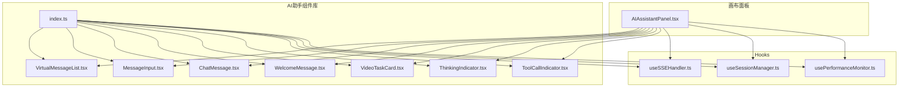
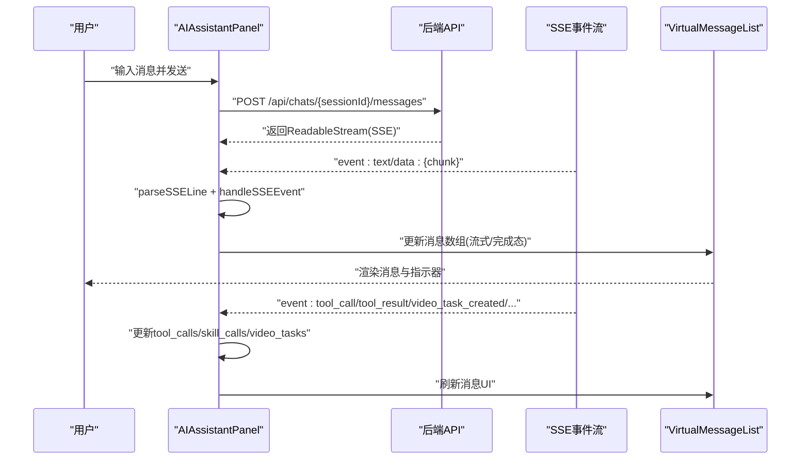
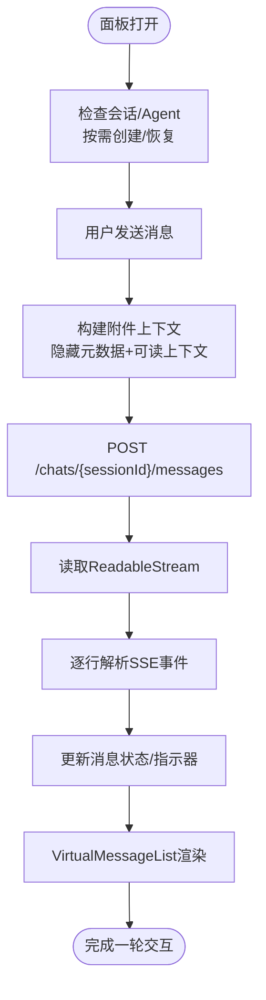
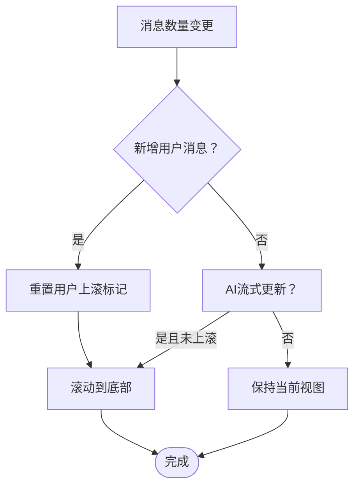
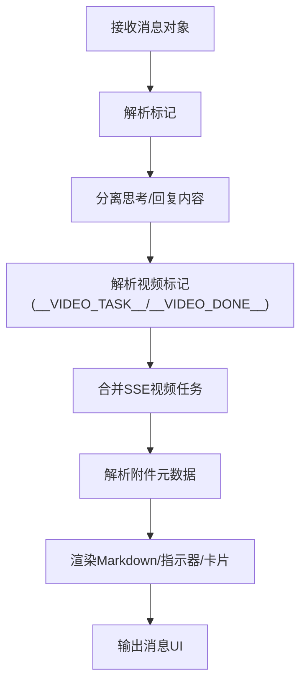
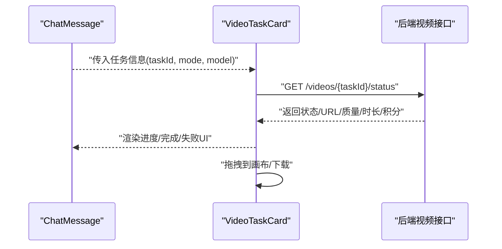
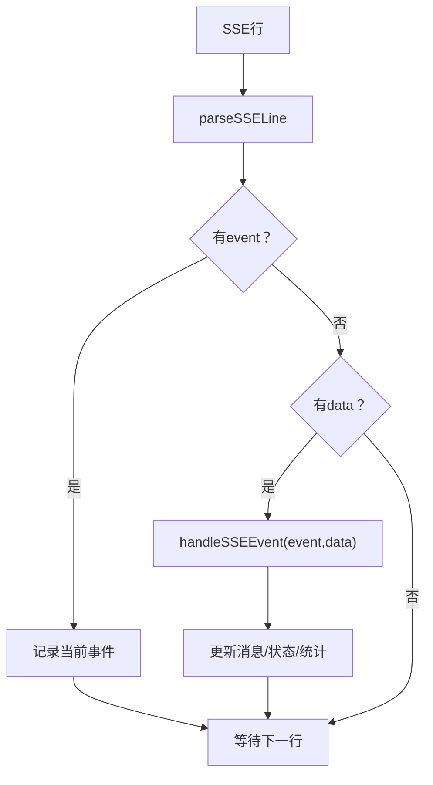
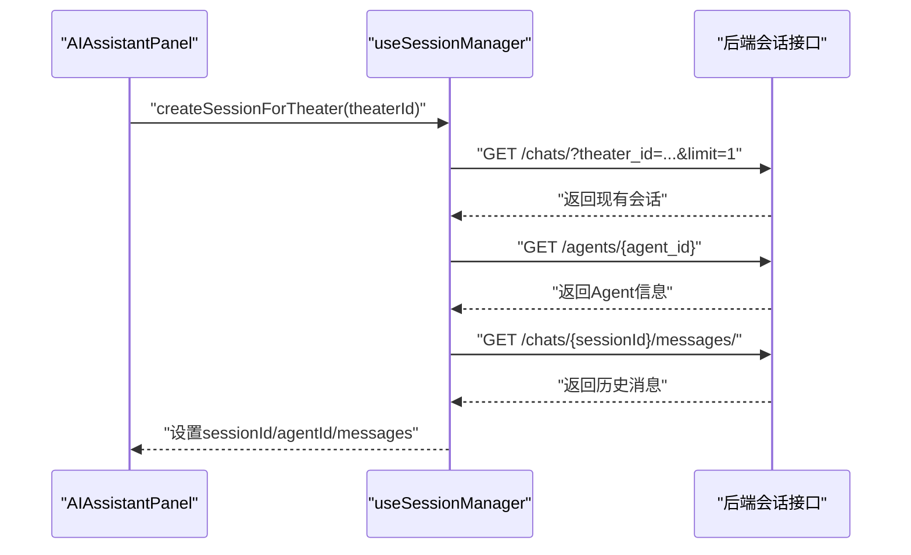
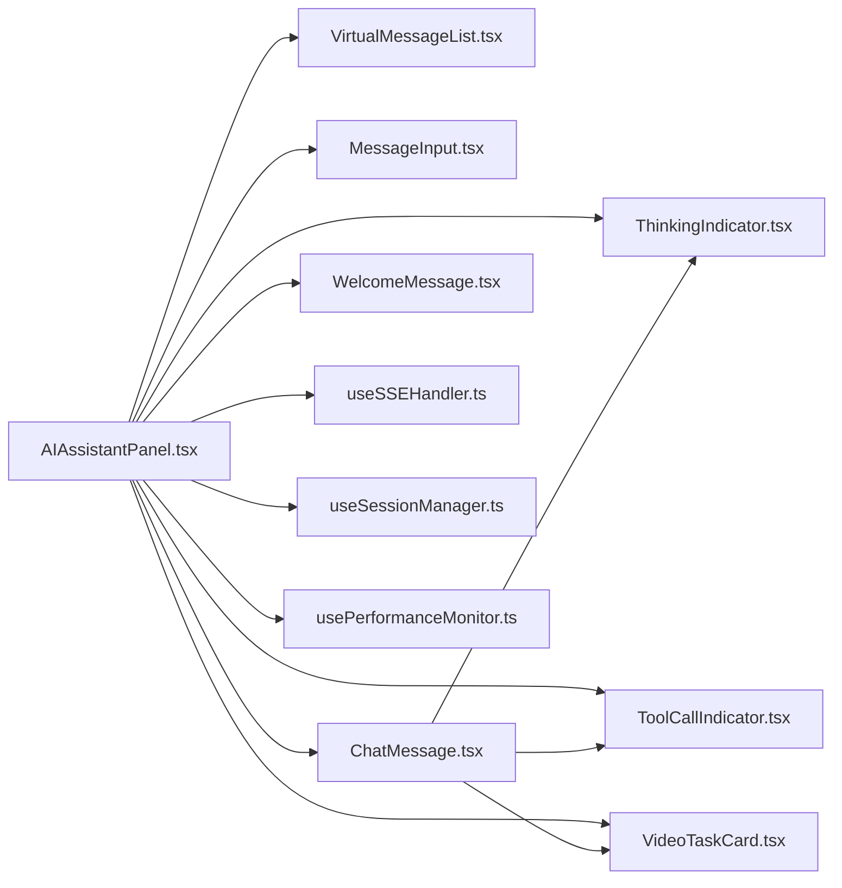

# AI助手组件

<cite>
**本文档引用的文件**
- [AIAssistantPanel.tsx](file://frontend/src/components/canvas/AIAssistantPanel.tsx)
- [index.ts](file://frontend/src/components/ai-assistant/index.ts)
- [useSSEHandler.ts](file://frontend/src/components/ai-assistant/hooks/useSSEHandler.ts)
- [useSessionManager.ts](file://frontend/src/components/ai-assistant/hooks/useSessionManager.ts)
- [usePerformanceMonitor.ts](file://frontend/src/components/ai-assistant/hooks/usePerformanceMonitor.ts)
- [VirtualMessageList.tsx](file://frontend/src/components/ai-assistant/VirtualMessageList.tsx)
- [MessageInput.tsx](file://frontend/src/components/ai-assistant/MessageInput.tsx)
- [ChatMessage.tsx](file://frontend/src/components/ai-assistant/ChatMessage.tsx)
- [WelcomeMessage.tsx](file://frontend/src/components/ai-assistant/WelcomeMessage.tsx)
- [VideoTaskCard.tsx](file://frontend/src/components/ai-assistant/VideoTaskCard.tsx)
- [ThinkingIndicator.tsx](file://frontend/src/components/ai-assistant/ThinkingIndicator.tsx)
- [ToolCallIndicator.tsx](file://frontend/src/components/ai-assistant/ToolCallIndicator.tsx)
</cite>

## 目录
1. [简介](#简介)
2. [项目结构](#项目结构)
3. [核心组件](#核心组件)
4. [架构总览](#架构总览)
5. [详细组件分析](#详细组件分析)
6. [依赖关系分析](#依赖关系分析)
7. [性能考量](#性能考量)
8. [故障排查指南](#故障排查指南)
9. [结论](#结论)
10. [附录](#附录)

## 简介
本文件面向KunFlix的AI助手组件，系统性阐述其架构设计与实现细节，涵盖：
- 消息列表虚拟化渲染与滚动行为
- 实时聊天会话管理与SSE事件流处理
- 思考指示器与工具调用指示器的实现
- 消息输入组件、欢迎消息展示、视频任务卡片
- WebSocket/SSE连接处理、会话状态持久化与错误处理
- 组件状态管理、内存优化与用户体验优化最佳实践
- 具体代码示例路径与集成指南

## 项目结构
AI助手相关代码主要位于前端工程的以下位置：
- 面板入口与组合：frontend/src/components/canvas/AIAssistantPanel.tsx
- 组件导出聚合：frontend/src/components/ai-assistant/index.ts
- 子组件与Hooks：
  - frontend/src/components/ai-assistant/VirtualMessageList.tsx
  - frontend/src/components/ai-assistant/MessageInput.tsx
  - frontend/src/components/ai-assistant/ChatMessage.tsx
  - frontend/src/components/ai-assistant/WelcomeMessage.tsx
  - frontend/src/components/ai-assistant/VideoTaskCard.tsx
  - frontend/src/components/ai-assistant/ThinkingIndicator.tsx
  - frontend/src/components/ai-assistant/ToolCallIndicator.tsx
  - frontend/src/components/ai-assistant/hooks/useSSEHandler.ts
  - frontend/src/components/ai-assistant/hooks/useSessionManager.ts
  - frontend/src/components/ai-assistant/hooks/usePerformanceMonitor.ts

图表来源
- [AIAssistantPanel.tsx:1-613](file://frontend/src/components/canvas/AIAssistantPanel.tsx#L1-L613)
- [index.ts:1-38](file://frontend/src/components/ai-assistant/index.ts#L1-L38)

章节来源
- [AIAssistantPanel.tsx:1-613](file://frontend/src/components/canvas/AIAssistantPanel.tsx#L1-L613)
- [index.ts:1-38](file://frontend/src/components/ai-assistant/index.ts#L1-L38)

## 核心组件
- AIAssistantPanel：面板入口，负责面板生命周期、拖拽/缩放、会话初始化、SSE事件处理、消息发送与错误弹窗等。
- VirtualMessageList：基于react-window的虚拟列表，支持动态行高、overscan、自动滚动与滚动状态回调。
- MessageInput：输入框与Agent选择器，支持多行自适应高度、回车发送、禁用态与加载态。
- ChatMessage：消息渲染器，解析<think>、视频标记、附件元数据，整合技能/工具调用指示器与视频任务卡片。
- WelcomeMessage：欢迎消息与预设对话入口。
- VideoTaskCard：视频任务状态卡片，支持轮询、拖拽到画布、下载与错误提示。
- ThinkingIndicator：单智能体思考指示器，含计时与加载点点点。
- ToolCallIndicator：工具调用执行状态指示器，支持展开查看参数与结果。
- useSSEHandler：SSE事件解析与状态机，驱动消息流式渲染与UI状态更新。
- useSessionManager：会话生命周期管理，Agent加载、会话创建/切换、清空与上下文使用统计恢复。
- usePerformanceMonitor：性能监控Hook，采集Long Task、LCP、FID、CLS与FPS。

章节来源
- [AIAssistantPanel.tsx:51-613](file://frontend/src/components/canvas/AIAssistantPanel.tsx#L51-L613)
- [VirtualMessageList.tsx:1-293](file://frontend/src/components/ai-assistant/VirtualMessageList.tsx#L1-L293)
- [MessageInput.tsx:1-182](file://frontend/src/components/ai-assistant/MessageInput.tsx#L1-L182)
- [ChatMessage.tsx:1-421](file://frontend/src/components/ai-assistant/ChatMessage.tsx#L1-L421)
- [WelcomeMessage.tsx:1-79](file://frontend/src/components/ai-assistant/WelcomeMessage.tsx#L1-L79)
- [VideoTaskCard.tsx:1-290](file://frontend/src/components/ai-assistant/VideoTaskCard.tsx#L1-L290)
- [ThinkingIndicator.tsx:1-56](file://frontend/src/components/ai-assistant/ThinkingIndicator.tsx#L1-L56)
- [ToolCallIndicator.tsx:1-164](file://frontend/src/components/ai-assistant/ToolCallIndicator.tsx#L1-L164)
- [useSSEHandler.ts:1-391](file://frontend/src/components/ai-assistant/hooks/useSSEHandler.ts#L1-L391)
- [useSessionManager.ts:1-226](file://frontend/src/components/ai-assistant/hooks/useSessionManager.ts#L1-L226)
- [usePerformanceMonitor.ts:1-236](file://frontend/src/components/ai-assistant/hooks/usePerformanceMonitor.ts#L1-L236)

## 架构总览
AI助手采用“面板容器 + 虚拟消息列表 + 事件驱动渲染”的架构：
- 面板容器负责会话初始化、SSE事件接入、消息发送与错误处理。
- 虚拟列表负责高性能渲染消息，自动滚动与滚动状态反馈。
- SSE事件驱动消息流式渲染与UI状态更新，包含文本增量、工具/技能调用、视频任务、多智能体协作等。
- 会话管理负责Agent选择、会话创建/切换、清空与上下文使用统计恢复。
- 性能监控贯穿渲染与交互，保障流畅体验。

图表来源
- [AIAssistantPanel.tsx:182-293](file://frontend/src/components/canvas/AIAssistantPanel.tsx#L182-L293)
- [useSSEHandler.ts:67-390](file://frontend/src/components/ai-assistant/hooks/useSSEHandler.ts#L67-L390)
- [VirtualMessageList.tsx:97-196](file://frontend/src/components/ai-assistant/VirtualMessageList.tsx#L97-L196)

## 详细组件分析

### AIAssistantPanel 面板容器
职责与要点：
- 面板状态与拖拽/缩放：约束到视口、吸附动画、拖拽控制。
- 会话管理：按需创建/恢复会话，Agent选择与切换，清空会话。
- SSE处理：读取ReadableStream，逐行解析SSE，驱动消息渲染。
- 错误处理：401重登弹窗、402/403/429友好提示、Abort中断。
- 附件与图像编辑上下文：构建消息正文，隐藏元数据与可读上下文拼接。
- 性能监控：长任务检测与FPS上报。

图表来源
- [AIAssistantPanel.tsx:182-293](file://frontend/src/components/canvas/AIAssistantPanel.tsx#L182-L293)
- [AIAssistantPanel.tsx:36-49](file://frontend/src/components/canvas/AIAssistantPanel.tsx#L36-L49)

章节来源
- [AIAssistantPanel.tsx:51-613](file://frontend/src/components/canvas/AIAssistantPanel.tsx#L51-L613)

### VirtualMessageList 虚拟消息列表
特性与优化：
- 动态行高：useDynamicRowHeight，避免消息数量变化导致的缓存失效。
- overscan：默认5，提升滚动顺滑度。
- 自动滚动：用户消息发送后强制滚动到底；AI回复时仅在未手动上滚时滚动。
- 滚动状态回调：通知父组件是否到达底部，控制回到最新按钮显隐。
- 等待动画：当AI正在回复且无内容时，显示浮动三点加载动画（由父组件注入）。

图表来源
- [VirtualMessageList.tsx:155-196](file://frontend/src/components/ai-assistant/VirtualMessageList.tsx#L155-L196)
- [VirtualMessageList.tsx:63-66](file://frontend/src/components/ai-assistant/VirtualMessageList.tsx#L63-L66)

章节来源
- [VirtualMessageList.tsx:1-293](file://frontend/src/components/ai-assistant/VirtualMessageList.tsx#L1-L293)

### MessageInput 消息输入组件
特性：
- 多行自适应高度，最大高度120px。
- Enter发送，Shift+Enter换行。
- Agent选择器下拉菜单，支持禁用态与加载态。
- 发送后自动聚焦，重置高度。

章节来源
- [MessageInput.tsx:1-182](file://frontend/src/components/ai-assistant/MessageInput.tsx#L1-L182)

### ChatMessage 消息渲染器
能力与解析：
- 解析<think>标记：区分思考内容与正式回复，支持思考完成状态。
- 解析视频标记：支持内嵌任务标记与完成标记，合并SSE事件中的视频任务。
- 附件解析：隐藏元数据与可读上下文分离，用于AI感知节点内容。
- 指示器整合：技能调用、工具调用、多智能体协作、视频任务卡片。
- Markdown渲染：流式与非流式差异化组件，懒加载图片与代码块。

图表来源
- [ChatMessage.tsx:64-126](file://frontend/src/components/ai-assistant/ChatMessage.tsx#L64-L126)
- [ChatMessage.tsx:260-293](file://frontend/src/components/ai-assistant/ChatMessage.tsx#L260-L293)

章节来源
- [ChatMessage.tsx:1-421](file://frontend/src/components/ai-assistant/ChatMessage.tsx#L1-L421)

### WelcomeMessage 欢迎消息
- 展示用户名与欢迎语，提供预设对话快捷入口。
- 通过动画与布局引导用户开始创作。

章节来源
- [WelcomeMessage.tsx:1-79](file://frontend/src/components/ai-assistant/WelcomeMessage.tsx#L1-L79)

### VideoTaskCard 视频任务卡片
能力：
- 轮询任务状态，终端状态停止轮询。
- 支持拖拽到画布、下载、错误提示与元信息展示。
- 模式标签与模型标签，便于识别任务类型。

图表来源
- [VideoTaskCard.tsx:134-290](file://frontend/src/components/ai-assistant/VideoTaskCard.tsx#L134-L290)

章节来源
- [VideoTaskCard.tsx:1-290](file://frontend/src/components/ai-assistant/VideoTaskCard.tsx#L1-L290)

### ThinkingIndicator 思考指示器
- 单智能体思考时显示，包含计时与加载点点点。
- 渐变背景与脉冲星装饰，增强视觉反馈。

章节来源
- [ThinkingIndicator.tsx:1-56](file://frontend/src/components/ai-assistant/ThinkingIndicator.tsx#L1-L56)

### ToolCallIndicator 工具调用指示器
- 执行中/成功/失败三态样式区分。
- 支持展开查看参数与结果，错误格式自动识别。
- 统计执行中/成功/失败数量，便于概览。

章节来源
- [ToolCallIndicator.tsx:1-164](file://frontend/src/components/ai-assistant/ToolCallIndicator.tsx#L1-L164)

### useSSEHandler SSE事件处理器
职责：
- 解析SSE行：event/data字段提取。
- 事件分发：text、skill_call、skill_loaded、tool_call、tool_result、video_task_created、subtask_*、task_completed、billing、canvas_updated、context_compacted、done、error。
- 状态机：维护技能/工具/视频任务/多智能体步骤与回合标记，更新消息与上下文使用统计。
- 结束清理：done事件后重置状态。

图表来源
- [useSSEHandler.ts:56-65](file://frontend/src/components/ai-assistant/hooks/useSSEHandler.ts#L56-L65)
- [useSSEHandler.ts:67-390](file://frontend/src/components/ai-assistant/hooks/useSSEHandler.ts#L67-L390)

章节来源
- [useSSEHandler.ts:1-391](file://frontend/src/components/ai-assistant/hooks/useSSEHandler.ts#L1-L391)

### useSessionManager 会话管理
职责：
- Agent列表加载与切换。
- 会话创建/恢复：按theater_id查询/创建，恢复消息历史与上下文使用统计。
- 清空会话：删除消息并保留会话。
- Theater切换与页面刷新恢复：监听theaterId变化，必要时重建会话并恢复统计。

图表来源
- [useSessionManager.ts:52-123](file://frontend/src/components/ai-assistant/hooks/useSessionManager.ts#L52-L123)

章节来源
- [useSessionManager.ts:1-226](file://frontend/src/components/ai-assistant/hooks/useSessionManager.ts#L1-L226)

### usePerformanceMonitor 性能监控
能力：
- Long Task：超过阈值(默认200ms)告警与统计。
- LCP/FID/CLS：观察关键性能指标。
- FPS：每秒采样，保留最近60帧，计算平均FPS。
- 清理：断开观察者与定时器，避免内存泄漏。

章节来源
- [usePerformanceMonitor.ts:1-236](file://frontend/src/components/ai-assistant/hooks/usePerformanceMonitor.ts#L1-L236)

## 依赖关系分析
- 组件间依赖：
  - AIAssistantPanel依赖VirtualMessageList、MessageInput、ChatMessage、WelcomeMessage、VideoTaskCard、ThinkingIndicator、ToolCallIndicator、useSSEHandler、useSessionManager、usePerformanceMonitor。
  - ChatMessage依赖ThinkingIndicator、ToolCallIndicator、VideoTaskCard、LazyImage/LazyCodeBlock等。
- 外部依赖：
  - react-window用于虚拟列表。
  - react-markdown + remark-gfm用于Markdown渲染。
  - framer-motion用于动画。
  - lucide-react用于图标。

图表来源
- [AIAssistantPanel.tsx:20-26](file://frontend/src/components/canvas/AIAssistantPanel.tsx#L20-L26)
- [ChatMessage.tsx:8-18](file://frontend/src/components/ai-assistant/ChatMessage.tsx#L8-L18)

章节来源
- [AIAssistantPanel.tsx:1-613](file://frontend/src/components/canvas/AIAssistantPanel.tsx#L1-L613)
- [ChatMessage.tsx:1-421](file://frontend/src/components/ai-assistant/ChatMessage.tsx#L1-L421)

## 性能考量
- 虚拟列表与动态行高：减少DOM节点数量，避免重排重绘。
- overscan与will-change：提升滚动顺滑度。
- 流式渲染：文本增量渲染，降低首屏压力。
- 懒加载：图片与代码块按需加载，缩短可交互时间。
- 性能监控：Long Task与FPS告警，便于定位瓶颈。
- 内存优化：SSE状态机在done后重置；轮询任务在终端状态停止；组件卸载清理定时器与观察者。

## 故障排查指南
常见问题与处理：
- 登录过期（401）：弹出重新登录对话框，调用logout并阻止错误消息显示。
- 请求失败（402/403/429）：根据状态码映射友好提示。
- 中断请求（AbortError）：忽略错误消息，避免重复提示。
- SSE错误事件：统一追加错误消息并重置状态机。
- 视频任务失败：显示错误摘要，支持重试或检查资源有效性。
- 性能异常：关注Long Task与FPS，定位耗时操作并优化。

章节来源
- [AIAssistantPanel.tsx:240-290](file://frontend/src/components/canvas/AIAssistantPanel.tsx#L240-L290)
- [useSSEHandler.ts:374-380](file://frontend/src/components/ai-assistant/hooks/useSSEHandler.ts#L374-L380)
- [VideoTaskCard.tsx:174-195](file://frontend/src/components/ai-assistant/VideoTaskCard.tsx#L174-L195)
- [usePerformanceMonitor.ts:75-200](file://frontend/src/components/ai-assistant/hooks/usePerformanceMonitor.ts#L75-L200)

## 结论
AI助手组件通过虚拟列表渲染、SSE事件驱动与完善的会话管理，实现了高性能、可扩展的实时聊天体验。结合思考与工具调用指示器、视频任务卡片与性能监控，为用户提供了清晰的状态反馈与稳定的交互体验。建议在集成时重点关注SSE事件一致性、会话状态恢复与性能观测，持续优化滚动与渲染体验。

## 附录

### 消息格式与事件约定
- 文本事件：event=text，data={ chunk:string }。
- 工具调用：event=tool_call/tool_result，data={ tool_name:string, arguments?:Record }。
- 技能调用：event=skill_call/skill_loaded，data={ skill_name:string }。
- 视频任务：event=video_task_created，data={ task_id:string, video_mode:string, model:string }。
- 多智能体：event=subtask_created/subtask_started/subtask_completed/subtask_failed/task_completed。
- 计费与上下文：event=billing/context_compacted。
- 完成与错误：event=done/error。

章节来源
- [useSSEHandler.ts:70-390](file://frontend/src/components/ai-assistant/hooks/useSSEHandler.ts#L70-L390)

### 实时更新机制
- SSE事件逐行解析，按事件类型更新消息状态与UI。
- 流式文本增量追加，非流式文本分块渲染。
- 工具/技能/视频任务状态在消息对象中携带，指示器实时反映。

章节来源
- [useSSEHandler.ts:67-390](file://frontend/src/components/ai-assistant/hooks/useSSEHandler.ts#L67-L390)
- [VirtualMessageList.tsx:184-196](file://frontend/src/components/ai-assistant/VirtualMessageList.tsx#L184-L196)

### 错误处理与重连策略
- 401：弹窗提示并触发重新登录，不再显示通用错误消息。
- 402/403/429：映射友好提示，避免重复提示。
- Abort：忽略，防止中断请求产生错误消息。
- SSE错误：追加错误消息并重置状态机。
- 视频任务失败：显示错误摘要，支持重试。

章节来源
- [AIAssistantPanel.tsx:240-290](file://frontend/src/components/canvas/AIAssistantPanel.tsx#L240-L290)
- [useSSEHandler.ts:374-380](file://frontend/src/components/ai-assistant/hooks/useSSEHandler.ts#L374-L380)

### 组件状态管理与内存优化
- 状态集中于store与Hook引用，避免跨组件重复订阅。
- SSE状态机在done后重置，防止累积。
- 轮询在终端状态停止，组件卸载清理定时器。
- 虚拟列表动态行高缓存，避免消息数量变化导致的重算。

章节来源
- [useSSEHandler.ts:43-54](file://frontend/src/components/ai-assistant/hooks/useSSEHandler.ts#L43-L54)
- [VideoTaskCard.tsx:174-195](file://frontend/src/components/ai-assistant/VideoTaskCard.tsx#L174-L195)
- [VirtualMessageList.tsx:63-66](file://frontend/src/components/ai-assistant/VirtualMessageList.tsx#L63-L66)

### 用户体验优化最佳实践
- 自动滚动：用户消息发送后强制滚动到底；AI回复时仅在未上滚时滚动。
- 回到最新按钮：消息过多时显示，平滑滚动到底部。
- 加载指示：思考指示器与三点加载动画，减少等待焦虑。
- 拖拽/缩放：面板拖拽吸附与四边四角缩放，提升可用性。
- 性能监控：长任务与FPS告警，及时发现并优化性能问题。

章节来源
- [AIAssistantPanel.tsx:488-496](file://frontend/src/components/canvas/AIAssistantPanel.tsx#L488-L496)
- [VirtualMessageList.tsx:155-196](file://frontend/src/components/ai-assistant/VirtualMessageList.tsx#L155-L196)
- [ThinkingIndicator.tsx:13-56](file://frontend/src/components/ai-assistant/ThinkingIndicator.tsx#L13-L56)
- [usePerformanceMonitor.ts:75-200](file://frontend/src/components/ai-assistant/hooks/usePerformanceMonitor.ts#L75-L200)

### 集成指南
- 在画布页面引入AIAssistantPanel，并确保AuthContext与CanvasStore可用。
- 确保NEXT_PUBLIC_API_URL环境变量正确指向后端API。
- 如需扩展SSE事件，可在useSSEHandler中添加事件处理器与状态更新逻辑。
- 如需自定义附件上下文，修改AIAssistantPanel中的buildAttachmentContext函数。

章节来源
- [AIAssistantPanel.tsx:51-613](file://frontend/src/components/canvas/AIAssistantPanel.tsx#L51-L613)
- [useSSEHandler.ts:67-390](file://frontend/src/components/ai-assistant/hooks/useSSEHandler.ts#L67-L390)