# AI助手面板

<cite>
**本文档引用的文件**
- [AIAssistantPanel.tsx](file://frontend/src/components/canvas/AIAssistantPanel.tsx)
- [PanelHeader.tsx](file://frontend/src/components/ai-assistant/PanelHeader.tsx)
- [ScrollToBottomButton.tsx](file://frontend/src/components/ai-assistant/ScrollToBottomButton.tsx)
- [VirtualMessageList.tsx](file://frontend/src/components/ai-assistant/VirtualMessageList.tsx)
- [MessageInput.tsx](file://frontend/src/components/ai-assistant/MessageInput.tsx)
- [NodePreviewCard.tsx](file://frontend/src/components/ai-assistant/NodePreviewCard.tsx)
- [WelcomeMessage.tsx](file://frontend/src/components/ai-assistant/WelcomeMessage.tsx)
- [useSessionManager.ts](file://frontend/src/components/ai-assistant/hooks/useSessionManager.ts)
- [useSSEHandler.ts](file://frontend/src/components/ai-assistant/hooks/useSSEHandler.ts)
- [usePerformanceMonitor.ts](file://frontend/src/components/ai-assistant/hooks/usePerformanceMonitor.ts)
- [useAIAssistantStore.ts](file://frontend/src/store/useAIAssistantStore.ts)
- [api.ts](file://frontend/src/lib/api.ts)
- [ThinkPanel.tsx](file://frontend/src/components/ai-assistant/ThinkPanel.tsx)
- [ThinkingIndicator.tsx](file://frontend/src/components/ai-assistant/ThinkingIndicator.tsx)
</cite>

## 目录
1. [简介](#简介)
2. [项目结构](#项目结构)
3. [核心组件](#核心组件)
4. [架构总览](#架构总览)
5. [详细组件分析](#详细组件分析)
6. [依赖关系分析](#依赖关系分析)
7. [性能考量](#性能考量)
8. [故障排查指南](#故障排查指南)
9. [结论](#结论)
10. [附录](#附录)

## 简介
本文件为"AI助手面板"组件的系统化技术文档，面向前端工程师与产品/设计人员，全面阐述其整体架构、布局与交互、响应式与主题适配、状态管理与动画、键盘快捷键、尺寸与位置控制、移动端适配、集成方式、样式定制与性能优化建议。文档基于仓库中的实际代码进行分析与总结，所有说明均以源码为依据。

**更新** 本次更新反映了UI标签国际化变更：将'思考中'改为'Thinking...'，'思考完成'改为'Think Complete'，以及面板样式的改进。

## 项目结构
AI助手面板位于前端工程的画布模块中，采用"容器组件 + 子组件 + Hooks + Store"的分层组织方式：
- 容器组件：AIAssistantPanel.tsx 负责面板生命周期、拖拽/尺寸调整、SSE流式处理、会话管理、状态同步等
- 子组件：PanelHeader、VirtualMessageList、ScrollToBottomButton、MessageInput、NodePreviewCard、WelcomeMessage、ThinkPanel、ThinkingIndicator 等
- Hooks：useSessionManager、useSSEHandler、usePerformanceMonitor 等封装业务逻辑与性能监控
- 状态管理：useAIAssistantStore.ts 提供全局状态与持久化
- 请求封装：api.ts 提供统一的HTTP客户端与鉴权拦截

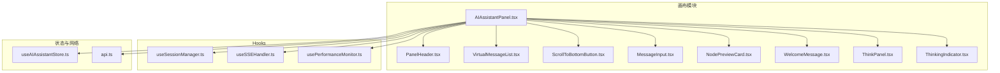

**图表来源**
- [AIAssistantPanel.tsx:1-613](file://frontend/src/components/canvas/AIAssistantPanel.tsx#L1-L613)
- [PanelHeader.tsx:1-246](file://frontend/src/components/ai-assistant/PanelHeader.tsx#L1-L246)
- [VirtualMessageList.tsx:1-293](file://frontend/src/components/ai-assistant/VirtualMessageList.tsx#L1-L293)
- [ScrollToBottomButton.tsx:1-62](file://frontend/src/components/ai-assistant/ScrollToBottomButton.tsx#L1-L62)
- [MessageInput.tsx:1-182](file://frontend/src/components/ai-assistant/MessageInput.tsx#L1-L182)
- [NodePreviewCard.tsx:1-213](file://frontend/src/components/ai-assistant/NodePreviewCard.tsx#L1-L213)
- [WelcomeMessage.tsx:1-79](file://frontend/src/components/ai-assistant/WelcomeMessage.tsx#L1-L79)
- [ThinkPanel.tsx:1-280](file://frontend/src/components/ai-assistant/ThinkPanel.tsx#L1-L280)
- [ThinkingIndicator.tsx:1-56](file://frontend/src/components/ai-assistant/ThinkingIndicator.tsx#L1-L56)
- [useSessionManager.ts:1-226](file://frontend/src/components/ai-assistant/hooks/useSessionManager.ts#L1-L226)
- [useSSEHandler.ts:1-391](file://frontend/src/components/ai-assistant/hooks/useSSEHandler.ts#L1-L391)
- [usePerformanceMonitor.ts:1-236](file://frontend/src/components/ai-assistant/hooks/usePerformanceMonitor.ts#L1-L236)
- [useAIAssistantStore.ts:1-381](file://frontend/src/store/useAIAssistantStore.ts#L1-L381)
- [api.ts:1-84](file://frontend/src/lib/api.ts#L1-L84)

**章节来源**
- [AIAssistantPanel.tsx:1-613](file://frontend/src/components/canvas/AIAssistantPanel.tsx#L1-L613)
- [useAIAssistantStore.ts:1-381](file://frontend/src/store/useAIAssistantStore.ts#L1-L381)

## 核心组件
- 面板容器：负责面板显隐、拖拽、尺寸调整、SSE流式接收、会话初始化、错误处理与登录过期弹窗
- 头部组件：提供清空会话、关闭面板、拖拽抓手、上下文使用率指示器（含悬浮详情）
- 消息列表：虚拟滚动实现，支持自动滚动、手动滚动检测、等待指示
- 回到最新按钮：平滑滚动到底部，支持"新消息"高亮
- 输入区：支持多行自适应高度、Enter发送、Agent选择器、发送禁用态
- 节点附件预览：支持多图/多类型节点横向与纵向组合展示
- 欢迎消息：默认状态下的引导文案与预设对话快捷入口
- 思考过程面板：显示AI思考状态、计时器、多智能体协作进度，支持自动展开/折叠
- 思考指示器：显示AI正在思考的状态，包含渐变背景和脉冲动画
- Hooks：会话管理（Agent加载/切换/清空）、SSE事件解析与状态聚合、性能监控
- 状态存储：Zustand + 持久化，保存面板尺寸/位置、消息、会话、上下文使用统计、虚拟滚动参数

**更新** 新增了思考过程面板和思考指示器组件，提供更丰富的AI交互状态反馈。

**章节来源**
- [AIAssistantPanel.tsx:51-613](file://frontend/src/components/canvas/AIAssistantPanel.tsx#L51-L613)
- [PanelHeader.tsx:19-72](file://frontend/src/components/ai-assistant/PanelHeader.tsx#L19-L72)
- [VirtualMessageList.tsx:43-293](file://frontend/src/components/ai-assistant/VirtualMessageList.tsx#L43-L293)
- [ScrollToBottomButton.tsx:16-62](file://frontend/src/components/ai-assistant/ScrollToBottomButton.tsx#L16-L62)
- [MessageInput.tsx:29-182](file://frontend/src/components/ai-assistant/MessageInput.tsx#L29-L182)
- [NodePreviewCard.tsx:151-213](file://frontend/src/components/ai-assistant/NodePreviewCard.tsx#L151-L213)
- [WelcomeMessage.tsx:28-79](file://frontend/src/components/ai-assistant/WelcomeMessage.tsx#L28-L79)
- [ThinkPanel.tsx:27-38](file://frontend/src/components/ai-assistant/ThinkPanel.tsx#L27-L38)
- [ThinkingIndicator.tsx:13-55](file://frontend/src/components/ai-assistant/ThinkingIndicator.tsx#L13-L55)
- [useSessionManager.ts:12-226](file://frontend/src/components/ai-assistant/hooks/useSessionManager.ts#L12-L226)
- [useSSEHandler.ts:25-391](file://frontend/src/components/ai-assistant/hooks/useSSEHandler.ts#L25-L391)
- [usePerformanceMonitor.ts:31-236](file://frontend/src/components/ai-assistant/hooks/usePerformanceMonitor.ts#L31-L236)
- [useAIAssistantStore.ts:104-381](file://frontend/src/store/useAIAssistantStore.ts#L104-L381)

## 架构总览
AI助手面板采用"容器-子组件-状态-网络"分层：
- 容器组件负责顶层控制流与副作用（拖拽、尺寸、键盘、SSE、会话）
- 子组件专注UI与交互（头部、消息列表、输入、预览、按钮、思考面板）
- Hooks封装跨组件共享的业务逻辑（会话、SSE、性能）
- Zustand Store集中管理状态并持久化关键配置
- API封装统一鉴权与刷新策略

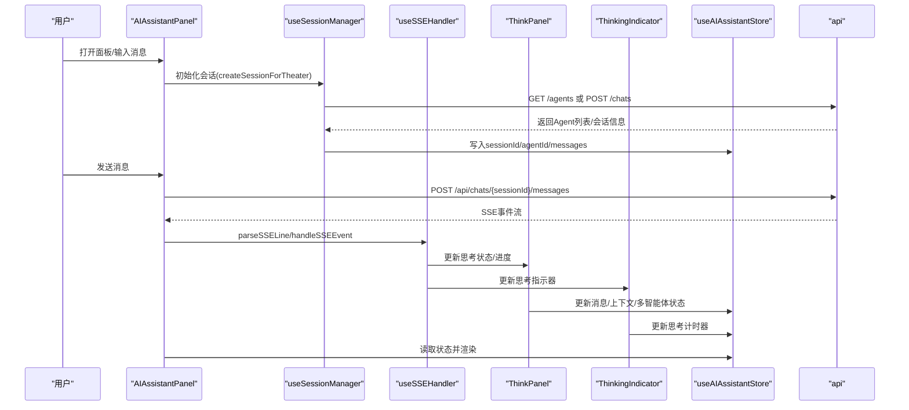

**图表来源**
- [AIAssistantPanel.tsx:182-293](file://frontend/src/components/canvas/AIAssistantPanel.tsx#L182-L293)
- [useSessionManager.ts:52-123](file://frontend/src/components/ai-assistant/hooks/useSessionManager.ts#L52-L123)
- [useSSEHandler.ts:56-391](file://frontend/src/components/ai-assistant/hooks/useSSEHandler.ts#L56-L391)
- [ThinkPanel.tsx:74-86](file://frontend/src/components/ai-assistant/ThinkPanel.tsx#L74-L86)
- [ThinkingIndicator.tsx:16-23](file://frontend/src/components/ai-assistant/ThinkingIndicator.tsx#L16-L23)
- [api.ts:1-84](file://frontend/src/lib/api.ts#L1-L84)

## 详细组件分析

### 面板容器（AIAssistantPanel）
- 面板显隐与展开/收起动画：使用 Framer Motion 的 AnimatePresence/motion 控制进入/退出动画，支持透明度、缩放与尺寸过渡
- 拖拽与吸附：通过 useDragControls 与 constraintsRef 约束到视口内，拖拽结束时根据约束计算结果决定是否播放吸附动画
- 尺寸调整：支持四边与四角拖拽，计算新宽高与位置，同时约束到可视区域
- 键盘快捷键：ESC 在面板打开且无输入焦点时最小化面板
- SSE流式处理：逐行解析SSE，按事件类型更新消息、工具/技能调用、多智能体状态、上下文使用统计
- 会话管理：首次打开或缺失会话时自动创建；支持Agent切换与清空会话
- 错误处理：401时弹出重新登录对话框；其他错误以消息形式反馈
- 附件上下文：支持多节点附件拼接为可读上下文，保证AI感知节点内容

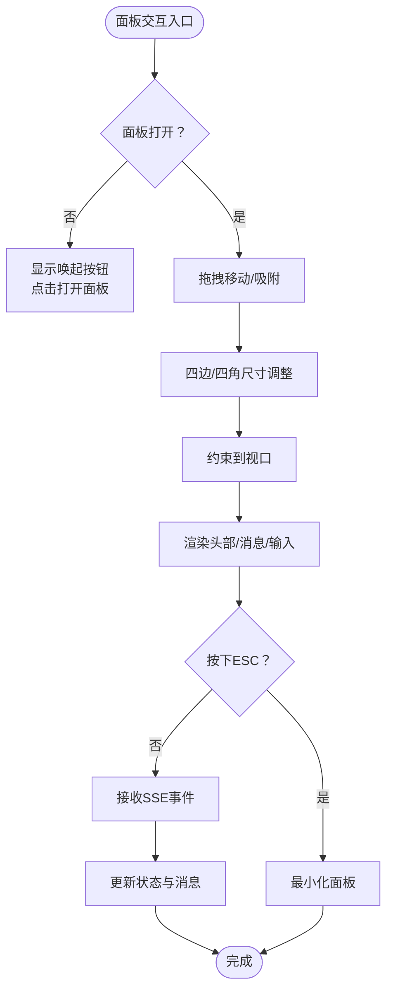

**图表来源**
- [AIAssistantPanel.tsx:135-151](file://frontend/src/components/canvas/AIAssistantPanel.tsx#L135-L151)
- [AIAssistantPanel.tsx:295-344](file://frontend/src/components/canvas/AIAssistantPanel.tsx#L295-L344)
- [AIAssistantPanel.tsx:371-581](file://frontend/src/components/canvas/AIAssistantPanel.tsx#L371-L581)

**章节来源**
- [AIAssistantPanel.tsx:51-613](file://frontend/src/components/canvas/AIAssistantPanel.tsx#L51-L613)

### 头部组件（PanelHeader）
- 清空会话：触发会话消息清空
- 关闭面板：最小化面板
- 拖拽抓手：通过 onDragStart 传递给容器，实现面板整体拖拽
- 上下文使用率指示器：按百分比显示电池图标与颜色，支持hover展开详情（使用量、剩余、占比）

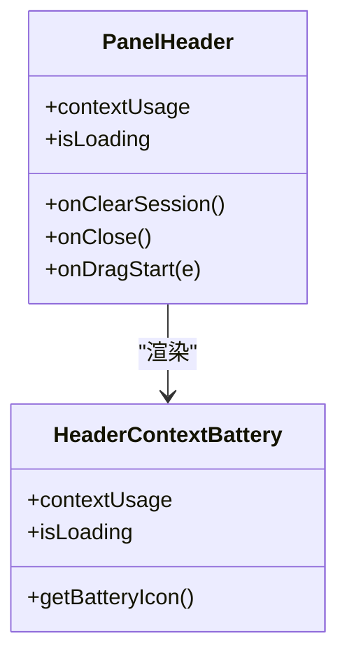

**图表来源**
- [PanelHeader.tsx:19-72](file://frontend/src/components/ai-assistant/PanelHeader.tsx#L19-L72)
- [PanelHeader.tsx:80-246](file://frontend/src/components/ai-assistant/PanelHeader.tsx#L80-L246)

**章节来源**
- [PanelHeader.tsx:19-246](file://frontend/src/components/ai-assistant/PanelHeader.tsx#L19-L246)

### 滚动到底部按钮（ScrollToBottomButton）
- 条件显示：当未处于底部且消息较多时显示
- 平滑滚动：点击后触发虚拟列表滚动到底部
- "新消息"高亮：当AI仍在生成时，按钮呈现强调态

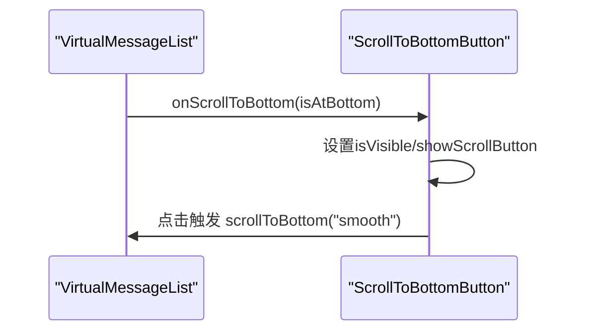

**图表来源**
- [VirtualMessageList.tsx:117-153](file://frontend/src/components/ai-assistant/VirtualMessageList.tsx#L117-L153)
- [ScrollToBottomButton.tsx:16-62](file://frontend/src/components/ai-assistant/ScrollToBottomButton.tsx#L16-L62)

**章节来源**
- [ScrollToBottomButton.tsx:16-62](file://frontend/src/components/ai-assistant/ScrollToBottomButton.tsx#L16-L62)
- [VirtualMessageList.tsx:97-110](file://frontend/src/components/ai-assistant/VirtualMessageList.tsx#L97-L110)

### 虚拟消息列表（VirtualMessageList）
- react-window 虚拟滚动：动态行高、overscan、容器尺寸监听
- 自动滚动策略：用户发送消息时总是滚动到底部；AI回复时仅在未手动向上滚动时滚动
- 等待指示：AI回复时显示打点动画
- 滚动状态暴露：提供 scrollToBottom/scrollToRow 方法供外部调用

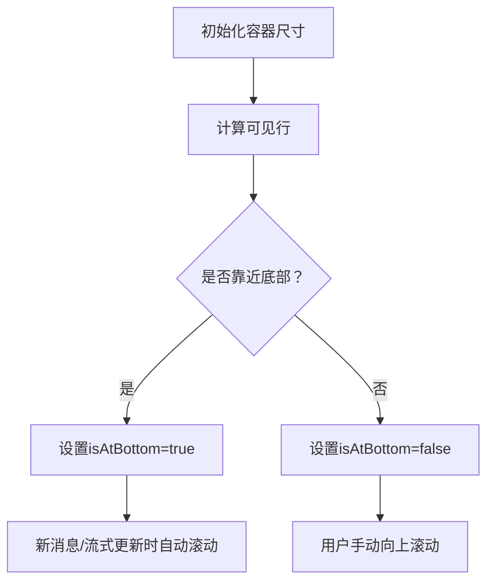

**图表来源**
- [VirtualMessageList.tsx:68-153](file://frontend/src/components/ai-assistant/VirtualMessageList.tsx#L68-L153)
- [VirtualMessageList.tsx:155-196](file://frontend/src/components/ai-assistant/VirtualMessageList.tsx#L155-L196)

**章节来源**
- [VirtualMessageList.tsx:43-293](file://frontend/src/components/ai-assistant/VirtualMessageList.tsx#L43-L293)

### 输入区（MessageInput）
- 多行自适应高度：受最大高度限制
- Enter发送：Enter发送，Shift+Enter换行
- Agent选择器：下拉菜单展示可用Agent及其目标节点类型
- 发送禁用态：在AI生成期间仍允许输入，但发送按钮根据输入内容与禁用标志控制

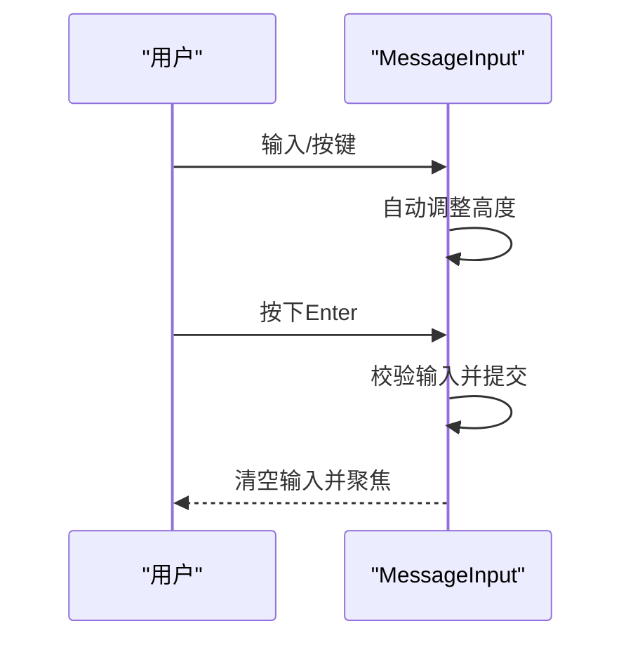

**图表来源**
- [MessageInput.tsx:48-82](file://frontend/src/components/ai-assistant/MessageInput.tsx#L48-L82)
- [MessageInput.tsx:109-177](file://frontend/src/components/ai-assistant/MessageInput.tsx#L109-L177)

**章节来源**
- [MessageInput.tsx:29-182](file://frontend/src/components/ai-assistant/MessageInput.tsx#L29-L182)

### 节点附件预览（NodePreviewCard）
- 多图横向排列：图片/视频缩略图卡片，支持移除与上传中状态
- 文本/其他类型纵向卡片：带图标与摘要
- 清除全部：支持一键清空多附件

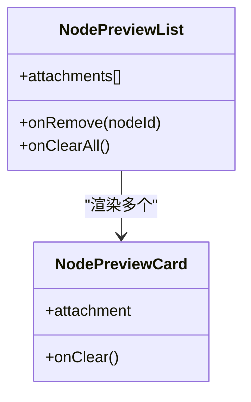

**图表来源**
- [NodePreviewCard.tsx:151-213](file://frontend/src/components/ai-assistant/NodePreviewCard.tsx#L151-L213)

**章节来源**
- [NodePreviewCard.tsx:151-213](file://frontend/src/components/ai-assistant/NodePreviewCard.tsx#L151-L213)

### 欢迎消息（WelcomeMessage）
- 默认状态文案：包含用户名与欢迎语
- 预设对话快捷入口：四类场景的快捷提示，点击即发送

**章节来源**
- [WelcomeMessage.tsx:28-79](file://frontend/src/components/ai-assistant/WelcomeMessage.tsx#L28-L79)

### 思考过程面板（ThinkPanel）
- **更新** 支持两种模式：单智能体思考模式和多智能体协作模式
- **更新** 自动展开/折叠：检测到思考状态时自动展开，思考结束后延迟折叠
- **更新** 实时进度：显示当前执行步骤和进度百分比
- **更新** 状态标签：使用国际化友好的标签显示
  - 正在思考：'AI Thinking...' 或 'AgentName Think...'
  - 思考完成：'Think Complete' 或 'Think complete'
  - 多智能体：'多智能体协作'

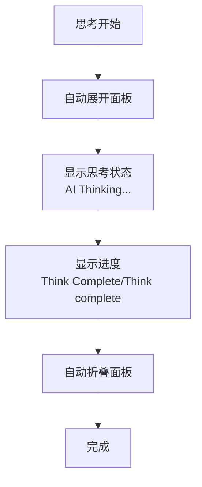

**图表来源**
- [ThinkPanel.tsx:74-86](file://frontend/src/components/ai-assistant/ThinkPanel.tsx#L74-L86)
- [ThinkPanel.tsx:149-155](file://frontend/src/components/ai-assistant/ThinkPanel.tsx#L149-L155)

**章节来源**
- [ThinkPanel.tsx:27-280](file://frontend/src/components/ai-assistant/ThinkPanel.tsx#L27-L280)

### 思考指示器（ThinkingIndicator）
- **更新** 渐变背景：使用 `from-primary/5 via-primary/10 to-primary/5` 渐变
- **更新** 脉冲动画：Sparkles图标带有脉冲动画效果
- **更新** 中英文支持：AI正在思考的本地化显示
- **更新** 计时器：显示思考持续时间

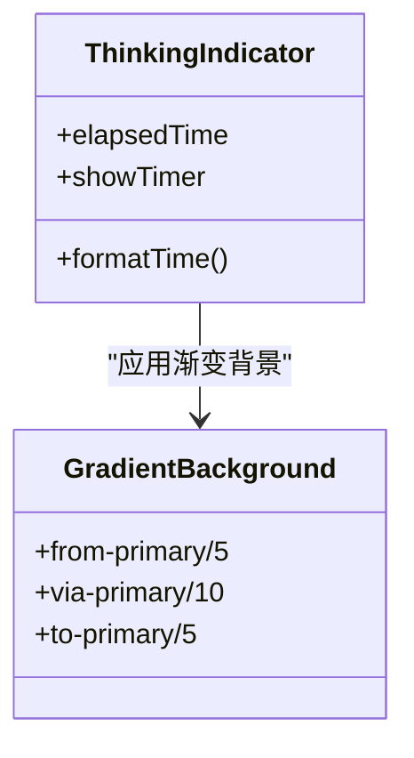

**图表来源**
- [ThinkingIndicator.tsx:32-38](file://frontend/src/components/ai-assistant/ThinkingIndicator.tsx#L32-L38)
- [ThinkingIndicator.tsx:40-43](file://frontend/src/components/ai-assistant/ThinkingIndicator.tsx#L40-L43)

**章节来源**
- [ThinkingIndicator.tsx:13-55](file://frontend/src/components/ai-assistant/ThinkingIndicator.tsx#L13-L55)

### 会话管理（useSessionManager）
- Agent加载：GET /agents
- 会话创建：若存在历史会话则恢复，否则创建新会话
- Agent切换：POST /chats 创建新会话并切换Agent
- 清空会话：删除消息历史并重置状态
- 上下文使用统计恢复：从后端恢复已使用tokens与上下文窗口

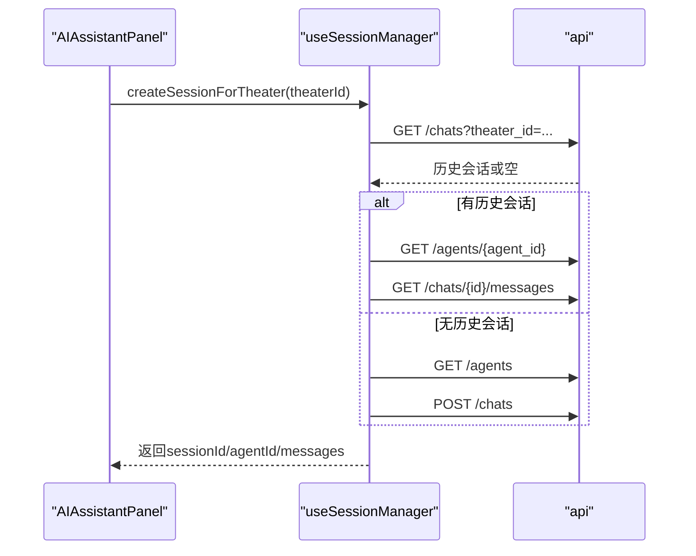

**图表来源**
- [useSessionManager.ts:52-123](file://frontend/src/components/ai-assistant/hooks/useSessionManager.ts#L52-L123)
- [useSessionManager.ts:148-163](file://frontend/src/components/ai-assistant/hooks/useSessionManager.ts#L148-L163)

**章节来源**
- [useSessionManager.ts:12-226](file://frontend/src/components/ai-assistant/hooks/useSessionManager.ts#L12-L226)

### SSE事件处理器（useSSEHandler）
- 事件解析：按行解析 event/data
- 事件处理：text、skill_call/skill_loaded、tool_call/tool_result、video_task_created、多智能体子任务事件、billing、canvas_updated、context_compacted、done/error
- 状态聚合：维护技能/工具/视频任务/多智能体步骤等状态，并写入消息扩展字段
- 结束清理：done事件后重置流式状态

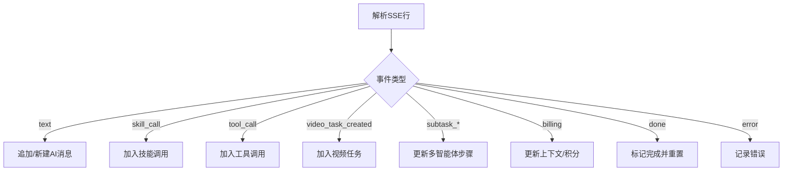

**图表来源**
- [useSSEHandler.ts:56-391](file://frontend/src/components/ai-assistant/hooks/useSSEHandler.ts#L56-L391)

**章节来源**
- [useSSEHandler.ts:25-391](file://frontend/src/components/ai-assistant/hooks/useSSEHandler.ts#L25-L391)

### 性能监控（usePerformanceMonitor）
- Long Task：超过阈值（默认200ms）上报与日志
- LCP/FID/CLS：通过 PerformanceObserver 监听并回调
- FPS：每秒采样并保留最近60帧样本
- 提供 measure/measureAsync 辅助测量操作耗时

**章节来源**
- [usePerformanceMonitor.ts:31-236](file://frontend/src/components/ai-assistant/hooks/usePerformanceMonitor.ts#L31-L236)

## 依赖关系分析
- 组件耦合
  - AIAssistantPanel 作为根容器，依赖 PanelHeader、VirtualMessageList、ScrollToBottomButton、MessageInput、NodePreviewCard、WelcomeMessage、ThinkPanel、ThinkingIndicator
  - Hooks 与 Store 解耦业务与状态，降低容器复杂度
- 外部依赖
  - framer-motion：动画与过渡
  - react-window：虚拟滚动
  - axios：HTTP请求与鉴权拦截
  - lucide-react：图标
- 状态依赖
  - useAIAssistantStore 提供消息、会话、面板尺寸/位置、上下文使用统计、虚拟滚动参数

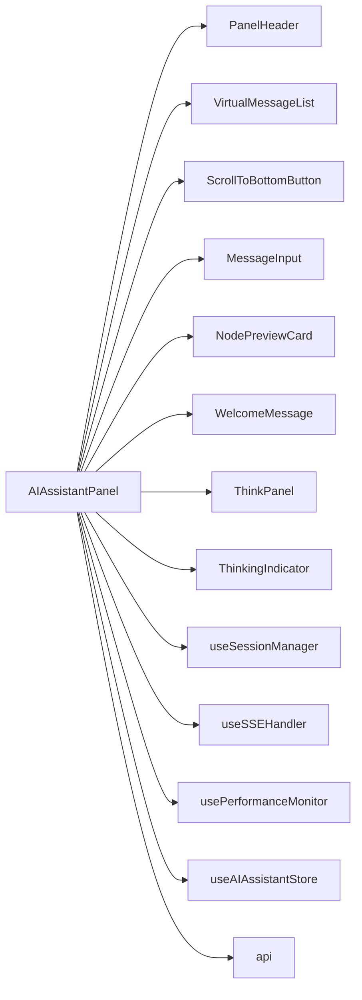

**图表来源**
- [AIAssistantPanel.tsx:19-25](file://frontend/src/components/canvas/AIAssistantPanel.tsx#L19-L25)
- [useAIAssistantStore.ts:104-200](file://frontend/src/store/useAIAssistantStore.ts#L104-L200)
- [api.ts:1-84](file://frontend/src/lib/api.ts#L1-L84)

**章节来源**
- [AIAssistantPanel.tsx:19-25](file://frontend/src/components/canvas/AIAssistantPanel.tsx#L19-L25)
- [useAIAssistantStore.ts:104-200](file://frontend/src/store/useAIAssistantStore.ts#L104-L200)

## 性能考量
- 虚拟滚动：react-window + 动态行高 + overscan，减少DOM节点数量，提升长列表性能
- 自动滚动策略：仅在必要时滚动，避免频繁重排
- 动画与过渡：使用 Framer Motion 的轻量动画，配合 will-change 与 transform 优化
- 性能监控：Long Task/LCP/FID/CLS/FPS 多维度观测，便于定位瓶颈
- 网络层：统一鉴权与刷新队列，避免重复请求与401风暴

**章节来源**
- [VirtualMessageList.tsx:63-84](file://frontend/src/components/ai-assistant/VirtualMessageList.tsx#L63-L84)
- [VirtualMessageList.tsx:155-196](file://frontend/src/components/ai-assistant/VirtualMessageList.tsx#L155-L196)
- [usePerformanceMonitor.ts:75-200](file://frontend/src/components/ai-assistant/hooks/usePerformanceMonitor.ts#L75-L200)
- [api.ts:19-81](file://frontend/src/lib/api.ts#L19-L81)

## 故障排查指南
- 登录过期
  - 现象：401错误并弹出重新登录对话框
  - 处理：点击重新登录后跳转登录页
  - 相关：容器组件对401的分支处理与弹窗
- 请求失败
  - 现象：以消息形式提示错误
  - 处理：检查网络与后端服务状态
  - 相关：容器组件对HTTP错误的统一处理
- SSE异常
  - 现象：事件解析失败或事件类型未识别
  - 处理：查看事件日志与后端输出
  - 相关：SSE解析与事件分发
- 性能问题
  - 现象：滚动卡顿、动画掉帧
  - 处理：启用性能监控，定位Long Task与FPS下降点
  - 相关：性能监控Hook与虚拟滚动参数

**章节来源**
- [AIAssistantPanel.tsx:240-293](file://frontend/src/components/canvas/AIAssistantPanel.tsx#L240-L293)
- [useSSEHandler.ts:374-391](file://frontend/src/components/ai-assistant/hooks/useSSEHandler.ts#L374-L391)
- [usePerformanceMonitor.ts:75-200](file://frontend/src/components/ai-assistant/hooks/usePerformanceMonitor.ts#L75-L200)

## 结论
AI助手面板通过清晰的分层设计与完善的Hooks抽象，实现了高性能、可扩展、易维护的消息交互体验。其核心优势包括：
- 虚拟滚动与智能滚动策略保障长列表性能
- SSE事件驱动的流式交互与多智能体协作可视化
- 完整的会话与上下文管理，支持Agent切换与历史恢复
- 丰富的交互细节（拖拽、吸附、尺寸调整、回到最新、欢迎消息、附件预览）
- **更新** 新增的思考过程面板和思考指示器提供更直观的AI状态反馈
- **更新** 改进的UI标签国际化支持，提供更好的用户体验
- 全面的性能监控与错误处理机制

## 附录

### 响应式设计与主题适配
- 响应式：面板尺寸与位置通过状态管理与约束函数控制，适配不同屏幕尺寸
- 主题适配：使用Tailwind变量与组件级颜色类，结合上下文电池组件的颜色映射实现状态态样式

**章节来源**
- [AIAssistantPanel.tsx:113-129](file://frontend/src/components/canvas/AIAssistantPanel.tsx#L113-L129)
- [PanelHeader.tsx:94-133](file://frontend/src/components/ai-assistant/PanelHeader.tsx#L94-L133)

### 用户交互模式
- 面板交互：唤起按钮、拖拽移动、四边/四角尺寸调整、ESC最小化
- 消息交互：自动滚动、手动滚动检测、回到最新按钮、等待指示
- Agent交互：下拉选择、切换Agent、清空会话
- 附件交互：拖拽到面板、附件预览、移除与清除全部
- **更新** 思考交互：自动展开/折叠思考面板，实时显示思考状态

**章节来源**
- [AIAssistantPanel.tsx:135-151](file://frontend/src/components/canvas/AIAssistantPanel.tsx#L135-L151)
- [AIAssistantPanel.tsx:295-344](file://frontend/src/components/canvas/AIAssistantPanel.tsx#L295-L344)
- [MessageInput.tsx:109-177](file://frontend/src/components/ai-assistant/MessageInput.tsx#L109-L177)
- [NodePreviewCard.tsx:151-213](file://frontend/src/components/ai-assistant/NodePreviewCard.tsx#L151-L213)
- [ThinkPanel.tsx:74-86](file://frontend/src/components/ai-assistant/ThinkPanel.tsx#L74-L86)

### 面板状态管理
- 状态来源：useAIAssistantStore 提供消息、会话、面板尺寸/位置、上下文使用统计、虚拟滚动参数
- 持久化：localStorage 持久化关键状态，支持刷新后恢复
- 多剧场切换：支持按剧场ID切换会话并恢复消息与上下文

**章节来源**
- [useAIAssistantStore.ts:104-381](file://frontend/src/store/useAIAssistantStore.ts#L104-L381)
- [useSessionManager.ts:235-277](file://frontend/src/components/ai-assistant/hooks/useSessionManager.ts#L235-L277)

### 集成指南
- 引入容器组件：在画布页面中引入 AIAssistantPanel 并挂载
- 配置会话：确保已登录并正确初始化会话
- 自定义Agent：通过 useSessionManager 的 Agent接口扩展
- 样式定制：通过Tailwind类名与CSS变量覆盖组件样式
- 性能优化：合理设置虚拟滚动的 overscan 与 scrollBehavior

**章节来源**
- [AIAssistantPanel.tsx:51-613](file://frontend/src/components/canvas/AIAssistantPanel.tsx#L51-L613)
- [useSessionManager.ts:36-50](file://frontend/src/components/ai-assistant/hooks/useSessionManager.ts#L36-L50)
- [useAIAssistantStore.ts:143-199](file://frontend/src/store/useAIAssistantStore.ts#L143-L199)

### 样式定制选项
- 颜色体系：使用 --color-* 变量与组件内颜色类
- 动画与过渡：通过 Framer Motion 的配置项调整
- 尺寸与间距：通过 Tailwind 尺寸类与组件内样式类组合
- **更新** 渐变背景：ThinkPanel 使用渐变背景增强视觉效果

**章节来源**
- [PanelHeader.tsx:94-133](file://frontend/src/components/ai-assistant/PanelHeader.tsx#L94-L133)
- [ScrollToBottomButton.tsx:35-54](file://frontend/src/components/ai-assistant/ScrollToBottomButton.tsx#L35-L54)
- [ThinkPanel.tsx:32-38](file://frontend/src/components/ai-assistant/ThinkPanel.tsx#L32-L38)

### 性能优化建议
- 虚拟滚动参数：根据消息密度调整 overscan 与默认行高
- 动画优化：避免在滚动过程中触发布局抖动，使用 transform 与 will-change
- 网络优化：合并请求、节流发送、利用后端SSE流减少轮询
- 监控与告警：开启 Long Task 与 FPS 监控，及时发现并修复性能瓶颈

**章节来源**
- [VirtualMessageList.tsx:63-84](file://frontend/src/components/ai-assistant/VirtualMessageList.tsx#L63-L84)
- [usePerformanceMonitor.ts:75-200](file://frontend/src/components/ai-assistant/hooks/usePerformanceMonitor.ts#L75-L200)