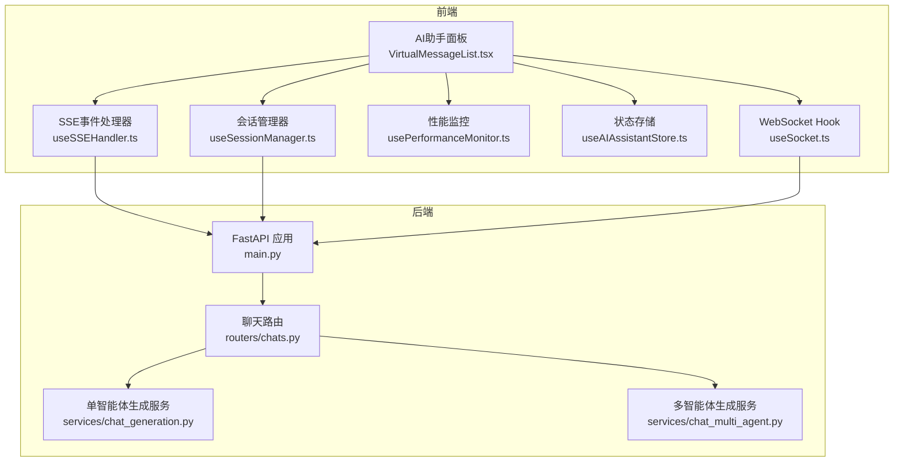
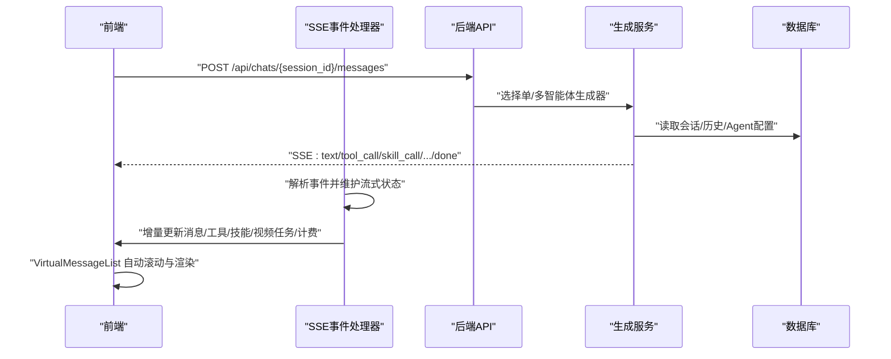
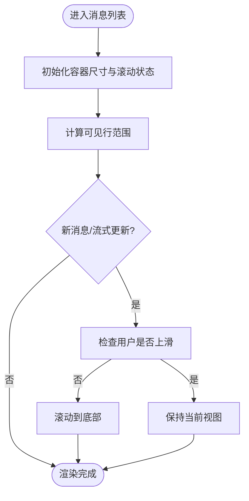
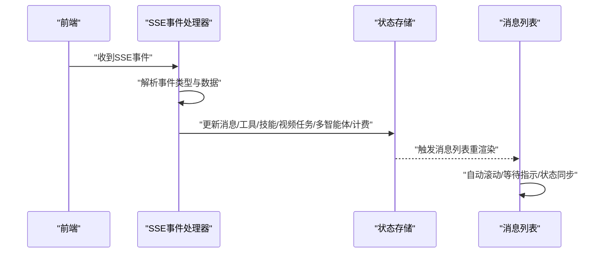
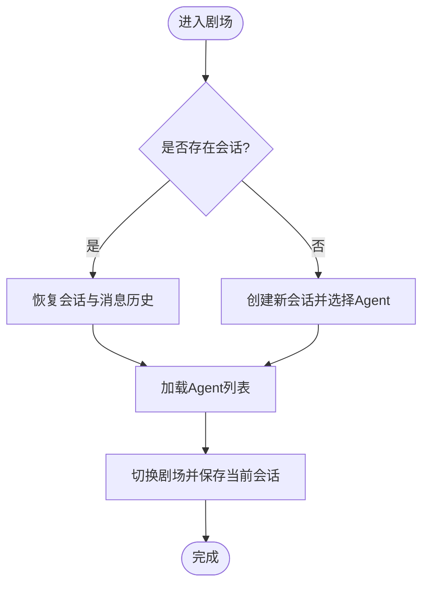
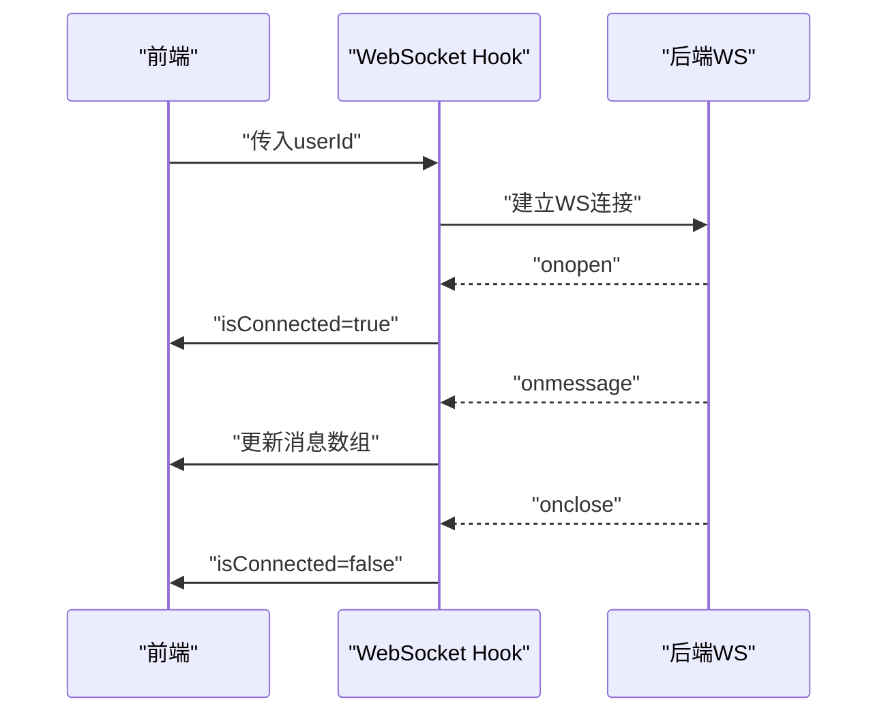
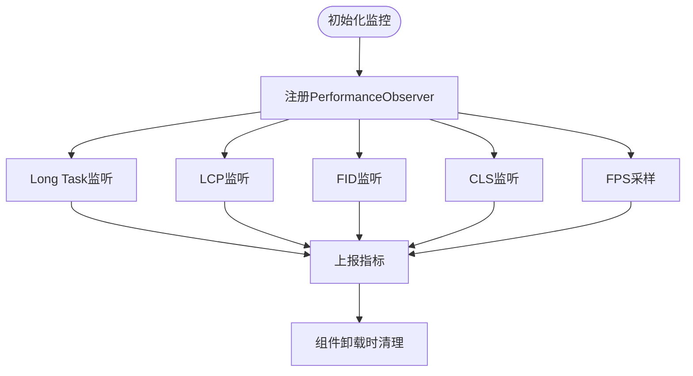
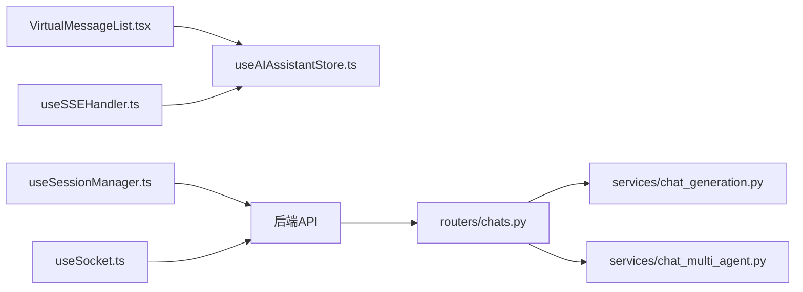

# 实时通信

<cite>
**本文引用的文件**
- [VirtualMessageList.tsx](file://frontend/src/components/ai-assistant/VirtualMessageList.tsx)
- [useSSEHandler.ts](file://frontend/src/components/ai-assistant/hooks/useSSEHandler.ts)
- [useSessionManager.ts](file://frontend/src/components/ai-assistant/hooks/useSessionManager.ts)
- [useSocket.ts](file://frontend/src/hooks/useSocket.ts)
- [usePerformanceMonitor.ts](file://frontend/src/components/ai-assistant/hooks/usePerformanceMonitor.ts)
- [useAIAssistantStore.ts](file://frontend/src/store/useAIAssistantStore.ts)
- [main.py](file://backend/main.py)
- [chats.py](file://backend/routers/chats.py)
- [chat_generation.py](file://backend/services/chat_generation.py)
- [chat_multi_agent.py](file://backend/services/chat_multi_agent.py)
- [README.md](file://README.md)
</cite>

## 目录
1. [简介](#简介)
2. [项目结构](#项目结构)
3. [核心组件](#核心组件)
4. [架构总览](#架构总览)
5. [详细组件分析](#详细组件分析)
6. [依赖分析](#依赖分析)
7. [性能考量](#性能考量)
8. [故障排除指南](#故障排除指南)
9. [结论](#结论)
10. [附录](#附录)

## 简介
本文件面向“AI助手实时通信系统”，聚焦以下目标：
- 虚拟消息列表的实现原理：消息虚拟化渲染、滚动性能优化、内存管理策略
- SSE事件处理器：事件解析、增量更新、状态同步与错误恢复
- 会话管理器：会话生命周期、上下文使用统计恢复、多剧场切换
- WebSocket连接处理：基础连接、消息收发与断开处理
- 实时消息接收、断线重连与错误恢复
- 消息队列管理、并发控制与状态同步机制
- 调试工具、性能监控与故障排除指南

## 项目结构
系统采用前后端分离架构，前端使用 Next.js + Zustand 状态管理，后端使用 FastAPI + SQLAlchemy。实时通信层同时支持 WebSocket 与 Server-Sent Events（SSE）两种方式，分别用于不同场景的消息推送与状态同步。

图表来源
- [main.py:161-171](file://backend/main.py#L161-L171)
- [chats.py:127-183](file://backend/routers/chats.py#L127-L183)
- [chat_generation.py:29-449](file://backend/services/chat_generation.py#L29-L449)
- [chat_multi_agent.py:22-190](file://backend/services/chat_multi_agent.py#L22-L190)
- [VirtualMessageList.tsx:1-293](file://frontend/src/components/ai-assistant/VirtualMessageList.tsx#L1-L293)
- [useSSEHandler.ts:1-391](file://frontend/src/components/ai-assistant/hooks/useSSEHandler.ts#L1-L391)
- [useSessionManager.ts:1-226](file://frontend/src/components/ai-assistant/hooks/useSessionManager.ts#L1-L226)
- [useSocket.ts:1-43](file://frontend/src/hooks/useSocket.ts#L1-L43)
- [usePerformanceMonitor.ts:1-236](file://frontend/src/components/ai-assistant/hooks/usePerformanceMonitor.ts#L1-L236)
- [useAIAssistantStore.ts:1-381](file://frontend/src/store/useAIAssistantStore.ts#L1-L381)

章节来源
- [README.md:112-114](file://README.md#L112-L114)
- [main.py:161-171](file://backend/main.py#L161-L171)
- [chats.py:127-183](file://backend/routers/chats.py#L127-L183)

## 核心组件
- 虚拟消息列表：基于 react-window 的虚拟滚动，结合动态行高与 overscan 控制，实现高性能消息渲染与自动滚动行为。
- SSE事件处理器：解析后端SSE事件，维护流式状态，增量更新消息、工具/技能调用、视频任务、多智能体步骤与计费信息。
- 会话管理器：负责会话创建/恢复、Agent切换、消息清空、上下文使用统计恢复与剧场切换。
- WebSocket Hook：基础WS连接、消息收发与断开处理。
- 性能监控：Long Task、LCP、FID、CLS与FPS采集与上报。
- 状态存储：Zustand + localStorage持久化，支持多剧场会话缓存与滚动设置。

章节来源
- [VirtualMessageList.tsx:1-293](file://frontend/src/components/ai-assistant/VirtualMessageList.tsx#L1-L293)
- [useSSEHandler.ts:1-391](file://frontend/src/components/ai-assistant/hooks/useSSEHandler.ts#L1-L391)
- [useSessionManager.ts:1-226](file://frontend/src/components/ai-assistant/hooks/useSessionManager.ts#L1-L226)
- [useSocket.ts:1-43](file://frontend/src/hooks/useSocket.ts#L1-L43)
- [usePerformanceMonitor.ts:1-236](file://frontend/src/components/ai-assistant/hooks/usePerformanceMonitor.ts#L1-L236)
- [useAIAssistantStore.ts:1-381](file://frontend/src/store/useAIAssistantStore.ts#L1-L381)

## 架构总览
后端通过 FastAPI 提供 API 与 WebSocket 接口；聊天请求进入 /api/chats/{session_id}/messages，根据智能体类型选择单智能体或多智能体生成器，返回 SSE 流。前端通过 useSSEHandler 解析事件，增量更新消息与UI状态；通过 useSessionManager 管理会话与剧场切换；通过 VirtualMessageList 实现高性能消息渲染与滚动控制；通过 useSocket 进行基础WS通信；通过 usePerformanceMonitor 进行性能监控。

图表来源
- [chats.py:127-183](file://backend/routers/chats.py#L127-L183)
- [chat_generation.py:29-449](file://backend/services/chat_generation.py#L29-L449)
- [chat_multi_agent.py:22-190](file://backend/services/chat_multi_agent.py#L22-L190)
- [useSSEHandler.ts:67-383](file://frontend/src/components/ai-assistant/hooks/useSSEHandler.ts#L67-L383)
- [VirtualMessageList.tsx:155-196](file://frontend/src/components/ai-assistant/VirtualMessageList.tsx#L155-L196)

章节来源
- [chats.py:127-183](file://backend/routers/chats.py#L127-L183)
- [chat_generation.py:29-449](file://backend/services/chat_generation.py#L29-L449)
- [chat_multi_agent.py:22-190](file://backend/services/chat_multi_agent.py#L22-L190)
- [useSSEHandler.ts:1-391](file://frontend/src/components/ai-assistant/hooks/useSSEHandler.ts#L1-L391)
- [VirtualMessageList.tsx:1-293](file://frontend/src/components/ai-assistant/VirtualMessageList.tsx#L1-L293)

## 详细组件分析

### 虚拟消息列表（VirtualMessageList）
- 虚拟化渲染：使用 react-window List，按需渲染可见区域，减少DOM节点数量，提升长列表性能。
- 动态行高：useDynamicRowHeight 缓存行高，避免消息数量变化导致的重置与抖动。
- 滚动策略：支持平滑与瞬时滚动；自动滚动到底部；检测用户手动上滑，避免打断用户阅读。
- overscan：通过 overscan 控制可见区域外的预渲染数量，平衡首屏速度与滚动流畅度。
- 等待指示：当AI回复中且用户未上滑时，自动滚动到流式末尾；在消息末尾插入“打字”指示。
- 内存管理：通过虚拟化与动态行高缓存，避免一次性渲染大量消息造成的内存峰值。

图表来源
- [VirtualMessageList.tsx:155-196](file://frontend/src/components/ai-assistant/VirtualMessageList.tsx#L155-L196)
- [VirtualMessageList.tsx:117-141](file://frontend/src/components/ai-assistant/VirtualMessageList.tsx#L117-L141)

章节来源
- [VirtualMessageList.tsx:1-293](file://frontend/src/components/ai-assistant/VirtualMessageList.tsx#L1-L293)

### SSE事件处理器（useSSEHandler）
- 事件解析：逐行解析 event/data，识别事件类型与数据负载。
- 流式状态：维护 skillCalls/toolCalls/videoTasks/steps/multiAgent/assistantMsg/roundHasTools 等状态，保证事件顺序与一致性。
- 增量更新：
  - text：追加到当前AI消息或新建消息，支持轮次切换与状态切换。
  - skill_call/skill_loaded：维护技能调用列表与状态。
  - tool_call/tool_result：维护工具调用列表与状态。
  - video_task_created：收集视频任务并注入到AI消息。
  - subtask_created/started/completed/failed：多智能体步骤状态变更。
  - task_completed：汇总最终结果、令牌统计与积分消耗，支持多智能体统计。
  - billing：实时更新上下文使用与积分余额，处理不足与冻结提示。
  - canvas_updated/context_compacted/done/error：画布同步、上下文压缩与完成/错误事件。
- 状态同步：通过 store 更新消息、上下文使用与计费信息，确保UI与后端状态一致。
- 错误恢复：遇到 error 事件时，追加错误消息并重置流式状态。

图表来源
- [useSSEHandler.ts:67-383](file://frontend/src/components/ai-assistant/hooks/useSSEHandler.ts#L67-L383)
- [useAIAssistantStore.ts:144-200](file://frontend/src/store/useAIAssistantStore.ts#L144-L200)

章节来源
- [useSSEHandler.ts:1-391](file://frontend/src/components/ai-assistant/hooks/useSSEHandler.ts#L1-L391)
- [useAIAssistantStore.ts:1-381](file://frontend/src/store/useAIAssistantStore.ts#L1-L381)

### 会话管理器（useSessionManager）
- Agent加载：首次进入剧场时拉取可用Agent列表，用于后续切换。
- 会话创建/恢复：
  - 若存在历史会话，优先复用并恢复消息历史与上下文使用统计。
  - 若不存在历史会话，选择合适的Agent创建新会话。
- 剧场切换：切换剧场时保存当前剧场会话，加载目标剧场会话或初始化默认消息。
- 上下文使用统计恢复：从后端会话信息恢复累计token使用与上下文窗口，避免重复计算。
- 清空会话：删除消息记录并保留会话，用于“清空对话”场景。

图表来源
- [useSessionManager.ts:52-123](file://frontend/src/components/ai-assistant/hooks/useSessionManager.ts#L52-L123)
- [useSessionManager.ts:191-212](file://frontend/src/components/ai-assistant/hooks/useSessionManager.ts#L191-L212)

章节来源
- [useSessionManager.ts:1-226](file://frontend/src/components/ai-assistant/hooks/useSessionManager.ts#L1-L226)

### WebSocket连接处理（useSocket）
- 连接建立：根据 userId 建立 WebSocket 连接，监听 open/message/close。
- 消息收发：收到消息时追加到本地消息数组；发送消息时检查连接状态。
- 断开处理：关闭时重置连接状态，便于后续重连或降级处理。

图表来源
- [useSocket.ts:8-33](file://frontend/src/hooks/useSocket.ts#L8-L33)

章节来源
- [useSocket.ts:1-43](file://frontend/src/hooks/useSocket.ts#L1-L43)

### 性能监控（usePerformanceMonitor）
- Long Task：检测超过阈值的任务，记录持续时间与归因，便于定位卡顿原因。
- LCP/FID/CLS：采集最大内容绘制、首次输入延迟与布局偏移，评估用户体验。
- FPS：每秒采样帧率，保留最近样本，便于观察渲染性能波动。
- 上报与清理：提供上报接口与清理钩子，避免内存泄漏。

图表来源
- [usePerformanceMonitor.ts:75-200](file://frontend/src/components/ai-assistant/hooks/usePerformanceMonitor.ts#L75-L200)

章节来源
- [usePerformanceMonitor.ts:1-236](file://frontend/src/components/ai-assistant/hooks/usePerformanceMonitor.ts#L1-L236)

## 依赖分析
- 前端依赖
  - VirtualMessageList 依赖 react-window 与 framer-motion，结合 Zustand 状态存储实现高性能渲染与动画。
  - useSSEHandler 依赖 Zustand 与外部画布存储，负责事件解析与状态更新。
  - useSessionManager 依赖 API 层与 Zustand，负责会话生命周期管理。
  - useSocket 依赖浏览器原生 WebSocket。
  - usePerformanceMonitor 依赖浏览器 Performance API。
- 后端依赖
  - FastAPI 提供路由与WS端点；聊天路由根据智能体类型选择生成器；生成器通过工具管理、计费与上下文压缩服务实现SSE事件流。

图表来源
- [VirtualMessageList.tsx:1-293](file://frontend/src/components/ai-assistant/VirtualMessageList.tsx#L1-L293)
- [useSSEHandler.ts:1-391](file://frontend/src/components/ai-assistant/hooks/useSSEHandler.ts#L1-L391)
- [useSessionManager.ts:1-226](file://frontend/src/components/ai-assistant/hooks/useSessionManager.ts#L1-L226)
- [useSocket.ts:1-43](file://frontend/src/hooks/useSocket.ts#L1-L43)
- [useAIAssistantStore.ts:1-381](file://frontend/src/store/useAIAssistantStore.ts#L1-L381)
- [chats.py:127-183](file://backend/routers/chats.py#L127-L183)
- [chat_generation.py:29-449](file://backend/services/chat_generation.py#L29-L449)
- [chat_multi_agent.py:22-190](file://backend/services/chat_multi_agent.py#L22-L190)

章节来源
- [useAIAssistantStore.ts:1-381](file://frontend/src/store/useAIAssistantStore.ts#L1-L381)
- [chats.py:127-183](file://backend/routers/chats.py#L127-L183)

## 性能考量
- 虚拟滚动：react-window 的虚拟化与 overscan 控制，显著降低DOM节点数量与重排成本。
- 动态行高缓存：避免消息数量变化导致的行高重算与滚动抖动。
- 自动滚动策略：仅在用户未上滑时自动滚动，兼顾交互体验与性能。
- SSE事件增量更新：仅更新受影响的消息片段，减少不必要的重渲染。
- 性能监控：通过 Long Task、LCP、FID、CLS、FPS综合评估，定位性能瓶颈。
- WebSocket：轻量级连接，适合低频消息推送；高并发场景建议配合SSE或限流策略。

## 故障排除指南
- SSE事件未到达
  - 检查后端SSE生成器是否正常返回事件；确认网络与CORS配置。
  - 前端事件解析：确认事件行格式正确，event/data字段存在。
- 消息未自动滚动
  - 检查用户是否手动上滑；确认滚动行为设置与消息长度。
  - 确认 VirtualMessageList 的滚动回调与状态同步。
- 会话恢复异常
  - 检查后端会话查询与消息历史反序列化；确认剧场ID与Agent上下文。
  - 确认 Zustand 持久化存储键名与版本兼容性。
- WebSocket断开
  - 检查连接URL与后端WS端点；确认浏览器安全策略与跨域。
  - 在断开后重试或降级为SSE。
- 性能问题
  - 使用性能监控工具定位Long Task与FPS下降；优化事件频率与渲染粒度。
  - 调整 overscan 与滚动行为，平衡首屏速度与滚动流畅度。

章节来源
- [useSSEHandler.ts:1-391](file://frontend/src/components/ai-assistant/hooks/useSSEHandler.ts#L1-L391)
- [VirtualMessageList.tsx:1-293](file://frontend/src/components/ai-assistant/VirtualMessageList.tsx#L1-L293)
- [useSessionManager.ts:1-226](file://frontend/src/components/ai-assistant/hooks/useSessionManager.ts#L1-L226)
- [useSocket.ts:1-43](file://frontend/src/hooks/useSocket.ts#L1-L43)
- [usePerformanceMonitor.ts:1-236](file://frontend/src/components/ai-assistant/hooks/usePerformanceMonitor.ts#L1-L236)

## 结论
本系统通过虚拟消息列表、SSE事件处理器、会话管理器与WebSocket连接的协同，实现了高性能、低延迟的实时通信体验。SSE用于流式文本与多模态状态增量更新，WebSocket用于基础消息推送，VirtualMessageList保障长列表渲染性能，会话管理器与状态存储确保跨剧场与跨会话的状态一致性。配合性能监控与故障排除指南，可有效保障系统在高并发与复杂任务场景下的稳定性与可维护性。

## 附录
- 实时通信技术栈：WebSocket + Server-Sent Events
- 状态管理：Zustand + localStorage 持久化
- 性能监控：PerformanceObserver + FPS采样