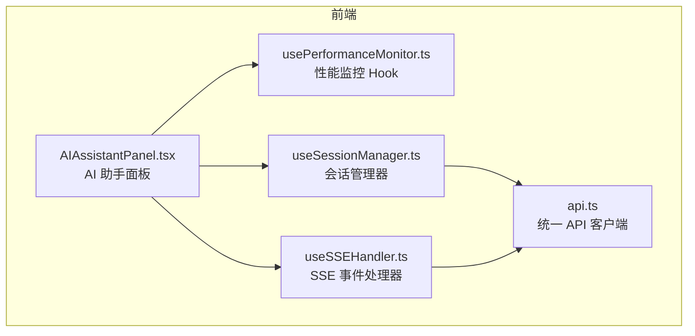
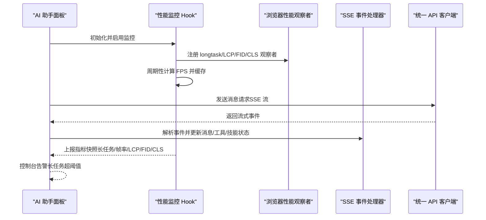
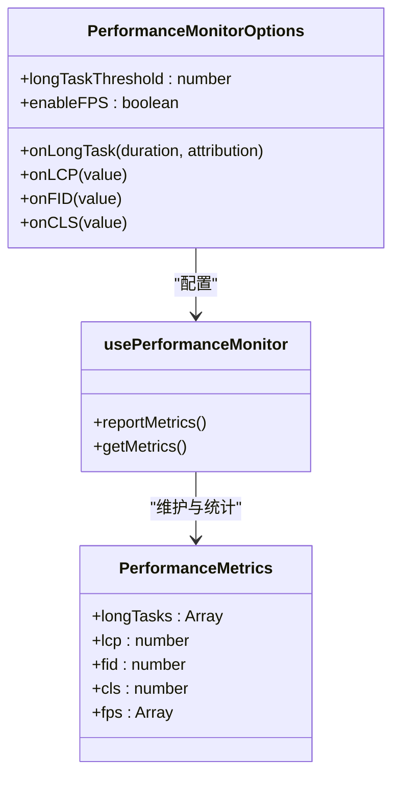
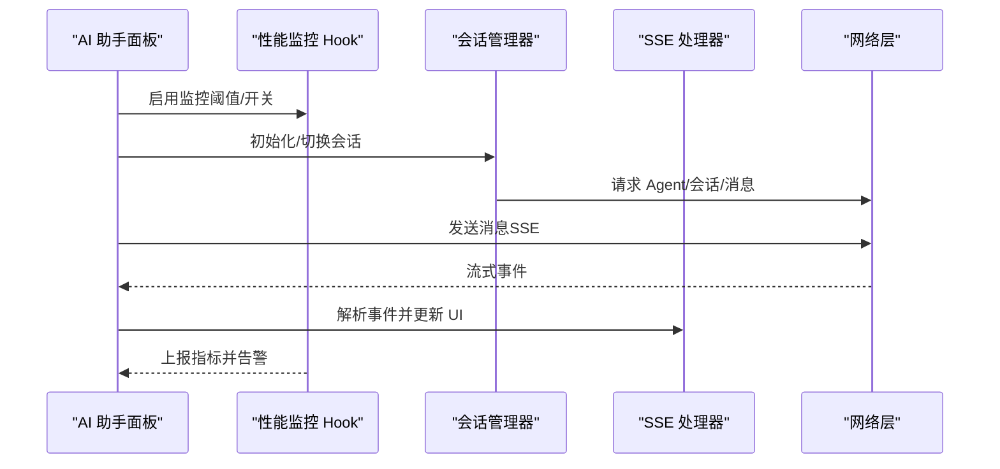
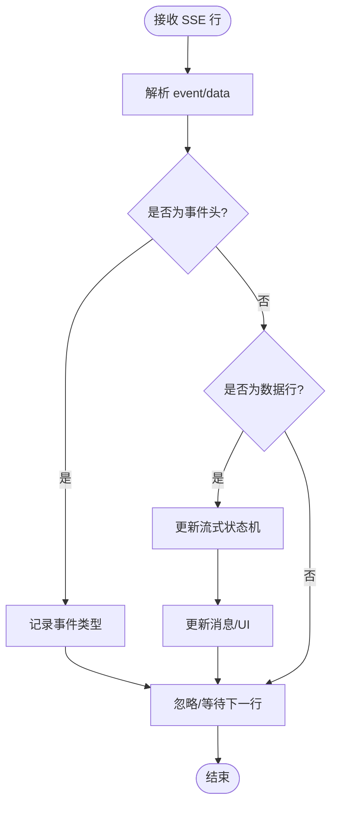
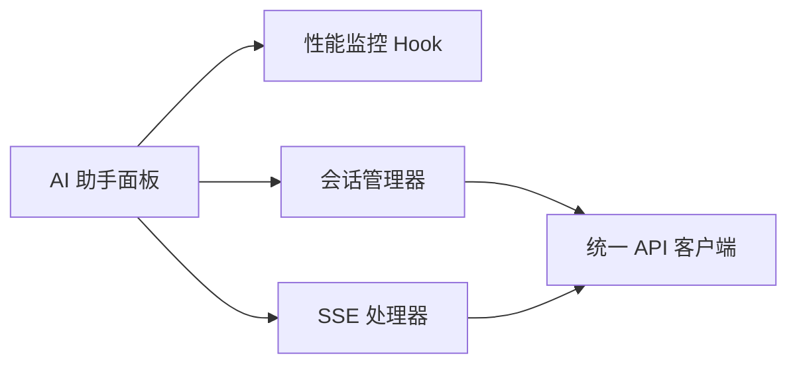

# 性能监控

<cite>
**本文档引用的文件**
- [usePerformanceMonitor.ts](file://frontend/src/components/ai-assistant/hooks/usePerformanceMonitor.ts)
- [AIAssistantPanel.tsx](file://frontend/src/components/canvas/AIAssistantPanel.tsx)
- [useSSEHandler.ts](file://frontend/src/components/ai-assistant/hooks/useSSEHandler.ts)
- [useSessionManager.ts](file://frontend/src/components/ai-assistant/hooks/useSessionManager.ts)
- [api.ts](file://frontend/src/lib/api.ts)
</cite>

## 目录
1. [简介](#简介)
2. [项目结构](#项目结构)
3. [核心组件](#核心组件)
4. [架构总览](#架构总览)
5. [详细组件分析](#详细组件分析)
6. [依赖关系分析](#依赖关系分析)
7. [性能考虑](#性能考虑)
8. [故障排查指南](#故障排查指南)
9. [结论](#结论)
10. [附录](#附录)

## 简介
本文件面向“AI助手性能监控系统”，聚焦前端侧的性能监控钩子实现，涵盖以下能力：
- 内存使用监控：通过长任务观察与帧率采样，间接反映主线程阻塞与渲染压力。
- 渲染性能分析：基于浏览器性能 API（LCP/FID/CLS），结合自定义 FPS 采样，评估关键渲染指标。
- 网络请求跟踪：通过统一的 API 层拦截与 SSE 事件解析，记录请求生命周期与流式事件时序。
- 性能指标采集：聚合长任务、LCP、FID、CLS、FPS 等指标，形成可上报的数据结构。
- 异常检测与告警：对长任务超阈值进行告警，并在控制台输出日志。
- 性能报告生成：提供指标快照与统计方法，便于生成报告与趋势分析。
- 配置项与优化建议：阈值设定、启用开关、可视化与历史趋势分析指引。

## 项目结构
本项目的性能监控主要集中在前端组件与自定义 Hook 中，围绕 AI 助手面板展开，同时配合 SSE 事件处理器与会话管理器，形成完整的性能观测闭环。

**图表来源**
- [AIAssistantPanel.tsx:153-161](file://frontend/src/components/canvas/AIAssistantPanel.tsx#L153-L161)
- [usePerformanceMonitor.ts:31-206](file://frontend/src/components/ai-assistant/hooks/usePerformanceMonitor.ts#L31-L206)
- [useSSEHandler.ts:25-391](file://frontend/src/components/ai-assistant/hooks/useSSEHandler.ts#L25-L391)
- [useSessionManager.ts:12-226](file://frontend/src/components/ai-assistant/hooks/useSessionManager.ts#L12-L226)
- [api.ts:1-84](file://frontend/src/lib/api.ts#L1-L84)

**章节来源**
- [AIAssistantPanel.tsx:1-613](file://frontend/src/components/canvas/AIAssistantPanel.tsx#L1-L613)
- [usePerformanceMonitor.ts:1-236](file://frontend/src/components/ai-assistant/hooks/usePerformanceMonitor.ts#L1-L236)
- [useSSEHandler.ts:1-391](file://frontend/src/components/ai-assistant/hooks/useSSEHandler.ts#L1-L391)
- [useSessionManager.ts:1-226](file://frontend/src/components/ai-assistant/hooks/useSessionManager.ts#L1-L226)
- [api.ts:1-84](file://frontend/src/lib/api.ts#L1-L84)

## 核心组件
- 性能监控 Hook（usePerformanceMonitor）
  - 监听长任务（longtask）、LCP、FID、CLS。
  - 自定义 FPS 采样，按秒统计并限制样本数量。
  - 提供指标快照与统计方法，支持回调式告警。
- AI 助手面板（AIAssistantPanel）
  - 在面板中启用性能监控，设置长任务阈值与 FPS 开关。
  - 通过会话管理器与 SSE 处理器驱动消息流式渲染。
- SSE 事件处理器（useSSEHandler）
  - 解析服务端事件，维护流式状态机，更新消息与工具/技能调用进度。
  - 记录令牌用量、计费状态与上下文使用情况。
- 会话管理器（useSessionManager）
  - 负责 Agent 列表加载、会话创建/切换、消息历史加载与上下文使用统计恢复。
- 统一 API 客户端（api.ts）
  - 注入认证头、处理 401 刷新、请求排队与重试，保障网络层稳定性。

**章节来源**
- [usePerformanceMonitor.ts:31-206](file://frontend/src/components/ai-assistant/hooks/usePerformanceMonitor.ts#L31-L206)
- [AIAssistantPanel.tsx:153-161](file://frontend/src/components/canvas/AIAssistantPanel.tsx#L153-L161)
- [useSSEHandler.ts:25-391](file://frontend/src/components/ai-assistant/hooks/useSSEHandler.ts#L25-L391)
- [useSessionManager.ts:12-226](file://frontend/src/components/ai-assistant/hooks/useSessionManager.ts#L12-L226)
- [api.ts:1-84](file://frontend/src/lib/api.ts#L1-L84)

## 架构总览
性能监控贯穿“UI 渲染—事件处理—网络请求—指标聚合—告警上报”的链路，形成闭环观测。

**图表来源**
- [AIAssistantPanel.tsx:153-161](file://frontend/src/components/canvas/AIAssistantPanel.tsx#L153-L161)
- [usePerformanceMonitor.ts:75-200](file://frontend/src/components/ai-assistant/hooks/usePerformanceMonitor.ts#L75-L200)
- [useSSEHandler.ts:67-383](file://frontend/src/components/ai-assistant/hooks/useSSEHandler.ts#L67-L383)
- [api.ts:31-81](file://frontend/src/lib/api.ts#L31-L81)

## 详细组件分析

### 组件 A：性能监控 Hook（usePerformanceMonitor）
- 数据结构
  - 长任务数组：包含持续时间、起始时间与归因信息。
  - 关键渲染指标：LCP（最大内容绘制）、FID（首次输入延迟）、CLS（累积布局偏移）。
  - FPS 数组：按秒采样，限制长度以控制内存占用。
- 监控逻辑
  - 注册 PerformanceObserver 监听 longtask/LCP/first-input/layout-shift。
  - 使用 requestAnimationFrame 周期性采样 FPS，每秒计算一次并保留最近 N 个样本。
  - 提供指标快照函数，计算平均 FPS、最长长任务时长等统计量。
- 告警机制
  - 当长任务持续时间超过阈值（默认 200ms）时触发回调并在控制台输出警告。
- 复杂度与性能
  - FPS 采样为 O(1) 每帧，统计为 O(n) 每秒（n 为样本数）。
  - 观察者注册与回调在主线程执行，需避免在回调中做重工作。

**图表来源**
- [usePerformanceMonitor.ts:5-29](file://frontend/src/components/ai-assistant/hooks/usePerformanceMonitor.ts#L5-L29)
- [usePerformanceMonitor.ts:31-206](file://frontend/src/components/ai-assistant/hooks/usePerformanceMonitor.ts#L31-L206)

**章节来源**
- [usePerformanceMonitor.ts:1-236](file://frontend/src/components/ai-assistant/hooks/usePerformanceMonitor.ts#L1-L236)

### 组件 B：AI 助手面板（AIAssistantPanel）
- 集成性能监控
  - 在面板中启用性能监控，设置长任务阈值与 FPS 开关。
  - 通过回调在控制台输出长任务告警。
- 渲染与交互
  - 使用虚拟列表与滚动控制，减少 DOM 节点数量。
  - 支持拖拽、调整大小、吸附动画，注意避免在拖拽过程中产生长任务。
- 网络与事件
  - 通过会话管理器与 SSE 处理器驱动消息流式渲染，配合性能监控观察渲染卡顿。

**图表来源**
- [AIAssistantPanel.tsx:153-161](file://frontend/src/components/canvas/AIAssistantPanel.tsx#L153-L161)
- [useSessionManager.ts:52-123](file://frontend/src/components/ai-assistant/hooks/useSessionManager.ts#L52-L123)
- [useSSEHandler.ts:67-383](file://frontend/src/components/ai-assistant/hooks/useSSEHandler.ts#L67-L383)
- [api.ts:31-81](file://frontend/src/lib/api.ts#L31-L81)

**章节来源**
- [AIAssistantPanel.tsx:153-161](file://frontend/src/components/canvas/AIAssistantPanel.tsx#L153-L161)

### 组件 C：SSE 事件处理器（useSSEHandler）
- 事件解析
  - 解析 event/data 行，维护流式状态机（技能调用、工具调用、视频任务、多智能体步骤等）。
- 状态更新
  - 动态更新消息内容、工具/技能状态、视频任务列表、多智能体协作状态。
  - 在任务完成时更新上下文使用统计与计费信息。
- 性能影响
  - 事件处理在主线程执行，应避免在回调中做重工作；可通过节流/去抖优化批量更新。

**图表来源**
- [useSSEHandler.ts:56-65](file://frontend/src/components/ai-assistant/hooks/useSSEHandler.ts#L56-L65)
- [useSSEHandler.ts:67-383](file://frontend/src/components/ai-assistant/hooks/useSSEHandler.ts#L67-L383)

**章节来源**
- [useSSEHandler.ts:1-391](file://frontend/src/components/ai-assistant/hooks/useSSEHandler.ts#L1-L391)

### 组件 D：会话管理器（useSessionManager）
- Agent 列表加载与切换
  - 通过统一 API 客户端获取可用 Agent 并切换当前 Agent。
- 会话生命周期
  - 查找/创建会话，加载消息历史，恢复上下文使用统计。
- 与性能的关系
  - 会话初始化与消息加载可能触发长任务，建议在性能监控下观察并优化。

**章节来源**
- [useSessionManager.ts:12-226](file://frontend/src/components/ai-assistant/hooks/useSessionManager.ts#L12-L226)

### 组件 E：统一 API 客户端（api.ts）
- 认证与刷新
  - 自动注入 Bearer Token，处理 401 刷新，支持请求排队与重试。
- 网络稳定性
  - 通过拦截器保证请求一致性，降低因鉴权失败导致的重试风暴。

**章节来源**
- [api.ts:1-84](file://frontend/src/lib/api.ts#L1-L84)

## 依赖关系分析
- 组件耦合
  - AI 助手面板依赖性能监控 Hook 与会话管理器；会话管理器依赖统一 API 客户端；SSE 处理器与会话管理器共同驱动消息渲染。
- 外部依赖
  - 浏览器性能 API（PerformanceObserver、requestAnimationFrame）。
  - 浏览器网络 API（fetch/SSE）。
- 潜在循环依赖
  - 当前模块间为单向依赖，未发现循环导入。

**图表来源**
- [AIAssistantPanel.tsx:153-161](file://frontend/src/components/canvas/AIAssistantPanel.tsx#L153-L161)
- [usePerformanceMonitor.ts:31-206](file://frontend/src/components/ai-assistant/hooks/usePerformanceMonitor.ts#L31-L206)
- [useSessionManager.ts:12-226](file://frontend/src/components/ai-assistant/hooks/useSessionManager.ts#L12-L226)
- [useSSEHandler.ts:25-391](file://frontend/src/components/ai-assistant/hooks/useSSEHandler.ts#L25-L391)
- [api.ts:1-84](file://frontend/src/lib/api.ts#L1-L84)

**章节来源**
- [AIAssistantPanel.tsx:1-613](file://frontend/src/components/canvas/AIAssistantPanel.tsx#L1-L613)
- [usePerformanceMonitor.ts:1-236](file://frontend/src/components/ai-assistant/hooks/usePerformanceMonitor.ts#L1-L236)
- [useSessionManager.ts:1-226](file://frontend/src/components/ai-assistant/hooks/useSessionManager.ts#L1-L226)
- [useSSEHandler.ts:1-391](file://frontend/src/components/ai-assistant/hooks/useSSEHandler.ts#L1-L391)
- [api.ts:1-84](file://frontend/src/lib/api.ts#L1-L84)

## 性能考虑
- 长任务与渲染
  - 避免在事件回调中执行重计算；将耗时任务拆分到 WebWorker 或推迟到空闲时间。
  - 使用虚拟列表与懒加载，减少 DOM 节点数量。
- FPS 采样
  - FPS 采样为 O(1) 每帧，但过多 UI 更新仍可能导致掉帧；建议合并状态更新与节流渲染。
- LCP/FID/CLS
  - 优先优化关键资源加载与首屏内容；避免布局抖动；合理设置交互延迟目标。
- 网络层
  - 使用请求队列与重试策略，避免频繁 401 刷新；SSE 流式处理应避免阻塞主线程。
- 指标存储与上报
  - 限制样本数量与上报频率，避免额外性能开销；可采用滑动窗口与采样策略。

[本节为通用指导，无需列出具体文件来源]

## 故障排查指南
- 长任务告警频繁
  - 检查事件回调中的重计算与同步 IO；拆分任务或使用异步处理。
  - 观察 FPS 是否下降，确认是否存在渲染压力。
- LCP/CLS 异常
  - 检查关键资源加载与图片懒加载策略；避免动态插入大尺寸元素。
- FID 延迟高
  - 减少首屏交互绑定数量；延迟非关键交互初始化。
- SSE 事件堆积
  - 优化事件解析与批量更新；必要时引入节流/去抖。
- 401 刷新风暴
  - 检查拦截器逻辑与重试次数；确保只在必要时刷新。

**章节来源**
- [usePerformanceMonitor.ts:75-200](file://frontend/src/components/ai-assistant/hooks/usePerformanceMonitor.ts#L75-L200)
- [useSSEHandler.ts:67-383](file://frontend/src/components/ai-assistant/hooks/useSSEHandler.ts#L67-L383)
- [api.ts:31-81](file://frontend/src/lib/api.ts#L31-L81)

## 结论
本性能监控体系以 Hook 为核心，结合浏览器性能 API 与 SSE 事件处理，实现了对长任务、关键渲染指标与帧率的综合观测。通过阈值告警与指标快照，能够有效定位性能瓶颈并指导优化。建议在实际部署中结合业务场景调整阈值与采样策略，并配套可视化与历史趋势分析，持续提升用户体验。

[本节为总结性内容，无需列出具体文件来源]

## 附录

### 配置选项与参数说明
- 性能监控 Hook（usePerformanceMonitor）
  - onLongTask：长任务超阈值回调。
  - onLCP/onFID/onCLS：对应指标回调。
  - longTaskThreshold：长任务阈值（毫秒，默认 200）。
  - enableFPS：是否启用 FPS 采样。
  - reportMetrics/getMetrics：导出指标快照与当前指标副本。
- AI 助手面板
  - 在面板中启用性能监控，设置长任务阈值与 FPS 开关。
- SSE 事件处理器
  - 维护流式状态机，更新消息与工具/技能状态。
- 会话管理器
  - Agent 列表加载、会话创建/切换、消息历史加载与上下文使用统计恢复。
- 统一 API 客户端
  - 自动注入认证头、处理 401 刷新与请求排队。

**章节来源**
- [usePerformanceMonitor.ts:22-73](file://frontend/src/components/ai-assistant/hooks/usePerformanceMonitor.ts#L22-L73)
- [AIAssistantPanel.tsx:153-161](file://frontend/src/components/canvas/AIAssistantPanel.tsx#L153-L161)
- [useSSEHandler.ts:14-41](file://frontend/src/components/ai-assistant/hooks/useSSEHandler.ts#L14-L41)
- [useSessionManager.ts:12-31](file://frontend/src/components/ai-assistant/hooks/useSessionManager.ts#L12-L31)
- [api.ts:31-81](file://frontend/src/lib/api.ts#L31-L81)

### 性能数据可视化与历史趋势
- 建议方案
  - 将 reportMetrics 的结果写入本地存储或上报至监控平台，按时间序列保存。
  - 使用折线图展示 FPS、长任务数量与最长时长趋势。
  - 使用柱状图展示 LCP/FID/CLS 分布。
- 注意事项
  - 控制样本数量与上报频率，避免对性能造成额外负担。
  - 对异常值进行清洗与聚合，提高趋势可读性。

[本节为通用指导，无需列出具体文件来源]

### 性能基准测试与优化策略
- 基准测试
  - 在稳定环境下运行，记录平均 FPS、长任务占比与关键指标分布。
  - 对比不同阈值与开关组合下的表现，确定最优配置。
- 优化策略
  - 渲染层面：虚拟列表、懒加载、减少重排重绘。
  - 事件层面：拆分长任务、使用 requestIdleCallback 或 WebWorker。
  - 网络层面：请求合并、缓存策略、SSE 批量处理。
  - 指标层面：设置合理阈值，区分严重与轻微问题，避免噪声干扰。

[本节为通用指导，无需列出具体文件来源]