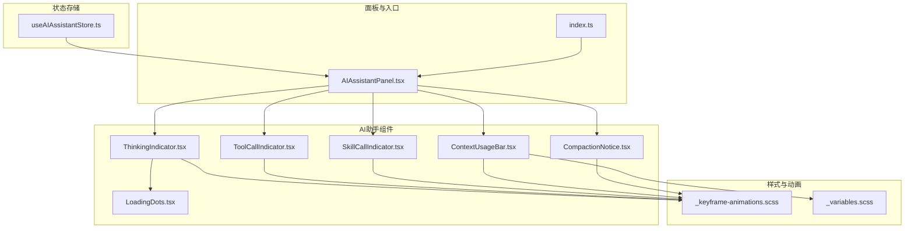
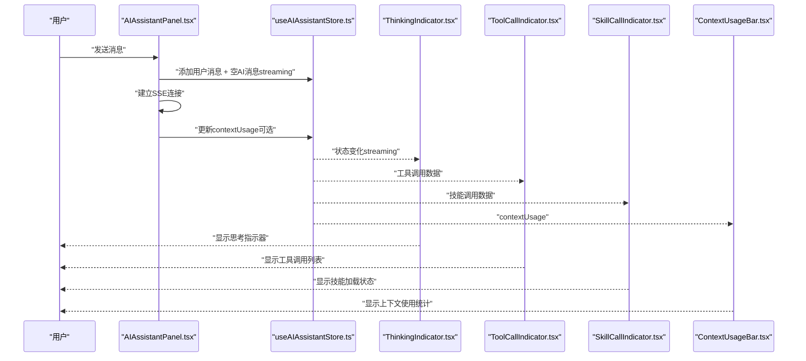
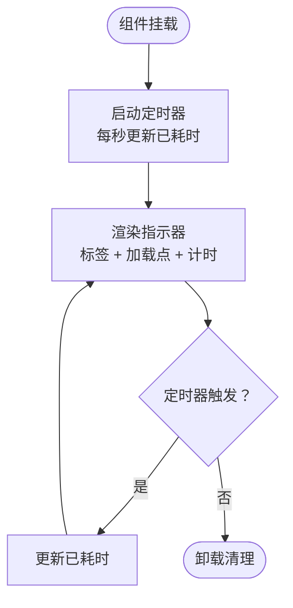
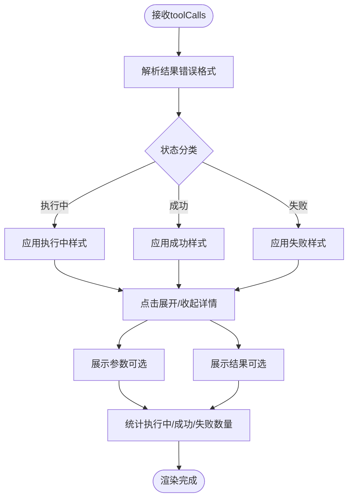
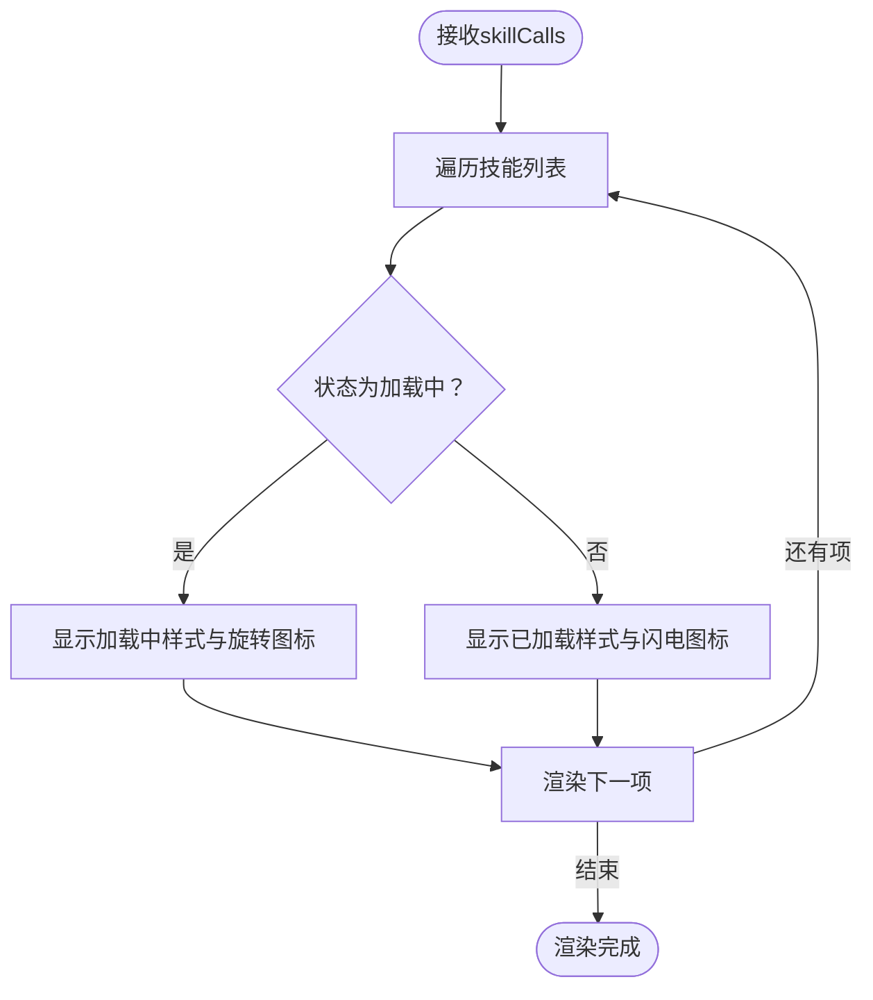
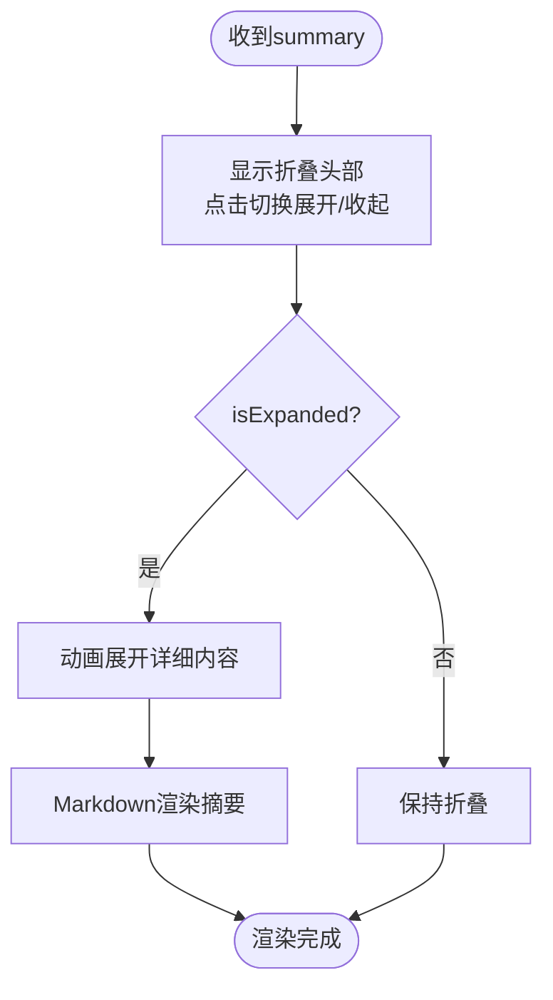
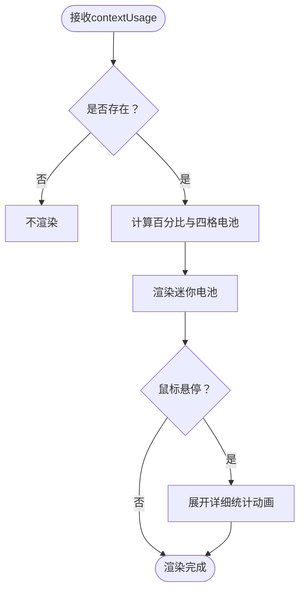

# 指示器显示

<cite>
**本文档引用的文件**
- [ThinkingIndicator.tsx](file://frontend/src/components/ai-assistant/ThinkingIndicator.tsx)
- [ToolCallIndicator.tsx](file://frontend/src/components/ai-assistant/ToolCallIndicator.tsx)
- [SkillCallIndicator.tsx](file://frontend/src/components/ai-assistant/SkillCallIndicator.tsx)
- [ContextUsageBar.tsx](file://frontend/src/components/ai-assistant/ContextUsageBar.tsx)
- [CompactionNotice.tsx](file://frontend/src/components/ai-assistant/CompactionNotice.tsx)
- [LoadingDots.tsx](file://frontend/src/components/ai-assistant/LoadingDots.tsx)
- [AIAssistantPanel.tsx](file://frontend/src/components/canvas/AIAssistantPanel.tsx)
- [useAIAssistantStore.ts](file://frontend/src/store/useAIAssistantStore.ts)
- [_keyframe-animations.scss](file://frontend/src/styles/_keyframe-animations.scss)
- [_variables.scss](file://frontend/src/styles/_variables.scss)
- [index.ts](file://frontend/src/components/ai-assistant/index.ts)
</cite>

## 目录
1. [简介](#简介)
2. [项目结构](#项目结构)
3. [核心组件](#核心组件)
4. [架构总览](#架构总览)
5. [详细组件分析](#详细组件分析)
6. [依赖关系分析](#依赖关系分析)
7. [性能考量](#性能考量)
8. [故障排查指南](#故障排查指南)
9. [结论](#结论)
10. [附录](#附录)

## 简介
本文件聚焦于AI助手指示器显示组件，系统性阐述以下能力：
- 思考指示器：展示AI“正在思考”的状态、计时与视觉反馈
- 工具调用指示器：展示工具执行过程、结果与错误，并支持展开查看参数与结果
- 技能调用指示器：展示技能加载状态（加载中/已加载）
- 压缩通知：上下文被压缩时的摘要提示与展开说明
- 上下文使用条：以迷你电池与进度条形式展示Token使用情况与剩余量
- 动画效果、状态同步与用户反馈机制
- 可见性控制、优先级排序与冲突处理
- 定制选项、样式主题与可访问性支持

## 项目结构
指示器组件位于前端项目的AI助手模块中，配合全局状态存储与动画样式共同工作。

**图表来源**
- [ThinkingIndicator.tsx:1-56](file://frontend/src/components/ai-assistant/ThinkingIndicator.tsx#L1-L56)
- [ToolCallIndicator.tsx:1-164](file://frontend/src/components/ai-assistant/ToolCallIndicator.tsx#L1-L164)
- [SkillCallIndicator.tsx:1-55](file://frontend/src/components/ai-assistant/SkillCallIndicator.tsx#L1-L55)
- [ContextUsageBar.tsx:1-141](file://frontend/src/components/ai-assistant/ContextUsageBar.tsx#L1-L141)
- [CompactionNotice.tsx:1-75](file://frontend/src/components/ai-assistant/CompactionNotice.tsx#L1-L75)
- [LoadingDots.tsx:1-50](file://frontend/src/components/ai-assistant/LoadingDots.tsx#L1-L50)
- [AIAssistantPanel.tsx:1-613](file://frontend/src/components/canvas/AIAssistantPanel.tsx#L1-L613)
- [useAIAssistantStore.ts:1-381](file://frontend/src/store/useAIAssistantStore.ts#L1-L381)
- [_keyframe-animations.scss:1-110](file://frontend/src/styles/_keyframe-animations.scss#L1-L110)
- [_variables.scss:1-297](file://frontend/src/styles/_variables.scss#L1-L297)
- [index.ts:1-38](file://frontend/src/components/ai-assistant/index.ts#L1-L38)

**章节来源**
- [ThinkingIndicator.tsx:1-56](file://frontend/src/components/ai-assistant/ThinkingIndicator.tsx#L1-L56)
- [ToolCallIndicator.tsx:1-164](file://frontend/src/components/ai-assistant/ToolCallIndicator.tsx#L1-L164)
- [SkillCallIndicator.tsx:1-55](file://frontend/src/components/ai-assistant/SkillCallIndicator.tsx#L1-L55)
- [ContextUsageBar.tsx:1-141](file://frontend/src/components/ai-assistant/ContextUsageBar.tsx#L1-L141)
- [CompactionNotice.tsx:1-75](file://frontend/src/components/ai-assistant/CompactionNotice.tsx#L1-L75)
- [LoadingDots.tsx:1-50](file://frontend/src/components/ai-assistant/LoadingDots.tsx#L1-L50)
- [AIAssistantPanel.tsx:1-613](file://frontend/src/components/canvas/AIAssistantPanel.tsx#L1-L613)
- [useAIAssistantStore.ts:1-381](file://frontend/src/store/useAIAssistantStore.ts#L1-L381)
- [_keyframe-animations.scss:1-110](file://frontend/src/styles/_keyframe-animations.scss#L1-L110)
- [_variables.scss:1-297](file://frontend/src/styles/_variables.scss#L1-L297)
- [index.ts:1-38](file://frontend/src/components/ai-assistant/index.ts#L1-L38)

## 核心组件
- 思考指示器：展示“AI正在思考”状态，带计时与脉动动画
- 工具调用指示器：展示工具执行中/完成（成功/失败），支持展开查看参数与结果
- 技能调用指示器：展示技能加载中/已加载状态
- 压缩通知：上下文压缩后的摘要提示，支持展开查看详细摘要
- 上下文使用条：迷你电池+进度条展示Token使用率与剩余量，支持hover展开详细统计

**章节来源**
- [ThinkingIndicator.tsx:8-56](file://frontend/src/components/ai-assistant/ThinkingIndicator.tsx#L8-L56)
- [ToolCallIndicator.tsx:7-164](file://frontend/src/components/ai-assistant/ToolCallIndicator.tsx#L7-L164)
- [SkillCallIndicator.tsx:7-55](file://frontend/src/components/ai-assistant/SkillCallIndicator.tsx#L7-L55)
- [CompactionNotice.tsx:10-75](file://frontend/src/components/ai-assistant/CompactionNotice.tsx#L10-L75)
- [ContextUsageBar.tsx:15-141](file://frontend/src/components/ai-assistant/ContextUsageBar.tsx#L15-L141)

## 架构总览
指示器组件通过全局状态驱动，面板组件负责发起请求与接收SSE事件，状态变更后自动更新指示器显示。

**图表来源**
- [AIAssistantPanel.tsx:182-293](file://frontend/src/components/canvas/AIAssistantPanel.tsx#L182-L293)
- [useAIAssistantStore.ts:140-200](file://frontend/src/store/useAIAssistantStore.ts#L140-L200)
- [ThinkingIndicator.tsx:13-56](file://frontend/src/components/ai-assistant/ThinkingIndicator.tsx#L13-L56)
- [ToolCallIndicator.tsx:36-164](file://frontend/src/components/ai-assistant/ToolCallIndicator.tsx#L36-L164)
- [SkillCallIndicator.tsx:18-55](file://frontend/src/components/ai-assistant/SkillCallIndicator.tsx#L18-L55)
- [ContextUsageBar.tsx:23-141](file://frontend/src/components/ai-assistant/ContextUsageBar.tsx#L23-L141)

## 详细组件分析

### 思考指示器（ThinkingIndicator）
- 功能要点
  - 展示“AI正在思考”标签与脉动加载点
  - 内置计时器，按秒显示已耗时
  - 可通过属性控制是否显示计时
- 实现机制
  - 使用定时器每秒更新已耗时
  - 时间格式化为“分:秒”或“秒”
  - 使用渐变背景与边框增强视觉层次
- 动画与反馈
  - 加载点采用自定义弹跳动画
  - 星星图标使用脉动动画强调“思考中”
- 可见性与交互
  - 在AI消息处于流式状态时显示
  - 与面板滚动与消息状态联动

**图表来源**
- [ThinkingIndicator.tsx:16-30](file://frontend/src/components/ai-assistant/ThinkingIndicator.tsx#L16-L30)
- [_keyframe-animations.scss:94-101](file://frontend/src/styles/_keyframe-animations.scss#L94-L101)

**章节来源**
- [ThinkingIndicator.tsx:8-56](file://frontend/src/components/ai-assistant/ThinkingIndicator.tsx#L8-L56)
- [LoadingDots.tsx:6-50](file://frontend/src/components/ai-assistant/LoadingDots.tsx#L6-L50)
- [_keyframe-animations.scss:94-101](file://frontend/src/styles/_keyframe-animations.scss#L94-L101)

### 工具调用指示器（ToolCallIndicator）
- 功能要点
  - 展示多个工具调用的状态：执行中、已完成（成功/失败）
  - 支持展开查看参数与结果，失败时显示错误摘要
  - 统计执行中/成功/失败数量
- 实现机制
  - 解析工具结果中的错误格式（JSON对象或文本前缀）
  - 根据状态动态切换样式变量（背景、边框、文字颜色）
  - 使用展开/收起图标切换详细信息展示
- 动画与反馈
  - 执行中使用旋转加载图标
  - 成功/失败分别使用不同图标与颜色
- 可见性与交互
  - 单工具时隐藏总数统计；多工具时显示汇总
  - 支持点击工具项展开/收起详情

**图表来源**
- [ToolCallIndicator.tsx:24-84](file://frontend/src/components/ai-assistant/ToolCallIndicator.tsx#L24-L84)
- [ToolCallIndicator.tsx:94-147](file://frontend/src/components/ai-assistant/ToolCallIndicator.tsx#L94-L147)

**章节来源**
- [ToolCallIndicator.tsx:7-164](file://frontend/src/components/ai-assistant/ToolCallIndicator.tsx#L7-L164)

### 技能调用指示器（SkillCallIndicator）
- 功能要点
  - 展示技能加载状态：加载中/已加载
  - 使用图标与颜色区分状态
- 实现机制
  - 根据状态切换背景色与文字色
  - 使用旋转加载图标表示加载中
- 可见性与交互
  - 逐项渲染，支持批量展示

**图表来源**
- [SkillCallIndicator.tsx:18-55](file://frontend/src/components/ai-assistant/SkillCallIndicator.tsx#L18-L55)

**章节来源**
- [SkillCallIndicator.tsx:7-55](file://frontend/src/components/ai-assistant/SkillCallIndicator.tsx#L7-L55)

### 压缩通知（CompactionNotice）
- 功能要点
  - 上下文被压缩时显示摘要提示
  - 支持展开查看详细摘要内容
- 实现机制
  - 使用动画库控制展开/收起
  - 使用Markdown渲染摘要内容
- 可见性与交互
  - 默认折叠，点击按钮展开
  - 展开时改变圆角与边框样式

**图表来源**
- [CompactionNotice.tsx:14-75](file://frontend/src/components/ai-assistant/CompactionNotice.tsx#L14-L75)

**章节来源**
- [CompactionNotice.tsx:10-75](file://frontend/src/components/ai-assistant/CompactionNotice.tsx#L10-L75)

### 上下文使用条（ContextUsageBar）
- 功能要点
  - 以迷你电池与进度条展示Token使用情况
  - 支持hover展开详细统计（已用、上限、剩余、使用率）
- 实现机制
  - 计算使用百分比与四格电池填充状态
  - 使用动画库平滑更新进度条
  - 使用CSS变量与主题色区分状态（低/中/高）
- 可见性与交互
  - 无contextUsage时不显示
  - 鼠标悬停时展开详细信息

**图表来源**
- [ContextUsageBar.tsx:23-141](file://frontend/src/components/ai-assistant/ContextUsageBar.tsx#L23-L141)
- [_variables.scss:1-297](file://frontend/src/styles/_variables.scss#L1-L297)

**章节来源**
- [ContextUsageBar.tsx:15-141](file://frontend/src/components/ai-assistant/ContextUsageBar.tsx#L15-L141)
- [_variables.scss:1-297](file://frontend/src/styles/_variables.scss#L1-L297)

## 依赖关系分析
- 组件间依赖
  - ThinkingIndicator依赖LoadingDots与动画样式
  - ToolCallIndicator与SkillCallIndicator使用CSS变量主题色
  - ContextUsageBar依赖全局状态与动画样式
  - CompactionNotice依赖动画库与Markdown渲染
- 全局状态
  - useAIAssistantStore提供contextUsage、消息与面板状态
  - AIAssistantPanel作为入口，协调SSE事件与状态更新

```mermaid
graph LR
STORE["useAIAssistantStore.ts"] --> TI["ThinkingIndicator.tsx"]
STORE --> TCI["ToolCallIndicator.tsx"]
STORE --> SCI["SkillCallIndicator.tsx"]
STORE --> CUB["ContextUsageBar.tsx"]
STORE --> CN["CompactionNotice.tsx"]
PANEL["AIAssistantPanel.tsx"] --> TI
PANEL --> TCI
PANEL --> SCI
PANEL --> CUB
PANEL --> CN
ANIM["_keyframe-animations.scss"] --> TI
ANIM --> TCI
ANIM --> SCI
ANIM --> CN
VAR["_variables.scss"] --> CUB
```

**图表来源**
- [useAIAssistantStore.ts:98-141](file://frontend/src/store/useAIAssistantStore.ts#L98-L141)
- [ThinkingIndicator.tsx:1-56](file://frontend/src/components/ai-assistant/ThinkingIndicator.tsx#L1-L56)
- [ToolCallIndicator.tsx:1-164](file://frontend/src/components/ai-assistant/ToolCallIndicator.tsx#L1-L164)
- [SkillCallIndicator.tsx:1-55](file://frontend/src/components/ai-assistant/SkillCallIndicator.tsx#L1-L55)
- [ContextUsageBar.tsx:1-141](file://frontend/src/components/ai-assistant/ContextUsageBar.tsx#L1-L141)
- [CompactionNotice.tsx:1-75](file://frontend/src/components/ai-assistant/CompactionNotice.tsx#L1-L75)
- [AIAssistantPanel.tsx:1-613](file://frontend/src/components/canvas/AIAssistantPanel.tsx#L1-L613)
- [_keyframe-animations.scss:1-110](file://frontend/src/styles/_keyframe-animations.scss#L1-L110)
- [_variables.scss:1-297](file://frontend/src/styles/_variables.scss#L1-L297)

**章节来源**
- [useAIAssistantStore.ts:98-141](file://frontend/src/store/useAIAssistantStore.ts#L98-L141)
- [AIAssistantPanel.tsx:1-613](file://frontend/src/components/canvas/AIAssistantPanel.tsx#L1-L613)
- [index.ts:1-38](file://frontend/src/components/ai-assistant/index.ts#L1-L38)

## 性能考量
- 动画性能
  - 使用轻量级CSS动画与Framer Motion过渡，避免复杂重排
  - 加载点动画采用关键帧，减少布局抖动
- 渲染优化
  - 工具调用与技能调用列表按需渲染，支持展开/收起
  - 上下文使用条仅在有数据时渲染
- 状态更新
  - 通过全局状态集中管理，避免重复计算与无效重渲染

[本节为通用指导，无需特定文件来源]

## 故障排查指南
- 工具调用错误识别
  - 若工具结果为JSON对象或以特定前缀开头的文本，将被识别为错误并显示摘要
- 上下文使用条不显示
  - 确认全局状态中contextUsage已设置
- 思考指示器不计时
  - 检查组件是否处于流式状态，确认定时器正常运行
- 动画异常
  - 检查动画样式文件是否正确引入，确认浏览器支持关键帧动画

**章节来源**
- [ToolCallIndicator.tsx:24-34](file://frontend/src/components/ai-assistant/ToolCallIndicator.tsx#L24-L34)
- [ContextUsageBar.tsx:27-28](file://frontend/src/components/ai-assistant/ContextUsageBar.tsx#L27-L28)
- [ThinkingIndicator.tsx:16-23](file://frontend/src/components/ai-assistant/ThinkingIndicator.tsx#L16-L23)
- [_keyframe-animations.scss:1-110](file://frontend/src/styles/_keyframe-animations.scss#L1-L110)

## 结论
指示器显示组件通过清晰的状态划分与一致的视觉语言，有效传达AI助手的思考、工具与技能执行、上下文使用与压缩等关键信息。结合全局状态与动画反馈，实现了良好的用户体验与可维护性。建议在扩展新指示器时遵循现有模式：明确状态、统一样式变量、合理使用动画，并通过全局状态进行集中管理。

[本节为总结，无需特定文件来源]

## 附录

### 可见性控制与优先级
- 可见性控制
  - 上下文使用条仅在存在contextUsage时显示
  - 思考指示器在AI消息处于流式状态时显示
  - 工具/技能指示器根据传入数据决定渲染
- 优先级排序
  - 当同时存在多种状态时，建议按照“错误 > 执行中 > 成功/已加载”的顺序呈现，以突出紧急或关键状态
- 冲突处理
  - 工具调用与技能调用独立渲染，避免相互干扰
  - 上下文使用条与压缩通知在同一区域时，压缩通知优先显示摘要，上下文使用条提供补充统计

**章节来源**
- [ContextUsageBar.tsx:27-28](file://frontend/src/components/ai-assistant/ContextUsageBar.tsx#L27-L28)
- [ToolCallIndicator.tsx:47-50](file://frontend/src/components/ai-assistant/ToolCallIndicator.tsx#L47-L50)
- [SkillCallIndicator.tsx:21-22](file://frontend/src/components/ai-assistant/SkillCallIndicator.tsx#L21-L22)

### 定制选项与样式主题
- 主题变量
  - 使用CSS变量控制状态色（成功/警告/错误），适配明暗主题
- 样式定制
  - 通过className扩展样式，使用统一的间距与圆角规范
- 动画定制
  - 可替换或扩展关键帧动画，保持与组件语义一致

**章节来源**
- [_variables.scss:1-297](file://frontend/src/styles/_variables.scss#L1-L297)
- [ToolCallIndicator.tsx:60-77](file://frontend/src/components/ai-assistant/ToolCallIndicator.tsx#L60-L77)
- [SkillCallIndicator.tsx:28-32](file://frontend/src/components/ai-assistant/SkillCallIndicator.tsx#L28-L32)
- [ContextUsageBar.tsx:16-21](file://frontend/src/components/ai-assistant/ContextUsageBar.tsx#L16-L21)

### 可访问性支持
- 文本对比度
  - 使用主题变量保证文本与背景的对比度满足可读性要求
- 键盘与屏幕阅读器
  - 按钮与交互元素具备可聚焦性与语义化标签
- 动画偏好
  - 提供禁用动画的降级方案（如禁用某些过渡）

[本节为通用指导，无需特定文件来源]