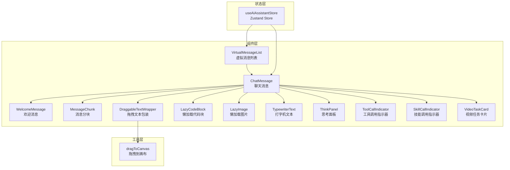
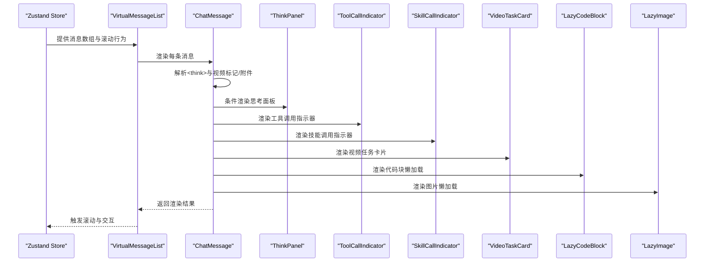
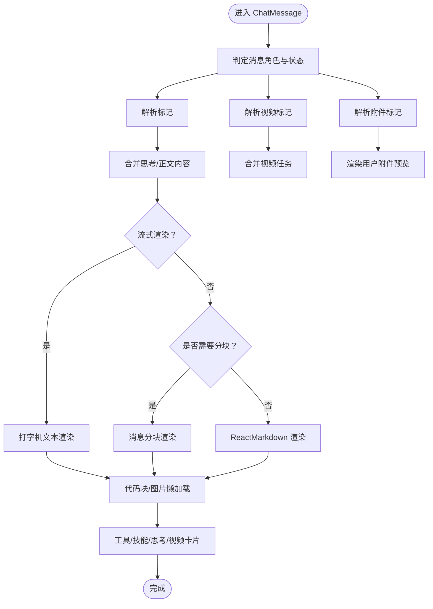
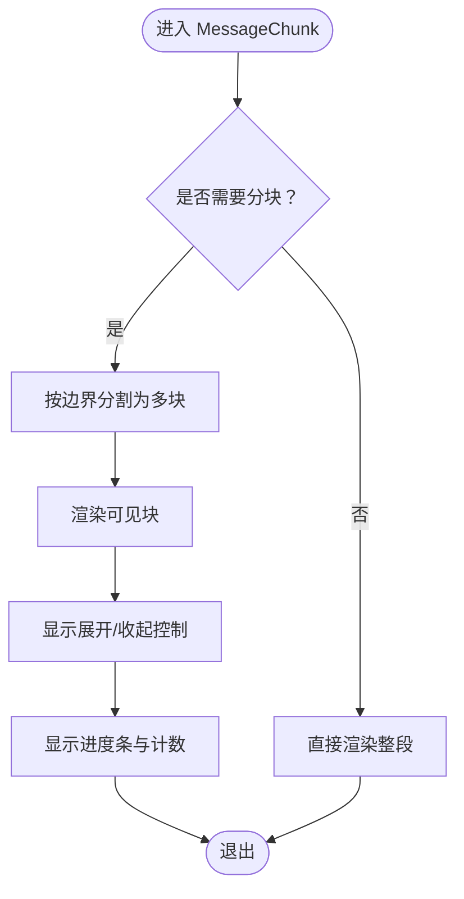
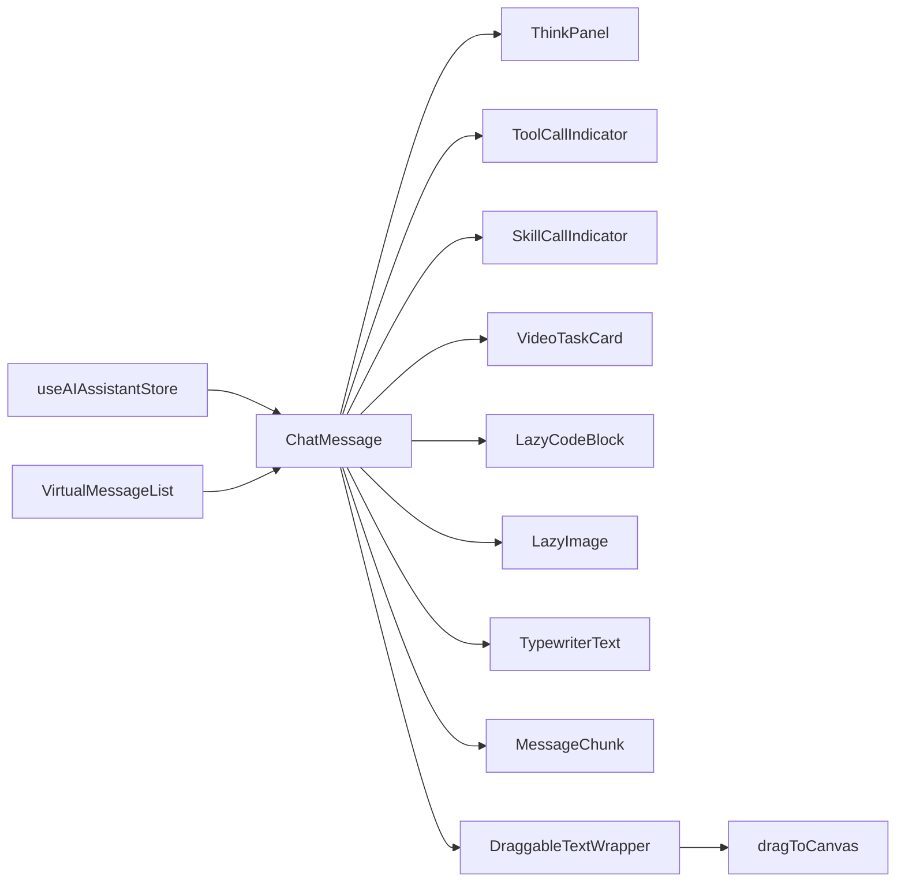

# 消息系统

<cite>
**本文引用的文件**
- [ChatMessage.tsx](file://frontend/src/components/ai-assistant/ChatMessage.tsx)
- [WelcomeMessage.tsx](file://frontend/src/components/ai-assistant/WelcomeMessage.tsx)
- [MessageChunk.tsx](file://frontend/src/components/ai-assistant/MessageChunk.tsx)
- [DraggableTextWrapper.tsx](file://frontend/src/components/ai-assistant/DraggableTextWrapper.tsx)
- [LazyCodeBlock.tsx](file://frontend/src/components/ai-assistant/LazyCodeBlock.tsx)
- [LazyImage.tsx](file://frontend/src/components/ai-assistant/LazyImage.tsx)
- [TypewriterText.tsx](file://frontend/src/components/ai-assistant/TypewriterText.tsx)
- [useAIAssistantStore.ts](file://frontend/src/store/useAIAssistantStore.ts)
- [dragToCanvas.ts](file://frontend/src/lib/dragToCanvas.ts)
- [ThinkPanel.tsx](file://frontend/src/components/ai-assistant/ThinkPanel.tsx)
- [ToolCallIndicator.tsx](file://frontend/src/components/ai-assistant/ToolCallIndicator.tsx)
- [SkillCallIndicator.tsx](file://frontend/src/components/ai-assistant/SkillCallIndicator.tsx)
- [VideoTaskCard.tsx](file://frontend/src/components/ai-assistant/VideoTaskCard.tsx)
- [VirtualMessageList.tsx](file://frontend/src/components/ai-assistant/VirtualMessageList.tsx)
</cite>

## 目录
1. [简介](#简介)
2. [项目结构](#项目结构)
3. [核心组件](#核心组件)
4. [架构总览](#架构总览)
5. [详细组件分析](#详细组件分析)
6. [依赖关系分析](#依赖关系分析)
7. [性能考量](#性能考量)
8. [故障排查指南](#故障排查指南)
9. [结论](#结论)
10. [附录](#附录)

## 简介
本文件面向AI助手消息系统，围绕消息渲染机制进行深入说明，涵盖聊天消息组件、欢迎消息组件、消息块处理、富文本渲染、拖拽文本包装、用户交互、消息状态管理、时间戳显示、消息验证与错误处理、消息类型区分、特殊标记处理以及多媒体内容展示等主题。同时提供组件扩展接口、自定义样式与无障碍访问建议，帮助开发者在保证性能与可用性的前提下进行二次开发。

## 项目结构
消息系统位于前端工程的AI助手模块中，采用按功能分层的组织方式：
- 组件层：消息渲染与交互组件（聊天消息、欢迎消息、消息分块、富文本、代码块、图片、思考面板、工具/技能调用指示器、视频任务卡片、虚拟消息列表）
- 状态层：基于Zustand的状态管理（消息、会话、代理、画布附件、上下文用量等）
- 工具层：拖拽到画布的通用工具函数
- 类型层：统一的消息与状态类型定义

**图表来源**
- [ChatMessage.tsx:253-421](file://frontend/src/components/ai-assistant/ChatMessage.tsx#L253-L421)
- [WelcomeMessage.tsx:28-79](file://frontend/src/components/ai-assistant/WelcomeMessage.tsx#L28-L79)
- [MessageChunk.tsx:18-172](file://frontend/src/components/ai-assistant/MessageChunk.tsx#L18-L172)
- [DraggableTextWrapper.tsx:16-45](file://frontend/src/components/ai-assistant/DraggableTextWrapper.tsx#L16-L45)
- [LazyCodeBlock.tsx:50-166](file://frontend/src/components/ai-assistant/LazyCodeBlock.tsx#L50-L166)
- [LazyImage.tsx:15-111](file://frontend/src/components/ai-assistant/LazyImage.tsx#L15-L111)
- [TypewriterText.tsx:53-68](file://frontend/src/components/ai-assistant/TypewriterText.tsx#L53-L68)
- [ThinkPanel.tsx:39-290](file://frontend/src/components/ai-assistant/ThinkPanel.tsx#L39-L290)
- [ToolCallIndicator.tsx:36-164](file://frontend/src/components/ai-assistant/ToolCallIndicator.tsx#L36-L164)
- [SkillCallIndicator.tsx:18-55](file://frontend/src/components/ai-assistant/SkillCallIndicator.tsx#L18-L55)
- [VideoTaskCard.tsx:134-290](file://frontend/src/components/ai-assistant/VideoTaskCard.tsx#L134-L290)
- [VirtualMessageList.tsx:43-293](file://frontend/src/components/ai-assistant/VirtualMessageList.tsx#L43-L293)
- [useAIAssistantStore.ts:104-200](file://frontend/src/store/useAIAssistantStore.ts#L104-L200)
- [dragToCanvas.ts:40-126](file://frontend/src/lib/dragToCanvas.ts#L40-L126)

**章节来源**
- [ChatMessage.tsx:253-421](file://frontend/src/components/ai-assistant/ChatMessage.tsx#L253-L421)
- [useAIAssistantStore.ts:104-200](file://frontend/src/store/useAIAssistantStore.ts#L104-L200)

## 核心组件
- 聊天消息组件：负责消息解析、富文本渲染、分块显示、思考面板、工具/技能调用指示器、视频任务卡片、欢迎消息与多媒体内容展示。
- 欢迎消息组件：默认欢迎文案与预设对话快捷入口。
- 消息分块组件：超长消息分块与展开/收起控制。
- 拖拽文本包装器：选中文本后拖拽到画布创建节点。
- 懒加载代码块：按需加载语法高亮与语言支持。
- 懒加载图片：视口可见时再加载，提升性能。
- 打字机文本：流式渲染富文本。
- 思考面板：单/多智能体思考过程可视化。
- 工具/技能调用指示器：工具执行状态与结果展示。
- 视频任务卡片：视频生成任务状态轮询与播放。
- 虚拟消息列表：高性能消息列表渲染与自动滚动。

**章节来源**
- [ChatMessage.tsx:253-421](file://frontend/src/components/ai-assistant/ChatMessage.tsx#L253-L421)
- [WelcomeMessage.tsx:28-79](file://frontend/src/components/ai-assistant/WelcomeMessage.tsx#L28-L79)
- [MessageChunk.tsx:18-172](file://frontend/src/components/ai-assistant/MessageChunk.tsx#L18-L172)
- [DraggableTextWrapper.tsx:16-45](file://frontend/src/components/ai-assistant/DraggableTextWrapper.tsx#L16-L45)
- [LazyCodeBlock.tsx:50-166](file://frontend/src/components/ai-assistant/LazyCodeBlock.tsx#L50-L166)
- [LazyImage.tsx:15-111](file://frontend/src/components/ai-assistant/LazyImage.tsx#L15-L111)
- [TypewriterText.tsx:53-68](file://frontend/src/components/ai-assistant/TypewriterText.tsx#L53-L68)
- [ThinkPanel.tsx:39-290](file://frontend/src/components/ai-assistant/ThinkPanel.tsx#L39-L290)
- [ToolCallIndicator.tsx:36-164](file://frontend/src/components/ai-assistant/ToolCallIndicator.tsx#L36-L164)
- [SkillCallIndicator.tsx:18-55](file://frontend/src/components/ai-assistant/SkillCallIndicator.tsx#L18-L55)
- [VideoTaskCard.tsx:134-290](file://frontend/src/components/ai-assistant/VideoTaskCard.tsx#L134-L290)
- [VirtualMessageList.tsx:43-293](file://frontend/src/components/ai-assistant/VirtualMessageList.tsx#L43-L293)

## 架构总览
消息系统通过Zustand Store集中管理消息与会话状态，UI组件根据消息状态与内容类型进行差异化渲染。关键流程包括：
- 消息入栈与状态更新（流式/完成）
- 内容解析（思考标记<think>、视频标记、附件标记）
- 富文本与多媒体渲染（代码块、图片、视频卡片）
- 交互与拖拽（文本拖拽到画布）
- 性能优化（消息分块、懒加载、虚拟列表）

**图表来源**
- [useAIAssistantStore.ts:104-200](file://frontend/src/store/useAIAssistantStore.ts#L104-L200)
- [VirtualMessageList.tsx:43-293](file://frontend/src/components/ai-assistant/VirtualMessageList.tsx#L43-L293)
- [ChatMessage.tsx:253-421](file://frontend/src/components/ai-assistant/ChatMessage.tsx#L253-L421)
- [ThinkPanel.tsx:39-290](file://frontend/src/components/ai-assistant/ThinkPanel.tsx#L39-L290)
- [ToolCallIndicator.tsx:36-164](file://frontend/src/components/ai-assistant/ToolCallIndicator.tsx#L36-L164)
- [SkillCallIndicator.tsx:18-55](file://frontend/src/components/ai-assistant/SkillCallIndicator.tsx#L18-L55)
- [VideoTaskCard.tsx:134-290](file://frontend/src/components/ai-assistant/VideoTaskCard.tsx#L134-L290)
- [LazyCodeBlock.tsx:50-166](file://frontend/src/components/ai-assistant/LazyCodeBlock.tsx#L50-L166)
- [LazyImage.tsx:15-111](file://frontend/src/components/ai-assistant/LazyImage.tsx#L15-L111)

## 详细组件分析

### 聊天消息组件（ChatMessage）
职责与特性：
- 消息类型判定（用户/AI）、流式状态、多智能体思考状态
- 内容解析：
  - 思考标记<think>解析与完整性判断
  - 视频标记解析（任务内标记与完成标记）
  - 附件标记解析与用户附件预览
- 渲染策略：
  - 流式：打字机文本渲染
  - 非流式：ReactMarkdown + 自定义组件（代码块、图片懒加载）
  - 超长内容：消息分块组件
- 交互与提示：
  - 欢迎消息组件
  - 工具/技能调用指示器
  - 多智能体思考面板
  - 视频任务卡片
  - 拖拽文本包装器

**图表来源**
- [ChatMessage.tsx:253-421](file://frontend/src/components/ai-assistant/ChatMessage.tsx#L253-L421)
- [TypewriterText.tsx:53-68](file://frontend/src/components/ai-assistant/TypewriterText.tsx#L53-L68)
- [MessageChunk.tsx:18-172](file://frontend/src/components/ai-assistant/MessageChunk.tsx#L18-L172)
- [LazyCodeBlock.tsx:50-166](file://frontend/src/components/ai-assistant/LazyCodeBlock.tsx#L50-L166)
- [LazyImage.tsx:15-111](file://frontend/src/components/ai-assistant/LazyImage.tsx#L15-L111)
- [ThinkPanel.tsx:39-290](file://frontend/src/components/ai-assistant/ThinkPanel.tsx#L39-L290)
- [ToolCallIndicator.tsx:36-164](file://frontend/src/components/ai-assistant/ToolCallIndicator.tsx#L36-L164)
- [SkillCallIndicator.tsx:18-55](file://frontend/src/components/ai-assistant/SkillCallIndicator.tsx#L18-L55)
- [VideoTaskCard.tsx:134-290](file://frontend/src/components/ai-assistant/VideoTaskCard.tsx#L134-L290)

**章节来源**
- [ChatMessage.tsx:253-421](file://frontend/src/components/ai-assistant/ChatMessage.tsx#L253-L421)

### 欢迎消息组件（WelcomeMessage）
- 展示欢迎文案与用户昵称
- 提供预设对话快捷按钮，点击后触发发送回调

**章节来源**
- [WelcomeMessage.tsx:28-79](file://frontend/src/components/ai-assistant/WelcomeMessage.tsx#L28-L79)

### 消息分块组件（MessageChunk）
- 超长文本按段落/句子边界分块
- 控制初始显示块数，支持展开更多、展开全部、收起
- 进度条与剩余段落数提示

**图表来源**
- [MessageChunk.tsx:18-172](file://frontend/src/components/ai-assistant/MessageChunk.tsx#L18-L172)

**章节来源**
- [MessageChunk.tsx:18-172](file://frontend/src/components/ai-assistant/MessageChunk.tsx#L18-L172)

### 拖拽文本包装器（DraggableTextWrapper）
- 捕获拖拽开始事件，读取选中文本
- 调用拖拽工具函数构建数据与预览
- 拖拽结束清理预览与选区

**章节来源**
- [DraggableTextWrapper.tsx:16-45](file://frontend/src/components/ai-assistant/DraggableTextWrapper.tsx#L16-L45)
- [dragToCanvas.ts:105-126](file://frontend/src/lib/dragToCanvas.ts#L105-L126)

### 懒加载代码块（LazyCodeBlock）
- IntersectionObserver检测进入视口后加载高亮器与语言模块
- 支持行号、最大行数与展开更多
- Suspense降级与占位符

**章节来源**
- [LazyCodeBlock.tsx:50-166](file://frontend/src/components/ai-assistant/LazyCodeBlock.tsx#L50-L166)

### 懒加载图片（LazyImage）
- 视口检测与懒加载
- 加载完成/失败状态切换
- 空src过滤与错误占位

**章节来源**
- [LazyImage.tsx:15-111](file://frontend/src/components/ai-assistant/LazyImage.tsx#L15-L111)

### 打字机文本（TypewriterText）
- 流式富文本渲染，适配代码块与图片过滤

**章节来源**
- [TypewriterText.tsx:53-68](file://frontend/src/components/ai-assistant/TypewriterText.tsx#L53-L68)

### 思考面板（ThinkPanel）
- 单智能体：显示思考内容与计时
- 多智能体：步骤列表、进度百分比、状态图标、展开详情
- 自动展开/折叠与用户手动干预

**章节来源**
- [ThinkPanel.tsx:39-290](file://frontend/src/components/ai-assistant/ThinkPanel.tsx#L39-L290)

### 工具调用指示器（ToolCallIndicator）
- 执行中/成功/失败状态可视化
- 错误解析（JSON与文本格式）
- 参数与结果展开查看

**章节来源**
- [ToolCallIndicator.tsx:36-164](file://frontend/src/components/ai-assistant/ToolCallIndicator.tsx#L36-L164)

### 技能调用指示器（SkillCallIndicator）
- 技能加载状态提示

**章节来源**
- [SkillCallIndicator.tsx:18-55](file://frontend/src/components/ai-assistant/SkillCallIndicator.tsx#L18-L55)

### 视频任务卡片（VideoTaskCard）
- 任务状态轮询（待处理/处理中/完成/失败）
- 完成后可拖拽到画布、下载、显示元信息
- 失败时显示错误信息

**章节来源**
- [VideoTaskCard.tsx:134-290](file://frontend/src/components/ai-assistant/VideoTaskCard.tsx#L134-L290)
- [dragToCanvas.ts:85-100](file://frontend/src/lib/dragToCanvas.ts#L85-L100)

### 虚拟消息列表（VirtualMessageList）
- react-window虚拟列表，动态行高
- 自动滚动到底部与AI回复时的智能滚动
- 等待指示器（打字动画）

**章节来源**
- [VirtualMessageList.tsx:43-293](file://frontend/src/components/ai-assistant/VirtualMessageList.tsx#L43-L293)

## 依赖关系分析
- ChatMessage依赖：
  - ThinkPanel、ToolCallIndicator、SkillCallIndicator、VideoTaskCard、LazyCodeBlock、LazyImage、TypewriterText、MessageChunk、DraggableTextWrapper
  - useAIAssistantStore中的消息与状态
  - dragToCanvas工具函数
- VirtualMessageList依赖ChatMessage进行逐条渲染
- LazyCodeBlock/LazyImage通过懒加载优化首屏性能
- ThinkPanel/ToolCallIndicator/SkillCallIndicator/VideoTaskCard提供丰富的交互与状态反馈

**图表来源**
- [useAIAssistantStore.ts:104-200](file://frontend/src/store/useAIAssistantStore.ts#L104-L200)
- [ChatMessage.tsx:253-421](file://frontend/src/components/ai-assistant/ChatMessage.tsx#L253-L421)
- [VirtualMessageList.tsx:43-293](file://frontend/src/components/ai-assistant/VirtualMessageList.tsx#L43-L293)
- [dragToCanvas.ts:40-126](file://frontend/src/lib/dragToCanvas.ts#L40-L126)

**章节来源**
- [useAIAssistantStore.ts:104-200](file://frontend/src/store/useAIAssistantStore.ts#L104-L200)
- [ChatMessage.tsx:253-421](file://frontend/src/components/ai-assistant/ChatMessage.tsx#L253-L421)
- [VirtualMessageList.tsx:43-293](file://frontend/src/components/ai-assistant/VirtualMessageList.tsx#L43-L293)
- [dragToCanvas.ts:40-126](file://frontend/src/lib/dragToCanvas.ts#L40-L126)

## 性能考量
- 懒加载与按需渲染
  - 代码块与图片使用IntersectionObserver与Suspense，仅在视口可见时加载
  - 虚拟列表减少DOM节点数量，提高滚动性能
- 内容分块
  - 超长消息分块渲染，避免一次性渲染造成卡顿
- 流式渲染
  - 打字机文本逐段渲染，降低首屏压力
- 状态与记忆化
  - useMemo减少重复计算，useMemo依赖合理设置
- 拖拽优化
  - 拖拽预览与数据传输格式标准化，避免频繁重绘

[本节为通用性能指导，不直接分析具体文件]

## 故障排查指南
- 视频任务状态异常
  - 检查任务ID与轮询间隔，确认终端状态停止轮询
  - 失败时检查错误信息字段
- 工具调用错误识别
  - 支持JSON与文本错误格式解析，关注结果字符串
- 图片加载失败
  - 检查src有效性与网络请求，查看错误占位
- 代码高亮不生效
  - 确认语言模块是否正确加载，最大行数限制与展开按钮
- 拖拽无效
  - 检查选中文本是否存在，dataTransfer格式是否正确

**章节来源**
- [VideoTaskCard.tsx:134-290](file://frontend/src/components/ai-assistant/VideoTaskCard.tsx#L134-L290)
- [ToolCallIndicator.tsx:36-164](file://frontend/src/components/ai-assistant/ToolCallIndicator.tsx#L36-L164)
- [LazyImage.tsx:15-111](file://frontend/src/components/ai-assistant/LazyImage.tsx#L15-L111)
- [LazyCodeBlock.tsx:50-166](file://frontend/src/components/ai-assistant/LazyCodeBlock.tsx#L50-L166)
- [DraggableTextWrapper.tsx:16-45](file://frontend/src/components/ai-assistant/DraggableTextWrapper.tsx#L16-L45)

## 结论
消息系统通过清晰的组件分工与状态管理，实现了富文本渲染、多媒体展示、思考过程可视化与交互拖拽等能力。借助懒加载、消息分块与虚拟列表等技术手段，在保证用户体验的同时兼顾了性能。建议在扩展时遵循现有解析与渲染模式，确保一致性与可维护性。

## 附录

### 消息类型与状态
- 消息角色：用户/AI
- 消息状态：流式/完成
- 多智能体：步骤列表、最终结果、Token统计、积分消耗
- 技能/工具调用：名称、参数、状态、结果、耗时
- 视频任务：任务ID、模式、模型、URL、质量、时长、积分

**章节来源**
- [useAIAssistantStore.ts:4-63](file://frontend/src/store/useAIAssistantStore.ts#L4-L63)

### 特殊标记与解析
- 思考标记：<think>...</think>
- 视频任务标记：任务内标记与完成标记
- 附件标记：用于用户侧附件预览

**章节来源**
- [ChatMessage.tsx:25-51](file://frontend/src/components/ai-assistant/ChatMessage.tsx#L25-L51)

### 扩展接口与自定义样式
- 组件扩展
  - 在ChatMessage中新增自定义组件并注册到ReactMarkdown组件映射
  - 通过MessageChunk的renderContent回调插入自定义渲染逻辑
  - 通过DraggableTextWrapper包装任意文本内容
- 自定义样式
  - 使用CSS变量覆盖主题色值，如文本、背景、边框、状态色
  - 通过类名组合实现布局与间距调整
- 无障碍访问
  - 为按钮与交互元素提供可访问标签
  - 为图片提供替代文本
  - 为视频提供可关闭控制与下载链接

[本节为通用指导，不直接分析具体文件]