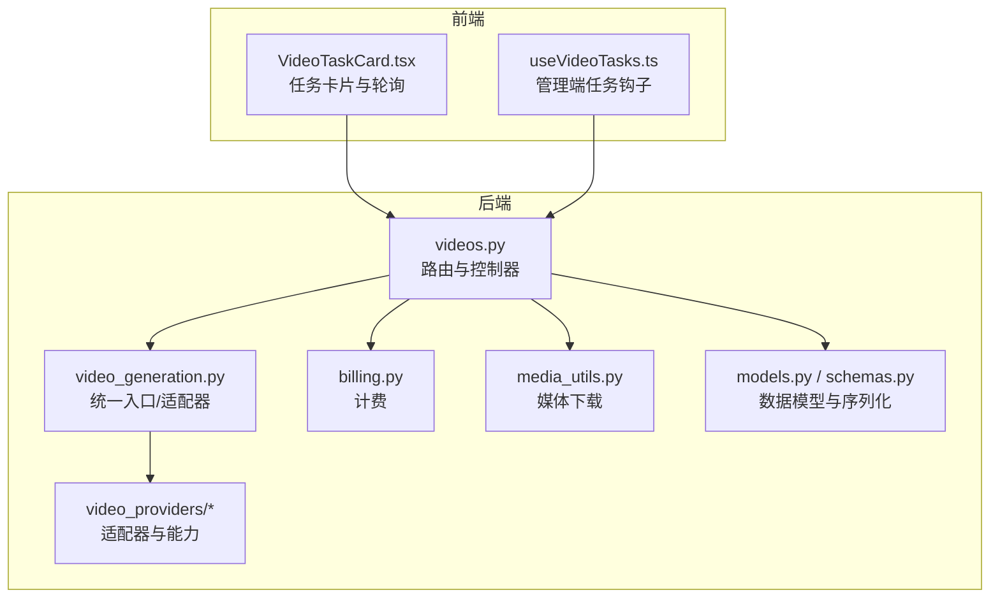
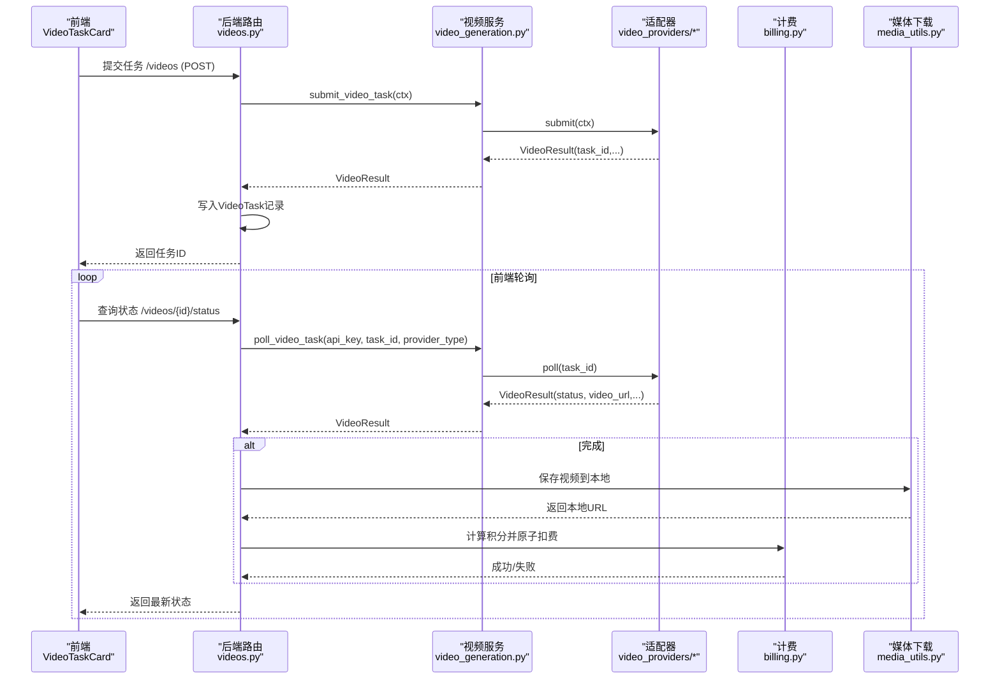
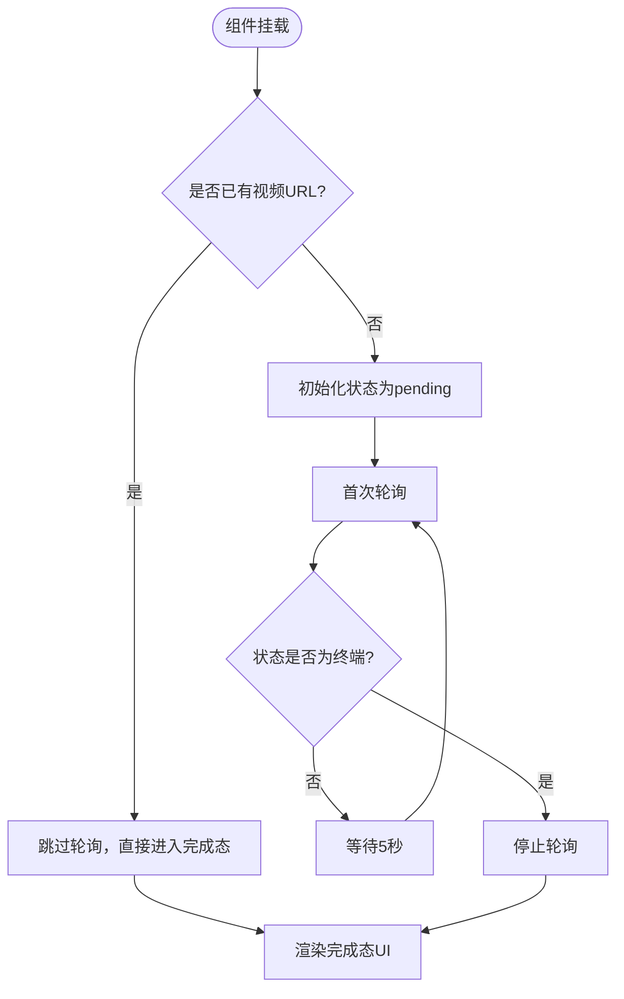
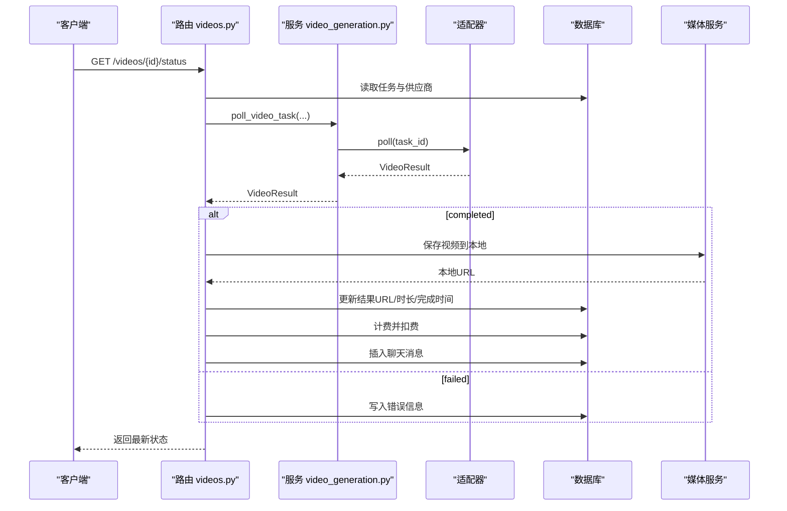
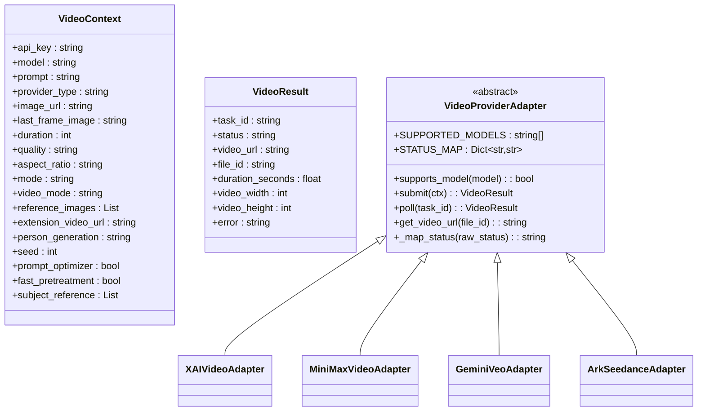
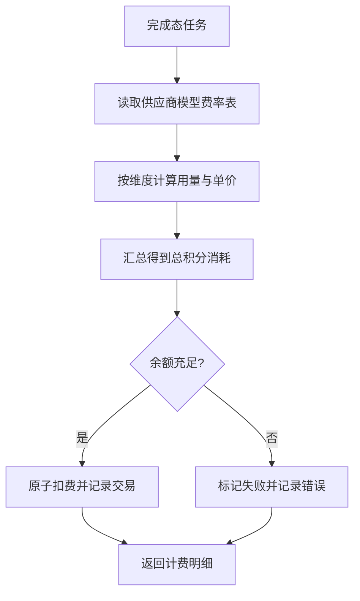
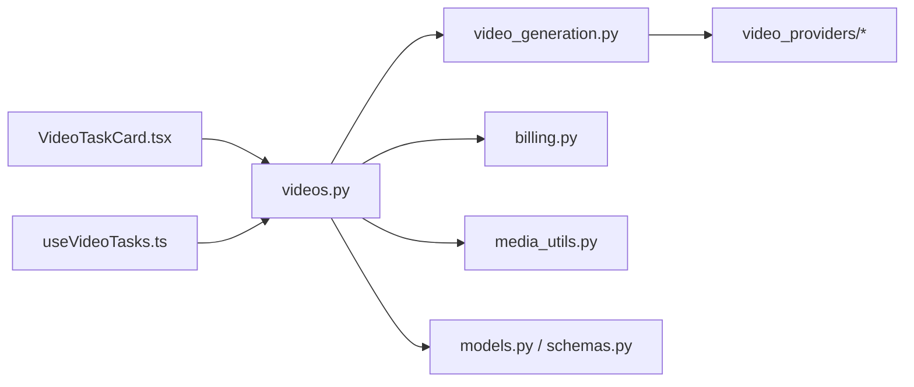

# 视频任务管理

<cite>
**本文引用的文件**
- [VideoTaskCard.tsx](file://frontend/src/components/ai-assistant/VideoTaskCard.tsx)
- [videos.py](file://backend/routers/videos.py)
- [video_generation.py](file://backend/services/video_generation.py)
- [base.py](file://backend/services/video_providers/base.py)
- [model_capabilities.py](file://backend/services/video_providers/model_capabilities.py)
- [billing.py](file://backend/services/billing.py)
- [media_utils.py](file://backend/services/media_utils.py)
- [models.py](file://backend/models.py)
- [schemas.py](file://backend/schemas.py)
- [useVideoTasks.ts](file://backend/admin/src/hooks/useVideoTasks.ts)
- [video.ts](file://backend/admin/src/types/video.ts)
</cite>

## 目录
1. [简介](#简介)
2. [项目结构](#项目结构)
3. [核心组件](#核心组件)
4. [架构总览](#架构总览)
5. [详细组件分析](#详细组件分析)
6. [依赖关系分析](#依赖关系分析)
7. [性能考量](#性能考量)
8. [故障排查指南](#故障排查指南)
9. [结论](#结论)
10. [附录](#附录)

## 简介
本文件面向“AI助手视频任务管理”组件，系统化阐述视频任务卡片的设计与实现、任务生命周期与状态流转、用户交互与预览下载、后台队列与并发控制、错误处理与计费机制，并提供扩展接口、自定义操作与集成指南。目标是帮助前端与后端开发者快速理解并扩展视频任务能力。

## 项目结构
视频任务管理涉及前后端协作的关键模块如下：
- 前端组件：AI助手中的视频任务卡片，负责状态展示、轮询与拖拽预览。
- 后端路由：提供视频任务提交、状态轮询、会话关联、模型能力查询与删除清理。
- 服务层：统一视频生成入口、供应商适配器、计费与媒体下载。
- 数据模型与序列化：定义视频任务表结构、请求/响应模型。
- 管理端钩子：管理端对视频任务进行列表、轮询与删除。

图表来源
- [VideoTaskCard.tsx:134-290](file://frontend/src/components/ai-assistant/VideoTaskCard.tsx#L134-L290)
- [videos.py:1-344](file://backend/routers/videos.py#L1-L344)
- [video_generation.py:1-180](file://backend/services/video_generation.py#L1-L180)
- [base.py:1-121](file://backend/services/video_providers/base.py#L1-L121)
- [model_capabilities.py:1-477](file://backend/services/video_providers/model_capabilities.py#L1-L477)
- [billing.py:1-388](file://backend/services/billing.py#L1-L388)
- [media_utils.py:1-79](file://backend/services/media_utils.py#L1-L79)
- [models.py:411-442](file://backend/models.py#L411-L442)
- [schemas.py:638-701](file://backend/schemas.py#L638-L701)
- [useVideoTasks.ts:1-73](file://backend/admin/src/hooks/useVideoTasks.ts#L1-L73)

章节来源
- [VideoTaskCard.tsx:1-290](file://frontend/src/components/ai-assistant/VideoTaskCard.tsx#L1-L290)
- [videos.py:1-344](file://backend/routers/videos.py#L1-L344)
- [video_generation.py:1-180](file://backend/services/video_generation.py#L1-L180)
- [base.py:1-121](file://backend/services/video_providers/base.py#L1-L121)
- [model_capabilities.py:1-477](file://backend/services/video_providers/model_capabilities.py#L1-L477)
- [billing.py:1-388](file://backend/services/billing.py#L1-L388)
- [media_utils.py:1-79](file://backend/services/media_utils.py#L1-L79)
- [models.py:411-442](file://backend/models.py#L411-L442)
- [schemas.py:638-701](file://backend/schemas.py#L638-L701)
- [useVideoTasks.ts:1-73](file://backend/admin/src/hooks/useVideoTasks.ts#L1-L73)

## 核心组件
- 视频任务卡片（前端）
  - 功能：展示任务状态、加载动画、错误提示、完成后的可拖拽预览与下载。
  - 轮询：首次渲染即发起状态查询；处于进行中时每5秒轮询一次；终端态停止轮询。
  - 拖拽：完成态支持将视频拖拽至画布节点。
- 视频任务路由（后端）
  - 提交任务：解析请求、推断供应商、提交到适配器、持久化任务记录。
  - 轮询状态：对非终端态任务调用供应商轮询，落地本地视频、计费、插入聊天消息。
  - 列表与过滤：分页、按状态/模式/供应商过滤。
  - 模型能力：查询指定模型的能力配置。
  - 删除：仅允许删除已完成/失败的任务，清理本地文件与关联消息。
- 供应商适配器（后端）
  - 抽象基类定义统一上下文与结果结构。
  - 注册表与工厂：按供应商类型选择适配器。
  - 能力配置：按模型名返回支持的模式、分辨率、时长、首尾帧等。
- 计费与媒体（后端）
  - 计费：按输入/输出维度与质量映射计算积分消耗，原子扣费并记录交易。
  - 媒体：从远端URL下载视频到本地，返回统一访问路径。
- 数据模型与序列化（后端）
  - VideoTask：任务持久化字段（状态、结果URL、错误、计费等）。
  - Video*Schema：请求/响应模型，兼容数据库字段名映射。

章节来源
- [VideoTaskCard.tsx:134-290](file://frontend/src/components/ai-assistant/VideoTaskCard.tsx#L134-L290)
- [videos.py:75-234](file://backend/routers/videos.py#L75-L234)
- [base.py:15-121](file://backend/services/video_providers/base.py#L15-L121)
- [model_capabilities.py:27-477](file://backend/services/video_providers/model_capabilities.py#L27-L477)
- [billing.py:353-388](file://backend/services/billing.py#L353-L388)
- [media_utils.py:31-50](file://backend/services/media_utils.py#L31-L50)
- [models.py:411-442](file://backend/models.py#L411-L442)
- [schemas.py:665-694](file://backend/schemas.py#L665-L694)

## 架构总览
视频任务从“提交—轮询—完成—计费—预览/下载”的完整链路如下：

图表来源
- [videos.py:75-234](file://backend/routers/videos.py#L75-L234)
- [video_generation.py:90-126](file://backend/services/video_generation.py#L90-L126)
- [base.py:77-101](file://backend/services/video_providers/base.py#L77-L101)
- [billing.py:178-308](file://backend/services/billing.py#L178-L308)
- [media_utils.py:31-50](file://backend/services/media_utils.py#L31-L50)

## 详细组件分析

### 视频任务卡片（前端）
- 设计要点
  - 状态可视化：不同状态对应图标、颜色与文案。
  - 加载动画：进行中时展示旋转动画与提示。
  - 完成态交互：提供可拖拽预览与下载按钮。
  - 错误态展示：失败时显示错误信息。
- 轮询策略
  - 首次渲染即拉取一次状态；进行中每5秒轮询一次；终端态停止。
  - 若任务已由上游注入完成信息，则跳过轮询。
- 拖拽预览
  - 将视频URL包装为拖拽数据，支持拖到画布节点。
- 复杂度与性能
  - 轮询频率固定，避免频繁网络请求；组件卸载时清理定时器，防止内存泄漏。

图表来源
- [VideoTaskCard.tsx:150-195](file://frontend/src/components/ai-assistant/VideoTaskCard.tsx#L150-L195)

章节来源
- [VideoTaskCard.tsx:1-290](file://frontend/src/components/ai-assistant/VideoTaskCard.tsx#L1-L290)

### 视频任务路由与生命周期（后端）
- 提交任务
  - 校验供应商、合并配置、推断供应商类型、构造上下文并提交。
  - 失败即抛出HTTP异常；成功创建VideoTask记录。
- 轮询状态
  - 非终端态时调用适配器轮询；超时保护：若错误且挂起超过5分钟则标记失败。
  - 完成态：下载视频到本地、回填结果URL、计算时长与计费、原子扣费、插入聊天消息。
  - 失败态：记录错误信息。
- 列表与过滤
  - 支持分页、按状态/模式/供应商过滤，行级权限隔离。
- 模型能力
  - 根据模型名返回能力配置，便于前端表单约束。
- 删除任务
  - 仅允许删除已完成/失败的任务；清理本地文件与关联消息。

图表来源
- [videos.py:150-234](file://backend/routers/videos.py#L150-L234)
- [video_generation.py:103-126](file://backend/services/video_generation.py#L103-L126)
- [media_utils.py:31-50](file://backend/services/media_utils.py#L31-L50)
- [billing.py:353-388](file://backend/services/billing.py#L353-L388)

章节来源
- [videos.py:27-344](file://backend/routers/videos.py#L27-L344)

### 供应商适配器与能力配置（后端）
- 抽象接口
  - VideoContext：统一请求上下文（模型、提示词、时长、分辨率、模式、参考图、首尾帧等）。
  - VideoResult：统一结果结构（任务ID、状态、URL、文件ID、尺寸、时长、错误）。
  - 适配器需实现submit/poll/get_video_url等方法。
- 适配器注册
  - 工厂按供应商类型选择适配器，支持扩展新供应商。
- 模型能力
  - 以字典形式维护各模型支持的模式、分辨率、时长、首尾帧、参考图、扩展/编辑、音频等能力。

图表来源
- [base.py:15-121](file://backend/services/video_providers/base.py#L15-L121)
- [model_capabilities.py:27-477](file://backend/services/video_providers/model_capabilities.py#L27-L477)

章节来源
- [base.py:1-121](file://backend/services/video_providers/base.py#L1-L121)
- [model_capabilities.py:1-477](file://backend/services/video_providers/model_capabilities.py#L1-L477)

### 计费与媒体处理（后端）
- 计费
  - 映射表驱动：按维度（输入/输出/图片/搜索/生成）与规模（每1M或每单位）计算。
  - 视频计费：输入图片/秒与输出质量映射到对应维度，从供应商模型费率表读取单价。
  - 原子扣费：使用UPDATE...WHERE保证并发安全，失败抛出余额不足或冻结异常。
- 媒体
  - 从远端URL下载视频到本地目录，返回统一访问路径；支持供应商特殊请求头（如Gemini）。

图表来源
- [billing.py:353-388](file://backend/services/billing.py#L353-L388)
- [videos.py:190-226](file://backend/routers/videos.py#L190-L226)

章节来源
- [billing.py:1-388](file://backend/services/billing.py#L1-L388)
- [media_utils.py:31-50](file://backend/services/media_utils.py#L31-L50)

### 管理端任务钩子（后端）
- 自动轮询活跃任务：对处于pending/processing的任务，每5秒并发调用状态端点，驱动后端轮询并更新数据库。
- 列表与过滤：支持分页与多维过滤，自动刷新活跃任务状态。

章节来源
- [useVideoTasks.ts:17-57](file://backend/admin/src/hooks/useVideoTasks.ts#L17-L57)

### 管理端类型与标签（后端）
- 模型能力类型：定义供应商、模式、分辨率、时长、首尾帧、参考图、扩展/编辑、音频等能力字段。
- 标签映射：将内部枚举映射为前端可读标签（如“文生视频”、“720p（高清）”等）。
- 默认能力：当模型未定义时使用默认配置。

章节来源
- [video.ts:1-54](file://backend/admin/src/types/video.ts#L1-L54)

## 依赖关系分析
- 前端对后端的依赖
  - VideoTaskCard依赖API端点（提交/状态轮询）、拖拽工具与样式。
  - 管理端Hook依赖路由与类型定义。
- 后端内部依赖
  - 路由依赖服务层（视频生成、计费、媒体）、数据模型与序列化。
  - 服务层依赖适配器注册表与能力配置，计费依赖模型费率表，媒体依赖本地存储目录。

图表来源
- [VideoTaskCard.tsx:1-290](file://frontend/src/components/ai-assistant/VideoTaskCard.tsx#L1-L290)
- [useVideoTasks.ts:1-73](file://backend/admin/src/hooks/useVideoTasks.ts#L1-L73)
- [videos.py:1-344](file://backend/routers/videos.py#L1-L344)
- [video_generation.py:1-180](file://backend/services/video_generation.py#L1-L180)
- [base.py:1-121](file://backend/services/video_providers/base.py#L1-L121)
- [billing.py:1-388](file://backend/services/billing.py#L1-L388)
- [media_utils.py:1-79](file://backend/services/media_utils.py#L1-L79)
- [models.py:411-442](file://backend/models.py#L411-L442)
- [schemas.py:638-701](file://backend/schemas.py#L638-L701)

章节来源
- [videos.py:1-344](file://backend/routers/videos.py#L1-L344)
- [video_generation.py:1-180](file://backend/services/video_generation.py#L1-L180)
- [base.py:1-121](file://backend/services/video_providers/base.py#L1-L121)
- [billing.py:1-388](file://backend/services/billing.py#L1-L388)
- [media_utils.py:1-79](file://backend/services/media_utils.py#L1-L79)
- [models.py:411-442](file://backend/models.py#L411-L442)
- [schemas.py:638-701](file://backend/schemas.py#L638-L701)
- [useVideoTasks.ts:1-73](file://backend/admin/src/hooks/useVideoTasks.ts#L1-L73)
- [video.ts:1-54](file://backend/admin/src/types/video.ts#L1-L54)

## 性能考量
- 轮询频率与并发
  - 前端：进行中任务每5秒轮询一次，避免过度请求。
  - 管理端：对活跃任务并发调用状态端点，后端内部并发轮询供应商，减少等待时间。
- 超时保护
  - 后端对挂起超过5分钟且报错的任务判定失败，防止长时间占用资源。
- 媒体下载
  - 异步HTTP客户端下载视频，设置合理超时与跟随重定向，避免阻塞。
- 计费原子性
  - 使用UPDATE...WHERE与事务记录，保障并发下的余额一致性。

[本节为通用指导，无需列出具体文件来源]

## 故障排查指南
- 任务长期pending
  - 检查供应商轮询是否正常返回状态；查看后端日志与错误信息。
  - 管理端活跃任务会自动轮询，确认管理端Hook是否生效。
- 生成失败
  - 查看错误信息字段；确认供应商API密钥有效与可用额度充足。
  - 检查模型能力是否满足当前请求（时长/分辨率/模式）。
- 无法下载视频
  - 确认媒体目录可写；检查供应商是否需要特殊请求头（如Gemini）。
- 积分不足
  - 核对计费明细与余额；确认是否被冻结。
- 删除任务失败
  - 仅已完成/失败任务可删除；确认本地文件是否已清理。

章节来源
- [videos.py:180-234](file://backend/routers/videos.py#L180-L234)
- [billing.py:178-308](file://backend/services/billing.py#L178-L308)
- [media_utils.py:31-50](file://backend/services/media_utils.py#L31-L50)
- [useVideoTasks.ts:34-48](file://backend/admin/src/hooks/useVideoTasks.ts#L34-L48)

## 结论
视频任务管理通过“前端卡片+后端路由/服务”的清晰分工，实现了从提交、轮询、完成到计费与预览下载的闭环。统一的供应商适配器与能力配置提升了扩展性；原子计费与超时保护增强了可靠性；管理端钩子进一步优化了可观测性与用户体验。建议在新增供应商或模型时，遵循现有适配器接口与能力配置规范，确保一致性与可维护性。

[本节为总结性内容，无需列出具体文件来源]

## 附录

### 任务状态与生命周期
- 状态定义：pending、processing、completed、failed。
- 生命周期：提交→轮询→完成（下载/计费/插入消息）或失败→可删除（仅终态）。

章节来源
- [VideoTaskCard.tsx:25-47](file://frontend/src/components/ai-assistant/VideoTaskCard.tsx#L25-L47)
- [videos.py:164-169](file://backend/routers/videos.py#L164-L169)
- [models.py:431-433](file://backend/models.py#L431-L433)

### 任务详情与下载
- 详情字段：任务ID、状态、模式、提示词、时长、分辨率、模型、错误信息、结果URL、计费明细等。
- 下载：完成态卡片提供下载链接；管理端可直接访问本地媒体路径。

章节来源
- [schemas.py:665-694](file://backend/schemas.py#L665-L694)
- [VideoTaskCard.tsx:108-121](file://frontend/src/components/ai-assistant/VideoTaskCard.tsx#L108-L121)

### 队列管理与并发限制
- 前端：每任务固定轮询间隔；完成态停止。
- 后端：管理端对活跃任务并发轮询；供应商轮询由适配器实现；媒体下载异步执行。
- 并发限制：通过轮询间隔与并发请求数控制，避免过载。

章节来源
- [VideoTaskCard.tsx:174-195](file://frontend/src/components/ai-assistant/VideoTaskCard.tsx#L174-L195)
- [useVideoTasks.ts:43-47](file://backend/admin/src/hooks/useVideoTasks.ts#L43-L47)

### 扩展接口与集成指南
- 新增供应商
  - 实现VideoProviderAdapter接口，注册到工厂；在能力配置中补充模型能力。
- 新增模型
  - 在能力配置表中添加模型项；在供应商适配器中完善参数映射。
- 自定义操作
  - 前端：在卡片中扩展操作按钮（如复制链接、分享），保持轮询与状态同步。
  - 后端：在路由中扩展过滤与排序；在服务层增加新的计费维度或媒体处理逻辑。

章节来源
- [base.py:56-121](file://backend/services/video_providers/base.py#L56-L121)
- [video_generation.py:78-82](file://backend/services/video_generation.py#L78-L82)
- [model_capabilities.py:461-477](file://backend/services/video_providers/model_capabilities.py#L461-L477)