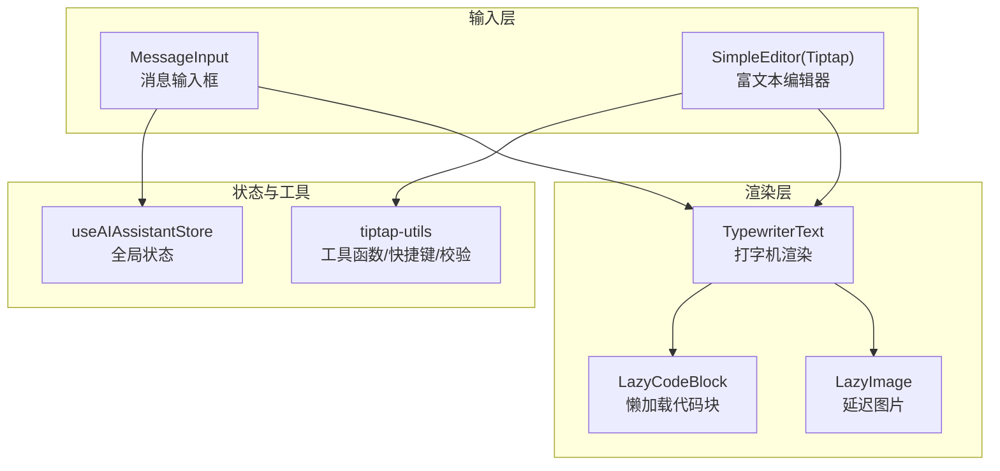
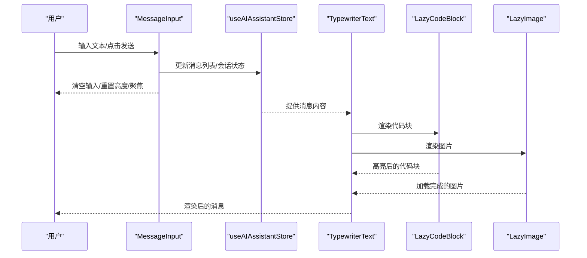
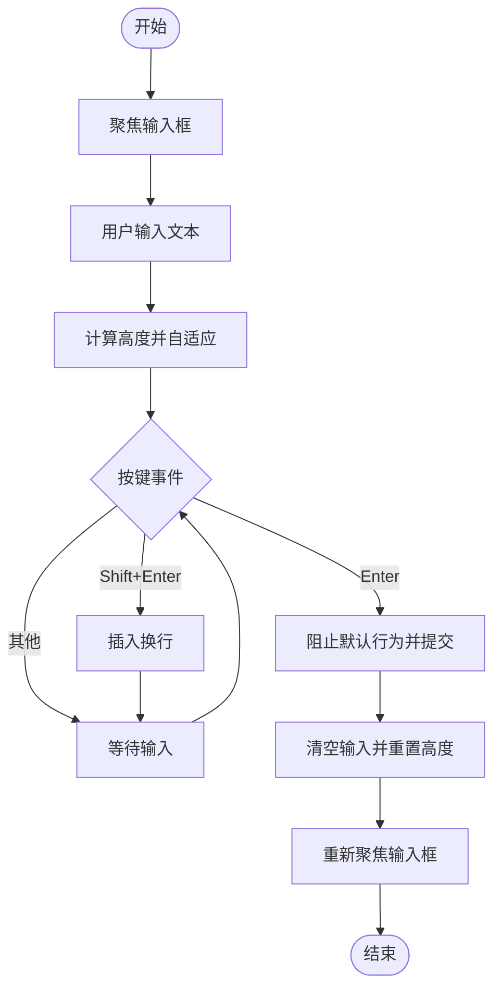
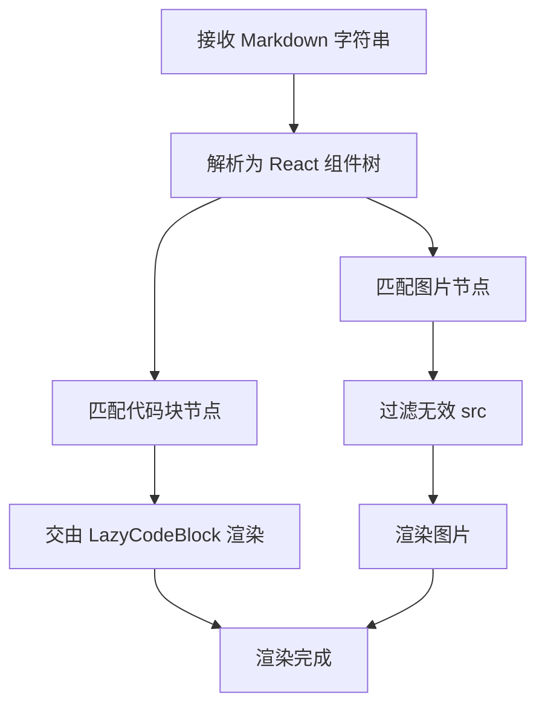
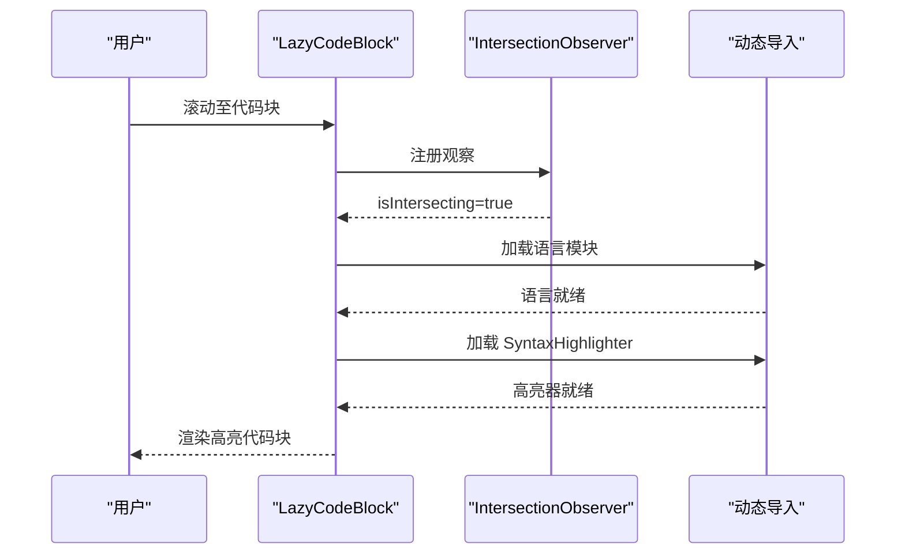
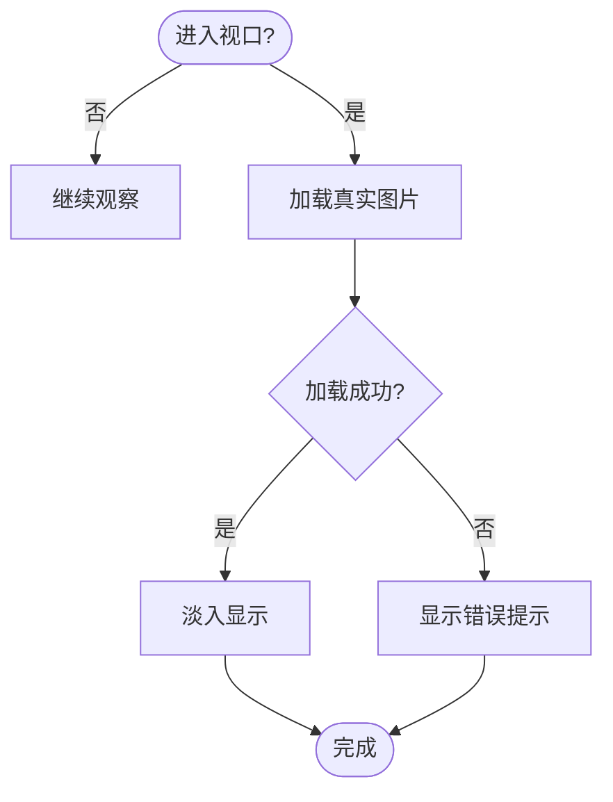
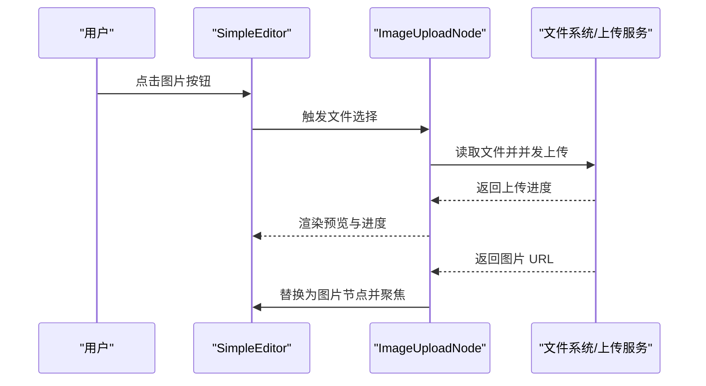
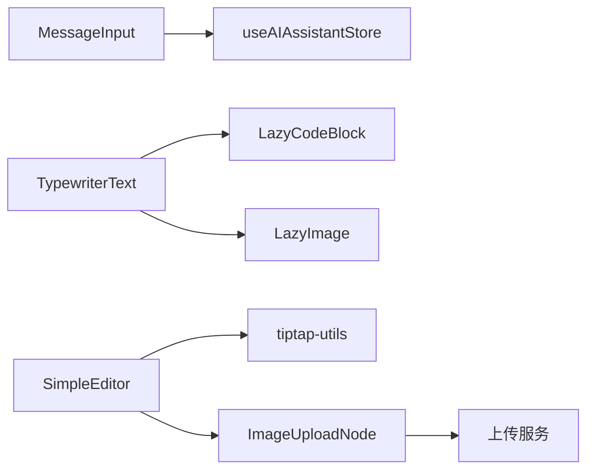

# 输入组件

<cite>
**本文引用的文件**
- [MessageInput.tsx](file://frontend/src/components/ai-assistant/MessageInput.tsx)
- [TypewriterText.tsx](file://frontend/src/components/ai-assistant/TypewriterText.tsx)
- [LazyCodeBlock.tsx](file://frontend/src/components/ai-assistant/LazyCodeBlock.tsx)
- [LazyImage.tsx](file://frontend/src/components/ai-assistant/LazyImage.tsx)
- [simple-editor.tsx](file://frontend/src/components/tiptap-templates/simple/simple-editor.tsx)
- [tiptap-utils.ts](file://frontend/src/lib/tiptap-utils.ts)
- [image-upload-node.tsx](file://frontend/src/components/tiptap-node/image-upload-node/image-upload-node.tsx)
- [useAIAssistantStore.ts](file://frontend/src/store/useAIAssistantStore.ts)
- [simple-editor.scss](file://frontend/src/components/tiptap-templates/simple/simple-editor.scss)
- [image-upload-node.scss](file://frontend/src/components/tiptap-node/image-upload-node/image-upload-node.scss)
</cite>

## 目录
1. [简介](#简介)
2. [项目结构](#项目结构)
3. [核心组件](#核心组件)
4. [架构总览](#架构总览)
5. [详细组件分析](#详细组件分析)
6. [依赖关系分析](#依赖关系分析)
7. [性能考量](#性能考量)
8. [故障排查指南](#故障排查指南)
9. [结论](#结论)
10. [附录](#附录)

## 简介
本文件面向“AI助手输入组件”的技术与产品文档，系统化阐述消息输入框、打字机渲染、懒加载代码块与延迟图片等能力的设计与实现要点；同时覆盖输入验证、自动完成功能、快捷键支持与粘贴处理；并说明输入状态管理、字符计数、表情符号插入与文件附件上传流程；最后给出可访问性设计、键盘导航与屏幕阅读器支持建议，以及定制选项、样式覆盖与性能优化策略。

## 项目结构
围绕输入组件的关键文件分布如下：
- 消息输入框：负责基础文本输入、高度自适应、回车发送、Agent切换与发送按钮禁用逻辑
- 打字机渲染：负责 Markdown 渲染、代码块与图片的样式与懒加载
- 懒加载代码块：按需动态导入语法高亮器与语言模块，支持展开更多
- 延迟图片：基于 IntersectionObserver 的懒加载与占位符
- 富文本编辑器（Tiptap）：提供更丰富的输入体验，含自动完成功能、快捷键、粘贴处理、文件上传等
- 状态管理：AI 助手全局状态，承载消息、Agent 列表、附件等
- 样式层：主题变量与响应式布局，确保跨设备一致体验

图表来源
- [MessageInput.tsx:1-182](file://frontend/src/components/ai-assistant/MessageInput.tsx#L1-L182)
- [TypewriterText.tsx:1-68](file://frontend/src/components/ai-assistant/TypewriterText.tsx#L1-L68)
- [LazyCodeBlock.tsx:1-166](file://frontend/src/components/ai-assistant/LazyCodeBlock.tsx#L1-L166)
- [LazyImage.tsx:1-111](file://frontend/src/components/ai-assistant/LazyImage.tsx#L1-L111)
- [simple-editor.tsx:1-294](file://frontend/src/components/tiptap-templates/simple/simple-editor.tsx#L1-L294)
- [tiptap-utils.ts:1-641](file://frontend/src/lib/tiptap-utils.ts#L1-L641)
- [useAIAssistantStore.ts:1-381](file://frontend/src/store/useAIAssistantStore.ts#L1-L381)

章节来源
- [MessageInput.tsx:1-182](file://frontend/src/components/ai-assistant/MessageInput.tsx#L1-L182)
- [simple-editor.tsx:1-294](file://frontend/src/components/tiptap-templates/simple/simple-editor.tsx#L1-L294)

## 核心组件
- 消息输入框（MessageInput）
  - 负责文本输入、高度自适应、回车发送、Agent 下拉切换、发送按钮禁用控制
  - 允许在 AI 正在生成时继续输入，提升交互连续性
- 打字机文本（TypewriterText）
  - 基于 ReactMarkdown + remarkGfm 渲染 Markdown，自定义代码块与图片组件
  - 过滤无效图片 src，避免浏览器告警
- 懒加载代码块（LazyCodeBlock）
  - 动态导入语法高亮器与语言模块，仅在进入视口时加载
  - 支持行号、最大显示行数与“展开更多”按钮
- 延迟图片（LazyImage）
  - 基于 IntersectionObserver 提前加载，带占位符与错误态提示
- 富文本编辑器（SimpleEditor/Tiptap）
  - 提供自动完成功能、快捷键支持、粘贴处理、文件上传等
- 全局状态（useAIAssistantStore）
  - 统一管理消息、Agent 列表、附件、面板尺寸与上下文用量等

章节来源
- [MessageInput.tsx:1-182](file://frontend/src/components/ai-assistant/MessageInput.tsx#L1-L182)
- [TypewriterText.tsx:1-68](file://frontend/src/components/ai-assistant/TypewriterText.tsx#L1-L68)
- [LazyCodeBlock.tsx:1-166](file://frontend/src/components/ai-assistant/LazyCodeBlock.tsx#L1-L166)
- [LazyImage.tsx:1-111](file://frontend/src/components/ai-assistant/LazyImage.tsx#L1-L111)
- [simple-editor.tsx:1-294](file://frontend/src/components/tiptap-templates/simple/simple-editor.tsx#L1-L294)
- [useAIAssistantStore.ts:1-381](file://frontend/src/store/useAIAssistantStore.ts#L1-L381)

## 架构总览
输入组件由“输入层 + 渲染层 + 状态与工具层”构成，消息输入框与富文本编辑器分别满足轻量与丰富输入场景；渲染层通过打字机组件统一输出 Markdown 内容，结合懒加载优化首屏性能；全局状态贯穿消息与附件等数据流。

图表来源
- [MessageInput.tsx:1-182](file://frontend/src/components/ai-assistant/MessageInput.tsx#L1-L182)
- [TypewriterText.tsx:1-68](file://frontend/src/components/ai-assistant/TypewriterText.tsx#L1-L68)
- [LazyCodeBlock.tsx:1-166](file://frontend/src/components/ai-assistant/LazyCodeBlock.tsx#L1-L166)
- [LazyImage.tsx:1-111](file://frontend/src/components/ai-assistant/LazyImage.tsx#L1-L111)
- [useAIAssistantStore.ts:1-381](file://frontend/src/store/useAIAssistantStore.ts#L1-L381)

## 详细组件分析

### 消息输入框（MessageInput）
- 输入行为
  - 自动调整高度：根据内容滚动高度限制最大高度，保证输入区始终可见
  - 回车发送：Enter 发送，Shift+Enter 换行
  - 发送后自动聚焦，便于连续输入
- Agent 切换
  - 下拉菜单展示可用 Agent，支持描述与目标节点类型显示
  - 切换回调 onSwitchAgent 由上层注入
- 发送按钮
  - 基于输入是否为空与禁用状态决定可用性
  - 加载中显示旋转图标，普通态显示发送图标
- 可访问性
  - textarea 设置占位符与 aria 属性，按钮提供 title 提示
  - 禁用态明确反馈

图表来源
- [MessageInput.tsx:1-182](file://frontend/src/components/ai-assistant/MessageInput.tsx#L1-L182)

章节来源
- [MessageInput.tsx:1-182](file://frontend/src/components/ai-assistant/MessageInput.tsx#L1-L182)

### 打字机文本（TypewriterText）
- Markdown 渲染
  - 使用 remarkGfm 插件启用 GitHub 风格表格、删除线等
  - 自定义代码块与行内代码样式，支持语言标识
- 图片处理
  - 过滤空 src，避免浏览器告警
  - 图片容器具备圆角与最大宽度控制
- 性能
  - 与 LazyCodeBlock 协作，避免一次性渲染大量代码块

图表来源
- [TypewriterText.tsx:1-68](file://frontend/src/components/ai-assistant/TypewriterText.tsx#L1-L68)
- [LazyCodeBlock.tsx:1-166](file://frontend/src/components/ai-assistant/LazyCodeBlock.tsx#L1-L166)
- [LazyImage.tsx:1-111](file://frontend/src/components/ai-assistant/LazyImage.tsx#L1-L111)

章节来源
- [TypewriterText.tsx:1-68](file://frontend/src/components/ai-assistant/TypewriterText.tsx#L1-L68)

### 懒加载代码块（LazyCodeBlock）
- 动态导入
  - 仅在代码块进入视口时加载语法高亮器与对应语言模块
  - 语言模块映射覆盖常见编程语言
- 展示策略
  - 默认只显示前 N 行，提供“展开更多”按钮
  - 占位符阶段显示部分代码片段，提升感知速度
- 交互
  - 使用 IntersectionObserver 监听进入视口事件
  - Suspense 降级渲染，避免阻塞主线程

图表来源
- [LazyCodeBlock.tsx:1-166](file://frontend/src/components/ai-assistant/LazyCodeBlock.tsx#L1-L166)

章节来源
- [LazyCodeBlock.tsx:1-166](file://frontend/src/components/ai-assistant/LazyCodeBlock.tsx#L1-L166)

### 延迟图片（LazyImage）
- 懒加载
  - 使用 IntersectionObserver 在进入视口前不加载真实资源
  - 提前 50px 开始加载，降低白屏时间
- 占位与错误
  - 占位符采用淡入动画，加载完成后透明度过渡
  - 错误态显示“加载失败”提示
- 安全性
  - 过滤空 src，避免无效请求

图表来源
- [LazyImage.tsx:1-111](file://frontend/src/components/ai-assistant/LazyImage.tsx#L1-L111)

章节来源
- [LazyImage.tsx:1-111](file://frontend/src/components/ai-assistant/LazyImage.tsx#L1-L111)

### 富文本编辑器（SimpleEditor/Tiptap）
- 自动完成与快捷键
  - 启用 autocomplete/off、autocorrect/off、autocapitalize/off
  - 平台区分快捷键符号（macOS 使用特殊符号）
- 粘贴处理
  - 链接自动识别与打开策略可配置
- 文件上传
  - ImageUploadNode 支持拖拽/点击选择、并发上传、进度条、取消与错误处理
  - 上传成功后替换为图片节点，自动聚焦下一个节点
- 工具栏与移动端适配
  - 主工具栏与移动端二级弹出面板，支持高亮、链接、对齐、图片上传等
- 样式与主题
  - 使用 SCSS 变量与媒体查询，适配不同屏幕尺寸

图表来源
- [simple-editor.tsx:1-294](file://frontend/src/components/tiptap-templates/simple/simple-editor.tsx#L1-L294)
- [image-upload-node.tsx:1-555](file://frontend/src/components/tiptap-node/image-upload-node/image-upload-node.tsx#L1-L555)
- [tiptap-utils.ts:1-641](file://frontend/src/lib/tiptap-utils.ts#L1-L641)

章节来源
- [simple-editor.tsx:1-294](file://frontend/src/components/tiptap-templates/simple/simple-editor.tsx#L1-L294)
- [tiptap-utils.ts:1-641](file://frontend/src/lib/tiptap-utils.ts#L1-L641)
- [image-upload-node.tsx:1-555](file://frontend/src/components/tiptap-node/image-upload-node/image-upload-node.tsx#L1-L555)

### 输入状态管理与附件
- 状态模型
  - 消息、Agent 列表、会话、面板尺寸、附件、上下文用量等集中管理
  - 支持剧院切换时保存/恢复会话
- 附件
  - 支持多图附件（最多 5 张），与“从画布拖拽到 AI 面板”的交互配合
  - 与图片编辑上下文互斥，避免冲突

章节来源
- [useAIAssistantStore.ts:1-381](file://frontend/src/store/useAIAssistantStore.ts#L1-L381)

## 依赖关系分析
- 组件耦合
  - MessageInput 与 useAIAssistantStore 强耦合，负责消息与 Agent 状态更新
  - TypewriterText 与 LazyCodeBlock/LazyImage 解耦，通过 Markdown 渲染协议协作
  - SimpleEditor 与 tiptap-utils、ImageUploadNode 协作，形成完整的富文本输入链路
- 外部依赖
  - ReactMarkdown + remarkGfm：Markdown 渲染
  - react-syntax-highlighter：代码高亮
  - IntersectionObserver：懒加载
  - Tiptap 生态：扩展、节点、UI 组件

图表来源
- [MessageInput.tsx:1-182](file://frontend/src/components/ai-assistant/MessageInput.tsx#L1-L182)
- [TypewriterText.tsx:1-68](file://frontend/src/components/ai-assistant/TypewriterText.tsx#L1-L68)
- [LazyCodeBlock.tsx:1-166](file://frontend/src/components/ai-assistant/LazyCodeBlock.tsx#L1-L166)
- [LazyImage.tsx:1-111](file://frontend/src/components/ai-assistant/LazyImage.tsx#L1-L111)
- [simple-editor.tsx:1-294](file://frontend/src/components/tiptap-templates/simple/simple-editor.tsx#L1-L294)
- [tiptap-utils.ts:1-641](file://frontend/src/lib/tiptap-utils.ts#L1-L641)
- [image-upload-node.tsx:1-555](file://frontend/src/components/tiptap-node/image-upload-node/image-upload-node.tsx#L1-L555)

## 性能考量
- 懒加载与分块
  - 代码块与图片均采用 IntersectionObserver 懒加载，减少首屏压力
  - 代码块默认只渲染前 N 行，支持“展开更多”
- 动态导入
  - 语法高亮器与语言模块按需加载，显著降低初始包体积
- 渲染优化
  - TypewriterText 将图片与代码块渲染委托给专用组件，避免重复计算
  - SimpleEditor 使用 Suspense 降级渲染，避免阻塞主线程
- 存储与复用
  - useAIAssistantStore 使用持久化存储，减少页面刷新后的重建成本

[本节为通用性能指导，无需特定文件引用]

## 故障排查指南
- 图片不显示
  - 检查 src 是否为空或无效；确认过滤逻辑生效
  - 查看错误态提示与占位符是否正常
- 代码块不高亮
  - 确认语言是否在映射表中；检查 IntersectionObserver 是否触发加载
  - 若未进入视口，占位符会显示部分代码片段属预期
- 富文本编辑器无法上传图片
  - 检查文件大小与类型限制；查看并发上传与进度回调
  - 确认上传函数返回 URL 并替换为图片节点
- 快捷键显示异常
  - macOS 符号映射是否正确；非 macOS 平台应显示标准键名
- 输入框无法聚焦
  - 发送后是否重新聚焦；加载态是否导致禁用

章节来源
- [LazyImage.tsx:1-111](file://frontend/src/components/ai-assistant/LazyImage.tsx#L1-L111)
- [LazyCodeBlock.tsx:1-166](file://frontend/src/components/ai-assistant/LazyCodeBlock.tsx#L1-L166)
- [tiptap-utils.ts:1-641](file://frontend/src/lib/tiptap-utils.ts#L1-L641)
- [image-upload-node.tsx:1-555](file://frontend/src/components/tiptap-node/image-upload-node/image-upload-node.tsx#L1-L555)

## 结论
该输入组件体系通过“轻量输入 + 富文本增强 + 渲染优化 + 状态统一”的设计，在保证易用性的同时兼顾性能与可维护性。打字机渲染、懒加载代码块与延迟图片有效降低了首屏负担；富文本编辑器提供了自动完成、快捷键与文件上传等高级能力；全局状态使消息与附件在多场景下保持一致体验。

[本节为总结性内容，无需特定文件引用]

## 附录

### 可访问性与键盘导航
- 文本输入
  - textarea 提供占位符与 aria 标签；按钮提供 title 提示
  - 发送按钮禁用态明确反馈
- 富文本编辑器
  - 编辑区设置 aria-label，帮助屏幕阅读器识别
  - 工具栏按钮具备语义化标签与键盘可达性
- 建议
  - 为 Agent 下拉菜单添加键盘导航（上下选择、回车确认）
  - 为图片上传区域提供键盘触发方式（如 Space/Enter）

章节来源
- [MessageInput.tsx:1-182](file://frontend/src/components/ai-assistant/MessageInput.tsx#L1-L182)
- [simple-editor.tsx:1-294](file://frontend/src/components/tiptap-templates/simple/simple-editor.tsx#L1-L294)

### 定制选项与样式覆盖
- MessageInput
  - 通过 className 与 placeholder 属性进行外观与文案定制
  - Agent 下拉菜单项可扩展描述与目标节点类型展示
- TypewriterText
  - 通过自定义组件覆盖代码块与图片样式
  - 支持传入自定义类名以适配主题
- LazyCodeBlock
  - 语言映射可扩展；行数上限与行号开关可配置
- LazyImage
  - 占位符与错误态样式可通过类名覆盖
- SimpleEditor
  - 工具栏与移动端面板样式通过 SCSS 变量与媒体查询控制
  - 图片上传节点样式独立 SCSS，便于主题化

章节来源
- [TypewriterText.tsx:1-68](file://frontend/src/components/ai-assistant/TypewriterText.tsx#L1-L68)
- [LazyCodeBlock.tsx:1-166](file://frontend/src/components/ai-assistant/LazyCodeBlock.tsx#L1-L166)
- [LazyImage.tsx:1-111](file://frontend/src/components/ai-assistant/LazyImage.tsx#L1-L111)
- [simple-editor.tsx:1-294](file://frontend/src/components/tiptap-templates/simple/simple-editor.tsx#L1-L294)
- [simple-editor.scss:1-83](file://frontend/src/components/tiptap-templates/simple/simple-editor.scss#L1-L83)
- [image-upload-node.scss:1-250](file://frontend/src/components/tiptap-node/image-upload-node/image-upload-node.scss#L1-L250)

### 输入验证、自动完成、快捷键与粘贴处理
- 输入验证
  - 文件上传大小与数量限制；非法 URL 过滤
- 自动完成
  - 富文本编辑器开启 autocomplete/off、autocorrect/off、autocapitalize/off
- 快捷键
  - 平台区分符号映射；支持解析快捷键字符串
- 粘贴处理
  - 链接自动识别与打开策略可配置；URL 白名单与协议过滤

章节来源
- [tiptap-utils.ts:1-641](file://frontend/src/lib/tiptap-utils.ts#L1-L641)
- [simple-editor.tsx:1-294](file://frontend/src/components/tiptap-templates/simple/simple-editor.tsx#L1-L294)