# 增强的消息输入组件

<cite>
**本文档引用的文件**
- [MessageInput.tsx](file://frontend/src/components/ai-assistant/MessageInput.tsx)
- [AIAssistantPanel.tsx](file://frontend/src/components/canvas/AIAssistantPanel.tsx)
- [NodePreviewCard.tsx](file://frontend/src/components/ai-assistant/NodePreviewCard.tsx)
- [useAIAssistantStore.ts](file://frontend/src/store/useAIAssistantStore.ts)
- [useSessionManager.ts](file://frontend/src/components/ai-assistant/hooks/useSessionManager.ts)
- [useSSEHandler.ts](file://frontend/src/components/ai-assistant/hooks/useSSEHandler.ts)
- [nodeAttachmentUtils.ts](file://frontend/src/lib/nodeAttachmentUtils.ts)
- [chat_generation.py](file://backend/services/chat_generation.py)
- [chats.py](file://backend/routers/chats.py)
- [README.md](file://README.md)
- [用户输入组件设计指南.md](file://用户输入组件设计指南.md)
</cite>

## 更新摘要
**变更内容**
- 重构MessageInput组件，将Agent选择器和节点附件功能分离
- 改善工作流程效率，提供更清晰的用户界面
- 新增节点选择器功能，支持从画布拖拽节点到消息输入框
- 优化状态管理，分离Agent选择和节点附件两个独立功能模块

## 目录
1. [项目概述](#项目概述)
2. [核心架构](#核心架构)
3. [消息输入组件详解](#消息输入组件详解)
4. [多模态文件处理](#多模态文件处理)
5. [画布节点集成](#画布节点集成)
6. [实时流式响应](#实时流式响应)
7. [状态管理机制](#状态管理机制)
8. [性能优化策略](#性能优化策略)
9. [错误处理与用户体验](#错误处理与用户体验)
10. [扩展性设计](#扩展性设计)
11. [总结](#总结)

## 项目概述

增强的消息输入组件是KunFlix平台的核心交互组件，专为影视广告创作场景设计。该组件支持多模态输入、实时流式响应、画布节点集成和智能代理协作等功能，为用户提供专业级的AI内容创作体验。

### 核心特性
- **多模态输入支持**：文本、图片、视频、音频等多种文件类型
- **实时流式响应**：基于Server-Sent Events的实时消息传输
- **画布节点集成**：直接从创作画布拖拽节点到消息输入框
- **智能代理协作**：支持多智能体协作和工具调用
- **上下文管理**：智能的上下文窗口管理和压缩机制

## 核心架构

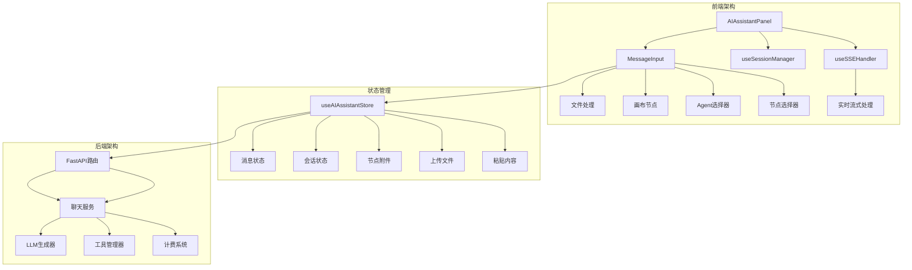

**架构图来源**
- [AIAssistantPanel.tsx:51-633](file://frontend/src/components/canvas/AIAssistantPanel.tsx#L51-L633)
- [MessageInput.tsx:295-721](file://frontend/src/components/ai-assistant/MessageInput.tsx#L295-L721)
- [useAIAssistantStore.ts:247-449](file://frontend/src/store/useAIAssistantStore.ts#L247-L449)

## 消息输入组件详解

### 组件结构设计

MessageInput组件采用模块化设计，将不同功能分离到独立的子组件中：

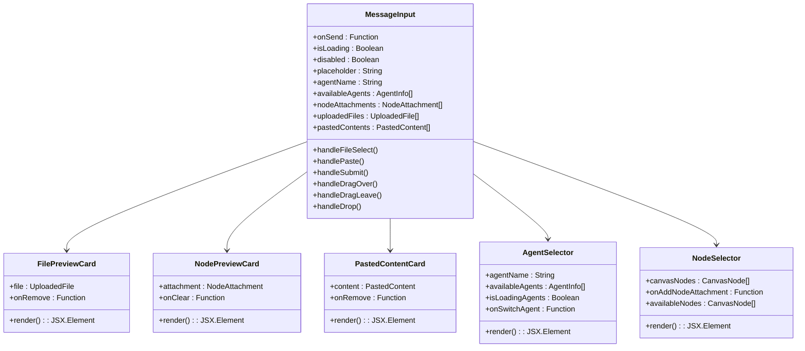

**类图来源**
- [MessageInput.tsx:259-322](file://frontend/src/components/ai-assistant/MessageInput.tsx#L259-L322)
- [MessageInput.tsx:237-246](file://frontend/src/components/ai-assistant/MessageInput.tsx#L237-L246)

### 核心功能实现

#### 文件处理机制

组件支持多种文件类型的智能识别和处理：

| 文件类型 | 处理方式 | 预览效果 |
|---------|---------|---------|
| 图片文件 | 预览缩略图 + 上传进度 | 卡片式预览 |
| 文本文件 | 读取内容并显示片段 | 代码块样式 |
| 视频文件 | 显示文件信息 | 文件图标 |
| 音频文件 | 显示文件信息 | 文件图标 |

#### 拖拽交互设计

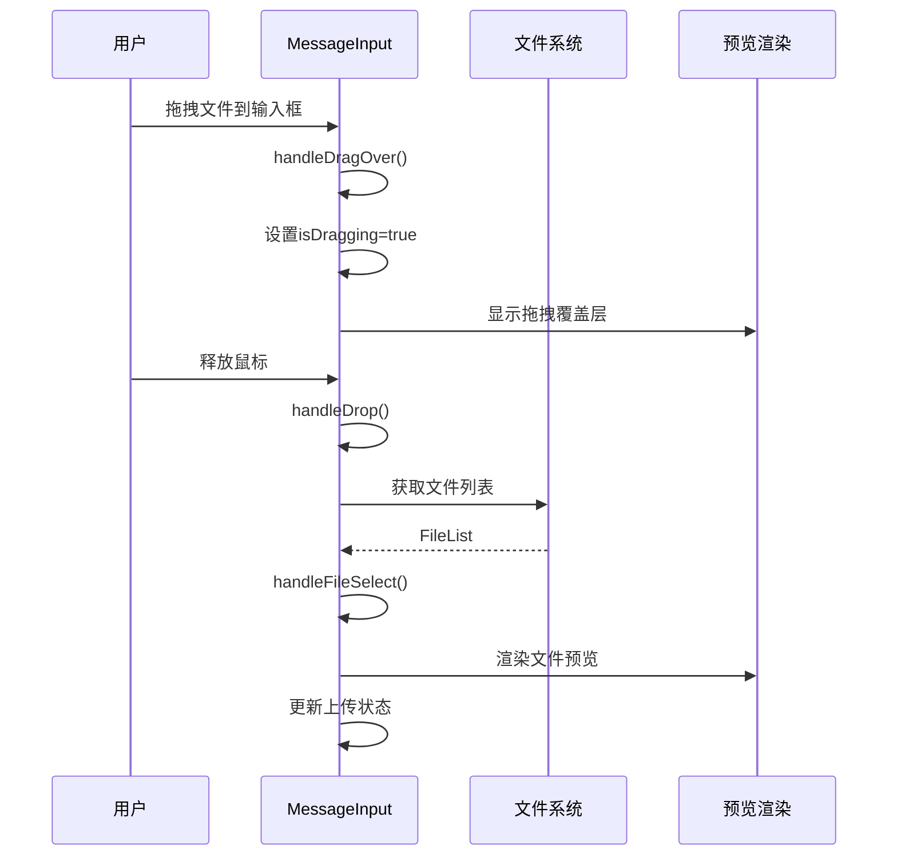

**序列图来源**
- [MessageInput.tsx:426-441](file://frontend/src/components/ai-assistant/MessageInput.tsx#L426-L441)
- [MessageInput.tsx:346-393](file://frontend/src/components/ai-assistant/MessageInput.tsx#L346-L393)

## 多模态文件处理

### 文件类型识别系统

组件实现了智能的文件类型识别机制：

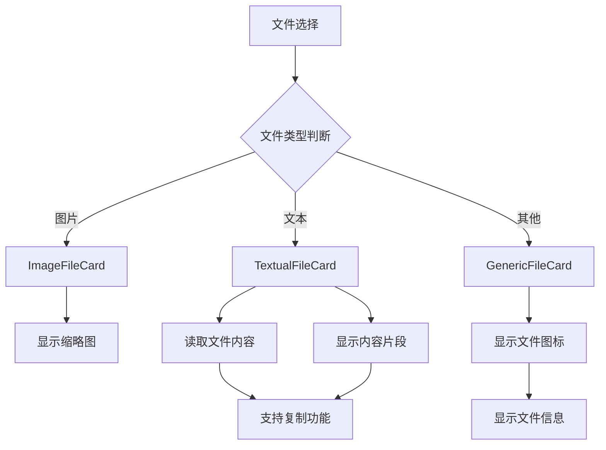

**流程图来源**
- [MessageInput.tsx:45-88](file://frontend/src/components/ai-assistant/MessageInput.tsx#L45-L88)
- [MessageInput.tsx:100-197](file://frontend/src/components/ai-assistant/MessageInput.tsx#L100-L197)

### 文本文件智能处理

对于文本文件，组件提供了深度的内容处理能力：

- **自动编码检测**：支持UTF-8、GBK等多种编码格式
- **内容截断显示**：超过阈值的内容自动截断显示
- **复制功能**：支持一键复制文件内容到剪贴板
- **错误处理**：文件读取失败时提供友好的错误提示

### 文件上传状态管理

组件实现了完整的文件上传生命周期管理：

| 状态 | 描述 | 用户反馈 |
|------|------|----------|
| pending | 等待上传 | 默认状态 |
| uploading | 上传中 | 进度条动画 |
| complete | 上传完成 | ✓ 标记 |
| error | 上传失败 | ❌ 标记 |

## 画布节点集成

### 节点附件系统

组件支持从创作画布直接拖拽节点到消息输入框，实现真正的"所见即所得"：

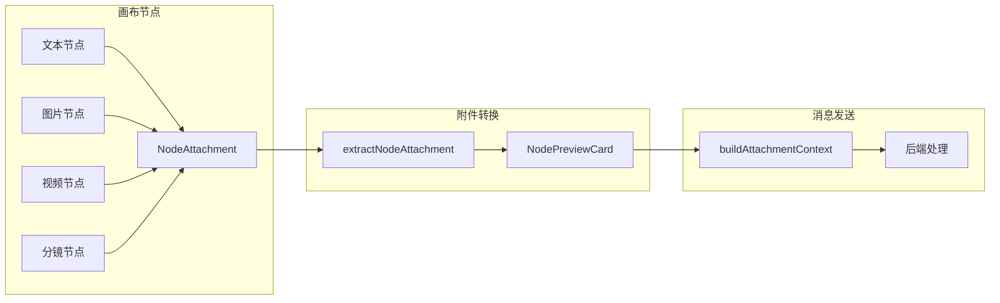

**图表来源**
- [nodeAttachmentUtils.ts:86-97](file://frontend/src/lib/nodeAttachmentUtils.ts#L86-L97)
- [AIAssistantPanel.tsx:36-49](file://frontend/src/components/canvas/AIAssistantPanel.tsx#L36-L49)

### 节点类型支持

| 节点类型 | 支持的附件 | 预览方式 |
|---------|-----------|---------|
| text | 文本内容摘要 | 文本卡片 |
| image | 图片URL/描述 | 图片缩略图 |
| video | 视频URL/描述 | 图片缩略图 |
| storyboard | 分镜描述 | 文本卡片 |

### 上下文构建机制

组件将画布节点转换为AI可理解的上下文信息：

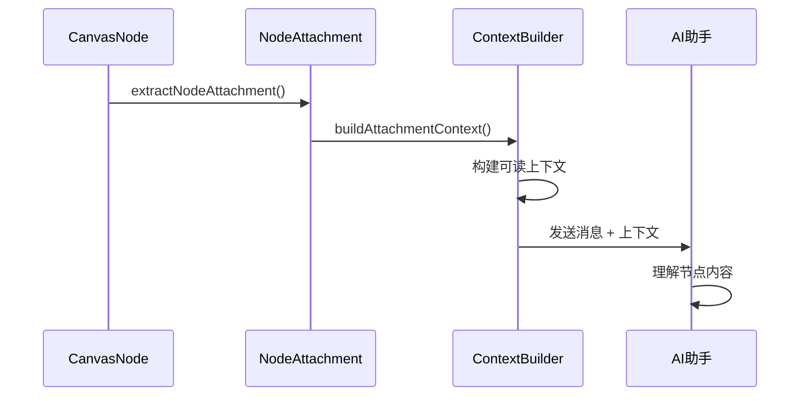

**序列图来源**
- [AIAssistantPanel.tsx:36-49](file://frontend/src/components/canvas/AIAssistantPanel.tsx#L36-L49)
- [nodeAttachmentUtils.ts:86-97](file://frontend/src/lib/nodeAttachmentUtils.ts#L86-L97)

### 节点选择器功能

**更新** 新增节点选择器功能，支持从画布拖拽节点到消息输入框

组件提供了专门的节点选择器，用户可以通过下拉菜单选择画布上的节点：

- **节点过滤**：自动过滤已附加的节点，避免重复选择
- **类型标识**：不同节点类型显示不同的图标和颜色
- **预览信息**：显示节点的标题和简要描述
- **拖拽支持**：支持直接从画布拖拽节点到输入框

## 实时流式响应

### SSE事件处理系统

组件实现了完整的Server-Sent Events处理机制：

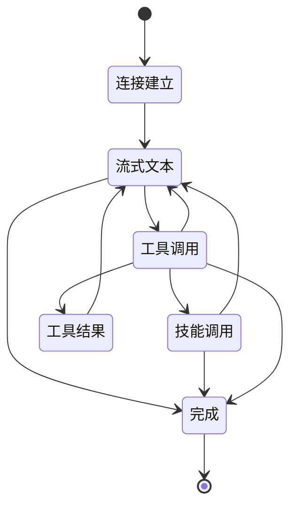

**状态图来源**
- [useSSEHandler.ts:67-383](file://frontend/src/components/ai-assistant/hooks/useSSEHandler.ts#L67-L383)

### 事件类型处理

| 事件类型 | 处理逻辑 | 用户界面 |
|---------|---------|---------|
| text | 追加到AI消息 | 实时显示文本 |
| tool_call | 显示工具调用开始 | 工具调用指示器 |
| tool_result | 更新工具调用状态 | 工具调用完成 |
| skill_call | 显示技能加载开始 | 技能加载指示器 |
| skill_loaded | 更新技能加载状态 | 技能加载完成 |
| billing | 更新积分余额 | 余额显示更新 |
| done | 结束流式响应 | 停止加载动画 |

### 多智能体协作支持

组件支持复杂的多智能体协作场景：

- **子任务管理**：跟踪每个子任务的状态和结果
- **令牌统计**：实时显示每个智能体使用的令牌数量
- **协作可视化**：提供清晰的协作过程展示

## 状态管理机制

### Zustand状态管理

组件使用Zustand实现高效的状态管理：

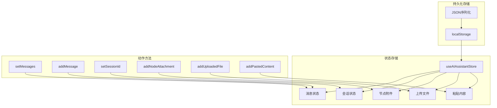

**图表来源**
- [useAIAssistantStore.ts:247-449](file://frontend/src/store/useAIAssistantStore.ts#L247-L449)

### 状态同步机制

组件实现了多层状态同步：

1. **本地状态同步**：组件内部状态与Zustand store的双向同步
2. **会话状态管理**：支持多剧场的会话状态隔离
3. **持久化存储**：关键状态自动保存到localStorage

### 会话管理

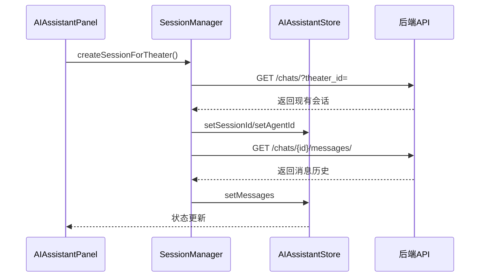

**序列图来源**
- [useSessionManager.ts:53-123](file://frontend/src/components/ai-assistant/hooks/useSessionManager.ts#L53-L123)

### Agent选择器状态管理

**更新** Agent选择器功能现在独立管理，提供更好的用户体验

组件实现了独立的Agent选择器状态管理：

- **Agent列表缓存**：避免频繁重新加载Agent列表
- **选择状态同步**：确保Agent选择与会话状态同步
- **加载状态指示**：显示Agent列表加载状态
- **错误处理**：Agent加载失败时的降级处理

## 性能优化策略

### 虚拟滚动优化

组件使用虚拟滚动技术处理大量消息：

- **视口内渲染**：只渲染可见区域的消息
- **动态计算**：根据消息内容动态计算高度
- **内存管理**：及时清理不可见的消息DOM

### 文件上传优化

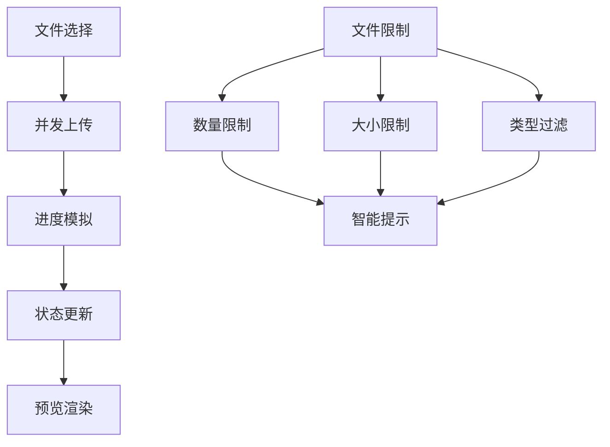

**流程图来源**
- [MessageInput.tsx:346-393](file://frontend/src/components/ai-assistant/MessageInput.tsx#L346-L393)

### 内存管理

组件实现了完善的内存管理策略：

- **URL对象清理**：及时释放图片预览的URL对象
- **事件监听器清理**：组件卸载时自动清理事件监听器
- **定时器管理**：上传进度定时器的正确清理

### 节点选择器优化

**更新** 节点选择器功能经过优化，提升性能和用户体验

- **节点过滤优化**：使用Set进行快速节点ID查找
- **可用节点计算**：仅在节点列表变化时重新计算可用节点
- **渲染性能**：优化节点选择器的渲染性能

## 错误处理与用户体验

### 错误处理机制

组件提供了多层次的错误处理：

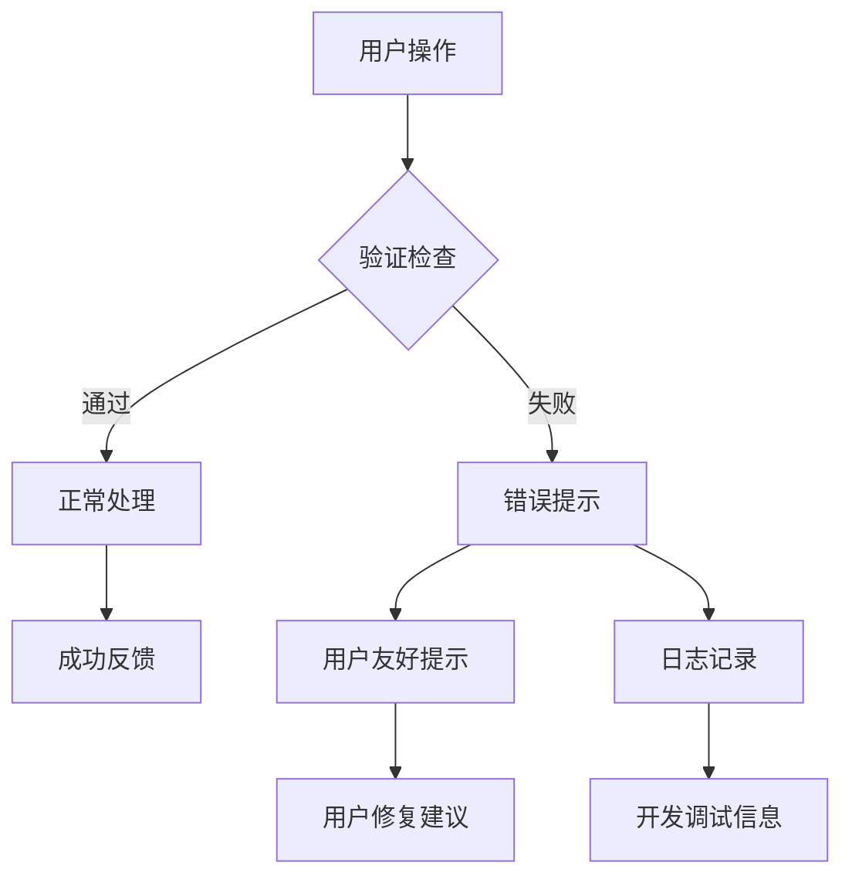

### 用户体验优化

- **即时反馈**：所有用户操作都有即时视觉反馈
- **智能提示**：超出限制时提供友好的提示信息
- **无障碍支持**：完整的键盘导航和屏幕阅读器支持
- **响应式设计**：适配各种屏幕尺寸和设备

### 性能监控

组件集成了性能监控机制：

- **长任务检测**：检测影响用户体验的长任务
- **FPS监控**：实时监控界面流畅度
- **内存使用监控**：跟踪内存使用情况

## 扩展性设计

### 插件化架构

组件采用插件化设计，支持功能扩展：

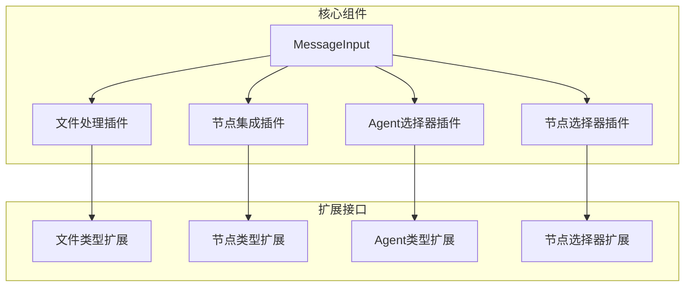

### 配置化设计

组件支持高度配置化：

- **主题定制**：支持深色/浅色主题切换
- **功能开关**：可配置的功能模块启用/禁用
- **行为定制**：可定制的交互行为和默认值

### API设计

组件提供了丰富的API接口：

- **回调函数**：onSend、onSwitchAgent等
- **状态查询**：canSend、hasContent等
- **方法暴露**：focus、blur等DOM操作方法

## 总结

增强的消息输入组件是KunFlix平台的核心创新之一，它将传统的文本输入升级为多模态、智能化的创作工具。通过精心设计的架构和丰富的功能特性，该组件为影视广告创作提供了专业级的用户体验。

### 主要优势

1. **多模态支持**：全面支持文本、图片、视频等多种内容类型
2. **智能集成**：与创作画布无缝集成，提升创作效率
3. **实时响应**：基于SSE的实时流式响应，提供流畅的交互体验
4. **状态管理**：完善的Zustand状态管理，确保数据一致性
5. **性能优化**：虚拟滚动、内存管理等优化策略保证高性能
6. **扩展性强**：插件化架构支持功能扩展和定制化需求
7. **工作流程优化**：Agent选择器和节点附件功能分离，改善用户体验

### 技术亮点

- **Server-Sent Events**：实现实时流式响应
- **虚拟滚动**：高效处理大量消息
- **智能文件处理**：多类型文件的智能识别和处理
- **画布节点集成**：直接从创作画布拖拽节点
- **多智能体协作**：支持复杂的协作场景
- **节点选择器**：新增的节点选择功能，提升工作效率

该组件不仅满足了当前的业务需求，还为未来的功能扩展奠定了坚实的基础，是KunFlix平台技术架构的重要组成部分。