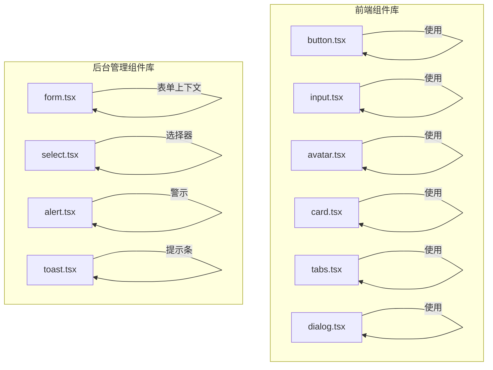
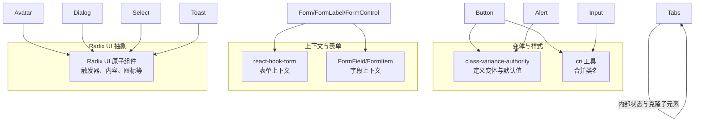
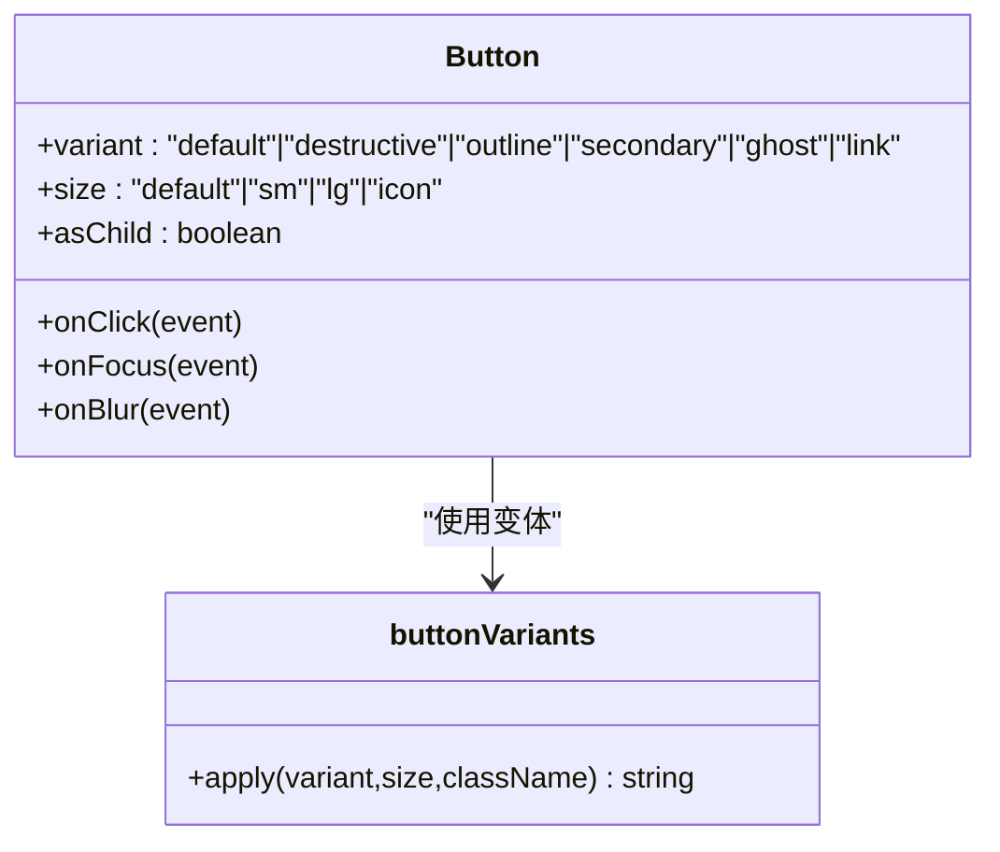
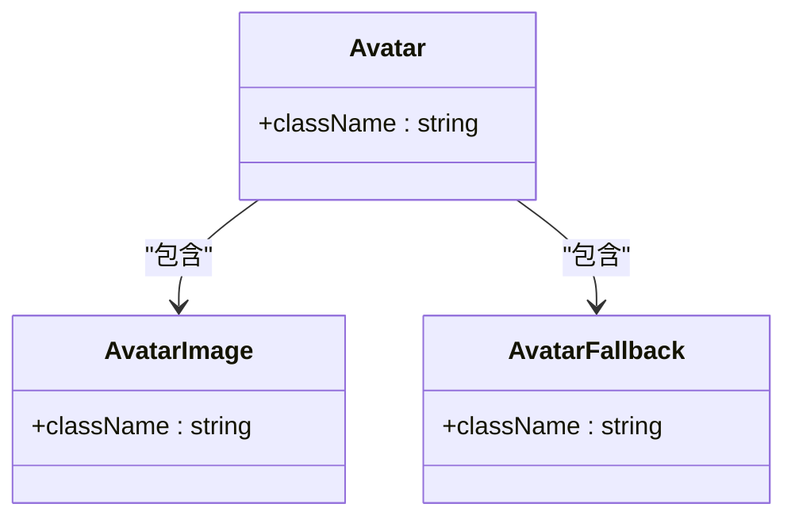
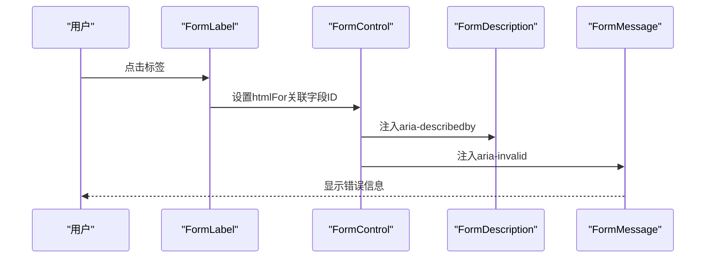
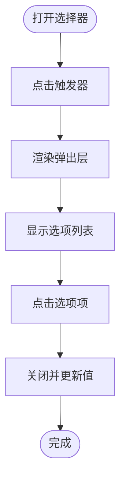
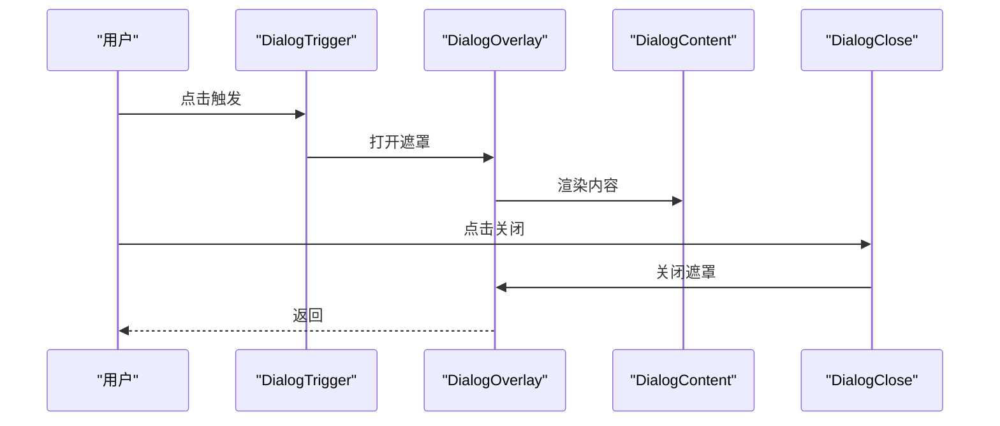
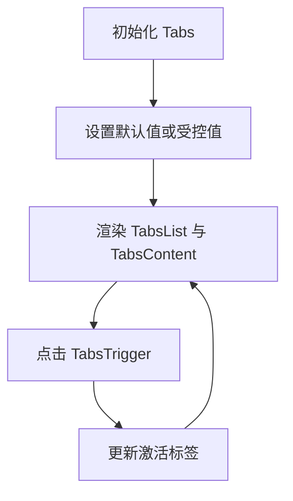
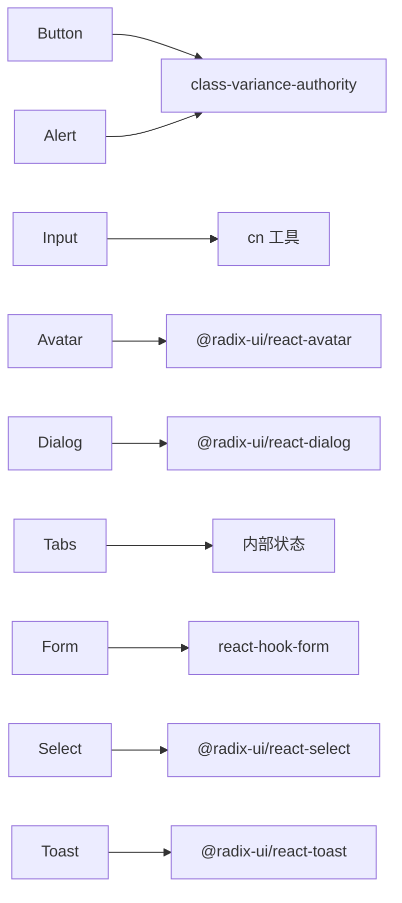

# UI组件库

<cite>
**本文引用的文件**
- [button.tsx](file://frontend/src/components/ui/button.tsx)
- [input.tsx](file://frontend/src/components/ui/input.tsx)
- [avatar.tsx](file://frontend/src/components/ui/avatar.tsx)
- [card.tsx](file://frontend/src/components/ui/card.tsx)
- [tabs.tsx](file://frontend/src/components/ui/tabs.tsx)
- [dialog.tsx](file://frontend/src/components/ui/dialog.tsx)
- [form.tsx](file://backend/admin/src/components/ui/form.tsx)
- [select.tsx](file://backend/admin/src/components/ui/select.tsx)
- [alert.tsx](file://backend/admin/src/components/ui/alert.tsx)
- [toast.tsx](file://backend/admin/src/components/ui/toast.tsx)
</cite>

## 目录
1. [简介](#简介)
2. [项目结构](#项目结构)
3. [核心组件](#核心组件)
4. [架构总览](#架构总览)
5. [组件详解](#组件详解)
6. [依赖关系分析](#依赖关系分析)
7. [性能与可访问性](#性能与可访问性)
8. [故障排查指南](#故障排查指南)
9. [结论](#结论)
10. [附录：使用示例与最佳实践](#附录使用示例与最佳实践)

## 简介
本文件为 KunFlix 的 UI 组件库文档，聚焦于基于 Ant Design 设计体系的组件实现与使用说明。内容覆盖基础组件（按钮、输入框、头像等）、表单组件（表单容器、选择器等）、反馈组件（警示、对话框、提示条等）以及布局组件（卡片、标签页等）。文档从架构、数据流、事件处理、样式与主题适配、无障碍访问、响应式与跨浏览器兼容性、组合模式、状态管理与性能优化等方面进行系统化阐述，并提供使用示例、最佳实践与扩展指南。

## 项目结构
UI 组件主要位于前端与后台管理端两处：
- 前端组件库：位于 frontend/src/components/ui，采用 Radix UI 作为底层交互抽象，结合 Tailwind CSS 类名工具与 class-variance-authority 实现变体与主题。
- 后台管理组件库：位于 backend/admin/src/components/ui，同样以 Radix UI 为基础，配合 react-hook-form 实现表单体系。

图表来源
- [button.tsx](file://frontend/src/components/ui/button.tsx)
- [input.tsx](file://frontend/src/components/ui/input.tsx)
- [avatar.tsx](file://frontend/src/components/ui/avatar.tsx)
- [card.tsx](file://frontend/src/components/ui/card.tsx)
- [tabs.tsx](file://frontend/src/components/ui/tabs.tsx)
- [dialog.tsx](file://frontend/src/components/ui/dialog.tsx)
- [form.tsx](file://backend/admin/src/components/ui/form.tsx)
- [select.tsx](file://backend/admin/src/components/ui/select.tsx)
- [alert.tsx](file://backend/admin/src/components/ui/alert.tsx)
- [toast.tsx](file://backend/admin/src/components/ui/toast.tsx)

章节来源
- [button.tsx](file://frontend/src/components/ui/button.tsx)
- [input.tsx](file://frontend/src/components/ui/input.tsx)
- [avatar.tsx](file://frontend/src/components/ui/avatar.tsx)
- [card.tsx](file://frontend/src/components/ui/card.tsx)
- [tabs.tsx](file://frontend/src/components/ui/tabs.tsx)
- [dialog.tsx](file://frontend/src/components/ui/dialog.tsx)
- [form.tsx](file://backend/admin/src/components/ui/form.tsx)
- [select.tsx](file://backend/admin/src/components/ui/select.tsx)
- [alert.tsx](file://backend/admin/src/components/ui/alert.tsx)
- [toast.tsx](file://backend/admin/src/components/ui/toast.tsx)

## 核心组件
本节概述各类型组件的职责与通用能力：
- 基础组件：提供语义化与可复用的 UI 原子能力，如按钮、输入框、头像等，强调变体与尺寸控制、可组合渲染与无障碍属性。
- 表单组件：围绕 react-hook-form 构建，提供表单项上下文、标签、控制域、描述与错误信息的统一接入。
- 反馈组件：用于信息提示与用户确认，包含警示框、对话框、提示条等，强调可访问性与动画过渡。
- 布局组件：用于页面结构组织，如卡片、标签页等，强调语义化结构与响应式布局。

章节来源
- [button.tsx](file://frontend/src/components/ui/button.tsx)
- [input.tsx](file://frontend/src/components/ui/input.tsx)
- [avatar.tsx](file://frontend/src/components/ui/avatar.tsx)
- [card.tsx](file://frontend/src/components/ui/card.tsx)
- [tabs.tsx](file://frontend/src/components/ui/tabs.tsx)
- [dialog.tsx](file://frontend/src/components/ui/dialog.tsx)
- [form.tsx](file://backend/admin/src/components/ui/form.tsx)
- [select.tsx](file://backend/admin/src/components/ui/select.tsx)
- [alert.tsx](file://backend/admin/src/components/ui/alert.tsx)
- [toast.tsx](file://backend/admin/src/components/ui/toast.tsx)

## 架构总览
组件库整体采用“变体驱动 + 上下文注入”的架构：
- 变体与类名：通过 class-variance-authority 定义组件变体与默认值，结合 cn 工具合并类名，实现主题与尺寸的灵活切换。
- 上下文与组合：表单组件通过 React Context 注入字段上下文，使标签、控制域、描述与错误信息形成统一的可访问性链路。
- 原子与复合：基础组件多为原子级封装，反馈与布局组件为复合组件，内部组合多个原子组件并提供行为逻辑。

图表来源
- [button.tsx](file://frontend/src/components/ui/button.tsx)
- [input.tsx](file://frontend/src/components/ui/input.tsx)
- [avatar.tsx](file://frontend/src/components/ui/avatar.tsx)
- [dialog.tsx](file://frontend/src/components/ui/dialog.tsx)
- [tabs.tsx](file://frontend/src/components/ui/tabs.tsx)
- [form.tsx](file://backend/admin/src/components/ui/form.tsx)
- [select.tsx](file://backend/admin/src/components/ui/select.tsx)
- [alert.tsx](file://backend/admin/src/components/ui/alert.tsx)
- [toast.tsx](file://backend/admin/src/components/ui/toast.tsx)

## 组件详解

### 基础组件

#### 按钮 Button
- 属性接口
  - 继承原生按钮属性
  - 变体 variant：default、destructive、outline、secondary、ghost、link
  - 尺寸 size：default、sm、lg、icon
  - asChild：是否将渲染委托给子元素（通过 Slot）
- 事件处理
  - 支持原生按钮事件；asChild 模式下由子元素接管事件
- 样式与主题
  - 使用变体定义前景/背景色与悬停态；尺寸控制高度与内边距
  - 通过 cn 合并外部类名，支持主题覆盖
- 无障碍与可访问性
  - 默认保持原生按钮语义；支持聚焦环与禁用态
- 示例路径
  - [button.tsx](file://frontend/src/components/ui/button.tsx)

图表来源
- [button.tsx](file://frontend/src/components/ui/button.tsx)

章节来源
- [button.tsx](file://frontend/src/components/ui/button.tsx)

#### 输入框 Input
- 属性接口
  - 继承原生 input 属性
  - 支持类型 type 与类名覆盖
- 事件处理
  - 支持 onChange、onFocus、onBlur 等原生事件
- 样式与主题
  - 统一圆角、边框、占位符颜色与聚焦态环
  - 移动端与桌面端文本大小差异化
- 无障碍与可访问性
  - 与表单标签配合时，建议通过 FormLabel 与 FormControl 提供可访问性链路
- 示例路径
  - [input.tsx](file://frontend/src/components/ui/input.tsx)

章节来源
- [input.tsx](file://frontend/src/components/ui/input.tsx)

#### 头像 Avatar
- 组件构成
  - Avatar：根容器，控制尺寸与裁剪
  - AvatarImage：图片层，填充容器
  - AvatarFallback：回退层，占位或默认头像
- 事件处理
  - 图片加载失败时自动切换到回退层
- 样式与主题
  - 圆形裁剪、尺寸一致、回退层浅色背景
- 无障碍与可访问性
  - 建议在不可见场景提供替代文本（如通过父容器语义）
- 示例路径
  - [avatar.tsx](file://frontend/src/components/ui/avatar.tsx)

图表来源
- [avatar.tsx](file://frontend/src/components/ui/avatar.tsx)

章节来源
- [avatar.tsx](file://frontend/src/components/ui/avatar.tsx)

### 表单组件

#### 表单 Form 体系
- 组成
  - Form：react-hook-form 的 FormProvider 包装
  - FormField：将 Controller 与字段上下文结合
  - FormItem：为字段生成唯一 ID 并组织布局
  - FormLabel：绑定到对应字段 ID，错误态高亮
  - FormControl：注入 aria-* 属性，连接描述与错误
  - FormDescription：辅助说明文本
  - FormMessage：错误信息展示
- 无障碍与可访问性
  - 自动注入 aria-describedby、aria-invalid，确保屏幕阅读器可读
- 示例路径
  - [form.tsx](file://backend/admin/src/components/ui/form.tsx)

图表来源
- [form.tsx](file://backend/admin/src/components/ui/form.tsx)

章节来源
- [form.tsx](file://backend/admin/src/components/ui/form.tsx)

#### 选择器 Select
- 组成
  - Select：根容器
  - SelectTrigger：触发器，含下拉图标
  - SelectContent：弹出层，含滚动按钮与视口
  - SelectItem：选项项，含选中指示器
  - SelectLabel、SelectSeparator、SelectScrollUpButton、SelectScrollDownButton
- 无障碍与可访问性
  - 使用 Portal 渲染，支持键盘导航与焦点管理
- 示例路径
  - [select.tsx](file://backend/admin/src/components/ui/select.tsx)

图表来源
- [select.tsx](file://backend/admin/src/components/ui/select.tsx)

章节来源
- [select.tsx](file://backend/admin/src/components/ui/select.tsx)

### 反馈组件

#### 警示 Alert
- 组件构成
  - Alert：容器，支持 default 与 destructive 两种变体
  - AlertTitle：标题
  - AlertDescription：描述文本
- 无障碍与可访问性
  - 容器设置 role="alert"，提升可访问性
- 示例路径
  - [alert.tsx](file://backend/admin/src/components/ui/alert.tsx)

章节来源
- [alert.tsx](file://backend/admin/src/components/ui/alert.tsx)

#### 对话框 Dialog
- 组成
  - Dialog：根容器
  - DialogTrigger、DialogClose、DialogPortal、DialogOverlay
  - DialogContent：居中内容区，含关闭按钮
  - DialogHeader、DialogFooter、DialogTitle、DialogDescription
- 无障碍与可访问性
  - 关闭按钮包含 sr-only 文本，确保可读
  - 内容区支持键盘焦点陷阱与 ESC 关闭
- 示例路径
  - [dialog.tsx](file://frontend/src/components/ui/dialog.tsx)

图表来源
- [dialog.tsx](file://frontend/src/components/ui/dialog.tsx)

章节来源
- [dialog.tsx](file://frontend/src/components/ui/dialog.tsx)

#### 提示条 Toast
- 组成
  - ToastProvider、ToastViewport：提供者与视口
  - Toast：提示条，支持 default 与 destructive
  - ToastTitle、ToastDescription：标题与描述
  - ToastAction、ToastClose：动作按钮与关闭按钮
- 无障碍与可访问性
  - 提供可滑动关闭与可访问性属性
- 示例路径
  - [toast.tsx](file://backend/admin/src/components/ui/toast.tsx)

章节来源
- [toast.tsx](file://backend/admin/src/components/ui/toast.tsx)

### 布局组件

#### 卡片 Card
- 组件构成
  - Card：卡片容器
  - CardHeader、CardTitle、CardDescription、CardContent、CardFooter
- 无障碍与可访问性
  - 语义化结构，建议在标题层级上遵循文档语义
- 示例路径
  - [card.tsx](file://frontend/src/components/ui/card.tsx)

章节来源
- [card.tsx](file://frontend/src/components/ui/card.tsx)

#### 标签页 Tabs
- 组件构成
  - Tabs：根容器，维护当前激活标签
  - TabsList：标签列表
  - TabsTrigger：标签触发器，支持受控/非受控
  - TabsContent：内容区，仅渲染当前激活项
- 事件处理
  - 触发器点击后通过回调更新激活项
- 无障碍与可访问性
  - 通过 data-active-tab 标记当前项，便于样式与可访问性联动
- 示例路径
  - [tabs.tsx](file://frontend/src/components/ui/tabs.tsx)

图表来源
- [tabs.tsx](file://frontend/src/components/ui/tabs.tsx)

章节来源
- [tabs.tsx](file://frontend/src/components/ui/tabs.tsx)

## 依赖关系分析
- 组件间耦合
  - 基础组件之间低耦合，通过共享工具函数与变体系统协作
  - 表单组件强依赖 react-hook-form 与上下文机制
  - 反馈组件依赖 Radix UI 动画与可访问性 API
- 外部依赖
  - class-variance-authority：变体系统
  - @radix-ui/react-*：可访问性与动画抽象
  - lucide-react：图标
  - react-hook-form：表单状态与验证

图表来源
- [button.tsx](file://frontend/src/components/ui/button.tsx)
- [input.tsx](file://frontend/src/components/ui/input.tsx)
- [avatar.tsx](file://frontend/src/components/ui/avatar.tsx)
- [dialog.tsx](file://frontend/src/components/ui/dialog.tsx)
- [tabs.tsx](file://frontend/src/components/ui/tabs.tsx)
- [form.tsx](file://backend/admin/src/components/ui/form.tsx)
- [select.tsx](file://backend/admin/src/components/ui/select.tsx)
- [alert.tsx](file://backend/admin/src/components/ui/alert.tsx)
- [toast.tsx](file://backend/admin/src/components/ui/toast.tsx)

章节来源
- [button.tsx](file://frontend/src/components/ui/button.tsx)
- [input.tsx](file://frontend/src/components/ui/input.tsx)
- [avatar.tsx](file://frontend/src/components/ui/avatar.tsx)
- [dialog.tsx](file://frontend/src/components/ui/dialog.tsx)
- [tabs.tsx](file://frontend/src/components/ui/tabs.tsx)
- [form.tsx](file://backend/admin/src/components/ui/form.tsx)
- [select.tsx](file://backend/admin/src/components/ui/select.tsx)
- [alert.tsx](file://backend/admin/src/components/ui/alert.tsx)
- [toast.tsx](file://backend/admin/src/components/ui/toast.tsx)

## 性能与可访问性
- 性能
  - 变体与类名计算在组件外层完成，减少重复计算
  - Tabs 内容按需渲染，避免不必要的子树挂载
  - Dialog 与 Select 使用 Portal 减少 DOM 深度对布局的影响
- 可访问性
  - 表单组件自动注入 aria-* 属性，确保屏幕阅读器可用
  - 对话框与提示条提供键盘关闭与焦点管理
  - 头像与按钮保持原生语义，避免破坏默认可访问性
- 响应式与跨浏览器
  - 组件样式使用相对单位与媒体查询，保证在不同设备上的一致表现
  - 通过 Radix UI 的动画与过渡，确保在现代浏览器中的流畅体验

## 故障排查指南
- 表单相关
  - 若 FormLabel 不生效，请检查是否包裹在 FormField 中
  - 若 FormControl 未显示错误，请确认字段已注册且存在错误对象
- 选择器相关
  - 若选项无法选中，请检查 SelectItem 是否在 SelectContent 内
  - 若滚动按钮无效，请确认 SelectContent 的 viewport 配置正确
- 对话框相关
  - 若遮罩点击无效，请确认 DialogOverlay 与 DialogPortal 正确嵌套
  - 若关闭按钮无提示，请检查 sr-only 文本是否可见
- 提示条相关
  - 若提示条不出现，请确认 ToastProvider 已在应用根部提供
  - 若滑动关闭无效，请检查 Radix UI 动画变量是否生效

章节来源
- [form.tsx](file://backend/admin/src/components/ui/form.tsx)
- [select.tsx](file://backend/admin/src/components/ui/select.tsx)
- [dialog.tsx](file://frontend/src/components/ui/dialog.tsx)
- [toast.tsx](file://backend/admin/src/components/ui/toast.tsx)

## 结论
本组件库以 Ant Design 设计体系为蓝本，结合 Radix UI 的可访问性与 class-variance-authority 的变体系统，构建了高可组合、可定制、可扩展的 UI 基础设施。通过上下文与变体驱动的设计，组件在保持一致性的同时提供了足够的灵活性，满足从基础交互到复杂业务场景的需求。

## 附录：使用示例与最佳实践
- 组合模式
  - 使用 Tabs 将多个内容面板组合，仅渲染当前激活项
  - 使用 Card 组织信息区块，配合 Header/Title/Description 提升可读性
- 状态管理
  - 表单场景优先使用 react-hook-form 的受控/非受控模式，结合 FormItem 与 FormControl 管理字段状态
  - Tabs 支持受控与非受控两种模式，根据业务需要选择
- 性能优化
  - 将昂贵的子树放入 TabsContent，避免一次性渲染
  - 使用 asChild 将 Button 渲染为链接或其他元素，减少额外 DOM
- 主题与样式
  - 通过变体参数快速切换主题风格，必要时使用外部类名覆盖
  - 使用 cn 合并类名，避免样式冲突
- 无障碍访问
  - 表单组件自动注入可访问性属性，确保屏幕阅读器可用
  - 对话框与提示条提供键盘操作与焦点管理