# TextEffect文本效果组件

<cite>
**本文档引用的文件**
- [text-effect.tsx](file://frontend/src/components/ui/text-effect.tsx)
- [utils.ts](file://frontend/src/lib/utils.ts)
- [package.json](file://frontend/package.json)
- [TypewriterText.tsx](file://frontend/src/components/ai-assistant/TypewriterText.tsx)
- [文字生成渲染效果指南.md](file://文字生成渲染效果指南.md)
</cite>

## 目录
1. [简介](#简介)
2. [项目结构](#项目结构)
3. [核心组件](#核心组件)
4. [架构概览](#架构概览)
5. [详细组件分析](#详细组件分析)
6. [依赖关系分析](#依赖关系分析)
7. [性能考虑](#性能考虑)
8. [故障排除指南](#故障排除指南)
9. [结论](#结论)

## 简介

TextEffect是一个基于Framer Motion构建的高级文本动画组件，专为Next.js应用设计。该组件提供了丰富的文本分段动画功能，支持按字符、单词或行进行动画分割，并内置了多种预设动画效果。

该组件的核心特性包括：
- 多种动画分段模式（字符级、单词级、行级）
- 内置5种预设动画效果（模糊、抖动、缩放、淡入淡出、滑动）
- 自定义动画变体支持
- 延迟动画控制
- 触发器机制
- 无障碍支持
- 性能优化的React.memo实现

## 项目结构

TextEffect组件位于前端项目的UI组件目录中，遵循Next.js的标准项目结构：

```mermaid
graph TB
subgraph "前端项目结构"
FE[frontend/]
SRC[src/]
COMP[components/]
UI[ui/]
TEXT[text-effect.tsx]
subgraph "依赖管理"
PKG[package.json]
DEPS[framer-motion@^12.34.3]
end
FE --> SRC
SRC --> COMP
COMP --> UI
UI --> TEXT
FE --> PKG
PKG --> DEPS
end
```

**图表来源**
- [text-effect.tsx:1-225](file://frontend/src/components/ui/text-effect.tsx#L1-L225)
- [package.json:13-72](file://frontend/package.json#L13-L72)

**章节来源**
- [text-effect.tsx:1-225](file://frontend/src/components/ui/text-effect.tsx#L1-L225)
- [package.json:1-96](file://frontend/package.json#L1-L96)

## 核心组件

### 组件架构概述

TextEffect采用函数式组件设计，结合React Hooks和Framer Motion实现高性能的文本动画效果。组件的核心架构包含以下关键部分：

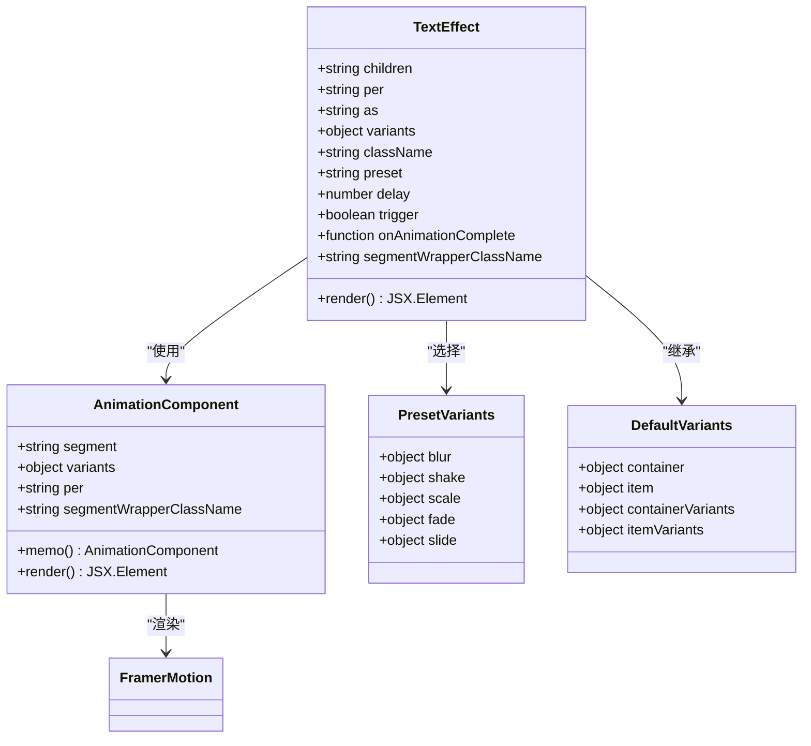

**图表来源**
- [text-effect.tsx:14-28](file://frontend/src/components/ui/text-effect.tsx#L14-L28)
- [text-effect.tsx:103-150](file://frontend/src/components/ui/text-effect.tsx#L103-L150)

### 主要属性配置

| 属性名 | 类型 | 默认值 | 描述 |
|--------|------|--------|------|
| children | string | 必需 | 要动画化的文本内容 |
| per | 'word' \| 'char' \| 'line' | 'word' | 分段粒度控制 |
| as | keyof React.JSX.IntrinsicElements | 'p' | HTML标签类型 |
| variants | object | undefined | 自定义动画变体 |
| className | string | undefined | CSS类名 |
| preset | 'blur' \| 'shake' \| 'scale' \| 'fade' \| 'slide' | undefined | 预设动画效果 |
| delay | number | 0 | 动画延迟时间（秒） |
| trigger | boolean | true | 动画触发开关 |
| onAnimationComplete | function | undefined | 动画完成回调 |
| segmentWrapperClassName | string | undefined | 分段包装器类名 |

**章节来源**
- [text-effect.tsx:14-28](file://frontend/src/components/ui/text-effect.tsx#L14-L28)
- [text-effect.tsx:152-163](file://frontend/src/components/ui/text-effect.tsx#L152-L163)

## 架构概览

### 数据流架构

TextEffect组件的数据流采用自顶向下的设计模式，确保动画状态的一致性和可控性：

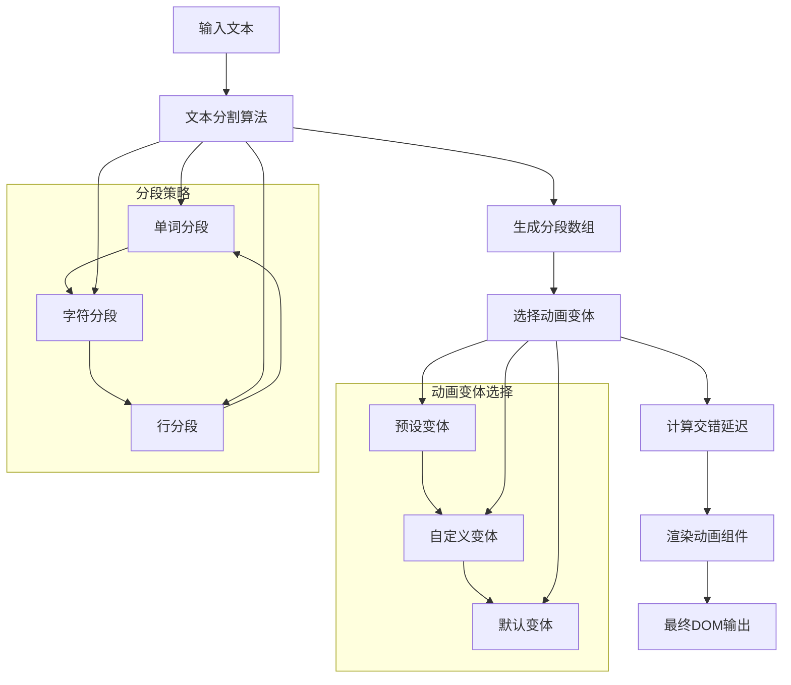

**图表来源**
- [text-effect.tsx:164-172](file://frontend/src/components/ui/text-effect.tsx#L164-L172)
- [text-effect.tsx:175-177](file://frontend/src/components/ui/text-effect.tsx#L175-L177)

### 动画生命周期

组件的动画生命周期通过Framer Motion的AnimatePresence实现，支持进入、保持和退出三种状态：

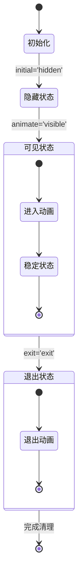

**图表来源**
- [text-effect.tsx:200-223](file://frontend/src/components/ui/text-effect.tsx#L200-L223)

## 详细组件分析

### 文本分割算法

TextEffect实现了智能的文本分割逻辑，支持三种不同的分段策略：

#### 字符级分段
字符级分段提供最精细的动画控制，适用于需要逐字符动画的场景：

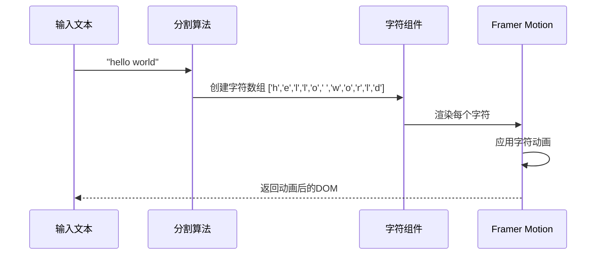

**图表来源**
- [text-effect.tsx:170-172](file://frontend/src/components/ui/text-effect.tsx#L170-L172)
- [text-effect.tsx:137-147](file://frontend/src/components/ui/text-effect.tsx#L137-L147)

#### 单词级分段
单词级分段是默认的分段方式，提供平衡的性能和视觉效果：

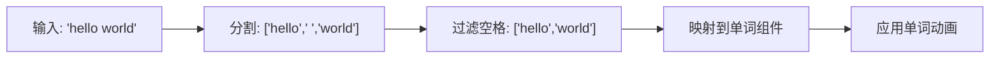

**图表来源**
- [text-effect.tsx:168-169](file://frontend/src/components/ui/text-effect.tsx#L168-L169)

#### 行级分段
行级分段适用于多行文本的块级动画效果：

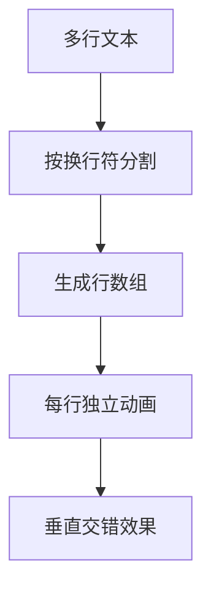

**图表来源**
- [text-effect.tsx:166-167](file://frontend/src/components/ui/text-effect.tsx#L166-L167)

### 预设动画系统

TextEffect内置了五种经过精心设计的预设动画效果：

#### 模糊动画 (Blur)
模糊动画通过CSS滤镜实现平滑的焦点切换效果：

| 状态 | CSS属性 | 值 |
|------|---------|-----|
| 隐藏 | opacity | 0 |
| 隐藏 | filter | blur(12px) |
| 可见 | opacity | 1 |
| 可见 | filter | blur(0px) |
| 退出 | opacity | 0 |
| 退出 | filter | blur(12px) |

#### 抖动动画 (Shake)
抖动动画使用X轴位移创建动态的震动效果：

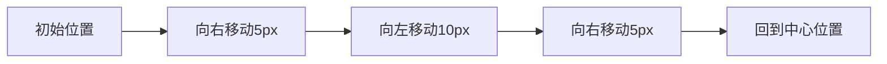

#### 缩放动画 (Scale)
缩放动画通过变换矩阵实现平滑的缩放过渡：

| 状态 | CSS属性 | 值 |
|------|---------|-----|
| 隐藏 | opacity | 0 |
| 隐藏 | scale | 0 |
| 可见 | opacity | 1 |
| 可见 | scale | 1 |
| 退出 | opacity | 0 |
| 退出 | scale | 0 |

#### 淡入淡出 (Fade)
最简单的透明度动画，适合基础的显示隐藏效果：

| 状态 | CSS属性 | 值 |
|------|---------|-----|
| 隐藏 | opacity | 0 |
| 可见 | opacity | 1 |
| 退出 | opacity | 0 |

#### 滑动动画 (Slide)
滑动动画通过Y轴位移创建从下方出现的效果：

| 状态 | CSS属性 | 值 |
|------|---------|-----|
| 隐藏 | opacity | 0 |
| 隐藏 | y | 20px |
| 可见 | opacity | 1 |
| 可见 | y | 0px |
| 退出 | opacity | 0 |
| 退出 | y | 20px |

**章节来源**
- [text-effect.tsx:57-101](file://frontend/src/components/ui/text-effect.tsx#L57-L101)

### 自定义动画变体

组件支持完全自定义的动画变体，允许开发者创建独特的动画效果：

#### 容器变体 (Container Variants)
容器变体控制整个动画序列的协调和交错：

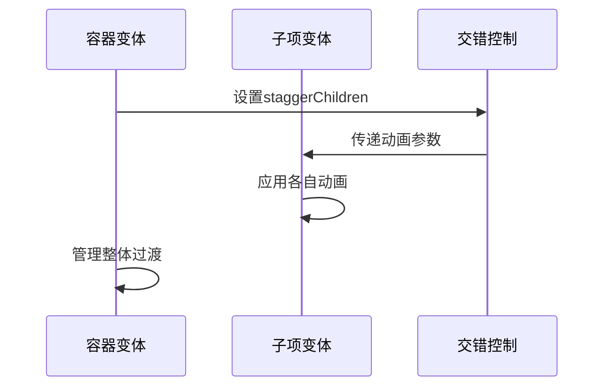

#### 子项变体 (Item Variants)
子项变体定义单个文本片段的动画行为：

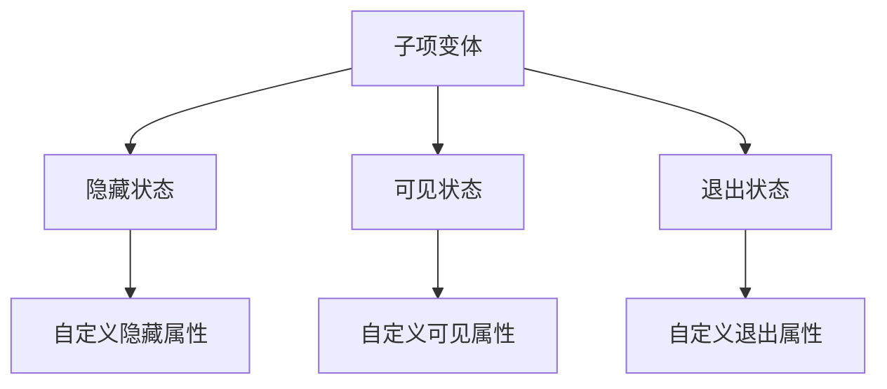

**章节来源**
- [text-effect.tsx:174-179](file://frontend/src/components/ui/text-effect.tsx#L174-L179)

### 性能优化策略

TextEffect采用了多项性能优化技术确保流畅的动画体验：

#### React.memo优化
AnimationComponent使用React.memo防止不必要的重渲染：

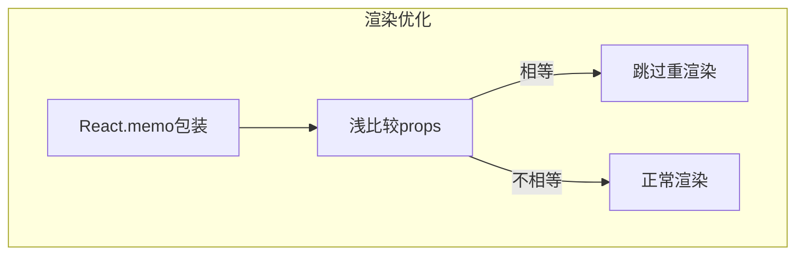

#### 动画延迟控制
组件支持精确的动画延迟控制，避免同时播放大量动画造成性能问题：

| 分段粒度 | 默认延迟 | 适用场景 |
|----------|----------|----------|
| 字符级 | 0.03秒 | 需要细腻动画效果 |
| 单词级 | 0.05秒 | 平衡性能和效果 |
| 行级 | 0.1秒 | 大量文本的块级动画 |

**章节来源**
- [text-effect.tsx:103-150](file://frontend/src/components/ui/text-effect.tsx#L103-L150)
- [text-effect.tsx:30-34](file://frontend/src/components/ui/text-effect.tsx#L30-L34)

## 依赖关系分析

### 外部依赖

TextEffect组件依赖于以下关键外部库：

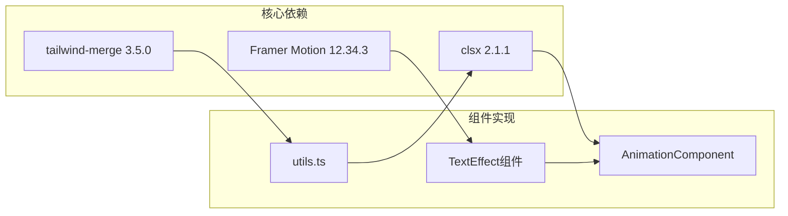

**图表来源**
- [package.json:49-71](file://frontend/package.json#L49-L71)
- [text-effect.tsx](file://frontend/src/components/ui/text-effect.tsx#L3)

### 内部依赖关系

组件内部的模块依赖关系清晰且解耦：

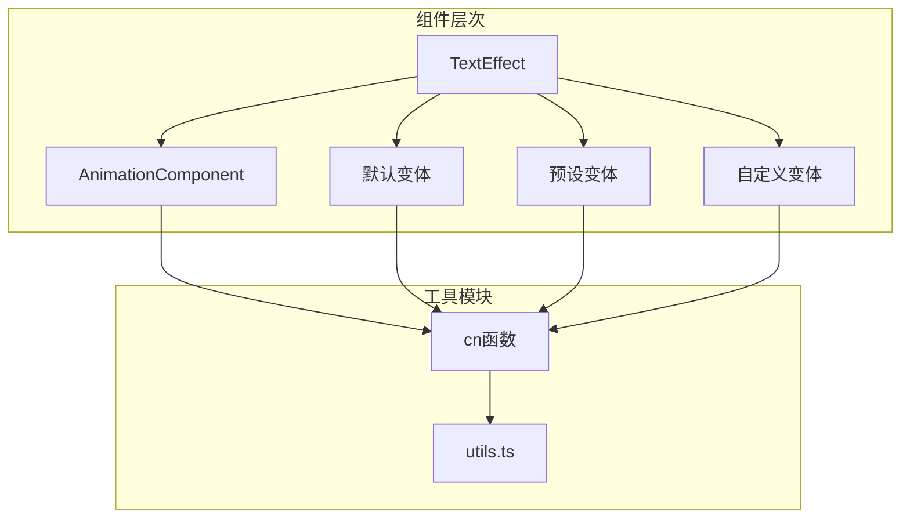

**图表来源**
- [text-effect.tsx:1-10](file://frontend/src/components/ui/text-effect.tsx#L1-L10)
- [utils.ts:1-7](file://frontend/src/lib/utils.ts#L1-L7)

**章节来源**
- [package.json:13-72](file://frontend/package.json#L13-L72)
- [text-effect.tsx:1-10](file://frontend/src/components/ui/text-effect.tsx#L1-L10)
- [utils.ts:1-7](file://frontend/src/lib/utils.ts#L1-L7)

## 性能考虑

### 动画性能优化

TextEffect在设计时充分考虑了性能因素，采用以下优化策略：

#### 渲染优化
- 使用React.memo减少不必要的组件重渲染
- 通过Fragment避免额外的DOM节点
- 智能的条件渲染逻辑

#### 动画优化
- 合理的stagger延迟设置
- 优化的CSS属性动画
- 适当的动画缓存

#### 内存管理
- 及时清理动画相关的事件监听器
- 避免内存泄漏的闭包引用

### 最佳实践建议

1. **选择合适的分段粒度**：对于大量文本，优先考虑单词级或行级分段
2. **合理设置延迟**：避免过长的延迟影响用户体验
3. **使用预设动画**：在大多数情况下使用内置预设获得最佳性能
4. **监控动画数量**：同时运行的动画数量不宜过多

## 故障排除指南

### 常见问题及解决方案

#### 动画不生效
**症状**：TextEffect组件渲染但没有动画效果
**可能原因**：
- 缺少Framer Motion依赖
- trigger属性设置为false
- CSS样式冲突

**解决方案**：
1. 确认framer-motion已正确安装
2. 检查trigger属性是否为true
3. 验证CSS类名冲突

#### 文本分段异常
**症状**：文本分割不符合预期
**可能原因**：
- 正则表达式匹配问题
- 特殊字符处理不当
- 空白字符处理错误

**解决方案**：
1. 检查输入文本的特殊字符
2. 验证正则表达式的正确性
3. 考虑使用自定义分段逻辑

#### 性能问题
**症状**：大量文本动画导致页面卡顿
**可能原因**：
- 字符级分段用于大量文本
- 同时运行过多动画
- 动画延迟设置不当

**解决方案**：
1. 改用单词级或行级分段
2. 减少同时运行的动画数量
3. 优化动画延迟设置

**章节来源**
- [text-effect.tsx:166-172](file://frontend/src/components/ui/text-effect.tsx#L166-L172)
- [text-effect.tsx:200-223](file://frontend/src/components/ui/text-effect.tsx#L200-L223)

## 结论

TextEffect文本效果组件是一个功能强大且高度优化的React组件，它成功地将复杂的文本动画功能封装在一个易于使用的接口中。组件的设计体现了以下核心优势：

### 技术优势
- **高度可定制性**：支持预设动画和完全自定义变体
- **性能优化**：采用多种优化策略确保流畅体验
- **易用性**：简洁的API设计降低使用门槛
- **可访问性**：内置无障碍支持提升用户体验

### 应用场景
TextEffect适用于各种需要文本动画的场景：
- 产品介绍页面的标题动画
- 用户引导和教程中的文本强调
- 数据可视化中的标签动画
- 交互式内容的动态展示

### 发展前景
随着前端动画需求的不断增长，TextEffect组件为Next.js应用提供了强大的文本动画解决方案。其模块化的设计和丰富的配置选项使其能够适应各种复杂的动画需求，是现代Web开发中不可或缺的UI组件之一。