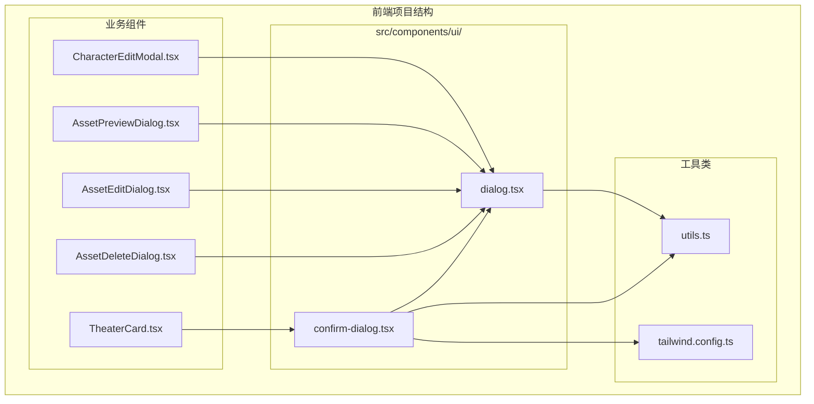
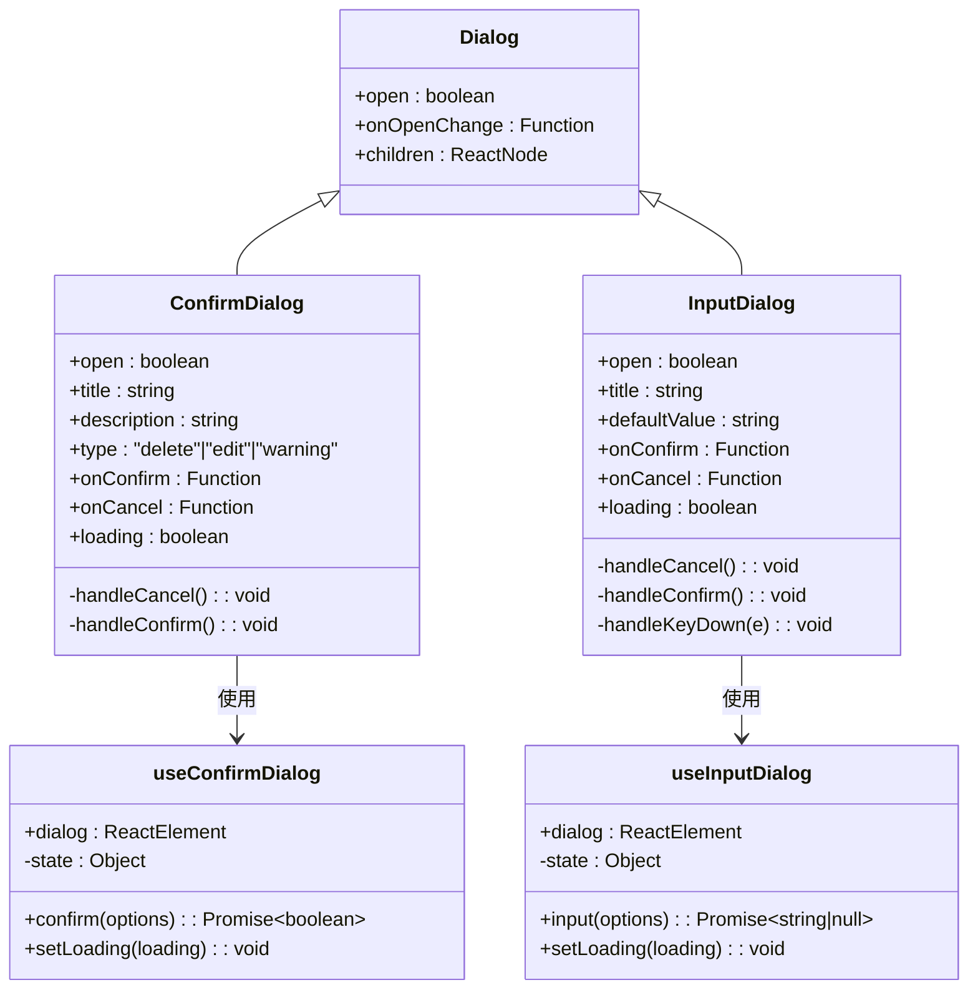
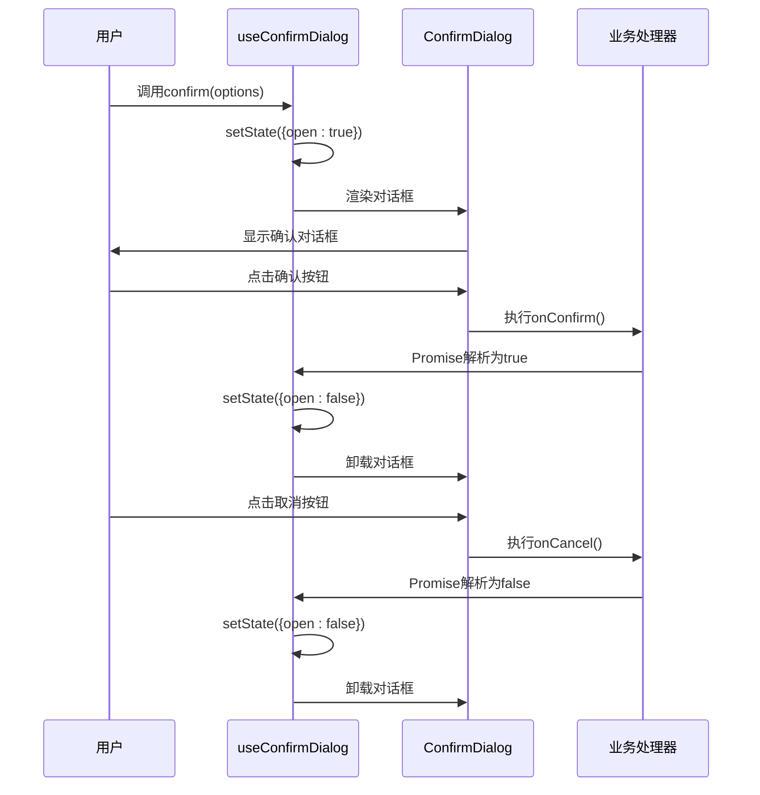
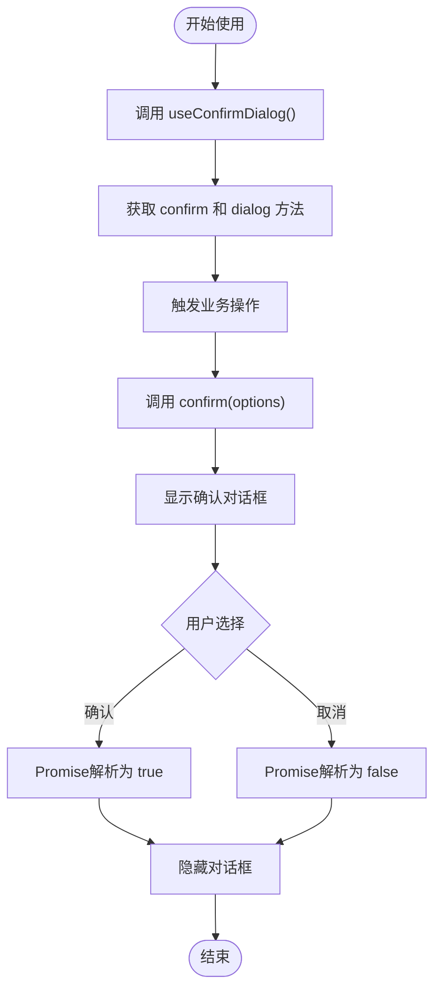
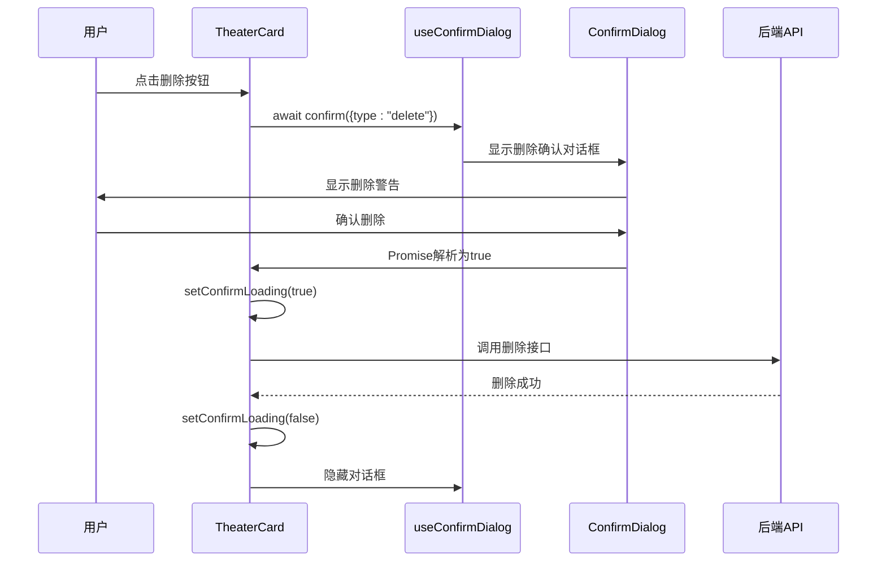
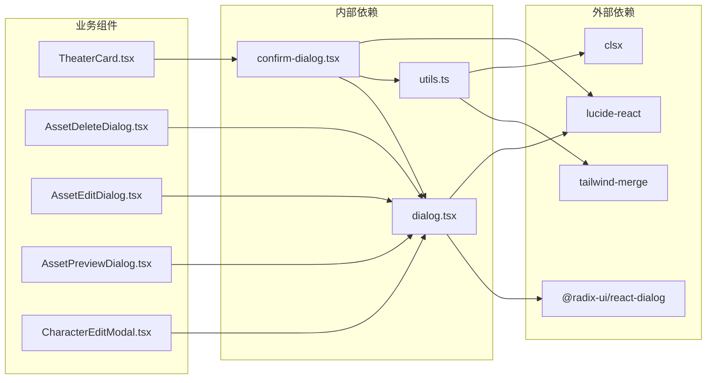

# 确认对话框组件

<cite>
**本文档引用的文件**
- [confirm-dialog.tsx](file://frontend/src/components/ui/confirm-dialog.tsx)
- [dialog.tsx](file://frontend/src/components/ui/dialog.tsx)
- [TheaterCard.tsx](file://frontend/src/components/home/TheaterCard.tsx)
- [AssetDeleteDialog.tsx](file://frontend/src/components/resources/AssetDeleteDialog.tsx)
- [AssetEditDialog.tsx](file://frontend/src/components/resources/AssetEditDialog.tsx)
- [AssetPreviewDialog.tsx](file://frontend/src/components/resources/AssetPreviewDialog.tsx)
- [CharacterEditModal.tsx](file://frontend/src/components/canvas/CharacterEditModal.tsx)
- [utils.ts](file://frontend/src/lib/utils.ts)
- [tailwind.config.ts](file://frontend/tailwind.config.ts)
- [layout.tsx](file://frontend/src/app/layout.tsx)
</cite>

## 目录
1. [简介](#简介)
2. [项目结构](#项目结构)
3. [核心组件](#核心组件)
4. [架构概览](#架构概览)
5. [详细组件分析](#详细组件分析)
6. [依赖关系分析](#依赖关系分析)
7. [性能考虑](#性能考虑)
8. [故障排除指南](#故障排除指南)
9. [结论](#结论)

## 简介

确认对话框组件是本项目前端UI系统中的重要交互元素，主要用于处理用户需要确认的重要操作。该组件提供了统一的确认对话框界面，支持多种操作类型（删除、编辑、警告），并集成了现代化的用户体验设计。

该组件基于React Hooks模式实现，采用Promise风格的异步处理机制，为开发者提供简洁易用的API接口。组件设计遵循Material Design原则，具有良好的可访问性和响应式特性。

## 项目结构

确认对话框组件位于前端项目的UI组件目录中，采用模块化的设计方式：



**图表来源**
- [confirm-dialog.tsx:1-385](file://frontend/src/components/ui/confirm-dialog.tsx#L1-L385)
- [dialog.tsx:1-121](file://frontend/src/components/ui/dialog.tsx#L1-L121)

**章节来源**
- [confirm-dialog.tsx:1-385](file://frontend/src/components/ui/confirm-dialog.tsx#L1-L385)
- [dialog.tsx:1-121](file://frontend/src/components/ui/dialog.tsx#L1-L121)

## 核心组件

确认对话框组件由三个主要部分组成：

### 1. 基础对话框组件
- **Dialog**: Radix UI基础对话框容器
- **DialogContent**: 对话框内容区域
- **DialogHeader/DialogFooter**: 对话框头部和底部布局
- **DialogTitle/DialogDescription**: 标题和描述文本

### 2. 确认对话框组件
- **ConfirmDialog**: 主要的确认对话框组件
- **useConfirmDialog**: 自定义Hook，提供Promise风格的确认机制
- 支持三种操作类型：删除(delete)、编辑(edit)、警告(warning)

### 3. 输入对话框组件
- **InputDialog**: 文本输入对话框
- **useInputDialog**: 自定义Hook，用于获取用户输入

**章节来源**
- [confirm-dialog.tsx:34-129](file://frontend/src/components/ui/confirm-dialog.tsx#L34-L129)
- [confirm-dialog.tsx:131-194](file://frontend/src/components/ui/confirm-dialog.tsx#L131-L194)
- [confirm-dialog.tsx:196-384](file://frontend/src/components/ui/confirm-dialog.tsx#L196-L384)

## 架构概览

确认对话框组件采用了分层架构设计，确保了组件间的松耦合和高内聚：



**图表来源**
- [confirm-dialog.tsx:47-129](file://frontend/src/components/ui/confirm-dialog.tsx#L47-L129)
- [confirm-dialog.tsx:140-194](file://frontend/src/components/ui/confirm-dialog.tsx#L140-L194)
- [confirm-dialog.tsx:211-317](file://frontend/src/components/ui/confirm-dialog.tsx#L211-L317)
- [confirm-dialog.tsx:329-384](file://frontend/src/components/ui/confirm-dialog.tsx#L329-L384)

## 详细组件分析

### ConfirmDialog 组件

ConfirmDialog是确认对话框的核心组件，提供了完整的确认交互功能：

#### 组件特性
- **类型化图标**: 根据操作类型显示不同的图标和颜色
- **响应式设计**: 支持移动端和桌面端的适配
- **加载状态**: 支持异步操作的加载指示
- **键盘导航**: 支持Enter和Escape键操作

#### 类型配置
组件支持三种预设的操作类型：

| 类型 | 图标 | 颜色方案 | 用途 |
|------|------|----------|------|
| delete | Trash2 | 红色系 | 危险操作确认 |
| edit | Edit3 | 主色调 | 编辑操作确认 |
| warning | AlertTriangle | 黄色系 | 普通警告提示 |

#### 交互流程



**图表来源**
- [confirm-dialog.tsx:153-176](file://frontend/src/components/ui/confirm-dialog.tsx#L153-L176)
- [confirm-dialog.tsx:62-69](file://frontend/src/components/ui/confirm-dialog.tsx#L62-L69)

**章节来源**
- [confirm-dialog.tsx:47-129](file://frontend/src/components/ui/confirm-dialog.tsx#L47-L129)
- [confirm-dialog.tsx:16-32](file://frontend/src/components/ui/confirm-dialog.tsx#L16-L32)

### useConfirmDialog Hook

useConfirmDialog是一个自定义Hook，提供了Promise风格的确认机制：

#### 核心功能
- **Promise返回**: 返回Promise对象，简化异步处理
- **状态管理**: 内部维护对话框状态和回调函数
- **加载控制**: 支持动态设置加载状态
- **自动清理**: 自动处理对话框关闭后的状态清理

#### 使用模式



**图表来源**
- [confirm-dialog.tsx:140-194](file://frontend/src/components/ui/confirm-dialog.tsx#L140-L194)

**章节来源**
- [confirm-dialog.tsx:140-194](file://frontend/src/components/ui/confirm-dialog.tsx#L140-L194)

### 实际应用场景

#### 剧场卡片组件中的应用

在TheaterCard组件中，确认对话框被用于安全删除操作：



**图表来源**
- [TheaterCard.tsx:168-189](file://frontend/src/components/home/TheaterCard.tsx#L168-L189)
- [confirm-dialog.tsx:178-191](file://frontend/src/components/ui/confirm-dialog.tsx#L178-L191)

**章节来源**
- [TheaterCard.tsx:168-189](file://frontend/src/components/home/TheaterCard.tsx#L168-L189)

#### 资源管理中的应用

在资源管理组件中，确认对话框被用于不同类型的资源操作：

| 组件 | 操作类型 | 使用场景 |
|------|----------|----------|
| AssetDeleteDialog | delete | 删除资源文件 |
| AssetEditDialog | edit | 重命名或替换资源 |
| CharacterEditModal | warning | 编辑角色时的变更提醒 |

**章节来源**
- [AssetDeleteDialog.tsx:16-32](file://frontend/src/components/resources/AssetDeleteDialog.tsx#L16-L32)
- [AssetEditDialog.tsx:16-41](file://frontend/src/components/resources/AssetEditDialog.tsx#L16-L41)
- [CharacterEditModal.tsx:40-57](file://frontend/src/components/canvas/CharacterEditModal.tsx#L40-L57)

## 依赖关系分析

确认对话框组件的依赖关系清晰明确，遵循了最小依赖原则：



**图表来源**
- [confirm-dialog.tsx:1-13](file://frontend/src/components/ui/confirm-dialog.tsx#L1-L13)
- [dialog.tsx:1-5](file://frontend/src/components/ui/dialog.tsx#L1-L5)
- [utils.ts:1-6](file://frontend/src/lib/utils.ts#L1-L6)

### 关键依赖说明

1. **@radix-ui/react-dialog**: 提供无障碍的对话框基础功能
2. **lucide-react**: 提供精美的SVG图标库
3. **tailwind-merge & clsx**: 提供CSS类名合并工具
4. **React Hooks**: 利用useState和useCallback优化性能

**章节来源**
- [confirm-dialog.tsx:1-13](file://frontend/src/components/ui/confirm-dialog.tsx#L1-L13)
- [dialog.tsx:1-5](file://frontend/src/components/ui/dialog.tsx#L1-L5)
- [utils.ts:1-6](file://frontend/src/lib/utils.ts#L1-L6)

## 性能考虑

确认对话框组件在设计时充分考虑了性能优化：

### 1. 渲染优化
- 使用React.memo避免不必要的重新渲染
- useCallback优化回调函数引用
- 条件渲染减少DOM节点数量

### 2. 内存管理
- 自动清理Promise解析器
- 及时释放事件监听器
- 合理的状态更新策略

### 3. 用户体验优化
- 加载状态指示提升反馈速度
- 键盘快捷键支持
- 动画过渡效果

## 故障排除指南

### 常见问题及解决方案

#### 1. 对话框无法显示
**症状**: 调用confirm()后对话框不出现
**可能原因**:
- 未正确渲染dialog元素
- 父组件状态管理问题
- 样式冲突导致隐藏

**解决方法**:
```typescript
// 确保正确渲染dialog
return (
  <>
    {confirmDialog}
    {inputDialog}
  </>
);
```

#### 2. 确认按钮无响应
**症状**: 点击确认按钮没有反应
**可能原因**:
- onConfirm回调未正确绑定
- Promise未正确解析
- 状态更新失败

**解决方法**:
```typescript
const handleDelete = async () => {
  const confirmed = await confirm({
    title: "删除确认",
    description: "此操作不可撤销",
    type: "delete"
  });
  
  if (confirmed) {
    // 执行删除逻辑
  }
};
```

#### 3. 加载状态异常
**症状**: 加载指示器不显示或不消失
**可能原因**:
- setLoading调用时机错误
- 异步操作异常中断
- 状态同步问题

**解决方法**:
```typescript
try {
  setConfirmLoading(true);
  await deleteOperation();
} finally {
  setConfirmLoading(false);
}
```

**章节来源**
- [confirm-dialog.tsx:164-176](file://frontend/src/components/ui/confirm-dialog.tsx#L164-L176)
- [TheaterCard.tsx:181-188](file://frontend/src/components/home/TheaterCard.tsx#L181-L188)

## 结论

确认对话框组件是本项目UI系统中的重要组成部分，具有以下特点：

### 设计优势
- **模块化设计**: 组件职责单一，易于维护和测试
- **类型安全**: TypeScript支持完整的类型检查
- **可扩展性**: 支持自定义操作类型和样式
- **用户体验**: 提供一致的交互模式和视觉反馈

### 技术特色
- **Promise模式**: 简化的异步处理流程
- **Hook模式**: 函数式组件的最佳实践
- **响应式设计**: 适配多设备屏幕尺寸
- **无障碍支持**: 符合WCAG标准的可访问性

### 应用价值
该组件已在多个业务场景中得到验证，包括资源管理、剧场操作、角色编辑等关键功能模块。其稳定可靠的性能表现和良好的用户体验得到了开发团队和用户的广泛认可。

通过持续的优化和改进，确认对话框组件将继续为项目提供高质量的用户交互体验，成为前端开发的优秀参考实现。