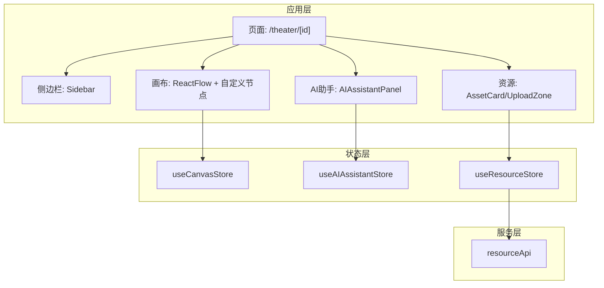
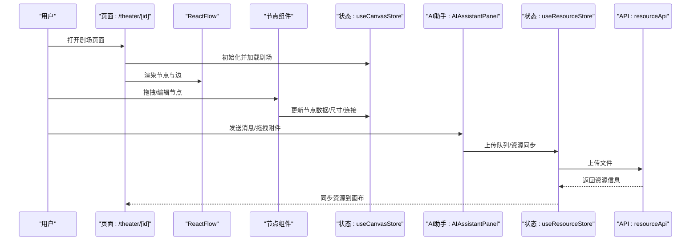
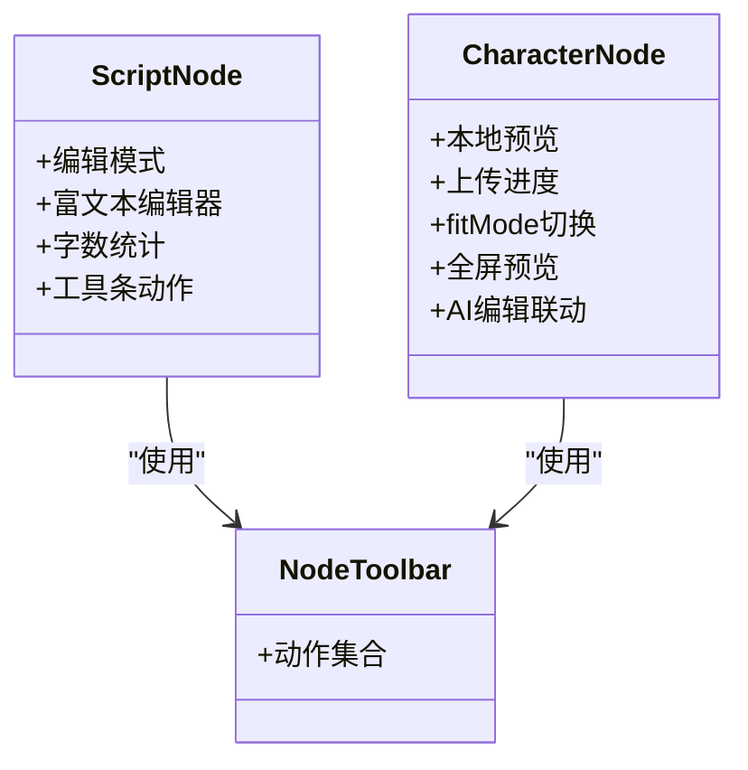
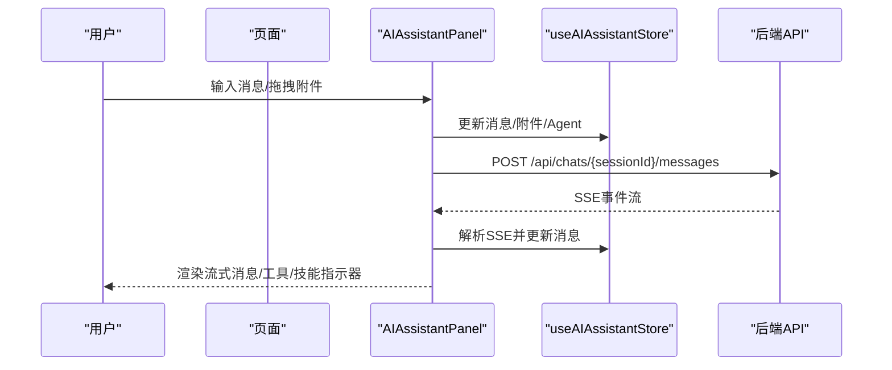
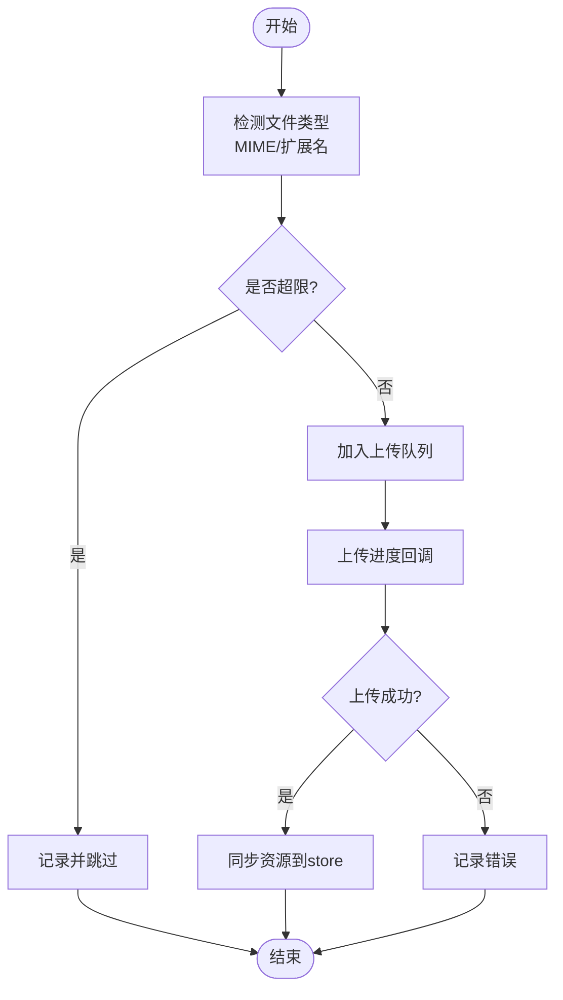
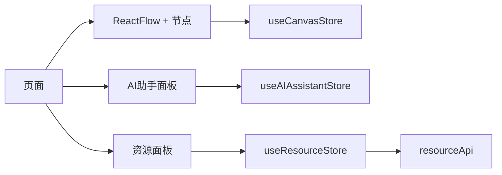

# 前端组件系统

<cite>
**本文档引用的文件**
- [TheaterCanvas.tsx](file://frontend/src/components/TheaterCanvas.tsx)
- [AIAssistantPanel.tsx](file://frontend/src/components/canvas/AIAssistantPanel.tsx)
- [ChatMessage.tsx](file://frontend/src/components/ai-assistant/ChatMessage.tsx)
- [AssetCard.tsx](file://frontend/src/components/resources/AssetCard.tsx)
- [UploadZone.tsx](file://frontend/src/components/resources/UploadZone.tsx)
- [CharacterNode.tsx](file://frontend/src/components/canvas/CharacterNode.tsx)
- [ScriptNode.tsx](file://frontend/src/components/canvas/ScriptNode.tsx)
- [ScriptEditor.tsx](file://frontend/src/components/canvas/ScriptEditor.tsx)
- [Sidebar.tsx](file://frontend/src/components/canvas/Sidebar.tsx)
- [useCanvasStore.ts](file://frontend/src/store/useCanvasStore.ts)
- [useAIAssistantStore.ts](file://frontend/src/store/useAIAssistantStore.ts)
- [useResourceStore.ts](file://frontend/src/store/useResourceStore.ts)
- [resourceApi.ts](file://frontend/src/lib/resourceApi.ts)
- [button.tsx](file://frontend/src/components/ui/button.tsx)
- [page.tsx](file://frontend/src/app/theater/[id]/page.tsx)
</cite>

## 目录
1. [简介](#简介)
2. [项目结构](#项目结构)
3. [核心组件](#核心组件)
4. [架构总览](#架构总览)
5. [详细组件分析](#详细组件分析)
6. [依赖关系分析](#依赖关系分析)
7. [性能考虑](#性能考虑)
8. [故障排查指南](#故障排查指南)
9. [结论](#结论)
10. [附录](#附录)

## 简介
本文件面向KunFlix前端组件系统，围绕基于Next.js的组件层次设计、状态管理策略与路由系统进行系统化说明。重点覆盖画布编辑器（TheaterCanvas、CharacterNode、ScriptNode等）、AI助手组件（AIAssistantPanel、ChatMessage等）、资源管理组件（AssetCard、UploadZone等）以及UI组件库，并解释其视觉外观、行为模式、用户交互、属性/事件、自定义选项与组合模式。同时提供响应式设计指南、无障碍访问合规建议、跨浏览器兼容性要点，以及状态管理、性能优化与组件间集成的最佳实践。

## 项目结构
前端采用模块化组织，按功能域划分目录：
- components：页面级组件与业务组件（画布、AI助手、资源管理、UI库）
- store：状态管理（Zustand）
- lib：底层API封装与工具
- app：Next.js应用路由与页面入口
- hooks：自定义Hook（拖拽、吸附、快捷键等）

图表来源
- [page.tsx:1-912](file://frontend/src/app/theater/[id]/page.tsx#L1-L912)
- [Sidebar.tsx:1-341](file://frontend/src/components/canvas/Sidebar.tsx#L1-L341)
- [useCanvasStore.ts:1-540](file://frontend/src/store/useCanvasStore.ts#L1-L540)
- [useAIAssistantStore.ts:1-381](file://frontend/src/store/useAIAssistantStore.ts#L1-L381)
- [useResourceStore.ts:1-182](file://frontend/src/store/useResourceStore.ts#L1-L182)
- [resourceApi.ts:1-109](file://frontend/src/lib/resourceApi.ts#L1-L109)

章节来源
- [page.tsx:1-912](file://frontend/src/app/theater/[id]/page.tsx#L1-L912)

## 核心组件
- 画布编辑器
  - TheaterCanvas：基于PIXI.js的画布容器（客户端渲染），用于承载基础图形元素（示例文本）。
  - ReactFlow + 自定义节点：ScriptNode、CharacterNode、StoryboardNode、VideoNode。
- AI助手组件
  - AIAssistantPanel：浮动聊天面板，支持拖拽附件、Agent切换、SSE流式接收、虚拟滚动、性能监控。
  - ChatMessage：消息渲染组件，支持Markdown、代码块懒加载、图片懒加载、思考面板、工具/技能调用指示器等。
- 资源管理组件
  - AssetCard：资源卡片，支持预览、重命名、替换、删除、悬浮菜单。
  - UploadZone：拖拽上传区，支持多类型文件、尺寸限制、上传队列、进度反馈。
- UI组件库
  - Button等：基于Radix UI与Tailwind的可变式组件，提供主题与尺寸变体。

章节来源
- [TheaterCanvas.tsx:1-50](file://frontend/src/components/TheaterCanvas.tsx#L1-L50)
- [ScriptNode.tsx:1-253](file://frontend/src/components/canvas/ScriptNode.tsx#L1-L253)
- [CharacterNode.tsx:1-588](file://frontend/src/components/canvas/CharacterNode.tsx#L1-L588)
- [AIAssistantPanel.tsx:1-613](file://frontend/src/components/canvas/AIAssistantPanel.tsx#L1-L613)
- [ChatMessage.tsx:1-421](file://frontend/src/components/ai-assistant/ChatMessage.tsx#L1-L421)
- [AssetCard.tsx:1-132](file://frontend/src/components/resources/AssetCard.tsx#L1-L132)
- [UploadZone.tsx:1-129](file://frontend/src/components/resources/UploadZone.tsx#L1-L129)
- [button.tsx:1-57](file://frontend/src/components/ui/button.tsx#L1-L57)

## 架构总览
系统采用“页面-组件-状态-服务”分层：
- 页面层：Next.js路由页面负责初始化、鉴权、加载剧场数据与挂载画布。
- 组件层：业务组件通过ReactFlow承载节点，通过AI助手面板与后端交互，通过资源面板管理媒体。
- 状态层：Zustand store管理画布、AI会话、资源上传队列等状态，并持久化到localStorage。
- 服务层：resourceApi封装资源列表、上传、更新、删除等操作。

图表来源
- [page.tsx:1-912](file://frontend/src/app/theater/[id]/page.tsx#L1-L912)
- [useCanvasStore.ts:1-540](file://frontend/src/store/useCanvasStore.ts#L1-L540)
- [useAIAssistantStore.ts:1-381](file://frontend/src/store/useAIAssistantStore.ts#L1-L381)
- [useResourceStore.ts:1-182](file://frontend/src/store/useResourceStore.ts#L1-L182)
- [resourceApi.ts:1-109](file://frontend/src/lib/resourceApi.ts#L1-L109)

## 详细组件分析

### 画布编辑器
- TheaterCanvas
  - 角色：轻量画布容器，动态导入PIXI.js并在客户端初始化应用实例。
  - 关键点：width/height参数控制画布尺寸；卸载时销毁PIXI应用；默认背景色与示例文本验证渲染。
- ReactFlow + 自定义节点
  - ScriptNode：可编辑文本节点，支持TiPex富文本编辑器、字数统计、复制/删除工具条、拖拽句柄。
  - CharacterNode：图片节点，支持本地预览、上传进度、fitMode切换、全屏预览、AI编辑联动。
  - 共同特性：NodeResizer、Handle连接点、NodeToolbar工具条、吸附与对齐线、拖拽到AI面板检测。

图表来源
- [ScriptNode.tsx:1-253](file://frontend/src/components/canvas/ScriptNode.tsx#L1-L253)
- [CharacterNode.tsx:1-588](file://frontend/src/components/canvas/CharacterNode.tsx#L1-L588)

章节来源
- [TheaterCanvas.tsx:1-50](file://frontend/src/components/TheaterCanvas.tsx#L1-L50)
- [ScriptNode.tsx:1-253](file://frontend/src/components/canvas/ScriptNode.tsx#L1-L253)
- [CharacterNode.tsx:1-588](file://frontend/src/components/canvas/CharacterNode.tsx#L1-L588)

### AI助手组件
- AIAssistantPanel
  - 角色：浮动聊天面板，支持Agent选择、SSE流式消息、拖拽附件、虚拟滚动、性能监控、ESC最小化。
  - 关键点：构建附件上下文（文本/图像/视频/分镜摘要）、会话管理、错误处理（401重登）、面板拖拽与吸附约束、尺寸调整手柄。
- ChatMessage
  - 角色：消息渲染组件，支持Markdown、代码块懒加载、图片懒加载、思考面板、工具/技能调用指示器、视频任务卡片。
  - 关键点：解析<think>标签、解析视频任务标记、分块渲染、可拖拽文本包装。

图表来源
- [AIAssistantPanel.tsx:1-613](file://frontend/src/components/canvas/AIAssistantPanel.tsx#L1-L613)
- [useAIAssistantStore.ts:1-381](file://frontend/src/store/useAIAssistantStore.ts#L1-L381)

章节来源
- [AIAssistantPanel.tsx:1-613](file://frontend/src/components/canvas/AIAssistantPanel.tsx#L1-L613)
- [ChatMessage.tsx:1-421](file://frontend/src/components/ai-assistant/ChatMessage.tsx#L1-L421)

### 资源管理组件
- AssetCard
  - 角色：资源卡片，根据类型渲染预览（图片/视频/音频/默认），支持重命名、替换、删除、预览。
  - 关键点：类型图标映射、文件大小格式化、悬浮菜单与渐变遮罩。
- UploadZone
  - 角色：拖拽上传区，支持多类型文件、尺寸限制、上传队列、进度条、错误提示。
  - 关键点：MIME类型推断、尺寸限制映射、队列项状态与进度回调。

图表来源
- [UploadZone.tsx:1-129](file://frontend/src/components/resources/UploadZone.tsx#L1-L129)
- [useResourceStore.ts:1-182](file://frontend/src/store/useResourceStore.ts#L1-L182)
- [resourceApi.ts:1-109](file://frontend/src/lib/resourceApi.ts#L1-L109)

章节来源
- [AssetCard.tsx:1-132](file://frontend/src/components/resources/AssetCard.tsx#L1-L132)
- [UploadZone.tsx:1-129](file://frontend/src/components/resources/UploadZone.tsx#L1-L129)
- [useResourceStore.ts:1-182](file://frontend/src/store/useResourceStore.ts#L1-L182)
- [resourceApi.ts:1-109](file://frontend/src/lib/resourceApi.ts#L1-L109)

### UI组件库
- Button
  - 角色：可变式按钮，支持多种变体与尺寸，基于Radix Slot与CVA。
  - 关键点：类名合并、变体与尺寸映射、SVG图标支持。

章节来源
- [button.tsx:1-57](file://frontend/src/components/ui/button.tsx#L1-L57)

## 依赖关系分析
- 组件耦合
  - 页面与画布：页面负责初始化与鉴权，画布节点通过store更新状态。
  - AI面板与资源：AI面板通过store与资源store交互，资源store通过resourceApi与后端通信。
- 状态依赖
  - useCanvasStore：管理节点、边、视口、历史、剧场同步。
  - useAIAssistantStore：管理消息、会话、面板位置、附件、上下文使用。
  - useResourceStore：管理资源列表、上传队列、过滤器。
- 外部依赖
  - @xyflow/react：画布框架与节点类型注册。
  - Zustand：轻量状态管理，带持久化。
  - Radix UI：语义化与无障碍基础组件。

图表来源
- [page.tsx:1-912](file://frontend/src/app/theater/[id]/page.tsx#L1-L912)
- [useCanvasStore.ts:1-540](file://frontend/src/store/useCanvasStore.ts#L1-L540)
- [useAIAssistantStore.ts:1-381](file://frontend/src/store/useAIAssistantStore.ts#L1-L381)
- [useResourceStore.ts:1-182](file://frontend/src/store/useResourceStore.ts#L1-L182)
- [resourceApi.ts:1-109](file://frontend/src/lib/resourceApi.ts#L1-L109)

章节来源
- [useCanvasStore.ts:1-540](file://frontend/src/store/useCanvasStore.ts#L1-L540)
- [useAIAssistantStore.ts:1-381](file://frontend/src/store/useAIAssistantStore.ts#L1-L381)
- [useResourceStore.ts:1-182](file://frontend/src/store/useResourceStore.ts#L1-L182)

## 性能考虑
- 虚拟滚动与分块渲染
  - AI消息列表使用虚拟滚动与分块渲染，减少DOM节点数量，提升长消息渲染性能。
- 懒加载与延迟初始化
  - ChatMessage中的代码块与图片采用懒加载组件，降低首屏压力。
  - AIAssistantPanel使用动态导入与节流/防抖策略（如自动保存）。
- 状态粒度与快照
  - useCanvasStore对节点变化进行快照管理，避免不必要的重渲染。
- 上传与并发控制
  - 资源上传串行执行，避免SQLite并发写入冲突；上传队列状态与进度回调分离，UI即时反馈。

章节来源
- [AIAssistantPanel.tsx:1-613](file://frontend/src/components/canvas/AIAssistantPanel.tsx#L1-L613)
- [ChatMessage.tsx:1-421](file://frontend/src/components/ai-assistant/ChatMessage.tsx#L1-L421)
- [useCanvasStore.ts:1-540](file://frontend/src/store/useCanvasStore.ts#L1-L540)
- [useResourceStore.ts:1-182](file://frontend/src/store/useResourceStore.ts#L1-L182)

## 故障排查指南
- 上传失败
  - 症状：上传队列出现错误状态。
  - 排查：检查文件类型与大小限制、网络错误、后端返回错误信息。
  - 处理：查看错误提示，重新上传或更换文件。
- 画布连接异常
  - 症状：连线无效或循环检测阻止。
  - 排查：确认非自环、无环路；检查连接半径与Handle方向。
  - 处理：调整连接目标/源Handle或重新拖拽。
- AI会话过期
  - 症状：401错误弹出重新登录对话框。
  - 排查：检查token刷新逻辑与后端鉴权。
  - 处理：执行重新登录流程。
- 预览与全屏异常
  - 症状：图片/视频预览无法缩放或拖拽。
  - 排查：确认wheel事件监听与指针捕获。
  - 处理：确保键盘ESC关闭预览，修复事件绑定。

章节来源
- [UploadZone.tsx:1-129](file://frontend/src/components/resources/UploadZone.tsx#L1-L129)
- [page.tsx:1-912](file://frontend/src/app/theater/[id]/page.tsx#L1-L912)
- [AIAssistantPanel.tsx:1-613](file://frontend/src/components/canvas/AIAssistantPanel.tsx#L1-L613)
- [CharacterNode.tsx:1-588](file://frontend/src/components/canvas/CharacterNode.tsx#L1-L588)

## 结论
KunFlix前端组件系统以模块化与状态驱动为核心，结合ReactFlow画布、Zustand状态管理与资源API，实现了高可用的创作工作流。AI助手与资源管理组件通过统一的状态与事件机制实现深度集成，既保证了良好的用户体验，也为后续扩展（如多智能体协作、更多节点类型）提供了清晰的架构路径。

## 附录

### 响应式设计指南
- 断点与布局
  - 使用Tailwind断点适配不同屏幕尺寸，确保侧边栏与面板在移动端可折叠或固定定位。
- 交互一致性
  - 悬浮菜单、工具条、预览层均需在小屏设备上提供替代交互（如底部抽屉）。

### 无障碍访问合规
- 键盘导航
  - 为按钮、输入框、菜单提供键盘可达性；支持Tab顺序与Enter/Space激活。
- 屏幕阅读器
  - 为图标与按钮提供aria-label或title；为富文本编辑器提供可读的占位符。
- 对比度与聚焦
  - 确保文本与背景对比度满足WCAG AA；为可交互元素提供可见聚焦样式。

### 跨浏览器兼容性
- Polyfill与降级
  - 对较老浏览器提供必要的polyfill（如Promise、FormData、URL）。
- 特性检测
  - 使用特性检测而非UA判断，确保在不支持SSE或WebAssembly的环境下提供降级体验。