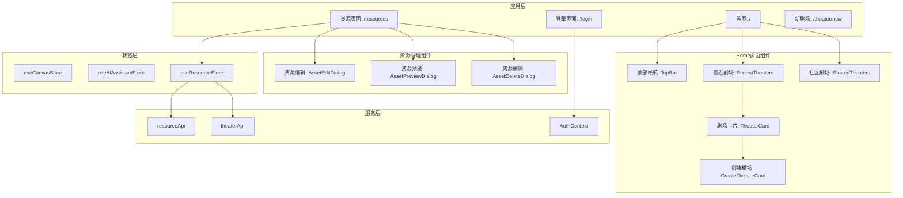
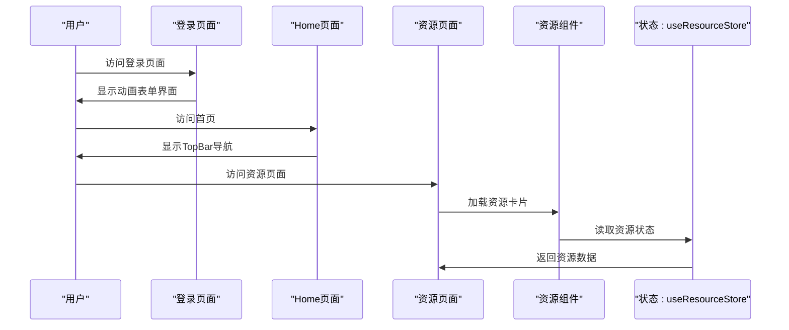
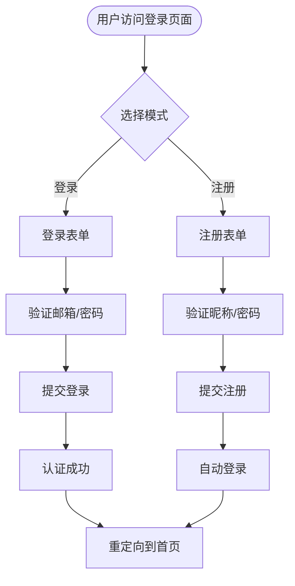
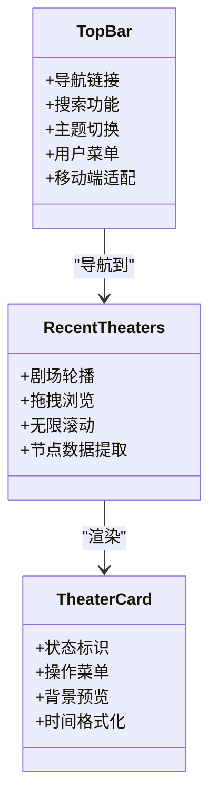
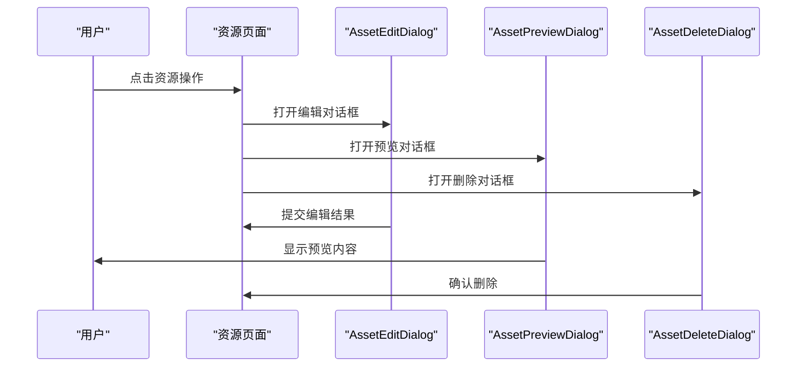
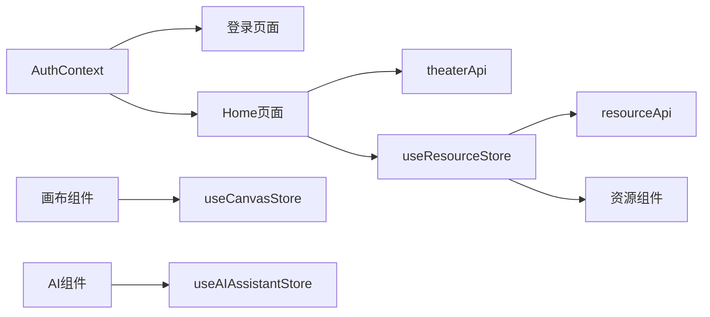

# 前端组件系统

<cite>
**本文档引用的文件**
- [page.tsx](file://frontend/src/app/login/page.tsx)
- [page.tsx](file://frontend/src/app/resources/page.tsx)
- [page.tsx](file://frontend/src/app/theater/new/page.tsx)
- [page.tsx](file://frontend/src/app/page.tsx)
- [TopBar.tsx](file://frontend/src/components/home/TopBar.tsx)
- [CreateTheaterCard.tsx](file://frontend/src/components/home/CreateTheaterCard.tsx)
- [RecentTheaters.tsx](file://frontend/src/components/home/RecentTheaters.tsx)
- [TheaterCard.tsx](file://frontend/src/components/home/TheaterCard.tsx)
- [SharedTheaters.tsx](file://frontend/src/components/home/SharedTheaters.tsx)
- [AssetEditDialog.tsx](file://frontend/src/components/resources/AssetEditDialog.tsx)
- [AssetPreviewDialog.tsx](file://frontend/src/components/resources/AssetPreviewDialog.tsx)
- [AssetDeleteDialog.tsx](file://frontend/src/components/resources/AssetDeleteDialog.tsx)
- [useResourceStore.ts](file://frontend/src/store/useResourceStore.ts)
- [theaterApi.ts](file://frontend/src/lib/theaterApi.ts)
- [AuthContext.tsx](file://frontend/src/context/AuthContext.tsx)
- [layout.tsx](file://frontend/src/app/layout.tsx)
- [TheaterCanvas.tsx](file://frontend/src/components/TheaterCanvas.tsx)
- [AIAssistantPanel.tsx](file://frontend/src/components/canvas/AIAssistantPanel.tsx)
- [ChatMessage.tsx](file://frontend/src/components/ai-assistant/ChatMessage.tsx)
- [AssetCard.tsx](file://frontend/src/components/resources/AssetCard.tsx)
- [UploadZone.tsx](file://frontend/src/components/resources/UploadZone.tsx)
- [CharacterNode.tsx](file://frontend/src/components/canvas/CharacterNode.tsx)
- [ScriptNode.tsx](file://frontend/src/components/canvas/ScriptNode.tsx)
- [ScriptEditor.tsx](file://frontend/src/components/canvas/ScriptEditor.tsx)
- [Sidebar.tsx](file://frontend/src/components/canvas/Sidebar.tsx)
- [useCanvasStore.ts](file://frontend/src/store/useCanvasStore.ts)
- [useAIAssistantStore.ts](file://frontend/src/store/useAIAssistantStore.ts)
- [resourceApi.ts](file://frontend/src/lib/resourceApi.ts)
- [button.tsx](file://frontend/src/components/ui/button.tsx)
</cite>

## 更新摘要
**所做更改**
- 新增登录页面重大重设计分析，包括动画效果、表单验证和用户体验改进
- 更新Home页面组件系统，新增TopBar导航组件和剧场卡片系统
- 扩展资源页面功能，新增完整的资源管理对话框体系
- 新增剧场创建页面的自动化创建流程
- 完善状态管理和API接口文档

## 目录
1. [简介](#简介)
2. [项目结构](#项目结构)
3. [核心组件](#核心组件)
4. [架构总览](#架构总览)
5. [详细组件分析](#详细组件分析)
6. [依赖关系分析](#依赖关系分析)
7. [性能考虑](#性能考虑)
8. [故障排查指南](#故障排查指南)
9. [结论](#结论)
10. [附录](#附录)

## 简介
本文件面向KunFlix前端组件系统，围绕基于Next.js的组件层次设计、状态管理策略与路由系统进行系统化说明。重点覆盖登录页面重大重设计、Home页面组件系统、资源管理页面扩展，以及画布编辑器（TheaterCanvas、CharacterNode、ScriptNode等）、AI助手组件（AIAssistantPanel、ChatMessage等）和UI组件库。详细解释各组件的视觉外观、行为模式、用户交互、属性/事件、自定义选项与组合模式。同时提供响应式设计指南、无障碍访问合规建议、跨浏览器兼容性要点，以及状态管理、性能优化与组件间集成的最佳实践。

## 项目结构
前端采用模块化组织，按功能域划分目录：
- app：Next.js应用路由与页面入口，包含登录、资源、剧场等页面
- components：页面级组件与业务组件（画布、AI助手、资源管理、Home页面、UI库）
- store：状态管理（Zustand）
- lib：底层API封装与工具
- hooks：自定义Hook（拖拽、吸附、快捷键等）
- context：全局上下文（认证、主题）

**图表来源**
- [page.tsx:1-333](file://frontend/src/app/login/page.tsx#L1-L333)
- [page.tsx:1-679](file://frontend/src/app/resources/page.tsx#L1-L679)
- [page.tsx:1-40](file://frontend/src/app/theater/new/page.tsx#L1-L40)
- [page.tsx:1-19](file://frontend/src/app/page.tsx#L1-L19)
- [TopBar.tsx:1-362](file://frontend/src/components/home/TopBar.tsx#L1-L362)
- [RecentTheaters.tsx:1-163](file://frontend/src/components/home/RecentTheaters.tsx#L1-L163)
- [TheaterCard.tsx:1-328](file://frontend/src/components/home/TheaterCard.tsx#L1-L328)
- [AssetEditDialog.tsx:1-98](file://frontend/src/components/resources/AssetEditDialog.tsx#L1-L98)
- [AssetPreviewDialog.tsx:1-102](file://frontend/src/components/resources/AssetPreviewDialog.tsx#L1-L102)
- [AssetDeleteDialog.tsx:1-72](file://frontend/src/components/resources/AssetDeleteDialog.tsx#L1-L72)

**章节来源**
- [layout.tsx:1-42](file://frontend/src/app/layout.tsx#L1-L42)

## 核心组件
- **登录页面组件**
  - LoginPage：重大重设计的登录/注册页面，包含动画效果、表单验证、拖拽上传等
- **Home页面组件系统**
  - TopBar：统一的顶部导航栏，包含搜索、主题切换、用户菜单
  - RecentTheaters：最近剧场轮播展示，支持拖拽浏览
  - CreateTheaterCard：创建新剧场的引导卡片
  - TheaterCard：剧场卡片，支持状态标识、操作菜单、背景预览
  - SharedTheaters：社区剧场展示（待实现）
- **资源管理组件**
  - AssetEditDialog：资源编辑对话框，支持重命名和文件替换
  - AssetPreviewDialog：资源预览对话框，支持图片、视频、音频预览
  - AssetDeleteDialog：资源删除确认对话框
- **画布编辑器**
  - TheaterCanvas：基于PIXI.js的画布容器
  - ReactFlow + 自定义节点：ScriptNode、CharacterNode、StoryboardNode、VideoNode
- **AI助手组件**
  - AIAssistantPanel：浮动聊天面板，支持拖拽附件、Agent切换、SSE流式接收
  - ChatMessage：消息渲染组件，支持Markdown、代码块懒加载、图片懒加载
- **UI组件库**
  - Button等：基于Radix UI与Tailwind的可变式组件

**章节来源**
- [page.tsx:1-333](file://frontend/src/app/login/page.tsx#L1-L333)
- [TopBar.tsx:1-362](file://frontend/src/components/home/TopBar.tsx#L1-L362)
- [RecentTheaters.tsx:1-163](file://frontend/src/components/home/RecentTheaters.tsx#L1-L163)
- [CreateTheaterCard.tsx:1-57](file://frontend/src/components/home/CreateTheaterCard.tsx#L1-L57)
- [TheaterCard.tsx:1-328](file://frontend/src/components/home/TheaterCard.tsx#L1-L328)
- [SharedTheaters.tsx:1-104](file://frontend/src/components/home/SharedTheaters.tsx#L1-L104)
- [AssetEditDialog.tsx:1-98](file://frontend/src/components/resources/AssetEditDialog.tsx#L1-L98)
- [AssetPreviewDialog.tsx:1-102](file://frontend/src/components/resources/AssetPreviewDialog.tsx#L1-L102)
- [AssetDeleteDialog.tsx:1-72](file://frontend/src/components/resources/AssetDeleteDialog.tsx#L1-L72)

## 架构总览
系统采用"页面-组件-状态-服务"分层架构：
- **页面层**：Next.js路由页面负责初始化、鉴权、加载数据与挂载组件
- **组件层**：业务组件通过ReactFlow承载节点，通过AI助手面板与后端交互，通过资源面板管理媒体
- **状态层**：Zustand store管理画布、AI会话、资源上传队列等状态，并持久化到localStorage
- **服务层**：resourceApi、theaterApi封装资源列表、上传、更新、删除等操作

**图表来源**
- [page.tsx:1-333](file://frontend/src/app/login/page.tsx#L1-L333)
- [page.tsx:1-19](file://frontend/src/app/page.tsx#L1-L19)
- [page.tsx:1-679](file://frontend/src/app/resources/page.tsx#L1-L679)
- [useResourceStore.ts:1-182](file://frontend/src/store/useResourceStore.ts#L1-L182)

## 详细组件分析

### 登录页面组件
- **LoginPage**
  - 角色：重大重设计的登录/注册页面，采用左右分栏布局
  - 关键特性：品牌展示区（动画渐变背景、特性展示）、表单区（动画过渡、密码可见性切换）、响应式设计
  - 表单验证：支持邮箱、密码、昵称等字段的实时验证
  - 动画效果：使用Framer Motion实现流畅的页面切换和表单元素动画

**图表来源**
- [page.tsx:47-128](file://frontend/src/app/login/page.tsx#L47-L128)

**章节来源**
- [page.tsx:1-333](file://frontend/src/app/login/page.tsx#L1-L333)

### Home页面组件系统
- **TopBar**
  - 角色：统一的顶部导航栏，支持桌面端和移动端响应式设计
  - 关键特性：导航链接、搜索功能、主题切换、用户菜单、移动端汉堡菜单
  - 交互设计：使用Framer Motion实现平滑的展开/收起动画
- **RecentTheaters**
  - 角色：最近剧场轮播展示，支持拖拽浏览和无限滚动
  - 关键特性：剧场数据加载、节点信息提取、背景图预览、操作菜单
  - 性能优化：使用Intersection Observer实现懒加载
- **TheaterCard**
  - 角色：剧场卡片组件，支持状态标识、操作菜单、背景预览
  - 关键特性：状态配置映射、节点背景提取、时间格式化、操作对话框集成

**图表来源**
- [TopBar.tsx:27-362](file://frontend/src/components/home/TopBar.tsx#L27-L362)
- [RecentTheaters.tsx:17-163](file://frontend/src/components/home/RecentTheaters.tsx#L17-L163)
- [TheaterCard.tsx:64-328](file://frontend/src/components/home/TheaterCard.tsx#L64-L328)

**章节来源**
- [TopBar.tsx:1-362](file://frontend/src/components/home/TopBar.tsx#L1-L362)
- [RecentTheaters.tsx:1-163](file://frontend/src/components/home/RecentTheaters.tsx#L1-L163)
- [CreateTheaterCard.tsx:1-57](file://frontend/src/components/home/CreateTheaterCard.tsx#L1-L57)
- [TheaterCard.tsx:1-328](file://frontend/src/components/home/TheaterCard.tsx#L1-L328)
- [SharedTheaters.tsx:1-104](file://frontend/src/components/home/SharedTheaters.tsx#L1-L104)

### 资源管理组件
- **AssetEditDialog**
  - 角色：资源编辑对话框，支持重命名和文件替换两种模式
  - 关键特性：表单验证、文件选择、异步提交、加载状态管理
- **AssetPreviewDialog**
  - 角色：资源预览对话框，支持图片、视频、音频的全屏预览
  - 关键特性：类型化渲染器映射、下载功能、全屏模式
- **AssetDeleteDialog**
  - 角色：资源删除确认对话框
  - 关键特性：危险操作确认、加载状态、错误处理

**图表来源**
- [AssetEditDialog.tsx:16-98](file://frontend/src/components/resources/AssetEditDialog.tsx#L16-L98)
- [AssetPreviewDialog.tsx:64-102](file://frontend/src/components/resources/AssetPreviewDialog.tsx#L64-L102)
- [AssetDeleteDialog.tsx:16-72](file://frontend/src/components/resources/AssetDeleteDialog.tsx#L16-L72)

**章节来源**
- [AssetEditDialog.tsx:1-98](file://frontend/src/components/resources/AssetEditDialog.tsx#L1-L98)
- [AssetPreviewDialog.tsx:1-102](file://frontend/src/components/resources/AssetPreviewDialog.tsx#L1-L102)
- [AssetDeleteDialog.tsx:1-72](file://frontend/src/components/resources/AssetDeleteDialog.tsx#L1-L72)

### 画布编辑器
- **TheaterCanvas**
  - 角色：轻量画布容器，动态导入PIXI.js并在客户端初始化应用实例
  - 关键点：width/height参数控制画布尺寸；卸载时销毁PIXI应用；默认背景色与示例文本验证渲染
- **ReactFlow + 自定义节点**
  - ScriptNode：可编辑文本节点，支持TiPex富文本编辑器、字数统计、复制/删除工具条、拖拽句柄
  - CharacterNode：图片节点，支持本地预览、上传进度、fitMode切换、全屏预览、AI编辑联动
  - 共同特性：NodeResizer、Handle连接点、NodeToolbar工具条、吸附与对齐线、拖拽到AI面板检测

**章节来源**
- [TheaterCanvas.tsx:1-50](file://frontend/src/components/TheaterCanvas.tsx#L1-L50)
- [ScriptNode.tsx:1-253](file://frontend/src/components/canvas/ScriptNode.tsx#L1-L253)
- [CharacterNode.tsx:1-588](file://frontend/src/components/canvas/CharacterNode.tsx#L1-L588)

### AI助手组件
- **AIAssistantPanel**
  - 角色：浮动聊天面板，支持Agent选择、SSE流式消息、拖拽附件、虚拟滚动、性能监控、ESC最小化
  - 关键点：构建附件上下文（文本/图像/视频/分镜摘要）、会话管理、错误处理（401重登）、面板拖拽与吸附约束、尺寸调整手柄
- **ChatMessage**
  - 角色：消息渲染组件，支持Markdown、代码块懒加载、图片懒加载、思考面板、工具/技能调用指示器、视频任务卡片
  - 关键点：解析<think>标签、解析视频任务标记、分块渲染、可拖拽文本包装

**章节来源**
- [AIAssistantPanel.tsx:1-613](file://frontend/src/components/canvas/AIAssistantPanel.tsx#L1-L613)
- [ChatMessage.tsx:1-421](file://frontend/src/components/ai-assistant/ChatMessage.tsx#L1-L421)

### UI组件库
- **Button**
  - 角色：可变式按钮，支持多种变体与尺寸，基于Radix Slot与CVA
  - 关键点：类名合并、变体与尺寸映射、SVG图标支持

**章节来源**
- [button.tsx:1-57](file://frontend/src/components/ui/button.tsx#L1-L57)

## 依赖关系分析
- **组件耦合**
  - 登录页面与认证上下文：通过AuthContext实现用户状态管理
  - Home页面与API：通过theaterApi获取剧场数据，通过useResourceStore管理资源状态
  - 资源页面与状态管理：通过useResourceStore管理资源列表、上传队列、过滤器
  - 画布组件与状态：通过useCanvasStore管理节点、边、视口、历史、剧场同步
- **状态依赖**
  - useCanvasStore：管理节点、边、视口、历史、剧场同步
  - useAIAssistantStore：管理消息、会话、面板位置、附件、上下文使用
  - useResourceStore：管理资源列表、上传队列、过滤器
- **外部依赖**
  - @xyflow/react：画布框架与节点类型注册
  - Zustand：轻量状态管理，带持久化
  - Radix UI：语义化与无障碍基础组件
  - Framer Motion：动画库，提供流畅的过渡效果

**图表来源**
- [AuthContext.tsx:1-207](file://frontend/src/context/AuthContext.tsx#L1-L207)
- [page.tsx:1-333](file://frontend/src/app/login/page.tsx#L1-L333)
- [page.tsx:1-19](file://frontend/src/app/page.tsx#L1-L19)
- [useResourceStore.ts:1-182](file://frontend/src/store/useResourceStore.ts#L1-L182)
- [theaterApi.ts:1-159](file://frontend/src/lib/theaterApi.ts#L1-L159)

**章节来源**
- [AuthContext.tsx:1-207](file://frontend/src/context/AuthContext.tsx#L1-L207)
- [useResourceStore.ts:1-182](file://frontend/src/store/useResourceStore.ts#L1-L182)
- [theaterApi.ts:1-159](file://frontend/src/lib/theaterApi.ts#L1-L159)

## 性能考虑
- **动画性能**
  - 登录页面使用Framer Motion实现流畅的表单切换动画，避免复杂的CSS动画
  - Home页面的剧场卡片使用transform属性进行动画，利用GPU加速
- **资源管理优化**
  - 资源页面使用Intersection Observer实现无限滚动，减少内存占用
  - 资源上传采用串行处理，避免SQLite并发写入冲突
- **状态管理优化**
  - useCanvasStore对节点变化进行快照管理，避免不必要的重渲染
  - useResourceStore使用分页加载，支持增量数据加载
- **渲染优化**
  - AI消息列表使用虚拟滚动与分块渲染，减少DOM节点数量
  - ChatMessage中的代码块与图片采用懒加载组件，降低首屏压力

**章节来源**
- [page.tsx:1-333](file://frontend/src/app/login/page.tsx#L1-L333)
- [RecentTheaters.tsx:1-163](file://frontend/src/components/home/RecentTheaters.tsx#L1-L163)
- [useResourceStore.ts:1-182](file://frontend/src/store/useResourceStore.ts#L1-L182)
- [AIAssistantPanel.tsx:1-613](file://frontend/src/components/canvas/AIAssistantPanel.tsx#L1-L613)

## 故障排查指南
- **登录页面问题**
  - 症状：表单验证不生效
  - 排查：检查验证规则函数和表单字段配置
  - 处理：确认正则表达式和验证逻辑正确
- **资源上传失败**
  - 症状：上传队列出现错误状态
  - 排查：检查文件类型与大小限制、网络错误、后端返回错误信息
  - 处理：查看错误提示，重新上传或更换文件
- **剧场卡片背景显示异常**
  - 症状：视频背景无法播放或图片无法显示
  - 排查：确认媒体URL有效、浏览器支持相应格式
  - 处理：检查媒体文件格式和URL有效性
- **Home页面导航问题**
  - 症状：移动端菜单无法正常展开
  - 排查：检查事件监听器绑定和CSS类名
  - 处理：确认点击事件正确绑定和样式类名正确

**章节来源**
- [page.tsx:1-333](file://frontend/src/app/login/page.tsx#L1-L333)
- [page.tsx:1-679](file://frontend/src/app/resources/page.tsx#L1-L679)
- [TheaterCard.tsx:1-328](file://frontend/src/components/home/TheaterCard.tsx#L1-L328)
- [TopBar.tsx:1-362](file://frontend/src/components/home/TopBar.tsx#L1-L362)

## 结论
KunFlix前端组件系统经过全面增强，实现了更加完善的用户体验。登录页面的重大重设计提供了现代化的视觉效果和流畅的交互体验；Home页面组件系统提供了完整的导航和剧场管理功能；资源页面扩展了完整的资源管理对话框体系。系统采用模块化与状态驱动为核心，结合ReactFlow画布、Zustand状态管理与资源API，实现了高可用的创作工作流。AI助手与资源管理组件通过统一的状态与事件机制实现深度集成，既保证了良好的用户体验，也为后续扩展（如多智能体协作、更多节点类型）提供了清晰的架构路径。

## 附录

### 响应式设计指南
- **断点与布局**
  - 使用Tailwind断点适配不同屏幕尺寸，确保登录页面左右分栏在桌面端显示，在移动端自动切换为单列
  - Home页面的TopBar在移动端使用汉堡菜单，在桌面端显示完整导航
  - 资源页面的网格布局在小屏幕上自动调整列数
- **交互一致性**
  - 所有对话框在移动端使用全屏模式，确保触摸操作的便利性
  - 悬浮菜单、工具条、预览层均需在小屏设备上提供替代交互

### 无障碍访问合规
- **键盘导航**
  - 为按钮、输入框、菜单提供键盘可达性；支持Tab顺序与Enter/Space激活
  - 对话框支持Esc键关闭，提供键盘操作路径
- **屏幕阅读器**
  - 为图标与按钮提供aria-label或title；为富文本编辑器提供可读的占位符
  - 对话框提供适当的标题和描述信息
- **对比度与聚焦**
  - 确保文本与背景对比度满足WCAG AA；为可交互元素提供可见聚焦样式

### 跨浏览器兼容性
- **Polyfill与降级**
  - 对较老浏览器提供必要的polyfill（如Promise、FormData、URL）
  - Framer Motion在不支持的浏览器中提供降级动画
- **特性检测**
  - 使用特性检测而非UA判断，确保在不支持SSE或WebAssembly的环境下提供降级体验
  - 资源上传功能在不支持的浏览器中提供替代方案