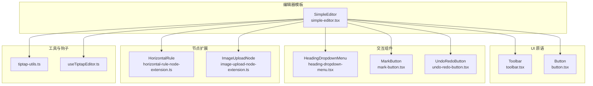
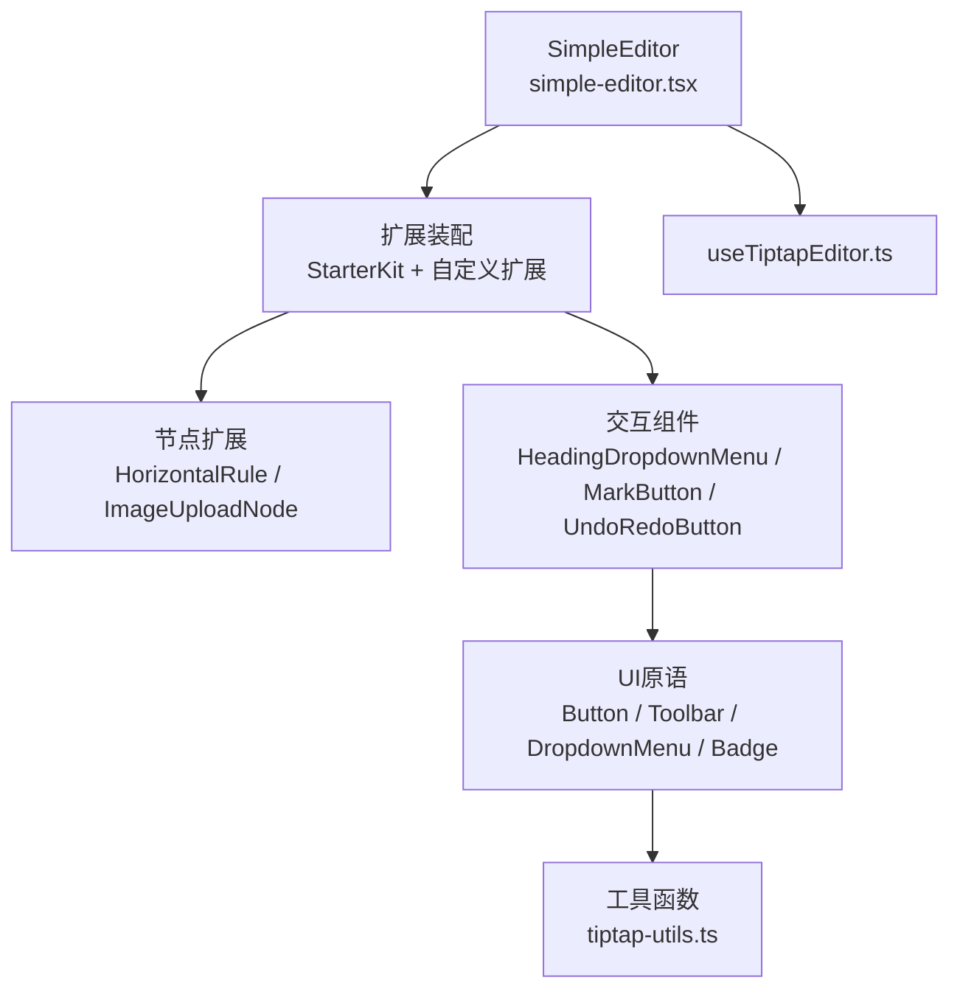
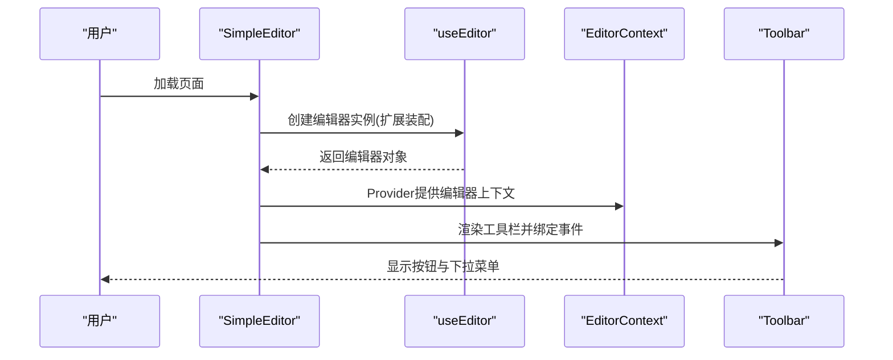
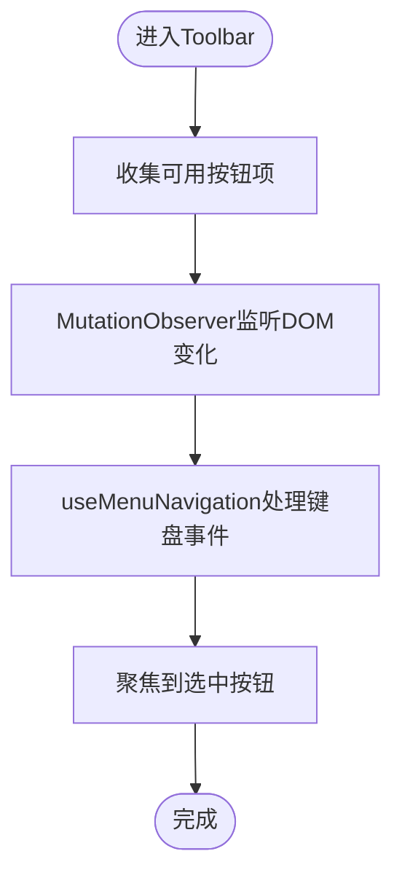
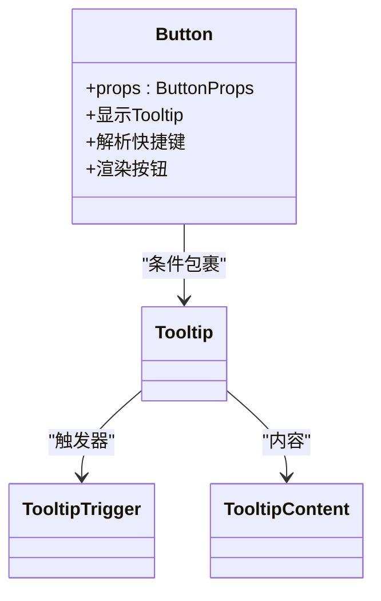
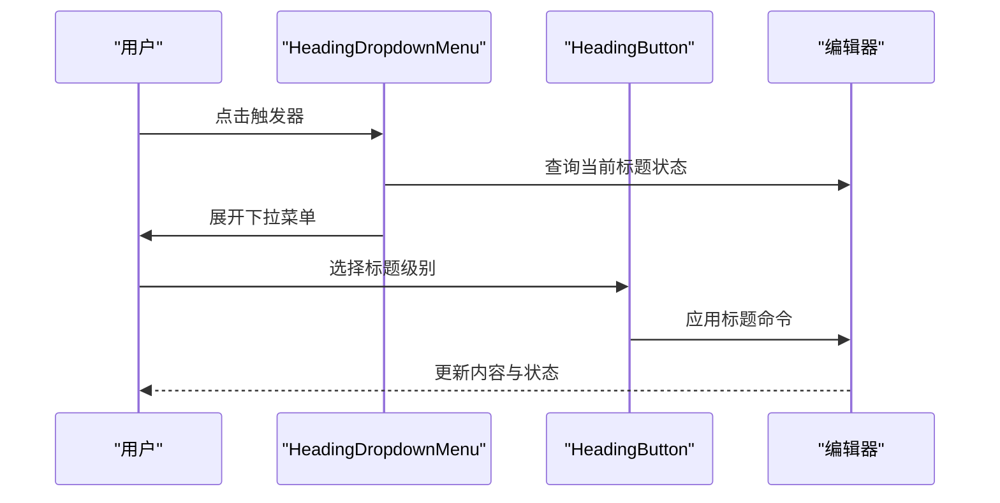
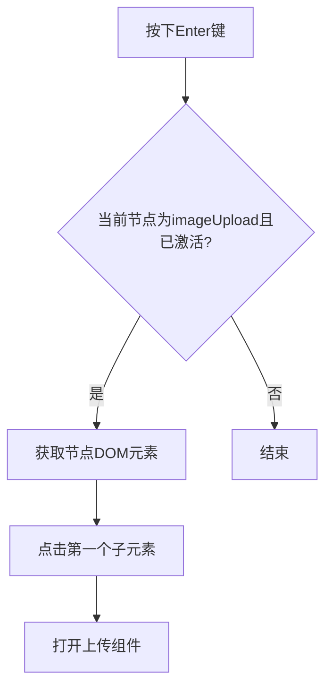
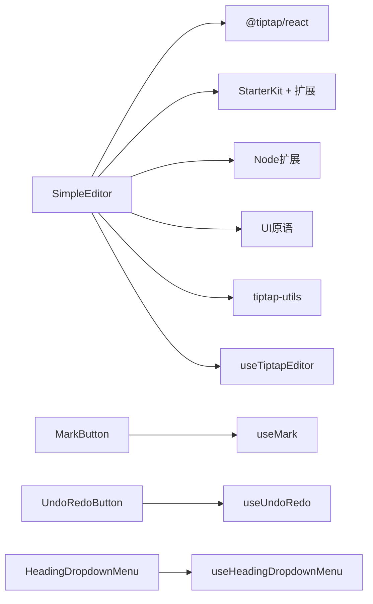

# 富文本编辑器

<cite>
**本文引用的文件**
- [simple-editor.tsx](file://frontend/src/components/tiptap-templates/simple/simple-editor.tsx)
- [toolbar.tsx](file://frontend/src/components/tiptap-ui-primitive/toolbar/toolbar.tsx)
- [button.tsx](file://frontend/src/components/tiptap-ui-primitive/button/button.tsx)
- [horizontal-rule-node-extension.ts](file://frontend/src/components/tiptap-node/horizontal-rule-node/horizontal-rule-node-extension.ts)
- [image-upload-node-extension.ts](file://frontend/src/components/tiptap-node/image-upload-node/image-upload-node-extension.ts)
- [tiptap-utils.ts](file://frontend/src/lib/tiptap-utils.ts)
- [heading-dropdown-menu.tsx](file://frontend/src/components/tiptap-ui/heading-dropdown-menu/heading-dropdown-menu.tsx)
- [mark-button.tsx](file://frontend/src/components/tiptap-ui/mark-button/mark-button.tsx)
- [undo-redo-button.tsx](file://frontend/src/components/tiptap-ui/undo-redo-button/undo-redo-button.tsx)
- [heading-icon.tsx](file://frontend/src/components/tiptap-icons/heading-icon.tsx)
- [use-tiptap-editor.ts](file://frontend/src/hooks/use-tiptap-editor.ts)
</cite>

## 目录
1. [简介](#简介)
2. [项目结构](#项目结构)
3. [核心组件](#核心组件)
4. [架构总览](#架构总览)
5. [详细组件分析](#详细组件分析)
6. [依赖关系分析](#依赖关系分析)
7. [性能考量](#性能考量)
8. [故障排查指南](#故障排查指南)
9. [结论](#结论)
10. [附录](#附录)

## 简介
本文件面向KunFlix富文本编辑器，系统性阐述基于Tiptap的可扩展编辑器架构与实现细节。重点覆盖：
- SimpleEditor简单编辑器：初始化、扩展配置、移动端适配与工具栏联动
- 工具栏组件与按钮组件：Toolbar、Button、DropdownMenu、Badge等UI原语
- 节点系统与扩展机制：heading、paragraph、blockquote、code-block、horizontal-rule、image-upload等
- 图标系统、弹出菜单、撤销/重做功能
- 编辑器初始化、内容序列化、插件扩展与主题定制
- 节点扩展开发、自定义命令与状态管理实践
- 实际使用示例与性能优化建议

## 项目结构
KunFlix前端采用按功能域分层的组织方式，富文本编辑器相关代码主要集中在以下模块：
- tiptap-templates/simple：简单编辑器模板与主题切换
- tiptap-ui：编辑器交互按钮与弹出菜单（如标题、列表、链接、高亮、对齐、撤销重做）
- tiptap-ui-primitive：通用UI原语（按钮、工具栏、下拉菜单、徽章、输入框、分隔符、气泡提示）
- tiptap-icons：图标集合（如标题、粗体、斜体、链接、撤销、重做等）
- tiptap-node：节点扩展（水平分割线、图片上传节点等）
- lib：工具函数（快捷键格式化、URL安全处理、节点查找与属性更新等）
- hooks：编辑器上下文钩子（useTiptapEditor）

**图表来源**
- [simple-editor.tsx:189-293](file://frontend/src/components/tiptap-templates/simple/simple-editor.tsx#L189-L293)
- [toolbar.tsx:82-101](file://frontend/src/components/tiptap-ui-primitive/toolbar/toolbar.tsx#L82-L101)
- [button.tsx:46-99](file://frontend/src/components/tiptap-ui-primitive/button/button.tsx#L46-L99)
- [heading-dropdown-menu.tsx:44-126](file://frontend/src/components/tiptap-ui/heading-dropdown-menu/heading-dropdown-menu.tsx#L44-L126)
- [mark-button.tsx:48-122](file://frontend/src/components/tiptap-ui/mark-button/mark-button.tsx#L48-L122)
- [undo-redo-button.tsx:54-125](file://frontend/src/components/tiptap-ui/undo-redo-button/undo-redo-button.tsx#L54-L125)
- [horizontal-rule-node-extension.ts:4-14](file://frontend/src/components/tiptap-node/horizontal-rule-node/horizontal-rule-node-extension.ts#L4-L14)
- [image-upload-node-extension.ts:66-160](file://frontend/src/components/tiptap-node/image-upload-node/image-upload-node-extension.ts#L66-L160)
- [tiptap-utils.ts:1-641](file://frontend/src/lib/tiptap-utils.ts#L1-L641)
- [use-tiptap-editor.ts:13-70](file://frontend/src/hooks/use-tiptap-editor.ts#L13-L70)

**章节来源**
- [simple-editor.tsx:189-293](file://frontend/src/components/tiptap-templates/simple/simple-editor.tsx#L189-L293)

## 核心组件
- SimpleEditor：基于@tiptap/react的编辑器实例，配置StarterKit与若干扩展，并挂载自定义节点与UI组件；支持移动端主工具栏与弹出式高亮/链接面板。
- Toolbar：通用工具栏容器，内置键盘导航、焦点可见态管理与自动收集按钮项。
- Button：通用按钮原语，支持快捷键显示、Tooltip、Ghost/Primary样式与尺寸。
- HeadingDropdownMenu：标题层级选择下拉菜单，封装useHeadingDropdownMenu逻辑。
- MarkButton：标记（加粗、斜体、删除线、代码、下划线、上/下标等）按钮，封装useMark逻辑。
- UndoRedoButton：撤销/重做按钮，封装useUndoRedo逻辑。
- HorizontalRule与ImageUploadNode：节点扩展，分别渲染水平分割线与图片上传节点视图。
- tiptap-utils：提供快捷键解析、平台区分、URL安全校验、节点查找与属性更新、选择范围操作等工具。
- useTiptapEditor：统一获取当前活跃编辑器实例与状态，兼容多页面场景。

**章节来源**
- [simple-editor.tsx:189-293](file://frontend/src/components/tiptap-templates/simple/simple-editor.tsx#L189-L293)
- [toolbar.tsx:82-101](file://frontend/src/components/tiptap-ui-primitive/toolbar/toolbar.tsx#L82-L101)
- [button.tsx:46-99](file://frontend/src/components/tiptap-ui-primitive/button/button.tsx#L46-L99)
- [heading-dropdown-menu.tsx:44-126](file://frontend/src/components/tiptap-ui/heading-dropdown-menu/heading-dropdown-menu.tsx#L44-L126)
- [mark-button.tsx:48-122](file://frontend/src/components/tiptap-ui/mark-button/mark-button.tsx#L48-L122)
- [undo-redo-button.tsx:54-125](file://frontend/src/components/tiptap-ui/undo-redo-button/undo-redo-button.tsx#L54-L125)
- [horizontal-rule-node-extension.ts:4-14](file://frontend/src/components/tiptap-node/horizontal-rule-node/horizontal-rule-node-extension.ts#L4-L14)
- [image-upload-node-extension.ts:66-160](file://frontend/src/components/tiptap-node/image-upload-node/image-upload-node-extension.ts#L66-L160)
- [tiptap-utils.ts:1-641](file://frontend/src/lib/tiptap-utils.ts#L1-L641)
- [use-tiptap-editor.ts:13-70](file://frontend/src/hooks/use-tiptap-editor.ts#L13-L70)

## 架构总览
KunFlix富文本编辑器采用“模板 + UI原语 + 交互组件 + 节点扩展 + 工具函数 + 钩子”的分层架构：
- 模板层：SimpleEditor负责编辑器初始化、扩展装配与移动端工具栏编排
- UI原语层：Button、Toolbar、DropdownMenu、Badge等提供一致的交互体验
- 交互组件层：HeadingDropdownMenu、MarkButton、UndoRedoButton等封装具体命令与状态
- 节点扩展层：HorizontalRule、ImageUploadNode等扩展节点行为与视图
- 工具与钩子层：tiptap-utils提供通用能力；useTiptapEditor统一编辑器上下文

**图表来源**
- [simple-editor.tsx:197-245](file://frontend/src/components/tiptap-templates/simple/simple-editor.tsx#L197-L245)
- [toolbar.tsx:82-101](file://frontend/src/components/tiptap-ui-primitive/toolbar/toolbar.tsx#L82-L101)
- [button.tsx:46-99](file://frontend/src/components/tiptap-ui-primitive/button/button.tsx#L46-L99)
- [heading-dropdown-menu.tsx:44-126](file://frontend/src/components/tiptap-ui/heading-dropdown-menu/heading-dropdown-menu.tsx#L44-L126)
- [mark-button.tsx:48-122](file://frontend/src/components/tiptap-ui/mark-button/mark-button.tsx#L48-L122)
- [undo-redo-button.tsx:54-125](file://frontend/src/components/tiptap-ui/undo-redo-button/undo-redo-button.tsx#L54-L125)
- [horizontal-rule-node-extension.ts:4-14](file://frontend/src/components/tiptap-node/horizontal-rule-node/horizontal-rule-node-extension.ts#L4-L14)
- [image-upload-node-extension.ts:66-160](file://frontend/src/components/tiptap-node/image-upload-node/image-upload-node-extension.ts#L66-L160)
- [tiptap-utils.ts:1-641](file://frontend/src/lib/tiptap-utils.ts#L1-L641)
- [use-tiptap-editor.ts:13-70](file://frontend/src/hooks/use-tiptap-editor.ts#L13-L70)

## 详细组件分析

### SimpleEditor：简单编辑器
- 初始化与扩展装配
  - 使用useEditor创建编辑器实例，配置immediatelyRender以延迟渲染
  - editorProps设置无障碍属性与CSS类名
  - 扩展装配：StarterKit（限制标题级别与禁用默认codeBlock/horizontalRule）、Link、Underline、Typography、TextAlign、TaskList/TaskItem、Highlight、Subscript、Superscript、TextStyle、Color、HorizontalRule、ImageUploadNode
  - 内容来源于本地JSON数据
- 工具栏与移动端适配
  - 主工具栏由多个ToolbarGroup组成，包含撤销/重做、标题/列表/引用/代码块、标记、高亮、链接、对齐、上/下标、图片上传等
  - 移动端通过状态切换展示主工具栏或弹出式高亮/链接面板
  - 工具栏位置根据光标可见区域动态调整
- 上下文与状态
  - 使用EditorContext提供编辑器实例
  - 通过useTiptapEditor钩子在多页面场景中获取活跃编辑器

**图表来源**
- [simple-editor.tsx:197-245](file://frontend/src/components/tiptap-templates/simple/simple-editor.tsx#L197-L245)
- [simple-editor.tsx:258-291](file://frontend/src/components/tiptap-templates/simple/simple-editor.tsx#L258-L291)

**章节来源**
- [simple-editor.tsx:189-293](file://frontend/src/components/tiptap-templates/simple/simple-editor.tsx#L189-L293)

### 工具栏组件：Toolbar
- 键盘导航与焦点管理
  - 自动收集可用按钮项（button、role=button、tabindex=0且非disabled）
  - MutationObserver监听DOM变化，动态更新按钮列表
  - useMenuNavigation实现水平方向的键盘导航，选中时自动聚焦
  - 统一设置/移除data-focus-visible以支持无障碍焦点指示
- 容器变体
  - 支持fixed/floating两种变体，通过data-variant控制样式

**图表来源**
- [toolbar.tsx:16-80](file://frontend/src/components/tiptap-ui-primitive/toolbar/toolbar.tsx#L16-L80)

**章节来源**
- [toolbar.tsx:82-101](file://frontend/src/components/tiptap-ui-primitive/toolbar/toolbar.tsx#L82-L101)

### 按钮组件：Button
- 功能特性
  - 支持Ghost/Primary样式与Small/Default/Large尺寸
  - 可选Tooltip与快捷键显示，快捷键通过parseShortcutKeys解析并按平台格式化
  - 数据槽data-slot统一按钮标识，便于主题定制
- 无障碍与可访问性
  - 提供aria-label与aria-pressed等属性
  - 结合TooltipContent展示快捷键组合

**图表来源**
- [button.tsx:46-99](file://frontend/src/components/tiptap-ui-primitive/button/button.tsx#L46-L99)

**章节来源**
- [button.tsx:46-99](file://frontend/src/components/tiptap-ui-primitive/button/button.tsx#L46-L99)

### 输入组件：DropdownMenu（用于标题/列表等）
- HeadingDropdownMenu
  - 封装useHeadingDropdownMenu，支持指定标题级别数组、是否模态弹出、隐藏不可用项
  - 触发器按钮显示当前激活状态与下拉箭头
  - 下拉菜单项为HeadingButton，逐级渲染不同标题

**图表来源**
- [heading-dropdown-menu.tsx:44-126](file://frontend/src/components/tiptap-ui/heading-dropdown-menu/heading-dropdown-menu.tsx#L44-L126)

**章节来源**
- [heading-dropdown-menu.tsx:44-126](file://frontend/src/components/tiptap-ui/heading-dropdown-menu/heading-dropdown-menu.tsx#L44-L126)

### 标记按钮：MarkButton
- 功能
  - 封装useMark，支持多种标记类型（bold、italic、strike、code、underline、superscript、subscript）
  - 可选显示快捷键徽章，结合parseShortcutKeys解析平台相关快捷键
  - 通过aria-pressed表达激活状态
- 与Button的协作
  - 复用Button的Tooltip、尺寸与样式体系

**章节来源**
- [mark-button.tsx:48-122](file://frontend/src/components/tiptap-ui/mark-button/mark-button.tsx#L48-L122)

### 撤销/重做按钮：UndoRedoButton
- 功能
  - 封装useUndoRedo，支持undo/redo动作
  - 可选显示快捷键徽章，结合parseShortcutKeys解析平台相关快捷键
  - 通过aria-label与禁用态表达可执行性
- 与Button的协作
  - 复用Button的Tooltip、尺寸与样式体系

**章节来源**
- [undo-redo-button.tsx:54-125](file://frontend/src/components/tiptap-ui/undo-redo-button/undo-redo-button.tsx#L54-L125)

### 节点扩展：HorizontalRule
- 行为
  - 重写renderHTML，将节点渲染为带data-type属性的div包裹hr元素
- 用途
  - 在文档中插入水平分割线，便于内容分区

**章节来源**
- [horizontal-rule-node-extension.ts:4-14](file://frontend/src/components/tiptap-node/horizontal-rule-node/horizontal-rule-node-extension.ts#L4-L14)

### 节点扩展：ImageUploadNode
- 配置选项
  - accept、limit、maxSize、upload、onError、onSuccess、HTMLAttributes等
- 属性与HTML
  - addAttributes定义accept、limit、maxSize
  - renderHTML输出带data-type="image-upload"的div
- 节点视图
  - addNodeView使用ReactNodeViewRenderer渲染ImageUploadNode组件
- 命令
  - addCommands提供setImageUploadNode命令，用于插入该节点
- 快捷键
  - addKeyboardShortcuts监听Enter键，当选中imageUpload节点时触发点击以打开上传组件

**图表来源**
- [image-upload-node-extension.ts:135-159](file://frontend/src/components/tiptap-node/image-upload-node/image-upload-node-extension.ts#L135-L159)

**章节来源**
- [image-upload-node-extension.ts:66-160](file://frontend/src/components/tiptap-node/image-upload-node/image-upload-node-extension.ts#L66-L160)

### 图标系统
- HeadingIcon等图标组件采用memo优化渲染，统一SVG尺寸与填充色
- 在按钮与下拉菜单中作为视觉标识使用

**章节来源**
- [heading-icon.tsx:5-22](file://frontend/src/components/tiptap-icons/heading-icon.tsx#L5-L22)

### 编辑器初始化、内容序列化与主题定制
- 初始化
  - 使用useEditor创建实例，配置editorProps与extensions
  - StarterKit按需配置（如限制heading级别、关闭默认codeBlock/horizontalRule）
- 内容序列化
  - 编辑器内部维护文档树，通过扩展与节点视图进行渲染
  - 本地content.json作为初始内容来源
- 主题定制
  - 通过Button、Toolbar等原语的数据槽与CSS变量实现主题切换
  - SimpleEditor引入ThemeToggle组件，配合样式文件实现明暗主题

**章节来源**
- [simple-editor.tsx:197-245](file://frontend/src/components/tiptap-templates/simple/simple-editor.tsx#L197-L245)
- [simple-editor.tsx:77-79](file://frontend/src/components/tiptap-templates/simple/simple-editor.tsx#L77-L79)
- [simple-editor.tsx:71](file://frontend/src/components/tiptap-templates/simple/simple-editor.tsx#L71)

### 插件扩展与状态管理
- 插件扩展
  - 通过Node.create扩展节点，添加属性、HTML渲染、节点视图与命令
  - 通过addKeyboardShortcuts实现快捷键行为
- 状态管理
  - useTiptapEditor统一获取编辑器实例与状态，支持多页面场景下的活跃编辑器切换
  - Toolbar通过useMenuNavigation与useEditorState实现状态同步

**章节来源**
- [image-upload-node-extension.ts:66-160](file://frontend/src/components/tiptap-node/image-upload-node/image-upload-node-extension.ts#L66-L160)
- [use-tiptap-editor.ts:13-70](file://frontend/src/hooks/use-tiptap-editor.ts#L13-L70)
- [toolbar.tsx:16-80](file://frontend/src/components/tiptap-ui-primitive/toolbar/toolbar.tsx#L16-L80)

## 依赖关系分析
- SimpleEditor依赖
  - @tiptap/react（useEditor、EditorContent、useCurrentEditor）
  - StarterKit与若干扩展（Link、Underline、Typography、TextAlign、TaskList/TaskItem、Highlight、Subscript、Superscript、TextStyle、Color、HorizontalRule）
  - 自定义节点扩展（HorizontalRule、ImageUploadNode）
  - UI原语（Button、Toolbar、DropdownMenu、Badge、Separator、Tooltip）
  - 工具函数（tiptap-utils）
  - 钩子（useTiptapEditor、useIsBreakpoint、useWindowSize、useCursorVisibility）
- 交互组件依赖
  - HeadingDropdownMenu依赖useHeadingDropdownMenu
  - MarkButton依赖useMark
  - UndoRedoButton依赖useUndoRedo
- 节点扩展依赖
  - @tiptap/react（Node、mergeAttributes、ReactNodeViewRenderer）
  - 组件视图（ImageUploadNode）

**图表来源**
- [simple-editor.tsx:197-245](file://frontend/src/components/tiptap-templates/simple/simple-editor.tsx#L197-L245)
- [mark-button.tsx:62-77](file://frontend/src/components/tiptap-ui/mark-button/mark-button.tsx#L62-L77)
- [undo-redo-button.tsx:72-79](file://frontend/src/components/tiptap-ui/undo-redo-button/undo-redo-button.tsx#L72-L79)
- [heading-dropdown-menu.tsx:60-66](file://frontend/src/components/tiptap-ui/heading-dropdown-menu/heading-dropdown-menu.tsx#L60-L66)

**章节来源**
- [simple-editor.tsx:197-245](file://frontend/src/components/tiptap-templates/simple/simple-editor.tsx#L197-L245)

## 性能考量
- 延迟渲染
  - SimpleEditor使用immediatelyRender=false，避免首屏阻塞
- 节点视图与懒加载
  - 图片上传节点采用NodeViewRenderer，仅在需要时渲染组件
- DOM监听与焦点管理
  - Toolbar使用MutationObserver与useMenuNavigation，减少不必要的重渲染
- 快捷键解析
  - tiptap-utils的parseShortcutKeys按平台格式化，避免重复计算
- 文件上传
  - handleImageUpload提供进度回调与取消信号，适合大文件场景

**章节来源**
- [simple-editor.tsx:197-207](file://frontend/src/components/tiptap-templates/simple/simple-editor.tsx#L197-L207)
- [image-upload-node-extension.ts:135-159](file://frontend/src/components/tiptap-node/image-upload-node/image-upload-node-extension.ts#L135-L159)
- [tiptap-utils.ts:361-388](file://frontend/src/lib/tiptap-utils.ts#L361-L388)

## 故障排查指南
- 扩展未注册
  - 使用isExtensionAvailable检查扩展是否在编辑器中注册，若未注册会打印警告
- 节点/标记不存在
  - 使用isNodeInSchema与isMarkInSchema检查节点与标记是否存在
- 节点定位问题
  - 使用findNodeAtPosition与findNodePosition定位节点位置，注意错误处理
- 选择范围异常
  - 使用selectionWithinConvertibleTypes判断选择是否可转换为目标类型
- URL安全
  - 使用sanitizeUrl与isAllowedUri确保链接安全
- 节点属性批量更新
  - 使用updateNodesAttr批量更新节点属性，支持函数式更新与删除键
- 选择当前块内容
  - 使用selectCurrentBlockContent在空选择时选中当前块

**章节来源**
- [tiptap-utils.ts:180-201](file://frontend/src/lib/tiptap-utils.ts#L180-L201)
- [tiptap-utils.ts:209-221](file://frontend/src/lib/tiptap-utils.ts#L209-L221)
- [tiptap-utils.ts:231-278](file://frontend/src/lib/tiptap-utils.ts#L231-L278)
- [tiptap-utils.ts:324-352](file://frontend/src/lib/tiptap-utils.ts#L324-L352)
- [tiptap-utils.ts:453-468](file://frontend/src/lib/tiptap-utils.ts#L453-L468)
- [tiptap-utils.ts:480-518](file://frontend/src/lib/tiptap-utils.ts#L480-L518)
- [tiptap-utils.ts:525-559](file://frontend/src/lib/tiptap-utils.ts#L525-L559)

## 结论
KunFlix富文本编辑器以Tiptap为核心，构建了清晰的分层架构：模板层负责装配与编排，UI原语提供一致的交互体验，交互组件封装命令与状态，节点扩展增强内容能力，工具函数与钩子保障可维护性与可扩展性。通过合理使用扩展、节点视图与状态管理，可在保证性能的同时实现高度定制化的富文本编辑体验。

## 附录
- 实际使用示例
  - 在页面中引入SimpleEditor即可获得完整的富文本编辑能力
  - 通过HeadingDropdownMenu、MarkButton、UndoRedoButton等组件快速扩展工具栏
  - 使用ImageUploadNode扩展图片上传能力，并结合handleImageUpload实现上传流程
- 开发指南
  - 新增节点扩展：参考ImageUploadNode的Node.create模式，添加属性、HTML渲染、节点视图与命令
  - 自定义命令：在扩展的addCommands中定义命令，结合useTiptapEditor在组件中调用
  - 状态管理：通过useTiptapEditor统一获取编辑器实例与状态，避免跨组件状态不一致
- 性能优化建议
  - 合理使用immediatelyRender与NodeViewRenderer
  - 对频繁更新的UI使用memo化组件
  - 使用MutationObserver与useMenuNavigation减少重渲染
  - 对上传等异步操作提供进度与取消能力