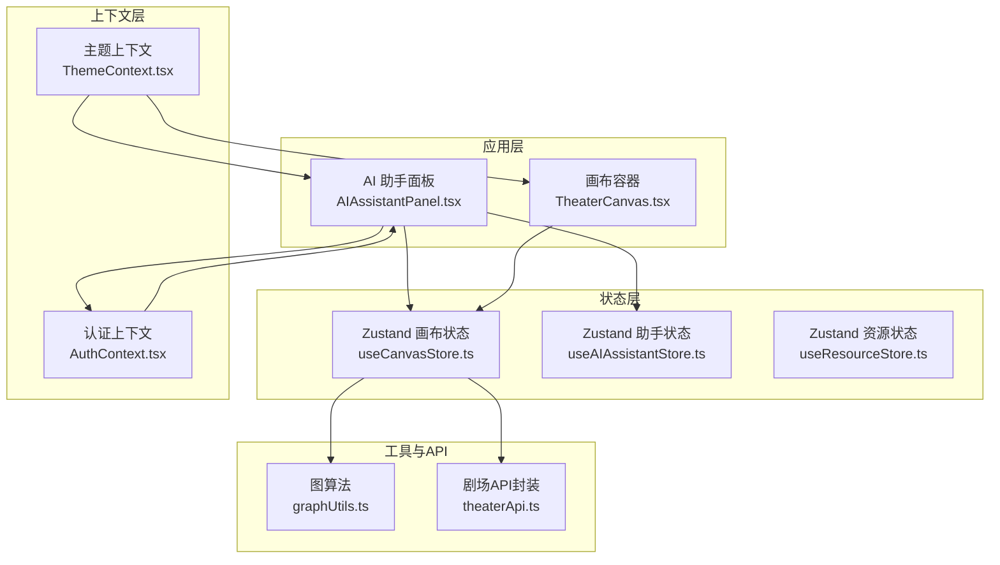
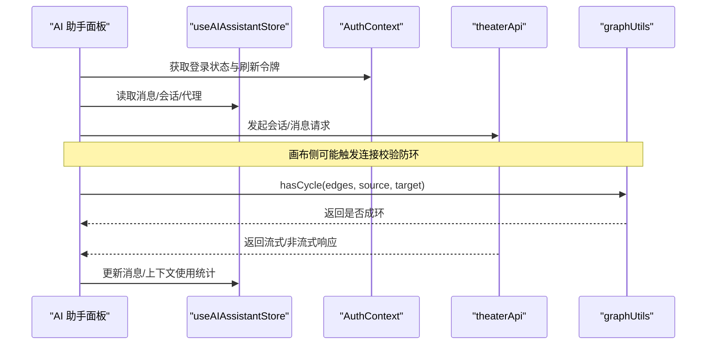
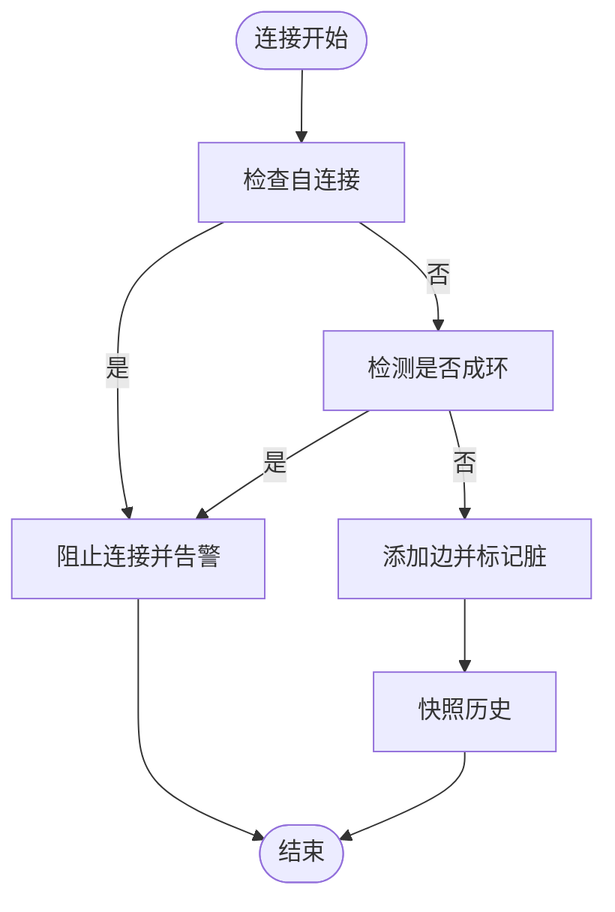
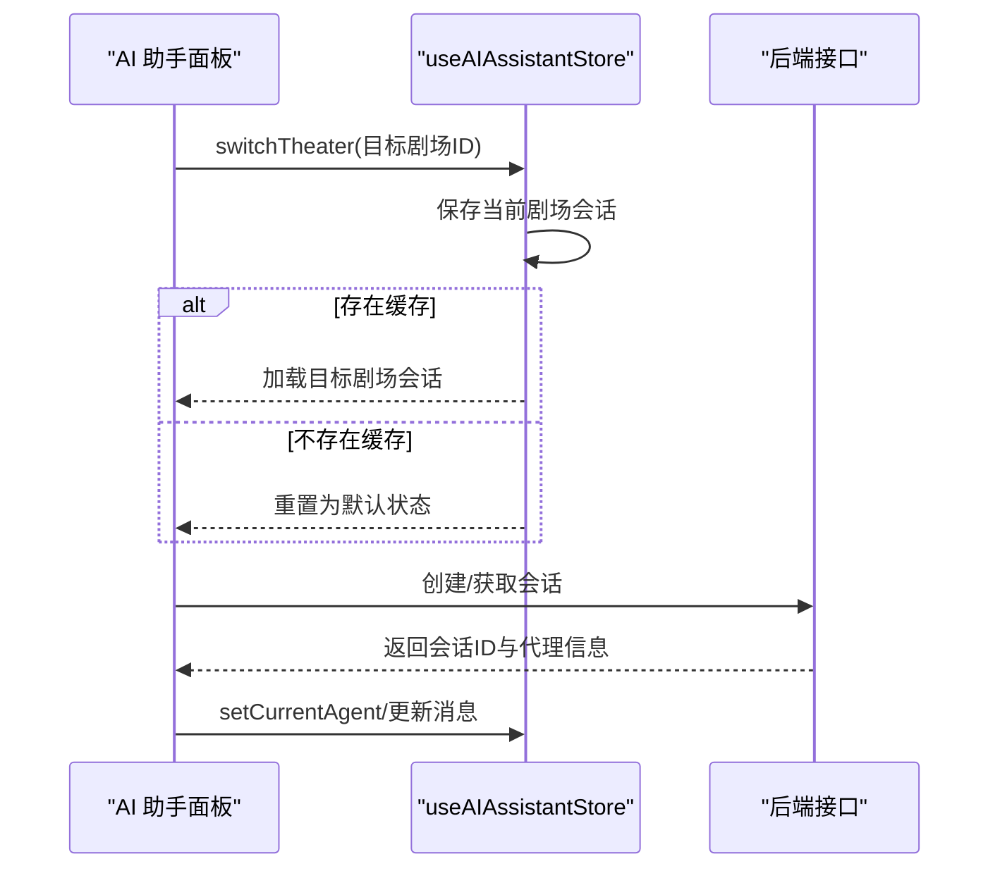
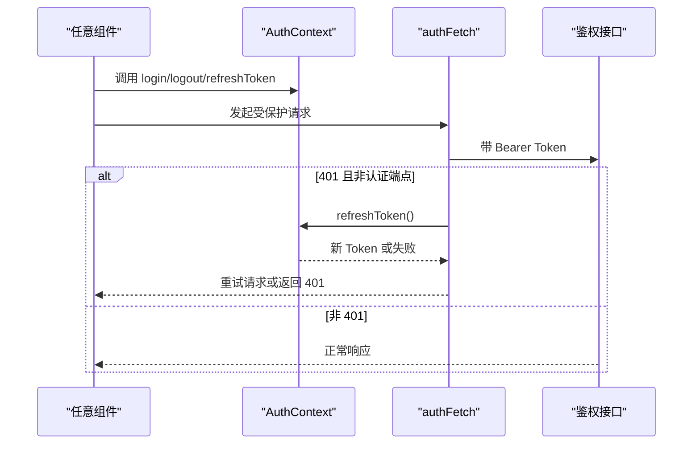
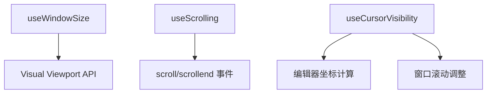
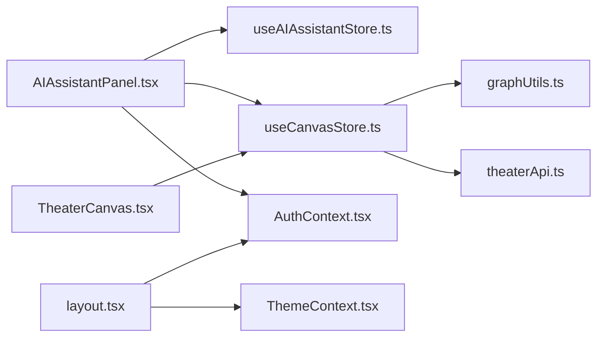

# 状态管理

<cite>
**本文引用的文件**
- [useCanvasStore.ts](file://frontend/src/store/useCanvasStore.ts)
- [useAIAssistantStore.ts](file://frontend/src/store/useAIAssistantStore.ts)
- [useResourceStore.ts](file://frontend/src/store/useResourceStore.ts)
- [AuthContext.tsx](file://frontend/src/context/AuthContext.tsx)
- [ThemeContext.tsx](file://frontend/src/context/ThemeContext.tsx)
- [use-cursor-visibility.ts](file://frontend/src/hooks/use-cursor-visibility.ts)
- [use-window-size.ts](file://frontend/src/hooks/use-window-size.ts)
- [use-scrolling.ts](file://frontend/src/hooks/use-scrolling.ts)
- [graphUtils.ts](file://frontend/src/lib/graphUtils.ts)
- [theaterApi.ts](file://frontend/src/lib/theaterApi.ts)
- [AIAssistantPanel.tsx](file://frontend/src/components/ai-assistant/AIAssistantPanel.tsx)
- [layout.tsx](file://frontend/src/app/layout.tsx)
- [TheaterCanvas.tsx](file://frontend/src/components/TheaterCanvas.tsx)
</cite>

## 目录
1. [简介](#简介)
2. [项目结构](#项目结构)
3. [核心组件](#核心组件)
4. [架构总览](#架构总览)
5. [详细组件分析](#详细组件分析)
6. [依赖关系分析](#依赖关系分析)
7. [性能考量](#性能考量)
8. [故障排查指南](#故障排查指南)
9. [结论](#结论)
10. [附录](#附录)

## 简介
本文件系统性梳理 KunFlix 前端的状态管理方案，重点覆盖以下方面：
- 基于 Zustand 的画布状态与 AI 助手状态管理，含持久化策略与中间件使用
- 基于 React Context 的全局上下文（认证与主题），以及自定义 Hook 的设计模式（光标可见性、窗口尺寸监听、滚动状态）
- 状态结构、动作函数、历史快照与撤销/重做、前后端同步与一致性策略
- 状态同步、性能优化与内存管理策略
- 状态调试、测试与重构最佳实践
- 具体实现示例与使用指南（以路径引用代替代码片段）

## 项目结构
前端状态管理主要分布在以下目录与文件：
- store：Zustand 状态仓库（useCanvasStore、useAIAssistantStore、useResourceStore）
- context：全局上下文（AuthContext、ThemeContext）
- hooks：自定义 Hook（use-cursor-visibility、use-window-size、use-scrolling）
- lib：与业务强相关的工具与 API 封装（graphUtils、theaterApi）
- components：状态消费者与集成点（AIAssistantPanel、TheaterCanvas 等）

图表来源
- [AIAssistantPanel.tsx:1-200](file://frontend/src/components/ai-assistant/AIAssistantPanel.tsx#L1-L200)
- [useCanvasStore.ts:1-540](file://frontend/src/store/useCanvasStore.ts#L1-L540)
- [useAIAssistantStore.ts:1-381](file://frontend/src/store/useAIAssistantStore.ts#L1-L381)
- [useResourceStore.ts:1-182](file://frontend/src/store/useResourceStore.ts#L1-L182)
- [AuthContext.tsx:1-207](file://frontend/src/context/AuthContext.tsx#L1-L207)
- [ThemeContext.tsx:1-75](file://frontend/src/context/ThemeContext.tsx#L1-L75)
- [graphUtils.ts:1-39](file://frontend/src/lib/graphUtils.ts#L1-L39)
- [theaterApi.ts:1-159](file://frontend/src/lib/theaterApi.ts#L1-L159)

章节来源
- [layout.tsx:1-42](file://frontend/src/app/layout.tsx#L1-L42)

## 核心组件
- useCanvasStore：负责画布节点、边、视口、历史快照、撤销/重做、与后端剧场数据的同步与保存
- useAIAssistantStore：负责 AI 助手面板的可见性、消息、会话、代理切换、面板尺寸与拖拽、附件与上下文使用统计等
- useResourceStore：负责资源列表、分页、过滤、上传队列与同步
- AuthContext：提供认证状态、登录/登出、令牌刷新与带自动刷新的 fetch 包装
- ThemeContext：提供主题切换与持久化
- 自定义 Hook：useWindowSize、useScrolling、useCursorVisibility

章节来源
- [useCanvasStore.ts:67-114](file://frontend/src/store/useCanvasStore.ts#L67-L114)
- [useAIAssistantStore.ts:104-200](file://frontend/src/store/useAIAssistantStore.ts#L104-L200)
- [useResourceStore.ts:18-43](file://frontend/src/store/useResourceStore.ts#L18-L43)
- [AuthContext.tsx:31-47](file://frontend/src/context/AuthContext.tsx#L31-L47)
- [ThemeContext.tsx:9-12](file://frontend/src/context/ThemeContext.tsx#L9-L12)
- [use-window-size.ts:6-29](file://frontend/src/hooks/use-window-size.ts#L6-L29)
- [use-scrolling.ts:7-10](file://frontend/src/hooks/use-scrolling.ts#L7-L10)
- [use-cursor-visibility.ts:8-17](file://frontend/src/hooks/use-cursor-visibility.ts#L8-L17)

## 架构总览
- 状态存储：Zustand 提供轻量级状态容器，支持持久化中间件与选择器订阅
- 上下文：React Context 提供全局认证与主题能力，贯穿应用根布局
- 工具与 API：graphUtils 提供图算法（防环检测），theaterApi 封装剧场相关接口
- 组件集成：AI 助手面板与画布容器分别消费对应状态，并通过上下文共享认证能力

图表来源
- [AIAssistantPanel.tsx:1-200](file://frontend/src/components/ai-assistant/AIAssistantPanel.tsx#L1-L200)
- [useAIAssistantStore.ts:1-381](file://frontend/src/store/useAIAssistantStore.ts#L1-L381)
- [AuthContext.tsx:1-207](file://frontend/src/context/AuthContext.tsx#L1-L207)
- [theaterApi.ts:1-159](file://frontend/src/lib/theaterApi.ts#L1-L159)
- [graphUtils.ts:1-39](file://frontend/src/lib/graphUtils.ts#L1-L39)

## 详细组件分析

### 画布状态管理（useCanvasStore）
- 状态结构
  - nodes/edges：@xyflow/react 节点与边集合
  - viewport：当前视口位置与缩放
  - 同步与脏标记：theaterId、theaterTitle、isLoading/isSaving/isDirty、lastSavedAt
  - 历史：history 与 historyIndex，支持撤销/重做
  - 设置：snapToGrid、snapToGuides
- 关键动作
  - onNodesChange/onEdgesChange：应用变更并按显著度标记脏
  - onConnect：防自环与成环检测，添加边并快照
  - addNode/deleteNode/deleteEdge/reset/updateNodeData/updateNodeDimensions/setViewport
  - takeSnapshot/undo/redo：历史快照与索引维护
  - loadTheater/syncTheater/saveToBackend：与后端剧场数据的加载、合并与保存
  - markDirty：显式标记脏
- 中间件与持久化
  - 使用 persist 中间件，localStorage 存储，partialize 仅持久化必要字段
  - merge 合并策略：去重节点、保留本地最新状态
- 数据映射
  - nodeToApi/apiToNode、edgeToApi/apiToEdge：前后端数据结构转换
- 性能与一致性
  - applyDetail/loadTheater 后重置状态并标记脏
  - syncTheater 对比差异，仅在变化时更新，避免不必要的重绘
  - 保存时先更新标题，再保存画布，最后同步服务器返回的计数等信息

图表来源
- [useCanvasStore.ts:238-254](file://frontend/src/store/useCanvasStore.ts#L238-L254)
- [graphUtils.ts:4-38](file://frontend/src/lib/graphUtils.ts#L4-L38)

章节来源
- [useCanvasStore.ts:67-114](file://frontend/src/store/useCanvasStore.ts#L67-L114)
- [useCanvasStore.ts:185-540](file://frontend/src/store/useCanvasStore.ts#L185-L540)
- [graphUtils.ts:1-39](file://frontend/src/lib/graphUtils.ts#L1-L39)
- [theaterApi.ts:107-159](file://frontend/src/lib/theaterApi.ts#L107-L159)

### AI 助手状态管理（useAIAssistantStore）
- 状态结构
  - 面板可见性、当前剧场、消息列表、会话（sessionId/agentId/agentName）、可用代理
  - 剧场会话缓存：按剧场ID缓存消息与上下文使用
  - 面板尺寸与位置、拖拽覆盖态、图像编辑上下文、节点附件（多图支持）
  - 上下文使用统计、虚拟滚动行为与预渲染数量
- 关键动作
  - 面板：setIsOpen/toggleOpen
  - 剧场切换：switchTheater，保存当前会话并加载目标剧场会话
  - 消息：setMessages/addMessage/updateLastMessage/clearMessages
  - 会话：setSessionId/setAgentId/setAgentName/setCurrentAgent/clearSession/clearMessagesKeepSession
  - 代理：setAvailableAgents
  - 面板：setPanelSize/resetPanelSize/setPanelPosition/resetPanelPosition
  - 图像编辑上下文：setImageEditContext/clearImageEditContext（与附件互斥）
  - 节点附件：setNodeAttachments/addNodeAttachment/removeNodeAttachment/clearNodeAttachments（最多5个，与图像编辑上下文互斥）
  - 拖拽覆盖：setIsDragOverPanel
  - 上下文使用：setContextUsage
  - 虚拟滚动：setScrollBehavior/setOverscanCount
- 持久化
  - 使用 persist 中间件，仅持久化面板状态、当前剧场、会话与消息等关键字段

图表来源
- [useAIAssistantStore.ts:235-277](file://frontend/src/store/useAIAssistantStore.ts#L235-L277)
- [AIAssistantPanel.tsx:1-200](file://frontend/src/components/ai-assistant/AIAssistantPanel.tsx#L1-L200)

章节来源
- [useAIAssistantStore.ts:104-200](file://frontend/src/store/useAIAssistantStore.ts#L104-L200)
- [useAIAssistantStore.ts:209-381](file://frontend/src/store/useAIAssistantStore.ts#L209-L381)

### 资源状态管理（useResourceStore）
- 状态结构
  - 资源列表、总数、页码、每页大小、类型过滤、加载状态、是否还有更多
  - 上传队列：id、文件、进度、状态、错误信息
- 关键动作
  - fetchAssets/loadMore：分页拉取资源
  - setTypeFilter：切换类型过滤并重置列表
  - addUpload/removeUpload：管理上传队列
  - renameAsset/replaceAssetFile/deleteAsset：资源操作
  - syncAssetFromUpload：外部上传同步新资源
  - reset：重置所有状态
- 上传流程
  - 添加到队列后调用上传 API，实时更新进度；成功则插入列表头部并移除队列项；失败则标记错误

章节来源
- [useResourceStore.ts:18-43](file://frontend/src/store/useResourceStore.ts#L18-L43)
- [useResourceStore.ts:51-182](file://frontend/src/store/useResourceStore.ts#L51-L182)

### 全局上下文（AuthContext 与 ThemeContext）
- AuthContext
  - 用户信息、认证状态、登录/登出、更新余额、刷新令牌
  - createAuthFetch：统一处理 401 与令牌刷新，队列化并发请求
  - 路由守卫：未登录访问受保护路由跳转登录页
- ThemeContext
  - 主题切换（亮/暗）、持久化到 localStorage、SSR 安全处理
  - 通过 Ant Design ConfigProvider 注入主题算法与基础色值

图表来源
- [AuthContext.tsx:52-114](file://frontend/src/context/AuthContext.tsx#L52-L114)
- [AuthContext.tsx:119-207](file://frontend/src/context/AuthContext.tsx#L119-L207)

章节来源
- [AuthContext.tsx:31-47](file://frontend/src/context/AuthContext.tsx#L31-L47)
- [AuthContext.tsx:119-207](file://frontend/src/context/AuthContext.tsx#L119-L207)
- [ThemeContext.tsx:16-66](file://frontend/src/context/ThemeContext.tsx#L16-L66)

### 自定义 Hook 设计模式
- useWindowSize
  - 使用 Visual Viewport API 获取准确的视口宽高、偏移与缩放
  - 节流回调优化性能，仅在值变化时更新
- useScrolling
  - 监听滚动开始/结束，支持 scrollend 事件回退到定时器
  - 可选对 document 的回退，适配 window 滚动场景
- useCursorVisibility
  - 结合窗口高度与编辑器坐标，自动滚动保证光标可见
  - 与 toolbar 高度叠加，避免被遮挡

图表来源
- [use-window-size.ts:50-77](file://frontend/src/hooks/use-window-size.ts#L50-L77)
- [use-scrolling.ts:49-58](file://frontend/src/hooks/use-scrolling.ts#L49-L58)
- [use-cursor-visibility.ts:38-68](file://frontend/src/hooks/use-cursor-visibility.ts#L38-L68)

章节来源
- [use-window-size.ts:41-94](file://frontend/src/hooks/use-window-size.ts#L41-L94)
- [use-scrolling.ts:12-76](file://frontend/src/hooks/use-scrolling.ts#L12-L76)
- [use-cursor-visibility.ts:27-72](file://frontend/src/hooks/use-cursor-visibility.ts#L27-L72)

## 依赖关系分析
- 组件与状态
  - AIAssistantPanel 消费 useAIAssistantStore 与 useCanvasStore，同时依赖 AuthContext 提供的认证能力
  - TheaterCanvas 作为画布容器，与 useCanvasStore 的节点/边/视口联动
- 工具与 API
  - useCanvasStore 依赖 graphUtils 进行环路检测，依赖 theaterApi 进行前后端同步
- 上下文与布局
  - layout.tsx 将 AuthProvider 与 ThemeProvider 包裹整个应用，确保全局可用

图表来源
- [AIAssistantPanel.tsx:1-200](file://frontend/src/components/ai-assistant/AIAssistantPanel.tsx#L1-L200)
- [TheaterCanvas.tsx:1-50](file://frontend/src/components/TheaterCanvas.tsx#L1-L50)
- [useCanvasStore.ts:1-540](file://frontend/src/store/useCanvasStore.ts#L1-L540)
- [useAIAssistantStore.ts:1-381](file://frontend/src/store/useAIAssistantStore.ts#L1-L381)
- [AuthContext.tsx:1-207](file://frontend/src/context/AuthContext.tsx#L1-L207)
- [ThemeContext.tsx:1-75](file://frontend/src/context/ThemeContext.tsx#L1-L75)
- [layout.tsx:23-41](file://frontend/src/app/layout.tsx#L23-L41)

章节来源
- [layout.tsx:23-41](file://frontend/src/app/layout.tsx#L23-L41)

## 性能考量
- 状态选择器订阅
  - 在组件中使用选择器读取状态，避免无关状态变更导致的重渲染
- 节流与去抖
  - useWindowSize 使用节流回调，减少高频视口变化带来的更新
  - useScrolling 使用去抖控制滚动结束判定，降低状态波动
- 历史与快照
  - 画布撤销/重做限制最大历史条目，防止内存膨胀
- 上传与列表
  - 资源上传采用队列与进度回调，成功后仅更新必要字段
- 虚拟滚动
  - AI 助手消息列表支持虚拟滚动与 overscan，提升长列表性能

章节来源
- [use-window-size.ts:50-77](file://frontend/src/hooks/use-window-size.ts#L50-L77)
- [use-scrolling.ts:49-58](file://frontend/src/hooks/use-scrolling.ts#L49-L58)
- [useCanvasStore.ts:116-117](file://frontend/src/store/useCanvasStore.ts#L116-L117)
- [useResourceStore.ts:103-131](file://frontend/src/store/useResourceStore.ts#L103-L131)
- [useAIAssistantStore.ts:197-199](file://frontend/src/store/useAIAssistantStore.ts#L197-L199)

## 故障排查指南
- 画布连接异常
  - 检查是否自连接或成环，确认 hasCycle 逻辑与 addEdge 流程
  - 查看 isDirty 与 takeSnapshot 是否正确触发
- 同步不一致
  - loadTheater 后重置状态并标记脏；syncTheater 仅在节点/边有差异时更新
  - 保存前先更新标题，再保存画布，最后同步服务器返回的计数
- 认证与刷新
  - 401 时自动尝试刷新令牌，若失败则登出并提示重新登录
  - 使用 createAuthFetch 包装请求，避免并发刷新队列阻塞
- 主题切换
  - 确认 localStorage 中的主题键值与 DOM 属性设置
- 虚拟滚动与长列表
  - 调整 overscanCount 与滚动行为，观察滚动卡顿与渲染性能

章节来源
- [useCanvasStore.ts:238-254](file://frontend/src/store/useCanvasStore.ts#L238-L254)
- [useCanvasStore.ts:388-505](file://frontend/src/store/useCanvasStore.ts#L388-L505)
- [AuthContext.tsx:52-114](file://frontend/src/context/AuthContext.tsx#L52-L114)
- [ThemeContext.tsx:31-37](file://frontend/src/context/ThemeContext.tsx#L31-L37)
- [useAIAssistantStore.ts:197-199](file://frontend/src/store/useAIAssistantStore.ts#L197-L199)

## 结论
本状态管理方案以 Zustand 为核心，结合 React Context 与自定义 Hook，实现了：
- 画布与 AI 助手的细粒度状态与持久化
- 认证与主题的全局能力
- 面向性能的节流、去抖、虚拟滚动与历史快照
- 与后端的可靠同步与一致性保障
建议在后续迭代中持续完善单元测试与集成测试，强化状态调试工具链，并对复杂交互进行可视化流程图与时序图辅助设计。

## 附录
- 使用指南
  - 在组件中通过选择器读取状态，避免订阅整块状态
  - 对高频事件（窗口尺寸、滚动）使用节流/去抖
  - 上传与列表更新尽量局部更新，减少重渲染
  - 画布连接前执行环路检测，确保图结构合法
- 示例路径
  - 画布连接与撤销/重做：[useCanvasStore.ts:238-376](file://frontend/src/store/useCanvasStore.ts#L238-L376)
  - 助手面板消息与会话：[useAIAssistantStore.ts:279-313](file://frontend/src/store/useAIAssistantStore.ts#L279-L313)
  - 认证与自动刷新：[AuthContext.tsx:52-114](file://frontend/src/context/AuthContext.tsx#L52-L114)
  - 主题切换与持久化：[ThemeContext.tsx:16-37](file://frontend/src/context/ThemeContext.tsx#L16-L37)
  - 窗口尺寸监听：[use-window-size.ts:41-94](file://frontend/src/hooks/use-window-size.ts#L41-L94)
  - 滚动状态管理：[use-scrolling.ts:12-76](file://frontend/src/hooks/use-scrolling.ts#L12-L76)
  - 光标可见性：[use-cursor-visibility.ts:27-72](file://frontend/src/hooks/use-cursor-visibility.ts#L27-L72)
  - 剧场 API 封装：[theaterApi.ts:107-159](file://frontend/src/lib/theaterApi.ts#L107-L159)
  - 图算法（防环）：[graphUtils.ts:4-38](file://frontend/src/lib/graphUtils.ts#L4-L38)