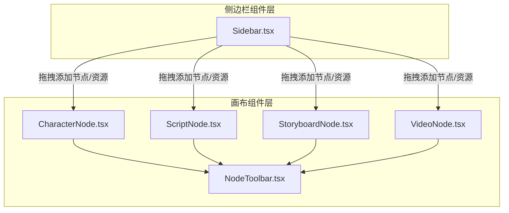
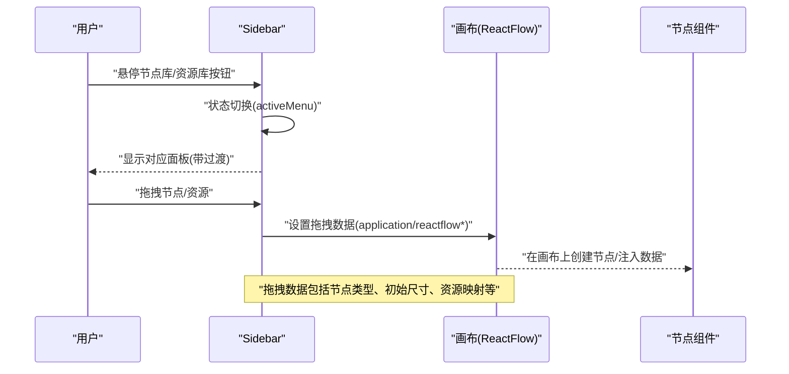
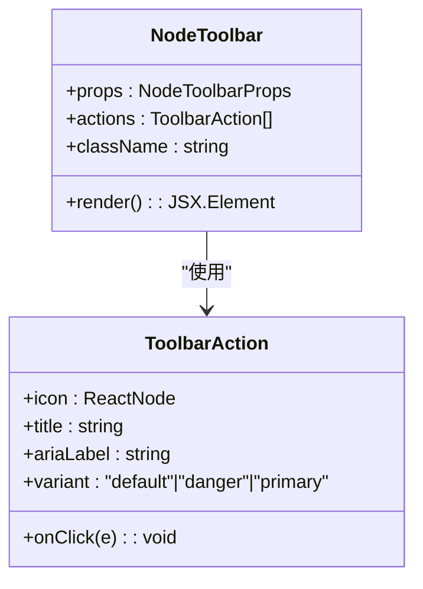
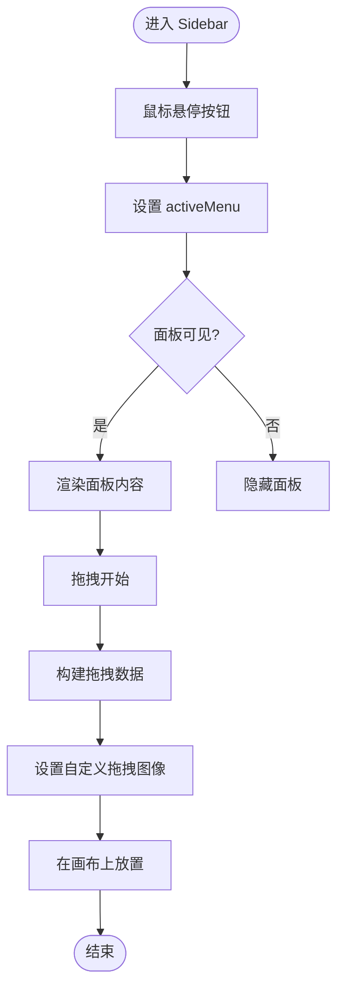
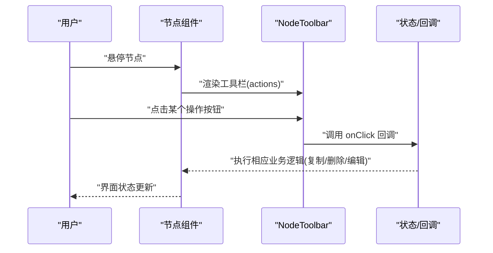
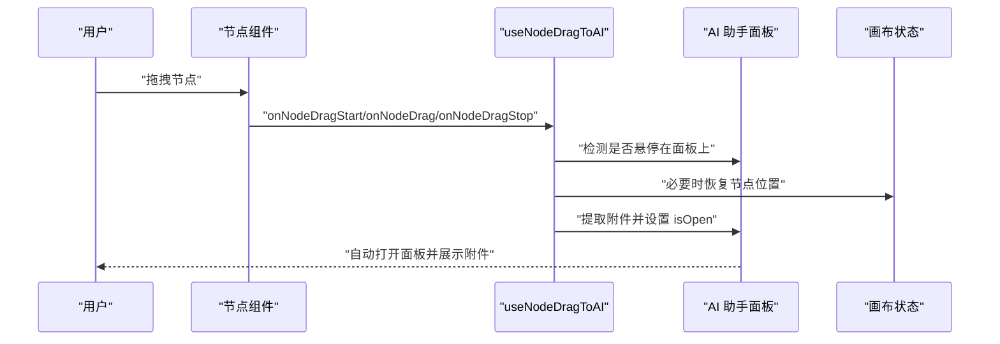
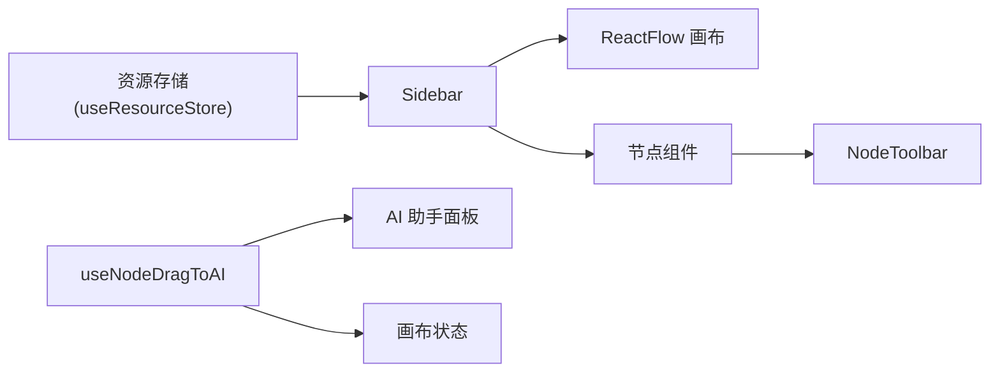

# 工具栏与侧边栏

<cite>
**本文引用的文件**
- [NodeToolbar.tsx](file://frontend/src/components/canvas/NodeToolbar.tsx)
- [Sidebar.tsx](file://frontend/src/components/canvas/Sidebar.tsx)
- [CharacterNode.tsx](file://frontend/src/components/canvas/CharacterNode.tsx)
- [ScriptNode.tsx](file://frontend/src/components/canvas/ScriptNode.tsx)
- [StoryboardNode.tsx](file://frontend/src/components/canvas/StoryboardNode.tsx)
- [VideoNode.tsx](file://frontend/src/components/canvas/VideoNode.tsx)
- [useNodeDragToAI.ts](file://frontend/src/app/theater/[id]/hooks/useNodeDragToAI.ts)
- [useCanvasShortcuts.ts](file://frontend/src/app/theater/[id]/hooks/useCanvasShortcuts.ts)
</cite>

## 目录
1. [简介](#简介)
2. [项目结构](#项目结构)
3. [核心组件](#核心组件)
4. [架构总览](#架构总览)
5. [详细组件分析](#详细组件分析)
6. [依赖关系分析](#依赖关系分析)
7. [性能考量](#性能考量)
8. [故障排查指南](#故障排查指南)
9. [结论](#结论)
10. [附录](#附录)

## 简介
本文件聚焦于画布工具栏与侧边栏两大交互模块，系统性阐述 NodeToolbar 节点工具栏与 Sidebar 侧边栏的实现架构、布局与功能分配、状态管理、动态显示与折叠展开机制、内容更新策略，并提供可扩展的配置定制与样式调整指南。同时给出工具栏操作示例与用户体验优化建议，帮助开发者与产品人员高效理解与迭代该能力。

## 项目结构
- 工具栏与侧边栏位于前端组件目录下，分别作为通用 UI 组件与画布节点配套 UI 存在。
- 工具栏通过被多个节点组件组合使用，形成统一的节点级操作入口；侧边栏提供节点库与资源库的拖拽添加能力。

图表来源
- [NodeToolbar.tsx:21-92](file://frontend/src/components/canvas/NodeToolbar.tsx#L21-L92)
- [Sidebar.tsx:121-339](file://frontend/src/components/canvas/Sidebar.tsx#L121-L339)
- [CharacterNode.tsx:473-500](file://frontend/src/components/canvas/CharacterNode.tsx#L473-L500)
- [ScriptNode.tsx:210-225](file://frontend/src/components/canvas/ScriptNode.tsx#L210-L225)
- [StoryboardNode.tsx:158-178](file://frontend/src/components/canvas/StoryboardNode.tsx#L158-L178)
- [VideoNode.tsx:382-403](file://frontend/src/components/canvas/VideoNode.tsx#L382-L403)

章节来源
- [NodeToolbar.tsx:1-95](file://frontend/src/components/canvas/NodeToolbar.tsx#L1-L95)
- [Sidebar.tsx:1-341](file://frontend/src/components/canvas/Sidebar.tsx#L1-L341)

## 核心组件
- NodeToolbar：节点级工具栏，支持动作分组、危险操作分离、悬浮显示与过渡动画、主操作高亮等特性。
- Sidebar：侧边栏，包含“节点库”和“资源库”两个子面板，支持标签页切换、懒加载资源、拖拽预览与自定义拖拽数据。

章节来源
- [NodeToolbar.tsx:4-15](file://frontend/src/components/canvas/NodeToolbar.tsx#L4-L15)
- [Sidebar.tsx:9-57](file://frontend/src/components/canvas/Sidebar.tsx#L9-L57)

## 架构总览
- NodeToolbar 作为通用组件被各节点组件组合使用，通过传入动作数组与变体控制视觉与行为。
- Sidebar 通过状态机控制菜单展开/收起，内部使用资源存储进行资源拉取与分组，提供拖拽事件封装与自定义拖拽图像。
- 画布层 Hook 提供拖拽到 AI 面板的检测与附件提取逻辑，辅助工具栏与侧边栏提升工作流效率。

图表来源
- [Sidebar.tsx:88-118](file://frontend/src/components/canvas/Sidebar.tsx#L88-L118)
- [Sidebar.tsx:121-166](file://frontend/src/components/canvas/Sidebar.tsx#L121-L166)
- [Sidebar.tsx:180-336](file://frontend/src/components/canvas/Sidebar.tsx#L180-L336)

## 详细组件分析

### NodeToolbar 组件分析
- 功能定位
  - 为节点提供一组操作按钮，支持默认、主操作(primary)、危险(danger)三类变体。
  - 自动对动作进行分组：非危险动作优先，危险动作置于末尾，危险动作前插入分隔线。
  - 基于父容器的 group-hover 实现悬浮显示，配合平滑过渡与缩放交互。
- 关键实现要点
  - 动作分组与索引计算，确保危险操作的视觉隔离。
  - 按钮样式根据变体动态切换，提供 hover/active 的视觉反馈。
  - 使用语义化 title 与 aria-label 提升无障碍体验。
- 可扩展性
  - 通过 ToolbarAction 接口扩展更多变体或图标。
  - 可在外部容器增加 group-hover 控制，实现更复杂的显示条件。

图表来源
- [NodeToolbar.tsx:4-15](file://frontend/src/components/canvas/NodeToolbar.tsx#L4-L15)
- [NodeToolbar.tsx:21-92](file://frontend/src/components/canvas/NodeToolbar.tsx#L21-L92)

章节来源
- [NodeToolbar.tsx:17-92](file://frontend/src/components/canvas/NodeToolbar.tsx#L17-L92)

### Sidebar 组件分析
- 功能定位
  - 节点库：内置多种节点类型，支持拖拽直接创建节点，附带初始数据与尺寸。
  - 资源库：按类型分组显示图片/视频/音频资源，支持懒加载与标签页切换。
  - 拖拽桥接：将资源映射为节点数据，统一处理拖拽事件与自定义拖拽预览。
- 关键实现要点
  - 鼠标进入/离开控制面板显隐，使用延时收起避免误触。
  - 资源分组与空态提示，标签页切换与滚动区域。
  - 拖拽数据构建器映射资源到节点类型与数据结构。
- 性能与可用性
  - 使用 useMemo 对资源分组进行稳定缓存，降低渲染成本。
  - 拖拽预览元素即时创建与清理，避免 DOM 泄漏。
  - 加载态与空态 UI 明确，提升用户感知。

图表来源
- [Sidebar.tsx:77-118](file://frontend/src/components/canvas/Sidebar.tsx#L77-L118)
- [Sidebar.tsx:180-336](file://frontend/src/components/canvas/Sidebar.tsx#L180-L336)

章节来源
- [Sidebar.tsx:59-341](file://frontend/src/components/canvas/Sidebar.tsx#L59-L341)

### 工具栏在节点中的使用示例
- 角色节点工具栏
  - 包含主操作“AI 编辑”、图片适配模式切换、复制与删除。
- 文本节点工具栏
  - 包含复制与删除。
- 多维表格节点工具栏
  - 包含全屏编辑、复制与删除。
- 视频节点工具栏
  - 包含视频适配模式切换、复制与删除。

图表来源
- [CharacterNode.tsx:473-500](file://frontend/src/components/canvas/CharacterNode.tsx#L473-L500)
- [ScriptNode.tsx:210-225](file://frontend/src/components/canvas/ScriptNode.tsx#L210-L225)
- [StoryboardNode.tsx:158-178](file://frontend/src/components/canvas/StoryboardNode.tsx#L158-L178)
- [VideoNode.tsx:382-403](file://frontend/src/components/canvas/VideoNode.tsx#L382-L403)
- [NodeToolbar.tsx:21-92](file://frontend/src/components/canvas/NodeToolbar.tsx#L21-L92)

章节来源
- [CharacterNode.tsx:473-500](file://frontend/src/components/canvas/CharacterNode.tsx#L473-L500)
- [ScriptNode.tsx:210-225](file://frontend/src/components/canvas/ScriptNode.tsx#L210-L225)
- [StoryboardNode.tsx:158-178](file://frontend/src/components/canvas/StoryboardNode.tsx#L158-L178)
- [VideoNode.tsx:382-403](file://frontend/src/components/canvas/VideoNode.tsx#L382-L403)

### 与画布交互的扩展能力
- 拖拽到 AI 面板
  - 检测节点拖拽是否进入 AI 面板区域，支持多选节点（最多 5 个图像节点），自动提取附件并打开 AI 面板。
- 快捷键支持
  - 支持撤销/重做快捷键，提升编辑效率。

图表来源
- [useNodeDragToAI.ts:32-119](file://frontend/src/app/theater/[id]/hooks/useNodeDragToAI.ts#L32-L119)
- [useCanvasShortcuts.ts:7-24](file://frontend/src/app/theater/[id]/hooks/useCanvasShortcuts.ts#L7-L24)

章节来源
- [useNodeDragToAI.ts:1-123](file://frontend/src/app/theater/[id]/hooks/useNodeDragToAI.ts#L1-L123)
- [useCanvasShortcuts.ts:1-26](file://frontend/src/app/theater/[id]/hooks/useCanvasShortcuts.ts#L1-L26)

## 依赖关系分析
- NodeToolbar 依赖于外部传入的动作数组与变体，样式通过工具函数合并，无额外依赖。
- Sidebar 依赖资源存储以获取账号级资源，使用拖拽数据构建器将资源映射为节点数据。
- 节点组件通过组合 NodeToolbar 实现统一的节点级操作入口。
- 画布层 Hook 与 Sidebar/节点组件共同构成“拖拽-放置-更新”的完整链路。

图表来源
- [Sidebar.tsx:65-70](file://frontend/src/components/canvas/Sidebar.tsx#L65-L70)
- [Sidebar.tsx:113-118](file://frontend/src/components/canvas/Sidebar.tsx#L113-L118)
- [CharacterNode.tsx:473-500](file://frontend/src/components/canvas/CharacterNode.tsx#L473-L500)
- [useNodeDragToAI.ts:69-119](file://frontend/src/app/theater/[id]/hooks/useNodeDragToAI.ts#L69-L119)

章节来源
- [Sidebar.tsx:1-341](file://frontend/src/components/canvas/Sidebar.tsx#L1-L341)
- [NodeToolbar.tsx:1-95](file://frontend/src/components/canvas/NodeToolbar.tsx#L1-L95)
- [useNodeDragToAI.ts:1-123](file://frontend/src/app/theater/[id]/hooks/useNodeDragToAI.ts#L1-L123)

## 性能考量
- 资源分组缓存：使用 useMemo 对资源按类型分组，避免重复计算。
- 拖拽预览清理：拖拽预览元素在创建后立即移除，防止 DOM 泄漏。
- 悬停显隐：通过延时收起避免误触导致的频繁切换。
- 动画与交互：过渡时间与缓动函数平衡流畅度与性能，避免过度动画影响低端设备。

## 故障排查指南
- 工具栏不显示
  - 检查父容器是否存在 group-hover 控制，确认工具栏的悬浮显示条件。
  - 确认 actions 数组非空，且每个动作包含 icon 与 onClick。
- 危险操作未正确分隔
  - 确认存在 variant 为 danger 的动作，检查分隔线渲染逻辑。
- 侧边栏面板不出现
  - 检查鼠标进入/离开事件绑定与 activeMenu 状态切换。
  - 确认面板的过渡类名与可见性控制逻辑。
- 拖拽无效
  - 检查 onDragStart 中是否正确设置 application/reactflow 相关数据。
  - 确认自定义拖拽图像创建与清理流程。
- 拖拽到 AI 面板无响应
  - 检查面板选择器与矩形检测逻辑，确认 isOverPanel 状态变更。
  - 确认附件提取数量上限与类型过滤逻辑。

章节来源
- [NodeToolbar.tsx:21-92](file://frontend/src/components/canvas/NodeToolbar.tsx#L21-L92)
- [Sidebar.tsx:77-118](file://frontend/src/components/canvas/Sidebar.tsx#L77-L118)
- [useNodeDragToAI.ts:13-66](file://frontend/src/app/theater/[id]/hooks/useNodeDragToAI.ts#L13-L66)

## 结论
NodeToolbar 与 Sidebar 共同构成了画布的“操作入口”与“素材入口”。前者提供节点级统一操作体验，后者提供节点与资源的便捷添加。二者通过清晰的状态管理、合理的拖拽桥接与可扩展的动作接口，支撑了高效、直观的创作流程。建议在后续迭代中进一步完善无障碍属性、性能监控与主题化能力，持续优化用户体验。

## 附录
- 配置定制建议
  - 动作变体：新增变体需同步更新样式映射与分隔线逻辑。
  - 节点库：新增节点类型需补充类型、图标、颜色、初始数据与尺寸。
  - 资源映射：新增资源类型需在拖拽数据构建器中注册映射规则。
- 扩展开发指南
  - 工具栏：通过 ToolbarAction 扩展更多操作，保持与现有变体体系一致。
  - 侧边栏：新增标签页时，注意内容区高度与滚动区域的适配。
- 样式调整指南
  - 使用 Tailwind 类名进行局部覆盖，避免全局污染。
  - 注意过渡时长与缓动曲线，保证交互一致性。
- 用户体验优化建议
  - 增加工具栏按钮的提示文案与无障碍标签。
  - 为侧边栏面板增加键盘导航支持（如 Tab 切换）。
  - 在资源库中增加搜索与筛选能力，提升大体量资源的查找效率。