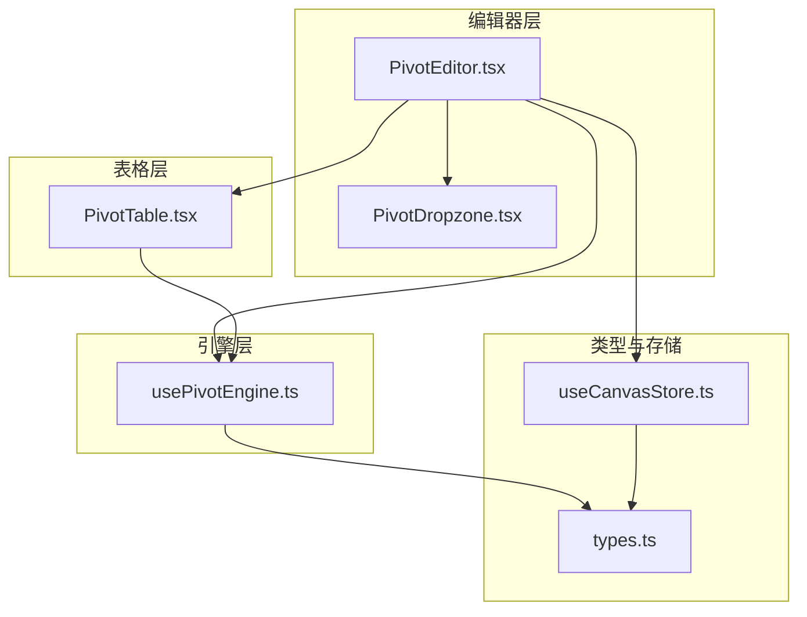
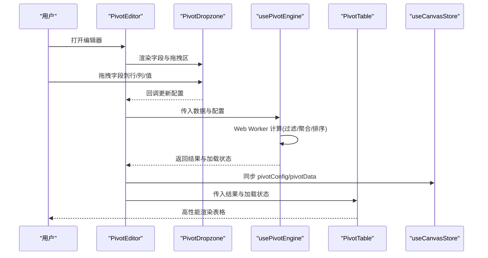
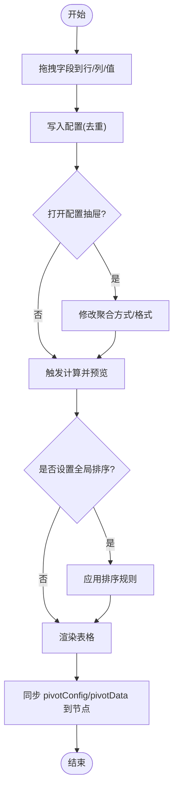
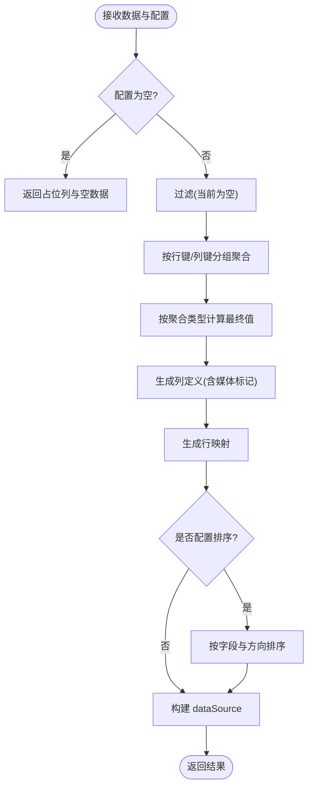

# 数据透视系统

<cite>
**本文引用的文件**
- [PivotEditor.tsx](file://frontend/src/components/canvas/pivot/PivotEditor.tsx)
- [PivotTable.tsx](file://frontend/src/components/canvas/pivot/PivotTable.tsx)
- [usePivotEngine.ts](file://frontend/src/components/canvas/pivot/usePivotEngine.ts)
- [PivotDropzone.tsx](file://frontend/src/components/canvas/pivot/PivotDropzone.tsx)
- [types.ts](file://frontend/src/components/canvas/pivot/types.ts)
- [README.md](file://frontend/src/components/canvas/pivot/README.md)
- [useCanvasStore.ts](file://frontend/src/store/useCanvasStore.ts)
- [StoryboardNode.tsx](file://frontend/src/components/canvas/StoryboardNode.tsx)
</cite>

## 目录
1. [简介](#简介)
2. [项目结构](#项目结构)
3. [核心组件](#核心组件)
4. [架构总览](#架构总览)
5. [组件详解](#组件详解)
6. [依赖关系分析](#依赖关系分析)
7. [性能考量](#性能考量)
8. [故障排查指南](#故障排查指南)
9. [结论](#结论)
10. [附录：配置与扩展](#附录配置与扩展)

## 简介
本文件面向画布数据透视系统，聚焦两个核心模块：PivotEditor 数据透视编辑器与 PivotTable 数据透视表格。内容涵盖数据透视引擎、字段配置、聚合计算与可视化展示；详细说明 PivotEditor 的编辑界面、字段拖拽、条件设置与实时预览；解释 PivotTable 的数据渲染、排序筛选、分组汇总与交互操作；并提供配置选项、扩展接口与性能优化策略，辅以实际应用示例与开发指南。

## 项目结构
数据透视系统位于前端画布组件目录下，围绕“编辑器 + 引擎 + 表格”的三层结构组织：
- 编辑器层：负责字段拖拽、配置管理与实时预览
- 引擎层：负责数据聚合、行列组合与结果输出
- 表格层：负责高性能渲染与媒体类型展示

图表来源
- [PivotEditor.tsx:1-229](file://frontend/src/components/canvas/pivot/PivotEditor.tsx#L1-L229)
- [PivotDropzone.tsx:1-57](file://frontend/src/components/canvas/pivot/PivotDropzone.tsx#L1-L57)
- [usePivotEngine.ts:1-188](file://frontend/src/components/canvas/pivot/usePivotEngine.ts#L1-L188)
- [PivotTable.tsx:1-63](file://frontend/src/components/canvas/pivot/PivotTable.tsx#L1-L63)
- [types.ts:1-28](file://frontend/src/components/canvas/pivot/types.ts#L1-L28)
- [useCanvasStore.ts:40-239](file://frontend/src/store/useCanvasStore.ts#L40-L239)

章节来源
- [PivotEditor.tsx:1-229](file://frontend/src/components/canvas/pivot/PivotEditor.tsx#L1-L229)
- [PivotTable.tsx:1-63](file://frontend/src/components/canvas/pivot/PivotTable.tsx#L1-L63)
- [usePivotEngine.ts:1-188](file://frontend/src/components/canvas/pivot/usePivotEngine.ts#L1-L188)
- [PivotDropzone.tsx:1-57](file://frontend/src/components/canvas/pivot/PivotDropzone.tsx#L1-L57)
- [types.ts:1-28](file://frontend/src/components/canvas/pivot/types.ts#L1-L28)
- [useCanvasStore.ts:40-239](file://frontend/src/store/useCanvasStore.ts#L40-L239)

## 核心组件
- PivotEditor：画布节点内的透视编辑器，提供字段面板、拖拽区域、配置抽屉与实时预览。
- PivotDropzone：行/列/值三个拖拽接收区，支持字段移除与点击进入配置抽屉。
- usePivotEngine：基于 Web Worker 的透视计算钩子，负责过滤、聚合、列名生成、排序等。
- PivotTable：基于 antd 的高性能表格，支持媒体列渲染、虚拟滚动与空态提示。
- 类型系统：统一定义字段、配置、结果与聚合类型，确保跨组件一致性。
- 存储集成：通过 useCanvasStore 同步节点的 pivotConfig 与 pivotData。

章节来源
- [PivotEditor.tsx:1-229](file://frontend/src/components/canvas/pivot/PivotEditor.tsx#L1-L229)
- [PivotDropzone.tsx:1-57](file://frontend/src/components/canvas/pivot/PivotDropzone.tsx#L1-L57)
- [usePivotEngine.ts:1-188](file://frontend/src/components/canvas/pivot/usePivotEngine.ts#L1-L188)
- [PivotTable.tsx:1-63](file://frontend/src/components/canvas/pivot/PivotTable.tsx#L1-L63)
- [types.ts:1-28](file://frontend/src/components/canvas/pivot/types.ts#L1-L28)
- [useCanvasStore.ts:40-239](file://frontend/src/store/useCanvasStore.ts#L40-L239)

## 架构总览
整体流程：用户在 PivotEditor 中拖拽字段到行/列/值区域，配置聚合与排序后，usePivotEngine 在 Web Worker 中执行透视计算，PivotTable 接收结果并以高性能方式渲染。

图表来源
- [PivotEditor.tsx:1-229](file://frontend/src/components/canvas/pivot/PivotEditor.tsx#L1-L229)
- [PivotDropzone.tsx:1-57](file://frontend/src/components/canvas/pivot/PivotDropzone.tsx#L1-L57)
- [usePivotEngine.ts:1-188](file://frontend/src/components/canvas/pivot/usePivotEngine.ts#L1-L188)
- [PivotTable.tsx:1-63](file://frontend/src/components/canvas/pivot/PivotTable.tsx#L1-L63)
- [useCanvasStore.ts:40-239](file://frontend/src/store/useCanvasStore.ts#L40-L239)

## 组件详解

### PivotEditor：编辑器与实时预览
- 字段面板：默认提供一组示例字段，支持拖拽到行/列/值区域；当存在外部数据时，应动态替换为真实字段集合。
- 拖拽逻辑：通过 HTML5 拖拽事件传输字段信息，drop 区域去重并写入配置。
- 值字段配置：点击值项打开右侧抽屉，支持切换聚合方式（sum/count/avg/max/min），并可扩展格式化选项。
- 全局排序：在抽屉中选择按某行或值字段排序，支持升/降序。
- 实时同步：将当前配置与计算结果写回节点数据，供画布其他部分使用。

图表来源
- [PivotEditor.tsx:1-229](file://frontend/src/components/canvas/pivot/PivotEditor.tsx#L1-L229)

章节来源
- [PivotEditor.tsx:1-229](file://frontend/src/components/canvas/pivot/PivotEditor.tsx#L1-L229)

### PivotDropzone：拖拽接收区
- 支持拖拽覆盖与放置回调，解析拖拽数据并调用上层 onDrop。
- 提供字段项点击回调，用于打开值字段配置抽屉。
- 支持点击“×”移除字段，保证配置整洁。

章节来源
- [PivotDropzone.tsx:1-57](file://frontend/src/components/canvas/pivot/PivotDropzone.tsx#L1-L57)

### usePivotEngine：透视计算引擎
- Web Worker：将计算逻辑放入独立线程，避免阻塞 UI；主线程仅负责调度与状态管理。
- 计算步骤：
  - 过滤：当前实现为空过滤，后续可接入 filter 字段。
  - 聚合：按行键与列键组合，对每个值字段维护 sum/count/min/max，再按聚合类型计算最终值。
  - 列名生成：行固定左列，列标题根据列键拆分与值字段聚合组合生成。
  - 排序：按配置的首个排序字段与方向进行稳定排序。
- 结果结构：columns 与 dataSource，供表格层直接消费。

图表来源
- [usePivotEngine.ts:1-188](file://frontend/src/components/canvas/pivot/usePivotEngine.ts#L1-L188)

章节来源
- [usePivotEngine.ts:1-188](file://frontend/src/components/canvas/pivot/usePivotEngine.ts#L1-L188)

### PivotTable：高性能渲染与媒体展示
- 列处理：对带媒体标记的列进行渲染包装，自动识别图片与视频链接并渲染媒体元素。
- 空态：当无数据且非加载时显示提示与引导文案。
- 性能：启用 antd 虚拟滚动与滚动边界，支持大数据量场景下的流畅滚动。

章节来源
- [PivotTable.tsx:1-63](file://frontend/src/components/canvas/pivot/PivotTable.tsx#L1-L63)

### 类型系统：统一数据契约
- PivotField：字段标识、名称与类型（字符串/数字/日期/图片/视频）。
- PivotValueField：值字段的字段标识、聚合类型与可选格式化参数。
- PivotConfig：rows/cols/values/sort/filter 等配置。
- PivotDataResult：columns 与 dataSource 的结果结构。

章节来源
- [types.ts:1-28](file://frontend/src/components/canvas/pivot/types.ts#L1-L28)

### 与画布存储的集成
- 节点数据：StoryboardNodeData 中包含 pivotConfig 与 pivotData，编辑器在运行时同步更新。
- 更新机制：useCanvasStore.updateNodeData 用于持久化配置与结果，便于画布整体保存与恢复。

章节来源
- [useCanvasStore.ts:40-239](file://frontend/src/store/useCanvasStore.ts#L40-L239)
- [PivotEditor.tsx:1-229](file://frontend/src/components/canvas/pivot/PivotEditor.tsx#L1-L229)

## 依赖关系分析
- 组件耦合：PivotEditor 依赖 PivotDropzone、usePivotEngine、PivotTable 与 useCanvasStore；PivotTable 依赖 usePivotEngine 的结果；usePivotEngine 依赖 types 定义。
- 外部依赖：antd 表格、Lucide 图标、React 状态与生命周期。
- 数据流：从拖拽配置到计算再到渲染，形成单向数据流，状态集中于编辑器与存储。

图表来源
- [PivotEditor.tsx:1-229](file://frontend/src/components/canvas/pivot/PivotEditor.tsx#L1-L229)
- [PivotDropzone.tsx:1-57](file://frontend/src/components/canvas/pivot/PivotDropzone.tsx#L1-L57)
- [usePivotEngine.ts:1-188](file://frontend/src/components/canvas/pivot/usePivotEngine.ts#L1-L188)
- [PivotTable.tsx:1-63](file://frontend/src/components/canvas/pivot/PivotTable.tsx#L1-L63)
- [types.ts:1-28](file://frontend/src/components/canvas/pivot/types.ts#L1-L28)
- [useCanvasStore.ts:40-239](file://frontend/src/store/useCanvasStore.ts#L40-L239)

## 性能考量
- Web Worker：将透视计算移至后台线程，主线程仅负责状态切换与渲染，避免 UI 卡顿。
- 虚拟滚动：PivotTable 开启虚拟滚动与固定尺寸，保障大数据量滚动帧率。
- 分页与滚动边界：通过分页与数值滚动尺寸控制单屏节点数量，减少 DOM 压力。
- 列宽与布局：合理设置列宽与横向滚动，结合外层容器隐藏溢出，提升可读性与性能。
- 计算复杂度：当前实现按行键/列键组合建立映射，时间复杂度近似 O(N)，适合中大型数据集。

章节来源
- [README.md:36-40](file://frontend/src/components/canvas/pivot/README.md#L36-L40)
- [PivotTable.tsx:1-63](file://frontend/src/components/canvas/pivot/PivotTable.tsx#L1-L63)
- [usePivotEngine.ts:1-188](file://frontend/src/components/canvas/pivot/usePivotEngine.ts#L1-L188)

## 故障排查指南
- 无数据或空白表格
  - 检查是否有外部数据源接入；若无，编辑器将使用默认空数据与默认字段。
  - 确认已将字段拖入行/列/值区域，否则引擎返回占位列。
- 聚合结果异常
  - 确认值字段类型为数字，否则聚合可能不生效。
  - 检查排序字段是否存在于生成的列中（如值字段的聚合列）。
- 性能问题
  - 大数据量时优先启用虚拟滚动与分页。
  - 控制列数与列宽，避免过宽导致滚动性能下降。
- Web Worker 错误
  - 查看控制台错误日志，确认 Worker 初始化与消息通信正常。
  - 如需在测试环境验证，可参考测试用例中的 Worker Mock 方案。

章节来源
- [PivotEditor.tsx:1-229](file://frontend/src/components/canvas/pivot/PivotEditor.tsx#L1-L229)
- [usePivotEngine.ts:1-188](file://frontend/src/components/canvas/pivot/usePivotEngine.ts#L1-L188)
- [PivotTable.tsx:1-63](file://frontend/src/components/canvas/pivot/PivotTable.tsx#L1-L63)

## 结论
数据透视系统以“编辑器 + 引擎 + 表格”为核心，通过拖拽式配置与 Web Worker 计算实现了低耦合、高扩展、高性能的数据透视体验。编辑器提供直观的字段管理与实时预览，引擎完成复杂的分组聚合与排序，表格层以虚拟滚动与媒体渲染保障大体量数据的流畅展示。配合画布存储，系统可无缝融入画布工作流，满足多维数据分析与可视化需求。

## 附录：配置与扩展

### 配置项说明
- 行/列/值
  - 行：决定表格左侧固定列与行分组
  - 列：决定表头横向分组
  - 值：指定字段与聚合方式（sum/count/avg/max/min）
- 全局排序
  - 支持按行字段或值字段（聚合后列）排序，支持升/降序
- 过滤（扩展建议）
  - 可在配置中增加 filter 数组，引擎侧预留过滤位置，便于后续实现

章节来源
- [types.ts:16-27](file://frontend/src/components/canvas/pivot/types.ts#L16-L27)
- [PivotEditor.tsx:205-222](file://frontend/src/components/canvas/pivot/PivotEditor.tsx#L205-L222)
- [usePivotEngine.ts:20-32](file://frontend/src/components/canvas/pivot/usePivotEngine.ts#L20-L32)

### 实际应用示例
- 示例一：影片制作成本分析
  - 行：部门/阶段；列：年份；值：成本（sum）+ 发票数量（count）
  - 全局排序：按成本降序
- 示例二：角色出场统计
  - 行：角色；列：场景类型；值：出场次数（count）+ 平均时长（avg）
  - 全局排序：按出场次数降序

### 开发指南
- 新增聚合类型
  - 在类型定义中扩展聚合类型枚举
  - 在编辑器抽屉中添加对应选项
  - 在引擎中补充聚合分支与默认值处理
- 增加过滤器
  - 在配置中加入 filter 字段
  - 在引擎中实现过滤逻辑后再进入聚合阶段
- 媒体列渲染扩展
  - 在表格列处理中增加新的媒体类型识别与渲染组件
- 性能优化
  - 对超大结果集启用分页与虚拟滚动
  - 合理设置列宽与横向滚动，避免过度渲染
  - 在 Worker 内尽量减少对象创建与深拷贝

章节来源
- [types.ts:1-14](file://frontend/src/components/canvas/pivot/types.ts#L1-L14)
- [PivotEditor.tsx:170-225](file://frontend/src/components/canvas/pivot/PivotEditor.tsx#L170-L225)
- [usePivotEngine.ts:66-79](file://frontend/src/components/canvas/pivot/usePivotEngine.ts#L66-L79)
- [PivotTable.tsx:10-31](file://frontend/src/components/canvas/pivot/PivotTable.tsx#L10-L31)