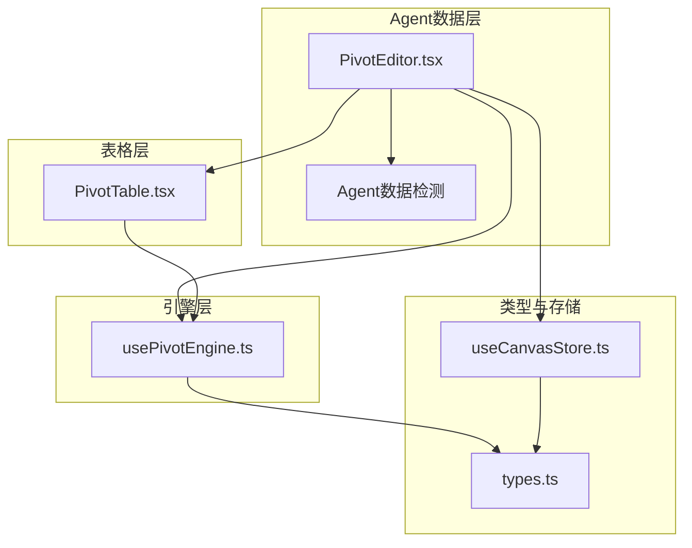
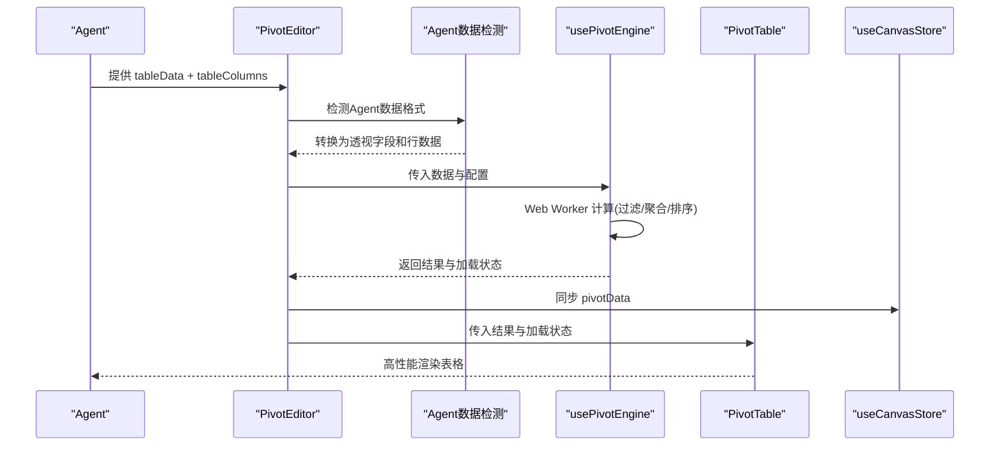
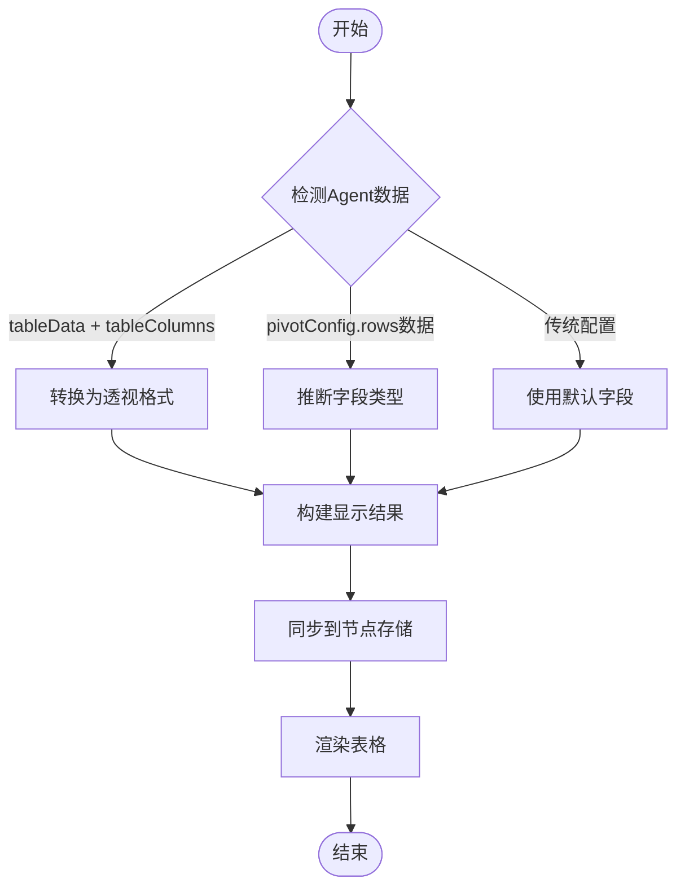
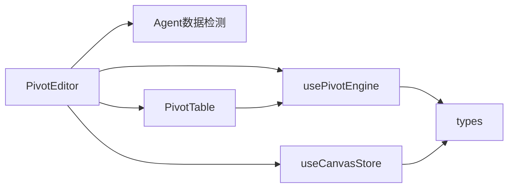

# 数据透视系统

<cite>
**本文引用的文件**
- [PivotEditor.tsx](file://frontend/src/components/canvas/pivot/PivotEditor.tsx)
- [PivotTable.tsx](file://frontend/src/components/canvas/pivot/PivotTable.tsx)
- [usePivotEngine.ts](file://frontend/src/components/canvas/pivot/usePivotEngine.ts)
- [types.ts](file://frontend/src/components/canvas/pivot/types.ts)
- [README.md](file://frontend/src/components/canvas/pivot/README.md)
- [useCanvasStore.ts](file://frontend/src/store/useCanvasStore.ts)
- [StoryboardNode.tsx](file://frontend/src/components/canvas/StoryboardNode.tsx)
</cite>

## 更新摘要
**所做更改**
- 更新了架构概述以反映透视系统的重大重构
- 修改了组件详解部分，重点介绍新的Agent驱动的数据透视模式
- 更新了依赖关系分析，反映新的数据流架构
- 修正了性能考量和故障排查指南
- 更新了附录配置与扩展部分

## 目录
1. [简介](#简介)
2. [项目结构](#项目结构)
3. [核心组件](#核心组件)
4. [架构总览](#架构总览)
5. [组件详解](#组件详解)
6. [依赖关系分析](#依赖关系分析)
7. [性能考量](#性能考量)
8. [故障排查指南](#故障排查指南)
9. [结论](#结论)
10. [附录：配置与扩展](#附录配置与扩展)

## 简介
本文件面向画布数据透视系统，聚焦透视编辑器与数据透视表格的重构实现。经过重大重构后，系统现在采用Agent驱动的数据透视模式，StoryBoardNode直接支持Agent提供的表格数据，无需手动配置透视表。内容涵盖数据透视引擎、字段配置、聚合计算与可视化展示；详细说明透视编辑器的新架构、Agent数据检测与转换、实时数据绑定与性能优化策略。

## 项目结构
数据透视系统经过重构后，围绕"Agent数据检测 + 透视引擎 + 表格渲染"的三层结构组织：
- Agent数据层：负责检测和转换Agent提供的表格数据
- 引擎层：负责数据聚合、行列组合与结果输出
- 表格层：负责高性能渲染与媒体类型展示

**图表来源**
- [PivotEditor.tsx:1-99](file://frontend/src/components/canvas/pivot/PivotEditor.tsx#L1-L99)
- [usePivotEngine.ts:1-188](file://frontend/src/components/canvas/pivot/usePivotEngine.ts#L1-L188)
- [PivotTable.tsx:1-63](file://frontend/src/components/canvas/pivot/PivotTable.tsx#L1-L63)
- [types.ts:1-28](file://frontend/src/components/canvas/pivot/types.ts#L1-L28)
- [useCanvasStore.ts:44-52](file://frontend/src/store/useCanvasStore.ts#L44-L52)

## 核心组件
- PivotEditor：重构后的透视编辑器，具备Agent数据检测与转换能力，提供实时数据绑定与表格渲染。
- usePivotEngine：基于 Web Worker 的透视计算钩子，负责过滤、聚合、列名生成、排序等。
- PivotTable：基于 antd 的高性能表格，支持媒体列渲染、虚拟滚动与空态提示。
- 类型系统：统一定义字段、配置、结果与聚合类型，确保跨组件一致性。
- 存储集成：通过 useCanvasStore 同步节点的 pivotConfig 与 pivotData。

**章节来源**
- [PivotEditor.tsx:1-99](file://frontend/src/components/canvas/pivot/PivotEditor.tsx#L1-L99)
- [usePivotEngine.ts:1-188](file://frontend/src/components/canvas/pivot/usePivotEngine.ts#L1-L188)
- [PivotTable.tsx:1-63](file://frontend/src/components/canvas/pivot/PivotTable.tsx#L1-L63)
- [types.ts:1-28](file://frontend/src/components/canvas/pivot/types.ts#L1-L28)
- [useCanvasStore.ts:44-52](file://frontend/src/store/useCanvasStore.ts#L44-L52)

## 架构总览
重构后的整体流程：Agent提供原始表格数据，PivotEditor自动检测并转换为透视格式，usePivotEngine在 Web Worker 中执行透视计算，PivotTable接收结果并以高性能方式渲染。

**图表来源**
- [PivotEditor.tsx:19-84](file://frontend/src/components/canvas/pivot/PivotEditor.tsx#L19-L84)
- [usePivotEngine.ts:3-187](file://frontend/src/components/canvas/pivot/usePivotEngine.ts#L3-L187)
- [PivotTable.tsx:10-62](file://frontend/src/components/canvas/pivot/PivotTable.tsx#L10-L62)
- [useCanvasStore.ts:44-52](file://frontend/src/store/useCanvasStore.ts#L44-L52)

## 组件详解

### PivotEditor：重构后的数据透视编辑器
重构后的PivotEditor具备以下新特性：
- **Agent数据检测**：自动检测Agent提供的三种数据格式（tableData + tableColumns、pivotConfig.rows作为数据对象、传统透视配置）
- **智能字段推断**：根据Agent提供的列定义自动推断字段类型（字符串/数字/图片/视频）
- **实时数据绑定**：将转换后的数据结构同步到节点存储，供画布其他部分使用
- **默认字段支持**：当无Agent数据时，提供默认字段集合

**图表来源**
- [PivotEditor.tsx:26-84](file://frontend/src/components/canvas/pivot/PivotEditor.tsx#L26-L84)

**章节来源**
- [PivotEditor.tsx:1-99](file://frontend/src/components/canvas/pivot/PivotEditor.tsx#L1-L99)

### usePivotEngine：透视计算引擎
- Web Worker：将计算逻辑放入独立线程，避免阻塞 UI；主线程仅负责调度与状态管理。
- 计算步骤：
  - 过滤：当前实现为空过滤，后续可接入 filter 字段。
  - 聚合：按行键与列键组合，对每个值字段维护 sum/count/min/max，再按聚合类型计算最终值。
  - 列名生成：行固定左列，列标题根据列键拆分与值字段聚合组合生成。
  - 排序：按配置的首个排序字段与方向进行稳定排序。
- 结果结构：columns 与 dataSource，供表格层直接消费。

**章节来源**
- [usePivotEngine.ts:1-188](file://frontend/src/components/canvas/pivot/usePivotEngine.ts#L1-L188)

### PivotTable：高性能渲染与媒体展示
- 列处理：对带媒体标记的列进行渲染包装，自动识别图片与视频链接并渲染媒体元素。
- 空态：当无数据且非加载时显示提示与引导文案。
- 性能：启用 antd 虚拟滚动与滚动边界，支持大数据量场景下的流畅滚动。

**章节来源**
- [PivotTable.tsx:1-63](file://frontend/src/components/canvas/pivot/PivotTable.tsx#L1-L63)

### 类型系统：统一数据契约
- PivotField：字段标识、名称与类型（字符串/数字/日期/图片/视频）。
- PivotValueField：值字段的字段标识、聚合类型与可选格式化参数。
- PivotConfig：rows/cols/values/sort/filter 等配置。
- PivotDataResult：columns 与 dataSource 的结果结构。

**章节来源**
- [types.ts:1-28](file://frontend/src/components/canvas/pivot/types.ts#L1-L28)

### 与画布存储的集成
- 节点数据：StoryboardNodeData 中包含 tableData、tableColumns、pivotConfig 与 pivotData，编辑器在运行时同步更新。
- 更新机制：useCanvasStore.updateNodeData 用于持久化配置与结果，便于画布整体保存与恢复。

**章节来源**
- [useCanvasStore.ts:44-52](file://frontend/src/store/useCanvasStore.ts#L44-L52)

## 依赖关系分析
- 组件耦合：PivotEditor 依赖 usePivotEngine、PivotTable 与 useCanvasStore；PivotTable 依赖 usePivotEngine 的结果；usePivotEngine 依赖 types 定义。
- 外部依赖：antd 表格、Lucide 图标、React 状态与生命周期。
- 数据流：从Agent数据检测到计算再到渲染，形成单向数据流，状态集中于编辑器与存储。

**图表来源**
- [PivotEditor.tsx:1-99](file://frontend/src/components/canvas/pivot/PivotEditor.tsx#L1-L99)
- [usePivotEngine.ts:1-188](file://frontend/src/components/canvas/pivot/usePivotEngine.ts#L1-L188)
- [PivotTable.tsx:1-63](file://frontend/src/components/canvas/pivot/PivotTable.tsx#L1-L63)
- [types.ts:1-28](file://frontend/src/components/canvas/pivot/types.ts#L1-L28)
- [useCanvasStore.ts:44-52](file://frontend/src/store/useCanvasStore.ts#L44-L52)

## 性能考量
- Web Worker：将透视计算移至后台线程，主线程仅负责状态切换与渲染，避免 UI 卡顿。
- 虚拟滚动：PivotTable 开启虚拟滚动与固定尺寸，保障大数据量滚动帧率。
- 分页与滚动边界：通过分页与数值滚动尺寸控制单屏节点数量，减少 DOM 压力。
- 列宽与布局：合理设置列宽与横向滚动，结合外层容器隐藏溢出，提升可读性与性能。
- 计算复杂度：当前实现按行键/列键组合建立映射，时间复杂度近似 O(N)，适合中大型数据集。

**章节来源**
- [README.md:36-40](file://frontend/src/components/canvas/pivot/README.md#L36-L40)
- [PivotTable.tsx:1-63](file://frontend/src/components/canvas/pivot/PivotTable.tsx#L1-L63)
- [usePivotEngine.ts:1-188](file://frontend/src/components/canvas/pivot/usePivotEngine.ts#L1-L188)

## 故障排查指南
- 无数据或空白表格
  - 检查Agent是否正确提供 tableData 和 tableColumns；若无，编辑器将使用默认字段。
  - 确认数据格式符合预期：tableData 应为数组，tableColumns 应为对象数组。
- 聚合结果异常
  - 确认值字段类型为数字，否则聚合可能不生效。
  - 检查排序字段是否存在于生成的列中（如值字段的聚合列）。
- 性能问题
  - 大数据量时优先启用虚拟滚动与分页。
  - 控制列数与列宽，避免过宽导致滚动性能下降。
- Web Worker 错误
  - 查看控制台错误日志，确认 Worker 初始化与消息通信正常。
  - 如需在测试环境验证，可参考测试用例中的 Worker Mock 方案。

**章节来源**
- [PivotEditor.tsx:1-99](file://frontend/src/components/canvas/pivot/PivotEditor.tsx#L1-L99)
- [usePivotEngine.ts:1-188](file://frontend/src/components/canvas/pivot/usePivotEngine.ts#L1-L188)
- [PivotTable.tsx:1-63](file://frontend/src/components/canvas/pivot/PivotTable.tsx#L1-L63)

## 结论
数据透视系统经过重大重构后，采用了更加智能化的Agent驱动模式。重构后的系统以"Agent数据检测 + 引擎 + 表格"为核心，通过自动化的数据格式检测与转换实现了低耦合、高扩展、高性能的数据透视体验。编辑器能够自动识别和处理Agent提供的各种数据格式，引擎完成复杂的分组聚合与排序，表格层以虚拟滚动与媒体渲染保障大体量数据的流畅展示。配合画布存储，系统可无缝融入画布工作流，满足多维数据分析与可视化需求。

## 附录：配置与扩展

### 配置项说明
- Agent数据格式
  - tableData：原始表格行数据数组
  - tableColumns：列定义数组，包含 key、label、type 等属性
- 传统配置兼容
  - pivotConfig：兼容原有的透视配置格式
  - pivotData：缓存或计算后的透视数据
- 全局排序
  - 支持按行字段或值字段（聚合后列）排序，支持升/降序
- 过滤（扩展建议）
  - 可在配置中增加 filter 数组，引擎侧预留过滤位置，便于后续实现

**章节来源**
- [types.ts:16-27](file://frontend/src/components/canvas/pivot/types.ts#L16-L27)
- [useCanvasStore.ts:44-52](file://frontend/src/store/useCanvasStore.ts#L44-L52)
- [PivotEditor.tsx:26-55](file://frontend/src/components/canvas/pivot/PivotEditor.tsx#L26-L55)

### 实际应用示例
- 示例一：影片制作成本分析
  - Agent提供：tableData + tableColumns（部门/阶段/年份/成本/发票数量）
  - 自动检测：编辑器自动推断字段类型并生成透视表
  - 全局排序：按成本降序
- 示例二：角色出场统计
  - Agent提供：tableData + tableColumns（角色/场景类型/出场次数/平均时长）
  - 自动检测：编辑器自动识别数字字段并生成透视表
  - 全局排序：按出场次数降序

### 开发指南
- 新增Agent数据格式支持
  - 在 Agent数据检测逻辑中添加新的数据格式识别
  - 扩展字段类型推断逻辑
- 增加过滤器
  - 在配置中加入 filter 字段
  - 在引擎中实现过滤逻辑后再进入聚合阶段
- 媒体列渲染扩展
  - 在表格列处理中增加新的媒体类型识别与渲染组件
- 性能优化
  - 对超大结果集启用分页与虚拟滚动
  - 合理设置列宽与横向滚动，避免过度渲染
  - 在 Worker 内尽量减少对象创建与深拷贝

**章节来源**
- [PivotEditor.tsx:26-84](file://frontend/src/components/canvas/pivot/PivotEditor.tsx#L26-L84)
- [usePivotEngine.ts:20-156](file://frontend/src/components/canvas/pivot/usePivotEngine.ts#L20-L156)
- [PivotTable.tsx:11-31](file://frontend/src/components/canvas/pivot/PivotTable.tsx#L11-L31)